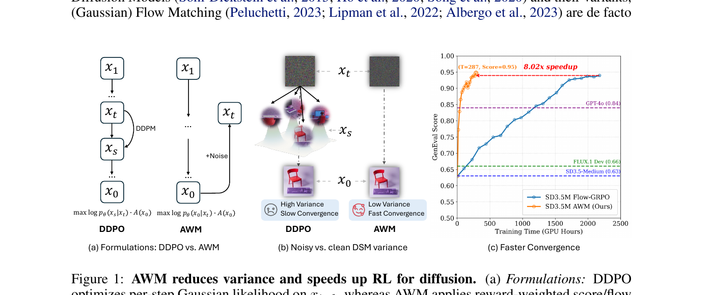
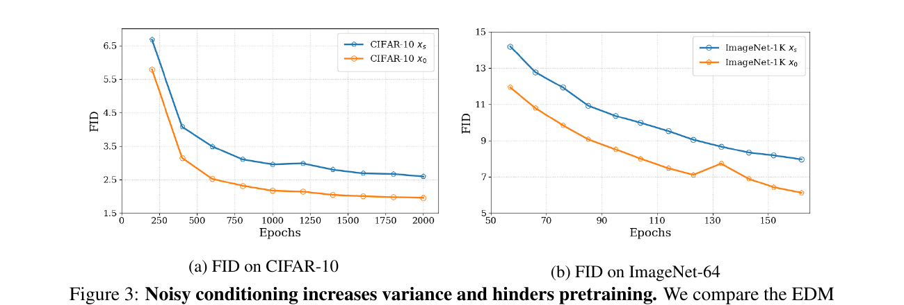
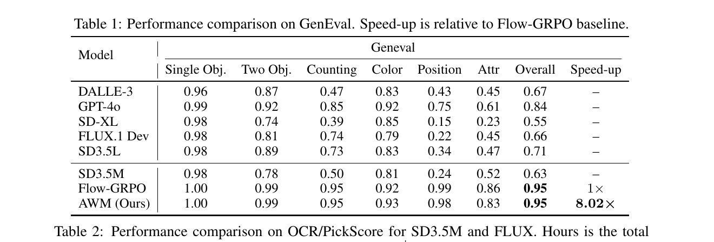
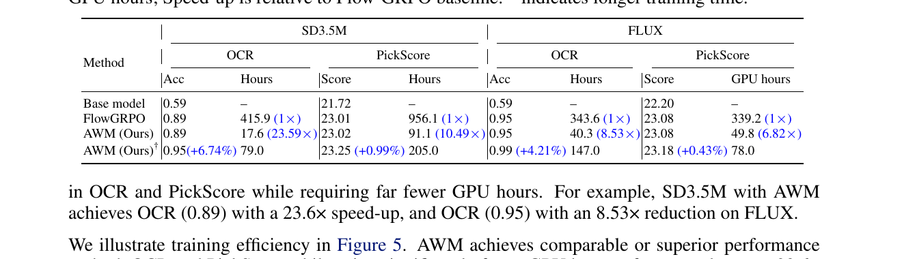
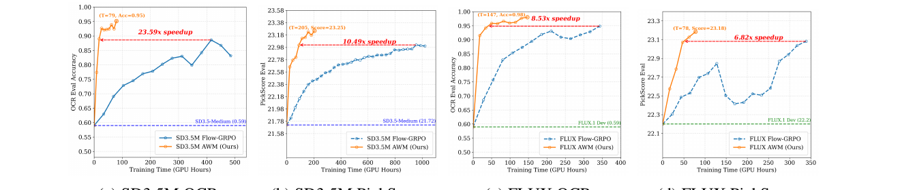
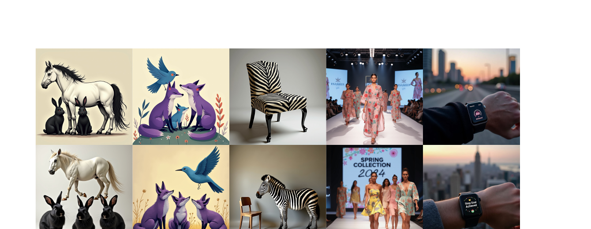
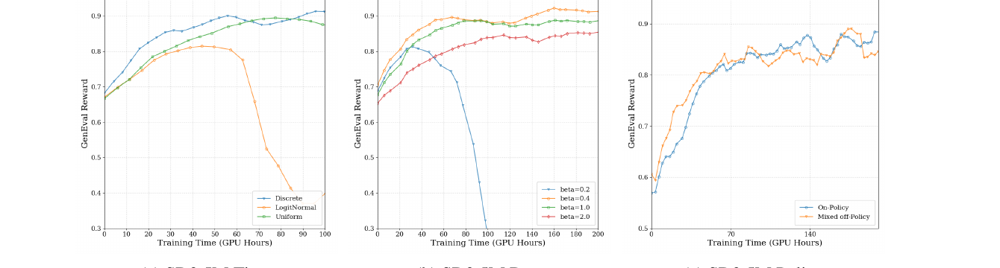

# Advantage Weighted Matching:
把扩散模型 RL 拽回到预训练目标

## 1. 出发点 (Motivation)

用一句"LLM 哲学"开篇: 在 LLM 里, **pretraining 和 RL 用的是同一个 likelihood**。SFT 是 $\log p_\theta(y|x)$, PPO/GRPO 也是 $\log p_\theta(y|x)$ 乘上 advantage; 只是权重不同。两个阶段共享同一个 surrogate, 所以彼此之间过渡很自然。

但扩散模型的 RL *没有*这个对称性:

- **Pretraining:** 优化 score / flow matching loss $\|v_\theta(x_t,t) - (\epsilon - x_0)\|^2$ — 对应 ELBO, 也就是 $\log p_\theta(x_0)$ 的一个紧上界。
- **RL post-training (DDPO / Flow-GRPO / DanceGRPO):** 把去噪展开成一个 multi-step MDP, 每一步反向转移 $p_\theta(x_{t-\Delta t}\mid x_t)$ 当成一个高斯策略, 优化 *per-step* 高斯对数似然。

这两个 likelihood 长得就不一样, 一个在 forward (clean $x_0$ 条件), 一个在 reverse SDE 离散化 (noisy $x_{t-\Delta t}$ 条件)。作者问出了那个"小学生都能问"但很少有人正经回答的问题:

> 为什么 RL 阶段不直接复用 pretraining 用的 flow matching loss? DDPO 那个 per-step likelihood, 它到底在优化什么?

本文先回答"它在优化什么"(§3), 再用答案推出一个新算法 AWM (§4)。结论简单到惊人 — 但它需要先建立两条理论桥梁。

<figure>
      
      <figcaption>Fig. 1 — 一页总结。(a) DDPO 在 $x_{t-\Delta t}$ 上做 per-step likelihood, AWM 在 $x_0$ 上做 reward-weighted score/flow matching。(b) noisy-DSM 的目标向量方差严格大于 clean-DSM。(c) 同样质量, AWM 在 GenEval 上 8× 少 GPU hours。</figcaption>
    </figure>

## 2. 方法 (Method)

### 核心思想 (类比)

想象你在教一个学生画画。两种 RL 教法:

- **DDPO 流派:** 让学生每完成一笔, 老师就根据 "这一笔与某个噪声参考的差距" 给反馈。但 "噪声参考" 本身是抖动的 — 老师每次抓的参照点都不一样, 反馈嘈杂, 学生学得慢。
- **AWM 流派:** 让学生画完整张画, 跟 *原始的、干净的* 目标比对; 整张画好的话, 把这次的所有笔触都加权放大; 整张画坏, 就反向压缩。参照点稳定, 信号干净, 学得快。

更技术地说: 同一个去噪过程, 同一个目标分布, 同一个 score 函数 $\nabla \log p(x_t)$, 你可以用 $x_0$ 当条件来估它 (clean DSM), 也可以用 $x_s$ ($s\lt t$) 当条件来估它 (noisy DSM)。两者 *期望相同, 都是 unbiased*; 但用 $x_s$ 当条件会 *放大目标向量的方差*。DDPO 优化的实际上就是 noisy-DSM, 多出来那个方差就是它收敛慢的根源。

### 2.1 背景: DDPO 在做什么

Flow Matching pretraining 的目标 (论文里默认用的 noise schedule $x_t = (1-t)x_0 + t\epsilon$):

—— 翻译: 喂进噪声样本 $x_t$, 让网络预测 "干净到噪声" 的方向 $\epsilon - x_0$。这是 ELBO 的一个紧致 surrogate, 等价于 $\log p_\theta(x_0)$ 的最大化。

DDPO 把 reverse-time SDE 离散化 (Euler–Maruyama, 步长 $\Delta t$):

这是个 isotropic Gaussian, mean 和 variance 都可解。于是 per-step log-likelihood $\log p_\theta(x_{t-\Delta t}\mid x_t)$ 是 tractable 的二次型, 把整个去噪轨迹当 MDP, 每步 likelihood 乘 advantage, 就是标准的 REINFORCE / PPO 套路。

问题是: 这个目标 **不是** flow matching loss。它的条件变量是 noisy 的 $x_t$ → 更 noisy 的 $x_{t-\Delta t}$。和预训练 (forward process: clean $x_0$ → noisy $x_t$) 方向相反。这一不对齐, 是后面所有 variance / 收敛慢的根源。

### 2.2 Theorem 1 — DDPO 偷偷在做带噪声的 DSM

第一个关键定理: 把上面那个 per-step 高斯似然展开, 忽略 Euler–Maruyama 的离散化误差, 它等价于 *用 noisy $x_{t-\Delta t}$ 做 conditioning 的 denoising score matching*:

—— 翻译: DDPO 那个 per-step likelihood loss, 在期望意义下等于 "用上一时刻的 noisy 状态 $x_{t-\Delta t}$ 当条件, 让 score 网络 $s_\theta$ 去拟合 $\log p(x_t\mid x_{t-\Delta t})$ 的梯度"。score / velocity 两种参数化下都成立。

这个定理把 DDPO 从 "策略梯度" 翻译成了 "score matching, 只是条件错了"。证明的关键是: forward process 的 $(x_{t-\Delta t}, x_t)$ 联合分布等于 reverse process 的联合分布 (Haussmann–Pardoux 反时间公式), 于是可以把 reverse-likelihood 重写成 forward-conditional 的 DSM 形式。

### 2.3 Theorem 2 — 用 noisy 条件, 方差就是更大

那"条件错了"会带来什么? Lemma 1 先告诉你 *不影响 minimizer* (两者期望都是 $\nabla\log p(x_t)$), 但 Theorem 2 告诉你 *影响方差*:

其中 noise gap 系数

—— 翻译: 用噪声 $x_s$ 而不是干净 $x_0$ 当条件, 估计 score 时多出一个 $d\cdot\kappa(s,t)$ 的 trace 方差 (其中 $d$ 是数据维度)。$\kappa$ 在 $s \in [0, t)$ 上严格递增, 且 $\kappa(0, t) = 0$ — 即 clean-$x_0$ 是这个家族里最低方差的那一个。

**数值直觉:** 设 $t = 0.5$, $s = 0.4$, 代入: $\kappa \approx \frac{0.25 \cdot 0.16}{0.25(0.36 - 0.04)} = \frac{0.04}{0.08} = 0.5$。如果 latent 维度 $d \approx 10000$, 多出来 5000 的 trace 方差 — 不小。这就是 DDPO "理论上对、实际上慢" 的根本原因。

<figure>
      
      <figcaption>Fig. 3 — 用 EDM 框架 (Karras 2022) 把"噪声 DSM"接进去做对照实验: 同样结构、同样 schedule、同样 batch, 用 $x_s$ 当条件 vs. $x_0$ 当条件。在 CIFAR-10 和 ImageNet-64 上, noisy-DSM 始终 FID 更高、收敛更慢。Theorem 2 的预测得到验证。</figcaption>
    </figure>

### 2.4 AWM 目标函数

既然 noisy-conditioning 是病根, AWM 的处方是: **把 RL surrogate 换成 clean-$x_0$ 的 flow matching loss**, 即预训练用的那个 — 然后把它当作 sequence-level policy $\log\pi_\theta(x_0\mid c)$ 的 ELBO surrogate, 嵌入 GRPO 的 ratio × advantage 框架。

问题重新表述 (paper §4):

<table style="margin: 1em 0; border-collapse: collapse;">
      <tbody><tr><th></th><th>DDPO 的 setup</th><th>AWM 的 setup</th></tr>
      <tr><td>State</td><td>$s_t = (c, t, x_t)$</td><td>$s = c$</td></tr>
      <tr><td>Action</td><td>$a_t = x_{t-1}$</td><td>$a = x_0$</td></tr>
      <tr><td>Policy</td><td>$\pi(a_t\mid s_t) = p_\theta(x_{t-1}\mid x_t,c)$</td><td>$\pi(a\mid s) = p_\theta(x_0\mid c)$</td></tr>
    </tbody></table>

—— DDPO 把 sampler 内部展开成 MDP; AWM 把 sampler 当成黑盒, 只看 input prompt → output image。

把 $\log \pi_\theta(x_0 \mid c)$ 用 flow matching ELBO 替换:

—— 翻译: 把 "生成 $x_0$ 的对数概率" 近似成 "flow matching 损失的负值"。$w(t)$ 是时间权重, 论文 §4 后面给出他们的发现: $w(t)=1$ (uniform) 在实践中最好。

于是 GRPO ratio 就可以用这个 ELBO surrogate 估:

注意 trick: 论文里特别强调, 计算 ratio 用的 timesteps 和 noise 必须在 $\pi_\theta$ 和 $\pi_{\theta_{\text{old}}}$ 之间共享 — 这是 variance reduction 的关键 (借鉴 LLaDA 1.5)。否则两个 estimator 之间的额外噪声会把 ratio 信号淹没。

KL 项也在 velocity 空间里写:

—— 翻译: 把 KL 用"两个 velocity 网络在同一 $(x_t,t)$ 上的输出差" 来近似 — 一个干净的 L2 项, 比标准 KL 估计稳定得多。

### 2.5 AWM 算法

论文 Algorithm 1 极其紧凑, 我把它逐行翻译:

```python
for i in range(num_training_steps):
    # 1) 用任意 sampler (ODE/SDE 都可以) 采样一组图像
    samples   = sampler(model, prompt)
    # 2) 算 reward
    reward    = reward_fn(samples)
    # 3) 算 advantage (group relative mean 或 value model baseline)
    advantage = cal_adv(reward, prompt)

    # 4) 给采样到的 x0 加噪 (forward process, AWM 训练永远在 clean x0 上)
    noise          = randn_like(samples)
    timesteps      = get_timesteps(samples)
    noisy_samples  = fwd_diffusion(samples, noise, timesteps)

    # 5) 前向: 当前策略 + ref 策略
    velocity_pred  = model(noisy_samples, timesteps, prompt)
    velocity_ref   = ref_model(noisy_samples, timesteps, prompt)

    # 6) "ELBO log-prob" = 负的 flow matching loss
    log_p   = -((velocity_pred - (noise - samples))**2).mean()
    ratio   = torch.exp(log_p - log_p.detach())          # on-policy ratio
    policy_loss = -advantage * ratio                       # GRPO 主项

    # 7) velocity-space KL
    kl_loss = weight(timesteps) * ((velocity_pred - velocity_ref)**2).mean()
    loss    = policy_loss + beta * kl_loss
```

就这 14 行。**关键观察**: 第 8 行那个 `log_p` 就是 negative flow matching loss — 跟预训练同一个 loss; 整个算法的 RL 性质完全来自 advantage 这个权重。结构上, AWM = "把 reward 当作每个样本的 loss 权重, 然后梯度照常下降"。

### 2.6 与代码对照

SD3.5-M 训练脚本的 log_prob 函数 — 看它怎么把 flow matching loss 翻译成 GRPO 里的 log-likelihood:

<p class="code-source">repo/advantage_weighted_matching/scripts/train_sd3_awm.py:L210–L252 — compute_log_prob_awm: 用 flow matching loss 做 sequence policy 的 ELBO surrogate</p>

```python
def compute_log_prob_awm(transformer, pipeline, sample, timestep, embeds, pooled_embeds,
                         config, noised_latents, clean_latents, random_noise, weighting='Uniform'):
    # ... transformer 前向 (省略 CFG 分支) ...
    noise_pred = transformer(hidden_states=noised_latents,
                             timestep=timestep.view(-1)*1000,
                             encoder_hidden_states=embeds,
                             pooled_projections=pooled_embeds,
                             return_dict=False)[0]

    sigma     = timestep
    std_dev_t = torch.sqrt(sigma / (1 - torch.clamp(sigma, 0, 0.99))) * 0.7   # ← 论文里没有的 0.7 系数

    model_output = noise_pred.double()
    # 核心: log_prob = -‖v_θ(x_t) - (ε - x_0)‖²  ← 就是负的 flow matching loss
    log_prob = -(model_output - (random_noise.double() - clean_latents.double()))**2
    log_prob = log_prob.mean(dim=tuple(range(1, log_prob.ndim)))

    # w(t) 的选择: 论文说 uniform 最好, 但默认 config 用的是 'ghuber'
    if   weighting == 'Uniform': log_prob = log_prob
    elif weighting == 't':       log_prob = log_prob * timestep.view(-1)
    elif weighting == 'huber':   log_prob = -(torch.sqrt(-log_prob + 1e-10) - 1e-5)* timestep.view(-1)
    elif weighting == 'ghuber':  log_prob = -(torch.pow(-log_prob + 1e-10, config.train.ghuber_power)
                                              - ...) * timestep.view(-1) / config.train.ghuber_power
    return log_prob, model_output, std_dev_t
```

这个函数把 flow matching loss *视作* log-likelihood (差一个负号), 然后 caller 在外面计算 `exp(log_p - log_p.detach())` 当作 GRPO 的 importance ratio。注意第 12 行的 `0.7` — 这不是从理论里推的, 而是工程经验; 论文没提。

主训练循环里的 policy + KL loss 装配:

<p class="code-source">repo/advantage_weighted_matching/scripts/train_sd3_awm.py:L1265–L1354 — 主 loop: ratio × advantage + velocity-space KL</p>

```python
# 1. forward — 同一份 noisy_latents, 喂给 current / ref / EMA 三个模型
timesteps      = sample["timesteps"]
noised_latents = (1-timesteps)*sample['clean_latents'] + timesteps*sample['train_random_noise']
log_prob,    model_output,     std_dev_t = compute_log_prob_awm(...)   # current θ
log_prob_ref, model_output_ref, _        = compute_log_prob_awm(...)   # ref θ_ref (LoRA disabled)
_,            model_output_ema, _        = compute_log_prob_awm(...)   # EMA  θ_ema

# 2. GRPO 主项 — advantage × clipped ratio (论文 §4 写"omit clip", 代码里实际用了 PPO clip)
ratio        = torch.exp(log_probs - old_log_probs.detach())          # exp_first 模式
unclipped    = -advantages * ratio
clipped      = -advantages * torch.clamp(ratio, 1.0 - clip_range, 1.0 + clip_range)
policy_loss  = torch.mean(torch.maximum(unclipped, clipped))           # PPO pessimistic max

# 3. velocity-space KL (Eq. 12) — 注意 'Uniform' / 'ELBO' 两种权重
kl_loss = ((model_output - model_output_ref)**2).mean(dim=(2,3,4), keepdim=True)
# 若 kl_weight=='ELBO': 再除以 (2 * std_dev_t**2)

# 4. EMA 额外正则项 (论文里没出现的工程项, 但默认 enabled 在所有 dgx 配置里)
ema_kl_loss = ((model_output - model_output_ema)**2).mean(...)

loss = policy_loss + beta*kl_loss + ema_beta*ema_kl_loss
```

对照 Algorithm 1: **论文版是 2 项 (policy + KL), 代码版是 3 项** — 多了对 EMA 模型的额外 L2 正则 (`ema_beta * ema_kl_loss`, 默认 `ema_beta=1`, `ema_decay=0.99`)。这一项在论文里没有讨论, 但所有 SD3.5-M 的标准配置里都打开了。也就是说, 实际跑出来 24× speedup 的 setup, 比纸面算法多了一层 EMA 自蒸馏式正则。

## 3. 结论 (Key Findings)

**主表 (GenEval, SD3.5-M):** AWM 跟 Flow-GRPO 在最终 GenEval 分数上打平 (都是 0.95), 但用 8.02× 少的 GPU hours。base model SD3.5-M 是 0.63, GPT-4o 是 0.84, 所以 AWM/Flow-GRPO 都是 SoTA 水平 — 关键是 AWM *同等终态下省了 8×*。

<figure>
      
      <figcaption>Tab. 1 — GenEval. AWM 8.02× 速度优势, 同 0.95 总分。注意 Counting (0.95), Color (0.93), Position (0.98) 几个子任务都跟 Flow-GRPO 持平甚至更好。Attr 上略低 (0.83 vs 0.86)。</figcaption>
    </figure>

**跨任务跨 backbone:** 在 OCR 和 PickScore 两个任务、SD3.5-M 和 FLUX 两个 backbone 上, AWM 全面领先 Flow-GRPO 的 speedup:

<figure>
      
      <figcaption>Tab. 2 — OCR 和 PickScore. SD3.5-M 上 OCR 加速 <strong>23.59×</strong> (17.6 vs 415.9 GPU h), PickScore 加速 10.49×。FLUX 上 OCR 加速 8.53×, PickScore 6.82×。带 † 的行是 "继续训" 版本, 比 Flow-GRPO 同等时间多 4-6 个点。</figcaption>
    </figure>

**训练曲线视角:** 同一 GPU hour 切片下 AWM 全程领先, 不只是终态:

<figure>
      
      <figcaption>Fig. 5 — 4 个任务 × backbone 组合的训练效率曲线。AWM (橙) 在 every wall-clock point 都比 Flow-GRPO (蓝) 高, 不是简单 "快了就停" — 是同时间点 metric 更好。</figcaption>
    </figure>

**视觉验证 (FLUX, 100 步训练):** 训练 100 个 gradient step 之后, 多物体计数 / 颜色 / 文本渲染都明显改善 — 这表明 AWM 不只是 metric 上对 reward, 也真的提升了对 prompt 的遵循度:

<figure>
      
      <figcaption>Fig. 6 — 上行: FLUX baseline; 下行: AWM 训练 100 步后。"three black rabbits below one white horse"、"three purple foxes below one blue bird" 这种数物体颜色定位的, 以及右侧 OCR 的 "Spring Collection 2024" 文本, 训练后明显更准。</figcaption>
    </figure>

**消融 (GenEval, SD3.5-M):** 三个 ablation 都"按预期"工作:

<figure>
      
      <figcaption>Fig. 7 — (a) Timestep 分布: discrete 跟 uniform 表现近似, logit-normal 在 RL 阶段后期反而崩 (注意 RL 跟 pretraining 不一样, 不要用 logit-normal 这种"中心化"分布)。(b) KL 强度 β: β=0.2 太弱会崩, β=2.0 太强学不动, β∈[0.4,1.0] 是甜区。(c) On-policy vs 一步 off-policy: 几乎没差别, 这意味着 AWM 天然支持 batch reuse, 为更深的 off-policy 留了空间。</figcaption>
    </figure>

**关键数字汇总:**

- SD3.5-M GenEval: `0.95 / 8.02×` (vs Flow-GRPO 0.95 / 1×)
- SD3.5-M OCR: `0.89 / 23.59×`
- SD3.5-M PickScore: `23.02 / 10.49×`
- FLUX OCR: `0.95 / 8.53×`
- FLUX PickScore: `23.08 / 6.82×`

## 4. 实现细节 (Implementation Notes)

下面这些是代码里跑通的细节, 但论文 §5 里没充分讨论 — 想复现的话每一条都得读一遍:

- **核心超参 (SD3.5-M GenEval):** LoRA $r=32, \alpha=64$; lr $3\!\times\!10^{-4}$ (const); group size $G=24$; `train_timesteps=6` (注意: 论文 §5 说 "total train timesteps of 4", 代码默认是 6 — 差 50%); `sample.num_steps=14` 训练时采样, `eval_num_steps=40` 评估时采样, 这就是论文说的"decouple sampling/training". `repo/advantage_weighted_matching/config/dgx_awm.py:L37–L56`
- **$\beta$ 跟论文不一致:** 论文 §5 开头说 "$\beta = 0.4$ for GenEval and OCR, $\beta = 0.01$ for PickScore"。实际代码默认: GenEval `beta=0.001`, OCR `beta=0.003`, PickScore `beta=0.0001` — *整整差 2–3 个数量级*。这是一个明显的论文 ↔ 代码 gap。猜测论文的 $\beta$ 是早期实验的、未更新到 release 配置里, 或者论文的 $\beta$ 对应另一种 KL 权重 (ELBO vs Uniform) 下的等效值, 但作者没说清。`repo/advantage_weighted_matching/config/dgx_awm.py:L55,L194,L333`
- **w(t) 实际默认不是 uniform:** 论文 §4 明确说 "uniform weight $w(t)=1$ works better", 但 release 配置里 `weighting='ghuber'`, `ghuber_power=0.25` — 一种乘以 $t$ 的广义 Huber 权重 ($\propto t \cdot \mathrm{MSE}^{0.25}$)。这跟论文最后定下的"uniform"叙事矛盾。如果你按论文设 `weighting='Uniform'`, 复现到的 speedup 可能比 24× 小。`repo/advantage_weighted_matching/scripts/train_sd3_awm.py:L240–L249`
- **PPO clip 没有"omit":** 论文 Eq. 9 后面写 "For simplicity, we omit the clip operation here"。但代码里有标准 PPO clip, 默认 `clip_range=1.0` (相当宽松, 几乎不裁), 但 `train_sd3_awm.py:L1318–L1325` 里 unclipped/clipped 都算。clip_range 这个量级 (1.0) 跟标准 PPO (0.1–0.2) 差很多, 实际上是 "假装有 clip 但不真 clip"。`repo/advantage_weighted_matching/scripts/train_sd3_awm.py:L1318–L1325`
- **EMA 自蒸馏 — 论文未提的关键组件:** 默认所有 SD3.5-M 配置都开了 `ema=True`, `ema_beta=1.0` (跟主 KL 同权), `ema_decay=0.99`。第三个 L2 项 `‖v_θ - v_ema‖²` 跟 ref-KL 量级一样, 等于又加了一层蒸馏式正则。Algorithm 1 里没出现。`repo/advantage_weighted_matching/scripts/train_sd3_awm.py:L1341–L1349`
- **std_dev_t 里的 0.7:** `std_dev_t = sqrt(t/(1-clamp(t,0,0.99))) * 0.7` — 这个 0.7 没有理论出处, 也不在论文里讨论。它只在 `kl_weight=='ELBO'` 分支里参与 (做分母), uniform 分支不用。可能是经验校准。`repo/advantage_weighted_matching/scripts/train_sd3_awm.py:L236`
- **共享 noise/timesteps 做 variance reduction:** 论文提了一嘴 ("shared timesteps and noise for $\pi_\theta$ and $\pi_{\theta_{\text{old}}}$ from LLaDA 1.5"), 但其重要性被低估 — 如果 current/old 用不同 noise, ratio 估计的方差会爆炸, 整个 AWM 就回退到 "noisy ELBO ratio" 的灾难场景。代码里通过把 noised_latents、timesteps 在两次 forward 之间复用来实现。`repo/advantage_weighted_matching/scripts/train_sd3_awm.py:L1232–L1268`
- **"exp_first" vs "sum_first" loss type:** 代码提供两种 ratio 聚合方式 — exp_first 在每个 (sample, timestep) 上单独算 ratio, sum_first 在每个 sample 上把所有 timesteps 的 log_p 平均后再 exp。默认 `exp_first` — 即"每个时间步当成一个独立 transition", 而不是按 sequence-level policy 严格写。这跟 §4 的 "sequence-level conditional policy" 叙事有微妙不一致。`repo/advantage_weighted_matching/scripts/train_sd3_awm.py:L1301–L1310`
- **时间步采样: discrete + shift:** 默认 `time_type='discrete_wo_init'`, `time_shift=3.0`。论文 Fig. 7a 比较了 discrete / uniform / logit-normal, 选了 discrete; 但 `time_shift=3.0` 这个 SD3 系列特有的 shift 参数没在正文出现。这个 shift 影响时间步在 high-noise 区的密度, 对 RL 阶段的 reward 信号 sensitivity 不算小。`repo/advantage_weighted_matching/config/dgx_awm.py:L88–L89`
- **advantage 双重 clamp:** 先 `torch.clamp(adv, -5, 5)` (`adv_clip_max=5`), 再 `adv / 5 * advantage_max` (`advantage_max=1`), 等于把 advantage 归到 $[-1, 1]$。这是 PPO 实践里"防止 reward 量级失控"的标准操作。`repo/advantage_weighted_matching/scripts/train_sd3_awm.py:L1293–L1299`

顺手贴一下"四项 loss 装配"代码 — 这是 §3 Algorithm 1 在 release 代码里的真身:

<p class="code-source">repo/advantage_weighted_matching/scripts/train_sd3_awm.py:L1330–L1354 — 最终 loss 装配</p>

```python
if config.train.beta > 0:
    model_output     = sample['model_output']
    model_output_ref = sample['model_output_ref']
    std_dev_t        = sample['std_dev_t']
    if config.train.kl_weight == 'ELBO':
        kl_loss = ((model_output - model_output_ref) ** 2).mean(dim=(2,3,4), keepdim=True) / (2 * std_dev_t ** 2)
    elif config.train.kl_weight == 'Uniform':
        kl_loss = ((model_output - model_output_ref) ** 2).mean(dim=(2,3,4), keepdim=True)
    kl_loss = kl_loss.mean(dim=0).mean()

    if config.train.ema_beta > 0:
        model_output_ema = sample['model_output_ema']
        if config.train.kl_ema_weight == 'ELBO':
            ema_kl_loss = ((model_output - model_output_ema) ** 2).mean(...) / (2 * std_dev_t ** 2)
        elif config.train.kl_ema_weight == 'Uniform':
            ema_kl_loss = ((model_output - model_output_ema) ** 2).mean(...)
        ema_kl_loss = ema_kl_loss.mean(dim=0).mean()
        loss = policy_loss + config.train.beta * kl_loss + config.train.ema_beta * ema_kl_loss
    else:
        loss = policy_loss + config.train.beta * kl_loss
else:
    loss = policy_loss
```

一眼能看到的 **paper-vs-code gap 综合**: 论文写 "policy_loss + β·KL" (2 项); 代码默认在所有 SD3.5-M 配置里是 "policy_loss + β·KL_to_ref + ema_β·KL_to_EMA" (3 项), 后两项量级几乎相同。也就是说 release 版的 "AWM" 多了一层 EMA 自蒸馏。

## 5. 批判性总结 (Critical Assessment)

### 优点

- **理论桥真的搭起来了。** Theorem 1 给出 "DDPO = noisy DSM" 的精确等价, Theorem 2 量化了多出来的 $d\cdot\kappa(s,t)$ 方差。这是这类 RL 工作里少见的 "先解释清楚 baseline 在干什么, 再提改进" 的姿势 — 比 "我们换了个 loss 性能上去了" 信息量大很多。
- **解耦 sampling 和 training 是真的有用。** AWM 不绑定 Euler-Maruyama, 可以用 14 步采样 + 6 步训练, 也能换更快的 ODE solver (SA-Solver、DPM-Solver)。Flow-GRPO 因为要在每一步 sampler 里算 likelihood, 这条路被 lock 死了。
- **EDM 上的 ablation 干净利落。** Figure 3 是 hard control: 同样架构、同样 schedule、只换条件变量。FID 差距清晰。这种 "把理论假设单独 isolate 出来验证" 的实验设计, 比直接在 SD3.5-M 上对比说服力强很多。
- **速度数字够极端。** 8–24× 不是 1.x× 那种"在 noise floor 内"的优势, 是质变级别的。即使有部分来自工程优化, 主张 "我们更快" 的余量很大。
- **FMPG 同期工作有引用并区分。** 文章承认 McAllister et al. (2025) FMPG 是 concurrent work — 也用 ELBO 当 policy likelihood — 但指出他们 (i) 没建立 DDPO ↔ DSM 的等价 (ii) 没在 T2I 上做实验。这两点是 AWM 真正独特的地方。

### 不足 / 疑点

- **论文 vs 代码的关键超参不一致。** §4-Implementation Notes 里列了至少 5 条, 最严重的是 $\beta$ 差 100-1000×, $w(t)$ 用 ghuber 而不是 uniform, EMA 自蒸馏在论文里完全不存在。这意味着 release 版的 "24× speedup" 是 *AWM 框架 + 一堆未公开的工程 trick* 共同的结果, 不是 §4 那个干净算法的结果。
- **对 Flow-GRPO baseline 是否调到位有疑问。** Flow-GRPO 的 415.9 GPU hours 是其默认配置, 但 AWM 在自家配置上做了 EMA、ghuber、advantage clamp、time shift 等工程加成。如果给 Flow-GRPO 同等工程预算, 速度差距会缩多少没有讨论。
- **"24×" 这个数字 cherry-picky.** 它是 SD3.5-M OCR 上的最大值 (23.59×), 其他组合 (FLUX OCR 8.5×, FLUX PickScore 6.8×) 大体在 6–10× 区间。Title/Abstract 用 "up to 24×" 没错, 但容易让人误以为是 typical 值。
- **方差分析是 vacuum 里的, 没量化到 wall-clock。** Theorem 2 说 noisy-DSM 多 $d\cdot\kappa(s,t)$ 的 trace 方差。但 RL 阶段的实际 gradient signal-to-noise 还受 reward variance、advantage 量级、KL 强度多重影响。论文没告诉你"方差减小 X% → 收敛快 Y×"的桥, 只能定性归因。
- **"AWM 跟预训练 unified"的卖点偏强。** 严格说, AWM 的 ratio 用了 stop-grad trick (`exp(log_p - log_p.detach())`) 把 policy gradient 形式还原出来, 这跟 pretraining 那个标准 MSE loss 还是不一样的优化对象。"loss 一样" 的说法成立, "优化器看到的目标一样" 不成立。
- **没和 ReFL / DRaFT / DPO 系列定量对比。** 文章把它们写在 Related Work 里 (§2.1.1, §2.1.3), 但 Table 1/2 只跟 Flow-GRPO 对比。读者无法判断 "在 differentiable reward 场景下 ReFL 是不是更快"。
- **FLUX 上的 saturation 现象没讨论。** Table 2 里 FLUX PickScore 是 23.08 vs 23.08 (完全打平), AWM 的优势只在 GPU hours 上。可能 PickScore 这个 reward 在 FLUX 上已经接近 ceiling, 但论文没分析这一点 — 反而把它跟 "8.5× speedup" 并列展示。

### 适用 vs 不适用

- ✅ 适用: 任何用 flow matching / score matching 预训练的扩散模型 (SD3.5-M, FLUX, SDXL, …) 做 RL post-training; reward 是 non-differentiable 的 (GenEval, OCR rule-based, human preference scorer); 计算预算紧, 想用更少 GPU hours 达到同等 reward。
- ❌ 不太适用 / 已有更好方案: reward 是 differentiable 且预算充裕 (此时 ReFL/DRaFT 直接 backprop 可能更快); 极少步采样 (≤4 步) 蒸馏模型 (此时 ELBO surrogate 的 tightness 退化, AWM 优势不一定保持); 想要严格 KL-controlled fine-tuning (AWM 的 velocity-space KL 是个 surrogate, 不是真 KL)。
- ❓ 待验证: 视频扩散 (paper 只在 image T2I 上); 大 group size (G>24); 多模态条件 (除了 text)。

### 进一步阅读

- **FMPG (McAllister et al. 2025)** — Concurrent work, 同样用 ELBO 做 policy likelihood, 但没做 T2I 实验, 也没建 DDPO ↔ DSM 桥。
- **Flow-GRPO (Liu et al. 2025) / DanceGRPO (Xue et al. 2025)** — AWM 主要对照, 都是 DDPO 框架在 flow matching 模型上的应用。
- **MixGRPO (Li et al. 2025a) / BranchGRPO (Li et al. 2025b) / TempFlow-GRPO (He et al. 2025)** — 同时期的"在 DDPO 内部找加速"的工作。AWM 的对照思路是 "DDPO 本身就是病, 不在它内部修"。
- **EDM (Karras et al. 2022)** — Theorem 2 验证用的 codebase, 也是当下 score matching 实现的事实标准。
- **Variance Reduction in Policy Gradient (Greensmith et al. 2004)** — 经典 baseline-subtraction 文献, AWM 的 group-relative advantage 也属于这个家族。
- **LLaDA 1.5 (Zhu et al. 2025)** — shared timesteps/noise variance reduction 的来源, 这个 trick 在 AWM 里至关重要。

<footer>
    <hr/>
    <p class="meta">Read on 2026-05-15 · Generated with the reading-papers skill</p>
  </footer>
