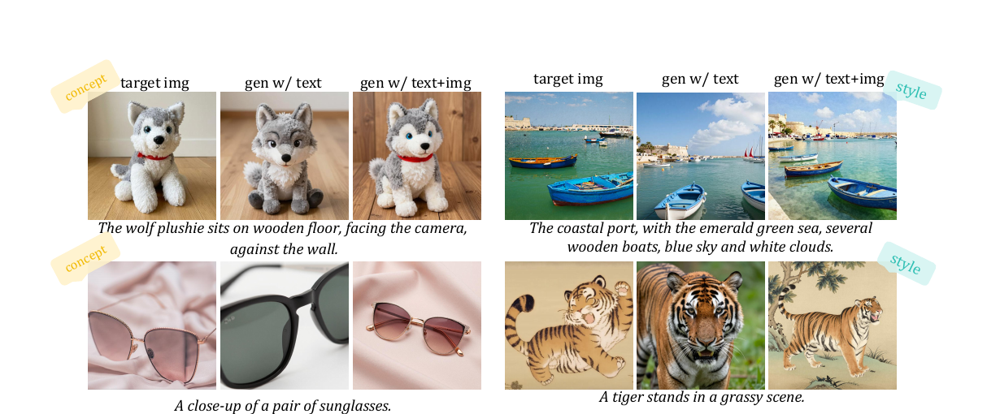
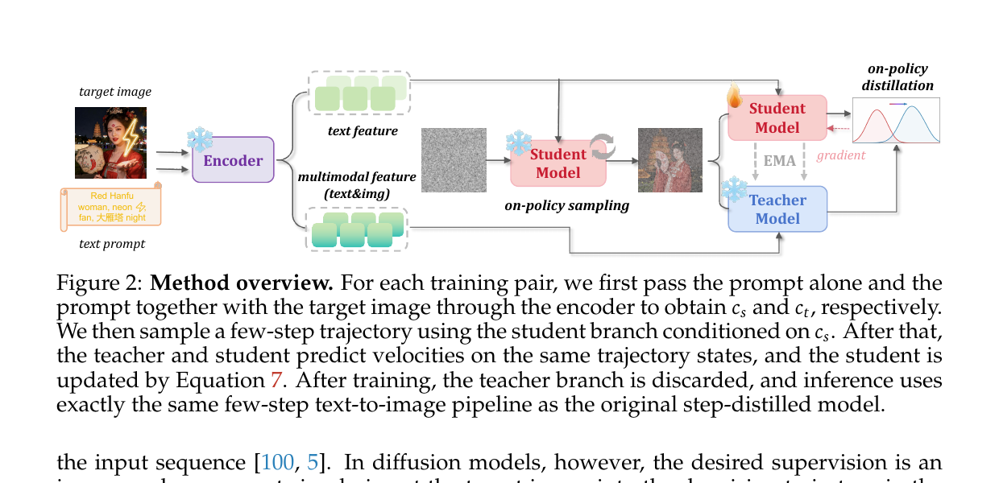
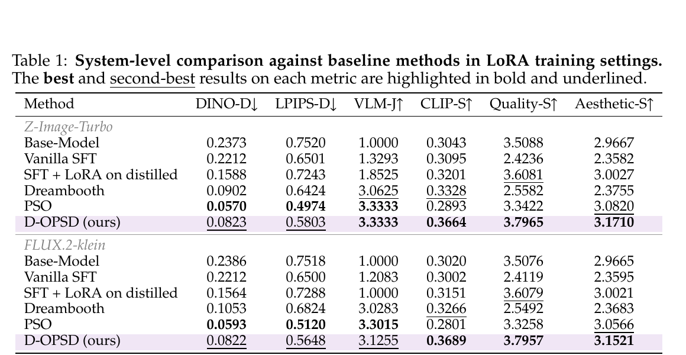
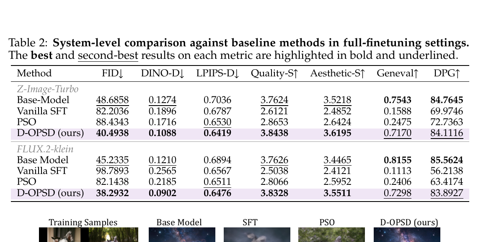
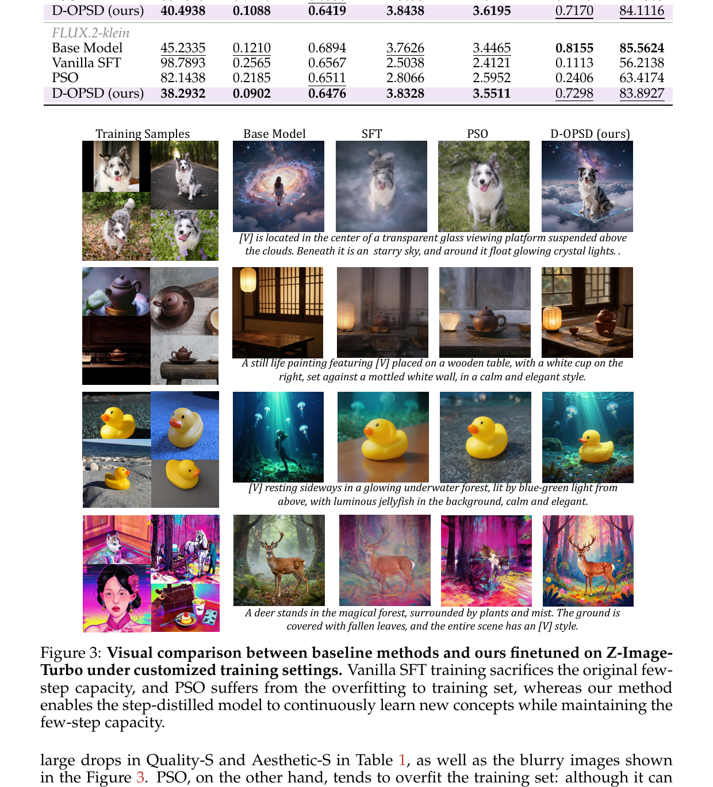
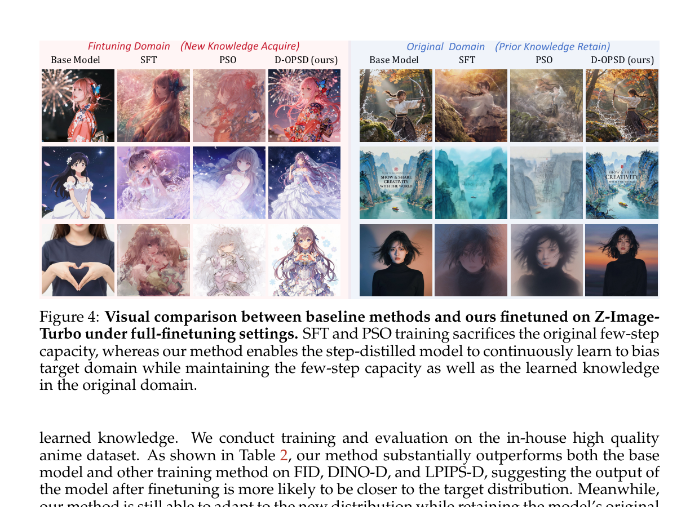
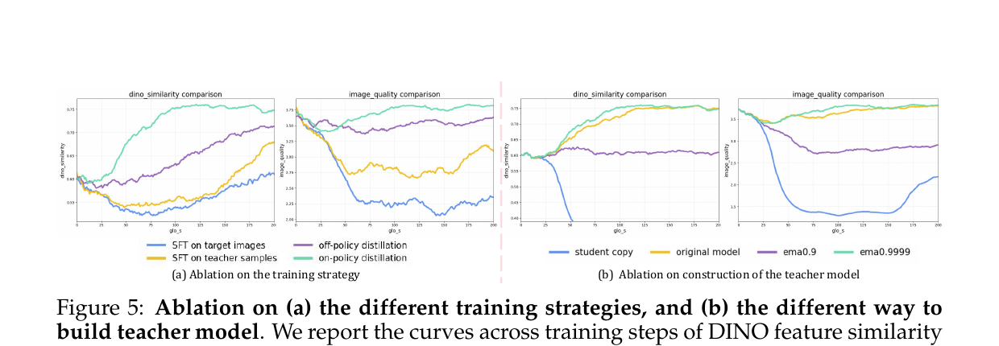

# D-OPSD: On-Policy Self-Distillation for Continuously Tuning Step-Distilled Diffusion Models

## 1. 出发点 (Motivation)

2026 年的 T2I 主战场是 **step-distilled diffusion models** — Z-Image-Turbo (6B, 8 步)、FLUX.2-klein (4B, 4 步) 这种"少数几步出图"的型号已经把多步模型(Stable Diffusion 3.5、FLUX-dev)挤下生产线。问题是:*怎么继续 fine-tune 这些模型?*

三条路全部不通:

- **Vanilla SFT (flow-matching loss):** 把目标图 $x_0$ 加噪后喂给模型,用 flow-matching 速度场监督。多步模型扛得住,但 step-distilled 模型只有 4/8 步,训练状态*不在*模型自己采样路径上 — 一训就把蒸馏好的少步动态毁掉,Quality-S 从 3.50 掉到 2.42,生成图变模糊。
- **Online RL (ReFL / Flow-GRPO):** 这条路本来对 step-distilled 模型友好 (训练状态来自模型自己采样,跟推理对齐),但*需要 reward function*。社区二级开发者只有几张图加 prompt,设计不出 reward。
- **Offline preference RL (PSO / Diffusion-DPO):** 折中,但优化状态仍由目标图诱导,不是模型自己访问的状态 — 实验里小数据上过拟合训练集,大数据上跟 SFT 一样塌掉。

论文要的是一个组合方案: **(a) 在模型自己 roll-out 的状态上更新 (b) 用 image-text pair 当监督,不要 reward**。

LLM 那边的 **On-Policy Self-Distillation (OPSD)** 正好满足 — DeepSeek-V4、Mimo v2 都在用。同一个模型扮演 student (弱 context) 和 teacher (强 context,比如带 ground-truth answer 的 in-context),在 student 自己采样的输出上做 self-distillation。但 OPSD 怎么"翻译"到扩散模型?

**论文的核心观察 (Fig. 1):** 现代 T2I 模型 (Z-Image, FLUX.2) 都用 LLM/VLM 作为文本编码器。*这些 VLM 编码器的 in-context 能力被下游 diffusion 模型继承了。*把 prompt 和 target image 一起喂给 VLM,得到的 multimodal feature 当 condition,扩散模型不需要任何额外训练就能生成"保留 target 概念/风格但符合 prompt 的变体"。

<figure>
      
      <figcaption>Fig. 1 — 用 Z-Image-Turbo (8 步) 在<em>不训练</em>的前提下做的实验。左列:target 图 (狗、海港、太阳镜、老虎);中列:只用 text prompt 生图;右列:用 text + target_img 经 VLM 编码后的 multimodal feature 当 condition 生图。后者保留了 target 的概念/风格,但又遵守 prompt。这就是 D-OPSD 的"免费 teacher"。</figcaption>
    </figure>

这条 emergent 性质给了天然的 teacher — 同一个模型,只是 condition 不同。后面的事就顺理成章:让 student (text-only condition) 在它自己的少步采样轨迹上,被 teacher (text+target_img condition) 的速度场预测监督。

## 2. 方法 (Method)

### 核心思想 (类比)

把 step-distilled 扩散模型想象成一个学了"4 笔速写"的画家,他原本能用 4 笔出一张高质量的猫。现在你要他学画"你家具体那只英短"。三种教法:

- **Vanilla SFT:** 拿你家英短的照片 $x_0$,加一点噪声做成 $x_t$,让他从 $x_t$ 起步还原 $x_0$。问题:这条路径上的中间状态他*4 笔速写时从来没见过* — 你逼他在"陌生的纸张涂鸦上"补线,他原本 4 笔出图的肌肉记忆就被你打乱了。
- **RL with reward:** 让他自由发挥,你给每张图打分。问题:你得是评委,而很多人当不了评委。
- **D-OPSD:**
        <ul>
          <li>让画家自己用他熟悉的 4 笔速写方式画一张"英短"(student roll-out — 他自己的轨迹)。</li>
          <li><em>同一个画家</em>,但这次给他<em>看着你家英短照片</em>(target image 进 VLM 当 in-context),他能画出一只更像你家英短的草稿 (teacher prediction)。</li>
          <li>训练目标:让他不看照片时画出的每一笔,尽量接近他看着照片时画出的每一笔 — 但所有这些"笔"都<em>评估在他自己的少步轨迹上</em>,他熟悉的纸张上,不破坏 4 笔速写的肌肉记忆。</li>
        </ul>

关键 trick:teacher 不是另一个模型,就是同一个模型给了更多 context (target image)。

<figure>
      
      <figcaption>Fig. 2 — 总体框架。Encoder 是 VLM (Qwen3-VL for Z-Image),从 text 得到 $c_s$,从 text+img 得到 $c_t$。Student model (条件 $c_s$) 做 on-policy 少步采样得到轨迹 ${x_{t_k}^s}$;Teacher model (条件 $c_t$,与 student 共享 backbone,只是 LoRA 参数不同,EMA 更新) 在<em>同一</em>状态上预测速度场;loss 是两者 MSE。推理时丢掉 teacher 分支,完全保留原少步 T2I pipeline。</figcaption>
    </figure>

### 2.1 涌现的 in-context 能力 — D-OPSD 的物理基础

论文最重要的实证 claim 是 Fig. 1 揭示的那条 emergent 性质:

> *当现代 T2I 模型 (LLM/VLM 编码器 + diffusion decoder) 把 prompt 和 target image 一起送入编码器,所得 multimodal feature 当 condition 时,模型直接就能生成"保留 target 概念/风格但符合 prompt"的变体 — 不需要任何额外训练。*

这个能力*不是* diffusion 学的,而是它从编码器 (Qwen3-VL / FLUX.2 的 LLM encoder) 那里"继承"过来的 — LLM 本来就懂 image+text 的多模态 in-context。下游 diffusion 模型只是把这种 in-context 隐式地翻译成图像条件。

Appendix A 在 FLUX.2-klein 上重复了这个实验,行为一致,说明这是一个 broadly applicable 性质,不限于 Z-Image。*没有这条性质,D-OPSD 就不成立* — Fig. 6 也说了,如果 teacher (即"模型 + target image context")不能生成合理图,训练就会失败。

### 2.2 OPSD 在扩散域的形式化

**从 LLM 的 OPSD 出发 (Eq. 1):**

$q$ 是 query,$r$ 是 stronger context (in-context example / ground-truth answer)。student 用弱 context $q$ 采样,teacher 用强 context $(q, r)$ 评估。

**翻译到扩散:** 把 $q$ 当 text prompt $y$,$r$ 当 target image $x_0$。两个 condition:

$f_{\text{text}}$ 只编 text,$f_{\text{mm}}$ 编 text + image。两者共享同一个 VLM encoder。

**Student on-policy 采样轨迹 (Eq. 3):**

$\Phi$ 是与推理*完全相同*的少步 solver(Z-Image 是 8 步,FLUX.2-klein 是 4 步)。从 Gaussian 噪声 $x_{t_K}^s \sim \mathcal{N}(0, I)$ 出发,student 用自己的 text-only condition 走完整条少步链 — 这就是 on-policy 的物理含义。

**同一轨迹上的两套预测 (Eq. 5-6):**

$\bar\theta$ 是 teacher 参数 (EMA 副本)。*关键:teacher 评估的是 student 的状态 $x_{t_k}^s$,不是 teacher 自己采样的状态* — 否则就退化成普通蒸馏。

**D-OPSD 损失 (Eq. 7):**

$\mathrm{sg}$ 是 stop-gradient — teacher 不接受梯度,梯度只走 student。直觉:把 student 在自己轨迹上的速度场,拽向 teacher 在同一状态上的速度场;teacher 因 multimodal context 知道更多 target 信息,所以它的速度场指向"target-aware"方向。

**为什么 D-OPSD 不破坏少步能力?**

1. **训练状态 = 推理状态** — student 用真正的少步 solver 采轨迹,优化全部发生在这些状态上,没有任何"训练时见、推理时见不到"的中间噪声状态。
2. **无 ground-truth velocity 监督** — 不像 SFT 把模型往一个外部目标拉,supervision 来自 model 自己 (under stronger context),与原少步动态高度兼容。
3. **推理时 teacher 分支整个丢弃** — pipeline 与原 step-distilled 模型逐字相同,没有任何 inference overhead。

### 2.3 完整算法 + 直觉

论文 Algorithm 1 的简化版:

1. 采一个 batch 的 $(x_0, y)$。
2. 编码两个 condition: $c_s = f_{\text{text}}(y)$, $c_t = f_{\text{mm}}(y, x_0)$。
3. 从噪声 $x_{t_K}^s \sim \mathcal N(0, I)$ 开始,用 student 跑完整条少步链 (with 与训练同条件 $c_s$)。
4. 每一步 $k = K, \ldots, 1$:
        <ul>
          <li>$u_k^s \leftarrow v_\theta(x_{t_k}^s, t_k, c_s)$</li>
          <li>$u_k^t \leftarrow v_{\bar\theta}(x_{t_k}^s, t_k, c_t)$ — <em>同一</em> $x_{t_k}^s$</li>
          <li>累加 $\frac{1}{K}\|u_k^s - \mathrm{sg}(u_k^t)\|_2^2$</li>
          <li>用 $u_k^s$ stepping 到 $x_{t_{k-1}}^s$ (并 detach 避免跨步 BPTT)</li>
        </ul>
5. 反向传播,更新 student $\theta$ (用 LoRA 时只更新 student LoRA adapter)。
6. EMA 更新 teacher: $\bar\theta \leftarrow 0.9999\,\bar\theta + 0.0001\,\theta$ (Section 3.3 ablation 选的最优值)。

**三个会被错过的细节:**

1. **跨步 detach.** 代码 (`train_dopsd.py:L554`) 每步都 `latents_student.detach().requires_grad_(True)`,只让梯度在当前一步内流动。否则会 BPTT 整个少步链,显存爆。
2. **Teacher 即 EMA student.** Teacher 不是另一个模型,而是 student 的 EMA 副本 (实现为同一 transformer 上的第二个 LoRA adapter)。EMA decay = 0.9999 (paper §3.3) — 大动量意味着 teacher 比 student 落后约 10000 步,提供平滑稳定的对齐目标。
3. **x_0 损失 vs v 损失 (paper-vs-code 不一致).** 代码 `train_dopsd.py:L600` 用 `F.mse_loss(x_0_student, x_0_teacher.detach())` — 对照 $x_0 = x_t + (1 - t)\, v$,这等价于*带时间权重的* velocity MSE(早 t 时刻权重大)。代码注释明说"different as shown in our paper... leads to faster convergence"。一个老实的 admission。

### 2.4 与代码对照

**(a) 双 LoRA adapter 在同一 transformer 上** — Student 训练,Teacher 冻结由 EMA 更新。这是 D-OPSD 最重要的工程优化 — 不复制 6B 模型,只多一份 LoRA。

<p class="code-source">repo/z-image-turbo_self-distill-vlm/ema_utils.py:L31-L91 — 双 LoRA 初始化</p>

```python
def init_dual_lora_transformer(
    transformer,
    lora_rank=16,
    lora_alpha=16,
    target_modules=None,
    current_adapter_name="current",
    old_adapter_name="old",
    old_init_from_current=True,
):
    """
    Attach two LoRA adapters to the same transformer:
      - current: trainable
      - old: frozen, updated via EMA
    """
    # Freeze the base model
    for p in transformer.parameters():
        p.requires_grad = False

    lora_config = LoraConfig(r=lora_rank, lora_alpha=lora_alpha,
                             init_lora_weights="gaussian",
                             target_modules=target_modules)

    transformer = get_peft_model(transformer, lora_config, adapter_name=current_adapter_name)
    transformer.add_adapter(old_adapter_name, lora_config)
    transformer.set_adapter(current_adapter_name)

    set_adapter_trainable(transformer, current_adapter_name, True)
    set_adapter_trainable(transformer, old_adapter_name, False)

    if old_init_from_current:
        copy_lora_adapter_weights(transformer,
                                   src_adapter=current_adapter_name,
                                   dst_adapter=old_adapter_name)
    return transformer
```

训练时通过 `gen_model.set_adapter("student" / "teacher")` 切换。两份 LoRA 在显存里共存,但只前向其中一个 — 这就是为什么论文 §4 说 "roughly 4× FLOPs and 2× wall time" 而*不是* 2 倍显存。

**(b) D-OPSD 主训练循环** — 实现 Eq. 5-7 + Algorithm 1。这一段是论文心脏,逐字对照 paper 公式。

<p class="code-source">repo/z-image-turbo_self-distill-vlm/train_dopsd.py:L541-L611 — D-OPSD 训练主循环</p>

```python
for back_step in range(len(timesteps)):
    t = timesteps[back_step].expand(bsz) / 1000
    if back_step < len(timesteps) - 1:
        next_t = timesteps[back_step + 1].expand(bsz) / 1000
    else:
        next_t = torch.ones_like(t)
    dt = next_t - t

    # detach current state to avoid cross-timestep BPTT
    latents_student = latents_student.detach().requires_grad_(True)
    latents_teacher = latents_teacher.detach()

    # === teacher branch (Eq. 6): v_θ̄(x_t^s, t, c_t) ===
    with torch.no_grad():
        gen_model.set_adapter("teacher")
        v_pred_teacher = gen_model(
            latents_student_list, t, prompt_embeds_list_vl, return_dict=False)[0]
        v_pred_teacher = torch.stack(v_pred_teacher, dim=0).squeeze(2)
        latents_teacher_cur = latents_student            # ← teacher 评估 STUDENT 的 state
        x_0_teacher = latents_teacher_cur + (1 - t.reshape(bsz,1,1,1)) * v_pred_teacher
        latents_teacher = latents_teacher_cur + v_pred_teacher * dt.reshape(bsz,1,1,1)

    # === student branch (Eq. 5): v_θ(x_t^s, t, c_s) ===
    gen_model.set_adapter("student")
    v_pred_student = gen_model(
        latents_student_list, t, prompt_embeds_list, return_dict=False)[0]
    v_pred_student = torch.stack(v_pred_student, dim=0).squeeze(2)
    latents_student_cur = latents_student
    x_0_student = latents_student_cur + (1 - t.reshape(bsz,1,1,1)) * v_pred_student
    latents_student = latents_student_cur + v_pred_student * dt.reshape(bsz,1,1,1)

    # === Eq. 7 — but in x_0 space, weighted v loss ===
    #  we use x_0 loss here, which is different as shown in our paper, It can be regarded
    #  as a weighted sum of v loss and t (with a greater weight in the early steps).
    #  We found that this leads to faster convergence.
    loss_dopsd = F.mse_loss(x_0_student, x_0_teacher.detach(), reduction="mean")
    total_loss = total_loss + loss_dopsd
```

三个对照点:

- **L575 `latents_teacher_cur = latents_student`** — teacher 评估 student 的 latent (Eq. 6 的 $x_{t_k}^s$),而不是它自己迭代出来的 latent。on-policy 的物理含义。
- **L570 vs L585: `prompt_embeds_list_vl` vs `prompt_embeds_list`** — Eq. 4 中 $c_t$ vs $c_s$ 的实现差异,前者带 target image,后者只有 prompt。
- **L600-L602: x_0 loss** — 代码与 paper Eq. 7 不一致 (paper 用 velocity MSE)。注释说这是因为 x_0 空间的 MSE 等价于带时间权重的 v MSE,且收敛更快。<u>第三方复刻时按 paper Eq. 7 实现会得到不一样的训练曲线。</u>

**(c) EMA 更新 teacher LoRA** — 每个 sync step 后从 student LoRA 蒸馏到 teacher LoRA。

<p class="code-source">repo/z-image-turbo_self-distill-vlm/ema_utils.py:L93-L114 + train_dopsd.py:L633-L638 — EMA</p>

```python
# ema_utils.py
@torch.no_grad()
def ema_update_lora_adapter(model, src_adapter, dst_adapter, ema_decay=0.999):
    """dst = ema_decay * dst + (1 - ema_decay) * src"""
    named_params = dict(model.named_parameters())
    for name, src_param in named_params.items():
        if src_adapter not in name:
            continue
        dst_name = name.replace(src_adapter, dst_adapter)
        if dst_name not in named_params:
            continue
        dst_param = named_params[dst_name]
        dst_param.data.mul_(ema_decay).add_(src_param.data, alpha=1.0 - ema_decay)

# train_dopsd.py — call site after each optimizer step
ema_update_lora_adapter(gen_model, src_adapter="student",
                        dst_adapter="teacher", ema_decay=args.ema_decay)
```

论文 §3.3 ablation 显示 `ema_decay=0.9999` 最优 (而不是 default 的 0.999) — 直接用 student 副本 (decay=0) 会训练崩坏,需要"极平滑"才能让 alignment target 稳定。

**(d) VLM multimodal feature 提取** — Eq. 4 的 $f_{\text{mm}}$ 实现。用 Qwen3-VL 的倒数第 2 层 hidden states 当 condition。

<p class="code-source">repo/z-image-turbo_self-distill-vlm/vlm_utils.py:L38-L158 — get_qwen3vl_zimage_prompt_embeds</p>

```python
@torch.no_grad()
def get_qwen3vl_zimage_prompt_embeds(
    vl_model, processor,
    prompts, images=None,
    hidden_state_layer: int = -2,
    ...
):
    for text, image in zip(prompts, images):
        user_content = []
        if image is not None:
            user_content.append({"type": "image", "image": image})  # ← 把 target image 当 in-context
        user_content.append({"type": "text", "text": text})

        conv = [{"role": "user", "content": user_content}]
        text_input = processor.apply_chat_template(conv, tokenize=False,
                                                    add_generation_prompt=add_generation_prompt)

        model_inputs = processor(text=[text_input], images=[image] if image else None,
                                  padding=True, truncation=True, return_tensors="pt")

        outputs = vl_model(**model_inputs, output_hidden_states=True, return_dict=True,
                           use_cache=False)
        prompt_embeds_full = outputs.hidden_states[hidden_state_layer]   # ← 倒数第 2 层
        sample_hidden = _extract_masked_hidden(prompt_embeds_full, attention_mask)
        split_hidden_states.append(sample_hidden[0][:max_sequence_length])
    return split_hidden_states
```

$c_t$ 不是显式的 "image embedding + text embedding 拼起来" — 而是把 image 当作 *chat 消息里的一个 user_content item*,让 VLM 自己跑完 multimodal attention,取倒数第 2 层 hidden states。这种做法的*关键*是 VLM 已经训练过处理图文混合输入,扩散模型继承的就是这一能力 — 这也是 §2.1 强调的 emergent property 的来源。

## 3. 结论 (Key Findings)

**LoRA 自定义训练 (4 张图 + 一点风格图,DreamBooth 数据集):**

<figure>
      
      <figcaption>Tab. 1 — Z-Image-Turbo &amp; FLUX.2-klein 上 LoRA 训练对比。D-OPSD 在 <strong>CLIP-S (0.3664)</strong>、<strong>Quality-S (3.7965)</strong>、<strong>Aesthetic-S (3.1710)</strong> 全部最高。DINO-D / LPIPS-D 上 PSO 略优是因为 PSO 过拟合训练图;但 PSO 的 CLIP-S 反而比 base 还低 (0.2893 vs 0.3043) — 它学了 target 但失去了 prompt 跟随。<strong>D-OPSD 是唯一在所有"学到了"和"还能用"指标上同时领先的方法。</strong></figcaption>
    </figure>

**全量 fine-tune (anime 大数据集):**

<figure>
      
      <figcaption>Tab. 2 — 全量 fine-tune 把模型推向 anime 域。D-OPSD 在 <strong>FID 40.49 / 38.29</strong> (vs base 48.69 / 45.23) 最低,<strong>Quality-S 3.84 / 3.83</strong> (vs SFT 2.61 / 2.50) 几乎不掉,<strong>GenEval 0.7170 / 0.7298</strong> (vs base 0.7543 / 0.8155) 只小幅下降,<strong>DPG 84.11 / 83.89</strong> (vs base 84.76 / 85.56) 几乎持平。Vanilla SFT 在所有保留指标上全面塌方 (Quality 2.61, GenEval 0.16)。</figcaption>
    </figure>

**LoRA 定性 (Fig. 3):**

<figure>
      
      <figcaption>Fig. 3 — 4 张训练图 → 4 类新场景生成。SFT 普遍模糊 (少步能力坏掉),PSO 过拟合 (鸭子原样复制,加不上场景),D-OPSD 既学到对象又能放进新场景。</figcaption>
    </figure>

**全量 fine-tune 定性 (Fig. 4):**

<figure>
      
      <figcaption>Fig. 4 — 左半为目标域 (anime),右半为原域。SFT/PSO 训练后两边都坏 (颜色失真 + 模糊);D-OPSD 学到 anime 偏好的同时原域质量保留。</figcaption>
    </figure>

**Ablation 验证 on-policy + self-distillation 必须同时存在:**

<figure>
      
      <figcaption>Fig. 5 — (a) 训练策略消融:SFT on target images (蓝) Quality-S 急跌;SFT on teacher samples (橙) 持平;off-policy distillation (紫) DINO 上得慢;on-policy distillation = D-OPSD (绿) DINO 收敛最快且 Quality 最高。(b) Teacher 构造消融:student 副本 (蓝,decay=0) DINO 不动,训练崩;ema=0.9 (橙) 慢;ema=0.9999 (绿) 最优。</figcaption>
    </figure>

**关键量化对比 (Z-Image-Turbo,Tab 1+2 摘要):**

- **LoRA setting** — vs Vanilla SFT: Quality-S +56% (2.42 → 3.80),CLIP-S +18% (0.31 → 0.37), VLM-J 1.33 → 3.33。
- **LoRA setting** — vs PSO: CLIP-S +27% (0.29 → 0.37), Quality-S +14% (3.34 → 3.80)。
- **Full-FT setting** — vs Vanilla SFT: FID -51% (82.20 → 40.49), Quality-S +47% (2.61 → 3.84), GenEval 0.16 → 0.72。

## 4. 实现细节 (Implementation Notes)

训练代码*已公开* — repo `vvvvvjdy/D-OPSD` 提供 Z-Image-Turbo 的 self-distill-vlm LoRA 训练完整代码 (commit `4a4cd7c`),FLUX.2-klein 的 editing-branch 版本"稍后释出"。

- **Backbone:** Z-Image-Turbo 6B (8 步) 或 FLUX.2-klein 4B (4 步)。两者都用 LLM/VLM (Qwen3-VL) 作为文本/多模态编码器。
- **LoRA 配置:** rank 16, alpha 16, gaussian init, 作用在 attention QKV + output + FFN 三个 module 上 (`train_dopsd.py:L235-L244`)。Student 和 Teacher 是*同一 transformer 上的两个 LoRA adapter* (`ema_utils.py:L31-L91`),不是两份模型拷贝 — 显存关键优化。
- **EMA decay = 0.9999** (paper §3.3 ablation 选出的最优值);代码 default 是 0.999 (`ema_utils.py:L94`)。用 student 直接当 teacher (decay=0) 会训练崩坏。每个 optimizer step 后跑一次 (`train_dopsd.py:L633-L638`)。
- **跨步 detach:** 训练循环每步 `latents_student.detach().requires_grad_(True)` (`train_dopsd.py:L554`),阻断 BPTT。否则要反传整个 K 步链,显存爆。
- **VLM encoder 取倒数第 2 层 hidden states** (`vlm_utils.py:L48 default hidden_state_layer=-2`),原因没说,但符合 Qwen3-VL 论文里 image-text alignment 通常用倒数 2-3 层。
- **Optimizer:** AdamW (或 8bit AdamW),betas/weight_decay/eps 都是标准值 (`train_dopsd.py:L290-L297`)。gradient checkpointing on by default (`L274`),不开 OOM。
- **FlowMatchEulerDiscreteScheduler 8 步,与推理一致** — 训练时少步采样的 timestep 调度与推理时完全相同。这是 D-OPSD 不破坏少步动态的根因之一。
- **x_0 loss vs v loss (paper-vs-code 不一致 — 最重要的一条):** Paper Eq. 7 用 $\|u_k^s - u_k^t\|_2^2$ (velocity MSE),代码 `train_dopsd.py:L600-L602` 实际用 $\|x_0^{\text{student}} - x_0^{\text{teacher}}\|_2^2$ (x_0 MSE)。代码注释:"this leads to faster convergence... can be regarded as a weighted sum of v loss with greater weight in early steps"。第三方按 paper 公式实现会得到不一致的曲线。
- **FLUX 版本未发布:** README "Todo List" 第二项 "D-OPSD FLUX2-klein LoRA training with self-distilled editing branch context for scenario of high id accuracy requirement: Will be released soon"。high-id-accuracy (e.g. 真人) 场景用的是 editing branch 而非 VLM context — 这两个 context 来源是 D-OPSD 的两个变体,只发布了 VLM 版。
- **Full fine-tune 未实现:** 代码 `train_dopsd.py:L255-L257` 显式 `raise NotImplementedError("Full finetuning is not implemented here, please set --use-lora")` — 论文 Tab 2 的 full-FT 结果没法用这份代码复现 (只能复现 LoRA 部分)。
- **评估指标实现路径模糊:** VLM-J (VLM 主观评分)、Quality-S、Aesthetic-S 都用 reward model 测,但论文 Appendix D 没具体到 prompts/checkpoints。复刻这些数字会有变数。

## 5. 批判性总结 (Critical Assessment)

### 5.1 优点

- **问题切得准。** "step-distilled 模型怎么 continual fine-tune"是 2026 年生产环境里真实存在的痛点 (Z-Image-Turbo / FLUX.2-klein 都是少步模型)。论文不是凭空造场景,是回应社区报告 ("community reports of SFT degradation")。
- **核心 emergent observation (Fig. 1) 简单而强。** "LLM/VLM 编码器的 in-context 能力被扩散模型继承" — 这条*独立*于 D-OPSD 训练算法,本身就是有信息量的 mechanism finding。在 Z-Image 和 FLUX.2 两个模型上一致 (Appendix A),不是单点观察。
- **双 LoRA adapter 工程是真聪明。** 同 transformer + 两个 adapter,只用一份 base 参数,Teacher = EMA student。把 OPSD 的"两份模型"开销压到一份 + 两份 LoRA — 显存友好,实现优雅。
- **Ablation 设计严谨 (Fig. 5):** 把 "on-policy" 和 "self-distillation" 解耦成 4 种组合 (SFT-target / SFT-teacher-samples / off-policy-distill / on-policy-distill),证明两者都是必需的;teacher 构造做了 4 种 (student 副本 / base model / ema-0.9 / ema-0.9999) — 不是"D-OPSD vs SFT"二选一,而是细到 component 级。
- **训练代码确实发布了。** 不像 Flow-OPD 那样只挂 README,本论文的 LoRA 训练代码 (788 行 `train_dopsd.py`) 完整可跑。代码注释里还*主动承认* paper-code 不一致 (x_0 vs v loss) — 学术诚信加分。
- **覆盖两个 backbone + 两种 setting:** Z-Image-Turbo (8 步) + FLUX.2-klein (4 步),LoRA + 全量 fine-tune,4 张图 + anime 大数据集。范围比单一报告广。

### 5.2 不足 / 疑点

- **Paper-vs-code 不一致 (x_0 vs v loss) 影响所有数字。** 代码用 x_0 MSE,paper Eq. 7 用 v MSE。"等价于带时间权重的 v MSE"是*近似*陈述 — 严格说 x_0 MSE 在早 t 时权重大 ($(1-t)^2$),与 paper 的 uniform 1/K 平均不同。所有 Tab 1/2 数字都是 x_0 版本的结果,paper 公式从未被实证过。第三方按 paper 公式复刻会得到不同曲线。
- **Full fine-tune 代码未发布,Tab 2 不可复现。** README "Will be released soon",代码里 `raise NotImplementedError`。Tab 2 是论文最强结果 (FID 从 82 降到 40),但读者复现不了。
- **"D-OPSD 不需要 reward" 这条 claim 有 fine print。** Paper 多次强调"不需要外部 reward",但 §3.1 evaluation 里 Quality-S / Aesthetic-S / VLM-J 全是 reward model 的输出 — *evaluation* 仍依赖 reward model,只有 *training* 不依赖。这个区别在标题和摘要里被弱化了。
- **Emergent in-context 能力的局限性论文自己也承认 (Fig. 6):** teacher 在某些 ID/concept 上无法生成合理图,训练直接失败。这是个 critical failure mode,但 paper 只给一段 disclaimer 和一张图,没量化"对什么样的 concept 会失败"。实操里发现 D-OPSD 不工作时,debug 路径不清。
- **Z-Image-Turbo 是论文作者所在团队的模型 (阿里 Z-Image Team)。** 多个作者来自 Z-Image,实验主要在自家模型上做,FLUX.2-klein 上的数字相对略少。可能存在隐式的"用自己最熟悉的模型 cherry-pick"风险 — 在第三方模型 (e.g., SDXL Turbo, SD3 Turbo) 上是否同样有效,未知。
- **"4 张图"的 LoRA 设置太理想化。** 实操里很多 customization 场景图像超过 4 张但远未达到 anime 大数据集规模,中间地带 (50-500 张) 没测。这条曲线上 D-OPSD 是否还是最优,论文没回答。
- **"On-policy" 严格性:** Student 用 stop_gradient detach 跨步 BPTT,所以每一步的"on-policy"实际只看当前一步;前面 $K-1$ 步的轨迹是用*当前优化器还没更新的* student 生成的。严格意义上这是 "K-step lagged on-policy" 而非 full on-policy。RL's Razor (arxiv 2509.04259) 那种严格 on-policy KL bias 的论证在这里不完全适用,论文没明确这一点。
- **Teacher EMA decay = 0.9999 = 极度滞后。** 在 K 步 × 几千 iteration 的训练里,teacher 实际跟 student 落后 10000 步以上,几乎是 frozen base + 慢慢偏移。这意味着 teacher 的"stronger context" 优势主要来自 multimodal feature,而不是来自训练动态。这跟 paper 的"self-distillation"叙事略冲突 — 实际更像"frozen base with VLM context 当 teacher"。
- **2× wall time / 4× FLOPs 成本。** Paper §4 自己承认。虽然论证"考虑到 SFT 之后需要重新蒸馏的话总成本更低",但这隐含"重新蒸馏一定要做"的前提 — 如果只是社区玩家 LoRA 调一下,他们多半不会做完整 re-distillation,所以总成本对比不一定成立。
- **"Continually learning" 一词被滥用。** 论文只测了 single-task adaptation (anime 域 or 4 张图)。*真正的 continual learning* 意味着多个 task 顺序适应,task k+1 时不忘 task k。这论文没测。GenEval / DPG 测的是"原域知识保留",不是"先前 fine-tune 任务的知识"。

### 5.3 适用 vs 不适用

- ✅ **适用:** 用 LLM/VLM 作为 encoder 的 step-distilled T2I 模型 (Z-Image, FLUX.2, 未来的同类) 上做 LoRA 自定义 — 这正是 paper 的目标场景。
- ✅ **适用:** 你只有 image-text pair 没 reward model 的场景。
- ✅ **适用:** 你不想破坏少步推理能力的生产部署 — 推理 pipeline 完全无变化是个大优势。
- ❌ **不适用:** 用纯 T5 / CLIP 编码器的老 T2I 模型 (SD 1.5, SD 2.1, SDXL) — 它们的编码器没有 in-context 能力,§2.1 那条 emergent 性质不成立,D-OPSD 等价于 self-distill from text-only,失去了 "stronger teacher context" 的核心。
- ❌ **不适用:** teacher 在你想训的 concept 上生成都崩 (Fig. 6 failure case) — 没有可用的 teacher 信号,训练会失败。
- ⚠️ **谨慎:** 复现 paper 公式 (Eq. 7 velocity MSE) 会得到不同结果;按代码 (x_0 MSE) 走才是 paper 报数。这一不一致没有显式表格量化。
- ⚠️ **谨慎:** Full-FT 代码未发布,要做大数据 fine-tune 得自己实现。
- ⚠️ **谨慎:** 2× wall time / 4× FLOPs 比 SFT 贵,小作坊预算敏感。

### 5.4 进一步阅读

- [Z-Image-Turbo (Tongyi-MAI)](https://github.com/Tongyi-MAI/Z-Image):Z-Image-Turbo backbone 本身,论文主要实验目标。少步蒸馏过程在原始 paper 里。
- [FLUX.2-klein (BFL)](https://huggingface.co/black-forest-labs):另一个 LLM/VLM-encoder 的 4 步蒸馏模型。
- On-Policy Self-Distillation for LLMs (Mimo v2, GLM-5, DeepSeek-V4 等):D-OPSD 的概念来源。Paper Section 2.2 + 5 引用 [116, 84, 28, 79]。
- [PSO — Plain-Self-Optimization](https://arxiv.org/abs/2602.03792):论文最重要 baseline,可视为 step-distilled 模型上的 Diffusion-DPO 变种,与 D-OPSD 直接对比。
- [RL's Razor (Shenfeld et al. 2025)](https://arxiv.org/abs/2509.04259):讨论 on-policy 更新为何天然 KL-min,D-OPSD 的"少步能力保留"现象与该机制深度相关。
- [Flow-OPD (Fang et al. 2026)](https://arxiv.org/abs/2605.08063):同期 work,把 OPD 思想搬到 SD-3.5-M 的多任务 RL 对齐。D-OPSD 是单任务 + 无 reward,Flow-OPD 是多任务 + 有 teacher (但 teacher 是单独训的)。两者互补,可对照阅读。
- Thinking Machines OPD:LLM 域 OPSD 的设计哲学,detach + EMA 思想根源。

<footer>
    <hr/>
    <p class="meta">Read on 2026-05-12 · Generated with the <code>reading-papers</code> skill</p>
  </footer>
