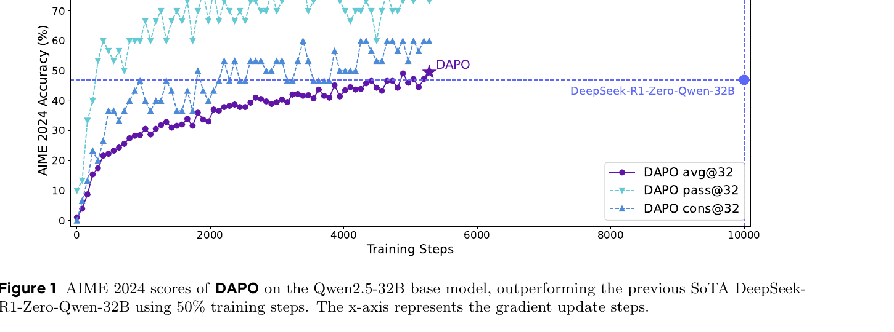
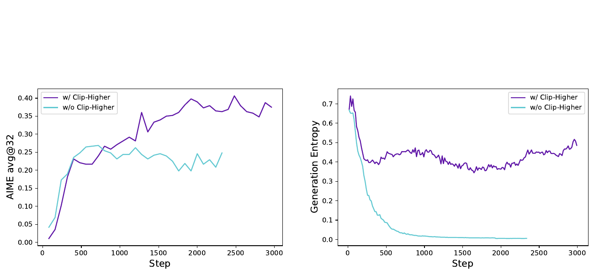
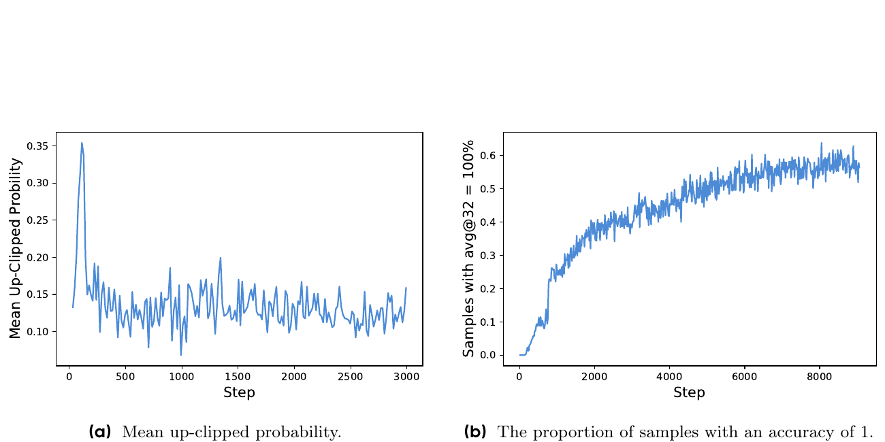
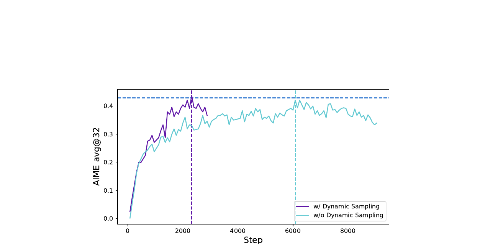
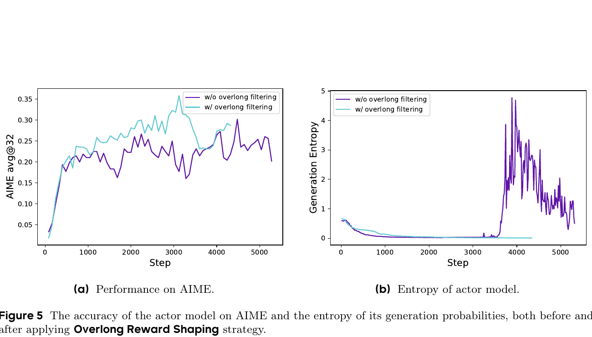
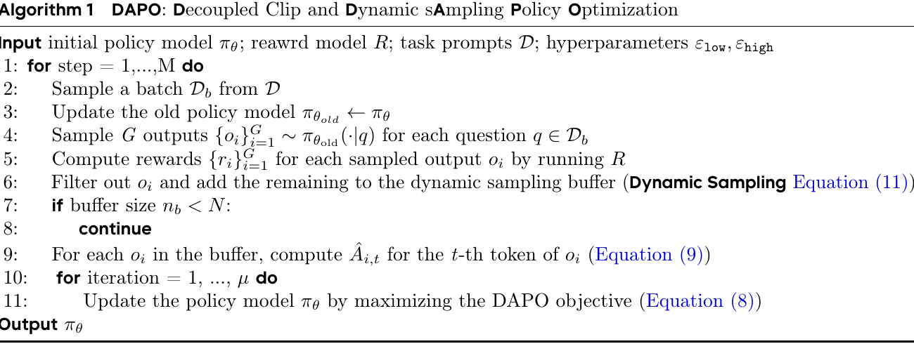
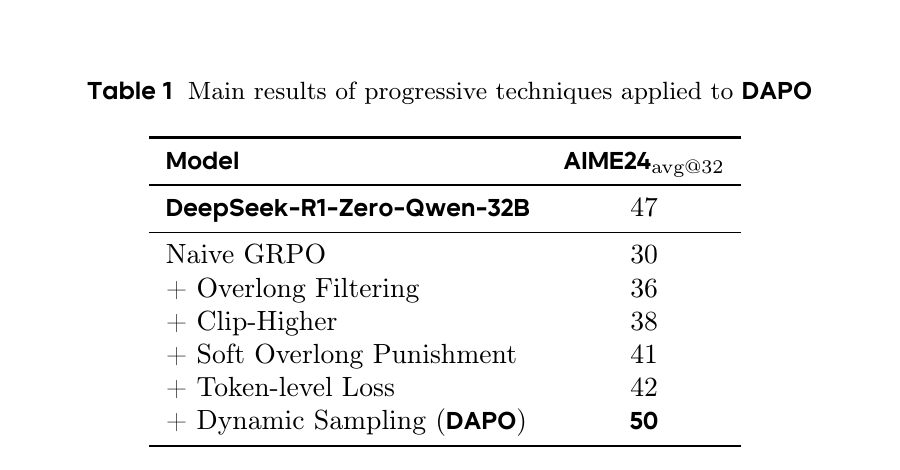
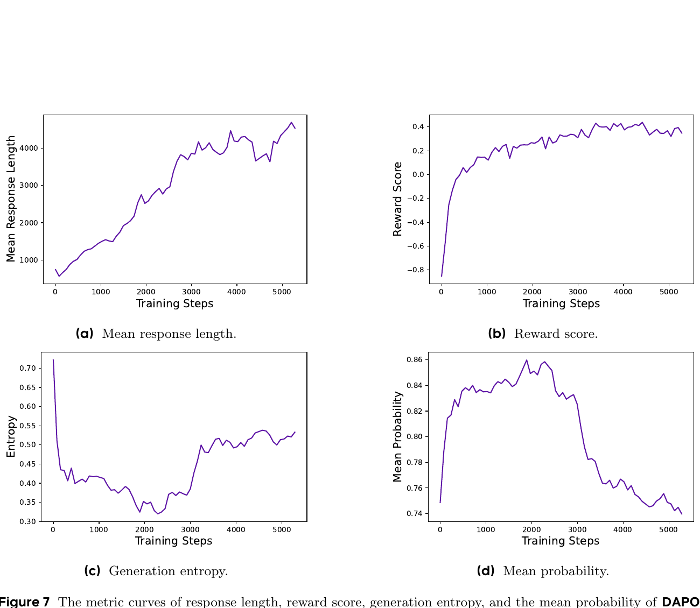

# DAPO: An Open-Source LLM Reinforcement Learning System at Scale

## 1. 出发点 (Motivation)

2025 年初 OpenAI o1 + DeepSeek R1 把"long-CoT RL"推上了 LLM 范式革命的中心 — 但**实际算法和训练 recipe 几乎全是黑盒**。R1 技术报告只给了 framework 级别的描述,社区想复现 Qwen2.5-32B 上的 47% AIME24 时全都卡住,普遍只能拿到 30 分左右。DAPO 作者团队 (字节 + 清华 AIR) 的诊断:

- **naive GRPO baseline 有几个具体的故障模式** — 不是"算法不行",是 4 个不起眼但 load-bearing 的工程问题没解决:
        <ul>
          <li><strong>entropy collapse:</strong> 训几百步后 policy entropy 急剧下降,sampled responses 几乎一样 — 没探索就没法 scale。</li>
          <li><strong>gradient 死亡:</strong> 当一个 prompt 的 $G$ 个 outputs 全对 (acc=1) 或全错 (acc=0),GRPO advantage 是 0,这组 prompt 的 gradient 也是 0。训练越久全对的 prompt 越多,有效 batch 越小。</li>
          <li><strong>长序列贡献被稀释:</strong> GRPO 默认 sample-level loss aggregation (先对每个 sample 内 token 取平均,再 sample 之间平均)。结果:长 CoT (几千 token) 的每个 token 贡献 = 短 CoT 每个 token 贡献 / 长度比。长序列里 gibberish/repetition 的负 reward 信号几乎消失 → 模型刹不住车。</li>
          <li><strong>truncation reward noise:</strong> 超长样本默认给一个固定 negative reward。但一个 reasoning 过程<em>本来对</em>但写得长就被惩罚,reward 信号污染整个训练。</li>
        </ul>
- **关闭整个 recipe 是知识封锁。** 学界根本无法验证 "R1 算法是不是真的好"。DAPO 把所有 4 个修复 + 代码 + 数据 + 权重 全部公开,作为反封锁的样本。

论文的 4 个 named 技术合起来叫 **DAPO** (**D**ecoupled clip + **D**ynamic s**A**mpling **P**olicy **O**ptimization)。Qwen2.5-32B base → 50% AIME24,只用 R1-Zero 50% 的 step:

<figure>
      
      <figcaption>Fig. 1 — DAPO 在 Qwen2.5-32B base 上的 AIME 2024 学习曲线。avg@32 (紫,solid) 在 ~5000 step 达到 50%,pass@32 (青,triangle-down) 超 70%,cons@32 (蓝,triangle-up) 在 60% 附近震荡。DeepSeek-R1-Zero-Qwen-32B (右侧蓝色 horizontal line) 用了 10000 step 才到 47%。<strong>DAPO 50% step 数,超 3 pt。</strong></figcaption>
    </figure>

## 2. 方法 (Method)

### 核心思想 (类比)

把 long-CoT RL 训练想成"教学生做一道很长的证明题":

- **Clip-Higher** = 老师之前对每个学生的进步幅度都设了同样的上下限 (±20%)。问题:好学生本来就接近满分,稍微再涨一点不难;差学生想从 1 分涨到 10 分却被限死。**DAPO 解法:把上限放宽 (+28%) 让低概率"探索性"动作更容易被提升,下限保持 -20%。**
- **Dynamic Sampling** = 老师批作业。如果一组 16 个学生*全做对*或*全做错*,这组作业不能教你"哪种解法好"(没对比信号)。**DAPO 解法:把这种死组扔掉,继续抽到攒够 batch 为止。**
- **Token-Level Loss** = 老师本来按"每个学生权重相等"打分。问题:学生 A 写 100 词、学生 B 写 5000 词,B 里的每个词只占 A 的 1/50 的影响 — 这意味着 B 写的 gibberish 里掺了一句很关键的洞见会被"平均"掉,B 写的 repetitive 废话也不会被惩罚。**DAPO 解法:全 batch 所有 token 一视同仁取平均 — 长 sequence 自然在 loss 里贡献更多。**
- **Overlong Reward Shaping** = "超过字数就 0 分"的惩罚太粗暴。**DAPO 解法:超过 max-buffer 才完全 -1,在 buffer 区间内线性降 — 给模型一个明确的"长度梯度"。**

这 4 个修复没一个是惊天动地的算法 — 都是"现有方法里某个不显眼的角落里有 bug"。但合在一起,30 → 50 分。

### 2.1 GRPO 起点 + 公式

DAPO 基于 GRPO (Shao et al. 2024)。GRPO vs PPO 的核心区别:**不用 value 网络,直接 group-wise 标准化做 advantage**。对一个 prompt $q$ 采样 $G$ 个回复,advantage 是:

注意所有 token 共享同一个 sequence-level advantage $\hat A_i$。GRPO 的 clipped surrogate (PPO style):

其中 $r_{i,t}(\theta) = \pi_\theta(o_{i,t}|q, o_{i,\lt t}) / \pi_{\theta_{\text{old}}}(o_{i,t}|q, o_{i,\lt t})$。

**关键观察:** GRPO 的内层 $\frac{1}{|o_i|}\sum_t$ 是*sample-level token-mean*,外层 $\frac{1}{G}\sum_i$ 是 sample 上平均。这两层平均的组合,就是 Token-Level Loss 要修的东西 — 见 §2.4。

**额外:DAPO 去掉了 KL 项** ($\beta = 0$)。逻辑:RLHF 里要约束 model 不偏离原模型 (因为想保留通用对齐);但 long-CoT reasoning 训练里 policy*必然*大幅偏离 base (要学新的"思考"模式),KL 约束反而阻碍。

**额外:rule-based reward 而不是 reward model**。$R(\hat y, y) = 1$ if answer 正确 else $-1$。避免 reward hacking。

### 2.2 Clip-Higher (raise the upper bound)

<figure>
      
      <figcaption>Fig. 2 — w/o Clip-Higher 的 entropy 在 ~500 step 后跌到接近 0 (青线,右图),AIME 准确率停在 0.22 左右 (青线,左图)。w/ Clip-Higher (紫线) entropy 长期保持在 0.4-0.5,AIME 涨到 0.38+。</figcaption>
    </figure>

**问题:** PPO/GRPO 默认 $\varepsilon = 0.2$,新概率被 clip 到 $[\pi_{\text{old}} \cdot 0.8,\ \pi_{\text{old}} \cdot 1.2]$。<u>这个 clip 对"高概率 exploitation token"和"低概率 exploration token"的影响不对称:</u>

- $\pi_{\text{old}} = 0.9$ 的 exploitation token → 上限 $0.9 \times 1.2 = 1.08$ (实际 cap 在 1),空间大。
- $\pi_{\text{old}} = 0.01$ 的 exploration token → 上限 $0.01 \times 1.2 = 0.012$,几乎不能涨。

结果:exploitation token 持续被强化,exploration token 永远涨不起来 → entropy 崩溃。Fig 3a 实测:被上界 clip 的 token 平均概率 $\lt 0.2$ — 印证了"上界主要在卡低概率 token"。

<figure>
      
      <figcaption>Fig. 3 — (a) 被 upper-clip 的 token,平均概率长期 &lt; 0.2 (大多 0.10-0.15),说明 upper clip 主要在<em>卡低概率 exploration token 的提升</em>;(b) avg@32 = 100% 的 prompt 比例从 0 涨到 0.6+,意味着越往后训练有效 batch 越少 — 这正是 §2.3 Dynamic Sampling 要解决的问题。</figcaption>
    </figure>

**DAPO 修复:**分离上下 clip 边界

实验设 $\varepsilon_{\text{low}} = 0.2$ (维持原值,防止低概率 token 被压到 0)、$\varepsilon_{\text{high}} = 0.28$。<u>这一个超参的微调就让 entropy 不再 collapse。</u>

### 2.3 Dynamic Sampling (filter dead groups)

**问题 (Fig 3b):** 训练后期,acc=1 的 prompt 占比从 0 涨到 ~0.6。这些 prompt 的整个 group reward 都是 1,group-std = 0,advantage = 0,贡献 0 gradient。**有效 batch 在悄悄变小**。

**DAPO 修复:** 在 batch 级别*过采样*,过滤掉 group 内 reward 全 0 或全 1 的 prompt,直到攒够目标 batch size。形式化加在 DAPO 目标里:

(每个 prompt 的 $G$ 个 output 里必须至少有 1 个对、至少有 1 个错。)

实现层面 — verl 的 `filter_groups.enable=True`:用 `gen_batch_size`(例:1536) 采样,过滤 → 目标 `train_batch_size`(例:512)。如果一次过滤后<不够,继续采,最多 `max_num_gen_batches` 次。

<figure>
      
      <figcaption>Fig. 6 — 看似"多采样应该慢",但 w/ Dynamic Sampling (紫) 在 ~2300 step 就达到 0.42,而 w/o (青) 跑到 6000+ step 才匹配。<strong>每个 step 信息量更大,总训练 time 反而更短。</strong></figcaption>
    </figure>

### 2.4 Token-Level Policy Gradient Loss (long-CoT 关键)

**问题:** GRPO 的 loss aggregation 是 *sample-level*:

意味着 *每个 sample 贡献相同的 loss 权重*,不管它是 100 token 还是 5000 token。在 long-CoT 场景,这有两个问题:

- *高质量长样本* 里某个关键 reasoning step 的 reward 信号被 $1/|o_i|$ 严重稀释 — 模型学不到 "这一步的思考方式对了"。
- *劣质长样本*(gibberish, repetition) 里每个差 token 也被 $1/|o_i|$ 稀释 — 模型刹不住"越写越长越烂"的循环。

**DAPO 修复:**改成 *token-level mean* — 所有 batch 里的 token 一视同仁:

长 sample 自动在 loss 里占更大权重(它有更多 token 贡献)。

**没有这个修复**(Fig 4 in paper):entropy 在长序列出现后失控,response length 也持续上涨到不健康水平。<u>这是 long-CoT 跟 short-CoT(RLHF instruction-following)的本质区别 — 长度差异从"几十倍"变成"几百倍",sample-level mean 直接失效</u>。

### 2.5 Overlong Reward Shaping (truncation noise)

**问题:** 训练设 max length(如 20480 token)。超出的样本默认*直接给 -1 reward*。但很多被截断的样本*推理本身是对的*,只是写得长 — 一个 sound reasoning 因为长度被打 -1,模型学到的是"长 = 错",这是 reward noise。

**DAPO 解法 1 — Overlong Filtering:**直接 mask 掉被截断样本的 loss(让它不贡献 gradient)。简单粗暴但有效。Fig 5 显示这就能稳住 entropy。

<figure>
      
      <figcaption>Fig. 5 — (a) w/o overlong filtering AIME 在 3500 step 后开始震荡下降;(b) w/o overlong filtering 的 entropy 在 3500 step 后炸到 4-5 (gibberish 模式);带 filtering 后 entropy 接近 0 并稳定。<strong>不处理截断 reward → 训练后期崩。</strong></figcaption>
    </figure>

**DAPO 解法 2 — Soft Overlong Punishment (Eq 13):**不是 0/1 切断,而是 length-aware 软惩罚。设 $L_{\max}$ = max 输出长度(20480),$L_{\text{cache}}$ = buffer 长度(4096):

所以:

- 0 - 16384 token:零惩罚 (写多长都行)
- 16384 - 20480 token:线性 0 → -1 惩罚 (鼓励刹车)
- > 20480 token:full -1 (硬截断)

这个 reward 加在原 correctness reward (±1) 上 — 信号"模型,你*可以*写长,但越过 16k 就开始算笔账"。

### 2.6 完整 DAPO 目标 + 算法

把 4 个技巧塞进同一个目标 (Eq 10/11/12):

对照标准 GRPO:

- Clip-Higher:$\varepsilon \to (\varepsilon_{\text{low}}, \varepsilon_{\text{high}})$ 分离
- Token-level loss:$\sum$ 的归一化分母从 $G\cdot|o_i|$ → $\sum_i|o_i|$
- Dynamic sampling:约束 $0 \lt |\text{correct}| \lt G$
- Overlong shaping:reward $r_i$ 里加入 $R_{\text{length}}$ 项
- KL 项:整个去掉

<figure>
      
      <figcaption>Algorithm 1 — 完整 DAPO 训练循环。Line 6-8 是 Dynamic Sampling 的实现:filter → if 没满,continue (回 Line 2 重采样)。Line 11 用 Eq 8 (含 Clip-Higher) 更新 policy。</figcaption>
    </figure>

### 2.7 与代码对照

DAPO 训练 recipe 在 [volcengine/verl `recipe/dapo/`](https://github.com/volcengine/verl/tree/main/recipe/dapo)。核心算法实现在 `verl/trainer/ppo/core_algos.py` 和 `verl/workers/reward_manager/dapo.py`。下面引的是*当前 main 分支*的代码 — 命名跟 paper 直接对得上。

**(a) Clip-Higher — 分离 $\varepsilon_{\text{low}} / \varepsilon_{\text{high}}$:**论文 Eq 10 的 `clip(r, 1-ε_low, 1+ε_high)` 这一行。

<p class="code-source">repo_verl/verl/trainer/ppo/core_algos.py:L1278-L1346 — compute_policy_loss_vanilla</p>

```python
@register_policy_loss("vanilla")
def compute_policy_loss_vanilla(
    old_log_prob, log_prob, advantages, response_mask,
    loss_agg_mode="token-mean",        # ← Token-Level Loss (§2.4)
    config=None,
    rollout_is_weights=None,
):
    clip_ratio = config.clip_ratio
    clip_ratio_low  = config.clip_ratio_low  if config.clip_ratio_low  is not None else clip_ratio
    clip_ratio_high = config.clip_ratio_high if config.clip_ratio_high is not None else clip_ratio
    # ↑ 这两行就是 Clip-Higher (§2.2). DAPO 配 ε_low=0.2, ε_high=0.28

    negative_approx_kl = log_prob - old_log_prob
    negative_approx_kl = torch.clamp(negative_approx_kl, min=-20.0, max=20.0)
    ratio = torch.exp(negative_approx_kl)

    pg_losses1 = -advantages * ratio
    pg_losses2 = -advantages * torch.clamp(ratio,
                                           1 - clip_ratio_low,
                                           1 + clip_ratio_high)   # ← 分离 clip
    clip_pg_losses1 = torch.maximum(pg_losses1, pg_losses2)
    # ... (dual-clip for negative advantages omitted) ...
    pg_loss = agg_loss(loss_mat=pg_losses, loss_mask=response_mask,
                       loss_agg_mode=loss_agg_mode, **config.global_batch_info)
    return pg_loss, pg_metrics
```

L1314-L1315 是 paper Eq 10 的 $\varepsilon_{\text{low}}, \varepsilon_{\text{high}}$ 实现。L1340-L1342 把它们用进 `torch.clamp`。**DAPO 跟 vanilla GRPO 在<u>这两行</u>就分叉了** — 其余 PPO 数学完全一样。

**(b) Token-Level Loss — loss aggregation mode:**paper §3.3 的 token-mean 实现。

<p class="code-source">repo_verl/verl/trainer/ppo/core_algos.py:L1138-L1199 — agg_loss</p>

```python
def agg_loss(loss_mat, loss_mask, loss_agg_mode, dp_size=1, batch_num_tokens=None, ...):
    """Aggregate the loss across global batch."""
    if loss_agg_mode == "token-mean":                              # ← DAPO Token-Level Loss
        if batch_num_tokens is None:
            batch_num_tokens = loss_mask.sum()
        loss = verl_F.masked_sum(loss_mat, loss_mask) / batch_num_tokens * dp_size

    elif loss_agg_mode in ["seq-mean-token-sum", "seq-mean-token-sum-norm"]:
        seq_losses = torch.sum(loss_mat * loss_mask, dim=-1)
        seq_mask = (torch.sum(loss_mask, dim=-1) > 0).float()
        # ... seq-mean over sequences ...

    elif loss_agg_mode == "seq-mean-token-mean":                   # ← vanilla GRPO 默认
        seq_mask = torch.sum(loss_mask, dim=-1)
        seq_losses = torch.sum(loss_mat * loss_mask, dim=-1) / (seq_mask + 1e-8)
        seq_mask = (seq_mask > 0).float()
        loss = verl_F.masked_sum(seq_losses, seq_mask) / global_batch_size * dp_size
    else:
        raise ValueError(f"Invalid loss_agg_mode: {loss_agg_mode}")
    return loss
```

三个模式的*数学*差别就在归一化分母:

- `token-mean` (DAPO):$\sum_{i,t}\ell_{i,t} / \sum_i |o_i|$ — 全 batch token 一视同仁
- `seq-mean-token-mean` (vanilla GRPO):$\frac{1}{G}\sum_i \frac{1}{|o_i|}\sum_t \ell_{i,t}$ — 每个 sample 等权重
- `seq-mean-token-sum`:介于两者之间

**(c) Overlong Reward Shaping — Eq 13 在 reward manager 里:**

<p class="code-source">repo_verl/verl/workers/reward_manager/dapo.py:L121-L131 — overlong penalty inside __call__</p>

```python
if self.overlong_buffer_cfg.enable:
    overlong_buffer_len = self.overlong_buffer_cfg.len           # 4096 in paper
    expected_len = self.max_resp_len - overlong_buffer_len       # 20480 - 4096 = 16384
    exceed_len = valid_response_length - expected_len            # >0 if in overlong buffer
    overlong_penalty_factor = self.overlong_buffer_cfg.penalty_factor   # 1.0
    overlong_reward = min(-exceed_len / overlong_buffer_len * overlong_penalty_factor, 0)
    reward += overlong_reward
    if self.overlong_buffer_cfg.log:
        reward_extra_info["overlong_reward"].append(overlong_reward)
        reward_extra_info["overlong"].append(overlong_reward < 0)
```

逐行对照 Eq 13:`exceed_len` 是 $|y| - (L_{\max} - L_{\text{cache}})$,`-exceed_len / overlong_buffer_len` 就是 $-(|y| - (L_{\max} - L_{\text{cache}}))/L_{\text{cache}}$,`min(..., 0)` 保证只在超过 expected_len 时才施惩罚。<u>简单 5 行实现 Eq 13。</u>

**(d) Dynamic Sampling — Group Filtering:**不在 loss 里,在 trainer 的 rollout 阶段实现 (来自 docs/algo/dapo.md)。

<p class="code-source">verl/recipe/dapo/dapo_ray_trainer.py (paraphrased from docs/algo/dapo.md) — over-sample + filter loop</p>

```python
prompt_bsz = self.config.data.train_batch_size           # 512
num_prompt_in_batch = 0
num_gen_batches = 0
while num_prompt_in_batch < prompt_bsz:
    gen_batch = sample_gen_batch(size=self.config.data.gen_batch_size)   # 1536
    gen_batch = run_rollout(gen_batch)                                   # 16 rollouts per prompt
    gen_batch = compute_rewards(gen_batch)

    # Filter groups whose rewards are all the same (acc all 0 or all 1)
    keep_mask = ~all_same_per_group(gen_batch.rewards)
    filtered = gen_batch[keep_mask]
    batch = concat(batch, filtered)
    num_prompt_in_batch += count_prompts(filtered)

    num_gen_batches += 1
    max_num_gen_batches = self.config.algorithm.filter_groups.max_num_gen_batches
    if max_num_gen_batches > 0 and num_gen_batches >= max_num_gen_batches:
        raise ValueError(f"{num_gen_batches=} >= {max_num_gen_batches=}. Generated too many.")

# Align the batch to exactly train_batch_size * n_rollouts
traj_bsz = self.config.data.train_batch_size * self.config.actor_rollout_ref.rollout.n
batch = batch[:traj_bsz]
```

$\mathrm{gen\_batch\_size} > \mathrm{train\_batch\_size}$ 是关键(例:1536 > 512),给过滤留余量。`max_num_gen_batches` 是安全闸 — 防止数据集太简单导致死循环重采。

## 3. 结论 (Key Findings)

**主结果:**

<figure>
      
      <figcaption>Tab. 1 — 4 个技术的累积贡献 (AIME 2024 avg@32)。Naive GRPO <strong>30</strong> → +Overlong Filtering <strong>36</strong> (+6) → +Clip-Higher <strong>38</strong> (+2) → +Soft Overlong Punishment <strong>41</strong> (+3) → +Token-level Loss <strong>42</strong> (+1) → +Dynamic Sampling = <strong>DAPO 50</strong> (+8)。<u>Dynamic Sampling 是单一最大涨幅</u>(+8)。Overlong-related 改进 (filtering + soft punishment) 合起来也是 +9。Clip-Higher 单独贡献 +2 (但 entropy collapse 修复后才能让其他改进发挥作用)。</figcaption>
    </figure>

**训练动态健康指标 (Fig 7 — DAPO 的训练长这样):**

<figure>
      
      <figcaption>Fig. 7 — DAPO 5000 step 的训练曲线。(a) 平均响应长度 从 ~700 token 持续涨到 ~4500 — <strong>healthy growth</strong>,代表 model 学会更长的 CoT。(b) Reward score 从 -0.8 稳定涨到 +0.4。(c) Entropy 先降到 0.35 (开始 commit) 再缓慢回升到 0.55 — <strong>受控的探索回升</strong>。(d) Mean probability 0.78 → 0.86 → 回落到 0.74 — 跟 entropy 反向变化,说明 model 在前半段 commit 后半段重新探索。<strong>这 4 条曲线是健康 long-CoT RL 训练的"教科书形状"。</strong></figcaption>
    </figure>

**关键数字:**

- **AIME 2024 avg@32:** Qwen2.5-32B base 30 → DAPO 50 (+20 pt)
- **vs DeepSeek-R1-Zero-Qwen-32B:** 47 → 50 (+3 pt),且只用**50% 训练 step**
- **Dynamic Sampling 总训练时间:** 虽然每个 step 多采样了,但 step 数大幅减少 (Fig 6:2300 step vs 6000+ step),总时间反而短
- **Clip-Higher $\varepsilon_{\text{high}}$ tuning 区间:** 0.28 (papers vs default 0.20)
- **Overlong soft punishment buffer:** $L_{\max}=20480$,$L_{\text{cache}}=4096$ (即 16384-20480 是线性惩罚区间)

## 4. 实现细节 (Implementation Notes)

DAPO 不只是*说*什么 work,而是把 recipe 拆解到可复现级别。整套训练代码、数据、checkpoint 全开源。下方列细节都从论文 §4.1 或 verl repo 配置文件提取:

- **Base model:** Qwen2.5-32B base (非 instruct,非 SFT — 直接从 base 做 RL,类似 R1-Zero)。`repo_verl/recipe/dapo/run_dapo_qwen2.5_32b.sh` (paper § 项目页)
- **硬件:** 128 H20 (paper 报告) / 16x8x H800 (verl 复现); `repo_verl/docs/algo/dapo.md:L34` 列出复现配置。
- **Optimizer:** AdamW,constant lr **1e-6**,linear warmup 20 rollout steps。`paper §4.1`
- **Rollout:** Prompt batch 512,16 responses per prompt → 8192 sequences per rollout step。`paper §4.1`
- **Training:** Mini-batch 512 (= 16 gradient updates per rollout)。`paper §4.1`
- **Generation length:** $L_{\max}$ = 16384 + 4096 (Lcache) = **20480 tokens**。`repo_verl/docs/algo/dapo.md:L142`
- **Clip:** $\varepsilon_{\text{low}}$ = 0.2,$\varepsilon_{\text{high}}$ = **0.28**。`repo_verl/verl/trainer/ppo/core_algos.py:L1314-L1315`
- **KL coefficient:** $\beta = 0$ — **整个 KL 项被去掉**。`paper §2.3`
- **Reward:** rule-based ±1,不用 reward model。`repo_verl/verl/utils/reward_score/math_dapo.py` — 解析 \boxed{...} 然后字符串等价比较。`paper §2.4 Eq 7`
- **Dynamic Sampling:** `filter_groups.enable=True`,metric="acc",`max_num_gen_batches=10` (上限,防数据集太难时无限重采)。`repo_verl/docs/algo/dapo.md:L77-L82`
- **Loss aggregation:** `loss_agg_mode="token-mean"` (verl 默认),paper Eq 12 实现。`repo_verl/verl/trainer/ppo/core_algos.py:L1168-L1173`
- **Overlong penalty:** `overlong_buffer.enable=True`, `len=4096`, `penalty_factor=1.0`。`repo_verl/verl/workers/reward_manager/dapo.py:L121-L131`
- **Evaluation:** AIME 测试集 repeat 32 次,avg@32;temperature 1.0,top-p 0.7。`paper §4.1`
- **Dataset:** DAPO-Math-17K — 把所有题答案都转成整数 (e.g., $\frac{a + \sqrt{c}\, b}{}$ → $a+b+c$),便于 rule-based 解析。`paper §3.5`
- **Code-vs-paper 不一致:** 论文 §3.4 提到"Overlong Filtering" (硬 mask) 和"Soft Overlong Punishment" (Eq 13),paper Table 1 把两者都列了 (+6 / +3)。但 verl 实现里**只 ship 了 Soft Punishment**。FAQ 说 "they overlap" 所以不 ship Filtering — 第三方按 paper 全套复现时,Filtering 这块要自己加。`repo_verl/docs/algo/dapo.md FAQ §1`

## 5. 批判性总结 (Critical Assessment)

### 5.1 优点

- **"反封锁"的价值大于 4 个 trick 本身。** 2025 上半年学界拼命想复现 R1,Qwen2.5-32B 上的 47 分都摸不到,普遍在 30 分附近。DAPO 把整套 recipe + 数据 + 权重 + W&B 训练日志全开源,直接把"long-CoT RL"从黑魔法变成可工程化的流程。这条 contribution 本身就值得发表 — 4 个 trick 是附赠。
- **每个 trick 都有清晰的 failure mode + 修复 + ablation。** 不是"我们用了 trick A,效果好" — 而是"vanilla GRPO 训到 step 500 entropy 崩了,因为 upper clip 在卡低概率 token (Fig 3a 量化),我们改 ε_high 到 0.28 修复 (Fig 2 对比)"。每条都有数据图证明因果。这种叙事比绝大多数 RL paper 干净。
- **Token-level loss 这条洞察非平凡。** "sample-level vs token-level loss"看起来是小细节,但在 long-CoT (千-万 token 量级) 下,sample-level 平均会让长 sequence 的 gradient 信号被压成几乎 0。这是 RLHF 短指令对齐场景下不会出现的问题 — 是 long-CoT 独有 bug。文中清楚指出"sample-level 在 long-CoT 上会让 gibberish 模式刹不住车",并 ablation 证明 (Fig 4 entropy 与 length 失控)。这条*到 2025 年还有人不知道*。
- **Dynamic Sampling 的 trick 简单但有效。** 过滤 acc=0/1 的 group 单一贡献 +8 pt(Tab 1 里最大单项)。直觉对:这种 group 的 GRPO advantage 就是 0,等于浪费 batch。但社区之前都没人系统化地报告这个 fix。
- **Overlong Reward Shaping 是 reward design 工艺。** 区分 "硬截断 = -1" 和 "在 buffer 区间内线性衰减"是非平凡的 — 给了模型"长度梯度",而不是离散的悬崖。FAQ 里诚实承认 paper 的 Overlong Filtering 跟 Soft Punishment 功能重叠,实现里只 ship 后者 — 学术诚信加分。
- **"无 KL"是有论证的选择,不是丢一句"KL=0"了事。** 论证逻辑:RLHF 想约束 model 不偏离 base 是因为想保留通用对齐;long-CoT 训练里 base 本来就没有正确的 reasoning 模式,policy*必然*大幅偏离 base,KL 约束反而阻碍。这套 reasoning 后来在 RL's Razor (arxiv 2509.04259) 里被更严格地分析 — DAPO 是早期实证。
- **verl 框架本身是大贡献。** 字节内部把 verl 开放给社区,这是工业级 LLM RL infra 第一个真正可用的开源版本(对比 OpenRLHF / TRL,verl 在 32B+ 规模有验证)。DAPO recipe 只是 verl 上一个 use-case。

### 5.2 不足 / 疑点

- **只在数学一个 domain 验证。** AIME / Math 测得很满,但论文自己说 "this can be readily transferred to other tasks" — 没证。Code、scientific reasoning、agentic tool use 等场景上 DAPO 是否同样有效,纯 claim。事实上后续工作 (Flow-GRPO 用 reward-based, MixGRPO) 在视觉生成上发现单纯把 DAPO trick 移植效果不好。
- **4 个 trick 的 ordering 影响没消融。** Table 1 是按"先 Overlong Filtering → Clip-Higher → Soft Punishment → Token-Level → Dynamic Sampling"的固定顺序加,每个 trick 累积一个增量。但如果换不同顺序,各自的边际贡献会怎么变?例如:先加 Dynamic Sampling 再加 Clip-Higher,Clip-Higher 还会贡献那 +2 吗?paper 没有 randomized/permuted ablation。
- **"DAPO 50 用 R1-Zero 50% step 数"这个比较的细节模糊。** R1-Zero 的 step 是 10000,DAPO 是 ~5000,但<u>step 大小不同</u>:DAPO 一个 step = 512 prompt × 16 rollout = 8192 sequences;R1-Zero 的 step size 没披露。"50% step" 不等于 "50% wall-clock" 或 "50% compute"。若 DAPO 的 step 是 R1-Zero 的 2 倍大,总 compute 持平。
- **Dynamic Sampling 的 max_num_gen_batches 上限是个工程妥协。** 如果数据集真的太简单 (大多数 group 都全对),不停重采会浪费时间;如果太难,可能根本攒不够 batch。实操里这个超参对训练稳定性影响如何,paper 没 ablate。
- **Clip-Higher 的 $\varepsilon_{\text{high}}$ 只测了 0.28。** 没有 sweep 表明 0.24 / 0.30 / 0.35 会怎样,也没说 0.28 是怎么选出来的(只有 "effectively balance" 这句话)。如果 0.28 是 cherry-picked 出来的,迁移到别的 model / domain 时可能要重新 tune。
- **Rule-based reward 只在*答案能枚举*的数学题上 work。** "把答案转换成整数"这条数据预处理 (§3.5) 是有损的,会过滤掉一大类对模型推理能力*更有价值*的题(图论证明、几何构造、定性分析)。这相当于把题目分布 narrow 到"答案是整数"的窄子集 — 提高了 reward 信号清晰度,降低了任务多样性。
- **训练计算量披露不够。** 128 H20 是 paper 报告的硬件,但训练时长(几小时?几天?)没说。Token-per-step / GPU-second 也没说。读者无法估算"自己想复现要花多少钱"。
- **vs SFT 基线缺失。** Paper 默认 RL > SFT 的前提,但没在同一 dataset 上对比 SFT(用同样 DAPO-Math-17K 做 SFT 能拿多少分?)。R1 paper 至少做了 "Zero" (直接 RL) vs "R1" (SFT + RL) 的对比,DAPO 没。
- **"No KL penalty"在 long-horizon 上的副作用没监控.** 去掉 KL 让 model 自由偏离 base,但 base 上的*通用能力*(MMLU / IFEval / HumanEval 等)会不会被腐蚀?paper 没测。RL's Razor 后续表明 "RL 自带 KL-min 偏置" — DAPO 没显式 KL,实际上是 implicit 走 KL-min,但 implicit 与 explicit 在 long-horizon 上未必等价。
- **Dataset 不开源 prompts 来源.** 17K 数学题来自"web scraping + manual annotation",但具体来源、过滤标准、答案 transformation 实现没披露。HF 上 dataset 公开但 provenance 模糊。

### 5.3 适用 vs 不适用

- ✅ **适用:** 数学 reasoning RL post-training (AIME / MATH-500 / OlympiadBench) — DAPO 是事实上的 SOTA recipe。
- ✅ **适用:** 任何 *verifiable reward*(答案可枚举可校验)的 long-CoT 任务 — code synthesis with unit tests, formal theorem proving。
- ✅ **方法论上适用:** 4 个 trick 都可以拆开用 — Clip-Higher 和 Token-Level Loss 几乎是 long-CoT RL 的"必修课",任何 GRPO 类 trainer 都该加。
- ❌ **不适用:** RLHF 通用偏好对齐 (helpfulness / harmlessness) — short-response,长度差不大,sample-level loss 没问题;reward model 不可枚举,rule-based reward 也不可用。
- ❌ **不适用:** Vision generative RL — DAPO 的 token-level loss 跟 flow matching 的连续 latent 不对应,直接套等于失配。需要类比改 (Flow-GRPO / Flow-OPD 做了这一步)。
- ❌ **不适用:** 没足够算力 (32 GPU+) 跑 GRPO + dynamic sampling 的环境 — 这个 recipe 是*32B 模型 + 128 GPU* 验证出来的,7B 上的有效性有 verl 复现但小模型上 ablation 不完整。
- ⚠️ **谨慎:** 论文报告的 ablation 顺序是固定的,换 model / domain 时各 trick 的边际贡献不一定相同;建议优先打开 Dynamic Sampling 和 Clip-Higher 这两个最大单项。
- ⚠️ **谨慎:** 复现 Table 1 的"+Overlong Filtering +6 pt"需要自己加,verl 里只 ship 了 Soft Punishment。

### 5.4 进一步阅读

- [Shao et al. 2024 — DeepSeekMath / GRPO](https://arxiv.org/abs/2402.03300):DAPO 的算法基础,GRPO 原始论文。
- [DeepSeek R1 (Guo et al. 2025)](https://arxiv.org/abs/2501.12948):DAPO 主要对照工作 — paper 的 47% AIME baseline 就是 R1-Zero-Qwen-32B。R1 没公开 RL 训练细节,DAPO 是社区的反封锁回应。
- [volcengine/verl](https://github.com/volcengine/verl):开源 RL infra,DAPO 的实现底盘。
- [RL's Razor (Shenfeld et al. 2025)](https://arxiv.org/abs/2509.04259):论证 on-policy RL 天然 KL-min 偏置 — DAPO 去掉显式 KL 后仍稳定,这条规律是部分解释。
- [Flow-GRPO (Liu et al. 2025)](https://arxiv.org/abs/2505.05470):GRPO 的 flow matching 域移植,讨论 DAPO trick 在视觉生成上的迁移问题。
- [Dr. GRPO (Liu et al. 2025)](https://arxiv.org/abs/2503.20783):对 GRPO 的 length bias 做了进一步纠正,被 Flow-OPD 等后续工作采用。
- [DAPO-Math-17K dataset](https://github.com/BytedTsinghua-SIA/DAPO-Math-17k) + [DAPO-Qwen-32B weights](https://huggingface.co/BytedTsinghua-SIA/DAPO-Qwen-32B)。

<footer>
    <hr/>
    <p class="meta">Read on 2026-05-12 · Generated with the <code>reading-papers</code> skill</p>
  </footer>
