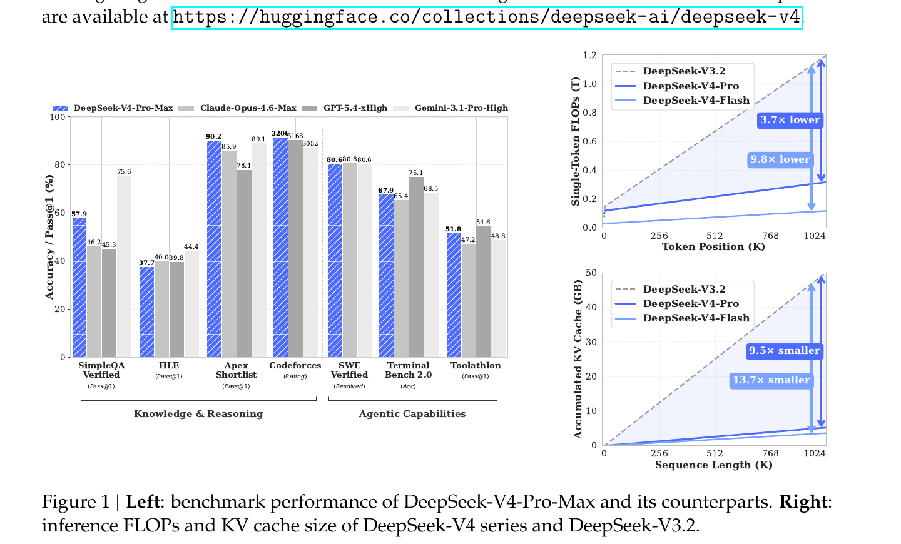
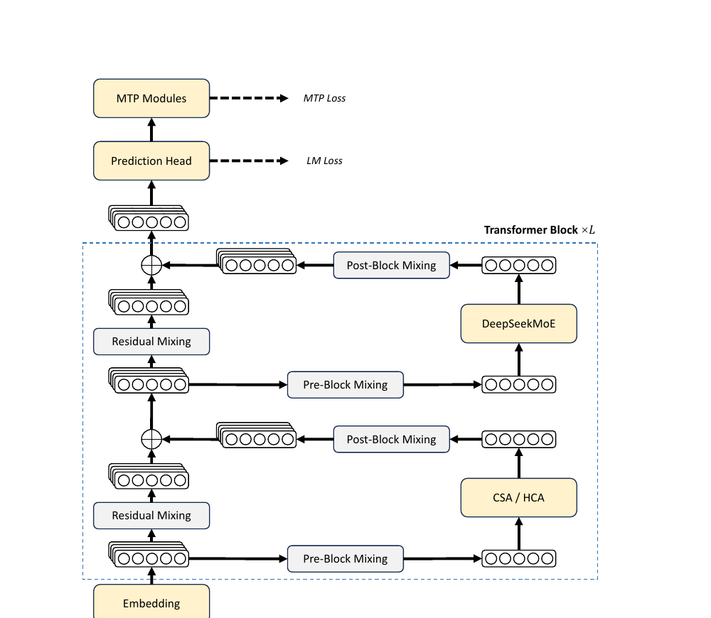
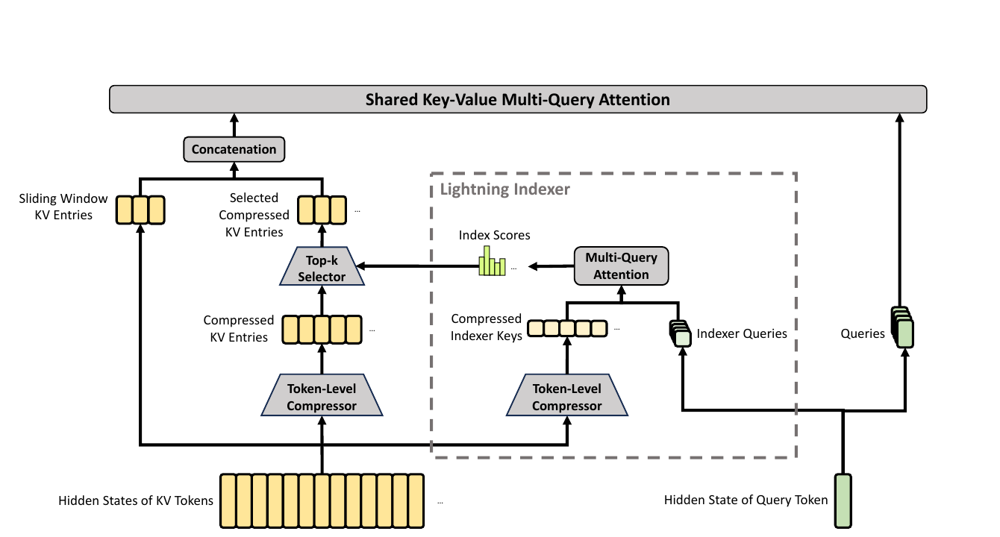
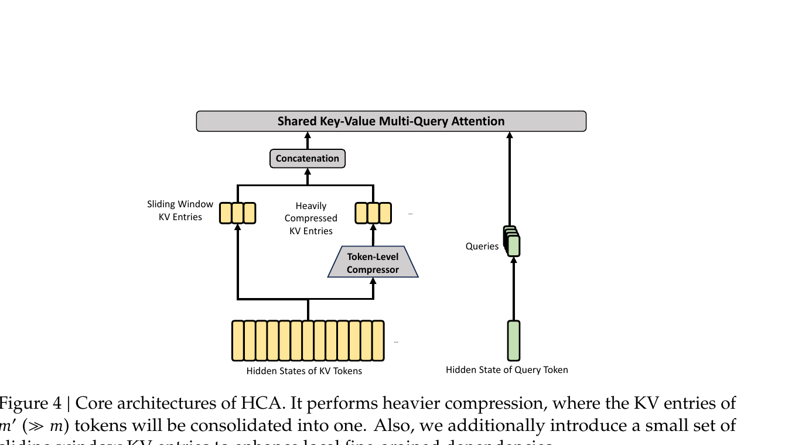
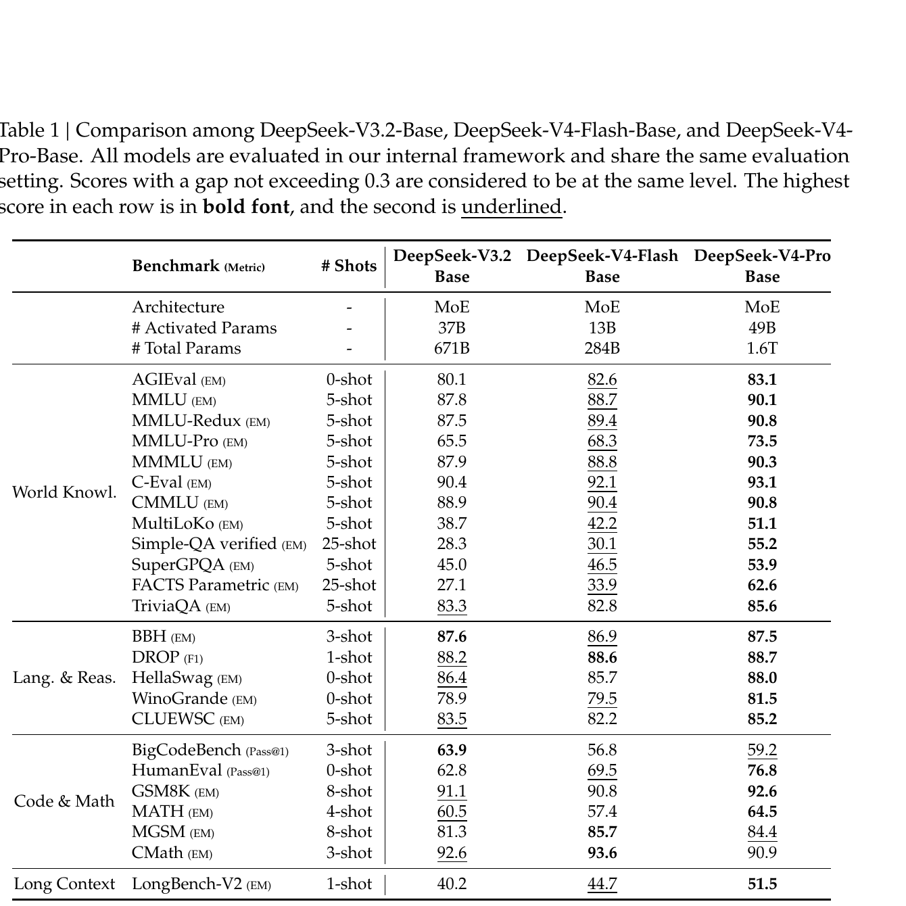
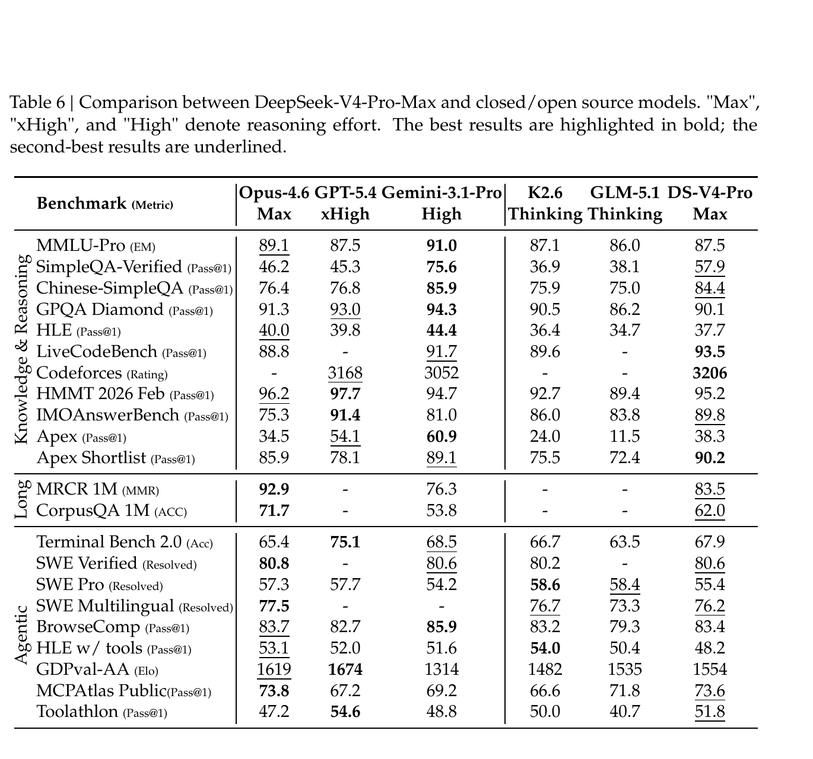
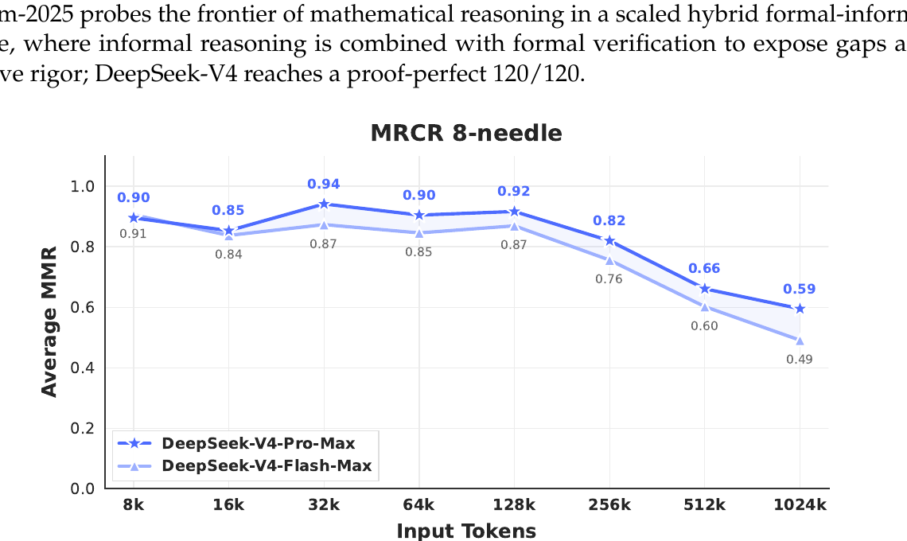

# DeepSeek-V4: Towards Highly Efficient Million-Token Context Intelligence

## 1. 出发点 (Motivation)

对长上下文 (1M token) 推理来说,attention 的计算量和 KV cache 都随 sequence length 线性甚至二次膨胀,这是当今大模型 routine 化超长上下文场景 (代码 agent、长文档分析、test-time 多轮思考) 的最大阻力。DeepSeek-V3.2 已经引入了稀疏注意力 DSA 作为单一手段,但 KV cache 占用仍然吃紧。

DeepSeek-V4 系列试图解决三个互相耦合的问题:

- **注意力效率**:同时把 KV 数量压下来 (cache 大小) 和把"每个 query 参与的 KV 数"压下来 (FLOPs)。V3.2 只解决了后者。
- **残差稳定性**:Hyper-Connections (HC) 在 dense 残差之外 maintain $n_{\text{hc}}$ 份残差副本,理论上能扩张模型容量,但栈深之后训练频繁发散——需要一个数学化的约束让 deep stacking 也稳。
- **优化器**:在 trillion-参数 MoE 上,AdamW 的收敛速度和稳定性都有瓶颈。Muon 在小模型上展现了显著的样本效率优势,但官方还没有给出 1T+ MoE 的工业实践配方。

**一句话 TL;DR**:1M context 不能再用"暴力线性 attention",得在"压缩 + 选择 + 稀疏"三个维度上同时下手,并且把残差结构、优化器、低精度数值格式 (FP4 expert + FP8 backbone) 整套配套换掉。

<figure>
      
      <figcaption>Fig. 1 — 左:V4-Pro-Max vs 主流闭源/开源模型在知识、推理、agent 维度的得分。右:1M token 场景下 V4 系列单 token FLOPs 仅 V3.2 的 27% (Pro) / 10% (Flash),KV cache 仅 10% / 7%。</figcaption>
    </figure>

## 2. 方法 (Method) — 高中生友好 + 数学严谨

### 核心思想 (类比)

想象你要在一本 50 万字的论文里回答一个问题。两种极端做法:

1. **每个 query 都把整本书读一遍 (dense attention)**:慢,但不丢信息。
2. **把整本书压缩成一句话再回答 (heavy compression)**:快,但丢得太狠,细节问题答不出。

V4 的做法是 **分层组合**:

- **HCA** = "把书按章节压缩成摘要 (m'=128 个 token 合 1 条),所有 query 都读全部摘要"——便宜,适合"通读"型 query。
- **CSA** = "把书按段压缩成摘要 (m=4 个 token 合 1 条),每个 query 用一个 lightning indexer 挑出最相关的 1024 条段摘要再读"——精细,适合"找具体段落"型 query。
- **Sliding Window** = "再额外把最近 128 个 token 原样保留",填补"段内 / 章节内细节"的盲区。

61 层 Transformer 把 HCA 和 CSA **交错堆叠**(前 2 层 HCA,然后 (CSA, HCA) 交替到第 60 层,第 61 层退化为纯 sliding window)。粗读型的层数和精读型的层数大致 1:1,但每层做完都把信息融合,最终 query 既能看到"全书摘要"也能看到"精挑细选的段摘要"。

再叠加一个 **mHC**:常规残差只 carry 一份 stream,V4 carry 4 份,但用 **Sinkhorn-Knopp 算法把每层之间的残差混合矩阵投影到"双随机矩阵"流形上**,保证谱范数 ≤ 1,这样 61 层堆下来不会数值爆炸。

<figure>
      
      <figcaption>Fig. 2 — V4 总架构。残差被 mHC 的 Pre/Post-Block Mixing 替代,注意力层用 CSA 或 HCA,FFN 用 DeepSeekMoE。</figcaption>
    </figure>

### 2.1 整体架构 (继承自 V3 的部分)

三个东西没动:

- **DeepSeekMoE**:细粒度 routed experts + shared expert。V4 把激活函数从 Sigmoid 改成 $\sqrt{\text{Softplus}(\cdot)}$,把"affinity score"分布的尾巴拉长。前 3 个 MoE 层用 **hash routing** (按 token-id 查表选 expert,不学习),稳定低层路由。
- **MTP (Multi-Token Prediction)**:深度 1。
- **YaRN RoPE**:original_max_pos=65536,factor=16,扩展到 1M。

新增的三件套是下面的 mHC、CSA/HCA、Muon。

### 2.2 Manifold-Constrained Hyper-Connections (mHC)

**原始 HC 的问题**。把残差从 $\mathbb{R}^d$ 扩到 $\mathbb{R}^{n_{\text{hc}} \times d}$ ($n_{\text{hc}}=4$),每层引入三个映射 $A_l \in \mathbb{R}^{1 \times n_{\text{hc}}}$, $B_l \in \mathbb{R}^{n_{\text{hc}} \times n_{\text{hc}}}$, $C_l \in \mathbb{R}^{n_{\text{hc}} \times 1}$:

问题在于 $B_l$ 是无约束矩阵,栈到几十层 $\prod B_l$ 的谱范数容易爆炸——训练发散。

**mHC 的关键约束**:把 $B_l$ 限制到 **双随机矩阵流形 (Birkhoff polytope)**:

- $M \mathbf{1}_n = \mathbf{1}_n$:每行加和 = 1 (row-stochastic)
- $\mathbf{1}_n^T M = \mathbf{1}_n^T$:每列加和 = 1 (column-stochastic)
- $M \geq 0$:逐元素非负

**直觉**:这种矩阵相当于"对 $n_{\text{hc}}$ 份残差做一个 soft permutation",所有信息都被保留 (没有放大也没有衰减),只是在 4 份之间重新分配。谱范数 $\|B_l\|_2 \leq 1$,所以无论叠多少层都是 non-expansive。

**怎么做约束?** Sinkhorn-Knopp 迭代:取无约束矩阵 $\tilde{B}_l$,先 $M^{(0)} = \exp(\tilde{B}_l)$ 保证正,然后交替按行/按列归一化 20 次:

$A_l$ 和 $C_l$ 用 Sigmoid 卡到 $[0,1]$ 防止信号取消。所有参数 (dynamic + static) 都用 input-dependent 生成:$\tilde{B}_l = \alpha_l^{\text{res}} \cdot \text{Mat}(\hat{X}_l W_l^{\text{res}}) + S_l^{\text{res}}$。

#### 与代码对照

<p class="code-source">repo/inference/model.py:L673-L700 — mHC pre/post 混合,Sinkhorn 在 kernel.py</p>

```python
def hc_pre(self, x, hc_fn, hc_scale, hc_base):
    # x: [b,s,hc,d], hc_fn: [mix_hc, hc*d]
    shape, dtype = x.size(), x.dtype
    x = x.flatten(2).float()
    rsqrt = torch.rsqrt(x.square().mean(-1, keepdim=True) + self.norm_eps)
    mixes = F.linear(x, hc_fn) * rsqrt
    pre, post, comb = hc_split_sinkhorn(
        mixes, hc_scale, hc_base, self.hc_mult, self.hc_sinkhorn_iters, self.hc_eps)
    # pre: [b,s,hc] (Sigmoid) - 把 hc 份残差汇成 1 份
    y = torch.sum(pre.unsqueeze(-1) * x.view(shape), dim=2)
    return y.to(dtype), post, comb

def hc_post(self, x, residual, post, comb):
    # post: [b,s,hc] (2*Sigmoid), comb: [b,s,hc,hc] (double-stochastic from Sinkhorn)
    # 注意力/FFN 输出 x 被广播到 hc 份, residual 也用 comb 重新混合
    y = post.unsqueeze(-1) * x.unsqueeze(-2) + torch.sum(comb.unsqueeze(-1) * residual.unsqueeze(-2), dim=2)
    return y.type_as(x)
```

<p class="code-source">repo/inference/kernel.py:L372-L427 — TileLang 实现的 hc_split_sinkhorn,逐 token 跑 20 次 Sinkhorn 迭代</p>

```python
for j, k in T.Parallel(hc, hc):
    comb_frag[j, k] = mixes_shared[j * hc + k + hc * 2] * hc_scale[2] + hc_base[j * hc + k + hc * 2]
# 先 row-softmax 初始化, 然后 Sinkhorn (alternating row / column normalization)
T.reduce_max(comb_frag, row_max, dim=1)
for j, k in T.Parallel(hc, hc):
    comb_frag[j, k] = T.exp(comb_frag[j, k] - row_max[j])
T.reduce_sum(comb_frag, row_sum, dim=1)
for j, k in T.Parallel(hc, hc):
    comb_frag[j, k] = comb_frag[j, k] / row_sum[j] + eps
T.reduce_sum(comb_frag, col_sum, dim=0)
for j, k in T.Parallel(hc, hc):
    comb_frag[j, k] = comb_frag[j, k] / (col_sum[k] + eps)
for _ in T.serial(sinkhorn_iters - 1):  # 共 20 轮
    T.reduce_sum(comb_frag, row_sum, dim=1)
    for j, k in T.Parallel(hc, hc):
        comb_frag[j, k] = comb_frag[j, k] / (row_sum[j] + eps)
    T.reduce_sum(comb_frag, col_sum, dim=0)
    for j, k in T.Parallel(hc, hc):
        comb_frag[j, k] = comb_frag[j, k] / (col_sum[k] + eps)
```

Sinkhorn 是工业 kernel,论文写"$t_{\max}=20$",代码默认 `hc_sinkhorn_iters=20` 完全一致。

### 2.3 Compressed Sparse Attention (CSA)

<figure>
      
      <figcaption>Fig. 3 — CSA。第一步:Token-Level Compressor 把每 m=4 个 token 压成 1 条 KV (overlap=True,跨边界重叠 4)。第二步:Lightning Indexer 给每个 query 选 top-k=1024 条压缩 KV。第三步:对选中的压缩 KV + 最近 128 个原始 KV (sliding window) 做 Multi-Query Attention。</figcaption>
    </figure>

CSA 把 V3.2 的 DSA (DeepSeek Sparse Attention) 改造成"先压缩再稀疏":

1. **Token-Level Compressor**:把 KV 投影出 $C^a, C^b \in \mathbb{R}^{n \times c}$ 和 gating $Z^a, Z^b$。每 $m=4$ 个 token 的 KV 按 softmax 权重加权求和,得到 1 条 compressed entry。同时引入"前一段"的 overlap,这样块边界不会丢上下文。
2. **Lightning Indexer**:用一个轻量的"index head"打分 query 对每条 compressed KV 的相关度:
        $$I_{t,s} = \sum_{h=1}^{n_h^I} w_{t,h}^I \cdot \mathrm{ReLU}(q_{t,h}^I \cdot K_s^{I\text{Comp}}) \quad (16)$$
        其中 $w_{t,h}^I$ 是 head weight。然后 top-k=1024 选出 sparse 子集。
3. **Shared KV MQA**:对选中的 sparse compressed KV 做 Multi-Query Attention,K 和 V 共享 (省一半 KV cache 存储和 attention 算力)。
4. **Grouped Output Projection**:$n_h=128$ heads 拆 $g=16$ 组,每组先投影到 $d_g=1024$ 的中间,再汇总。避免 $c \cdot n_h \to d$ 一步映射的庞大开销。

关键公式 (Eq. 11-12):

解读:第 $i$ 条压缩 KV 是 2m=8 个 token 的加权融合,前 m=4 来自"当前块" ($C^a$),后 m=4 来自"前一块" ($C^b$),Softmax 跨 2m 个元素归一。$B^a, B^b \in \mathbb{R}^{m \times c}$ 是可学位置 bias。这种 overlap 设计让 query 不会"卡在块边界"。

#### 与代码对照

<p class="code-source">repo/inference/model.py:L279-L377 — Compressor.forward,处理 prefill 和 decode 两种 path</p>

```python
class Compressor(nn.Module):
    def __init__(self, args, compress_ratio=4, head_dim=512, rotate=False):
        super().__init__()
        self.compress_ratio = compress_ratio
        self.overlap = compress_ratio == 4  # 只在 ratio=4 (CSA) 时 overlap
        coff = 1 + self.overlap
        # ape: 可学位置 bias (paper 的 B^a, B^b)
        self.ape = nn.Parameter(torch.empty(compress_ratio, coff * self.head_dim, dtype=torch.float32))
        # wkv 生成 C, wgate 生成 Z, 都用 fp32 保证压缩数值稳定
        self.wkv = Linear(self.dim, coff * self.head_dim, dtype=torch.float32)
        self.wgate = Linear(self.dim, coff * self.head_dim, dtype=torch.float32)
        self.norm = RMSNorm(self.head_dim, args.norm_eps)

    def forward(self, x, start_pos):
        # ... prefill 分支
        kv = kv.unflatten(1, (-1, ratio))               # [b, n_blocks, ratio, d]
        score = score.unflatten(1, (-1, ratio)) + self.ape
        if overlap:
            kv = self.overlap_transform(kv, 0)           # 拼接前一段的 KV
            score = self.overlap_transform(score, float("-inf"))
        # Softmax over 2m elements, weighted sum
        kv = (kv * score.softmax(dim=2)).sum(dim=2)
```

注意点:论文用 $C^a/C^b$ 两套权重表达 overlap,代码用 `coff = 1 + overlap` 把它们拼在一起 (`wkv` 输出 `coff * head_dim`),然后 `overlap_transform` 把 $C^b$ 部分搬位置。本质等价,但代码版本更节省一次 GEMM。

<p class="code-source">repo/inference/model.py:L380-L433 — Lightning Indexer,这是 CSA 的"加速核心"</p>

```python
class Indexer(nn.Module):
    def __init__(self, args, compress_ratio=4):
        super().__init__()
        self.n_heads = args.index_n_heads        # 64
        self.head_dim = args.index_head_dim      # 128
        self.index_topk = args.index_topk        # 1024 (Pro) / 512 (Flash)
        self.wq_b = ColumnParallelLinear(args.q_lora_rank, self.n_heads * self.head_dim)
        self.weights_proj = ColumnParallelLinear(args.dim, self.n_heads, dtype=torch.bfloat16)
        # 关键:indexer 有自己的 Compressor (rotate=True, 用 Hadamard rotation + FP4 模拟)
        self.compressor = Compressor(args, compress_ratio, self.head_dim, True)

    def forward(self, x, qr, start_pos, offset):
        q = self.wq_b(qr).unflatten(-1, (self.n_local_heads, self.head_dim))
        apply_rotary_emb(q[..., -rd:], freqs_cis)
        q = rotate_activation(q)        # Hadamard rotation 散开离群值
        fp4_act_quant(q, fp4_block_size, True)  # 量化到 FP4 模拟
        self.compressor(x, start_pos)
        weights = self.weights_proj(x) * (self.softmax_scale * self.n_heads ** -0.5)
        # index_score = sum_h w_{t,h} * ReLU(q . k)  ←Eq.(16)
        index_score = torch.einsum("bshd,btd->bsht", q, self.kv_cache[:bsz, :end_pos // ratio])
        index_score = (index_score.relu_() * weights.unsqueeze(-1)).sum(dim=2)
        topk_idxs = index_score.topk(min(self.index_topk, end_pos // ratio), dim=-1)[1]
        return topk_idxs
```

注意 indexer 的 q 和 k 都做 **Hadamard rotation + FP4 量化**——论文一句话"we performed QAT here"带过,代码里 `rotate_activation` + `fp4_act_quant(..., True)` 才看清是 fast-Hadamard-transform + in-place quant-dequant 模拟 FP4。

### 2.4 Heavily Compressed Attention (HCA)

<figure>
      
      <figcaption>Fig. 4 — HCA。压缩率 m'=128 (CSA 是 m=4),不做 top-k 选择,所有 query 都 attend 到全部压缩 KV。也保留 sliding window 分支。</figcaption>
    </figure>

HCA 是 CSA 的"重度版":

- 压缩率 $m' = 128 \gg m = 4$,所以一层 KV cache 比 CSA 少 32×。
- **不做 sparse 选择**,每个 query 直接 attend 到全部 $n/m'$ 条压缩 KV。在 1M context 下,这相当于全 attend 到 ~7800 条,FLOPs 已经非常小。
- 没有 overlap (overlap 只对 ratio=4 启用),简化结构。

压缩公式 (Eq. 22-23):

比 CSA 简单一倍:无 $C^a/C^b$ 双分支,单条压缩 KV 来自 m'=128 个 token 的 softmax 加权和。

**层间交错**:看 `compress_ratios` 配置——

<p class="code-source">repo/inference/config.json:L34 — V4-Pro 61 层的 ratio 分布</p>

```python
"compress_ratios": [128, 128,         # 前 2 层全 HCA
    4, 128, 4, 128, 4, 128, 4, 128, 4, 128, 4, 128,  # 后续 (CSA, HCA) 交错
    4, 128, 4, 128, 4, 128, 4, 128, 4, 128, 4, 128,
    4, 128, 4, 128, 4, 128, 4, 128, 4, 128, 4, 128,
    4, 128, 4, 128, 4, 128, 4, 128, 4, 128, 4, 128,
    4, 128, 4, 128, 4, 128, 4, 128, 4, 128, 4,
    0]  # 最后一层 ratio=0: 退化为纯 sliding-window attention
```

统计:HCA 层 (ratio=128) 32 个,CSA 层 (ratio=4) 28 个,纯 SWA 层 (ratio=0) 1 个。HCA 略多一点 ── 论文没明说为啥不严格 1:1,猜测是粗读型的 capacity 富余允许多放一些。

<p class="code-source">repo/inference/model.py:L436-L543 — Attention.forward 把 sliding window + CSA/HCA 在同一个 sparse_attn kernel 里融合</p>

```python
def forward(self, x, start_pos):
    # ... q/kv 投影、RoPE ...
    topk_idxs = get_window_topk_idxs(win, bsz, seqlen, start_pos)   # sliding window 的 128 个 idx
    if self.compress_ratio:
        offset = kv.size(1) if start_pos == 0 else win
        if self.indexer is not None:                                # ratio=4: CSA, 有 indexer
            compress_topk_idxs = self.indexer(x, qr, start_pos, offset)
        else:                                                       # ratio=128: HCA, 取全部压缩 KV
            compress_topk_idxs = get_compress_topk_idxs(ratio, bsz, seqlen, start_pos, offset)
        topk_idxs = torch.cat([topk_idxs, compress_topk_idxs], dim=-1)
    # 一个 fused sparse_attn kernel 同时处理 (sliding KV ∪ 选中的压缩 KV)
    o = sparse_attn(q, kv, self.attn_sink, topk_idxs, self.softmax_scale)
```

设计聪明的地方:不管 CSA 还是 HCA,在 attention kernel 层面都是"sliding window KV + 一些选中的压缩 KV"的拼接 + 一个 sparse_attn kernel,kernel 不需要区分两种 layer。

### 2.5 Muon Optimizer

Muon 把"梯度 $G_t$ 加 momentum 后,做 SVD-style 正交化"作为更新方向。具体用 Newton-Schulz 迭代避免显式 SVD:

V4 用 **hybrid Newton-Schulz**:前 8 步用 $(a,b,c) = (3.4445, -4.7750, 2.0315)$ 快速把奇异值往 1 推,后 2 步用 $(a,b,c) = (2, -1.5, 0.5)$ 把奇异值稳到 1。

完整算法:

```python
# Algorithm 1
# Require: lr η, momentum μ=0.95, weight decay λ=0.1, RMS rescale γ=0.18
for t in range(steps):
    for W in muon_weights:
        G_t = grad(W)
        M_t = μ * M_prev + G_t
        O_t_prime = HybridNewtonSchulz(μ * M_t + G_t)   # Nesterov trick
        O_t = O_t_prime * sqrt(max(n, m)) * γ            # rescale RMS to 0.18
        W = W * (1 - η*λ) - η * O_t
```

**什么用 Muon 什么不用**:embedding、prediction head、所有 RMSNorm 权重、mHC 的静态 bias 和 gating 用 AdamW;其余 backbone (attention/FFN/MoE 权重) 用 Muon。

**QK-Clip 不需要**:Liu et al. 2025 的 Muon 配方有 QK-Clip 来防 attention logit 爆炸,V4 因为已经在 Q 和 KV entry 上各加了一道 RMSNorm,所以省掉了 QK-Clip。

### 2.6 训练稳定性 (Anticipatory Routing + SwiGLU Clamping)

训练 1.6T MoE 经常 loss spike,根因被定位到 **MoE 层的 outlier 与 routing 的恶性耦合**:outlier 改变 routing,routing 又放大 outlier。两个补救:

1. **Anticipatory Routing**:第 $t$ 步用 $\theta_t$ 算特征,但 routing index 用 $\theta_{t-\Delta t}$ 的历史参数算。实现上,在 $t-\Delta t$ 步就把第 $t$ 步的数据预 fetch 进来,把 routing 索引算好缓存——通过 pipeline 与 EP 通信的 overlap,wallclock 开销只 +20%。还做了自动检测:loss spike 触发时切换到 Anticipatory Routing 跑一段,稳定后切回标准训练。
2. **SwiGLU Clamping**:SwiGLU 的 linear 分量 clamp 到 $[-10, 10]$,gate 分量上限 clamp 到 10。这是个"猜想性 trick"——理论解释还没写出来,但实证有效。

代码里 SwiGLU clamp 的实现:

<p class="code-source">repo/inference/model.py:L587-L606 — Expert.forward 的 swiglu_limit 分支</p>

```python
class Expert(nn.Module):
    def __init__(self, dim, inter_dim, dtype=None, swiglu_limit=0):
        super().__init__()
        self.w1 = Linear(dim, inter_dim, dtype=dtype)
        self.w2 = Linear(inter_dim, dim, dtype=dtype)
        self.w3 = Linear(dim, inter_dim, dtype=dtype)
        self.swiglu_limit = swiglu_limit             # 10.0 in config

    def forward(self, x, weights=None):
        gate = self.w1(x).float()
        up = self.w3(x).float()
        if self.swiglu_limit > 0:
            up = torch.clamp(up, min=-self.swiglu_limit, max=self.swiglu_limit)
            gate = torch.clamp(gate, max=self.swiglu_limit)   # 注意 gate 只 cap 上限
        x = F.silu(gate) * up
```

关键细节:`up` 是双边 clamp $[-10, 10]$,`gate` 只 cap 上限 (silu 的负侧本来就 bounded)。论文 §4.2.3 的描述与代码完全对得上。

### 2.7 后训练 (On-Policy Distillation, 替换 RL stage)

V3.2 的 post-training pipeline 是 SFT → mixed RL。V4 的关键改动:

1. **Specialist training**:对 math / code / agent / instruction 等领域各自训练一个 expert (SFT + GRPO)。
2. **OPD (On-Policy Distillation)**:把多个 specialist 合并成一个 unified model。Student 自己 rollout 轨迹,然后用 reverse KL 学多个 teacher 的输出分布:

注意是 **reverse KL** ($\pi_\theta \| \pi_{E_i}$),不是 forward KL——reverse KL 是"mode-seeking",会让 student 聚焦在 teacher 高密度区,适合"专家轨迹复刻"。

**Generative Reward Model (GRM)**:对 hard-to-verify 任务 (creative writing 等),不再训独立 scalar reward model,而是 **actor 网络本身就是 GRM**——同一个模型既生成又评判 (rubric-guided)。这把"判断能力"和"生成能力"统一进同一个网络,RL 同时优化两者。

**三档 reasoning effort**:Non-Think / Think High / Think Max,对应不同的 length penalty 和 context window。Max 模式靠 system prompt 注入"thoroughness instruction" (Table 3) 激发更长 reasoning。

## 3. 结论 (Key Findings)

### 3.1 Base 模型对比 (V4 vs V3.2)

<figure>
      
      <figcaption>Tab. 1 — Base 模型对比。V4-Flash (13B activated, 284B total) vs V3.2 (37B activated, 671B total):激活参数砍 65%,total 砍 58%,绝大多数 benchmark 反而更强。V4-Pro 进一步全面领先。</figcaption>
    </figure>

具体数字 (FACTS Parametric, V3.2 → V4-Flash → V4-Pro):27.1 → 33.9 → **62.6**,V4-Pro 比 V3.2 的"事实记忆"提升 35 个百分点;Simple-QA verified:28.3 → 30.1 → **55.2**,LongBench-V2:40.2 → 44.7 → **51.5**。

**反例 (V4-Flash 略弱的地方)**:BigCodeBench (V3.2 63.9 vs V4-Flash 56.8)、MATH (60.5 vs 57.4)。论文承认这是 parameter-efficient 设计的代价——更小的模型在某些 dense knowledge / math 任务上 lose 一点,需要更大的 V4-Pro 才能赶超。

### 3.2 与闭源/开源旗舰对比

<figure>
      
      <figcaption>Tab. 6 — V4-Pro-Max 与主流闭源/开源 thinking 模型。粗体最佳,下划线次佳。</figcaption>
    </figure>

关键数字:

- **SimpleQA-Verified**: V4-Pro-Max **57.9**,显著领先所有开源 (K2.6: 36.9, GLM-5.1: 38.1),但落后 Gemini-3.1-Pro 的 75.6 约 18 个百分点。
- **LiveCodeBench**: **93.5**(第一)对 Gemini-3.1-Pro 的 91.7。
- **Codeforces**: **3206**(第一)。论文说人类排名 23 名,这是首次开源模型在 ICPC 风格题上 match 闭源旗舰。
- **HMMT 2026 Feb**: 95.2 (GPT-5.4: 97.7, Opus 4.6: 96.2)——math 一线。
- **HLE**: 37.7 (Gemini-3.1-Pro: 44.4)——知识 reasoning 仍有 6.7pp 差距。
- **Apex Shortlist**: **90.2**(第一)——竞赛数学 shortlist 题。
- **Terminal Bench 2.0**: 67.9 (GPT-5.4 xHigh: 75.1)。

论文自评:"trails state-of-the-art frontier models by approximately 3 to 6 months"——这是 DeepSeek 历来比较克制的措辞,在 SimpleQA / HLE / Apex agentic 等少数 task 上落后比较大。

### 3.3 长上下文能力 (1M token)

<figure>
      
      <figcaption>Fig. 9 — MRCR 8-needle 任务的召回准确度随输入长度变化。128K 之内基本不掉,256K 之后 V4-Flash 开始明显下降,1M 时 V4-Pro 仍有 0.59。</figcaption>
    </figure>

1M 长上下文部分:

- **MRCR 1M**: V4-Pro 83.5,超过 Gemini-3.1-Pro (76.3),低于 Opus 4.6 (92.9)。
- **CorpusQA 1M**: V4-Pro 62.0,超过 Gemini-3.1-Pro (53.8),低于 Opus 4.6 (71.7)。

架构层面的效率收益 (Fig. 1 右半):1M token 下,V4-Pro 的单 token FLOPs 是 V3.2 的 27%,KV cache 是 V3.2 的 10%。V4-Flash 更激进 (10% / 7%)。这是直接 enable "test-time scaling" (Think Max 模式) 的硬件预算的关键——单 token 便宜了 3.7x 才能用 long thinking。

## 4. 实现细节 (Implementation Notes)

代码里的关键、但论文未充分说明或可能被读者忽略的细节:

- **61 层中真正没有压缩的只有 1 层**(最后一层 ratio=0,纯 sliding-window-128)`repo/inference/config.json:L34`。前 2 层是 HCA 而非 paper §4.2.1 写的"sliding window"——**这里 V4-Pro 与 paper 描述不一致**:paper 写"For the first two layers, we use HCA",代码确实如此;但 V4-Flash 在 paper 中写的是"first two layers use pure sliding window attention",而 HF 上没有 V4-Flash 的 config 可对照。论文-代码的 Pro 描述一致,Flash 描述无法验证。
- **Hash routing 用 token-id 查表**:前 3 层 MoE 不靠学到的 score,而是 `tid2eid[input_ids]` 查表 → 直接产 expert index `repo/inference/model.py:L556-L580`。这个 tid2eid 是 nn.Parameter 但 `requires_grad=False`,所以是预先决定的哈希。论文没说这个哈希是怎么 init 的——是均匀随机还是 modulo,代码也只 reserve 了 buffer。
- **Indexer 的 q/k 实际跑在 FP4 模拟上**:`rotate_activation` (Hadamard) + `fp4_act_quant(..., inplace=True)` 做 quant-dequant 模拟 `repo/inference/model.py:L414-L416`。Hadamard 矩阵从 `fast_hadamard_transform` 库拿。论文一句"performed QAT here"带过,实际是 QAT FP4-rotated 模拟,这对部署用 FP4 indexer 的硬件非常重要。
- **KV cache 的 RoPE 维度是 BF16,其余是 FP8** `repo/inference/model.py:L506`:`act_quant(kv[..., :-rd], 64, ...)` 只对 non-RoPE 维度量化。RoPE 维度数值敏感 (位置编码精度直接影响相对位置),所以保留 BF16;其余 dim 用 FP8 block_size=64 量化。这种"mixed precision KV"把 cache size 砍掉接近一半。
- **Attention 输出端反向去 RoPE** `repo/inference/model.py:L534`:`apply_rotary_emb(o[..., -rd:], freqs_cis, True)` 用 freqs_cis 的复共轭 (`inverse=True`) "撤销"绝对位置——这是 §2.3.3 "Partial RoPE" 提到的"对 $o_{t,i}$ 用位置 $-i$ 应用 RoPE",让 attention output 只携带 relative position 信息。这个 trick 在论文里只一句话,实现上是关键的两步:keys 用 +i 的 RoPE,output 用 -i 的反 RoPE。
- **Attention Sink 是 per-head 可学 logit** `repo/inference/model.py:L456`:`self.attn_sink = nn.Parameter(torch.empty(self.n_local_heads, dtype=torch.float32))`。这是 streaming-LLM 那条线 (OpenAI 2025, Xiao et al. 2024) 的标准做法,加到 attention 分母,允许"完全不 attend 任何 token"(score 总和趋近 0)。
- **YaRN 的 compress vs window 用两套 rope_theta** `repo/inference/model.py:L475-L482`:有 compress 的层用 `compress_rope_theta=160000` + YaRN extrapolation (factor=16),纯 sliding-window 的最后一层用 base `rope_theta=10000` 且 `original_seq_len=0` (disable YaRN)。原因:压缩后的 KV 实际位置间隔被拉大 (每条代表 4 或 128 个 token),所以需要更大的 rope_theta 和 YaRN 拉伸。
- **FP4 expert + FP8 backbone 的精度分配** `repo/config.json:L9` `"expert_dtype": "fp4"`:routed experts 的权重存 FP4 (`torch.float4_e2m1fn_x2`),其余 FP8 (`e4m3`)。激活也 quantize 到 FP8 后做 `fp4_gemm`。理论上未来硬件支持 FP4×FP8 的 1.33× 峰值时,expert FLOPs 还能再降 33%。
- **Sinkhorn 在 fp32 全程跑** `repo/inference/kernel.py:L379`:输入 `mixes: T.Tensor[(n, mix_hc), FP32]`。这是数值精度对训练稳定性的硬要求——FP16/BF16 跑 Sinkhorn 容易发散。代码用 TileLang 写 kernel,把 20 次迭代展开到一个 GPU kernel 里。
- **代码与论文的 minor 不一致**:
        <ul>
          <li>论文 §4.2.1 V4-Pro 写"the dimension of each intermediate attention output $d_g$ is set to 1024",config 里 <code>o_lora_rank: 1024</code> 一致。</li>
          <li>论文 §4.2.1 写 "𝑑𝑐 = 1536" for V4-Pro query latent,config <code>q_lora_rank: 1536</code> 一致。</li>
          <li>论文 §4.2.1 写"compress_rope_theta" 没给数字,config 写 <code>160000</code>——之前 V3.2 是 40000。代码默认 <code>compress_rope_theta: 40000.0</code> 但 inference/config.json override 到 160000。这种 default-vs-config 的 gap 容易让独立复现踩坑。</li>
        </ul>

## 5. 批判性总结 (Critical Assessment)

### 优点

- **"压缩 + 稀疏 + 滑窗"三件套的合成是干净的工程美学**:CSA 处理"找细节",HCA 处理"通读",sliding window 处理"局部"。三种 attention 在同一个 sparse_attn kernel 里都退化成"sliding KV ∪ top-k 压缩 KV",没有 kernel 分支。
- **1M context FLOPs 实测 0.27× / 0.10× V3.2,KV cache 0.10× / 0.07×**(Fig. 1 右半实测,不是 estimated)。这不是 "improves efficiency" 这种话术,是可以直接对照 V3.2 deploy 成本算账的具体倍率。
- **mHC 的数学动机正确**:把 HC 的不稳定问题归到"残差混合矩阵谱范数不可控",再用 Birkhoff polytope (双随机) 这个"信息保持 manifold"约束它,是漂亮的应用数学。Sinkhorn-Knopp 迭代是 transport / 优化领域成熟工具,工程上 20 次 iter + TileLang 可以 fused 进一个 kernel。
- **OPD 替代 mixed RL**:用 reverse KL 把多个 domain expert 蒸馏成一个 unified model,避免 mixed RL 的 reward hacking 和 catastrophic forgetting。理论上比直接做 mixed-domain RL 更稳。
- **不藏失败**:§4.2.3 明确写训练 loss spike 怎么发生、Anticipatory Routing 怎么救、SwiGLU Clamping 是 empirical trick "a comprehensive theoretical understanding remains an open question"——这种坦率在工业报告里少见。

### 不足 / 疑点

- **没有完整训练代码 release**:HF 只放了 `inference/` 和 `encoding/`,Muon 优化器、mHC 在训练时的反向传播、Sinkhorn 的梯度怎么算 (是端到端微分 Sinkhorn 还是 straight-through?) 这些**都没有开源**。社区想完全复现 V4 训练目前不可行,只能 inference。
- **Anticipatory Routing 没有消融**:论文说有效但没给"开/关 spike 频率对比"的数字。"两次实证 trick 都没理论"对于 1.6T 这么大尺寸的模型来说,信誉风险是真实的——下次别的团队跑就可能炸。
- **HCA 的"无 sparse"主张需要数据支撑**:1M context 下 HCA 还会 attend 全部 ~7800 条压缩 KV,虽然 m'=128 已经很高,但和 CSA 的 top-k=1024 比 FLOPs 不一定更少。论文没给"HCA layer FLOPs vs CSA layer FLOPs"的对比表,只给了汇总数。
- **SimpleQA / HLE / Apex 仍显著落后 frontier closed models**:SimpleQA-Verified 57.9 vs Gemini 75.6 (-17.7pp),HLE 37.7 vs 44.4 (-6.7pp)。这两个 benchmark 都是"知识广度 + reasoning",论文用"3-6 months gap"轻描淡写,实际差距对生产场景不可忽视。
- **"压缩 KV"的语义可解释性差**:CSA / HCA 把 m 或 m' 个 token 的 KV softmax-加权 成 1 条,无法 attribute 答案到具体 token——对于法律、医学、合规等需要可追溯的场景是硬约束。论文没讨论这个 trade-off。
- **"first two layers HCA" vs paper-Flash 描述不一致 (代码缺 Flash 版本)**:V4-Pro 和 V4-Flash 在低层的注意力配置不同 (Pro 用 HCA,Flash 用 SWA),但 HF 只放了 Pro 的 inference config,Flash 没法独立验证。读者只能信任论文描述。
- **OPD 的 teacher weight $w_i$ 怎么定?**论文写"typically determined"——没给配方。这对复现整个 post-training 是关键的 missing piece。
- **FP4 expert + Hadamard rotation** 在 RL rollout 阶段的梯度行为没分析。RL 已经够数值敏感,再叠 FP4 模拟是否会让 GRPO 收敛慢?paper 没给数据。

### 适用 vs 不适用

- ✅ **适用**:
        <ul>
          <li>1M token 级 long-context production deploy (代码 agent、whole-repo 分析、long doc QA)——KV cache 砍到 V3.2 的 10% 直接决定单机能跑多大 batch。</li>
          <li>需要高频长 reasoning trace 的场景 (Think Max + interleaved thinking)——单 token FLOPs 便宜让 8K-32K thinking 经济上可行。</li>
          <li>code competition / formal math 任务 (LiveCodeBench, Codeforces, Putnam-2025)——已经追平甚至超越部分闭源。</li>
          <li>研究新一代 attention 架构 / 残差结构的 baseline。</li>
        </ul>
- ❌ **不适用 / 已有更好方案**:
        <ul>
          <li>需要 attribute / 可追溯输出的合规场景——压缩 KV 失去 token 级溯源。</li>
          <li>纯短上下文 (≤8K) 通用 chat——V4 的架构开销 (mHC、双 attention 类型) 在短 context 下不划算,V3.2 / Llama / GLM 系列更经济。</li>
          <li>知识广度极致 (factuality &gt; reasoning) 场景——Gemini-3.1-Pro 在 SimpleQA、HLE 仍有显著领先。</li>
          <li>独立复现训练——目前 HF 没 release 训练代码 + Muon + Sinkhorn-backward + Anticipatory Routing 的 ablation 数据。</li>
        </ul>

### 进一步阅读

- DeepSeek-V3.2 (DSA, sparse attention 的前作)
- Hyper-Connections (Zhu et al., 2025) — mHC 的 baseline
- Muon Optimizer (Jordan et al., 2024; Liu et al., 2025) — 优化器原论文
- On-Policy Distillation (Gu et al., 2024; Lu and Lab, 2025) — 替换 mixed RL 的工具
- DeepSeek-AI GRPO 系列 — post-training pipeline 的 RL 基础
- Sinkhorn-Knopp 算法 — Cuturi 2013 (Sinkhorn distances) 是经典 reference
- Streaming-LLM / Attention Sink (Xiao et al., 2024) — attn_sink 的来源

<footer>
    <hr/>
    <p class="meta">Read on 2026-05-12 · Generated with the reading-papers skill</p>
  </footer>
