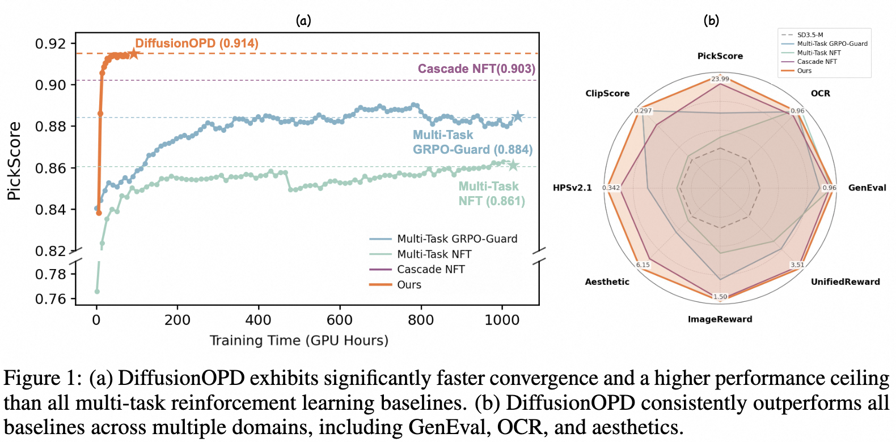
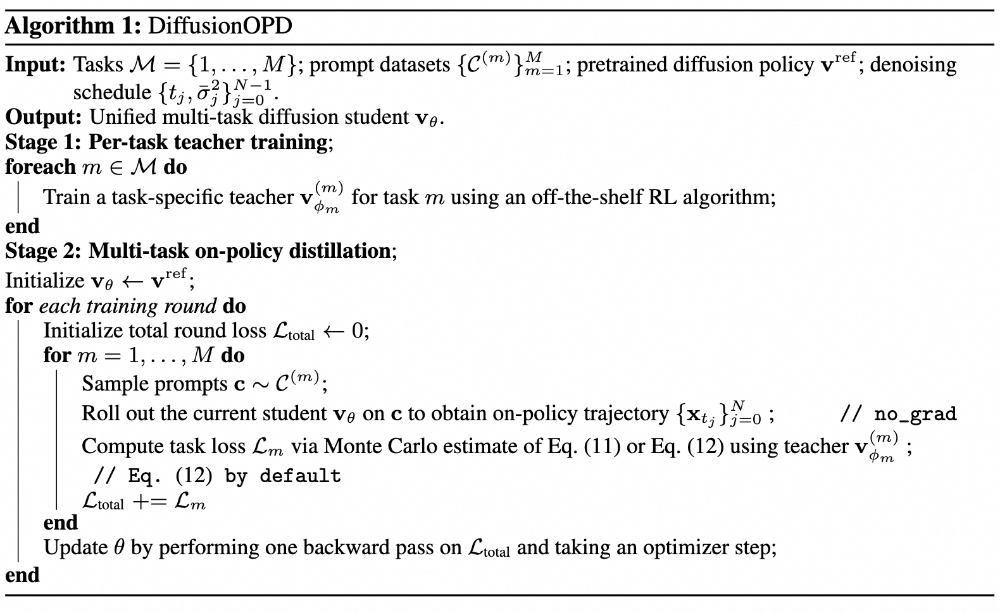
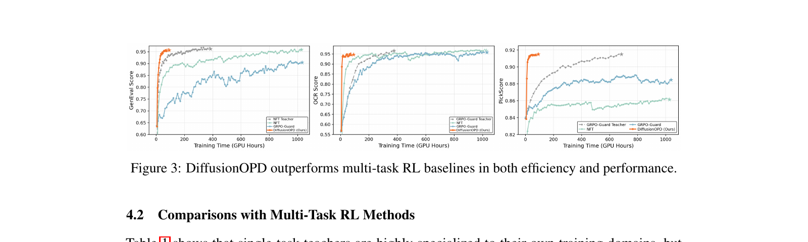
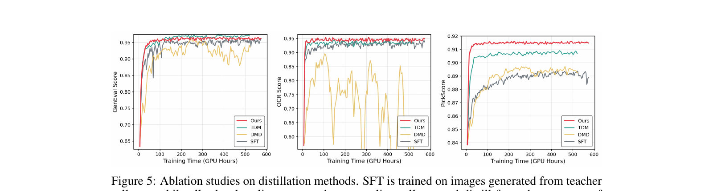
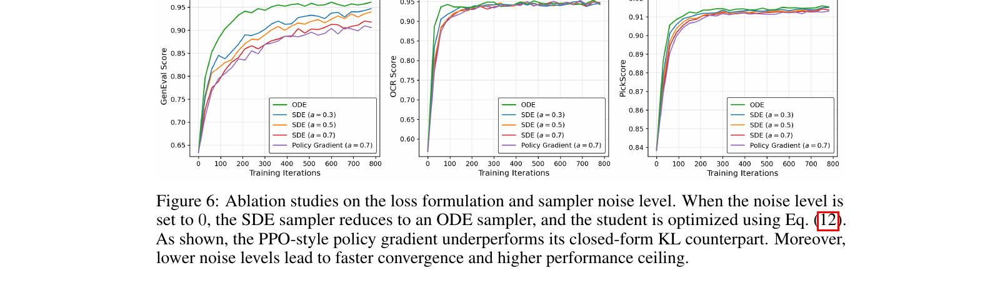
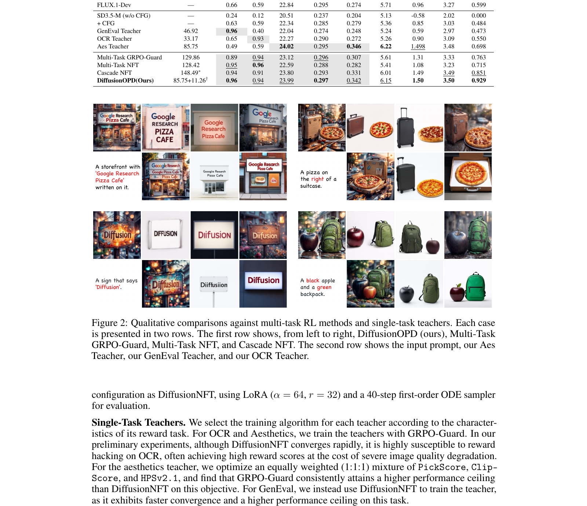

# DiffusionOPD: 把 LLM 的 On-Policy Distillation 抬到 diffusion 上, 一个 closed-form 反向 KL 干掉 multi-task RL 的 PPO 噪声

<figure>
  
  <figcaption>
    Fig. 1 — <strong>(a)</strong> Convergence: DiffusionOPD (橙) 比 multi-task RL baselines (Multi-Task NFT / Multi-Task GRPO-Guard / Cascade NFT) 收敛更快、上限更高 (PickScore 0.914)。<strong>(b)</strong> Radar: 在 GenEval / OCR / PickScore / ClipScore / HPSv2.1 / Aesthetic / ImageReward / UnifiedReward 八个域上几乎全面占优。Cascade NFT 是当前最强 baseline (0.903) 但训练时间最长。
  </figcaption>
</figure>

## 1. 出发点 (Motivation)

文生图模型做完预训练之后, 标准的"对齐"路线是 RL — 用一个 reward model 把模型 push 到你想要的方向: 美学、文本一致、OCR、组合泛化。这条路单任务上 (e.g. [[flow-opd-2026]] 美学, [[awm-2025]] 数学/构图) 是成熟的。

问题是用户想要的是**多任务都好**: 一张图既要美又要 OCR 对、还要 prompt faithful。多任务 RL 有两条传统路线, 都不好走:

1. **Joint 优化** (multi-task GRPO / NFT): 把多个 reward 同时塞进训练循环, 不同任务交替 batch。问题是 (a) reward 之间梯度方向冲突, (b) 简单任务 (OCR) 收敛快、压制困难任务 (Aesthetic) 的信号。
2. **Cascade RL**: 一个任务一阶段地训, 训完 OCR 再训美学。问题是 (a) 多阶段繁琐, (b) **灾难遗忘** — 第二阶段把第一阶段学的能力擦掉一部分。

Paper 的主张: **把"单任务探索" (RL on single reward) 和 "多任务整合" (combine M policies into 1) 解耦**。具体做法是抄 LLM 的成熟思路 — **On-Policy Distillation (OPD)** [Agarwal 2024]:
- Stage 1: 每个任务独立训一个 teacher (随便用什么 RL 算法都行)
- Stage 2: 让一个**unified student** 自己 rollout 轨迹, 在每条轨迹上由对应 task 的 teacher 提供 dense supervision

LLM 上 OPD 的关键技术是**反向 KL 在离散 token 分布上有 closed form** (vocabulary 上的求和), 所以可以直接 backprop, 不用 REINFORCE。要把它搬到 diffusion 上, 论文要解决一个根问题: **diffusion 的每一步是连续状态空间 Gaussian transition, KL 怎么算?** 答案就是 §3.2 的核心推导。

## 2. 方法 (Method)

### 2.1 LLM 上的 OPD 长什么样 (Preliminary)

LLM 是自回归 token 序列 $x = (x_1, \dots, x_T)$, 学生 $\pi_\theta$ 和 teacher $\pi^\star$ 都按 chain rule 分解:

$$ \pi_\theta(x) = \prod_{t=1}^T \pi_\theta(x_t \mid x_{\lt t}), \quad \pi^\star(x) = \prod_{t=1}^T \pi^\star(x_t \mid x_{\lt t}) $$
<p class="math-translation">—— 翻译: 整个序列的概率 = 每一步在给定前缀下的条件概率之积。</p>

OPD 目标是 **学生自己 rollout** 后, 在它走过的前缀上, 让每一步条件分布去匹配 teacher:

$$ \mathcal{L}_{\text{OPD}}^{\text{LLM}}(\theta) = \mathbb{E}_{x \sim \pi_\theta} \left[ \sum_{t=1}^T \mathrm{KL}\big(\pi_\theta(\cdot \mid x_{\lt t}) \,\Vert\, \pi^\star(\cdot \mid x_{\lt t})\big) \right] $$
<p class="math-translation">—— 翻译: 期望(在学生采样的轨迹上)的每一步条件 KL 之和。它跟 sequence-level 反向 KL 是数学上等价的 — 链式法则一摊就出来。</p>

对 LLM, 每个 step 的 KL 是**离散词表 $\mathcal{V}$ 上的求和**, 显式 closed form:

$$ \mathrm{KL}(\pi_\theta \Vert \pi^\star) = \sum_{v \in \mathcal{V}} \pi_\theta(v \mid x_{\lt t}) \log \frac{\pi_\theta(v \mid x_{\lt t})}{\pi^\star(v \mid x_{\lt t})} $$

这就是为什么 LLM 上 OPD 这么便宜 — 没有 high-variance policy gradient, 直接 backprop。

### 2.2 把 OPD 抬到 diffusion: 离散时间 Markov chain 视角

把 (3) 抽象一层: 它**根本不依赖 token 性质**, 只需要 (i) 同样的状态空间和 transition kernel 结构, (ii) per-step KL 是 closed-form。所以 paper 把"前缀"换成"denoising 状态", 把"$\pi(\cdot \mid x_{\lt t})$"换成"$p(\cdot \mid x_{t_j})$":

$$ \mathcal{L}_{\text{OPD}}(\theta) = \mathbb{E}_{x_{0:N} \sim p_S} \left[ \sum_{j=0}^{N-1} \mathrm{KL}\big(p_S(\cdot \mid x_{t_j}) \,\Vert\, p_T(\cdot \mid x_{t_j})\big) \right] $$
<p class="math-translation">—— 翻译: 在学生 rollout 的 N 步去噪轨迹上, 每一步学生 transition kernel $p_S$ 和 teacher transition kernel $p_T$ 的 KL 求和。其中 $t_0 > t_1 > \dots > t_N = 0$ 是逆向时间。</p>

### 2.3 关键洞察: SDE 离散化让 $p_S, p_T$ 是同协方差 Gaussian

跟 [[flow-opd-2026]] / [[awm-2025]] 一样, paper 沿用 Flow-GRPO 的 Euler-Maruyama 反向 SDE 离散化。给定 noise schedule $\sigma_t = a \sqrt{t/(1-t)}$ (其中 $a$ 是全局噪声水平), 学生 velocity $v_j^S := v_\theta(x_{t_j}, t_j)$, 学生这一步 SDE update 是:

$$ x_{t_{j+1}} = x_{t_j} + \left[v_j^S + \frac{\sigma_{t_j}^2}{2 t_j}\big(x_{t_j} + (1-t_j) v_j^S\big)\right] \Delta t_j + \sigma_{t_j} \sqrt{-\Delta t_j}\, \varepsilon_j $$
<p class="math-translation">—— 翻译: 当前噪声态 $x_{t_j}$ 加上一个由 velocity + drift correction 决定的确定性位移, 再叠一个 $\mathcal{N}(0, I)$ 的随机扰动。$\Delta t_j < 0$ 因为时间是反向走。</p>

把式中确定性部分聚合, 抽象成 transition kernel:

$$ p_S(x_{t_{j+1}} \mid x_{t_j}) = \mathcal{N}\big(\mu^S(x_{t_j}), \bar\sigma_j^2 I_d\big), \quad \bar\sigma_j^2 := \sigma_{t_j}^2 (-\Delta t_j) $$

$$ \mu^S(x_{t_j}) = \left(1 + \tfrac{\sigma_{t_j}^2}{2 t_j} \Delta t_j\right) x_{t_j} + \left(1 + \tfrac{\sigma_{t_j}^2 (1-t_j)}{2 t_j}\right) v_j^S \Delta t_j $$
<p class="math-translation">—— 翻译: 学生这一步的 transition mean $\mu^S$ 是 $x_{t_j}$ 和学生 velocity $v_j^S$ 的线性组合; 协方差 $\bar\sigma_j^2$ 只跟 schedule + 全局噪声水平 $a$ 有关, 跟模型参数 $\theta$ 完全无关。</p>

Teacher 用**完全一样的公式**, velocity 换成 frozen teacher $v_j^T := v_\phi(x_{t_j}, t_j)$, 得到 $p_T = \mathcal{N}(\mu^T(x_{t_j}), \bar\sigma_j^2 I_d)$。**关键: 学生和老师协方差一致** (都依赖同一个 schedule), 而且都在**学生 rollout 的同一个 $x_{t_j}$ 上 evaluate**。

<p class="code-source">repo/flow_grpo/diffusers_patch/sd3_sde_with_logprob.py:L48-L58 — 反向 SDE 的 prev_sample_mean 实现 (Eq. 7)</p>

```python
sigma = self.sigmas[step_index].view(-1, *([1] * (len(sample.shape) - 1)))
sigma_prev = self.sigmas[prev_step_index].view(-1, *([1] * (len(sample.shape) - 1)))
sigma_max = self.sigmas[1].item()
dt = sigma_prev - sigma

if sde_type == 'sde':
    std_dev_t = torch.sqrt(sigma / (1 - torch.where(sigma == 1, sigma_max, sigma)))*noise_level

    # our sde
    prev_sample_mean = sample*(1+std_dev_t**2/(2*sigma)*dt)+model_output*(1+std_dev_t**2*(1-sigma)/(2*sigma))*dt
```

对应 paper Eq. (7): `sigma` ↔ $t_j$ (SD3 scheduler 用 sigma 作时间), `std_dev_t` ↔ $\sigma_{t_j}$, `model_output` ↔ $v_j^S$ (或 $v_j^T$ — 同函数复用), `dt` ↔ $\Delta t_j < 0$。`noise_level` 就是 paper 的 $a$。

### 2.4 同协方差 Gaussian 的 KL 有 closed form

两个 $d$ 维同协方差高斯之间的 KL:

$$ \mathrm{KL}\big(\mathcal{N}(\mu_1, \Sigma) \,\Vert\, \mathcal{N}(\mu_2, \Sigma)\big) = \tfrac{1}{2} (\mu_1 - \mu_2)^\top \Sigma^{-1} (\mu_1 - \mu_2) $$

代 $\Sigma = \bar\sigma_j^2 I_d$, 得:

$$ \boxed{\mathrm{KL}\big(p_S \Vert p_T\big) = \frac{\| \mu^S(x_{t_j}) - \mu^T(x_{t_j}) \|_2^2}{2 \bar\sigma_j^2}} $$
<p class="math-translation">—— 翻译 (核心): 学生和老师在同一个 noise 态上的 transition KL = "transition mean 的平方差" 除以 "transition 方差的 2 倍"。这是<strong>纯 deterministic 表达式</strong> — 采样噪声 $\varepsilon_j$ 在解析过程中完全消掉了。</p>

整体 DiffusionOPD 目标 (Eq. 11):

$$ \mathcal{L}_{\text{OPD}}^{\text{diffusion}}(\theta) = \mathbb{E}_{x_{0:N} \sim p_{S,\theta}} \left[ \sum_{j=0}^{N-1} \frac{\| \mu^S(x_{t_j}; \theta) - \mu^T(x_{t_j}) \|_2^2}{2 \bar\sigma_j^2} \right] $$

**ODE 极限**: 当 $a \to 0$ (noise level → 0), $\bar\sigma_j \to 0$, KL 形式 (除以 $2\bar\sigma_j^2$) 会爆。Paper 直接论证: 在确定性 ODE Euler update 下, $p_S, p_T$ 不再是 stochastic kernel 而是 pointwise 映射, 所以"分布匹配"退化成"transition mean 匹配", 损失就是 (Eq. 12):

$$ \mathcal{L}_{\text{OPD}}^{\text{ODE}}(\theta) = \mathbb{E} \left[ \sum_{j=0}^{N-1} \tfrac{1}{2} \| \mu^S(x_{t_j}; \theta) - \mu^T(x_{t_j}) \|_2^2 \right] $$
<p class="math-translation">—— 翻译: ODE 极限下损失就是<strong>纯 L2 transition matching</strong>, 没有 $\bar\sigma_j^2$ 的归一化。SDE / ODE 在 DiffusionOPD 框架下用<em>同一套代码</em>实现, 只看 $a$ 的取值。</p>

<p class="code-source">repo/scripts/train_sd3_opd.py:L1167-L1191 — DiffusionOPD loss 实现 (Eq. 11/12 一体化分支)</p>

```python
teacher_prev_mean = sample["teacher_prev_sample_means"][:, j].detach()

delta = (
    prev_sample_mean.float().unsqueeze(1)
    - teacher_prev_mean.float()
)

if float(config.sample.noise_level) <= 0.0:
    per_step_kl = 0.5 * (delta ** 2)                          # Eq. (12): ODE / L2
else:
    sigma_sq = (
        std_dev_t.float() ** 2
    ).clamp(min=1e-8).unsqueeze(1)
    per_step_kl = (delta ** 2) / (2.0 * sigma_sq)             # Eq. (11): SDE / closed-form KL

per_step_kl_per_teacher_scalar = per_step_kl.mean(
    dim=tuple(range(2, per_step_kl.ndim))
)
per_step_kl_scalar = per_step_kl_per_teacher_scalar.sum(dim=1)

distill_loss = per_step_kl_scalar.mean()
loss = distill_loss
```

10 行就是 Eq. 11/12 的完整实现。`delta` 是 transition mean 之差; `noise_level=0` 触发 ODE 分支 (Eq. 12), 否则用 σ² 归一化 (Eq. 11)。注意 `.detach()` — teacher mean 不参与梯度。**默认 config 用 `noise_level=0.0` (即 ODE 分支)**, 配 §4.3 ablation 的结论 (ODE 比 SDE 快最多 5x)。

### 2.5 §3.3 关键论证: PPO-style 和 closed-form KL 期望梯度相同, 但 PPO 多一项纯噪声

这一节是 paper 最有教育意义的部分。换种角度想 OPD: 把 teacher 视为 process reward model, 每一步的 negative KL 当作 advantage $A_j$, 用 PPO surrogate 优化:

$$ \mathcal{L}_{\text{PG}}(\theta) = -\mathbb{E}_{a_j \sim \pi_{\theta_{\text{old}}}} \left[ \min\big(\rho_j(\theta) A_j,\, \text{clip}(\rho_j, 1-\epsilon, 1+\epsilon) A_j\big) \right] $$

忽略 clipping, gradient accumulation 期间 $\pi_{\theta_{\text{old}}} = \pi_\theta$ 所以 $\rho_j = 1$, 梯度展开:

$$ \nabla_\theta \big(\rho_j \Delta_j\big) = \underbrace{\nabla_\theta \Delta_j}_{\text{pathwise term}} + \underbrace{\Delta_j \,\nabla_\theta \log \pi_\theta(a_j \mid x_{t_j})}_{\text{score-function term}} $$
<p class="math-translation">—— 翻译: PPO 梯度 = 解析的 pathwise term + 一个跟 sampled action $a_j$ 相关的 score-function term。</p>

由于 $\Delta_j$ 不依赖采样动作 $a_j$ (它只是 closed-form KL), 而 $\mathbb{E}_{a_j}[\nabla \log \pi_\theta] = 0$, 所以 **score-function term 的期望为 0**:

$$ \mathbb{E}[\nabla_\theta \mathcal{L}_{\text{PG}}] = \nabla_\theta \mathcal{L}_{\text{OPD}}^{\text{diffusion}} $$

两个 estimator 期望相同。**但 PPO 多出来的这一项是纯方差**。具体: 对 Gaussian transition $a_j = \mu^S(x_{t_j}; \theta) + \bar\sigma_j \varepsilon_j$, $\nabla_\theta \log \pi_\theta(a_j \mid x_{t_j}) = (\varepsilon_j / \bar\sigma_j) \cdot \nabla_\theta \mu^S$ — 这一项跟采样噪声 $\varepsilon_j$ 直接耦合, **每次 mini-batch 都注入新方差**。

Paper 还指出 PPO 形式的第二个缺陷: **它依赖 stochastic policy density 和 $\rho_j$**, 在 ODE (确定性) 极限下根本写不出来。Closed-form KL 反而能从 SDE 平滑过渡到 ODE — 这就是 paper 标题的"unified perspective"。

### 2.6 Two-stage 训练 recipe

<figure>
  
  <figcaption>
    Algorithm 1 — Stage 1: 每个 task 用任意 RL 算法 (GRPO-Guard / DiffusionNFT 等) 独立训一个 teacher; Stage 2: 学生用<strong>round-robin</strong> 顺序在每个 task 上采轨迹 + 调对应 teacher 算 OPD loss, 一个 round 累加完 $M$ 个 task 的 loss 再做 <strong>1 次</strong> optimizer step。
  </figcaption>
</figure>

代码里 round-robin 是 `i % M`, teacher 通过 LoRA adapter 切换 (没有多份模型权重, 只是 swap LoRA):

<p class="code-source">repo/scripts/train_sd3_opd.py:L875-L881 — round-robin teacher 选择 + 对应数据集采样</p>

```python
teacher_idx = i % len(teachers)
slot_adapters = slot_adapter_names[teacher_idx]
slot_guidance_scales = slot_adapter_guidance_scales[teacher_idx]
train_samplers[teacher_idx].set_epoch(
    epoch * config.sample.num_batches_per_epoch + i
)
prompts, prompt_metadata = next(train_iters[teacher_idx])
```

学生用 `default` LoRA adapter 自采轨迹, 然后对每个 task 的 teacher LoRA adapter 切过去算 $\mu^T$:

<p class="code-source">repo/scripts/train_sd3_opd.py:L936-L965 — 切到 teacher LoRA 算 transition mean</p>

```python
for k_idx, adapter_name in enumerate(slot_adapters):
    unwrap_model(transformer, accelerator).set_adapter(adapter_name)
    with contextlib.nullcontext():

        teacher_gs = slot_guidance_scales[k_idx]
        teacher_prev_sample_mean_list = []
        for j in range(config.sample.num_steps):
            teacher_prev_mean_j = compute_teacher_step_mean(
                    transformer=transformer,
                    pipeline=pipeline,
                    latents_at_j=latents[:, j],
                    next_latent_at_j=latents[:, j + 1],
                    timestep_at_j=timesteps[:, j],
                    cond_embeds=prompt_embeds,
                    cond_pooled=pooled_prompt_embeds,
                    neg_embeds=sample_neg_prompt_embeds_b,
                    neg_pooled=sample_neg_pooled_prompt_embeds_b,
                    guidance_scale=teacher_gs,
                    noise_level=config.sample.noise_level,
                    solver=sample_solver,
                    deterministic=sample_deterministic,
                )
```

Gradient accumulation factor $G = M$ — 即一个 round-robin cycle (覆盖所有 $M$ 个 task) 才做一次 backward + optimizer step。Config 里:

<p class="code-source">repo/config/opd.py:L40-L55 — gradient_accumulation_steps 跟 round-robin cycle 对齐</p>

```python
config.sample.train_batch_size = 3
config.sample.num_image_per_prompt = 1
config.sample.num_batches_per_epoch = 3      # 3 teachers (pickscore / ocr / geneval)
assert config.sample.num_batches_per_epoch % 3 == 0, (
    "Please set config.sample.num_batches_per_epoch to a multiple of "
    "len(config.train.teachers) (=3 here)."
)

config.train.batch_size = config.sample.train_batch_size
config.train.gradient_accumulation_steps = config.sample.num_batches_per_epoch
config.train.num_inner_epochs = 1
config.train.timestep_fraction = 0.99
```

每个 round 一次更新 — 减少 task 偏差 (没有任何一个 task 单独主导一次 step)。

## 3. 结论 (Key findings)

### 3.1 多任务主结果 (Table 1)

<figure>
  
  <figcaption>
    Table 1 — SD3.5-M base, LoRA (α=64, r=32), 40-step ODE 评测。<strong>DiffusionOPD average 0.929</strong> 全场最高: GenEval 0.96 (与 GenEval Teacher 持平), OCR 0.94 (OCR Teacher 0.93, 略反超), PickScore 23.99 (Aes Teacher 24.02), Aesthetic 6.15 (Aes Teacher 6.22)。Cascade NFT 0.851 是最强 baseline。Multi-Task GRPO-Guard / NFT 分别 0.763 / 0.715 — 远低于 cascade, 说明 joint 多目标真的会互相打架。
  </figcaption>
</figure>

数字层面最值得圈点的几个点:
- **几乎匹配每一个 single-task teacher 的天花板** — 这是 OPD 框架的核心承诺: 学生不需要重新探索, 只需要在 teacher 已经会走的轨迹上学每一步映射。
- **OCR 上 0.94 反超 OCR Teacher 0.93** — 教育上很反直觉但合理: 多 teacher 在 round-robin 中互相 regularize, student 比单一 teacher 更稳。
- **Wall-clock 85.75 + 11.26 GPU h ≈ 97 GPU h** (即 max single-teacher 训练时间 + 11.26h 的 distillation), 比 cascade NFT 的 148.49 h 少 35%。如果 teachers 可以并行训 (paper 实验里它们是), 实际真实时间更短。
- DiffusionOPD 跟 GRPO-Guard Teacher (PickScore 0.91, Aes 6.22) 在 PickScore 上没完全追平 (23.99 vs 24.02) — 美学这种主观 reward 上仍有微小 gap。

### 3.2 训练效率 (Fig 3)

<figure>
  
  <figcaption>
    Fig. 3 — 三个域 (GenEval / OCR / PickScore) 的收敛曲线。橙色 DiffusionOPD 在所有三个域上都<strong>快几个数量级地</strong>达到接近 teacher 的水平 (~100 GPU h), 而 multi-task RL baselines (蓝色 NFT, 绿色 GRPO-Guard) 训到 ~1000 GPU h 才接近。Cascade NFT 这里没画 (它的总时间最长且分阶段, 没法画统一的训练曲线)。
  </figcaption>
</figure>

### 3.3 vs 其他 distillation 方法 (Fig 4-5)

<figure>
  
  <figcaption>
    Fig. 5 — 同样从 single-task teachers 蒸馏, 不同 distillation 目标的对比: <strong>DiffusionOPD (红, 我们)</strong> vs DMD (Distribution Matching) vs TDM (Trajectory Distribution Matching) vs SFT (在 teacher 生成图上做有监督). 在 GenEval + OCR + PickScore 上 DiffusionOPD 都明显更快收敛 + 更高上限。
  </figcaption>
</figure>

值得注意的是 SFT (黄色) 在 OCR 和 PickScore 上**反而下降** — paper 没明说, 但很可能是 teacher 自生成图的分布偏窄, student 学完后泛化变差 (典型的 self-distillation 退化路径)。这是 DiffusionOPD 用 "on-policy student rollout + teacher supervises on those states" 比 SFT 优越的硬证据。

### 3.4 §3.3 实证: PPO-style vs closed-form KL (Fig 6)

<figure>
  
  <figcaption>
    Fig. 6 — Loss formulation + sampler noise level 联合 ablation。<strong>紫线 (Policy Gradient, a=0.7)</strong> 是 PPO-style 优化; <strong>红线 (SDE, a=0.7)</strong> 是同噪声水平下的 closed-form KL; <strong>绿线 (ODE)</strong> 是 $a \to 0$ 极限 (Eq. 12 的 L2)。两个 take-away: (1) 同噪声水平下 closed-form KL > PPO-style — 直接验证 §3.3 的方差分析; (2) 噪声水平越低越好 — ODE 比 SDE(a=0.7) 收敛快约 5x。
  </figcaption>
</figure>

### 3.5 定性对比

<figure>
  
  <figcaption>
    Fig. 2 — 4 个 prompt 的定性对比 (每个 prompt 两行: 第一行是 multi-task 方法 — DiffusionOPD / Multi-Task GRPO-Guard / Multi-Task NFT / Cascade NFT; 第二行是单 task teachers — Aes / GenEval / OCR)。<strong>"a sign that says Diffusion"</strong> 这一行特别说明问题: 我们的方法清晰拼出 "Diffusion" 文字, Multi-Task GRPO-Guard 拼出来但艺术性差, Multi-Task NFT 字母乱掉, Cascade NFT 拼出但美学一般。
  </figcaption>
</figure>

## 4. 实现细节 (Implementation Notes)

代码细节, 论文不一定明说但读代码能挖到的:

- **代码 fork 自 DiffusionNFT (NVlabs)**, 而 DiffusionNFT 又是 fork 自 Flow-GRPO ([[flow-opd-2026]] 也是同源)。所以包名仍叫 `flow_grpo`, 但训练入口是 `scripts/train_sd3_opd.py` (1221 行)。读源码时, `flow_grpo.diffusers_patch.sd3_sde_with_logprob.sde_step_with_logprob` 是 SDE step 的 ground truth, 同一个函数被学生和老师复用 — 区别只是 `noise_pred` 传哪边的 model output 进去。

- **默认 noise_level = 0** (`config/opd.py:L60`)。这意味着论文的默认配置实际上是 **Eq. 12 (ODE/L2 transition matching) 不是 Eq. 11 (SDE/reverse KL)**。Eq. 11 在 ablation 里测过 (Fig 6 红/橙/蓝线), 但生产配置选了 ODE — Fig 6 显示 ODE 收敛快 5x。这点 paper 主文没强调清楚。

- **Sample steps = 10 推理 / Eval = 40 步** (`config/opd.py:L40-L42`)。训练时只跑 10 步采样 (省时间), 评测时 40 步 ODE (跟 DiffusionNFT setup 对齐)。这是 paper-vs-code 一致, 不是 gap。

- **3 个 teacher LoRA adapter** (`config/opd.py:L72-L94`): pickscore (Aes) + ocr + geneval。每个 teacher 的 guidance scale 不一样: pickscore=4.5, ocr=4.5, **geneval=1.0** (这点 paper 没解释; 推测是 GenEval teacher 用 DiffusionNFT 训的, 它本身不依赖 CFG)。

- **`config.train.beta = 0.0`** — 没有 KL 到 base model 的正则项。OPD 的所有"约束力"全靠 teacher 提供, 不像 DDPO/PPO 那样需要 anchor 到 reference model。这是 OPD 架构的一个隐性优势 — 但也意味着如果 teacher 自身 reward-hacked, student 一定会复现 (no safety net)。

- **EMA 默认开** (`config.train.ema = True`): student 参数维护一个 exponential moving average 用来评测。 [[awm-2025]] 也有这设计, 但那篇被 reviewer 指出过 paper-vs-code mismatch。

- **`gradient_accumulation_steps` 跟 `num_batches_per_epoch` 锁死成同一值** — 这意味着每个 epoch (round-robin 循环 M 个 task 一次) 只做 1 次 optimizer step。如果你改了 batch size 而不调 grad_accum, 训练完全跑不通 (assert 会先 crash)。

- **没有显式的 distill_loss 平衡** — 多任务 loss 直接 `.sum()` 加起来 (`train_sd3_opd.py:L1188`)。Paper 没讨论, 但因为同一架构、同一 schedule, 三个 task 的 $\|\mu^S - \mu^T\|^2$ 尺度其实接近, 不像异质 reward 需要权重调。

- **首版代码 release 里 `lora_path` 全是占位符** `"YOUR_AES_TEACHER_PATH"`, 真要复现得自己先训 3 个 teacher (或下载 Hugging Face 上 `quanhaol/Aes-Teacher`, `OCR-Teacher`, `GenEval-Teacher`)。

- **没有 SDE log prob 用于 PPO baseline** — `sde_step_with_logprob` 返回 log_prob, 但 `train_sd3_opd.py` 不调用这个值; 它只用 `prev_sample_mean`。Fig 6 紫线 (Policy Gradient) 的代码路径**没在 release 里**。要复现 §3.3 的 ablation 比较, 得自己加 PPO loss 分支。

## 5. 批判性总结 (Critical assessment)

### 5.1 优点

- **§3.3 那段方差分析是真好** — 把 closed-form KL 和 PPO 的关系讲清楚了, 而且 Fig 6 紫 vs 红线给了实证。这是这篇 paper 在 [[flow-opd-2026]] / [[d-opsd-2026]] / [[awm-2025]] 这一波 "把 RL 拽回 supervised target" 浪潮里最独到的 contribution: **不是说 PPO 错, 而是说 PPO 在 closed-form 可得的场合是"自找麻烦"**。
- **ODE / SDE 统一**: Eq. 11/12 在代码里就是一个 `if noise_level <= 0` 的分支, 框架性强。同一套训练代码可以平滑切换 sampler 类型, 这跟 [[flow-opd-2026]] 的 hybrid SDE-ODE 思路异曲同工。
- **Round-robin + LoRA adapter 切换** — 工程上很优雅: 3 个 teacher 不占 3 份显存, 共享 transformer backbone, 只 swap LoRA。这让"多 teacher 蒸馏"成本接近"单 teacher 蒸馏"。
- **结果数字硬**: average 0.929 vs cascade 0.851, 在 8 个 metric 上几乎全胜, 而且 wall-clock 更少。reward hacking 风险也比 cascade 低 (因为 student 看到的是 teacher transition mean, 不是 reward 直接信号 — teacher 的 reward hack 行为不会被放大)。

### 5.2 不足 / 疑点

- **理论上的"unified"略显勉强**: Eq. 12 (ODE 极限) 是用"分布退化成 pointwise 映射, 所以 KL 写不出来, 退化成 L2"这种文字论证, **没给严格的 $a \to 0$ 极限推导**。读者得自己确信"$\bar\sigma_j^2 \to 0$ 时, KL 这个量本身爆掉但梯度方向收敛到 L2 的方向"。一个数学严谨的版本应该取 $\bar\sigma_j^2$ 的极限然后用 $\Gamma$-convergence 或类似工具证明。
- **PPO-style baseline 的代码没 release** (§4 提到), 想精确复现 Fig 6 紫色曲线得自己写。这是个透明性问题。
- **配置假设 3 teacher**: assert `num_batches_per_epoch % 3 == 0` 是 hard-coded 数。如果要扩展到 5 个 reward, 改 batch 数 + assert 就行, 但 paper 没在更多 reward 数量上跑 — 是否 round-robin 还稳, 是开放问题。
- **Teacher 的 reward hack 会被 student 完整复现**: §3.3 的论证只关心"对 teacher 的匹配方差"; 它不关心"teacher 是不是个好东西"。如果 OCR teacher 本身在某些 prompt 上崩溃了 (paper 提过 DiffusionNFT 在 OCR 上易 reward hack — 所以才换 GRPO-Guard), student 也会忠实学过来。**OPD 的上限就是 teacher 集合的上限的某种凸组合, 不会超过去**。
- **没跟 [[d-opsd-2026]] / [[flow-opd-2026]] 对比**: 这三篇都是 2026/05 的同期工作, 名字都叫 \*OPD, 但侧重不同 (D-OPSD 是 self-distillation 持续更新 step-distilled 模型; Flow-OPD 是 on-policy distillation for flow matching 美学单任务; DiffusionOPD 是多任务). 不同 niche, 但读者会困惑这些 OPD 的关系。Paper 没在 related work 把这条线串清楚 (可能因为同期发布, 来不及引用)。
- **Aes teacher 训练时间 85.75 GPU h** 是 DiffusionOPD 总开销的主导项。如果某个 reward 训练 teacher 本身比 cascade 还慢, 那 OPD 的速度优势会蒸发。Paper 没在不同 reward 难度组合下做 sensitivity analysis。
- **`weights_url` 给了 HF, 但论文核心实验在 SD3.5-M 上, 没在 FLUX 或 SD3.5-Large 验证 generalization**。 multi-task RL 在更大模型上是否仍是 joint 优化失败 + DiffusionOPD 大幅胜出, 不知道。

### 5.3 适用 vs 不适用

- ✅ **适用**: 你有 1-N 个已经训好的 single-task teacher (或愿意训), 想把它们整合成一个 unified policy; reward 之间存在冲突 (joint RL 不收敛); 模型是 flow-matching 架构 (SD3 / FLUX)。**整个 OPD 框架对 score-based diffusion 同样适用**, 只是 transition kernel 推导要重做。
- ✅ **适用**: 想理解"为什么 closed-form supervision 比 stochastic policy gradient 优"。这篇 paper 的 §3.3 适合做 reading group case。
- ❌ **不适用**: 你只有**一个 reward** — DiffusionOPD 没有任何收益, 直接用 GRPO-Guard / DiffusionNFT 训单 task。
- ❌ **不适用**: 你**没有 teacher** 也不想训 — OPD 本质是知识转移, 没有 teacher 就退化成普通 RL。
- ❌ **不适用**: 你的 reward 是**外部 API / 人工评估** (不能 backprop) — OPD 要求 teacher 是可调用的模型; 如果 reward 只能给 scalar, 只能走 RL 路线。

### 5.4 进一步阅读

- **同期 *OPD 三兄弟**: [[flow-opd-2026]] (单任务 flow-matching 美学), [[d-opsd-2026]] (step-distilled 模型上的 continuous self-distillation), DiffusionOPD (本篇, 多任务整合) — 三者都基于"on-policy + teacher transition supervision"思路, niche 不同。
- **OPD 原版** (LLM 上): Agarwal et al. 2024 "On-Policy Distillation of Language Models", paper 直接抬这套到 diffusion。
- **DiffusionNFT** (NVlabs, 2026): 本 paper 的 codebase 来源, 也是它 multi-task baseline 之一 (Cascade NFT)。
- **Flow-GRPO** (Liu et al. 2025): SDE 离散化和反向 sampling 的来源, 本 paper 的 Eq. 5-7 直接借用。
- **DMD / TDM**: Fig 5 里的 baseline, 都是 step distillation 方向, 跟本 paper 的 "knowledge integration distillation" niche 不同, 但 distillation objective 设计上有借鉴价值。
- **GRPO-Guard / DiffusionNFT** 作为 teacher 训练算法: 本 paper 在不同 reward 上挑了不同 RL 算法做 teacher — 这本身就是个有用的 "什么 reward 该用什么 RL" 经验法则。
