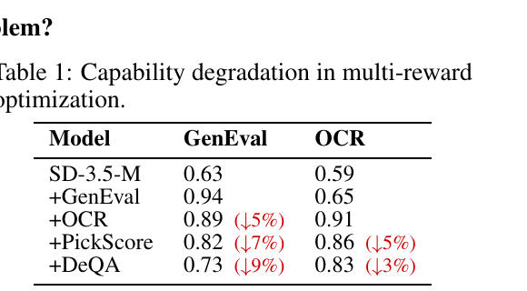
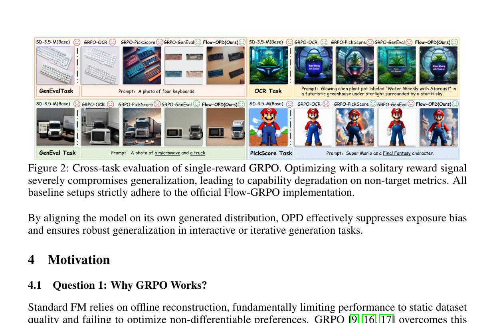
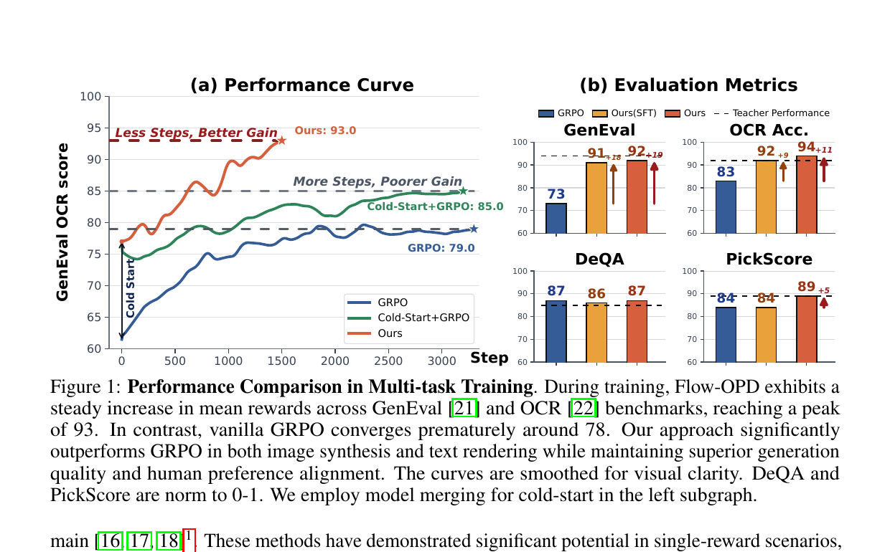
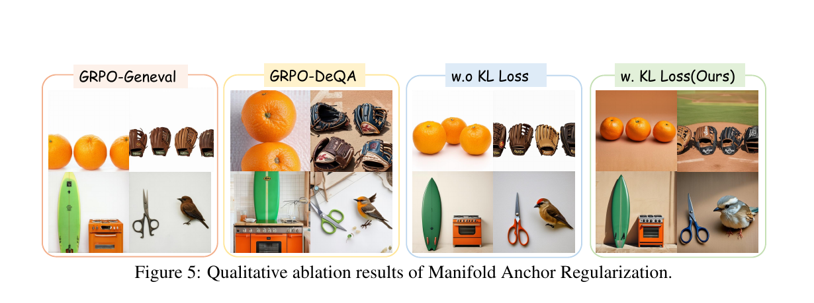
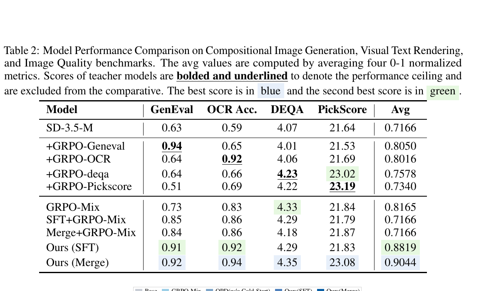
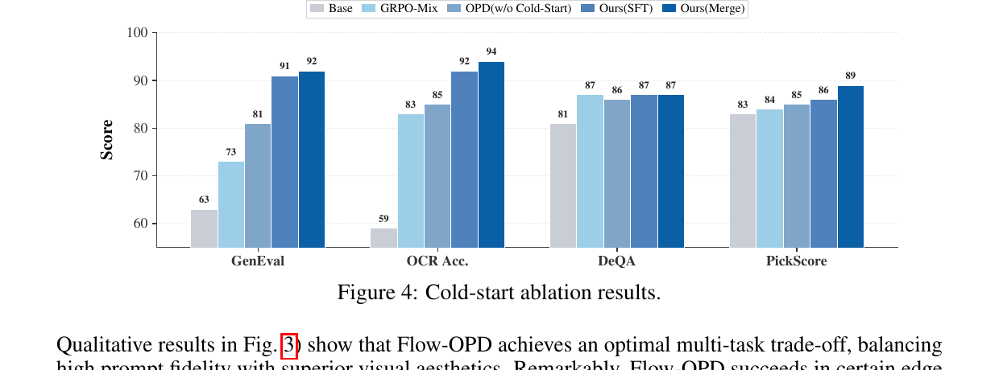
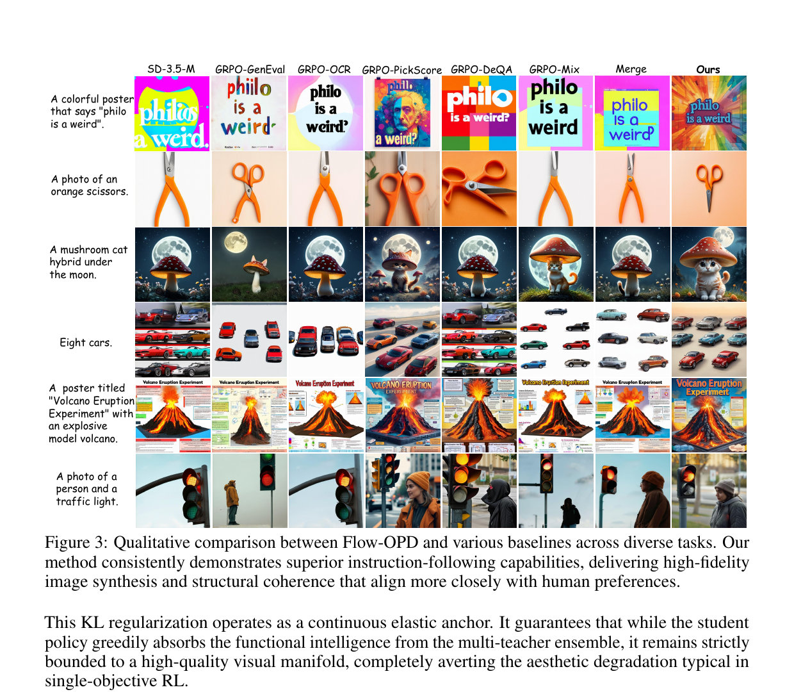

# Flow-OPD: On-Policy Distillation for Flow Matching Models

## 1. 出发点 (Motivation)

T2I 模型 (Stable Diffusion 3.5 等 flow-matching backbone) 想要做"一个模型干很多事" — 同时擅长组合性 (GenEval)、文字渲染 (OCR)、美学 (PickScore)、整体质量 (DeQA)。RLHF 思路移植到这里就是 **Flow-GRPO**:把 reverse SDE 解释成 Markov 决策过程,reward 上 GRPO。

问题:单 reward 训练可以把一个指标拉满,但**"seesaw effect"** 立刻显现。Tab 1 是论文里那张让人脸疼的数据 — 一步一步叠加 reward,前面拉满的指标就一步一步往下掉:

<figure>
      
      <figcaption>Tab. 1 — 在 SD-3.5-M 上依次叠 GenEval、OCR、PickScore、DeQA 四个 reward。+GenEval 把 GenEval 拉到 0.94;但接着 +OCR,GenEval 掉 5%;+PickScore 再掉 7%;+DeQA 又掉 9%。每加一个新 reward,旧 reward 上的能力就被吃掉。</figcaption>
    </figure>

视觉上更直白 — 单 reward 训出的"专家"在跨任务测试时常常崩坏:

<figure>
      
      <figcaption>Fig. 2 — 单 reward GRPO 横评。GRPO-OCR 把"philo is a weird"渲染对了,但同一模型在 GenEval task 上画"四个键盘"就崩了;GRPO-GenEval 排列得很整齐但 OCR 渲染又出错。每个专家都被自己的 reward 拽偏。</figcaption>
    </figure>

**论文给的因果解释 (Sec. 4.2):** 单 reward GRPO 把多维冲突压缩成标量 advantage,模型为了最大化 $A_1$ 会"吃掉"那些没被监督的参数自由度。一阶 Taylor 近似下,任务 $T_1$ 对未监督任务 $T_k$ 的伤害:

当任务梯度 $\langle \nabla_\theta J_k, \nabla_\theta J_1\rangle \lt 0$ (高维空间里这是常态),没有 $T_k$ 监督的优化器会"主动"破坏 $T_k$ 的能力来换 $T_1$ — 这就是 reward hacking 的根因。**标量 reward 的信息密度天然不够,你需要 dense 的 trajectory-level 监督。**

LLM 那边怎么解的?**On-Policy Distillation (OPD)** — 学生自己采样 → 教师在学生的 trajectory 上提供 dense 监督。DeepSeek-V4 / Mimo v2 / GLM-5 全在用。问题是 LLM 是离散 next-token,OPD 怎么"翻译"到连续速度场 flow matching 上?这就是 Flow-OPD 的全部技术贡献。

## 2. 方法 (Method)

### 核心思想 (类比)

把 SD-3.5-M 想成一个学画画的学生,要同时学:

- **构图老师**(GenEval 教师) — 知道"四个键盘"要怎么放
- **书法老师**(OCR 教师) — 教如何把字写对
- **审美老师**(PickScore 教师) — 给作品打人类偏好分
- **画质老师**(DeQA 教师) — 关心整体清晰度/质感

单 reward GRPO 像"每天只跟一个老师学,这周构图、下周书法"— 上下周互相覆盖,什么都学不全。

Flow-OPD 的玩法:**学生自己画画,每画一笔老师都站旁边看 — 但每张图按内容路由,只让对应的老师评。**

- "四个键盘"这种 prompt → 构图老师批,指着学生这一笔说"应该往左 3 个像素"
- "philo is a weird" 这种 prompt → 书法老师批
- 每张图都额外有一个 *美学保安* (MAR) 在场,无论批啥都不让画风塌掉

关键技术问题是:*怎么定量"老师建议学生这一笔往哪挪 X 像素"*?在 flow matching 里,每一步的"建议"就是**速度场的差**。论文的核心数学贡献就是把这一点严格地从 reverse KL 推导出来。

### 2.1 Flow Matching 速览

Flow Matching (Lipman et al. 2023) 把噪声 $p_0$ 映射到数据 $p_{\text{data}}$ 的 ODE:

OT (Optimal Transport) 形式下,直线轨迹 $x_t = (1-t)x_0 + t x_1$,模型 $v_\theta$ 学常速度 $(x_1 - x_0)$,训练目标

把这一离散积分过程看成 Markov 步,就能与 RL 接上 — 这是 Flow-GRPO (Liu et al. 2025) 已经做的事,Flow-OPD 直接继承这一视角。

### 2.2 单 GRPO 为何失败 (sparse reward + 梯度干扰)

论文 Sec. 4 系统讨论了三个问题:

1. **Q1: GRPO 为何起作用?** 因为 on-policy 探索打破了 offline SFT 受限于数据集质量的天花板。
2. **Q2: 单 GRPO 为何在多任务上崩?** 见前面 Taylor 展开 — 标量 advantage 压缩了多维冲突,模型为提高目标指标会"吃"未监督的自由度。
3. **Q3: 直接混 reward 行不行?** 不行 — Tab 1 显示每加一个 reward 旧能力就掉一截。

结论:必须同时满足 (a) on-policy (维持探索) (b) densely uncoupled (每个 task 独立信号,不竞争同一个标量)。这就是 OPD 范式 — 由多个 teacher 在学生的轨迹上分头提供 dense 监督。

### 2.3 ODE → SDE — 注入探索 (Eq. 5-6)

RL 需要 stochastic 行为策略才能做 importance sampling。Flow-OPD 沿用 Flow-GRPO 的做法,把确定性 ODE 转成等价 SDE:

Euler-Maruyama 离散化后,每一步的 transition 分布是各向同性高斯:

$\sigma_t$ 是注入的噪声幅度 (实现里有 `noise_level` 超参,Flow-GRPO 默认 0.7),$\mu_\theta$ 是由学生速度场决定的 Euler 步均值。每个 prompt 采 $G$ 条 trajectory 得到 on-policy 边缘分布 $\rho_t^\theta$。

### 2.4 KL → L2 的精彩折叠 (Eq. 8-9)

这是论文的数学高潮。要把"OPD 用 reverse-KL 当奖励"翻译到连续域,关键问题是:*在 SDE 框架下, $\mathrm{KL}(\pi_\theta \| \pi_{\text{target}})$ 怎么算?*

注意学生策略 $\pi_\theta = \mathcal{N}(\mu_\theta, \sigma_t^2\Delta t\,\mathbf{I})$ 和教师 $\pi_{\text{target}} = \mathcal{N}(\mu_{\text{target}}, \sigma_t^2\Delta t\,\mathbf{I})$ **共享同一个协方差矩阵** — 因为 SDE 的 noise 注入是结构性的,不依赖模型预测。两个等方差高斯之间的 KL 有闭式:

代入 $\Sigma = \sigma_t^2\Delta t\,\mathbf{I}$:

把 $\mu_\theta$ 按 SDE 离散化展开,常数项消掉,KL 就**退化为速度场之间的 L2 距离**:

记 $w(t)$ 为前面的时间相关系数。每一步的 dense reward 就是**负的、加权的、速度场 L2 差** (并 detach 掉 $v_\theta$ 上的梯度):

**这就是论文的核心 trick.** Reverse KL 本来是 LLM 离散概率分布之间的事,在连续 flow matching 里它*等价*于速度场 L2 差 — 实现上你只需要每一步比较学生和教师的预测向量,完全不涉及任何概率密度的解析形式。$\bar v_\theta$ 的 detach 至关重要 (Thinking Machines OPD 的设计哲学): reward 是被监督的目标,不是被反传的对象,梯度只通过 policy ratio 走。

### 2.5 任务路由 + 多教师 dense 监督 (Eq. 7)

四个 teacher 分别在四个 task 上 GRPO 训到饱和。在线训练时,每个 prompt $c$ 被一个**硬路由** $R(c)$ 映射到一个 teacher $k$,只用这个 teacher 的速度场作为目标:

"硬路由"而不是"软混合" — 论文明确说这是为了消除 inter-domain 梯度干扰 — 同一个 prompt 一辈子只跟一个 teacher 学,不会出现"OCR 教师和 GenEval 教师推不同方向"的情况。

<figure>
      
      <figcaption>Fig. 1 — Flow-OPD 训练曲线 (左) 和最终指标 (右):GenEval 训练曲线稳定升到 93,而 vanilla GRPO 提前停在 78;评估指标上 GenEval +19, OCR +11, DeQA 持平 teacher, PickScore +5。</figcaption>
    </figure>

### 2.6 PPO clip + 冷启动 (Eq. 11)

Dense 高频 reward 会让 policy 跳得太狠,论文借 PPO 的 clipped surrogate 来限制每步的策略漂移。设 policy ratio $\rho_{t,i,j}(\theta) = \pi_\theta(a_{t,i,j} \mid s_{t,i,j}) / \pi_{\theta_{\text{old}}}(a_{t,i,j} \mid s_{t,i,j})$,对 B 个 prompts × G 条 trajectory × T 个去噪步取平均:

**冷启动 (Sec. 5.1):**如果学生从 base SD-3.5-M 直接进 OPD,初期 trajectory 完全偏离教师 manifold,信号噪声极大。论文给两个变体:

- **SFT cold-start:** 用每个 teacher 的采样轨迹做 SFT 一段时间
- **Model Merging:** 直接把四个 teacher 的参数平均 — Tab 2 显示这是最好的初始化方式 (Merge cold-start 后 OPD 达 90.4 avg,SFT cold-start 达 88.2)

### 2.7 Manifold Anchor Regularization — 锚定美学 (Eq. 12)

OPD 提供任务对齐的 dense 信号,但有"reward hacking 副作用" — 学生为了 OCR 把整张图画成纯白底黑字,GenEval 拼对了但背景塌成马赛克。MAR 加了一个 **任务无关的美学 teacher** $v_{\text{aesthetic}}$ (论文用 DeQA 训出来的 teacher),在*所有*数据点上提供全场监督:

注意 MAR 是不分 task 全场施加的"美学保安";硬路由的 task-specific teacher 提供主要的能力监督。两套并行。

<figure>
      
      <figcaption>Fig. 5 — MAR 消融。w/o KL Loss 的样本对象单调、背景同质化 (典型的 reward hacking);加上 MAR (w. KL Loss(Ours)) 后橙子有阴影、剪刀有立体感、小鸟羽毛纹理回来了。</figcaption>
    </figure>

### 2.8 与代码对照

Flow-OPD 官方 repo 暂未释放训练代码 (TODO 列表第一条),但作者明确指出基于 [yifan123/flow_grpo](https://github.com/yifan123/flow_grpo) 实现。下面的引文都来自基础 codebase,Flow-OPD 在此之上的扩展点 (multi-teacher routing + detached $\bar v_\theta$ + MAR) 是*替换*而不是*新建*这些函数。

**(a) SDE 转换 + transition log-prob** — 实现 Eq. 5-6。共方差结构在 L44-L50 (`std_dev_t`),正是后面 KL→L2 折叠之所以成立的根源。

<p class="code-source">repo_flow_grpo/flow_grpo/diffusers_patch/sd3_sde_with_logprob.py:L42-L68 — SDE Euler-Maruyama 步 + Gaussian transition log-prob</p>

```python
step_index = [self.index_for_timestep(t) for t in timestep]
prev_step_index = [step+1 for step in step_index]
sigma = self.sigmas[step_index].view(-1, *([1] * (len(sample.shape) - 1)))
sigma_prev = self.sigmas[prev_step_index].view(-1, *([1] * (len(sample.shape) - 1)))
sigma_max = self.sigmas[1].item()
dt = sigma_prev - sigma

if sde_type == 'sde':
    std_dev_t = torch.sqrt(sigma / (1 - torch.where(sigma == 1, sigma_max, sigma)))*noise_level

    # our sde
    prev_sample_mean = sample*(1+std_dev_t**2/(2*sigma)*dt) \
                     + model_output*(1+std_dev_t**2*(1-sigma)/(2*sigma))*dt

    if prev_sample is None:
        variance_noise = randn_tensor(model_output.shape, generator=generator,
                                       device=model_output.device, dtype=model_output.dtype)
        prev_sample = prev_sample_mean + std_dev_t * torch.sqrt(-1*dt) * variance_noise

    log_prob = (
        -((prev_sample.detach() - prev_sample_mean) ** 2) / (2 * ((std_dev_t * torch.sqrt(-1*dt))**2))
        - torch.log(std_dev_t * torch.sqrt(-1*dt))
        - torch.log(torch.sqrt(2 * torch.as_tensor(math.pi)))
    )
```

注意 `std_dev_t` 完全由 timestep 决定,不依赖 `model_output` — 这就是为什么学生与教师的 transition 自动同协方差,从而 Eq. 8 中 $\Sigma^{-1}$ 退化为标量。

**(b) KL 退化为 mean-差 L2 + PPO clipped surrogate** — 实现 Eq. 8 + Eq. 11。<u>这是把 LLM-style PPO 移植到 flow matching 的核心循环。</u>

<p class="code-source">repo_flow_grpo/scripts/train_sd3.py:L879-L904 — GRPO + KL 主循环</p>

```python
prev_sample, log_prob, prev_sample_mean, std_dev_t = compute_log_prob(
    transformer, pipeline, sample, j, embeds, pooled_embeds, config)
if config.train.beta > 0:
    with torch.no_grad():
        with transformer.module.disable_adapter():            # base SD3 (LoRA off) 当 reference
            _, _, prev_sample_mean_ref, _ = compute_log_prob(
                transformer, pipeline, sample, j, embeds, pooled_embeds, config)

# grpo logic
advantages = torch.clamp(sample["advantages"][:, j],
                          -config.train.adv_clip_max, config.train.adv_clip_max)
ratio = torch.exp(log_prob - sample["log_probs"][:, j])
unclipped_loss = -advantages * ratio
clipped_loss = -advantages * torch.clamp(ratio,
                                          1.0 - config.train.clip_range,
                                          1.0 + config.train.clip_range)
policy_loss = torch.mean(torch.maximum(unclipped_loss, clipped_loss))
if config.train.beta > 0:
    # KL between two same-covariance Gaussians == ||μ_θ - μ_ref||^2 / (2 σ^2 Δt)
    kl_loss = ((prev_sample_mean - prev_sample_mean_ref) ** 2).mean(
        dim=(1,2,3), keepdim=True) / (2 * std_dev_t ** 2)
    kl_loss = torch.mean(kl_loss)
    loss = policy_loss + config.train.beta * kl_loss
else:
    loss = policy_loss
```

看 L900 — `((prev_sample_mean - prev_sample_mean_ref) ** 2) / (2 * std_dev_t ** 2)` 是论文 Eq. 8 的逐字翻译。在 Flow-OPD 里,只需要把 `prev_sample_mean_ref` 替换成 **task-routed teacher 的 $\mu_{\phi_k}$**,KL 项就变成 task-specific dense reward (Eq. 10);把 base 模型当 `prev_sample_mean_aesthetic` 再加一项,就得到 MAR (Eq. 12)。

**(c) Flow-OPD 在 base codebase 之上的扩展点** — 教学性伪代码,无官方实现可引:

```python
# Flow-OPD specific extensions (didactic — official training code not yet released)
def flow_opd_step(student, teachers, mar_teacher, prompts, prev_sample, t, dt, sigma_t, lam):
    """
    teachers: dict[task_name -> teacher_model]
    mar_teacher: 任务无关美学 teacher
    """
    # ----- 1) on-policy student transition (Eq. 5-6) -----
    v_student = student(prev_sample, t, prompts)              # [B, C, H, W]
    mu_theta  = euler_maruyama_mean(prev_sample, v_student, t, dt, sigma_t)

    # ----- 2) task routing (Eq. 7) -----
    target_means = []
    for prompt, sample in zip(prompts, prev_sample):
        k = route_to_task(prompt)                             # GenEval / OCR / DeQA / PickScore
        with torch.no_grad():
            v_phi_k = teachers[k](sample.unsqueeze(0), t, [prompt])
        target_means.append(euler_maruyama_mean(sample.unsqueeze(0), v_phi_k, t, dt, sigma_t))
    mu_target = torch.cat(target_means, dim=0)

    # ----- 3) dense reward = -w(t) * ||v_θ̄ - v_target||^2  (Eq. 9-10) -----
    # NB: student vector field MUST be detached on the reward path
    w_t = ((sigma_t * (1 - t) / (2 * t)) + (1.0 / sigma_t)) ** 2
    r_opd = -w_t * dt * ((v_student.detach() - v_phi_k) ** 2).mean(dim=(1, 2, 3))

    # ----- 4) PPO clipped surrogate uses r_opd as advantage (Eq. 11) -----
    ratio = torch.exp(log_prob_student - log_prob_old)
    policy_loss = -torch.minimum(ratio * r_opd,
                                 ratio.clamp(1 - eps, 1 + eps) * r_opd).mean()

    # ----- 5) MAR (Eq. 12) — task-agnostic aesthetic anchor on ALL samples -----
    with torch.no_grad():
        v_aes = mar_teacher(prev_sample, t, prompts)
    mar_loss = (w_t * dt * ((v_student - v_aes) ** 2).mean(dim=(1, 2, 3))).mean()

    return policy_loss + lam * mar_loss
```

三个关键区别于 flow-grpo 主循环:(i) `prev_sample_mean_ref` 不再是 base 模型,而是按 prompt 路由到的*专家*;(ii) $v_\theta$ 在 reward 路径上 detach (paper Eq. 10 强调),梯度只走 ratio;(iii) 多了一个全场 MAR 项,reference 不是 base SD3 而是单独训好的 aesthetic teacher。

## 3. 结论 (Key Findings)

在 SD-3.5-M 上的四个 benchmark:

<figure>
      
      <figcaption>Tab. 2 — Flow-OPD (Merge cold-start) 在 GenEval (0.92)、OCR (0.94)、DeQA (4.35)、PickScore (23.08) 上拿 best;平均 0.9044,比最强基线 GRPO-Mix (0.8165) 高 8.8 pt,比 base 高 18.8 pt。GRPO-GenEval 单 teacher 把 GenEval 拉到 0.94 但 PickScore 掉到 21.53;Flow-OPD 是<strong>同一模型</strong>在四个指标上都接近或超过专业 teacher。</figcaption>
    </figure>

**Teacher-Surpassing 现象 (paper Sec. 6.2):** 在 OCR 上学生 0.94 超过 OCR teacher 的 0.92,DeQA 上学生 4.35 超过 DeQA teacher 的 4.23 — 单一 teacher 在自己专攻领域可能 cherry-pick 过头,而多 teacher dense 监督迫使学生学到更"全息"的速度场,在某些边界 prompt 上比任何单 teacher 都好。论文把这归因到"潜在 flow manifold 内的知识交叉传授"。

<figure>
      
      <figcaption>Fig. 4 — 冷启动消融。从 Base (浅灰) → GRPO-Mix → OPD w/o cold start → Ours(SFT) → Ours(Merge)。重要观察:即使<em>不</em>冷启动,纯 OPD 也能从 63 直接跳到 81 (GenEval),证明 dense 多教师监督本身的有效性;冷启动 (尤其是 Merge) 再加 10 pt 到 92。</figcaption>
    </figure>

**定性比较 (Fig. 3):**

<figure>
      
      <figcaption>Fig. 3 — 8 个模型在 6 类 prompt 上的对比。最右两列 (Merge / Ours = Flow-OPD with Merge cold-start) 在 "philo is a weird" 海报、橙色剪刀、蘑菇猫、八辆车、火山实验海报、人 + 红绿灯 上同时做到指令遵循 + 美学。其他基线总在某一个维度崩盘。</figcaption>
    </figure>

**OOD 验证 (T2I-CompBench++):** 在 paper 没训过的 7 维组合性 benchmark (Color, Shape, Texture, Complex, 3D-Spatial, Numeracy, Non-Spatial) 上 Flow-OPD 也全部最强 — 表明 dense 多教师监督对未见 prompt 也泛化。

**MAR 的量化收益 (Tab 4):** 在 ImageReward (1.02→1.36)、Aesthetic (5.87→6.23)、UnifiedReward (3.339→3.659)、HPS-v2.1 (0.2982→0.3302)、QwenVL Score (3.45→4.05) 上全面提升 — w/o MAR 这些指标都明显回退。

## 4. 实现细节 (Implementation Notes)

**代码状态:**官方 repo [CostaliyA/Flow-OPD](https://github.com/CostaliyA/Flow-OPD) 目前只发布:README + 项目页 + arxiv PDF + HF model checkpoint。TODO 列表第一条"Release full training code"标为 *in progress*。<u>训练循环的真实代码不可访问</u>。下方实现细节来自 paper §6.1, Appendix, 加上致谢的基础 codebase `yifan123/flow_grpo`。

- **Backbone:** Stable Diffusion 3.5 Medium。Teacher 与 student 同一 backbone,只是 LoRA / 参数权重不同 — 这让 model merging 才有意义。[paper §6.1]
- **四个 task 的 reward:** GenEval (组合性), OCR (文字渲染), PickScore (人类偏好), DeQA (图像质量)。每个 task 都用 **Flow-GRPO 官方 checkpoint** 作为 teacher,除了 DeQA — DeQA teacher 是单独训的,用 DeQA:PickScore = 4:6 混合 reward。[paper §6.1]
- **训练资源:** 4 节点 × 8×H800 = 32 GPUs 训练;1 × 8×H800 评估。重现成本高。[paper §6.1]
- **SDE noise level:** Flow-GRPO 代码默认 0.7 (`sd3_sde_with_logprob.py:L16`) — Flow-OPD 没单独消融过这个超参,默认沿用。
- **Gradient detached on student velocity (Eq. 10):** *非常关键*。论文明确写"the gradient backpropagation must be strictly detached from this divergence calculation"。否则 KL 项会把 student 自己往 reference 拉,变成纯 SFT 而失去 on-policy 性质。这条很容易在实现里搞错。
- **Hard routing $R(c)$:** 每个 prompt 静态地映射到一个 task — 论文没给具体实现,但合理实现方式是 prompt 元数据 (GenEval prompts 来自 GenEval 数据集 metadata,OCR prompts 模板化"...with text 'X'" 等)。Soft mixing 被显式拒绝 ("eliminate inter-domain gradient interference")。
- **Cold-start 两个变体:**
        <ul>
          <li><em>SFT-based</em>: 用各 teacher 采样的 trajectory 做 SFT (paper §5.1),沿用 <code>repo_flow_grpo/scripts/train_sd3_sft.py</code> 的流程</li>
          <li><em>Model Merging</em>: 直接把四个 teacher 参数(等)权平均 — Tab 2 显示 Merge (0.9044) 比 SFT (0.8819) 更好,且零额外训练成本</li>
        </ul>
- **MAR 的 aesthetic teacher 来源:** "optimized via DeQA" — 复用前面的 DeQA teacher。所以这个组件 reuse,没有额外训一个新模型,但论文没写 MAR 的 $\lambda$ 值,需要自己 sweep。
- **PPO clip 参数:** 沿用 flow-grpo,`config.train.clip_range` 通常取 0.2,`adv_clip_max` 通常取 10 — 这些都在 `config/base.py` 默认值。Flow-OPD 没单独 ablation。
- **"代码 vs 论文"的 gap (重点):** 真实训练代码未发布,论文 Eq. 7 的 routing 函数、Eq. 12 的 $\lambda$、多教师 batch 编排、MAR teacher 的具体实现 — 都需要读者自己复刻。这是 paper 的最大可重现性短板。

## 5. 批判性总结 (Critical Assessment)

### 5.1 优点

- **核心数学折叠 (Eq. 8-9) 是真功夫。** 共方差结构 → KL 退化为速度场 L2 — 不是 hand-wave,是严格的 SDE 推导。这一步把"OPD 是 LLM 离散域的事"翻译成"flow matching 连续域里就是 dense L2 supervision",打通了视觉生成做 OPD 的通路。
- **Detach $\bar v_\theta$ 的细节体现工程素养。** 论文显式强调梯度只通过 policy ratio 走,不通过 KL — 这正是 Thinking Machines OPD 设计哲学的正确移植,避免了"KL reg → 实际上是 SFT 化"的常见坑。
- **Hard routing 而非 soft mixing 是有意识的选择。** 单 reward GRPO 失败的根因就是标量 mixing 引起的梯度干扰,routing 在 input 端就消除冲突 — 这比 reward space 的混合干净得多。
- **Teacher-Surpassing 是个非平凡的 emergent。** 学生在 OCR 和 DeQA 上超过自己 teacher — 表明多 dense 监督的几何效应不只是"加权平均"。
- **OOD 验证 (T2I-CompBench++) 不只在 in-domain 报数。** 跨 7 个组合性维度全部领先,验证 dense 多教师监督的泛化能力,而不只是过拟合到 4 个训练 benchmark。
- **对失败模式的因果分析 (Sec. 4.2) 给出可验证的解释 (Tab 1 + Eq. 4)。** 不是"我们观察到 seesaw 效应",而是"按 Taylor 展开,梯度冲突项 $\langle \nabla J_k, \nabla J_1\rangle \lt 0$ 时优化器会主动破坏 $T_k$" — 提供了机制层面的理解。

### 5.2 不足 / 疑点

- **训练代码未发布,可重现性堪忧。** 项目 repo 名义上"official code",实际只有 README + PDF + HF weight。Routing 函数、MAR 超参 $\lambda$、训练 schedule 这些工程细节都缺失。需要至少 32×H800 才能尝试复刻 — 门槛极高。
- **四个 reward 选得太"舒适"。** GenEval / OCR / PickScore / DeQA 正好是 Flow-GRPO 论文官方释放的四个 teacher 配置,论文几乎"拿现成"。如果换成更冲突的对 (例如 "anime style" vs "photorealistic" 同时训),hard routing 还能干净分开吗?
- **"Teacher-Surpassing" 只在 2/4 指标上成立。** GenEval 上 student 0.92 没超过 teacher 0.94,PickScore student 23.08 vs teacher 23.19 也是平手或略低 (Tab 2)。论文夸大成普遍效应,实际只在 OCR (+2) 和 DeQA (+0.12) 上超过。
- **Hard routing 假设 prompt 能干净地归到一个 task — 现实 prompt 跨 task。** 例如 "A poster titled 'Volcano Eruption Experiment'" 同时需要 OCR (文字) + GenEval (组合) + PickScore (美学) — 路由到哪个 teacher?论文没讨论这个 boundary case,Fig 3 里这条 prompt 也能看出 Flow-OPD 的火山字体清晰度其实不如 GRPO-OCR (但其他维度更好)。
- **评估全是自动指标,没有人评。** GenEval / OCR / DeQA / PickScore 都是自动 metric — 而 Reward Hacking 的根本风险*就是*这些 metric 本身的偏差;用 metric 验证消除 reward hacking 是循环论证。MAR 是否真改善了"人类看到的美学",需要 user study。论文给了 ImageReward / HPS-v2.1 / QwenVL Score 等"模型评判员"的二级指标,但没有真人 study。
- **纯 OPD (无 cold-start) 没单独完整曲线。** Fig 4 显示 OPD w/o cold-start 拿到 81 GenEval — 但 OPD vs OPD+ColdStart vs OPD+ColdStart+MAR 的渐进消融在论文里只有终值,没有学习曲线。每个组件的边际贡献不清楚。
- **算力门槛 4×8×H800 (32 GPUs)。** 训 4 个独立 teacher + student + 多教师并行推理 + MAR teacher 全部要 GPU 内存。学术界很难复刻;工业界也只有头部能用。
- **SDE noise level 0.7 是个未消融的强假设。** 这个参数控制 on-policy 探索强度,大概率对结果影响显著,但论文沿用 Flow-GRPO 默认值,没做敏感性分析。
- **Cold-start (Merge) 后的初始模型其实已经很强。** Fig 4 的 "OPD w/o cold-start" 起点 GenEval 81 = 平均四 teacher 的 GenEval 表现 (Tab 2: GenEval-teacher 0.94, OCR-teacher 0.64, PickScore-teacher 0.51, DeQA-teacher 0.64 → 平均 0.68 但 merge 之后 81),OPD 在此基础上只再加 11pt 到 92。这暗示**Merge 本身就贡献了大半**,OPD 的边际贡献可能被论文叙事掩盖了。
- **"On-Policy" 这个标签可能不严格。** 论文用 PPO clipping (Eq. 11),意味着实际是 *近* on-policy 而非严格 on-policy — clipped surrogate 允许 stale samples 复用。这跟 RL's Razor (arxiv 2509.04259) 把"on-policy"定义为采样源严格来自 $\pi$ 的标准对齐还是不一样,严格说应叫"近 on-policy"。

### 5.3 适用 vs 不适用

- ✅ **适用:** flow matching / 扩散类生成模型的多任务 RL 对齐 — SD3, FLUX, Lumina, Wan 等都可以套这套 KL→L2 折叠 (论文 codebase 已支持多个 backbone)。
- ✅ **适用:** 已经能为每个子任务单独训一个 reward / teacher 的场景。
- ✅ **适用:** 想避免 reward hacking 但又要打多目标的工业 T2I 训练。
- ❌ **不适用 / 推荐其他方案:** 单 reward / 单任务对齐 — 直接 Flow-GRPO 即可,Flow-OPD 是过度工程。
- ❌ **不适用:** 无法训单 teacher 的全新任务 (例如刚提出的新评估)。
- ⚠️ **谨慎:** 多任务边界模糊的 prompt 上的 routing 退化未知;hard routing 在*开放* prompt 场景下需要额外的 fallback 设计。
- ⚠️ **谨慎:** 训练代码未公开,本博客的 §2.8 (c) 是教学性实现而非作者代码 — 实际跑通需要自己拼。

### 5.4 进一步阅读

- [Flow-GRPO — yifan123/flow_grpo](https://github.com/yifan123/flow_grpo):Flow-OPD 的基础 codebase,SDE 转换 + KL→L2 折叠首先就出现在这里 (paper §3 "Preliminaries" 引用 Flow-GRPO 时已经默认这一推导)。
- [DDPO (Black et al. 2023)](https://arxiv.org/abs/2305.13301):把扩散模型当 RL 来训的开山工作;DPOK / ImageReward 是同期相关工作。
- [Shao et al. 2024 — DeepSeekMath / GRPO](https://arxiv.org/abs/2402.03300):GRPO 的原始论文,Flow-OPD 的 PPO clip 部分继承自此。
- [Thinking Machines 的 OPD blog [41]](https://thinkingmachines.ai/blog/on-policy-distillation/):论文 Eq. 2 引用的 LLM OPD 范式来源,detach 设计的思想根源。
- [RL's Razor (Shenfeld et al. 2025)](https://arxiv.org/abs/2509.04259):同期"为什么 RL 比 SFT 少遗忘"的研究,论证 on-policy 采样自带 KL-min 偏置。Flow-OPD 实际上是"把 on-policy 偏置 + dense supervision 都用上",可以与 RL's Razor 的结论印证。
- Mimo v2、DeepSeek-V4、GLM-5:LLM 域 OPD 的成功案例,本论文 introducction 引用的对照对象。
- GDPO [33]:讨论 GRPO 在多 reward 下 reward-normalization collapse 的问题,补充 Flow-OPD §4 的失败模式分析。

<footer>
    <hr/>
    <p class="meta">Read on 2026-05-12 · Generated with the <code>reading-papers</code> skill</p>
  </footer>
