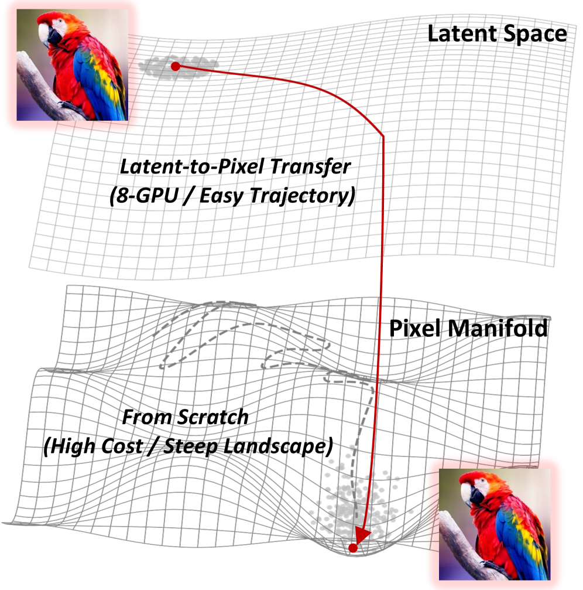
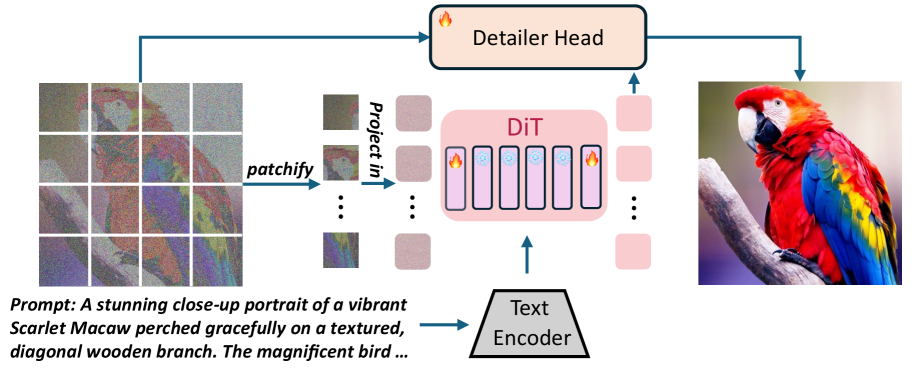
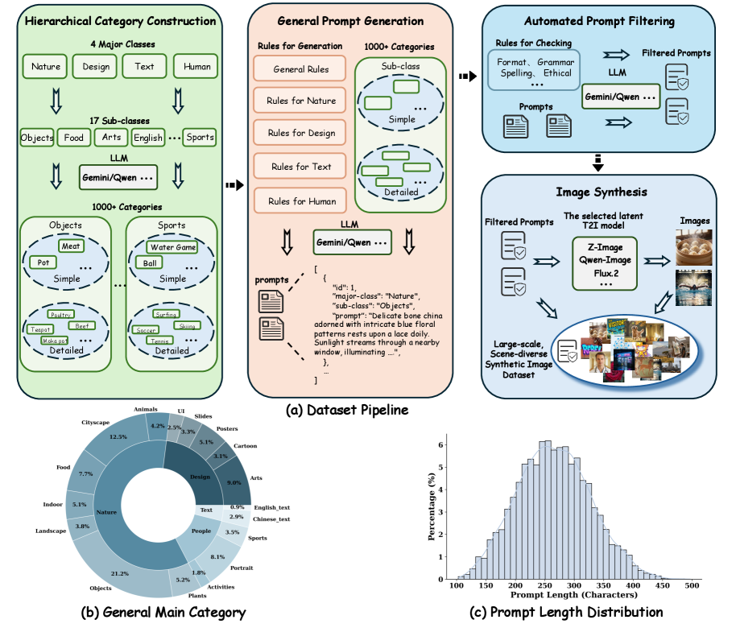
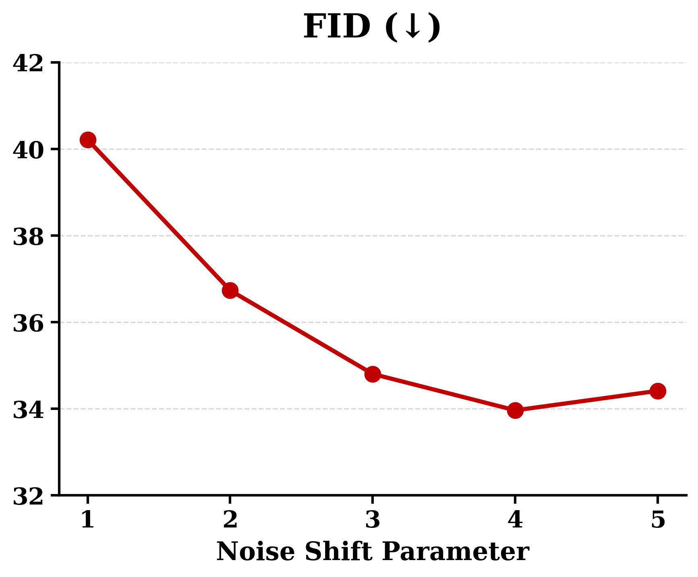
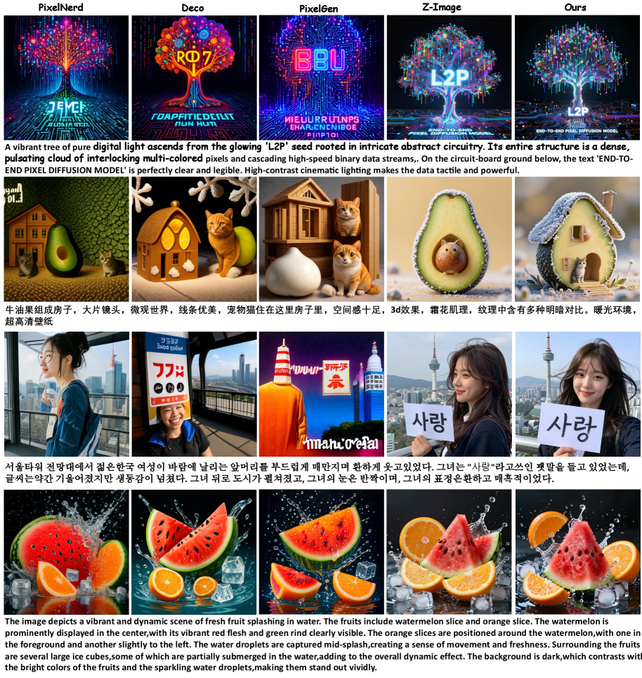
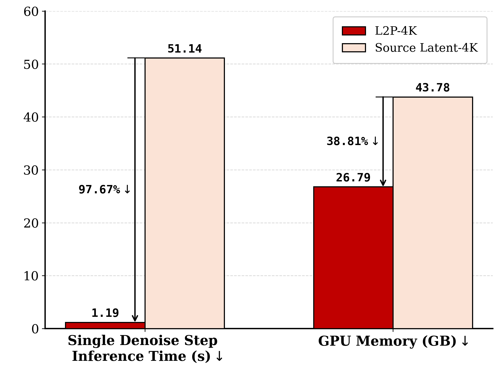
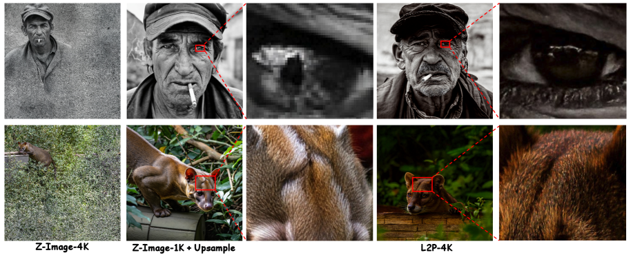
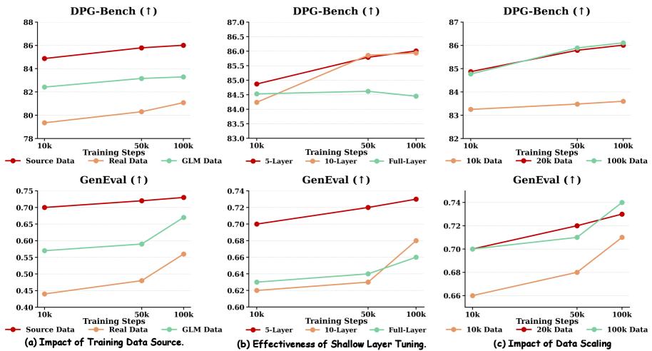

# L2P:
把 LDM 的潜在知识"搬"到像素空间, 8 卡训出原生 4K 扩散

<figure>
    
    <figcaption>Fig. 1 — 核心 narrative。<strong>上半</strong>: latent space 的流形比较平滑 (LDM 已经学到), 从噪声到目标的轨迹"短而直", 8 卡就够走完。<strong>下半</strong>: pixel space 流形坑坑洼洼 (高频细节多), 从头训需要"翻山越岭", 算力数据双双爆炸。L2P 的赌注: <em>把已经走完上半段的 LDM 拽下来, 在它现有的轨迹基础上"再延一小段到 pixel"</em>, 而不是从 pixel 流形底部重新爬。</figcaption>
  </figure>

## 1. 出发点 (Motivation)

2025-2026 这一年, 像素扩散 (pixel diffusion) 又开始抬头 — PixNerd、DeCo、PixelDiT、DiP 一拨工作都在质疑 "VAE 压缩到 latent 再生成" 这条主流路线。理由很硬:

1. **VAE 的压缩天然丢高频。** 8× 或 16× 下采样 + 4 通道 latent, 把砂砾、毛发、织纹这些频谱上的高频信号砍掉一大半, 再 decode 回来就是磨皮味儿。
2. **VAE decoder 的内存是 H×W 二次方。** 想原生跑 4K (3840×2160) ? 单这一步就把 80GB H100 打爆。LDM 跑 4K 都要靠 tile + seam blending, 是工程苦活。
3. **VAE 不是 free lunch。** 它本身是个有损 autoencoder, 训得不好就是瓶颈; 训得好也限制了上限。

所以"直接在像素空间上做扩散"应该是更干净的方案 — 没有 VAE 这一层, 输入输出都是 RGB, 数学上简单, 物理上对齐。但**从零训像素扩散**的代价是 SOTA LDM 的几倍: 几百张高端 GPU, 数十亿图文对, 才能勉强达到 LDM 的语义和构图水平。这就是 paper 想攻克的核心矛盾:

> "Can we directly transfer the rich semantic priors embedded in pre-trained LDMs to a pixel-space diffusion model, thereby bypassing the astronomical costs of from-scratch training?"

答案叫 **L2P (Latent-to-Pixel)**。三个核心 idea (我的话):

1. **大 patch 替代 VAE**: 把 1024×1024 的像素图直接用 16×16 的 patch tokenize, 序列长度就跟 LDM 的 (1024/16)² = 4096 token 一样。这样 LDM 已经训好的 attention pattern 不用动 — 它"以为"自己还在处理 latent。
2. **选择性冻结**: 30 层 DiT 中, 中间大部分冻住 (已经懂语义和构图), 只让"输入投影层 + 首尾各 n 层 + 新加的 U-Net 解码头"可训。新东西只在 latent ↔ pixel 这一头一尾的转换上学。
3. **合成数据训练**: 训练图**不是**真实图, 而是用源 LDM (Z-Image-Turbo) 自己生成的 20k 张合成图。理由很妙 — 源 LDM 生成的图已经在它自己 modality (= 学完 VAE decode 之后的像素分布) 上, 数据流形已经被"平滑过了", 学生只要学"latent → pixel"这一小段映射, 收敛极快。

## 2. 方法 (Method) — 高中生友好 + 数学严谨

### 核心思想 (类比)

想象一个钢琴老师 (源 LDM) 已经会把"乐谱意图" (text prompt) → "MIDI 信号" (latent) 这一段弹得很溜, 但他从来不会"把 MIDI 信号物理转成钢琴键按下的力度模式" — 那一步交给了"MIDI 转钢琴动作"的 VAE decoder。现在你想要一个学生**直接从乐谱意图弹出真琴**, 跳过 MIDI 这层中间表示。

最笨的办法: 让学生从零学, 几年时间, 钢琴老师那些音乐知识全得重新学一遍。L2P 的办法: **把老师整套乐谱→MIDI 的功能搬过来当大部分骨架, 只让学生新学"MIDI → 实际琴键力度"这一小段映射**。具体做法:

- **骨架不动**: 老师的中间 28 层全冻住。
- **头尾微调**: 第 1 层 (输入投影) + 前 n 层 + 后 n 层可训 — 把"接收钢琴键状态"和"输出钢琴键状态"这两端调成像素友好的格式。
- **额外加一个解码小模块**: 一个轻量 U-Net "Detailer Head", 专门做"把 DiT 输出的 patch-level 特征还原成像素级细节"。
- **训练数据从哪来?** 让老师自己弹 20000 段, 录下"乐谱→实际琴键力度"的配对 — 因为这些配对是老师亲手弹出来的, 已经在他可达的输出空间里, 学生学起来不会发散。

这就是为什么 8 卡能搞定: 你不是在训一个新钢琴家, 你只是给老钢琴家加了"绕过 MIDI 直出琴键"的一个适配器。

### 2.1 Flow Matching 基础 (Eq. 1–4)

L2P 用的是 flow matching 而不是 DDPM 的 ε-prediction, 因为源 LDM (Z-Image-Turbo) 本来就是 flow matching 训的。简单回顾:

**前向加噪 (paper Eq. 1)**:

<p class="math-translation">—— 翻译: 给干净图 $\mathbf{x}_0$ 按时间 $t$ 比例加噪声 $\boldsymbol{\epsilon}$ 得到带噪图 $\mathbf{x}_t$。$\bar{\alpha}_t$ 控制 "几分干净几分噪声"。</p>

**反向时间概率流 ODE (paper Eq. 2)**:

<p class="math-translation">—— 翻译: 从 $t{=}T$ (纯噪声) 到 $t{=}0$ (干净图) 的连续轨迹。$\nabla_{\mathbf{x}}\log p_t$ 是 score。</p>

**Flow matching 训练目标 (paper Eq. 4)**:

<p class="math-translation">—— 翻译: 让模型 $v_\theta$ 学习目标速度场 $u_t$。直观上, "速度"就是从噪声指向数据的方向向量。</p>

具体到 Z-Image / L2P 用的是线性插值版 flow matching, 加噪和目标在代码里非常干净:

<p class="code-source">repo/diffsynth/diffusion/flow_match.py:L164-L174 — 前向 + 训练目标</p>

```python
def add_noise(self, original_samples, noise, timestep):
    if isinstance(timestep, torch.Tensor):
        timestep = timestep.cpu()
    timestep_id = torch.argmin((self.timesteps - timestep).abs())
    sigma = self.sigmas[timestep_id]
    sample = (1 - sigma) * original_samples + sigma * noise
    return sample

def training_target(self, sample, noise, timestep):
    target = noise - sample
    return target
```

这就是 **flow matching 的核心两行**: $\mathbf{x}_t = (1-\sigma)\mathbf{x}_0 + \sigma \boldsymbol{\epsilon}$, 速度目标是 $\boldsymbol{\epsilon} - \mathbf{x}_0$ — 即从干净指向噪声的方向。模型预测这个速度。

### 2.2 大 patch 替代 VAE

这是 L2P 最干净也最有冲击力的一步。

原来 LDM 的流程是: 像素图 $\mathbf{I} \in \mathbb{R}^{3 \times 1024 \times 1024}$ → VAE 编码 → latent $\mathbf{z} \in \mathbb{R}^{16 \times 64 \times 64}$ → 16-channel × (64/2)² = 16×32×32 token (DiT 内部还有 2×2 patchify) → DiT 处理 → reverse 回 latent → VAE 解码回像素。共有**两次**有损压缩 (VAE encode/decode), 还有 VAE 的训练成本和内存爆炸问题。

L2P 直接把 VAE 干掉, 改成: 像素图 → **16×16 patch 切割** → 序列长度 = $1024/16 \times 1024/16 = 64 \times 64 = 4096$ token, 每个 token 是 $16 \times 16 \times 3 = 768$ 维。这个序列长度跟原来 LDM 的 token 序列长度一致, 所以 DiT 不用改 attention 结构。代码里的 patch 切割是一行 reshape:

<p class="code-source">repo/diffsynth/models/z_image_dit_L2P.py:L608-L615 — 像素直接打 patch</p>

```python
### Process Image
C, F, H, W = image.size()
all_image_size.append((F, H, W))
F_tokens, H_tokens, W_tokens = F // pF, H // pH, W // pW

image = image.view(C, F_tokens, pF, H_tokens, pH, W_tokens, pW)
# "c f pf h ph w pw -> (f h w) (pf ph pw c)"
image = image.permute(1, 3, 5, 2, 4, 6, 0).reshape(F_tokens * H_tokens * W_tokens, pF * pH * pW * C)
```

然后用一个 Linear 把 768 维投到 DiT 的 hidden dim 3840:

<p class="code-source">repo/diffsynth/models/z_image_dit_L2P.py:L470 — 输入投影 (3 × 16 × 16 → 3840)</p>

```python
x_embedder = nn.Linear(f_patch_size * patch_size * patch_size * in_channels, dim, bias=True)
```

**注意** `in_channels=3` — 不再是 VAE latent 的 16 通道, 而是 RGB 的 3 通道。这个 Linear 层是 L2P 全新初始化训练的, 中间所有 30 层 DiT block 沿用 Z-Image-Turbo 的预训练权重。

### 2.3 选择性冻结 + Detailer Head

选择性冻结的逻辑很清楚 (paper §3.3 + Fig 9b 消融):

- **中间 DiT 层冻住**: 这些层学的是"在 token 序列上做注意力 + FFN", 跟 token 是 latent 还是 pixel-patch 无关 — 全是 transformer 的纯计算逻辑。强行解冻, 反而会破坏源 LDM 的语义先验 (Fig 9b 的 "Full-Layer" 红线明显劣于"Default")。
- **首尾若干层 (paper 标记为 *n*)**: 输入端要学"怎么把 pixel patch 理解成 LDM 风格的 token", 输出端要学"怎么把 LDM 风格的 token 输出对齐到 pixel"。这两端要新学。
- **Detailer Head**: 一个 4 级下采样 + 4 级上采样的轻量 U-Net (paper 称 "Detailer Head", 代码里叫 `MicroDiffusionModel`)。它的输入是 *原始带噪像素图* 和 *DiT 输出的特征图*, 输出是预测的速度场。本质是个"特征图引导的去噪 + 上采样"模块, 用来补回 patch 化丢失的局部细节。

<figure>
      
      <figcaption>Fig. 3 — L2P 架构。左到右: 噪声像素图 → <code>patchify(16×16)</code> → DiT (中间冻结, 首尾可训) ⊕ Text Encoder → Detailer Head (轻量 U-Net) → 预测速度场。<strong>关键: 完全没有 VAE encoder/decoder</strong>。</figcaption>
    </figure>

Detailer Head 的结构在代码里非常清晰 — 标准 U-Net, 但 bottleneck 处把 DiT 输出的特征图 (3840 通道) 拼到下采样到 H/16 的图像特征 (512 通道) 上, 再用 1×1 conv 压回 512:

<p class="code-source">repo/diffsynth/models/z_image_dit_L2P.py:L281-L350 — Detailer Head 主体结构</p>

```python
class MicroDiffusionModel(nn.Module):
    def __init__(self, in_channels, si_t_hidden_size):
        super().__init__()

        self.enc1 = nn.Sequential(nn.Conv2d(in_channels, 64, kernel_size=3, padding=1), nn.SiLU())
        self.pool1 = nn.MaxPool2d(2, stride=2)
        # ... enc2/3/4 同构, 通道 64→128→256→512, 每级下采 2× ...

        self.bottleneck = nn.Sequential(
            nn.Conv2d(512 + si_t_hidden_size, 512, kernel_size=1),  # ← 512 + 3840 = 4352 通道
            nn.SiLU(),
        )

        # 4 级上采样 + skip connection, 通道 512→256→128→64→3
        self.up4 = nn.Sequential(nn.Upsample(scale_factor=2, mode='nearest'),
                                 nn.Conv2d(512, 512, kernel_size=3, padding=1))
        self.dec4 = nn.Sequential(nn.Conv2d(512 + 512, 256, kernel_size=3, padding=1), nn.SiLU())
        # ... up3/dec3/up2/dec2/up1/dec1 ...
        self.out_conv = nn.Conv2d(64, in_channels, kernel_size=1)
```

forward 时, bottleneck 那一步把"语义" (DiT 特征) 注入到"高分辨率细节路径" (U-Net) 里, 这是 L2P 工作的关键交点:

<p class="code-source">repo/diffsynth/models/z_image_dit_L2P.py:L373-L381 — 把 DiT 特征灌进 U-Net bottleneck</p>

```python
def _enc_stage_4_and_bottleneck(p_in, c_in):
    enc4_out = self.enc4(p_in)              # [B, 512, H/8,  W/8]
    p4_out   = self.pool4(enc4_out)         # [B, 512, H/16, W/16]

    if c_in.shape[-2:] != p4_out.shape[-2:]:
        c_in = F.interpolate(c_in, size=p4_out.shape[-2:], mode='nearest')
    bottleneck_input = torch.cat([p4_out, c_in], dim=1)  # ← 拼接 DiT 特征
    bottleneck_out = self.bottleneck(bottleneck_input)
    return enc4_out, bottleneck_out
```

注意 `F.interpolate` 那个 fallback: 当 DiT 特征图分辨率跟 H/16 不匹配 (比如 4K 用 64×64 patch 时), 用 nearest 插值对齐。这就是 L2P 能在多种分辨率间共享同一个 head 的工程胶水。

### 2.4 合成数据训练 (Self-distillation 风味)

这是 L2P 第二个反直觉的设计。paper 用**源 LDM 自己生成的** 20000 张合成图作为唯一训练数据, 没有任何真实图像。Fig 9a 的消融非常说明问题:

- **Source data (LDM 自生成)**: 最快收敛, 最高分数。
- **Cross-model data (用 GLM-Image 等别的 T2I 生成)**: 中等。
- **Real data (UltraHR-100K)**: 收敛慢, 分数低。

为什么真实图反而最差? Paper 的解释:

> "By utilizing LDM-generated synthetic images as the sole training corpus, L2P fits an already smooth data manifold, enabling rapid convergence with zero real-data collection."

我的理解 (高中生版): 真实图像分布对源 LDM 来说是"陌生地形" — 中间冻住的 28 层不一定能完美映射真实图。而源 LDM 生成的图**本来就在它自己的输出可达域里**, 学生 (L2P) 只需要补上"latent → pixel 这一小段最后映射", 不需要解决"真实图也能被这套 DiT 表达"这个大问题。

这一招在 distillation 文献里有先例 (consistency distillation 也是让学生学老师的输出分布), 但 L2P 把它用得很彻底 — 整个训练集就是 20k 张合成图。

<figure>
      
      <figcaption>Fig. 2 — 数据构造流水线 (a)。四级 LLM 分类树: 4 大类 → 17 子类 → 1000+ 细类 → 10k prompt → 20k 图。(b) 类别分布饼图。(c) Prompt 长度 200-350 字符。<strong>关键</strong>: 这 20k 图是 Z-Image-Turbo 自己生成的, 不是从互联网爬。</figcaption>
    </figure>

### 2.5 训练目标 (paper Eq. 5)

L2P 的 loss 是 flow matching 的标准 MSE:

<p class="math-translation">—— 翻译: 给定干净像素图 $\mathbf{x}_0$ (合成图), 加噪到 $\mathbf{x}_t$, 让模型 $v_\theta$ 预测"从干净指向噪声的方向"$\boldsymbol{\epsilon} - \mathbf{x}_0$。是标准 flow matching, 没有特殊正则。</p>

对照代码:

<p class="code-source">repo/diffsynth/diffusion/loss.py:L5-L31 — FlowMatchSFTLoss (训练时调用的 loss)</p>

```python
def FlowMatchSFTLoss(pipe: BasePipeline, **inputs):
    max_timestep_boundary = int(inputs.get("max_timestep_boundary", 0.8) * len(pipe.scheduler.timesteps))
    min_timestep_boundary = int(inputs.get("min_timestep_boundary", 0) * len(pipe.scheduler.timesteps))
    timestep_id = torch.randint(-100, max_timestep_boundary, (1,)).clamp(min_timestep_boundary, max_timestep_boundary)

    timestep = pipe.scheduler.timesteps[timestep_id].to(dtype=pipe.torch_dtype, device=pipe.device)
    noise = torch.randn(inputs["input_latents"].shape, ..., dtype=inputs["input_latents"].dtype)
    inputs["latents"] = pipe.scheduler.add_noise(inputs["input_latents"], noise, timestep)
    training_target = pipe.scheduler.training_target(inputs["input_latents"], noise, timestep)

    models = {name: getattr(pipe, name) for name in pipe.in_iteration_models}
    noise_pred = pipe.model_fn(**models, **inputs, timestep=timestep)

    loss = torch.nn.functional.mse_loss(noise_pred.float(), training_target.float())
    return loss
```

注意 `input_latents` 这个参数名是个 **遗留命名** — 它实际上是 *像素值*, 不是 latent。整个代码库是从 LDM 的 diffsynth fork 来的, 很多名字没改。这种命名残留可能误导读代码的人, paper 没提。

### 2.6 从 1K 到 4K: noise shift 才是关键

Paper §3.4 提到 4K 生成有两个 adapter:

1. **动态 patch size**: 1024×1024 用 16×16 patch (序列长 4096), 3840×2160 改成 64×64 patch (序列长 ~2000) — 维持序列长度可控。
2. **更大的 noise shift**: 这是更微妙也更重要的点。

什么是 noise shift? Flow matching 的 sigma schedule 是非线性插值:

<p class="math-translation">—— 翻译: shift 参数 $s$ 控制"训练 / 推理时把更多算力花在哪段噪声水平上"。$s{=}1$ 是 uniform, $s{&gt;}1$ 往大噪声端倾斜 (更多步数花在 0.8 以上)。</p>

代码原型:

<p class="code-source">repo/diffsynth/diffusion/flow_match.py:L103-L118 — Z-Image 的 shift schedule</p>

```python
@staticmethod
def set_timesteps_z_image(num_inference_steps=100, denoising_strength=1.0, shift=None, target_timesteps=None):
    sigma_min = 0.0
    sigma_max = 1.0
    shift = 3 if shift is None else shift   # ← 1K 默认 shift=3
    num_train_timesteps = 1000
    sigma_start = sigma_min + (sigma_max - sigma_min) * denoising_strength
    sigmas = torch.linspace(sigma_start, sigma_min, num_inference_steps + 1)[:-1]
    sigmas = shift * sigmas / (1 + (shift - 1) * sigmas)
    timesteps = sigmas * num_train_timesteps
```

Paper 解释 4K 需要更大 shift 的原因 (我的话): 4K 像素之间的局部相关性极强 — 相邻像素几乎一样, 标准 noise schedule 加到一定水平后**图像信号还没被破坏** (相邻像素都加同等强度的独立噪声, 平均后能把彼此抵消很多, 局部低频信息保留得太好)。结果模型在小噪声端没看到充分困难的样本, 学到的是"在干净图上做局部细化", 而不是"从噪声中长出全局结构"。

把 shift 调大到 ~5, 训练和采样都花更多步数在大噪声水平 (sigma 接近 1), 强迫模型学到"从纯噪声生成全局结构"。Fig 12 是 4K 上不同 shift 的 FID 曲线, U 形, 最优 shift 落在 5 附近。

<figure>
      
      <figcaption>Fig. 12 — 4K 上 noise shift 参数的影响。U 形曲线, 最优 shift 在 ~5 附近 (比 1K 的默认 3 大)。Shift 太小 → 模型学到的是"局部细化"而非"全局生成", FID 飙升。</figcaption>
    </figure>

### 2.7 代码对照: forward 全流程

用代码再走一遍 forward 流程, 算是把上面所有部件串起来:

<p class="code-source">repo/diffsynth/models/z_image_dit_L2P.py:L660-L811 — ZImageDiT.forward (节选)</p>

```python
def forward(self, x, t, cap_feats, patch_size=16, f_patch_size=1, ...):
    # 1. 时间嵌入
    t = t * self.t_scale
    t = self.t_embedder(t)
    adaln_input = t

    # 2. 像素 patchify + 线性投影到 DiT hidden dim
    (x_patches_flat_list, cap_feats, x_size, x_pos_ids, ...) = \
        self.patchify_and_embed(x, cap_feats, patch_size, f_patch_size)
    x_embed = torch.cat(x_patches_flat_list, dim=0)
    x_embed = self.all_x_embedder[f"{patch_size}-{f_patch_size}"](x_embed)  # ← 3*16*16 → 3840

    # 3. Noise refiner (前 n 层 — paper 说的"first n layers", 可训)
    for layer in self.noise_refiner:
        x_embed = layer(x_embed, attn_mask, freqs_cis, adaln_input)

    # 4. Caption embedding + context refiner (text token 也走 n 层 refiner)
    cap_feats = self.cap_embedder(cap_feats)
    for layer in self.context_refiner:
        cap_feats = layer(cap_feats, cap_attn_mask, cap_freqs_cis)

    # 5. 图像 + caption 拼接, 喂主干 DiT (30 层, 中间冻结)
    unified = [torch.cat([x_embed[i][:x_len], cap_feats[i][:cap_len]]) for i in range(bsz)]
    unified = pad_sequence(unified, batch_first=True, padding_value=0.0)
    for layer in self.layers:                          # ← 30 层 DiT, paper 说大部分冻住
        unified = layer(unified, unified_attn_mask, unified_freqs_cis, adaln_input)

    # 6. 抽取图像 token, reshape 回 2D 特征图
    img_token_len = x_item_seqlens[0]
    img_features = unified[:, :img_token_len, :]
    F_ori, H_ori, W_ori = x_size[0]
    feat_H, feat_W = H_ori // patch_size, W_ori // patch_size
    feat_map = img_features.view(bsz, feat_H, feat_W, self.dim).permute(0, 3, 1, 2)
    #          ← shape: [B, 3840, H/16, W/16]   这是 DiT 输出的"语义条件"

    # 7. Detailer Head: 输入是 (原噪声像素图, DiT 特征图), 输出是预测速度
    noisy_images = torch.stack(x, dim=0).squeeze(2)    # [B, 3, H, W]
    decoded_batch = self.local_decoder(noisy_images, feat_map, ...)  # ← MicroDiffusionModel

    return list(decoded_batch.unsqueeze(2).unbind(0)), {}
```

三个值得圈点的细节:

1. **noise_refiner / context_refiner** 各 2 层 (代码默认 `n_refiner_layers=2`), 处理 image 和 text 各自的 token (相当于 paper 说的 "first n DiT blocks"), 然后才拼到一起进主干 30 层。
2. **主干 30 层注释里那段被砍掉的 final_layer** (L775-L777) 是原 Z-Image 的输出投影, L2P 把它整个换成了 Detailer Head。这是原生 LDM → L2P 改造的一个清晰证据。
3. **Detailer Head 同时吃原噪声图和 DiT 特征** — 不是 DiT 输出 patch 再 unpatchify, 而是"原始像素图 + 语义条件特征"经过一个独立 U-Net。这跟你直觉的"DiT 输出 → 上采样还原"完全不同, 也是 L2P 能保留高频的关键。

## 3. 结论 (Key Findings)

### 3.1 1024×1024 主结果

Table 1 (DPG-Bench + GenEval, paper 的主表):

<table>
      <thead>
        <tr>
          <th>Model</th>
          <th>DPG-Bench Global</th>
          <th>DPG-Bench Avg</th>
          <th>GenEval Overall</th>
        </tr>
      </thead>
      <tbody>
        <tr><td>Z-Image-Turbo (源 LDM)</td><td>91.29</td><td>84.86</td><td>0.82</td></tr>
        <tr><td><strong>L2P (本文)</strong></td><td><strong>92.02</strong></td><td><strong>86.00</strong></td><td><strong>0.76</strong></td></tr>
        <tr><td>PixelGen</td><td>85.61</td><td>80.01</td><td>0.79</td></tr>
        <tr><td>Deco</td><td>84.91</td><td>81.25</td><td>0.86</td></tr>
        <tr><td>PixNerd</td><td>87.16</td><td>82.65</td><td>0.73</td></tr>
      </tbody>
    </table>

核心数字:

- **DPG-Bench Avg 86.00 反超源 LDM** (84.86) — 这是 paper 最敢吹的一条, 说明大 patch + 选择性冻结+ Detailer Head 不仅没损失语义, 反而略有提升 (paper 推测是 Detailer Head 的高频细节恢复让 DPG 的"description"维度评分上升)。
- **GenEval 0.76 保留 93.6%** 源 LDM 性能 (0.82)。这一项掉了, 主要是 object counting / position 这些更挑剔语义的指标 — 选择性冻结确实没完全保住所有能力, 但 6.4% 的 gap 是可接受的迁移损失。
- 对比同类 pixel-space 模型 (PixelGen / Deco / PixNerd), L2P 全面领先 — paper 称 SOTA pixel diffusion on DPG-Bench。

<figure>
      
      <figcaption>Fig. 6 — 1K 定性对比 (PixelNerd / Deco / PixelGen / Z-Image / L2P)。最右一列是 L2P, 跟源 Z-Image 几乎一致, 但 PixelGen 的"BU" / Deco 的 "raze fish patch" 等 prompt 都没渲对。最有意思的是第 3 行 — L2P 跟 Z-Image 都能 zero-shot 渲染韩语 "사랑" (训练集只有中英文), 说明源 LDM 的多语言知识完整迁移过来了。</figcaption>
    </figure>

### 3.2 4K 原生生成

Table 2 (4K, paper §4.3):

<table>
      <thead>
        <tr><th>Method</th><th>FID ↓</th><th>FID_patch ↓</th><th>IS ↑</th><th>CLIP ↑</th><th>FG-CLIP ↑</th></tr>
      </thead>
      <tbody>
        <tr><td><strong>L2P-4K (本文)</strong></td><td><strong>33.46</strong></td><td><strong>21.77</strong></td><td><strong>12.28</strong></td><td><strong>31.88</strong></td><td>28.22</td></tr>
        <tr><td>Pixart-σ</td><td>35.60</td><td>23.63</td><td>12.23</td><td>31.76</td><td>28.74</td></tr>
        <tr><td>SANA</td><td>37.26</td><td>28.94</td><td>12.05</td><td>31.79</td><td>29.31</td></tr>
        <tr><td>I-Max</td><td>37.12</td><td>34.42</td><td>11.78</td><td>31.53</td><td>27.90</td></tr>
        <tr><td>HiFlow</td><td>38.54</td><td>22.74</td><td>10.62</td><td>31.49</td><td>27.84</td></tr>
      </tbody>
    </table>

<figure>
      
      <figcaption>Fig. 4 — 4K 原生生成的<strong>真正杀手锏</strong>: 单步 denoise 时间从 51.14s 砍到 1.19s (↓97.67%), 峰值显存从 43.78 GB 降到 26.79 GB (↓38.81%)。VAE 的二次方内存爆炸是 LDM 跑 4K 的硬墙, L2P 拆掉 VAE 直接绕过。</figcaption>
    </figure>

<figure>
      
      <figcaption>Fig. 8 — 4K 定性对比 (vs Z-Image-4K, Z-Image+upsample, L2P-4K)。看人物面部细节 — L2P-4K 的瞳孔、毛发、皮肤纹理在原始尺度上就清晰, Z-Image+upsample 是双线性放大后的糊。这就是 "原生 4K" 跟 "1K + 上采样" 的本质差别。</figcaption>
    </figure>

### 3.3 三组关键消融 (paper Fig 9)

<figure>
      
      <figcaption>Fig. 9 — 三个关键消融。(a) <strong>数据源</strong>: 源 LDM 合成最好, 真实图像最差。(b) <strong>冻结策略</strong>: 只训首尾 (Default) 持续上升, 全部解冻 (Full-Layer) 性能停滞甚至倒退 — 这是选择性冻结合理的最强证据。(c) <strong>数据量</strong>: 10k 起步, 20k 接近饱和, 100k 几乎没增益。L2P 的数据效率惊人。</figcaption>
    </figure>

三个核心 takeaways:

1. **"源 LDM 自生成数据" 比真实数据收敛快、上限高** — 反直觉, 但非常可解释 (匹配源模型可达流形)。
2. **选择性冻结至关重要** — 不是"为了省显存", 而是"为了不破坏源 LDM 的语义先验"。Full-Layer 解冻在 GenEval 上明显劣于选择性冻结。
3. **20k 张图就够了** — 这是 LDM 标准训练集 (LAION-Aesthetic 几亿张) 的 0.001%。说明 L2P 不是在"重新学语义", 只是在"学 latent ↔ pixel 的小段映射"。

## 4. 实现细节 (Implementation Notes)

代码里关键、但论文未充分说明 / 容易踩坑的细节:

- **训练入口 `--trainable_models "dit"` 与 paper 的"选择性冻结"措辞不完全一致**: paper §3.3 说只训首尾若干层 + Detailer Head, 但开源 `train_run.sh:L21` 的 `--trainable_models "dit"` 会让整个 dit module (含 30 层 + refiner + detailer head) 都 `requires_grad=True`。`diffusion/training_module.py:L151-L152` 的 `freeze_except` 只控制顶层模块名级别的冻结, 没看到层级 mask。**推测**: 开源版本是从 `Z-Image-Pixel-Init` 这个已经预转换好的 checkpoint 出发, full-finetune 整个 dit 也能跑通 (因为初始化已经很接近), 而 paper 的层级冻结消融可能是另外 patch 加的, 没合入主分支。这是个明显的 **paper-vs-code gap**, 想严格复现 Fig 9b 的人需要自己加 hook。
- **命名遗留: `input_latents` 实际是像素值**: `loss.py:L22-L24` 里的变量名 `inputs["input_latents"]` 字面意思是 latent, 实际**就是 3 通道 RGB 像素**。整个代码库 fork 自 LDM 的 diffsynth, 很多名字 (包含 `latents`) 都没改, 不读懂的话以为还在 latent space。Paper 没提这个 fork 历史。
- **4K 用的不是同一个 patch embedder**: `z_image_dit_L2P.py:L467-L476` 用 ModuleDict 按 patch size 分别建 `nn.Linear`: `"16-1"` 给 1K, `"64-1"` 给 4K (后者权重 **独立训练**)。也就是说 paper 标题的"L2P"严格说是两个相关但分别训练的模型。开源 release 里 1K 版本可下载 (HuggingFace `zhen-nan/L2P`), 4K 版本 roadmap 写"WIP 未发布"。
- **训练超参 (来自 `train_run.sh` + paper Table 3)**:
        <ul>
          <li><code>--learning_rate 5e-5</code> AdamW, weight_decay 默认 0.01</li>
          <li><code>--max_pixels 1048576</code> = 1024×1024, <code>--dataset_repeat 1</code></li>
          <li><code>--gradient_accumulation_steps 1</code>, 单卡 batch=1, 8 卡 batch=8</li>
          <li><code>--use_gradient_checkpointing</code> — DiT 30 层 + Detailer Head, 单 H100 80GB 也是擦边, gradient checkpointing 是必须的</li>
          <li><code>--save_steps 5000</code>, <code>--num_epochs 100000</code> — 实际 paper 说 20k 步即饱和 (Fig 9c)</li>
          <li><code>--remove_prefix_in_ckpt "pipe.dit."</code> — 存权重时去掉前缀, 方便后续合并到原始 Z-Image 格式</li>
        </ul>
- **预处理: 像素值范围是 [-1, 1] 不是 [0, 1]**: `z_image_L2P.py:L145-L159` 的 `pixel_output_to_image` 默认 `min_value=-1, max_value=1`。这是 Z-Image-Turbo 的原始约定, L2P 继承。如果你想拿这个模型做 image-to-image, 输入也得归一化到 [-1, 1]。
- **Text encoder 在训练时可以 offload 到 CPU**: `train_L2P.py:L43-L55` 提供 `--offload_text_encoder`, 推荐给 24GB 卡。这显示作者也知道 6B 模型在消费级硬件训练的痛点。
- **RoPE 配置**: `axes_dims=(32, 48, 48)`, `axes_lens=(1024, 512, 512)` — 第一维是 frame (这是从视频模型抄来的), 后两维是 H/W。1K 输入图 token 数 4096, 用得到 512 这个范围; 4K 用 64×64 patch, token 数也是 4096, 共用 RoPE 频率表。
- **训练目标是 noise - sample 不是 sample - noise**: `flow_match.py:L172-L174` `return noise - sample` — 模型学的是"从干净指向噪声"的方向 (sigma 增加方向)。这跟 SD 3 / Flux 的约定一致, 但跟某些早期 flow matching 论文相反 (后者用 sample - noise)。复现时不要弄反。

关键 loss snippet (再贴一次 + 完整调用链):

<p class="code-source">repo/examples/z_image/model_training/train_L2P.py:L62-L70 — Loss 选择</p>

```python
self.task_to_loss = {
    "sft": lambda pipe, inputs_shared, inputs_posi, inputs_nega: FlowMatchSFTLoss(pipe, **inputs_shared, **inputs_posi),
    "sft:train": lambda pipe, inputs_shared, inputs_posi, inputs_nega: FlowMatchSFTLoss(pipe, **inputs_shared, **inputs_posi),
    "direct_distill": lambda pipe, inputs_shared, inputs_posi, inputs_nega: DirectDistillLoss(pipe, **inputs_shared, **inputs_posi),
    ...
}
```

默认 task="sft" 走 `FlowMatchSFTLoss`; 另一个分支 `DirectDistillLoss` 是个未公开的实验功能 — 让学生直接匹配老师走完所有 step 后的 latents, 跟主 paper 没强关系, 估计是作者另一个项目。

## 5. 批判性总结 (Critical Assessment)

### 优点

- **三个核心 idea 各自都言之有理且互相支撑**: 大 patch 替 VAE (绕开二次方内存) + 选择性冻结 (保留语义先验) + 合成数据 (匹配源模型可达流形)。任何一个抽掉, 故事都不成立 — 不是 ad-hoc 拼凑的方法 stack。
- **8 卡 + 20k 图的代价**真的低到让很多学术组能复现 — 跟 pixel diffusion 从零训需要数百卡的代价相比, 这是**数量级的差别**。开源 1K 版本 + HF 上的数据集进一步降低门槛。
- **"4K 单步 1.19s vs LDM 51.14s"** 这个数字非常直接 — 不是 cherry-pick 的某个 prompt, 是 single denoise step latency 这种 hardware-level 测量, 难以包装。VAE 4K decode 内存爆炸是确定性事实, L2P 拆掉 VAE 是确定性收益。
- **Fig 9b 的消融 (选择性冻结 vs full-layer)** 给出了非常有说服力的反例 — 全部解冻反而劣于选择性冻结, 把"为什么要冻结"从"省显存"提升到"保护知识"。这是 paper 最有教育意义的一张图。
- 第 3 行韩语 prompt 那个例子 (zero-shot 渲染训练集没有的语言) 是**知识保留**的强证据 — 不是 prompt 工程的 trick, 是源 LDM 的多语言能力完全跟着主干 DiT 一起冻结迁移过来了。

### 不足 / 疑点

- **开源训练脚本与论文方法不一致**: 如 §4 第一条所述, `--trainable_models "dit"` 解冻整个 dit, 不是 paper 描述的层级 mask。这意味着**开源版本不是 paper 实验里跑出 Table 1/Fig 9 的那个版本**, 而是一个更宽松的微调变体。想复现 Fig 9b 的人需要自己加层级冻结的 hook。这是个不大不小的**方法学瑕疵**。
- **GenEval 掉了 6.4% 不是免费**: paper TL;DR 强调"DPG-Bench 反超", 但 GenEval (object counting/position 等组合性更强的任务) 掉了将近一个 quartile。这暗示选择性冻结**有损失** — 不是所有源 LDM 的能力都迁移过来了。Paper 没单独分析掉的是哪些维度, 这是个透明性问题。
- **"4K 原生" 跟同样原生 4K 的工作 (Pixart-σ, SANA) 的 FID 差距只有 ~2 点**。考虑到 FID 这个指标对训练数据分布敏感, 而 L2P 的 baseline 不一定用同样的真实图 reference set, 这个差距不一定是**方法差距**, 也可能是**评测协议差距**。Paper 没在附录里给充分的协议细节。
- **合成数据训练的 upper-bound 问题被作者自己承认** (Limitation 1): L2P 的天花板就是源 LDM 的天花板。如果源 LDM 在某个 domain 弱 (比如 fine-grained 文本渲染), L2P 一样弱。这意味着 L2P **不是**通向"超过 LDM 的 pixel SOTA"的路径, 而是"用更少代价拿到 LDM 同等水平的 pixel 模型"的路径。这两件事价值不一样。
- **4K 版本未开源**, roadmap 标 WIP。所有 Fig 4 / Table 2 的 4K 结果都靠 paper 数字背书, 暂时无法独立验证。
- **Detailer Head 引入的额外参数 (U-Net 4 级, 几百 M) 没有完整的参数量 / FLOPs 报告**。"训练代价低" 这个 claim 是模糊的 — 是相对 from-scratch 低, 还是相对源 LDM 微调低, paper 没给精确数字。
- **命名残留 `input_latents`**: 代码可读性问题, 反映出 paper 团队对开源 release 的打磨不到位 — 一个简单的 rename pass 能避免读者困惑。

### 适用 vs 不适用

- ✅ **适用**: 学术组 / 中小公司想拿到一个高质量像素扩散模型, 但没有 from-scratch 训练的算力; 需要原生 4K/8K 生成且不想被 VAE decoder 内存卡住的场景; 想做 pixel-level loss (perceptual / physics-based) 但被 LDM latent 阻挡的研究。
- ❌ **不适用**: 想要"超过现有 LDM SOTA"的生成质量 — L2P 上限就是源 LDM; 想要严格复现 paper Fig 9b 的人 (开源版本不带选择性冻结); 工业生产中需要在**真实图分布**上做下游 fine-tune (源 LDM 自生成图可能跟生产数据分布有 gap)。

### 进一步阅读

- **同期 pixel diffusion 对照**: PixNerd (decoupled global+local), DeCo (decoupled), PixelDiT, DiP — 都是 from-scratch 训练, 跟 L2P 的 transfer 路线形成鲜明对比。
- **源 LDM**: [Z-Image-Turbo (Tongyi-MAI)](https://github.com/Tongyi-MAI/Z-Image) — L2P 的全部 DiT 主干来自这里, 想理解 L2P 必读 Z-Image 的 architecture 文档。
- **大 patch 思路的先例**: SiT / DiT 原始 paper 已经讨论过 patch size 与图像质量的 trade-off; FLUX 用更大的 patch size 配 latent。L2P 把它推到 pixel 上是合理延伸。
- **合成数据训练扩散**: Synthesizer (Yu 2024), Consistency Distillation 系列 — 类似的"用模型自生成数据训学生"思路在 distillation 文献早有先例, L2P 是把它用到 pipeline 改造而非 step compression。
- **4K 生成的另一条路**: HiFlow / I-Max — 主要思路是先生成低分辨率再 super-res 或 tile-merge, 跟 L2P 的"原生 4K" 是不同 trade-off (前者推理更慢但训练更便宜)。

<footer>
    <hr/>
    <p class="meta">Read on 2026-05-22 · Generated with the reading-papers skill</p>
  </footer>
