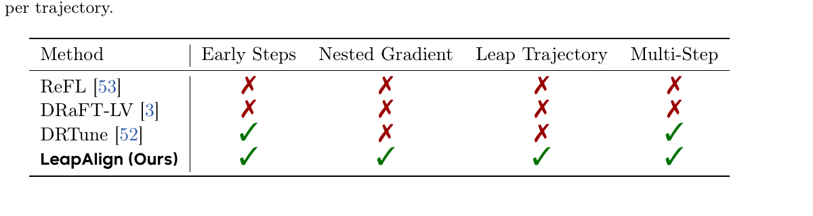
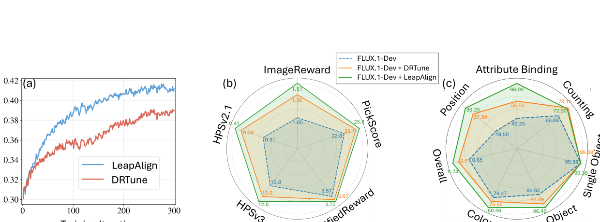
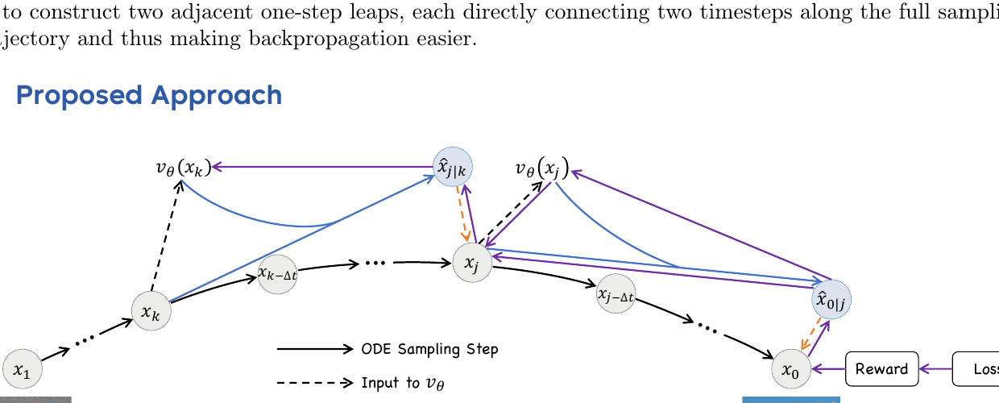
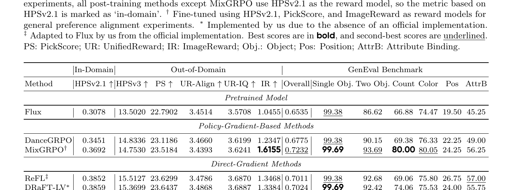
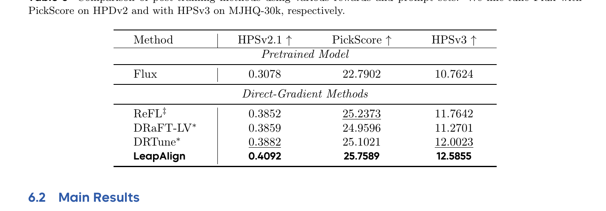
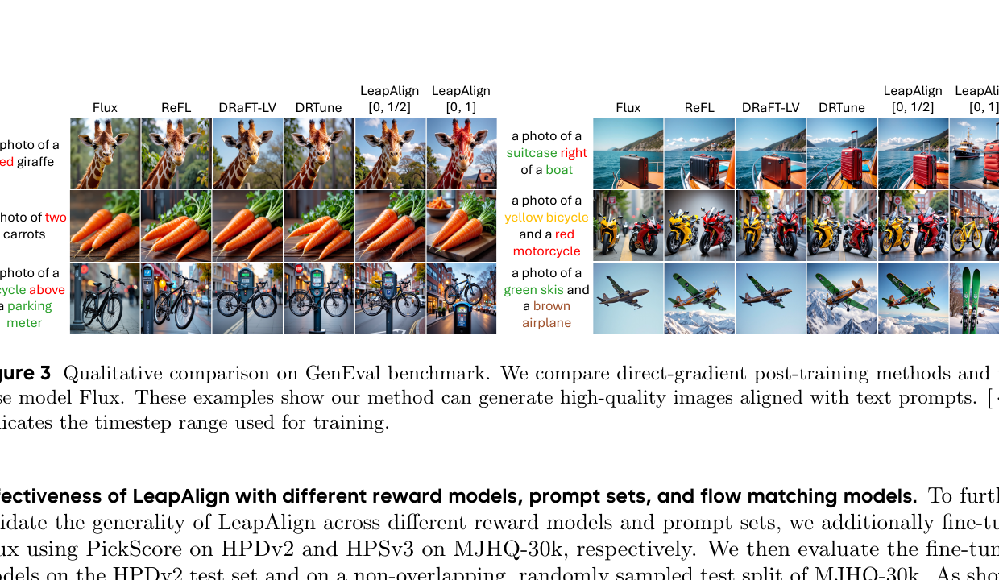
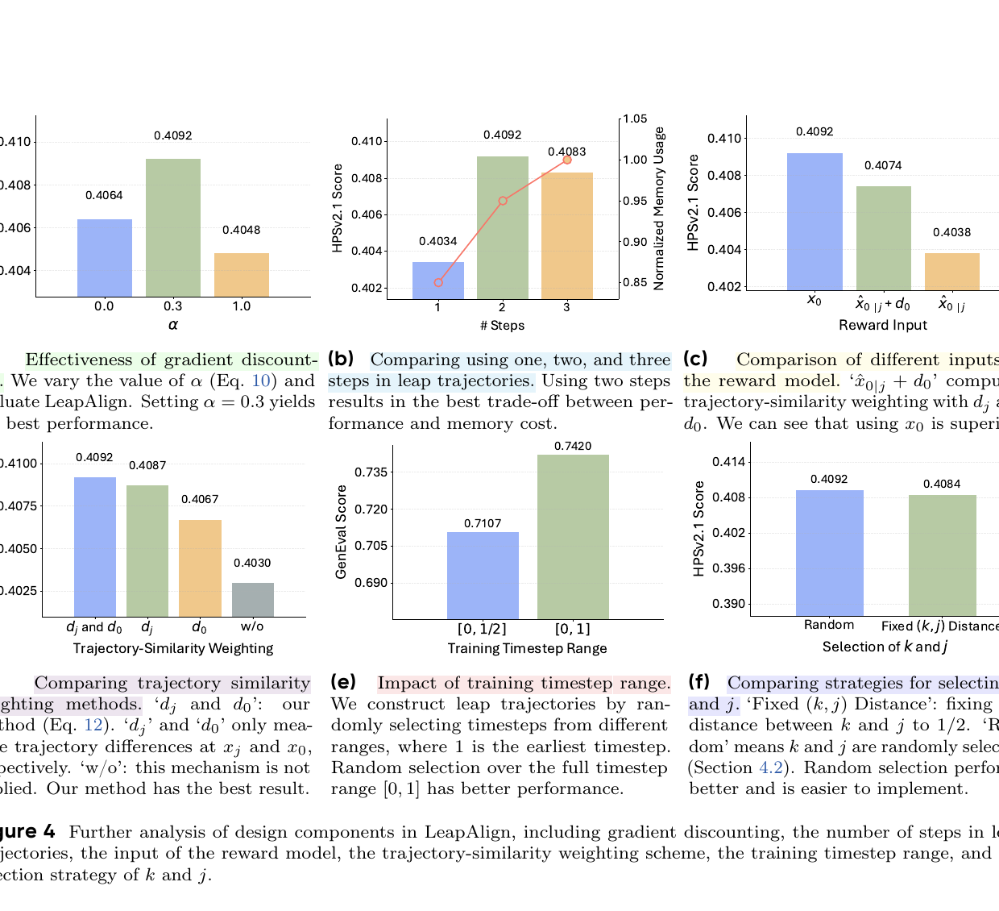

# LeapAlign: Post-Training Flow Matching Models at Any Generation Step by Building Two-Step Trajectories

## 1. 出发点 (Motivation)

用 reward model 给 flow matching T2I 模型对齐人类偏好,有两条路:

- **Policy gradient (GRPO 派系):** DanceGRPO、Flow-GRPO、MixGRPO。把 ODE 转 SDE,做 PPO/REINFORCE 风格更新。*不*依赖采样过程可微 — 用了 LLM 思路。问题:variance 高,收敛慢。
- **Direct-gradient (ReFL / DRaFT-LV / DRTune):** Flow matching 的采样过程*本身可微*,所以可以直接对 reward 求梯度,通过链式法则一路 backprop 到模型参数。这条路收敛更快更稳。

但 direct-gradient 有个硬约束:25 步 (或更多) 的长链 backward 会导致:

1. **显存爆炸:** 每一步的激活都要存,$\partial x_0/\partial \theta$ 沿着 25 步链展开。
2. **梯度爆炸:** 多步乘积,数值不稳。

现有 direct-gradient 方法的"折中"都不完美:

- **ReFL (Xu et al. 2023):** 只在轨迹末端选 1 个时步,用 1-step leap 估计 $\hat x_0$,在 $\hat x_0$ 上算 reward,只更新这一步。无法更新早期步。
- **DRaFT-LV (Clark et al. 2023):** 只更新最后一步,通过多次加噪+平均降方差。同样无法更新早期。
- **DRTune (Wu et al. 2023):** 可以更新多步,但在每步的模型输入处 stop_gradient — 这相当于*砍掉了 nested gradient 项* (跨步交互),信息丢失严重。

问题是:**早期步决定全局布局** (Hertz et al.; Liang et al.) — 想做组合性生成 (e.g., "a red giraffe", "two carrots") 必须改早期步。所以"无法更新早期步"是个 hard limitation。

<figure>
      
      <figcaption>Tab. 1 — Direct-gradient 方法对比。LeapAlign 是<em>唯一</em>四个属性 (Early Steps / Nested Gradient / Leap Trajectory / Multi-Step) 全部满足的方法。</figcaption>
    </figure>

LeapAlign 的 TL;DR 思路:**"我不 backprop 整条 25 步链,我从中随机挑出 2 步,只在这 2 步上 backprop。"** 通过精心的 stop_gradient 设计,前向用真实轨迹 $x_0$ 算 reward,反向只走两步,可以 update 任何位置的步。

<figure>
      
      <figcaption>Fig. 1 — (a) 在组合性 alignment 上 LeapAlign 收敛比 DRTune 快且最终 reward 更高;(b) 6 个 evaluator (HPSv2.1, HPSv3, PickScore, UnifiedReward Align/IQ, ImageReward) 全面领先;(c) GenEval 6 个子任务,Attribute Binding 这种需要早期 layout 控制的任务上提升尤其明显 (66 vs base 45)。</figcaption>
    </figure>

## 2. 方法 (Method)

### 核心思想 (类比)

把扩散/flow matching 画图想成 25 笔素描:第 1 笔定大轮廓,第 25 笔抠细节。reward 是最后那张图的得分。你要把"反馈分数"告诉画家:

- **ReFL/DRaFT-LV 的做法:** 只告诉画家"你第 25 笔画得怎么样" — 早期布局完全没法改。
- **DRTune 的做法:** 每笔都告诉一点反馈,但*规定每一笔的反馈只看那一笔的颜料*,不能看上一笔的影响。可以改早期,但跨笔的交互信息丢了。
- **LeapAlign 的做法:** 让画家正常画完 25 笔得到最终画。然后随机选两笔位置 (比如第 5 笔和第 15 笔位置),告诉画家:"假装你能从第 5 笔的状态*一跳*到第 15 笔的状态,再从第 15 笔*一跳*到最终。在这两跳上调你的笔法,reward 是真正的最终画。" — 前向用真画评分,反向只调两跳,可以触及最早期。

<figure>
      
      <figcaption>Fig. 2 — 总体流程。$x_1$ 是初始噪声,$x_0$ 是最终图。黑色实线是正常 25 步 ODE 采样 (在 <code>no_grad</code> 下跑)。蓝色实线是两个 "leap" — $\hat x_{j\mid k} = x_k - (k-j) v_\theta(x_k)$ 和 $\hat x_{0\mid j} = x_j - j v_\theta(x_j)$。橘色虚线是 "latent connector" — 把 $\hat x$ 与真实 $x$ 通过 stop_gradient 拼起来。Reward 算在<em>真实</em> $x_0$ 上,梯度只通过紫色虚线 (leap trajectory) 反传。</figcaption>
    </figure>

### 2.1 Flow Matching 基础

Flow matching (Lipman et al. 2023; Liu et al. 2022) 学连续速度场 $v_\theta(x_t, t)$,把噪声 $x_1 \sim \mathcal N(0, I)$ 映回数据 $x_0 \sim p_{\text{data}}$:

在*rectified flow* 下取线性 $\alpha_t = 1-t,\ \beta_t = t$,速度场 $v = x_1 - x_0$ 是*常向量*。

**One-step leap prediction (论文 Eq. 3):** 从时步 $k$ 直接预测时步 $j$ 的潜变量:

这是欧拉法 (Euler) 把 $k$ 到 $j$ 的所有中间步用*一次*速度估计跨过去 — 在长链上这是粗略近似,但在 leap trajectory 里只用来构造可微连接,精度通过 latent connector 修正。

### 2.2 Leap Trajectory 构造 (论文 §4.2)

每个 iteration:

1. 从噪声 $x_1$ 跑完整 25 步 ODE 采样得到 $x_0$ (**整条用 `no_grad`**,但 $x_k, x_j, x_0$ 这三个状态保留下来)。
2. 随机抽 $k, j \in [0, 1]$,$k > j$。
3. 构造两个 one-step leap:
        $$\hat x_{j\mid k} = x_k - (k - j) v_\theta(x_k) \quad (4)$$
        $$\hat x_{0\mid j} = x_j - j\, v_\theta(x_j) \quad (5)$$
4. **Latent connector — 关键 trick:**
        $$x_j = \hat x_{j\mid k} + \text{sg}(x_j - \hat x_{j\mid k}) \quad (6)$$
        $$x_0 = \hat x_{0\mid j} + \text{sg}(x_0 - \hat x_{0\mid j}) \quad (7)$$
        <p>前向看:$x_j$ 的<em>值</em>仍然等于真实 ODE 采样得到的 $x_j$ (因为 $\hat x_{j\mid k} + (x_j - \hat x_{j\mid k}) = x_j$)。但反向看:梯度只能流过 $\hat x_{j\mid k}$ 这一项 ($\text{sg}$ 截断了 $(x_j - \hat x_{j\mid k})$ 的梯度)。<strong>这就是"forward 用真实状态、backward 只走两步"的实现机制。</strong></p>

论文用一句紧凑的箭头表示:

实线箭头是 leap (走 $v_\theta$),虚线箭头是 latent connector (stop_gradient)。**backward 只展开 2 步**,显存 O(1),还能更新任何 $(k, j)$。

### 2.3 梯度分解 + 折扣 (论文 §4.3)

把 $\partial x_0 / \partial \theta$ 沿 leap trajectory 展开 (论文 Eq. 8,Appendix G 推导):

三项含义:

- 前两项 ("single-step gradients"):各自来自一个 leap,DRTune 也有这两项。
- 第三项 ("nested gradient"):$v_\theta(x_j)$ 对 $x_j$ 的偏导 × $v_\theta(x_k)$ 对 $\theta$ 的偏导 — 捕捉*跨时步*的交互。直觉上:"我在 $k$ 步动了模型一下,影响了 $x_j$,然后这个 $x_j$ 又影响了 $v_\theta(x_j)$,最后影响 $x_0$"。**DRTune 把这一项整个砍掉了** (通过 stop_gradient at model input)。

论文观察:nested gradient 是真有用,但*整项保留*又容易爆。所以引入**gradient discounting factor $\alpha \in [0, 1]$**,把 nested 项乘 $\alpha$ 缩小:

这一步实现非常巧妙。前向看 $\alpha x_j + (1-\alpha) \text{sg}(x_j) = x_j$ — 没有任何数值改变。反向看:$\partial / \partial x_j$ 这条链路只收到 $\alpha$ 倍的梯度 ($\text{sg}$ 那一支不传梯度)。结果是 nested gradient 乘 $\alpha$:

消融 (Fig. 4a) 显示 $\alpha = 0.3$ 最优,$\alpha = 0$ (DRTune 等价) 和 $\alpha = 1$ (整项保留) 都更差。**"不删,缩小"**是论文工程上的核心 trick。

### 2.4 Loss + 轨迹相似加权 (论文 §4.4, §4.5)

**Hinge-style reward loss (Eq. 11):**

$r(\cdot)$ 是 reward model (默认 HPSv2.1),$\lambda$ 是阈值 (论文设 0.55)。超过阈值后停止施压,防 reward hacking。<u>注意</u>:reward 算在*真实* $x_0$ 上,不是 leap 估计的 $\hat x_{0\mid j}$ — 这跟 ReFL 不同 (ReFL 在 $\hat x_0$ 上算 reward)。论文论证:$\hat x_0$ 可能模糊有 artifact,reward 评估不可靠;$x_0$ 来自完整 25 步推理,质量真实。

**轨迹相似加权 (Eq. 12):** Leap trajectory 是粗近似,如果两次 leap 离真实轨迹太远,梯度信号反而误导。论文定义两个 connection 点的近似误差:

加权因子 (clamp 防止过度强调几乎相同的点):

最终目标 (Eq. 13):

注意 $w_{\text{sim}}$ 自身也走 stop_gradient — 它只是*样本权重*,不参与优化目标。$\tau$ 设 0.1。leap trajectory 越接近真实轨迹,权重越高,反之 down-weight。

### 2.5 与代码对照

LeapAlign 的代码非常干净。核心训练循环不到 200 行,把上面所有公式逐行翻译。

**(a) 随机抽两个时步 $k, j$** — 实现 Algorithm 1 的开头。

<p class="code-source">repo/fastvideo/train_leapalign_flux.py:L106-L168 — sample_trajectory 入口</p>

```python
idx_bs = 2
select_indices = (
    torch.randperm(
        args.max_idx - args.min_idx,
        device="cpu",
        generator=generator,
    )[:idx_bs] + args.min_idx
).long()
# t1, t2
select_indices = torch.sort(select_indices, descending=True).values

# ... (initialize latents, set up scheduler) ...

# Indices in the descending timestep schedule where gradient is enabled
grad_on_ind_set = set(
    timesteps.size(0) - select_index.item()
    for select_index in select_indices
)

for idx, step_t in enumerate(timesteps):
    with nullcontext() if (idx in grad_on_ind_set) else torch.no_grad():
        ...
```

L107-L115:从 `[min_idx, max_idx)` 区间随机抽 2 个 unique 整数,然后降序排成 $(k, j)$。L165-L168:把这两个索引位置加入 `grad_on_ind_set`,主循环里只有这两步的 forward 在 `nullcontext()` 下跑 (梯度开启),其他 23 步都在 `no_grad` 下跑。

**(b) Latent connector + gradient discounting** — 实现 Eq. 6, 9。<u>论文最核心的工程实现</u>。

<p class="code-source">repo/fastvideo/train_leapalign_flux.py:L174-L194 — latent connector @ step $j$</p>

```python
if idx == timesteps.size(0) - select_indices[1].item():
    if args.with_traj_sim_weighting:
        with torch.no_grad():
            # b
            pred_x2_weight_factor = (
                torch.abs(pred_xt2.double() - latents_xt.double())
                .mean(dim=tuple(range(1, pred_xt2.ndim)), keepdim=False)
                .clip(min=args.traj_sim_weighting_min)
            )
    # w/o grad -> w/ grad   (paper Eq. 6: x_j = x̂_{j|k} + sg(x_j - x̂_{j|k}))
    latents_xt = pred_xt2 + (latents_xt - pred_xt2).detach()
    if args.nested_grad_coe <= 0.0:
        dit_latents_xt = latents_xt.detach()
    else:
        # paper Eq. 9: pass α·x_j + (1-α)·sg(x_j) into v_θ
        dit_latents_xt = (
            args.nested_grad_coe * latents_xt +
            (1 - args.nested_grad_coe) * latents_xt.detach()
        )
else:
    dit_latents_xt = latents_xt
```

三个对照点:

- **L184 是 Eq. 6 的逐字翻译:** `latents_xt = pred_xt2 + (latents_xt - pred_xt2).detach()` — 前向 = `pred_xt2 + (latents_xt - pred_xt2)` = `latents_xt` (真实值);反向只走 `pred_xt2` 这一支。
- **L188-L191 是 Eq. 9 的逐字翻译:** `nested_grad_coe` = paper 的 $\alpha$。前向 = $\alpha \cdot x_j + (1-\alpha) \cdot x_j = x_j$ (不变);反向只 $\alpha$ 比例传给 $x_j$ 的梯度路径,因此 nested gradient 乘 $\alpha$。
- **L175-L182** 顺手算 $d_j$ — 用于后面的 trajectory similarity weighting。

**(c) Leap step + 最终 latent connector** — 实现 Eq. 4, 5, 7。

<p class="code-source">repo/fastvideo/train_leapalign_flux.py:L195-L247 — two-leap + final connector</p>

```python
with torch.autocast("cuda", torch.bfloat16):
    pred = transformer(
        hidden_states=dit_latents_xt, encoder_hidden_states=encoder_hidden_states,
        timestep=timestep/1000, guidance=cfg_guidance, txt_ids=text_ids,
        pooled_projections=pooled_prompt_embeds, img_ids=image_ids,
        joint_attention_kwargs=None, return_dict=False,
    )[0]

if idx == timesteps.size(0) - select_indices[0].item():
    # @ step k: one-step leap from x_k to x̂_{j|k}  (paper Eq. 4)
    t2_idx = timesteps.size(0) - select_indices[1].item()
    pred_xt2 = fm_scheduler.jump_to_step(pred, step_t, latents_xt, t2_idx)
    pred = pred.detach()

if idx == timesteps.size(0) - select_indices[1].item():
    # @ step j: standard Euler + extract x̂_{0|j}  (paper Eq. 5)
    latents_xt, latents_pred_x0 = fm_scheduler.step(
        pred, step_t, latents_xt, with_pred_x0=True,
    )
    latents_xt = latents_xt.detach()
else:
    latents_xt = fm_scheduler.step(pred, step_t, latents_xt, with_pred_x0=False)[0]

# ... loop continues ...

# Final latent connector (paper Eq. 7): x_0 = x̂_{0|j} + sg(x_0 - x̂_{0|j})
latents_pred_x0 = latents_pred_x0 + (latents_xt - latents_pred_x0).detach()
return latents_xt, latents_pred_x0, traj_sim_weight_factor
```

对照点:

- **L208-L215:** 在 $k$ 步执行 `jump_to_step` 从 $x_k$ 一跳预测 $\hat x_{j\mid k}$ — Eq. 4。同时 `pred = pred.detach()` 防止 $v_\theta(x_k)$ 被双重 backward。
- **L217-L224:** 在 $j$ 步用 `with_pred_x0=True` 同时拿到 $x_{j-\Delta t}$ 和 $\hat x_{0\mid j}$ (这就是 Eq. 5)。
- **L247:** 把 $\hat x_{0\mid j}$ 和真实 $x_0$ 通过 connector 拼起来 — Eq. 7。

**(d) One-step leap 实现 — Scheduler**

<p class="code-source">repo/fastvideo/schedulers/fm_euler_discrete_with_pred_x0.py:L25-L108 — Euler step + jump_to_step</p>

```python
def step(self, model_output, timestep, sample, ..., with_pred_x0=False):
    # ... validate inputs ...
    sample = sample.to(torch.float32)
    sigma = self.sigmas[self.step_index]
    sigma_next = self.sigmas[self.step_index + 1]

    prev_sample = sample + (sigma_next - sigma) * model_output           # standard Euler step

    if with_pred_x0:
        pred_x0_sample = sample + (- sigma) * model_output               # ⟵ paper Eq. 5: x̂_{0|j} = x_j - j·v_θ(x_j)
    else:
        pred_x0_sample = None
    # ...
    return (prev_sample, pred_x0_sample)

def jump_to_step(self, model_output, timestep, sample, target_idx):
    # ... validate inputs ...
    sigma = self.sigmas[self.step_index]
    sigma_next = self.sigmas[target_idx]                                 # jump straight to target sigma
    target_sample = sample + (sigma_next - sigma) * model_output         # ⟵ paper Eq. 4: x̂_{j|k} = x_k - (k-j)·v_θ(x_k)
    return target_sample
```

注意:`jump_to_step` 和普通 Euler step 的区别*只是 sigma_next 的取值* — 一个步进取 `sigmas[step_index+1]` (下一步),一个直接取 `sigmas[target_idx]` (跳到 $j$ 位置)。在 rectified flow 下 sigma 与 timestep 成线性关系,所以 `sigma_next - sigma` 就是 $-(k-j)$。

**(e) Hinge reward loss + trajectory similarity weighting**

<p class="code-source">repo/fastvideo/train_leapalign_flux.py:L251-L294 — get_reward_loss</p>

```python
def get_reward_loss(args, latents_pred_x0, vae, reward_model, tokenizer, caption,
                    preprocess_val, traj_sim_weight_factor):
    w, h = args.w, args.h
    with torch.autocast("cuda", dtype=torch.bfloat16):
        latents_pred_x0 = unpack_latents(latents_pred_x0, h, w, 8)
        latents_pred_x0 = (latents_pred_x0 / 0.3611) + 0.1159
        image_pred_x0 = vae.decode(latents_pred_x0, return_dict=False)[0]
        image_pred_x0 = (image_pred_x0 * 0.5 + 0.5).clamp(0, 1)

    if args.use_hpsv2:
        image_pred_x0 = preprocess_val(image_pred_x0)
        text = tokenizer(caption).to(device=image_pred_x0.device, non_blocking=True)
        with torch.amp.autocast('cuda'):
            outputs = reward_model(image_pred_x0, text)
            image_features, text_features = outputs["image_features"], outputs["text_features"]
            reward_pred_x0 = torch.einsum("bc,bc->b", image_features, text_features)
    else:
        raise NotImplementedError("Only HPSv2 is currently supported for reward computation.")

    # paper Eq. 11: L_raw = max(0, λ - r(x_0))
    reward_loss = F.relu(-reward_pred_x0 + args.loss_relu_clip) * args.loss_grad_scale
    # paper Eq. 12-13: divide by (max(d_j, τ) + max(d_0, τ))  ==  multiply by w_sim
    if traj_sim_weight_factor is not None:
        reward_loss = reward_loss / traj_sim_weight_factor
    reward_loss = torch.mean(reward_loss)
    return reward_loss, reward_pred_x0.detach().mean()
```

L287 实现 Eq. 11:`F.relu(-r + λ)` = $\max(0, λ - r)$。L289 实现 Eq. 12-13:`reward_loss / traj_sim_weight_factor` = `reward_loss * w_sim` (因为 `w_sim = 1 / (max(d_j, τ) + max(d_0, τ))`,而 `traj_sim_weight_factor` 就是分母)。

## 3. 结论 (Key Findings)

<figure>
      
      <figcaption>Tab. 2 — Flux 上的主结果。LeapAlign 在 in-domain HPSv2.1 <strong>0.4092</strong> (DRTune 0.3882, MixGRPO 0.3692, base 0.3078)、out-of-domain HPSv3 / PickScore / UnifiedReward 全部第一,GenEval Overall <strong>0.7420</strong> (MixGRPO 0.7232, DRTune 0.7101)。Attribute Binding 子项 <strong>66.00</strong> vs DRTune 55.50 — 这正是需要早期 layout 控制的任务。</figcaption>
    </figure>

**定量收益 (vs 最强基线 DRTune):**

- HPSv2.1: 0.3882 → **0.4092** (+5.4%)
- HPSv3: 15.5606 → **15.7678**
- PickScore: 23.5185 → **23.7137**
- GenEval Overall: 0.7101 → **0.7420** (+4.5%)
- GenEval Position: 27.50 → **30.25**; Attribute Binding: 55.50 → **66.00**; Two Objects: 73.12 → 72.50 (轻微回退)

**跨 reward / 跨 prompt set 泛化 (Tab 3):** 用 PickScore 训练 → 测试 PickScore;用 HPSv3 训练 → 测试 HPSv3。LeapAlign 全部第一。

<figure>
      
      <figcaption>Tab. 3 — 换 reward model / prompt set 后,LeapAlign 仍然是 best。PickScore 25.7589 vs ReFL 25.2373,HPSv3 12.5855 vs DRTune 12.0023。</figcaption>
    </figure>

<figure>
      
      <figcaption>Fig. 3 — GenEval 上的定性对比。"a photo of a red giraffe" 这种需要颜色绑定的 prompt,ReFL/DRaFT-LV (只更新末步) 仍然画灰色长颈鹿;LeapAlign [0,1] 范围训练能成功绑红色。"a photo of two carrots" 也是类似:ReFL 数错,LeapAlign 数对。</figcaption>
    </figure>

**消融 (Fig 4):**

<figure>
      
      <figcaption>Fig. 4 — 6 个 ablation。(a) $\alpha = 0.3$ 是 nested gradient 折扣的甜点;(b) 2-step leap 是性能/显存的最佳平衡 (3-step 没收益);(c) reward 算在 $x_0$ 上优于 $\hat x_{0\mid j}$;(d) trajectory similarity 同时考虑 $d_j$ 和 $d_0$ 优于单独;(e) 训练时步范围 $[0, 1]$ 优于 $[0, 1/2]$ — 验证"早期步重要"的 motivation;(f) 随机选 $(k, j)$ 比固定距离稍好且更简单。</figcaption>
    </figure>

额外有意思的发现 (Fig 4a):**即使 $\alpha = 0$ (砍掉 nested gradient,行为类似 DRTune),LeapAlign 仍然比 DRTune 更好** (HPSv2.1 0.4064 vs DRTune 0.3882)。说明 leap trajectory 架构本身就有收益,nested gradient discounting 是额外的 boost。

## 4. 实现细节 (Implementation Notes)

训练代码*已发布*,基于 [FastVideo](https://github.com/hao-ai-lab/FastVideo) 框架。可重现性较高,只需 16 GPUs。

- **Backbone:** Flux.1-Dev (12B rectified flow matching DiT)。SD3.5-M 也验证过 (Appendix B)。`scripts/finetune/train_flux_leapalign_hpdv2_hpsv2.sh`
- **Reward model:** 代码*只支持 HPSv2* — `train_leapalign_flux.py:L285` 显式 `raise NotImplementedError("Only HPSv2 is currently supported")`。Tab 3 报告的 PickScore / HPSv3 训练需要读者自己加 reward model 接入。
- **Optimizer:** AdamW,lr 1e-5,batch 64,weight decay 1e-4,EMA decay 0.995,$\beta_1=0.9, \beta_2=0.999$。300 iterations。 `train_leapalign_flux.py:L1-L100`
- **采样配置:** 训练时 25 steps + CFG scale 3.5;测试时 50 steps,同 CFG。720×720 分辨率。`scripts/finetune/...` 与 `sample_trajectory:L148`
- **$\alpha$ (gradient discounting):** CLI arg `--nested_grad_coe`,论文默认 0.3 (Fig. 4a 最优值)。设为 0 时退化为 DRTune-style;设为 1 时完整 nested gradient (训练不稳定)。`train_leapalign_flux.py:L185-L191`
- **$\tau$ (similarity clamp):** 0.1。`traj_sim_weighting_min` arg。
- **Hinge $\lambda$:** 0.55 (论文设定)。`loss_relu_clip` arg,默认 0.55。
- **时步采样范围:** CLI arg `--min_idx`, `--max_idx` 决定能选哪些时步。论文默认 `[0, sample_steps)` = $[0, 1]$ 全范围。Ablation (Fig. 4e) 用 $[0, 12]$ (即 $[0, 1/2]$) 对比。
- **训练资源:** 16 GPUs (paper §6.1)。比 Flow-OPD 的 32 GPUs 友好,可在 2 节点的小集群上跑。
- **梯度优化:** 整条 25 步 sampling 在 `no_grad` 下跑 (`train_leapalign_flux.py:L171` 的 `nullcontext() if (idx in grad_on_ind_set) else torch.no_grad()`),只有 $(k, j)$ 两个时步开启梯度。<u>这是 LeapAlign 显存常数复杂度的核心实现</u>。
- **代码 vs 论文不一致 — 一条小细节:** 论文 Eq. 13 写 $\mathcal{L} = \text{sg}(w_{\text{sim}}) \cdot \mathcal{L}_{\text{raw}}$,代码 L289 实现为 `reward_loss / traj_sim_weight_factor` 而 `traj_sim_weight_factor` 是 *分母* 而非 $w_{\text{sim}}$ 本身。两种写法数值等价 (两者都是除以 `max(d_j, τ) + max(d_0, τ)`),但 Eq. 12 的"分式形式"和代码的"除法形式"对应需要读者自己反推。
- **FSDP 支持:** 代码集成了 FSDP (`fsdp_util.py`) — 12B Flux 需要 FSDP 才能在 16 GPUs 上 fit。

## 5. 批判性总结 (Critical Assessment)

### 5.1 优点

- **Latent connector + gradient discounting 是真聪明的工程 trick。** Eq. 6 和 Eq. 9 都用了同样的 stop_gradient 套路:前向数值不变,反向选择性截断/缩放梯度。两行代码搞定一个理论上很复杂的目标 (early-step gradient with controlled magnitude)。这种"前向真实、反向控制"的设计模式可以借鉴到其他场景。
- **梯度三项分解 (Eq. 8) + 分项消融 (Fig. 4a) 给出了机制层面的解释。** 不是黑盒"我们方法更好",而是明确"nested gradient 这一项有用、整项保留会爆、所以我们缩小它"。$\alpha = 0$ 时仍然超过 DRTune 也说明 leap trajectory 架构本身就是 win。
- **训练代码完整发布,可在 16 GPUs 上 reproduce。** 不像 Flow-OPD 那种"挂个 README 拖延",这个 repo 给出 `train_leapalign_flux.py` 全部 994 行 + 配置脚本。
- **Reward 算在*真实* $x_0$ (不是 leap 估计) 上。**论文明确论证 $\hat x_{0\mid j}$ 在早期步上充满 artifact,reward model 评分不可靠;真实 $x_0$ 是 25 步推理得到的真图,reward 评分准。这是个比 ReFL 干净的设计。
- **Trajectory similarity weighting 是个自然的样本权重。** 当两次 leap 的近似误差大时 (说明 leap 离真实远),down-weight 这个样本 — 防止用错误近似 train 模型。
- **实验广度:** Flux + SD3.5-M 两个 backbone × HPSv2.1/PickScore/HPSv3 三个 reward model × HPDv2/MJHQ-30k/GenEval 三个 prompt set × 5 个基线。比同期 Flow-OPD 在 SD-3.5-M 单 backbone 上的对比更广。

### 5.2 不足 / 疑点

- **Reward model 代码只支持 HPSv2.** Tab 3 报告了 PickScore / HPSv3 的结果,但 `train_leapalign_flux.py:L285` 一个 `NotImplementedError` 摆在那。读者要复现 Tab 3 得自己接 PickScore / HPSv3 reward。这是个不大不小的"代码 vs 论文 gap"。
- **"任意步"的代价:每次 iteration 需要先跑完整 25 步采样。** 虽然 23 步在 `no_grad` 下,但前向开销仍然是 1 倍 + 反向的 2 步 ≈ 总 27 步 worth of compute。比 ReFL (只 1 步) 慢约 27 倍,比 DRTune (多步多次 forward) 慢约 2-3 倍。论文没显式对比 wall-clock 收敛时间 / 显存 — 只画了 reward curve (Fig 1a) 但没给单位时间。
- **$\alpha = 0.3$ 没解释为什么。** Fig 4a 显示 $\alpha = 0.1, 0.3, 0.5, 0.7$ 的扫,0.3 最优 — 但*为什么* 0.3 是 sweet spot 没机制解释。是不是会跟模型大小 / 训练步数有耦合?跨模型 (例如换成 Wan 视频模型) 还成立吗?Appendix C 据说有分析但正文没提。
- **Two Objects 子任务上 LeapAlign 反而轻微回退 (73.12 → 72.50)。** Tab 2 唯一回退的子项。论文没解释 — 是否说明 leap trajectory 对某类"双对象排版"的早期步控制不够稳?
- **"Multi-step" 的优势没单独 ablation.** Tab 1 把 multi-step 列为 LeapAlign 的优势之一,但 Fig 4b 比较的是 "1 leap vs 2 leap vs 3 leap" 在同一次 backward 内,不是 "1 个 leap trajectory 每 iter vs N 个 leap trajectory 每 iter"。"一次 iter 更新几对 $(k, j)$" 这个变量没扫。
- **Reward hacking 论证不充分。** 论文用 hinge loss + $\lambda$ 阈值防 reward hacking,但只在 HPSv2.1 上验证。HPSv2.1 reward model 本身的 bias 跟生成图的 alignment 度是循环论证 — 没有人评 (user study) 验证 "高 HPSv2.1 = 真的更好"。Flow-OPD 至少给了 UnifiedReward / QwenVL Score 等多种"评判员",而本论文只在 HPSv2.1 主 reward 上做训练,跨 reward generalization 用的指标也都是自动指标。
- **"$x_0$ vs $\hat x_{0\mid j}$" 这个选择有点 self-serving.** 论文在 §4.4 论证 reward 算 $x_0$ 更好,Fig 4c 用 ablation 验证。但 $x_0$ 是 25 步真图,$\hat x_{0\mid j}$ 是 1 步估计 — 25 步图当然更清晰,reward model 当然给更高分。*不是 reward 评分更"准",而是图本身就更好*。论证逻辑有点循环。
- **SD3.5-M 上的结果只在 Appendix.** 正文全部是 Flux 数字。读者要 trust "也适用于其他 flow matching" 需要翻 appendix B。同期 Flow-OPD 主表上也以 Flux 为主,可能 Flux 是当前社区基准,但 SD3.5-M 的数字不在主表是个小遗憾。
- **没有 user study.** 全部是 reward model 评分。直接用 reward model 评 reward fine-tuning 的方法有循环 bias。
- **"任意时步" claim 在*极端*早期步上的表现没单独测.** Fig 4e 比较 $[0, 1]$ vs $[0, 1/2]$ — 后者是早期一半。但极端早期 (例如 $[0.9, 1.0]$ 只在最后 10%) 单独训练的结果没给。直觉上极晚期更新对 GenEval (layout) 帮助不大,但论文没验证 "只训练早期 vs 只训练晚期" 的对比。

### 5.3 适用 vs 不适用

- ✅ **适用:**Multi-step rectified flow matching 模型 (Flux、SD3.5、Wan、Lumina 等) 的 reward fine-tuning。
- ✅ **适用:**需要改善**组合性 / layout / 早期结构**的场景 — 例如"两个对象"、"颜色绑定"、"位置关系"这类 GenEval 任务。
- ✅ **适用:**有*可微* reward model 的场景 (CLIP-based: HPSv2, PickScore; VLM-based: HPSv3 等)。
- ❌ **不适用:**One-step / few-step (4 步以下) 模型 — 论文 §5 自己说了 "less important",因为短链直接 backprop 即可。
- ❌ **不适用:**非可微 reward (rule-based metric, GenEval rule judge 这种) — 需要先把 reward model 化或者用 RL 风格的 GRPO。
- ⚠️ **谨慎:**想用 HPSv2 以外的 reward 时,代码层面要自己加;论文的 Tab 3 数字按 paper claim 看,但官方代码没实现。
- ⚠️ **谨慎:**$\alpha = 0.3$ 是 Flux + HPSv2.1 的最优值,换 backbone 或 reward 时建议重新 sweep。

### 5.4 进一步阅读

- [DRaFT-LV (Clark et al. 2023)](https://arxiv.org/abs/2309.17400):Direct-gradient fine-tuning 的代表,只更新最后一步 + 多次加噪降方差。
- [ReFL (Xu et al. 2023, ImageReward)](https://arxiv.org/abs/2305.16381):本文最直接的对照,在 1-step leap 上算 reward。
- DRTune (Wu et al. 2023):本文的最强直接对手,通过 stop_gradient at model input 实现 multi-step,但砍掉了 nested gradient。
- [Flow-GRPO (Liu et al. 2025)](https://arxiv.org/abs/2505.05470):policy-gradient 路线的代表,把 ODE 转 SDE 后做 GRPO。本文 Tab 2 的 DanceGRPO/MixGRPO 都基于这个 codebase 上做。
- [Flow-OPD (Fang et al. 2026)](https://arxiv.org/abs/2605.08063):同期同领域 work — 把 OPD (on-policy distillation) 思想搬到 flow matching。与 LeapAlign 路线不同 (Flow-OPD 是多教师 OPD,LeapAlign 是直接梯度),但都在 SD-3.5 / Flux 上对齐。
- [MixGRPO (Li et al. 2025)](https://arxiv.org/abs/2507.21802):本文 Tab 2 的最强 policy-gradient baseline,GRPO + ODE/SDE 混合。
- [Adjoint Matching](https://arxiv.org/abs/2409.08861):把 reward fine-tuning 形式化为 stochastic optimal control,理论路线。
- [RL's Razor (Shenfeld et al. 2025)](https://arxiv.org/abs/2509.04259):讨论 on-policy 更新天然 KL-min 偏置。LeapAlign 不是严格 on-policy (它的 reward 仍来自外部 model),但其"避免改变模型在已访问轨迹上的行为"的设计精神类似。

<footer>
    <hr/>
    <p class="meta">Read on 2026-05-12 · Generated with the <code>reading-papers</code> skill</p>
  </footer>
