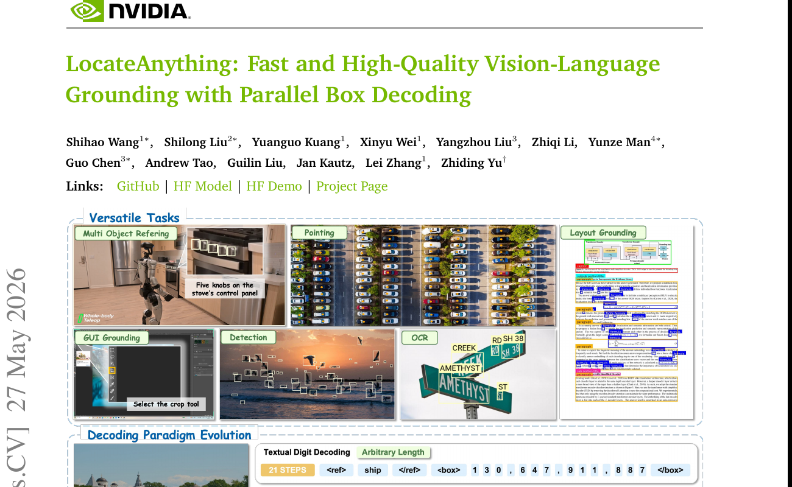
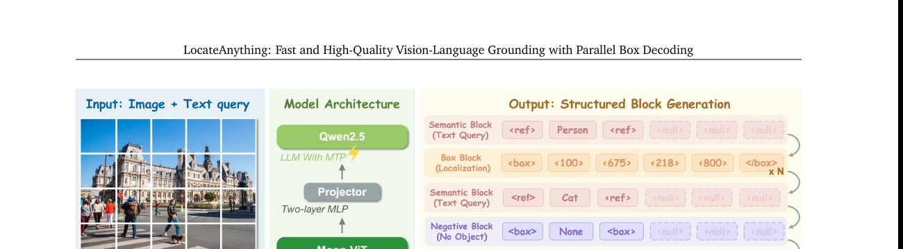
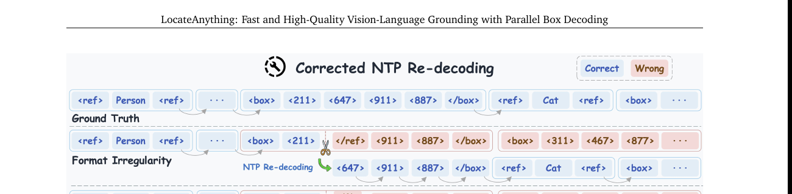
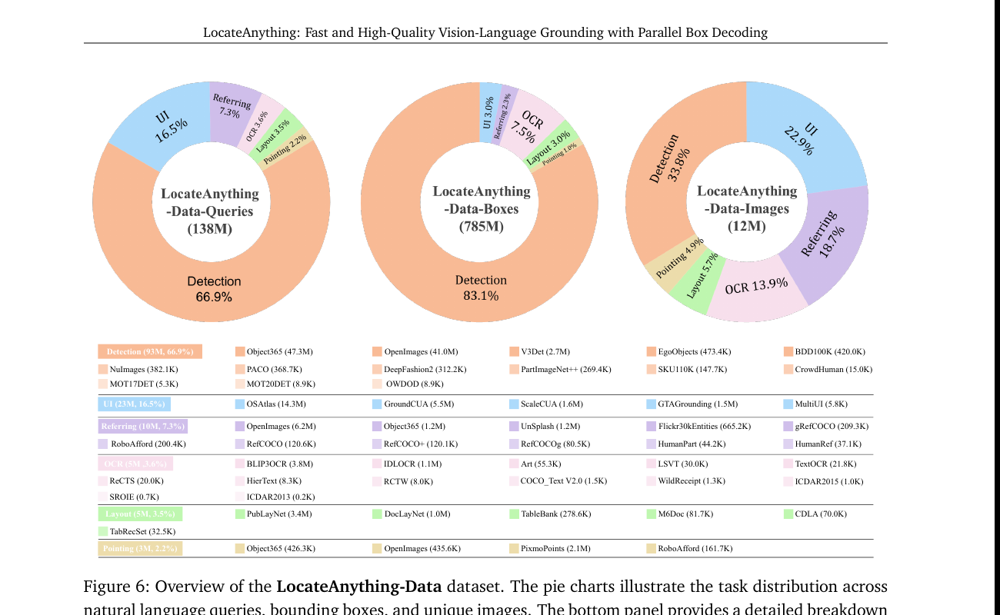
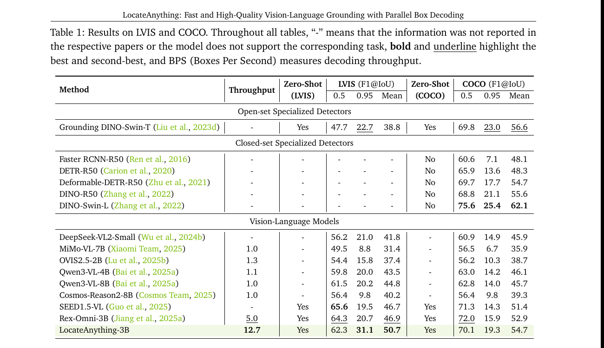

# LocateAnything: 把 bbox 当原子单元一次性并行输出

<figure>
  
  <figcaption>
    Fig. 1 — 上半: LocateAnything 在统一 VLM 下支持多任务定位 (multi-obj 检测、refer、UI grounding、layout grounding、detection、OCR)。下半: 三种 decoding 范式对比 — <strong>Textual Digit Decoding</strong> 把 "647" 当作字符串 "6", "4", "7" 一位位预测;<strong>Quantized Coordinate Decoding</strong> 用量化的整体 token (`<647>`) 但仍按 $(x_1, y_1, x_2, y_2)$ 顺序逐 token 出;<strong>Parallel Box Decoding (本文)</strong> 把整个 box 当一个 atomic block 一次 forward 全部预测。
  </figcaption>
</figure>

## 1. 出发点 (Motivation)

主流 VLM 做 detection / grounding 走 next-token prediction (NTP) 路线:把 bbox 序列化成 token 流让 LM 一个个生成。两类常见编码:

- **Textual Digit**: bbox = "1024, 647, 911, 832" → tokenizer 切成数字字符 + 逗号 + 空格,平均一个 bbox 25+ token
- **Quantized Coordinate**: 把坐标量化到 1000 桶,每个坐标变 1 个 token,1 个 bbox = 4 坐标 token + 2 结构 token = 6 token

两者**共同病灶**:**2D 几何对象被强行 1D 化**。$x_1, y_1, x_2, y_2$ 这 4 个数有强结构耦合 (必须 $x_1 < x_2$、必须围住同一物体),但模型逐 token 出时**每一步独立决策**,只能靠预训练分布慢慢学这个耦合。结果:**精度受损 + 吞吐被卡** (每个 box 串行 6 步)。

直观的"修法" — **Multi-Token Prediction (MTP)**: 一次预测多个 token。但通用 MTP (随机选 span、随机 mask) 与 bbox 的耦合结构**对不齐**:

<figure>
  
</figure>

举例 (Fig 2 in paper): 训练 MTP 时,如果随机 chunk 把跨 box 的 token 划进同一 chunk (比如 `</box> <box> <122>` 跨两个 bbox), 模型被迫学"跨 bbox 边界的 token 协同分布",这是一种**虚假相关**——真实任务里没有"上一个 box 的 `</box>` 决定下一个 box 的 `x1`"这种关联。MTP 学得越好,虚假关联越强,反而伤精度。

**LocateAnything 的主张**: **MTP 必须按结构对齐**。一个 bbox 就是一个 atomic unit,长度 L=6 (`<box>` + 4 坐标 + `</box>`),一次性并行预测,不许跨 box chunk。这就是 **Parallel Box Decoding (PBD)**。

## 2. 方法 (Method)

### 2.1 Block-Based 输出格式

bbox 不再是 6-token 流,而是一个**定长 L=6 的 block**。整个生成过程变成一串 block 序列 $\mathcal{B} = (b_1, b_2, \ldots, b_N)$。每个 block 是**4 类**之一:

<figure>
  
  <figcaption>
    Fig. 3 — LocateAnything 架构 (Moon-ViT vision encoder + Qwen2.5 language decoder + MLP projector) + 4 类 atomic block:
    <strong>Semantic Block</strong> (语义/类别名,长查询占多个 block);
    <strong>Box Block</strong> (`<box>` + 4 量化坐标 + `</box>`);
    <strong>Negative Block</strong> (查询的物体不存在);
    <strong>End Block</strong> (生成终止)。
    所有 block 长度统一 L=6,不足的位用 `<null>` 占位——保证 tensor shape 整齐,便于并行 decode。
  </figcaption>
</figure>

联合分布:

$$ P(\mathcal{B} \mid Z, \mathcal{E}) = \prod_{i=1}^N P(b_i \mid b_{<i}, Z, \mathcal{E}) $$

—— 翻译: 当前 block $b_i$ 条件依赖前面所有 block + 视觉 token $Z$ + 文本 query $\mathcal{E}$。**block 间 causal**(下一 block 看前面所有),**block 内 6 个 token 并行**。

### 2.2 训练: 同一 GT 双格式 + 两条流互不串话

直接训 MTP (一次性预测整个 block) 风险:**破坏模型原本的因果 (NTP) 推理能力**——因为预训练 LLM 是 NTP 的,直接换 objective 会 catastrophic forget。

解法:**同一 GT 同时塞两种格式**,构造一根超长拼接序列:

$$ x_{\text{all}} = x_{\text{vis}} \oplus x_q \oplus x_{\text{ntp}} \oplus x_{\text{blk}} $$

- $x_{\text{vis}}$, $x_q$: 共享视觉 + query 上下文
- $x_{\text{ntp}}$: 标准 NTP 序列 (训练目标 $\mathcal{L}_{\text{ntp}}$)
- $x_{\text{blk}}$: block-wise MTP 序列, 块内首 token 保留作 anchor, 其余替换为 `[mask]` (训练目标 $\mathcal{L}_{\text{mtp}}$)

**Attention mask 的关键设计** (这是 paper 最巧妙的部分):

1. **NTP stream 看 shared context + 自身 (causal)**, 看不到 MTP block (防止 NTP 从 MTP 偷答案)
2. **MTP stream 看 shared context + 自身 block-causal**, 看不到 NTP (防止反向)
3. **MTP block 内部 bidirectional** (4 个坐标互相看,让模型捕捉几何耦合)
4. **MTP block 之间 causal** (后面 block 看前面已生成 block, 防止重复或漏标)

总 loss: $\mathcal{L} = \mathcal{L}_{\text{ntp}} + \mathcal{L}_{\text{mtp}}$

**注意**: 推理时这个 mask 一致 — KV cache 兼容标准 causal,只是当前 block 内部 bidirectional + future masked。

### 2.3 推理: Fast / Slow / Hybrid 三模式

PBD 并不是免费午餐,有两类失败模式:

<figure>
  
  <figcaption>
    Fig. 5 — 两种 MTP 失败模式: <strong>Format Irregularity</strong> (block 内部结构错乱,如 `<box><211></ref><911><887></box>` 把 `</ref>` 插进了 box 里) 和 <strong>Spatial Ambiguity</strong> (密集物体下,MTP 预测的坐标处在两个物体中间,IoU 低)。<strong>Hybrid mode</strong>: 监测 (1) top-1 坐标 token prob &lt; 0.7,或 (2) top-5 坐标 max-min 差 &gt; 80 (在 0-1000 归一化空间) → 触发回退,丢弃该 block,改用 NTP 串行重 decode 这一个 block,完成后切回 MTP。
  </figcaption>
</figure>

**三模式权衡**:

| Mode | 机制 | 用途 |
|---|---|---|
| **Slow** | 纯 NTP 串行 | 离线高精度标注、最终评测 |
| **Fast** | 纯 MTP block 并行 | 端侧机器人 / embodied agent (latency 紧) |
| **Hybrid** | 默认 MTP,异常时回退 NTP | 生产 — 保留大部分加速 + 不会崩 |

### 2.4 LocateAnything-Data: 138M queries 多任务大数据

<figure>
  
  <figcaption>
    Fig. 6 — 12M unique image,138M queries,785M bbox。任务分布: Detection 66.9% (Object365 / OpenImages / V3Det 等),UI grounding 16.5% (OSAtlas / GroundCUA / ScaleCUA),Referring 7.3% (RefCOCO 系列 + Flickr30kEntities),OCR 3.6%,Layout 3.5%,Pointing 2.2% (PixmoPoints)。**单一统一格式喂模型同时学这 6 个任务**。
  </figcaption>
</figure>

## 3. 结论 (Key Findings)

<figure>
  
  <figcaption>
    Table 1 — LVIS / COCO zero-shot 结果。LocateAnything-3B 关键数字:
    <strong>LVIS F1@0.95 = 31.1</strong> (vs Qwen3-VL-8B 20.2, Rex-Omni-3B 20.7 — 涨 ~50% 相对)。
    <strong>Throughput = 12.7 BPS</strong> (vs Qwen3-VL-8B 的 1.0, Rex-Omni-3B 的 5.0 — 比通用 VLM 快 12.7×, 比 SOTA detection VLM 快 2.5×)。
    Mean F1@IoU LVIS = 50.7, COCO = 54.7,**全场最高**(open-set 设定下)。
  </figcaption>
</figure>

**关键数字** (从 Table 1 摘):

| 模型 | Throughput | LVIS F1@0.95 | LVIS Mean | COCO Mean |
|---|---:|---:|---:|---:|
| Qwen3-VL-8B | 1.0× | 20.2 | 44.8 | 45.7 |
| Rex-Omni-3B | 5.0× | 20.7 | 46.9 | 52.9 |
| SEED1.5-VL | n/a | 19.5 | 46.7 | 51.4 |
| **LocateAnything-3B** | **12.7×** | **31.1** | **50.7** | **54.7** |

**核心发现**: PBD **同时** 提升精度和吞吐。一般 trick 都是 trade-off,这里两个都涨。原因是 PBD 让模型**用 attention 显式建模 box 内部几何耦合**,而 NTP 只能靠位置依赖间接学。

## 4. 实现细节 (Implementation Notes)

⚠️ **代码 + 模型未公开** (截至 2026/06/04)。论文给的链接 GitHub / HF Model / HF Demo 都是 placeholder,实际仓库无法访问。复现门槛极高,只能等 release。

- **基础架构**: Moon-ViT (Kimi Team 2025) + Qwen2.5 + MLP projector,3B 参数。Moon-ViT 是 native-resolution VLM,不需要 resize 输入图。
- **Block 长度 L=6**: 4 坐标 + 2 结构 token (`<box>` `</box>`)。不足的位用 `<null>` padding 保证 tensor shape 统一。这是简化设计 — 实际可以变长,但变长 block 不利并行 batch。
- **量化坐标到 0-1000**: 标准做法 (Pix2Seq / Shikra / Qwen-VL 都用),1000 个量化 token 加 vocab。
- **Stage-1 138M general + Stage-2 dense focus**: 第二阶段降低通用数据比例到 20%, 提高高密度场景数据 (MOT20Det / SKU110K) 比例。学到密集场景的 PBD 不崩。
- **Hybrid threshold**: top-1 prob < 0.7 且 top-5 max-min > 80 → 回退 NTP。两个条件**同时**满足才回退 (避免误判)。这两个 threshold 是 paper 经验值,在 supplementary 提到敏感度分析。
- **训练时 NTP 和 MTP loss 等权相加**: 没有 weight tuning。考虑到 NTP 和 MTP 都是 cross-entropy 同 scale,合理。
- **`x_blk` 构造**: 把 `x_ntp` 左到右扫,按 block 边界切+pad,每个 block 保留第 1 个 token 作为 prediction context,其余替换为 `[mask]`。block 大小 = 1 时退化为标准 NTP。
- **paper-vs-code gap 风险**: 因为代码没开,只能信任 paper claim。Throughput 数字 (12.7 BPS) 需要看清是哪种硬件 + batch size + decoding mode (Fast / Hybrid)。Hybrid 在密集场景会变慢但 paper Table 1 没分开列。

## 5. 批判性总结 (Critical Assessment)

### 5.1 优点

- **问题 framing 清晰**: "2D 几何对象被强行 1D 化是结构性 mismatch" 这个观察很对,paper Fig 2 用 NTP / Generic MTP / PBD 三栏对比把这点视觉化讲透了。
- **PBD 跟通用 MTP 的对比 (Table 3 — 不在我抠出的图里,但 §3 提了)**: 同样的 MTP backbone, generic chunking 加 box-aligned chunking 涨 ~3-5 个 F1@0.95 点。这是 PBD 设计选择的硬证据,不是"我们改了一堆都涨"。
- **Joint NTP + MTP 训练保留双轨能力**: 通过 attention mask 隔离两条 stream — 这是从 LLM block diffusion / fast-dLLM 来的思路 (paper 引了),但**应用到 detection 是新的**。
- **Hybrid mode 是工程上很有价值的设计**: format 异常 + 空间 ambiguity 两个 trigger 是经验观察出来的真实失败模式,fallback 到 NTP 重 decode 单个 block 是最低成本修法 (保留前面已 commit 的 KV cache)。
- **数据规模 138M 是当前 grounding/detection VLM 里最大的**: 6 大任务覆盖足够广,统一格式喂同一模型,效仿 Florence / Grounding-DINO 的 multi-task unification 但规模更大。

### 5.2 不足 / 疑点

- **代码 + 数据 + 权重 0 release** (截至 2026/06/04): 没有任何东西可复现。GitHub / HF 链接 placeholder。**对工业 / 学术应用价值打折**。
- **Throughput 比较的硬件 / batch size 不透明**: 12.7 BPS vs Qwen3-VL-8B 的 1.0 — 是同一硬件吗?BPS 是 box-per-second 还是 batch-per-second?Hybrid mode 在密集场景的实际加速比 Fast mode 低多少?Paper 没充分披露。
- **`mtp` block 内 4 坐标的"耦合"实际有多强**: paper claim PBD 利用了 $x_1, y_1, x_2, y_2$ 的几何耦合,但 attention 在 4 个位置间的 query/key/value 学习强度没有 visualization (比如 attention map)。"耦合好" 是定性 claim, 不是定量证据。
- **Hybrid mode threshold (0.7 / 80) 怎么调出来的**: paper 说 supplementary 有敏感度分析,但 main paper 没给。这两个阈值是 task-specific 还是普适?
- **没跟 NTP 用 speculative decoding 比**: 加速 NTP 的另一条路是 speculative decoding (像 EAGLE / Medusa),这能不能在 detection VLM 上达到类似 throughput?Paper 没比。
- **只在 grounding/detection 用 PBD**: 没说能不能扩展到 segmentation (mask token)、3D box、其他几何原语。"atomic unit" 概念是否泛化?未验证。
- **MTP block 长度 L=6 写死**: 如果某个任务的 atom 需要 8 个 token (例如带置信度的 box),怎么改?Paper 没讨论。
- **跟 [[mrt-2026]] / [[rep-forcing-2026]] 的 multi-token 哲学没比较**: MRT 用 regional latent + RoPE 让 bbox 信息进 model,Rep Forcing 用 representation token 自回归。这三种 "structured generation" 路线值得对比 (虽然不同任务)。

### 5.3 适用 vs 不适用

- ✅ **适用**: 需要 VLM 同时具备开放词表检测 / refer / UI / OCR / layout 能力 + 在线推理时延敏感的产品 (机器人 / GUI agent)。等代码 release 后是个有力 baseline。
- ✅ **适用**: 研究"如何把结构化输出引入自回归生成"的工作。PBD + attention mask 设计是个干净的 case study。
- ❌ **不适用**: 现在想立刻复现的人 — 代码 + 数据都没有。
- ❌ **不适用**: segmentation mask / 多边形 / 3D box 等更复杂几何对象 — PBD 当前只覆盖 axis-aligned bbox 和 point。
- ⚠️ **谨慎**: 信任 throughput 数字时要追问硬件 / batch / mode,Hybrid 在密集场景的真实加速可能远低于 12.7×。

### 5.4 进一步阅读

- **同期 structured generation in VLM**:
  - [[mrt-2026]] (Canva MRT) — 用 regional latent + RoPE 编 bbox 位置,任务是多层透明图分解
  - [[rep-forcing-2026]] (Representation Forcing) — 用 understanding encoder 的 representation token 做 in-context conditioning
- **MTP / Block diffusion**: Cai et al. 2024 Medusa, Liu et al. 2025 SDLM, Arriola et al. 2025 Block Diffusion, Wu et al. 2025 Fast-dLLM v2 — paper 大量引用。Block Diffusion 的 block-causal + intra-block bidirectional 设计直接被 LocateAnything 借鉴。
- **VLM grounding 直接前辈**: Shikra (Chen 2023), Qwen-VL series (Bai 2025), Rex-Omni (Jiang 2025), Patch-as-Decodable-Token (Su 2026), Groma (Ma 2024)
- **Speculative decoding 加速 alternative**: EAGLE / Medusa / SpecDec — 同样降 NTP 延迟,但走 draft+verify 路线,跟 PBD 完全正交,可能可以叠加
