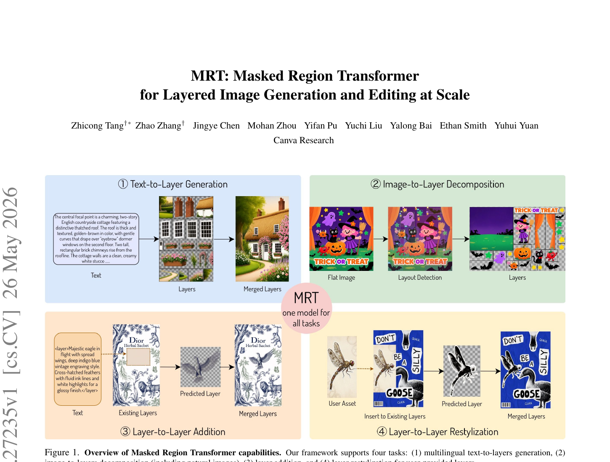
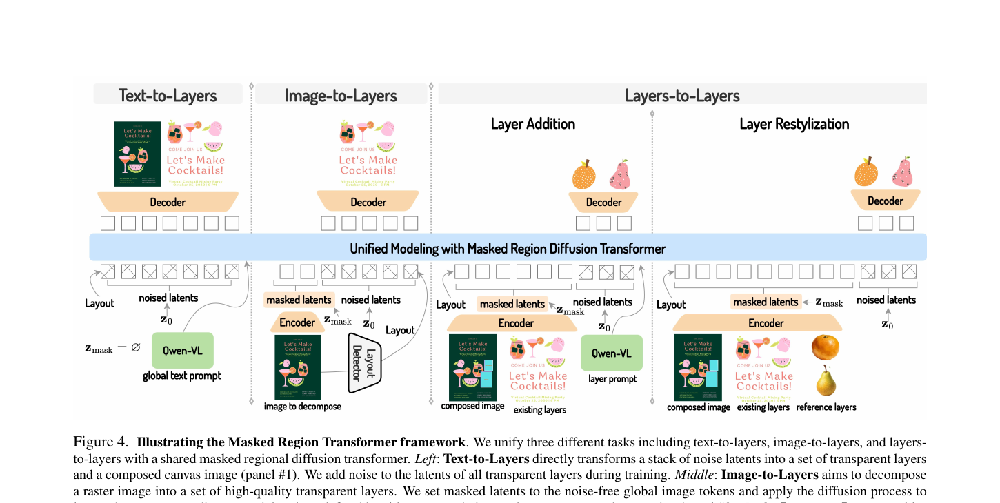
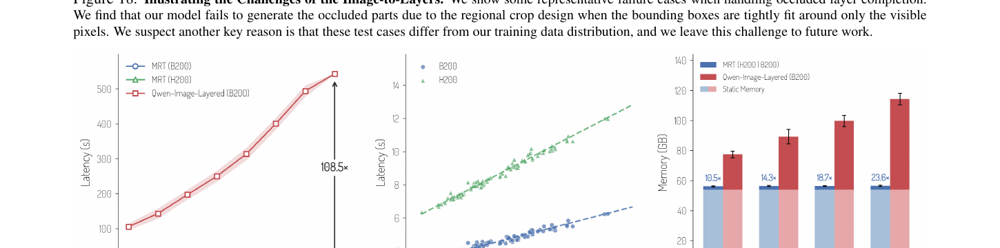
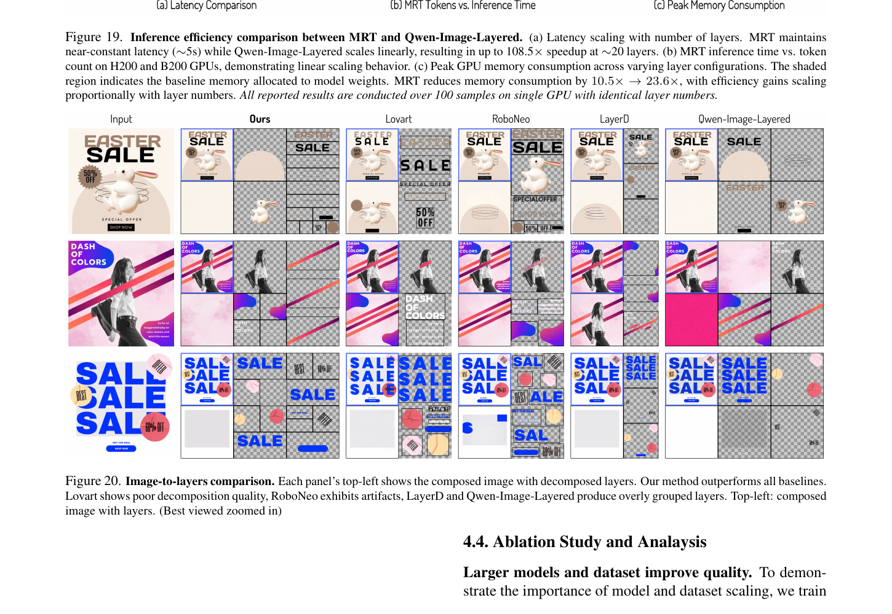
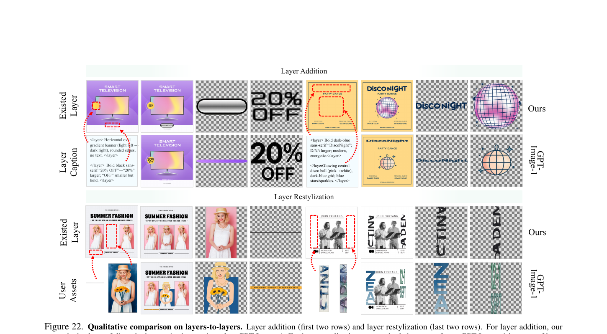
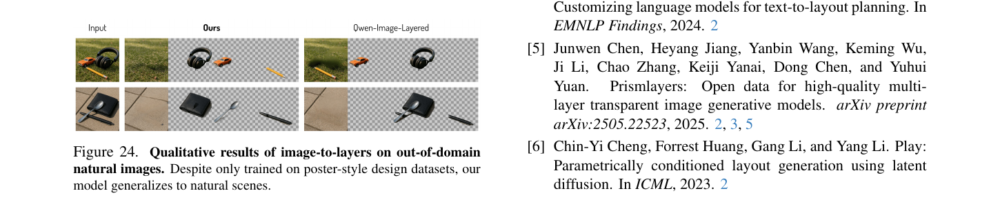

# MRT: 一个 20B masked region transformer 把分层图生成的三个任务塞进同一个模型

<figure>
  
  <figcaption>
    Fig. 1 — MRT 用<strong>同一个模型</strong>支持四种使用模式:
    <strong>① Text-to-Layer Generation</strong> (从文本生成多层 RGBA 设计),
    <strong>② Image-to-Layer Decomposition</strong> (把平面图分解成多个 RGBA 层),
    <strong>③ Layer-to-Layer Addition</strong> (给现有设计添加新元素 + 自动协调位置/风格),
    <strong>④ Layer-to-Layer Restylization</strong> (用户传一张图,自动改写成与现有设计风格一致的层)。
  </figcaption>
</figure>

## 1. 出发点 (Motivation)

文生图模型(Qwen-Image / SD3 / FLUX 这些)主要生成的是**flat raster image**——一张已经合成好的位图。问题:用户在 Canva/Figma/Photoshop 里实际需要的是**分层 PSD**——每个元素一层 RGBA,可拖动、可换色、可重排。"先生成位图,再用分割模型抠出来当成层"这条路两个硬伤:

1. 分割模型只能给可见像素,**遮挡部分**(被其他对象挡住的区域)没法补全 → 层一旦移动就露馅
2. **超出画布边界**的元素(比如 banner 一半在框外),裁剪后再也拼不回完整对象

所以这个领域近一两年有几条思路:
- **顺序生成**(LayerDiffuse / COLE):一层一层地按顺序画,慢且容易累积误差
- **同时生成**(ART [38] / PrismLayers):一次性把所有层吐出来,但 ART 只能 LoRA 微调小模型,数据规模也小(< 1M 样本)
- **同期 Qwen-Image-Layered**(2025/12):基于 Qwen-Image 全参微调,但**每层用全画布 token 数表示**(K 层 = K× token),20 层时显存爆掉

MRT 想一次性解决:
- **数据规模拉到 10M**(来自 Canva 平台的专业设计师作品,~43M unique layers,带版权)
- **不只支持生成,还支持编辑**:image→layers 分解 + layers→layers 添加/改样式
- **regional latents**(承袭 ART):每层只用自己的边界框 token,K 层 token 数 ≈ 1 层的 1-2 倍而非 K×
- **overflow-aware canvas layer**:专门画"完整 layer 含超出边界部分",编辑时元素能完整搬移
- **同一个 20B Qwen-Image backbone 全参数微调 + DMD2 蒸馏到 8 步**

一句话主张:**用大模型 + 大数据 + 单一架构 + adaptive masking,把分层生成做到 Photoshop 级别**。

## 2. 方法 (Method)

### 2.1 数据表示: regional latents + overflow canvas

把一个多层设计表示为四类内容:

$$ \{I_{\text{canvas}}, I_{\text{bg}}, \{I^{\text{fg}}_i\}_{i=1}^K\} $$

—— 翻译: 一个完整设计 = 1 张<strong>画布合成图</strong>(用于 layer coherence 监督) + 1 张<strong>半透明背景</strong> + K 张<strong>前景 RGBA 层</strong>(可以超出画布)。每张都用 WAN-2.1-VAE 独立编码成 latent。

**关键: token 数是按 region 算的**。如果第 i 层的边界框是 100×200(占画布的 10% 面积),则该层的 token 数 ≈ 全画布 token 数 × 10%。这跟 Qwen-Image-Layered "每层用全画布 token"对比,K 层时 token 总数差 K 倍。这是论文 Fig. 19 显示 100× 推理速度的根本原因。

**Overflow canvas layer**:训练数据里 60% 的层会有超出画布的部分(比如 banner 拉到画框外)。MRT 引入一个**全尺寸 canvas layer** 专门承载这些"完整层 + 超出部分",其余 layer 仍按各自 region 编码。这样每个 fg layer 都能完整保留,后续编辑时拖动不丢内容。

### 2.2 Masked Region Transformer: 用 mask 切换任务

这是 paper 最核心的设计。三个任务(text→layers / image→layers / layers→layers)**共用同一个 20B transformer**,通过控制 "哪些 token 被 mask 当作干净条件、哪些 token 加噪做 diffusion 目标" 来切换任务。

<figure>
  
  <figcaption>
    Fig. 4 — 同一个 transformer 通过 mask 模式切换三类任务。
    <strong>Text-to-Layers</strong>: 所有 layer latents 都加噪(纯生成);
    <strong>Image-to-Layers</strong>: 输入图作为<code>z_mask</code>(干净不加噪),layer latents 加噪去噪(分解);
    <strong>Layers-to-Layers Addition</strong>: 已有 layer 作为<code>z_mask</code>,新增 layer 加噪去噪(条件生成);
    <strong>Layers-to-Layers Restylization</strong>: 已有 layer + 用户上传的图作为<code>z_mask</code>,目标 layer 加噪去噪(风格迁移)。所有 mask token 和 noise token 在 transformer 内做 full attention。
  </figcaption>
</figure>

记 $z_0 = [z_{\text{composed}}; z_{\text{bg}}; z_1^{\text{fg}}; \ldots; z_K^{\text{fg}}]$ 为所有 latent token 的拼接,$\epsilon \sim \mathcal{N}(0, I)$ 为噪声。Flow matching 标准的线性插值前向:

$$ z_t = (1 - t) z_0 + t \epsilon $$

—— 翻译: 时刻 t (∈ [0, 1]) 时,latent 是干净的 $z_0$ 和纯噪声 $\epsilon$ 的线性插值。这跟 SD3 / FLUX / [[flow-opd-2026]] / [[diffusion-opd-2026]] 全是同一套 rectified flow 框架。

**Adaptive masking 的关键**: 在拼接 $z_0$ 之外,还有一组 $z_{\text{mask}}$ 是"干净条件 token,不加噪、参与 attention 但不参与 loss"。每个任务定义 $z_{\text{mask}}$ 不同:

| 任务 | $z_{\text{mask}}$(干净条件) | $z_0$(加噪去噪目标) |
|---|---|---|
| Text-to-Layers | $\emptyset$ (空) | composed + bg + 全部 K 个 fg |
| Image-to-Layers | composed(输入图) | bg + 全部 K 个 fg |
| Layer Addition | composed + bg + non-target fg | target fg subset $A \subseteq \{1...K\}$ |
| Layer Restylization | composed (含 non-target) + bg + non-target fg + 用户图 $z^{\text{cond}}_i$ | target fg subset $I$ |

训练目标始终是同一个 flow matching MSE(论文 Eq. 2):

$$ \mathcal{L}_{\text{flow}} = \mathbb{E}_{z_0, \epsilon \sim \mathcal{N}(0, I), t}\big[\|v_t - f_\theta(z_t, t, c)\|^2\big] $$

—— 翻译: 模型 $f_\theta$ 给定时刻 $t$ 的带噪 latent $z_t$、时刻 $t$ 本身、和文本条件 $c$,预测速度 $v_t = z_0 - \epsilon$(从干净指向噪声的方向)。loss 只在 $z_0$ 对应的 non-masked token 上计算。

**为什么这设计很巧妙**(我的理解):attention 是 set 操作,加什么 token 不加什么 token,**结构是一样的**。所以三个任务只需要改"input token 的组装方式"和"哪些 token 不参与 loss",权重一份就够。这本质上就是 LLM 里 prefix-LM / FIM (fill-in-the-middle) 那一套思路搬到 diffusion。

### 2.3 一些具体的实现选择

**Layer Restylization 里的小 trick** (paper §3.2 倒数第二段): 用户上传一张图想让它"长得跟现有设计风格一致",MRT 在 transformer 输入里把这张图编码后作为额外 condition token 加入,**RoPE 位置编码从对应 target layer 复制过来**——这样 condition token 和 target token 共享同一个空间位置先验,让模型知道"目标位置应该跟这个 condition 的风格对齐"。比单纯把 condition 放在 sequence 任意位置要稳。

**Layer grouping augmentation** (§3.2 末尾): 训练时随机把相邻或重叠的 layer 合并成一个,扩充 layout 多样性。原因:测试时用户用 layout detector 抠出来的边界框跟训练时的"ground-truth 干净边界框"差别可能很大,需要让模型学会处理"模糊/粗的边界框"。Table 5 ablation 显示这招在 I2L 任务上有持续提升。

**Text condition 是 nice-to-have 不是 must** (Table 4): I2L 任务给文本提示能涨 0.4 PSNR,但去掉也能跑——这跟"用 ART 那种纯文本驱动"的思路不一样。MRT 更像是"我看着这张图,加上画框告诉我每层在哪,我就能解出来"。

### 2.4 加速: DMD2 蒸馏到 8 步

50 步基线模型经过 Improved DMD (DMD2 [60, 61]) 蒸馏到 **8 步**,FID 仅从 16.02 升到 18.58(Table 6),换来 ~6× 推理加速。DMD 优化的是 KL 散度:

$$ \mathcal{L}_{\text{DMD}} = \mathbb{E}_{z_0, t}\left[\mathrm{KL}\big(f_{\theta_T}(z_{t-1}|z_t) \,\Vert\, f_{\theta_S}(z_{t-1}|z_t)\big)\right] $$

—— 翻译: 让 student 模型 $f_{\theta_S}$ 在每个 timestep 上的反向 transition 分布近似 teacher $f_{\theta_T}$。这是当前 diffusion 蒸馏的标准做法,跟 SDXL-Turbo / Hyper-SD 一脉相承。

外加 CacheDiT(跨 timestep 复用注意力 KV)和**多卡序列并行**(把长 token 序列 shard 到 4×H100),最终 1K 分辨率 20 层在 4×H100 上 ~3s、单卡 H100 ~6s。

## 3. 结论 (Key Findings)

### 3.1 vs 同期 Qwen-Image-Layered (Table 1, Fig 19, Fig 20)

<figure>
  
  <figcaption>
    Fig. 19 — <strong>(a) Latency vs 层数</strong>: Qwen-Image-Layered 随层数线性增加(20 层 ≈ 540s),MRT 几乎恒定(~5s)。20 层时<strong>108.5× 加速</strong>。
    <strong>(b) Latency vs token 数</strong>: MRT 在 H200/B200 上都呈线性 scaling,token 多时仍可控。
    <strong>(c) Peak memory</strong>: MRT 内存 ~55-60 GB(随层数缓慢上升),Qwen-Image-Layered 从 78 GB 涨到 115 GB。MRT 在 20 层时省 23.6× 显存。
  </figcaption>
</figure>

PSNR/SSIM 数字(Table 1, 我重排了一下):

| 任务 | Layers | MRT (Ours) | Qwen-Image-Layered |
|---|---:|---:|---:|
| Merged PSNR ↑ | [4, 8) | **27.34** | 25.81 |
|  | [8, 16) | **25.91** | 23.06 |
|  | [16, 32) | **25.72** | 22.18 |
| Merged SSIM ↑ | [4, 8) | **0.903** | 0.871 |
|  | [8, 16) | **0.876** | 0.832 |
|  | [16, 32) | **0.849** | 0.807 |

**关键观察**: 随层数增加,Qwen-Image-Layered 的质量下降很明显(PSNR 从 25.81 → 22.18),MRT 下降更慢(27.34 → 25.72)。这跟前面说的"regional latents 让 token 数线性 ≈ 单层而非 K×"是一致的——token 拥挤是质量下降的根因。

<figure>
  
  <figcaption>
    Fig. 20 — 三个测试样本,从左到右: 输入图 → MRT (Ours) → Lovart → RoboNeo → LayerD → Qwen-Image-Layered。
    <strong>Lovart 抠不干净</strong>(背景残留),<strong>RoboNeo 有 artifact</strong>(边界毛刺),
    <strong>LayerD / Qwen-Image-Layered 倾向于把多个元素合并成一层</strong>(粒度太粗,失去编辑灵活性)。
    MRT 的层数最多、边界最干净。
  </figcaption>
</figure>

User study(Fig 8 那张未抠的 user study chart):MRT 对 Qwen-Image-Layered 的胜率: Quality 79.5%, Integrity 68.9%, Granularity 82.6%。

### 3.2 Text-to-Layers + Layers-to-Layers (Fig 6, Fig 22)

T2L user study: MRT 在 Overall / Aesthetics / Typography / Layout 四个维度对 ART [38] 的胜率分别是 63.0% / 69.0% / 61.0% / 54.3%(剩下是 tie 或 ART win,后者占比都不到 30%)。

<figure>
  
  <figcaption>
    Fig. 22 — 两个编辑场景: <strong>Layer Addition (前两行)</strong> 给现有设计加两个新元素(banner + 文本); <strong>Layer Restylization (后两行)</strong> 用户上传一张图(model 截图 / hooded figure),MRT 把它改写成跟现有 disco-night 设计风格一致的层。
    MRT 并行生成所有目标层,GPT-Image-1 迭代逐层,前者更协调。
  </figcaption>
</figure>

### 3.3 关键消融

**模型规模 + 数据规模都重要** (§4.4): FLUX.1-dev (13B) → Qwen-Image (20B) 在同 0.5M 数据上 FID 从 17.79 降到 16.15。Qwen-Image 上数据从 0.5M 扩到 10M FID 进一步降到 15.63。**两者缺一不可**。

**Overflow 数据不损害性能** (Table 2): 加入 overflow 训练数据后,merged image 的 PSNR 从 21.81 涨到 22.75,SSIM 从 0.854 涨到 0.871。"支持完整层"和"主体合成质量"不是 trade-off。

**多任务联合训练只略微伤性能** (Table 3): T2L 单任务 FID 16.15,T2L+I2L 混训 15.68(反而更好),T2L+I2L+L2L 三任务 17.06(略掉)。论文归因于 L2L 数据本身质量问题。

**T2L 数据 60% 是 overflow layer**,这点很反直觉但合理——专业设计师确实经常画"半个 banner 在框外、扩展裁切空间"。

### 3.4 失败案例 (Fig 18, paper §4.3.3 末尾)

- 真实场景照片(非设计稿)上泛化有限——训练全是 poster-style design
- 遮挡补全:被遮挡的部分如果检测器给的边界框只框可见部分,模型无法生成完整层
- 半透明/混合复杂的图层难分解

<figure>
  
  <figcaption>
    Fig. 24 — 把只在设计图上训练的 MRT 应用到自然场景(汉堡照片、蜜蜂照片、香蕉摊照片),它仍能产生合理的层分解(虽然没在自然图上专门训练过)。这暗示 MRT 学到的不只是"识别设计稿元素",而是更普适的"识别可分离视觉对象 + 补全遮挡"。
  </figcaption>
</figure>

## 4. 实现细节 (Implementation Notes)

⚠️ **代码尚未发布**: 论文 2026/05/26 上传,本博文撰写时(2026/06/02)Canva GitHub org 没有 MRT repo,Hugging Face 上也没有 MRT 权重(只有 [Qwen/Qwen-Image-Layered](https://huggingface.co/Qwen/Qwen-Image-Layered) 这个**同期**但**不同方法**的 baseline)。所以本节没有 `repo/file.py:Lnn` 代码引用,以下都是从论文 + 同类 baseline 推断的工程细节。

- **Base 架构**: Qwen-Image (60 层 transformer, hidden_dim=3584, 24 heads/layer, ~20B params)。**Full-parameter fine-tune**(用 FSDP2)而**不是 LoRA**——这跟 ART / PrismLayers 不同,论文明说"前人 LoRA 是因为算力限制,我们想看清模型上限"。
- **Training compute**:
  - **Ablation 训练**: 0.5M 样本 × 4000 iter @ 512×512, 8×H200, batch=16/卡, lr=1e-4 AdamW。
  - **System-level**: 70k iter @ 512×512 + 20k iter @ 1024×1024 在全 10M 数据上,64×H200, batch=16/卡 × 1024 全局 batch。**渐进式分辨率**(先 512 再 1024)是关键工程优化。
- **VAE**: WAN-2.1 (视频领域的 VAE)。论文没说为什么用 WAN 而不是 Qwen-Image 自带的 VAE——推测是 WAN 的 latent 维度对多通道(RGBA)友好,且训练稳定性更好。
- **Layout detector**: I2L 任务推理时需要"输入图 + 每层 bounding box + Z-order"。论文用了一个 "z-order-aware detector"(细节在 supplementary,主文没展开)。这是 I2L 流水线的关键中间件,如果检测器抠错框,MRT 也救不回来(Fig 18 的失败案例几乎都跟检测错误有关)。
- **DMD2 蒸馏**: 50 → 8 步,8 步学生模型 FID 18.58 vs 教师 16.02。这里跟 [[diffusion-opd-2026]] 不同——后者是 on-policy distillation 把 reward 信号转移,DMD 是分布匹配蒸馏减少 NFE。两者目标完全不同。
- **CacheDiT**: 跨 timestep 复用 attention KV,paper 提到但没细写。这是 diffusion 推理优化的常见 trick(跟 DeepCache / FORA 同类)。
- **多卡并行**: 4×H100 序列并行,把长 token 序列(20 层 × 1K 分辨率 ≈ 80k token)在 4 卡间切片。
- **Paper 没说的几个 gap**:
  - VAE 是 freeze 还是一起 fine-tune? (推测 freeze)
  - Adaptive masking 的 mask 在 transformer 哪些层注入? (是按 token 还是按 attention head?)
  - 三个任务训练时的 sampling ratio 怎么调度? (Table 3 给了 80%/20%/0 和 70%/15%/15% 两种)
  - **没有任何代码证据 = 复现门槛极高**。即使有了权重也要等团队 release dataset / training code。

## 5. 批判性总结 (Critical Assessment)

### 5.1 优点

- **首个把分层生成做到 SOTA 水平 + 算力可接受**的工作。20 层 1K 分辨率 6 秒(单卡)是工业可用的延迟。
- **三任务统一 + adaptive masking** 这个 idea 很干净——本质是 LLM prefix-LM 的 diffusion 类比。Table 3 显示多任务联合训练几乎不掉性能,验证了 unified 假设的合理性。
- **Overflow layer support** 是工程而非学术 contribution,但很重要——真实编辑场景里"banner 拉出画布外"非常常见,以前的工作全 truncate 这部分,导致编辑后元素不完整。MRT 用一个 canvas layer 把这件事彻底解决。
- **Regional latents (沿用 ART)** 在大模型规模下证明了关键性。Fig 19 的 108× 加速本质上是因为 K 层 token ≈ 1 层 token 而非 K× token。这点对未来更大模型尤其重要。
- **数据规模 10M + Canva 内部 licensed**——这是别人复现不来的 moat,但论文承诺会开 dataset 子集(细节在 supplementary)。
- **失败案例分析诚实**(Fig 18 + §4.3.3 challenges): 明确说"真实自然图泛化弱,遮挡补全弱"。这种坦诚在工业 paper 里挺少见。

### 5.2 不足 / 疑点

- **代码 + 权重 + 数据全没 release**(截至 2026/06/02):这篇 paper 实际可复现性约等于零。读完只能信任 Canva 的实验数据。**如果 Canva 不开源,这篇就是一篇 "我们做出来了,你做不到" 的 paper**。
- **跟 Qwen-Image-Layered 的 head-to-head 不完全公平**:同期 release(MRT 是 5/26 论文,QIL 是 2025/12 开源),但 MRT 已经在 QIL 测试集上跑 user study 并报告完胜——这意味着 QIL 团队没机会回应或调参。论文也承认 "用户研究是 Canva 内部做的",这有利益冲突。
- **Layer-to-Layers 实际效果存疑**: Table 3 显示加入 L2L 训练后 T2L 性能掉 1.0 PSNR、SSIM 掉 0.03——paper 归因于"L2L 数据质量问题"但没量化是哪种问题。Fig 22 看起来不错但都是精选样例,缺乏 large-scale benchmark。
- **"Adaptive masking" 听起来高级,实质是 prefix-LM 在 diffusion 上的应用**。本质上没有新机制,只是把已知的 LLM 技巧搬过来。这不一定是缺点,但论文标题/摘要的 framing 略夸张("一个新框架"),实际是"一个聪明的工程整合"。
- **20B 模型的训练成本**: 64×H200 跑 90k iter,粗估 ~5000-8000 GPU-day。即使开源权重,普通学术组也微调不动——它的实用门槛是"Canva 内部 + 大公司"。
- **WAN-2.1 VAE 选型理由不充分**: Qwen-Image 原生 VAE 也能编码 RGBA(4 通道 latent),paper 没解释切换的原因。这个选择影响后续所有 work 的 reproducibility。
- **Overflow canvas 在 I2L 任务里的处理不一致**: §3.2 提到 "训练时用 ground-truth 完整层,推理时用户提供的图通常没有完整层信息——所以推理时退化到 visible-canvas latent"。这是一个 train/test distribution gap,paper 没充分讨论它的影响。
- **DMD2 蒸馏的 trade-off**: 8 步学生比 50 步教师 FID 18.58 vs 16.02——15% 的相对掉点。在 commercial 系统里这种 quality gap 用户能感知,但 paper 用"minimal degradation"轻轻带过。
- **没有跟 [[qwen-image-2-2026]] / Wan-Image 这些最新的 commercial 系统对比**: GPT-Image-1 / Lovart / RoboNeo 都比对了,但同期的 Wan-Image / DALL-E 3 / Imagen 4 没出现。

### 5.3 适用 vs 不适用

- ✅ **适用**: 想做工业级 PSD / Figma-style 设计自动化的工程团队,有 64+ H100 / H200 训练算力。论文给了一个清晰的范式 + 数据规模指引,等代码开源后是不错的起点。
- ✅ **适用**: 研究 diffusion 多任务统一的学术工作。MRT 的 adaptive masking 范式可以借鉴到 video / 3D / audio 的多任务场景。
- ❌ **不适用**: 想复现/二次开发的中小团队——代码权重数据三缺一,光看 paper 没法做。
- ❌ **不适用**: 自然场景照片编辑(SAM / Segment-Anything 那种 segmentation 任务)。MRT 是设计领域专用,自然图泛化弱。
- ⚠️ **谨慎**: 实时应用——即使 8 步 6 秒单卡,仍不够"实时"。需要进一步蒸馏到 1-2 步才行,但 paper 没尝试。

### 5.4 进一步阅读

- **直接前驱**: ART [38] (Chen 2025) — regional diffusion transformer + LoRA-only fine-tune。MRT 把 ART 的核心 idea(regional latents)放大到 20B + full fine-tune + 多任务。
- **同期对手**: [Qwen-Image-Layered](https://github.com/QwenLM/Qwen-Image-Layered) (Qwen Team 2025/12) — 基于 [[qwen-image-2-2026]] 全参微调的分层生成。MRT 主要拿这个对比。
- **数据 / 框架**: PrismLayers (Chen 2025) — 第一个开源的多层透明图数据集,虽然规模 < MRT 的 1/10。
- **蒸馏方法**: DMD2 (Yin 2024) — MRT 用的 distillation 方法。MRT 跟 DMD/DMD2 关系跟 [[diffusion-opd-2026]] 跟 OPD 关系类似(借用 LLM 蒸馏框架)。
- **同月 layered work**: LayerD (Sano 2025) — 另一个 I2L 方法,MRT 在 user study 里 win rate 95% 击败它(图整体性最弱)。
- **Base model**: Qwen-Image (Alibaba 2025) — 20B params, MIT license, MRT 的训练起点。Hugging Face: `Qwen/Qwen-Image`。
