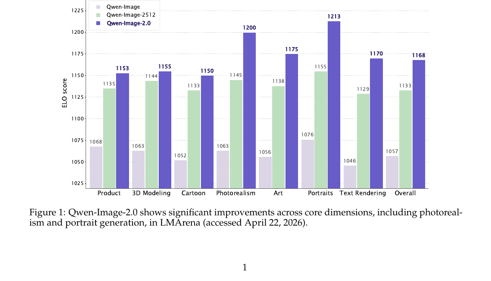
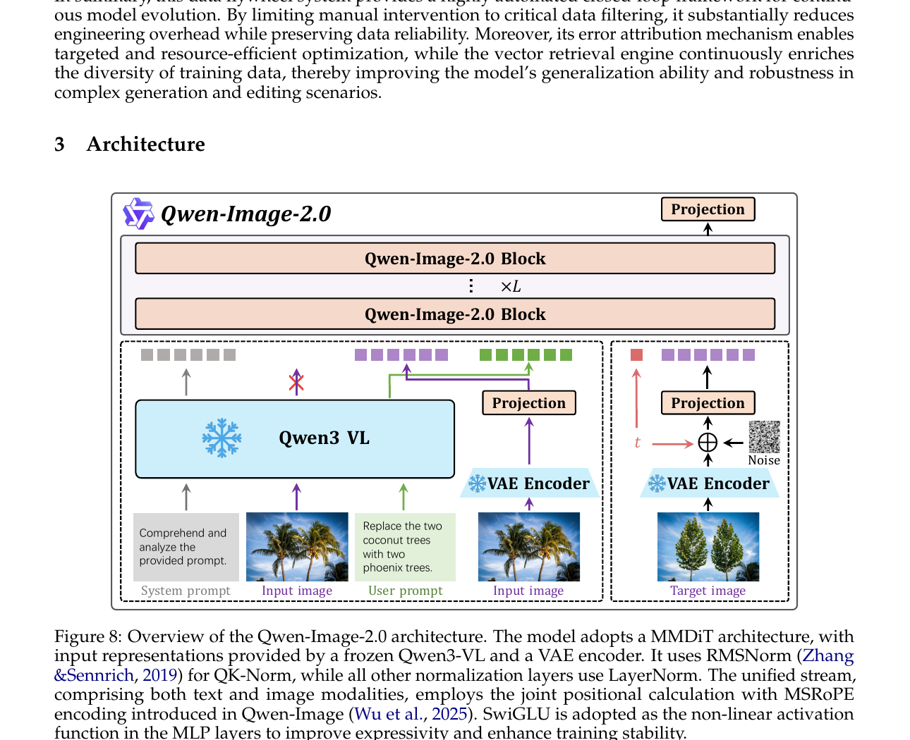
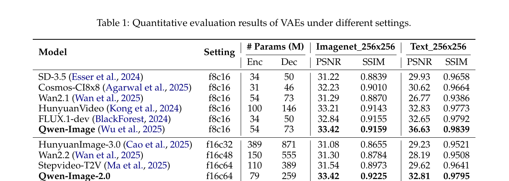
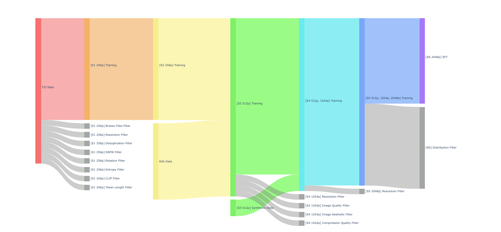
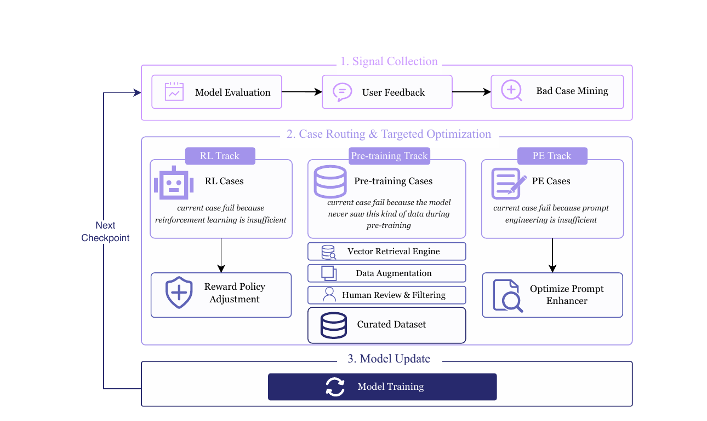
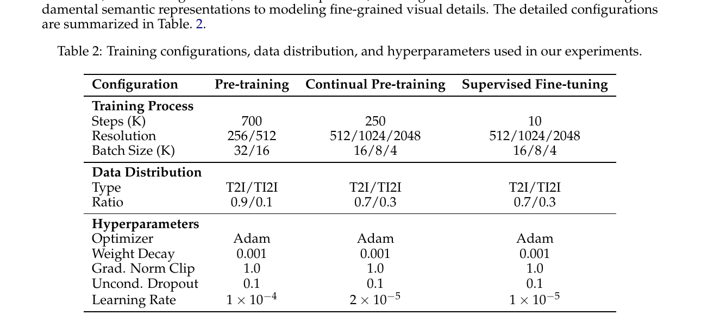
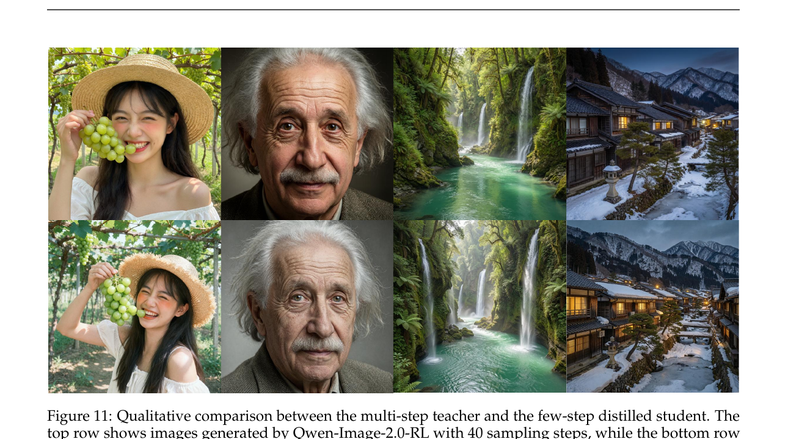

# Qwen-Image-2.0 Technical Report

## 1. 出发点 (Motivation)

2026 上半年 T2I 模型 (FLUX、Stable Diffusion 3.5、Imagen 4、HunyuanImage-3、Seedream 等) 都已经能出"好看"的图,真正的痛点转向了*"实用"*:

- **超长文本渲染:** 海报、PPT、漫画、信息图 — 1k+ token prompt 里指定的每个字、每段排版都得对。
- **多语种字形:** 中文字符复杂得多,英文之外的 Unicode 范围 (繁体、日文、阿拉伯文、表情符号) 同时支持。
- **高分辨率写实:** 2K 原生分辨率而非超分上采样;材质、光影一致。
- **复杂指令遵循:** 减少 concept omission、compositional failure、hallucinated content。
- **统一框架:** 一个模型同时做 T2I (从 prompt 生成) 和 TI2I (image editing,带参考图),不用切换 pipeline。

Qwen 团队认为这些需求被"现有 foundation model 还没全部解决",同时*同一模型同时拿下这些指标*的工作几乎没有。Qwen-Image-2.0 就是要做这条"全能"路线。

<figure>
      
      <figcaption>Fig. 1 — LMArena 上跨 8 个维度 (Product、3D Modeling、Cartoon、Photorealism、Art、Portraits、Text Rendering、Overall) 的 ELO 对比。Qwen-Image (浅紫,1057) → Qwen-Image-2512 (绿,1133) → Qwen-Image-2.0 (深紫,1168/Overall)。Photorealism +93 ELO,Art +99 ELO,Portraits +83 ELO,Text Rendering +84 ELO — 主要发力的几个老大难都被推动。</figcaption>
    </figure>

## 2. 方法 (Method)

### 核心思想 (类比)

把 T2I 生成想成一个"室内设计师 + 印刷厂"协作:

- **设计师 (Qwen3-VL):** 读懂用户的需求 (中英文 prompt + 参考图),把"我要一张冬日北京街景,左边书法店招牌写'文字渲染',右边花店招牌用鲜花拼'真实质感'..."翻译成一份*结构化设计稿* (隐空间表示)。<u>设计师本身不画</u> — 冻结的 VLM。
- **印刷厂 (MMDiT):** 拿着设计稿,在*纸张尺寸缩小 16 倍* (高压缩 VAE) 的工作台上,用一堆模板 ("denoising step") 一笔笔把图画出来,最后再放大成 2K。
- **编辑工人 (Prompt Enhancer):** 用户的 prompt 可能太抽象 ("画一只猫"),先有个 PE 模块把它扩成详细设计稿 ("一只蓝眼睛橘色虎斑猫,坐在窗台上,背景是黄昏的城市天际线..."),再交给设计师。
- **QA 飞轮 (Data Flywheel):** 用户反馈、bad case 自动路由到"是 RL 出错? 是数据不够? 还是 PE 没扩好?",对应自动修。

整套工厂还要会做*修改任务* (TI2I editing) — 你给一张猫的图,加一句"把头上戴个帽子",同一个 pipeline 把图改了。秘密:VLM 把"原图 + 编辑 prompt"一起编码成 context,VAE 编码"原图 latent"和"目标图 latent"喂给 MMDiT。

### 2.1 架构总览

<figure>
      
      <figcaption>Fig. 8 — Qwen-Image-2.0 三大组件:(1) <strong>Qwen3-VL</strong> 冻结的 MLLM,把 system prompt + input image + user prompt 编码成多模态 condition;(2) <strong>VAE Encoder</strong> (左) 把 input image 编码到潜空间 $E_x$;(3) <strong>VAE Encoder</strong> (右) 把 target image 加噪后送入扩散过程。中间 <strong>Qwen-Image-2.0 Block × L</strong> 是 MMDiT,把 condition + 噪声 latent 一起处理,projection 后输出。</figcaption>
    </figure>

三个组件:

1. **MLLM (Qwen3-VL):** condition encoder。处理 text + 参考图,输出 modality-aware 表示 $h_y$。<u>冻结的</u>,不参与训练 — 复用 Qwen3-VL 的 in-context 能力 (这条跟 D-OPSD 同思路)。
2. **VAE (f16c64,79M enc / 259M dec):** 把 input image 编码到隐空间 $E_x$,在隐空间里 diffuse,再解码回图像。Section 2.2 详细。
3. **MMDiT:** 共享 transformer backbone 同时处理 text 和 image token。Section 2.3 详细。

跟 Qwen-Image 1.0 (Wu et al. 2025) 的关键区别 — 这是一个*纯升级*论文,没改 paradigm:

- 1.0 用 f8c16 VAE (54M enc / 73M dec),2.0 用 f16c64 (79M enc / 259M dec) — 压缩率 ×2,decoder 容量 ×3.5。
- 1.0 是单一 T2I,2.0 统一 T2I + TI2I。
- 2.0 加了 PE 模块 + RLHF + DMD 蒸馏 + 数据飞轮。

### 2.2 高压缩 VAE — 这是 2.0 最大的工程胜利 (§3.1)

原生 2K 分辨率训练 = 计算成本爆炸。常见做法 $f=8$ 压缩 (8× 空间下采样 + 16 channel) 让 2K 图变成 256×256×16 的潜变量,但 256² latent 还是大。**Qwen 把压缩率推到 $f=16$、channel 推到 64**,latent 体积砍到 128² × 64 — 像素数比 f8c16 少 4×,DiT 训练 FLOPs 也省 4×。

但 $f=16$ 经典 trade-off:

- 压得太狠 → 信息瓶颈,重建掉精度。
- 提通道数补信息 → 高维 latent manifold 难 diffuse (慢收敛、生成质量差)。

论文的解法:

1. **Residual autoencoder (Chen et al. 2025):** 非参数 shortcut 把细节直接 bypass 到 decoder,缓解信息瓶颈。
2. **f16c64 而非 f16c32:** 同样的"总 channel bottleneck" (8×8×16=1024 = 16×16×64=1024) 提升重建。
3. **富文本图像 corpus:** 在内部 PDF / slide / poster 数据 + 合成文本段落上训练 VAE,英文中文都覆盖。
4. **VA-VAE 语义对齐损失 (Yao et al. 2025):** 把 latent space 跟语义表征对齐 — *关键观察:早期施加强语义对齐,后期逐步放松*,让 reconstruction 和 diffusability 取得平衡。
5. **砍掉对抗损失:** 大规模 VAE 训练里 adversarial loss 是 redundant 的 (跟 Wu et al. 2025 一致),只用 reconstruction + perceptual + semantic alignment 三项,训练更稳。

<figure>
      
      <figcaption>Tab. 1 — Qwen-Image-2.0-VAE 在 f16c64 设置下,ImageNet 256×256 PSNR <strong>33.42</strong> / SSIM <strong>0.9225</strong>,Text 256×256 PSNR 32.81 / SSIM 0.9795 — 跟 f8c16 时代的 Qwen-Image (33.42 / 0.9159) 重建质量持平,<strong>但 latent 体积少 4×</strong>。其他 f16 VAE (HunyuanImage-3 f16c32, Wan2.2 f16c48, Stepvideo-T2V f16c64) PSNR 都在 31 附近。</figcaption>
    </figure>

**这是 2.0 最有冲击力的单一改进。** "f16 VAE 重建质量跟 f8 一样好"对整个领域是个 unlock — DiT 训练成本 4×,推理成本 4×。

### 2.3 MMDiT 的几个几何细节 (§3.2)

架构沿用 MMDiT (Esser et al. 2024) 范式,text 和 image token 在共享 transformer backbone 里联合处理。Qwen-Image-2.0 的*具体几何选择*:

**多模态 token 序列构造 (Eq. 1):**

$E_x$ 来自 VAE encoder,$h_y$ 来自 Qwen3-VL — 替换掉了 Qwen3-VL 输出的视觉部分 $h_x$。这一替换是因为 MLLM 的视觉 token 是为*识别*训的,VAE latent 才适合*生成*。

**位置编码:** 用 Qwen-Image (Wu et al. 2025) 的 MSRoPE — 把 text token 和 image token 在同一套 ROPE 系数下编码,跨模态可以正确计算相对位置。

**归一化:** RMSNorm (Zhang & Sennrich, 2019) 用于 QK-norm,其他都用 LayerNorm。

**Modulation:纯乘性,不带 bias (Eq. 2)**

而不是常规的 $h' = \alpha h + \beta$。<u>没解释为什么</u>,但 Qwen team 经验上观察"乘性 modulation 在大规模 MMDiT 上更稳"。

**SwiGLU MLP (Eq. 3):**

$\sigma$ 是 SiLU,$\Phi_1, \Phi_2$ 是两个线性投影,$\otimes$ 是 element-wise product。这是 LLaMA / Qwen-LLM 的标准 FFN。论文给的动机:*"joint text-image training 容易让某些 neuron 激活值过大、premature saturation"*,SwiGLU 比 SiLU 缓解了这个问题。

### 2.4 Prompt Enhancer — 把用户随手写的 prompt 自动扩成 1k token 设计稿 (§3.3)

真实用户 prompt 跟训练数据的"详尽设计稿"之间有 distribution gap。PE 模块用 Qwen3.5-9B 初始化,把用户的"画只猫" 扩成几百到 1000 token 的详细描述。

**数据构造的妙处 — Reverse engineering:**

1. 拿一个 fine-grained 标注 $P_{\text{fine}}$。
2. 用 LLM 把它分类成 General / Portrait / Text / Complex Text 四类。
3. 从"降级策略池"$S$ 里采样一组策略 (stylistic simplification、colloquialization、删除 lighting / texture / layout 等细节)。
4. 应用这些策略产生*退化的*口语化 prompt $P_{\text{short}}$。
5. 每个降级操作的*逆*定义了"如何把短 prompt 还原成长 prompt"的 CoT — 形成 $(P_{\text{short}}, \text{CoT}, P_{\text{fine}})$ 三元组训练 PE。

PE 训练分两段:

- **SFT:** 标准 next-token prediction on $(P_{\text{short}}, \text{CoT}, P_{\text{fine}})$ 三元组。
- **RL (GRPO,Shao et al. 2024):** PE 生成候选 enhanced prompt → 喂给冻结的图像生成器 → reward = MLLM 视觉一致性 + MLLM 审美评分 + rule-based textual constraint。GRPO 优化 PE,使得它输出的 prompt 真的能改善下游生成质量。

编辑任务的 PE 反过来:用 MLLM 把长 annotation 总结成简短 editing prompt,避免不必要的 stochastic degradation。

### 2.5 数据 — 6 阶段过滤 + 闭环飞轮 (§2)

**6-stage 数据 pipeline (Fig. 6):** 从 256P T2I 逐步升到 2048P SFT,每个 stage 加新数据 + 应用新过滤器。

<figure>
      
      <figcaption>Fig. 6 — 6 阶段数据流。S1 (256P T2I pre-training) 应用 8 个过滤器 (broken files、resolution、dedup、NSFW、rotation、entropy、CLIP score、token length);S2 (256P T2I + TI2I) 加 edit data;S3 (512P) 加 synthetic data;S4 (512/1024P) 加 image quality / aesthetic / compression quality 过滤器;S5 (多分辨率到 2048P) 加 resolution 过滤器;S6 (SFT) 用更严格的 distribution 过滤器复用前面所有 operator。</figcaption>
    </figure>

**Caption schema 四种:** General / Text / Knowledge / Structured。最有意思的是 *Structured caption* — 把 relation graph、flowchart、diagram 的"实体-属性-关系"显式编码,让模型学层次关系和 topological dependency。

**数据飞轮 (Fig. 7) — 论文里最 production-oriented 的设计:**

<figure>
      
      <figcaption>Fig. 7 — 3 阶段闭环:(1) <strong>Signal Collection</strong> 自动收集 model evaluation / user feedback / bad case mining 三类信号;(2) <strong>Case Routing &amp; Targeted Optimization</strong> 根据 error attribution 把 bad case 路由到三个 track —— <em>RL track</em> (是 alignment / policy 问题 → reward policy 调整)、<em>Pre-training track</em> (是数据缺失 → vector retrieval engine 检索同类数据 → 数据增强 → 人审过滤 → 加入语料)、<em>PE track</em> (是 prompt engineering 不到位 → 优化 PE);(3) <strong>Model Update</strong> 用更新的策略+数据训新 checkpoint,回到第 1 步。</figcaption>
    </figure>

这套飞轮的卖点:**error attribution + 三 track 自动路由**。一个 bad case 不再笼统标"质量差",而是诊断"为什么差,该用什么 track 修"。人审只在数据增强后的 filtering 那一步介入 — 整个 loop 高度自动。这是*商业部署*的产物,不是 academic toy demo。

### 2.6 训练 + RLHF + 蒸馏 (§4)

**多阶段训练 (Tab 2):**

<figure>
      
      <figcaption>Tab. 2 — 三阶段训练。<em>Pre-training:</em> 700K steps,256/512 分辨率,T2I/TI2I = 9/1,lr 1e-4,batch 32K/16K (按 resolution scale)。<em>Continual pre-training:</em> 250K steps,512/1024/2048 分辨率,T2I/TI2I = 7/3,lr 2e-5。<em>SFT:</em> 仅 10K steps,512/1024/2048,T2I/TI2I = 7/3,lr 1e-5。Optimizer AdamW + weight decay 0.001 + grad norm clip 1.0 + unconditional dropout 0.1 (for CFG)。</figcaption>
    </figure>

关键比例 trick:**T2I/TI2I 比例从 9:1 调到 7:3** — pre-training 阶段以 T2I 为主建立基本生成能力,继续训练时 30% TI2I 加强编辑能力。SFT 同样 7:3。

**RLHF (§4.2):** 5 个 task-specific composite reward models:

- Aesthetic reward (T2I) — 构图、光照、材质、艺术连贯
- Image-text alignment reward (T2I) — 语义对齐,惩罚遗漏/误解/矛盾
- Portrait reward (T2I) — 解剖学合理、面部比例、身份保留、皮肤毛发纹理
- Instruction-following reward (TI2I) — 编辑指令是否被精确执行
- Visual consistency reward (TI2I) — 保持未修改区域的几何 / 拓扑 / 语义

所有 reward 校准到可比尺度,权重*训练过程中动态调整*避免过度优化某一维。

**关键 RL 设计 — CFG 混合策略:** Rollout 时用 CFG (Ho & Salimans 2022) 生成高质量样本评 reward,但*policy 优化目标里排除 unconditional branch*。这条比同期 Flow-GRPO / Flow-OPD 都精细 — 保 fidelity + 省算力。Adapted GRPO framework (Liu et al. 2026; Wang et al. 2025; Zheng et al. 2025) — 注意这跟 RL's Razor 等用的同一个 GRPO 家族。

**Few-step 蒸馏 — DMD (§4.3):** 用 *Distribution Matching Distillation* (Yin et al. 2024) 从 40-step teacher 蒸馏到 4-NFE student。DMD gradient 形式 (Eq. 4):

其中 $s_{\text{fake}}$ 是辅助 score 模型 (基于 student-generated 样本 + flow-matching 目标训练),$s_{\text{real}}$ 是冻结的 teacher diffusion score。$x_t = (1-t) x_\theta + t \xi$ 是 student 的 clean 预测和独立 Gaussian noise 的线性插值。

论文 motivation:DMD 在异构生成架构上 (SD、PixArt、各种 DiT) 都稳,所以选它而非 Consistency Models 或 trajectory-based 方法。

<figure>
      
      <figcaption>Fig. 11 — 蒸馏定性对比。上排:Qwen-Image-2.0-RL 40 步采样;下排:Qwen-Image-2.0-Distillation 4 NFE。在 portrait (爱因斯坦、亚洲女性) 和 landscape (黄昏瀑布、山谷小屋) 上,4-step student 视觉质量、语义对齐、构图连贯都跟 40-step teacher 平齐。<strong>10× 推理加速无明显质量损失。</strong></figcaption>
    </figure>

### 2.7 与代码 (no, mostly)

Qwen-Image-2.0 的**训练代码和权重都未公开**。官方 GitHub repo `QwenLM/Qwen-Image` 只有:

- `README.md`, `Qwen-Image.md`, `Qwen-Image-Edit.md`, `Qwen-Image-Edit-2509.md` — 文档
- `src/examples/demo.py`, `edit_demo.py`, `generate_w_prompt_enhance.py` — 1.0 / Edit 旧版的 diffusers 推理示例
- `assets/` — 文档图

2.0 模型只通过 Qwen Chat 商业 API 提供,HF 上的 Qwen/Qwen-Image 仍是 1.0 weights (截至 2026-05)。所以本文没法做"代码 vs 论文"的对照分析 — 全部架构 / 训练细节都依赖论文文字描述。

下面是教学性的 didactic 实现 — *不是 Qwen 代码*,只是论文 Eq. 1-3 的 PyTorch 翻译,方便对照阅读:

<p class="code-source"><em>Didactic reference — paper Eq. 1-3 (architecture geometry), NOT Qwen official code</em></p>

```python
class QwenImage2Block(nn.Module):
    """Single MMDiT block — geometry follows paper §3.2."""
    def __init__(self, dim, num_heads, ffn_mult=4):
        super().__init__()
        # RMSNorm for QK-norm (paper §3.2)
        self.q_norm = RMSNorm(dim // num_heads)
        self.k_norm = RMSNorm(dim // num_heads)
        # All other norms are LayerNorm
        self.norm_attn = nn.LayerNorm(dim)
        self.norm_ffn  = nn.LayerNorm(dim)
        # Attention: shared text+image transformer (MMDiT)
        self.attn = MMDiTAttention(dim, num_heads, use_msrope=True)
        # SwiGLU MLP (paper Eq. 3): h = Φ₁(x) ⊗ σ(Φ₂(x))
        hidden = ffn_mult * dim
        self.w1 = nn.Linear(dim, hidden, bias=False)   # Φ₁
        self.w2 = nn.Linear(dim, hidden, bias=False)   # Φ₂
        self.w3 = nn.Linear(hidden, dim, bias=False)   # output projection

    def swiglu(self, x):
        # Paper Eq. 3
        return self.w3(self.w1(x) * F.silu(self.w2(x)))

    def modulate(self, h, alpha):
        # Paper Eq. 2: h' = α·h   (NO bias β — pure multiplicative)
        return alpha * h

    def forward(self, h, alpha_attn, alpha_ffn):
        # h: concat(VAE latent, Qwen3-VL hy) — paper Eq. 1
        h = h + self.modulate(self.attn(self.norm_attn(h)), alpha_attn)
        h = h + self.modulate(self.swiglu(self.norm_ffn(h)), alpha_ffn)
        return h

def build_multimodal_sequence(input_image, input_text, qwen3_vl, vae_encoder):
    """Paper Eq. 1: h = Concat(E_x, h_y)"""
    with torch.no_grad():
        # Qwen3-VL is FROZEN — extracts modality-aware text embedding
        hy = qwen3_vl.encode_text_with_image_context(input_text, input_image)
        # Replace VLM's visual tokens with VAE latent — paper §3.2
        Ex = vae_encoder(input_image)                  # f16c64 VAE
    h = torch.cat([Ex, hy], dim=1)
    return h
```

注意几个关键点:

- **L21:** Eq. 2 的纯乘性 modulation — 没有 bias 项 $\beta$。这是 Qwen team 的非平凡选择,缺乏对照实验解释为什么。
- **L29-30:** Qwen3-VL 整个 frozen,只用其 forward,梯度不流入。
- **L32:** VLM 的视觉 token $h_x$ 被丢弃,换成 VAE latent $E_x$ — 因为前者是 recognition 用的,后者是 generation 用的。这是 D-OPSD 同一时期也观察到的设计选择。

## 3. 结论 (Key Findings)

**LMArena T2I (real user blind preference,2026-04-22 snapshot):**

- Qwen-Image-2.0 全球 #9, 中文模型 #1
- ELO 1168,超过 Nano Banana
- 跨 8 维度 ELO 涨幅 (vs 1.0):Product +85,3D Modeling +90,Cartoon +98,Photorealism +92,Art +99,Portraits +79,Text Rendering +84,Overall +76 — 全部明显改善

**VAE 重建 (Tab 1):**

- ImageNet 256²:PSNR **33.42**,SSIM **0.9225** — 跟 Qwen-Image 1.0 (f8c16) 的 33.42 / 0.9159 持平,<u>但 latent 占用 4× 少</u>
- Text 256²:PSNR 32.81,SSIM 0.9795 — 富文本场景重建仍然 SOTA 级
- 同 f16 段 (HunyuanImage-3 f16c32 / Wan2.2 f16c48 / Stepvideo-T2V f16c64) 的 PSNR 都在 31 左右,Qwen-Image-2.0 显著优于

**定性能力 (§5.2-5.3 的对比图):**

- **超长中文文本渲染 (Fig. 13):** 1k token 包含中文海报、广告语的 prompt 上,Qwen-Image-2.0 是*唯一*能做到 (a) 字符级正确 (b) 空间位置正确 (c) 物理合理 (字写在招牌上、衣服上而非"飘"在空中) 三者同时满足的;GPT-Image-2、NanoBanana Pro、Wan2.7 Pro、Seedream 5.0 Lite 都有不同程度的"乱字、漏字、位置错"。
- **多张参考图 + identity 保留 (Fig. 17):** "把第二张图的帽子戴到第一张图的猫头上,加胡萝卜和纸巾",其他模型要么改了猫的毛色,要么变了猫的姿势,要么把物体放错位置。
- **古文诗词排版 (Fig. 16):** 40 字长古诗,只有 Qwen-Image-2.0 能做到 字符正确 + 竖排右起 + 章法和谐三者兼顾。

**蒸馏 (Fig. 11):** 4-NFE DMD student 跟 40-step teacher 在 portrait / landscape / 自然场景上视觉质量几乎不可分,**10× 推理加速**。

## 4. 实现细节 (Implementation Notes)

Qwen-Image-2.0 是一个商业 production 系统,论文公开*架构 + 训练 recipe* 但<u>不开源代码 / 权重</u>。下面是从论文文字提炼的关键工程参数:

- **MLLM:** Qwen3-VL (Bai et al. 2025a),冻结,只作 condition encoder。论文没说哪个规模 (Qwen3-VL 有多个 size)。
- **VAE:** f16c64,79M encoder / 259M decoder。Residual autoencoder + semantic alignment loss + 砍 adversarial loss。
- **MMDiT 规模:** 论文完全没披露 — block 数 $L$、隐藏维度、attention head 数、总参数量都不知道。这是*商业敏感信息*缺失。
- **Prompt Enhancer:** 初始化自 Qwen3.5-9B (Team 2026),SFT + GRPO 二阶段训练。
- **训练:** Pre-training 700K steps,Continual pre-training 250K steps,SFT 10K steps。lr 1e-4 → 2e-5 → 1e-5。Adam + WD 0.001 + grad clip 1.0 + unconditional dropout 0.1 (for CFG)。
- **分辨率 schedule:** 256P → 256P + edit → 512P + synthetic → 512/1024P + 4 个 quality 过滤器 → 多分辨率 to 2048P → SFT distribution filter。
- **RLHF GPRO:** CFG 用于 rollout sampling,不用于 policy optimization (混合策略)。5 个 reward model:Aesthetic / Image-text alignment / Portrait / Instruction-following / Visual consistency。reward weight 动态调整。
- **DMD 蒸馏:** 40-step teacher → 4-NFE student。$x_t = (1-t)x_\theta + t\xi$,$t$ 从 logit-normal 分布采。Fake score 用 flow-matching 目标训练。
- **数据飞轮:** Error attribution → 3 track 自动路由 (RL / pretraining / PE)。人审只在 pretraining track 的 augmentation+filtering 阶段介入。
- **训练资源:**完全没披露。同期 Flow-OPD 用 32 H800,LeapAlign 用 16 GPU — Qwen 这个规模 + 700K + 250K + 多阶段必然是 1000+ GPU。
- **代码 vs 论文 gap:**无法对照 — 没代码 / 没权重 / 没 model card。所有细节都是论文文字描述。这是最大的可重现性短板。

## 5. 批判性总结 (Critical Assessment)

### 5.1 优点

- **f16c64 VAE 是真正的技术飞跃。** 论文 Tab 1 数字最让人服气 — 跟 f8c16 持平的重建质量,但 latent 体积 4× 少。residual autoencoder + 动态 semantic alignment + 砍 adversarial loss 这三个工程细节都有具体支撑,不是 hand-waving。对整个 T2I 领域是个 enabler — 后续大模型都可以用这套 VAE 大幅省算力。
- **"VLM 当 condition encoder 但替换其视觉 token"是清晰的解耦。** 让 Qwen3-VL 出 multimodal-aware 文本表征,但*把 VLM 的视觉 token 丢掉,换成 VAE latent*。这条 ground D-OPSD、Flow-OPD 等同期工作的设计哲学 — recognition 表征 ≠ generation 表征。
- **数据飞轮 (Fig 7) 是*产品级*系统思维。** 不是 "我们收集了 X B 张图",而是"用户提交一个失败案例,自动诊断属于 RL / 数据 / PE 哪一类,自动修"。这种 error attribution + 三 track 自动路由把"模型迭代"从手工劳动变成了可工程化的流水线。学术 paper 罕见这种 production engineering 内容。
- **Prompt Enhancer 的 reverse-engineering 数据构造很巧妙。** 不需要"找用户写短 prompt 配对长 prompt"这种数据 — 直接从长 prompt 反向降级,顺手得到一个 CoT (degradation 操作的逆),三元组训 PE。一举三得。
- **RLHF 的 CFG 混合策略很精明。** rollout 用 CFG 出高质量样本评 reward,但 policy gradient*不*通过 unconditional branch — 既保 fidelity 又省一半的 conditional forward。这条比同期 Flow-OPD/Flow-GRPO 都精细。
- **DMD 蒸馏到 4 NFE 在 portrait/landscape/natural scenes 上视觉质量持平。** 推理 10× 加速,直接服务商业部署。Few-step distillation 选 DMD 而非 trajectory-based,经验解释具体 (DMD 跨架构稳定)。
- **多语种文本渲染 + 古文章法是真实差异化。** 海外模型 (GPT-Image-2, NanoBanana Pro) 中文字符常崩,Qwen 在中文长古诗 + 复杂排版上明显领先。这块是中文模型的天然主场。

### 5.2 不足 / 疑点

- **不开源 — 最大缺陷。** 训练代码、模型权重 (2.0 版本)、训练数据都未公开。HF 上的 Qwen/Qwen-Image 仍是 1.0 weights。这意味着*所有结论都是"trust the authors"*,第三方无法复现、无法做消融、无法做安全审计。同期 D-OPSD / LeapAlign 都至少开了 LoRA 训练代码 — Qwen 这次没有。
- **MMDiT 规模完全没披露。** Block 数、hidden dim、attention head 数、参数总量、训练 GPU 数都没说。这是*商业敏感信息*但学术 paper 应该至少有 model card。读者根本不知道"这是 7B 还是 70B"。
- **评估高度依赖 LMArena ELO + qualitative comparison。** 没有 GenEval / DPG / T2I-CompBench 等标准 benchmark 数字 — 而这些恰好是同期 Flow-OPD、LeapAlign、SD3.5 这些 paper 的主战场。<u>读者无法跟其他模型 apples-to-apples 比</u>。Tab 1 只有 VAE 的 PSNR/SSIM,DiT 本体没有量化对比。
- **定性对比 (Fig 13-17) 全是 cherry-picked.** "Qwen-Image-2.0 是唯一做对的"这种 framing 在每张图都重复 — 显然只挑了 Qwen 强对手弱的 prompt。负面例子 (Qwen 失败、对手成功) 一张都没有。<u>这是 product launch 的 framing,不是科学比较</u>。
- **RL reward 设计没消融。** 5 个 reward model + 动态权重调整 + CFG 混合策略 — 任何一个组件砍掉会怎样?论文没做。
- **数据飞轮的"error attribution"机制是黑盒。** 怎么自动判断一个 bad case 属于 RL/data/PE 哪一类?Fig 7 只画了 box 没解释 attribution algorithm。这是飞轮的核心,paper 应该详细描述。
- **"无对抗损失"的 VAE 训练 claim 在大规模上没有数字支撑。** 论文说 "consistent with Wu et al. 2025" 但没单独做"有 adv loss vs 无"的消融。
- **Modulation 用纯乘性 ($h' = \alpha h$) 没解释。** 这是个非 trivial 的设计偏离 — 业界默认都是 affine modulation。Qwen 的选择可能有性能/稳定性数据支撑,但论文没给。
- **多语种支持的*边界*没标。** 文中说 "diverse languages",Fig 18 展示了多语种,但具体哪些语言被训过、哪些是 zero-shot 泛化、哪些性能差,没列。商业上很重要。
- **没有 ELO 之外的 user study。** LMArena 是公开 user blind preference,但 sample size、用户分布、prompt 选择是否对 Qwen 有偏向都不可控。配套人工评估可以加强可信度。
- **蒸馏只在 portrait/landscape/natural scenes 上对比 (Fig 11)。** 4-NFE student 在*超长文本渲染*(论文核心卖点) 上表现如何没单独评估 — text 渲染对每步质量要求特别高,蒸馏可能在这里掉得最严重。
- **"Closed-loop data flywheel" 听上去美,但其商业部署的代价是用户隐私.** "user feedback from real-world online interactions" 意味着真实用户 prompt + 生成结果都进了训练循环 — paper 没讨论数据隐私 / 同意机制 / 内容审核。

### 5.3 适用 vs 不适用

- ✅ **适用:**需要*中文超长文本渲染*、海报 / PPT / 漫画 / 信息图生成 — 这是 Qwen-Image-2.0 的核心差异化主场。
- ✅ **适用:**需要 T2I + 图像编辑统一框架 (单一商业 API) — 不必切换 pipeline。
- ✅ **适用:**商业场景能接受 Qwen Chat 闭源 API。
- ✅ **方法论上适用:**想做高分辨率 T2I 训练的团队可以借鉴 f16c64 VAE 设计 (residual + semantic alignment + 砍 adv loss) — 这是论文最 transferable 的贡献。
- ❌ **不适用:**需要 self-host 或 fine-tune 的场景 — 没权重 / 没训练代码,只能调用 API。
- ❌ **不适用:**学术研究需要量化 benchmark 对比 — 论文没给 GenEval / DPG / T2I-CompBench 数字,只能看 LMArena ELO 和 qualitative。
- ❌ **不适用:**对推理成本极敏感、能接受质量略降的场景 — 商业 API 价格不透明,自托管不可能。
- ⚠️ **谨慎:**所有 "Qwen-Image-2.0 唯一做对" 的 qualitative comparison 是 cherry-picked,实际部署前自己测一遍多样化 prompt。

### 5.4 进一步阅读

- [Qwen-Image 1.0 (Wu et al. 2025)](https://arxiv.org/abs/2508.02324):2.0 的前身,MSRoPE / VAE 设计的根源。
- [MMDiT / Stable Diffusion 3 (Esser et al. 2024)](https://arxiv.org/abs/2403.03206):多模态 DiT 范式的原始来源。
- [VA-VAE (Yao et al. 2025)](https://arxiv.org/abs/2412.06752):Qwen-Image-2.0 用的 VAE 语义对齐损失出处。
- [GRPO (Shao et al. 2024)](https://arxiv.org/abs/2402.03300):Qwen RLHF 的算法基础。
- [DMD (Yin et al. 2024)](https://arxiv.org/abs/2311.18828):few-step 蒸馏方法。
- [D-OPSD (Jiang et al. 2026)](https://arxiv.org/abs/2605.05204):同期 paper,VLM-encoder 继承 in-context 能力的另一例 (用 Z-Image-Turbo),论证了"现代 T2I 用 LLM/VLM 当 encoder 是范式收敛"。
- [Flow-OPD (Fang et al. 2026)](https://arxiv.org/abs/2605.08063):Flow Matching 多 reward RL 对齐,跟 Qwen-Image-2.0 的 RLHF 思路对比。
- [LeapAlign (Liang et al. 2026)](https://arxiv.org/abs/2604.15311):Flow Matching 模型上 reward 直接梯度的 leap-trajectory 方法,可以对照 Qwen 的 GRPO 路线。

<footer>
    <hr/>
    <p class="meta">Read on 2026-05-12 · Generated with the <code>reading-papers</code> skill</p>
  </footer>
