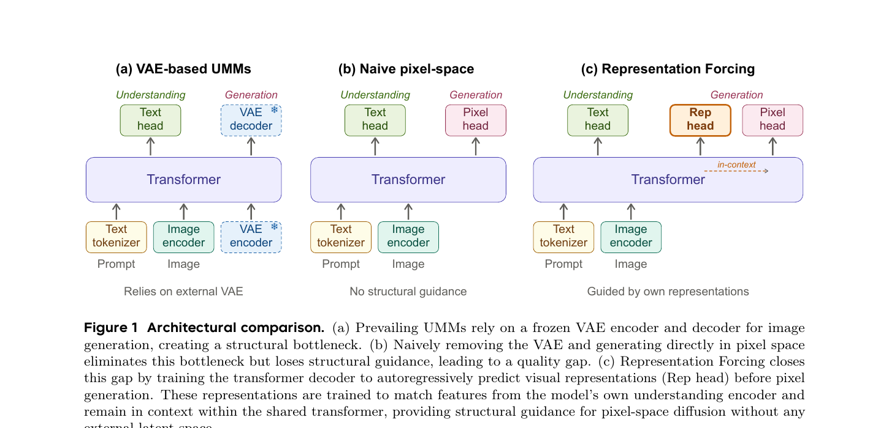
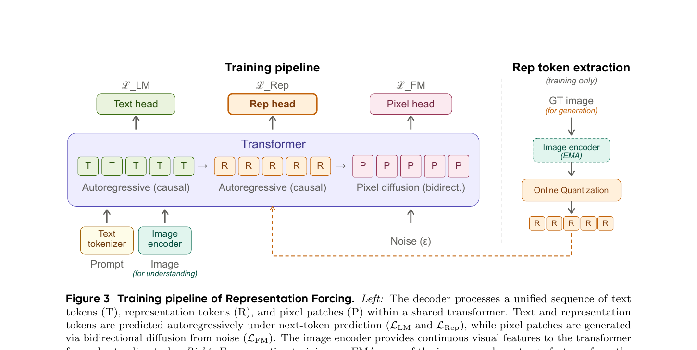
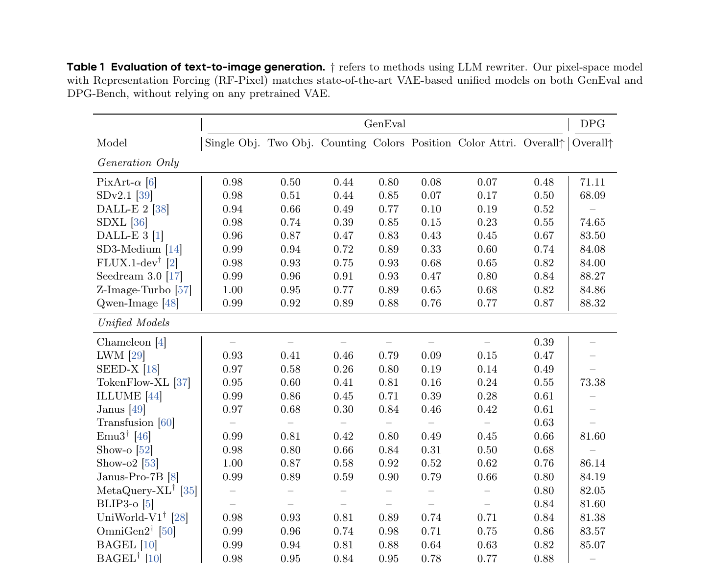
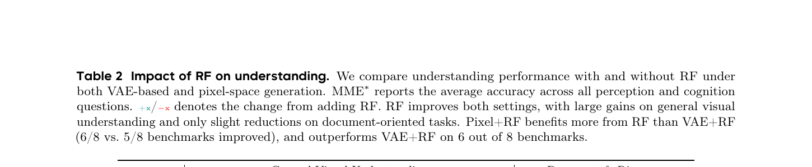
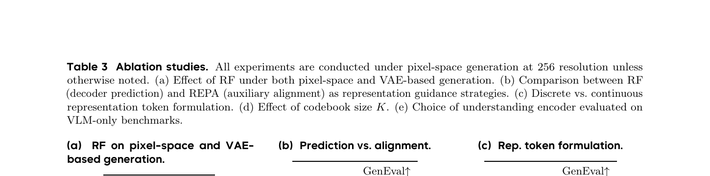
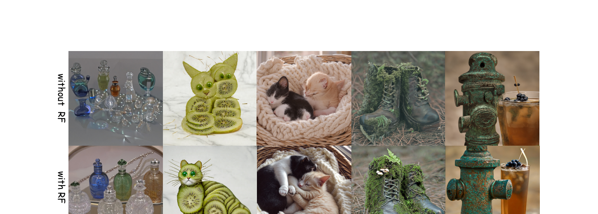

# Representation Forcing: 让 UMM 自己长出 VAE 替代品

<figure>
  
  <figcaption>
    Fig. 2 — RF-Pixel 在 1024×1024 分辨率下的文生图样本(没有 VAE)。注意人脸、毛皮、织物等高频纹理保真度——这是 pixel-space 路线相比 VAE-based 的标志性优势(VAE 的 8× 下采样会糊掉这些)。
  </figcaption>
</figure>

## 1. 出发点 (Motivation)

Unified Multimodal Models (UMMs) 想用**同一个 transformer** 处理 (a) 图像理解("describe this image"),(b) 图像生成("draw me a cat")。现状是这条路被一个不起眼的 component 卡住了——**frozen VAE**。

主流的 UMM 架构(BAGEL / Janus / Show-o / Transfusion / JanusFlow)都长这样:

- 图像理解:image → understanding encoder (SigLIP / DINO) → transformer → text head
- 图像生成:text → transformer → diffusion in **frozen VAE latent** → VAE decoder → pixel

VAE 在这个 pipeline 里有两个根本问题:

1. **它是 separately pretrained 的**,目标是"latent → pixel 的重建无损",**不是** UMM 的 understanding+generation 联合目标。
2. **它的 latent space 有损压缩**(SD3 VAE 是 8× 下采样 + 16 通道),意味着生成质量有一个**模型再怎么训也突破不了的上限**。

那能不能直接 pixel-space 生成,把 VAE 拿掉?最近确实有这条路的工作([[latent-to-pixel-2026]] L2P / JiT / PixNerd / PixelFlow / SimpleDiffusion v2 等),但 paper 实验发现:**在 UMM 这个 broader distribution + richer text conditioning 的场景下,naive pixel-space 直接掉链子**——GenEval 从 VAE 的 0.52 跌到 0.25(Table 3a)。失败模式 Fig 4 上半行可见:扭曲的物体形状 + 不连贯的构图。

诊断:**模型同时学"高层语义结构"和"低层像素细节"两件事太难了**, 它需要一个 intermediate representation 把这两层分开。VAE 实际上就在扮演这个角色——只不过是 separately 训的、固定的。

Paper 的主张:**让 UMM 自己长出这个 intermediate representation, 而不是借外部 VAE**。Representation Forcing (RF) 的关键观察:

> UMM 已经有一个 understanding encoder 在那儿(给图像理解用),它产生的 features 已经包含 object identity、spatial layout、scene composition 这些高层结构。**为什么不直接复用呢?**

具体做法:让 decoder 在生成 pixel 之前,**先 autoregressive 地生成一串 "representation tokens"**(这些 tokens 是 understanding encoder 输出特征的量化版本),然后 pixel diffusion 在 **同一个 backbone** 内通过 in-context 看到这些 rep tokens 做条件生成。

<figure>
  
  <figcaption>
    Fig. 1 — 三种 UMM 架构对比。
    <strong>(a) VAE-based UMM (主流)</strong>: 依赖 frozen VAE encoder/decoder,structural bottleneck;
    <strong>(b) Naive pixel-space</strong>: 拿掉 VAE 但没有任何结构指引, 质量塌方;
    <strong>(c) Representation Forcing (本文)</strong>: 在 text head 和 pixel head 之间插一个 <strong>Rep head</strong>, decoder 先 AR 预测 rep tokens, 这些 tokens 留在 in-context 喂给 pixel diffusion——所有都在同一个 transformer 里,完全 end-to-end,无外部 VAE。
  </figcaption>
</figure>

## 2. 方法 (Method)

### 2.1 Representation token 怎么来:online vector quantization 在 understanding encoder 上

UMM 已有一个 understanding encoder(本文用 **DINOv3 ViT-H+/16**, jointly trained),它把图像编成连续 features。但 decoder 要在 text 之后**自回归地预测**这些 features,**连续值不适合 AR cross-entropy**——所以要离散化成 token。

具体流程(§3.1):

1. 维护一个 **EMA copy 的 encoder**(慢更新),用它对 GT image 抽特征(只在训练时用)。
2. 准备一个 **K=16384** 的可学习 prototype 码本 $\{e_k\}$。
3. 对 EMA encoder 的 last-layer patch feature(pre-norm)$f_p$,跟所有 prototype 算 cosine similarity, 取 argmax → 离散 token index。
4. 码本通过 **SwAV-style momentum update** 更新, 配 **Sinkhorn-Knopp balancing** 防 codebook collapse。

这一步的关键不是"我们发明了什么新 quantization", 而是 quantizer **不是 separately pretrained**——它和整个 UMM **一起从头训**(以 EMA + Sinkhorn 维持稳定)。这点很重要, 后面 §5 会说为什么。

### 2.2 训练:三个 head 三个 loss, 一根 sequence

<figure>
  
  <figcaption>
    Fig. 3 — Training pipeline。
    <strong>Left</strong>: 一根 sequence 同时包含 Text token (T) + Rep token (R) + Pixel patch (P)。T 和 R 走 causal autoregressive (跟 LLM 一样, 一次预测一个), P 走 bidirectional diffusion (一次denoise 整张图)。三个 head 各自算自己的 loss。
    <strong>Right</strong>: 训练时 R 的 GT 来自 EMA encoder 编码 GT image, 再 online quantization 量化成离散 token。<strong>推理时整个 Right panel 都被绕过</strong>——decoder 自己从 text prompt 生成 R, 再 condition 在 R 上做 pixel diffusion。
  </figcaption>
</figure>

Sequence 结构:`[text tokens, representation tokens, pixel patches]`

- **Text tokens**: standard autoregressive next-token, causal attention,loss = $\mathcal{L}_{LM}$ (cross-entropy)
- **Representation tokens**: 也是 autoregressive next-token,causal attention,loss = $\mathcal{L}_{Rep}$ (cross-entropy)
- **Pixel patches**: bidirectional attention 内部 + causal 看前面的 text+rep,做 flow matching,loss = $\mathcal{L}_{FM}$

**Flow matching 用 x-prediction + velocity loss** (沿用 JiT [27]):

$$ z_t = t \cdot x + (1-t) \cdot \epsilon $$

—— 翻译: 时刻 $t \in [0, 1]$ 时,带噪 patch $z_t$ = 干净 patch $x$ 和噪声 $\epsilon$ 的线性插值。当 t=0 时 $z_t = \epsilon$ (纯噪声),当 t=1 时 $z_t = x$ (干净)。

模型预测 $x_\theta$,velocity 重参 $v_\theta = (x_\theta - z_t)/(1-t)$, GT velocity $v = x - \epsilon$, loss:

$$ \mathcal{L}_{FM} = \mathbb{E}\big[\|v_\theta - v\|^2\big] $$

总训练目标:

$$ \mathcal{L} = \mathcal{L}_{LM} + \mathcal{L}_{FM} + \mathcal{L}_{Rep} $$

**Classifier-free guidance**: 训练时以 0.1 的概率分别 drop 文本条件和 rep token 序列。推理时两个 condition 都做 CFG。

### 2.3 关键点:rep token 怎么 condition pixel patch?

这是 paper 最干净也最容易被忽略的设计——**没有 cross-attention, 没有 adapter 模块**, 就是 **shared self-attention**。

Sequence 里 pixel patch (P) 的 attention 模式:
- 对其他 P:bidirectional (整张图一起 denoise)
- 对前面所有 T 和 R:causal (能看到, 但 T/R 看不到 P)

所以 rep tokens 通过普通 self-attention 流入 pixel generation。**没有任何额外注入机制**——纯粹靠 sequence 结构 + attention mask。

### 2.4 架构:MoT (BAGEL 的 mixture-of-transformers)

承袭 [BAGEL] 的设计——所有 token 共享 self-attention,但 routed 到 **modality-specific FFN expert**:

- Expert 1: multimodal understanding (输入是 T 或 input image 的 patch)
- Expert 2: representation token prediction (R 位置走这个)
- Expert 3: pixel generation (P 位置走这个)

模型初始化:**Qwen3-A3B** (Qwen3 的 MoE 版, 3B active params per token)。Image encoder:**DINOv3 ViT-H+/16** + **NaViT** 风格 variable-resolution。Pooling factor:**2×2** (每 4 个 pixel patch 对应 1 个 rep token,空间布局对齐)。

### 2.5 训练分三阶段

按 BAGEL 配方:

| Stage | iters | resolution | what's trained |
|---|---|---|---|
| (i) Alignment | 10K | ≤256 | 只训 MLP connector, backbone + encoder 冻结 |
| (ii) Joint pre-train | 50K | ≤256 | 全部解冻, text + text-image pairs 联合 |
| (iii) Continued | 20K | ≤1024 | 拉分辨率到 1024,fine-tune |

数据:跟 BAGEL 同一个 pipeline——纯文本 + 大规模图文对(VQA、文档、空间推理 + T2I 生成)。

### 2.6 推理:两阶段,先 AR rep, 再 diffusion pixel

**Stage 1 (AR)**: 给文本 prompt → decoder 一个一个 token 地生成 representation token, 直到生成完整的 rep sequence。

**Stage 2 (Diffusion)**: 把生成好的 text + rep 全部留在 sequence 里, 加一段 noise pixel patch, 跑标准的 flow matching 迭代去噪 (~25-50 step), 生成最终图像。

**EMA encoder 和 quantizer 在推理时完全不用**——它们只是训练期间提供 rep token GT 的 helper。推理时 decoder 是自给自足的。

## 3. 结论 (Key Findings)

### 3.1 生成:匹配 VAE-based SOTA UMM

<figure>
  
  <figcaption>
    Table 1 — RF-Pixel 在 GenEval (compositional) 和 DPG-Bench (dense prompt) 上跟 SOTA 比。<strong>关键比较</strong>(不带 LLM rewriter): RF-Pixel <strong>0.84</strong> vs BAGEL (同 backbone, VAE-based) <strong>0.82</strong>,vs Janus-Pro-7B 0.80,vs BLIP3-o 0.84(打平)。带 rewriter † 时 RF-Pixel 到 <strong>0.88</strong>, 跟 BAGEL† 0.88 持平。DPG-Bench 84.15 跟 BAGEL 85.07 接近。
  </figcaption>
</figure>

**核心信息**: RF-Pixel 是**第一个不依赖任何 pretrained VAE 的 unified 多模态生成模型**(BAGEL/Janus/Show-o/BLIP3-o 全都用 VAE 或 VQVAE), 且性能匹配 VAE-based 同行。

### 3.2 理解:Pixel+RF 比 VAE+RF 更好

<figure>
  
  <figcaption>
    Table 2 — 同一个 architecture / data 下, 比较四种变体的理解性能。
    <strong>关键观察</strong>: (i) RF 对两种 generation pathway 都涨 (VAE+RF 5/8 win,Pixel+RF 6/8 win); (ii) <strong>Pixel+RF 在 6/8 benchmark 上压过 VAE+RF</strong>——MMMU 54.2 vs 49.6, BLINK 53.0 vs 52.9, MME* 80.2 vs 79.3。
    Pixel+RF vs Pixel: MMMU +4.3, MME +3.6, BLINK +3.6, AI2D +4.5, RealWorldQA +2.7。
    <strong>但</strong> DocVQA / ChartQA 这种需要精细文字识别的任务上 Pixel+RF 反而略掉(-2.0 / -0.4)——rep token 编码的是 high-level structure, 不擅长 fine-grained text。
  </figcaption>
</figure>

**意外发现**:去掉 VAE 不仅没伤理解, 反而**帮助**理解性能。Paper 解释: VAE 把 understanding 和 generation 强行分到两个 representation space 上, 互相对齐不上;Pixel-space + RF 让两者共享同一个 representation space(rep tokens 来自 understanding encoder), 互相 reinforce。这点支持论文的核心论断"bottleneck-free 不只是生成的事,也是理解的事"。

### 3.3 最有意思的消融:RF vs REPA (Table 3b)

<figure>
  
  <figcaption>
    Table 3 — 关键消融。
    <strong>(a)</strong> RF 对 pixel-space 是 critical: <strong>0.25 → 0.76</strong> (3×); 对 VAE-space 也帮: 0.52 → 0.77。
    <strong>(b)</strong> 同样用 DINOv3 当 rep 源: <strong>REPA</strong> (auxiliary alignment loss) 只到 <strong>0.43</strong>, <strong>RF</strong> (in-context 放进 sequence) 到 <strong>0.76</strong>。
    <strong>(c)</strong> Discrete (cross-entropy) <strong>0.76</strong> vs Continuous (regression) <strong>0.26</strong>——连续目标完全失败。
    <strong>(d)</strong> K=16384 vs 32768: 0.76 vs 0.77, 不敏感。
    <strong>(e)</strong> DINOv3 比 SigLIP2 在 4/5 理解 benchmark 上更好(DINOv3 自监督, 编码更多空间结构)。
  </figcaption>
</figure>

**(b) RF vs REPA 这条最值得讲**: REPA [55] 是个 sibling idea——也是用 frozen DINO features 当生成的"语义指引", 但它的做法是 **加一个 auxiliary loss 让 diffusion 中间层 features 对齐 DINO features**(feature alignment), DINO features 本身**不进 sequence、不参与推理**。

RF 的不同:把 representations **直接作为 token 放进 sequence**, 让 pixel patch **通过 attention 显式看到它们做 conditioning**。同样的 rep 源, 同样的训练 budget,**0.43 vs 0.76**——结构性差距来自"in-context > implicit alignment"。

**(c) Discrete vs Continuous 也很关键**: 把 rep token 改成连续向量 + AR regression (diffusion head at each rep position), GenEval 只到 0.26——基本等于没 RF。两个原因:
- 连续 AR 误差累积(早期一个小偏差,后面层层放大)
- 离散化天然 "丢掉细节、留下结构", 正是 RF 想要的 factorization——连续目标保留了太多 low-level 信息, 反而破坏分工

### 3.4 定性:RF 把"垮掉的 pixel-space" 救活

<figure>
  
  <figcaption>
    Fig. 4 — 同一组 prompt 下, <strong>without RF (上)</strong> vs <strong>with RF (下)</strong>。上排能看到 distorted 物体形状(那只"猫"几乎是个色块)、不连贯构图;下排明显恢复出物体身份和空间关系。视觉验证 Table 3(a) 的数字。
  </figcaption>
</figure>

## 4. 实现细节 (Implementation Notes)

⚠️ **代码尚未发布**: 论文 2026/05/29 上线, 截至本文撰写时(2026/06/03), 没有 GitHub repo、没有 HuggingFace 权重。PDF 引用里唯一的 GitHub URL 是 `github.com/black-forest-labs/flux`(只是比较对象, 不是 RF 代码)。所以本节没有 `repo/file.py:Lnn` 引用, 全部是论文条款 + 跨论文交叉确认。

- **Init from Qwen3-A3B**: A3B 是 Qwen3 系列的 MoE 模型, 3B activate / per-token, 全模型大约 30B+。Paper 没明确给总参数, 但跟 BAGEL 一致(BAGEL 也用 MoT + similar scale)。
- **Image encoder**: DINOv3 ViT-H+/16, **不是 frozen**——和整个模型 end-to-end 联合训。论文专门说这点是跟 [42, 59] (RAE-style "frozen DINO 当 latent") 的关键差别——RAE 还是 frozen, RF 是 jointly trained。
- **NaViT variable resolution**: 训练时按 per-stage max resolution 动态 sample 图像尺寸 + packing。这是 BAGEL/Pix2Struct 等同类工作的标准做法, 不是 RF 创新。
- **Patch & pooling**: 16×16 pixel patch (跟 ViT 标准一致); rep token 用 2×2 pooling →每 4 个 pixel patch 对应 1 个 rep token。所以 1024×1024 图 → 64×64 = 4096 pixel patches → 32×32 = 1024 rep tokens。**rep token 序列比 pixel 序列短 4 倍**。
- **EMA encoder + Sinkhorn balancing 的细节**: 论文没给 EMA decay rate 或 Sinkhorn 迭代步数。复现时这些是 vector quantization 训练稳定性的关键 knob, 没有数值会很难调。
- **Loss 三项是否等权**: Eq. 3 把三项简单相加, 没有权重系数。但 $\mathcal{L}_{LM}$ 和 $\mathcal{L}_{Rep}$ 是 cross-entropy (per-token scale O(0.1-10)),$\mathcal{L}_{FM}$ 是 MSE (scale 完全不同)。**没看到论文讨论权重平衡或 gradient norm**——是个 reproducibility 隐患。
- **CFG drop probability 0.1 是 text + rep 独立 drop**: 这意味着训练时存在 (a) 两者都有, (b) 只 drop text, (c) 只 drop rep, (d) 都 drop 四种情况。推理时两个条件都做 CFG (论文没说权重)。
- **三阶段训练总 iter 80K**: 这是相对短的 budget(对比 BAGEL 主版本几百 K iter)。论文明说是"computational constraints"下的小规模复现 + 控制变量, 不是 production-scale 训练。Table 1 跟 BAGEL 同行的比较其实是 "same compute" 比较, 不是 BAGEL full scale。
- **`paper.code_url` / weights**: 目前都没有。Project page 只有论文链接和样张, 无 code / model / demo。

## 5. 批判性总结 (Critical Assessment)

### 5.1 优点

- **问题 framing 极清晰**: "UMM 用 frozen VAE 是 bottleneck"——这个观察其实大家都知道, 但 RF 是第一篇**给出可行替代方案 + 数据匹配**的工作。Fig 1 三柱图 (a)(b)(c) 是教学级 framing。
- **RF vs REPA 的对比 (Table 3b)** 是 paper 最有教育意义的发现。同样用 DINO features, 同样的训练 budget,**架构选择**(in-context conditioning vs auxiliary alignment) 决定了 0.43 → 0.76 的 gap。这给后续工作一个很硬的指导:**让 representations 真正进入生成 sequence, 而不是隔靴搔痒地做 feature similarity**。
- **意外发现:Pixel+RF 比 VAE+RF 理解更好** (Table 2)。这反直觉但合理——VAE 强行把 understanding 和 generation 分到两个表示空间, 互相对不齐; RF 让两者共享 representation space (都来自 DINOv3 encoder), 互相 reinforce。这是 unified model 路线的关键论据之一。
- **架构简洁**: 不引入任何新模块——就是在 sequence 里多塞一类 token, 让 attention 自己处理。MoT expert routing 是借用的(BAGEL), discrete VQ 是借用的(SwAV/VQ-VAE), DINO 是借用的——RF 的真正贡献是"**怎么把这些已知组件拼在一起去掉 VAE**"。
- **Quantization 是 online / co-trained 的**, 而不是借用外部 VQ-VAE/VQGAN。这避免了"换一个外部 tokenizer 就要重新对齐"的工程问题, 也是论文哲学(end-to-end native)的一致体现。

### 5.2 不足 / 疑点

- **没有 code/weights/demo release**(截至 2026/06/03)。Project page 只放论文和样张。**对一个有"反传统"主张的论文, 这严重影响信服力**——读者只能信任 Canva 内部跑出的 Table 1 数字。
- **小规模训练 budget**: 三阶段 80K iter, 跟 BAGEL 主版本动辄几百 K iter 不在一个量级。Paper 自己在 Limitations 里也说"computational constraints"下用 pretrained LLM init 而非从零。**RF 能不能在 large-scale (Qwen-Image / GPT-4o 级别) 还成立, 是 open question**。
- **跟 [[mrt-2026]] / [[latent-to-pixel-2026]] 没有对比**: MRT 也是 pixel-space + Qwen-Image 20B backbone(用大 patch + regional latents 而非 RF 的 rep token), L2P 是 latent-to-pixel transfer。三者解决"如何 pixel-space 不掉质量"的角度完全不同, 但 RF 论文里完全没引用——可能是同期工作来不及, 但读者会困惑这条 RF 跟其他 pixel-space 方法的相对位置。
- **Rep tokens 的 codebook 在 inference 时是 black box**: 训练时码本 K=16384 个 prototype 是怎么"语义化"的?paper 没做 codebook visualization。如果某个 codeword 对应"猫的轮廓", 这是可解释的; 如果是混杂的, 那 RF 就是个 black-box trick。**期待后续工作做 codebook interpretation**。
- **Loss 权重缺失**: Eq. 3 把 $\mathcal{L}_{LM} + \mathcal{L}_{Rep} + \mathcal{L}_{FM}$ 简单相加, 但三者 scale 不同。这通常需要权重平衡 / GradNorm / multi-task balancing。Paper 不讨论, 复现风险高。
- **DocVQA / ChartQA 退化** (Table 2): Pixel+RF 在这两个"需要精细文字 + 布局"的 benchmark 上分别掉 -2.0 / -0.4。论文归因为"rep token 是 high-level structure 不擅长 fine-grained text", 但实际意味着 **RF 当前形态不适合 OCR/文档场景**——这是真实的能力局限。
- **RF 的离散化是有损的**: §4.4 (c) 说连续 regression 失败是因为"早期 AR 误差累积 + 保留过多 low-level info"。但离散化 K=16384 同时也丢掉了细节——所以 RF 仍然有 representation 损失, 只是被 attention + diffusion 弥补回来了。**这是个 trade-off, 不是 free lunch**。
- **MoT 三 expert** 比单一 dense 更复杂工程, paper 没给 expert capacity / routing 实现细节。复现时可能踩坑。

### 5.3 适用 vs 不适用

- ✅ **适用**: 想做 unified multimodal model + 想去掉 frozen VAE 依赖的研究 / 工业团队。RF 给了一个验证过的 recipe。
- ✅ **适用**: 理解 "representation conditioning" 在生成中的作用——RF vs REPA (Table 3b) 是该领域的经典对照实验。
- ❌ **不适用**: 想要立刻复现的小团队——code 没开, EMA / Sinkhorn / loss weight / MoT routing 等关键细节缺失, 自己摸需要很大代价。
- ❌ **不适用**: 文档理解 / OCR 重型场景——Pixel+RF 在 DocVQA/ChartQA 上掉点(Table 2)。
- ⚠️ **谨慎**: 高分辨率 inference 时, AR 生成 1024 个 rep token 然后再 25-50 步 diffusion——延迟应该不低, 论文没报具体 inference time 数字。

### 5.4 进一步阅读

- **同期 pixel-space 工作**:
  - [[latent-to-pixel-2026]] (L2P) — 把 frozen LDM 整体迁移到 pixel space, 通过"大 patch + Detailer Head"代替 VAE。跟 RF 是不同思路(L2P 不依赖 understanding encoder)
  - [[mrt-2026]] (Canva MRT) — pixel-space + 20B Qwen-Image + regional latents, 用 RoPE 把 layout 信息编进 token 位置。跟 RF 的"用 rep token 当中介"哲学上互补
  - JiT [27] (Li & He 2025) — paper 在 pixel head 上沿用了 JiT 的 x-prediction + velocity loss
  - PixNerd / PixelFlow / SiD2 — standalone pixel diffusion 系列
- **REPA**: 直接前辈, 同样的 DINO source 但用 auxiliary alignment, RF 比它涨 +0.33
- **RAE** [42] (Tong et al. 2026): 把 VAE 整个换成 frozen DINO/SigLIP, 但仍是 frozen——RF 的 "jointly trained" 是关键差别
- **BAGEL** [10] (ByteDance Seed, 2025): RF 直接继承的架构 (MoT + 三 expert), 是 RF 的 VAE-based baseline
- **DINOv3** [40]: rep 源的来源, jointly trained 的 vision backbone
- **SwAV** [3]: online VQ 的 momentum update 借用对象
