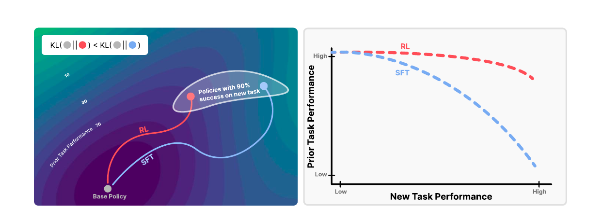
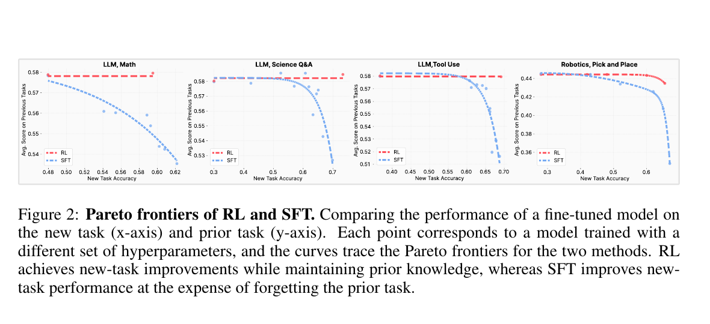
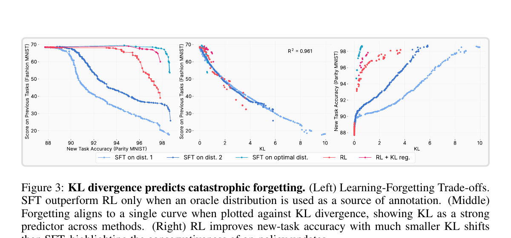
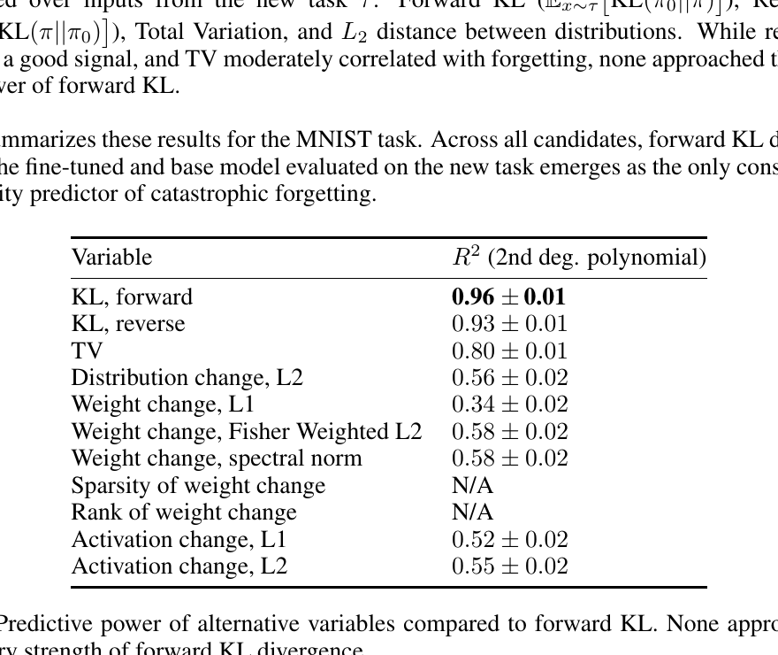
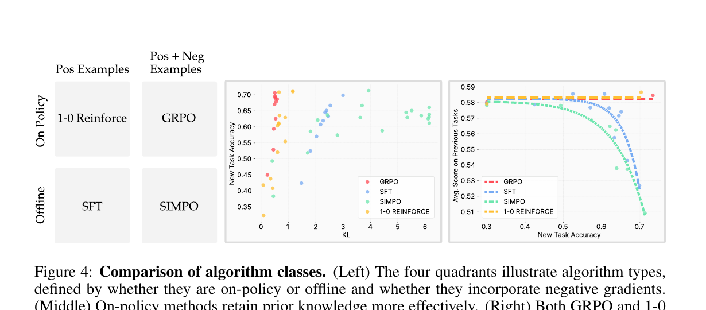
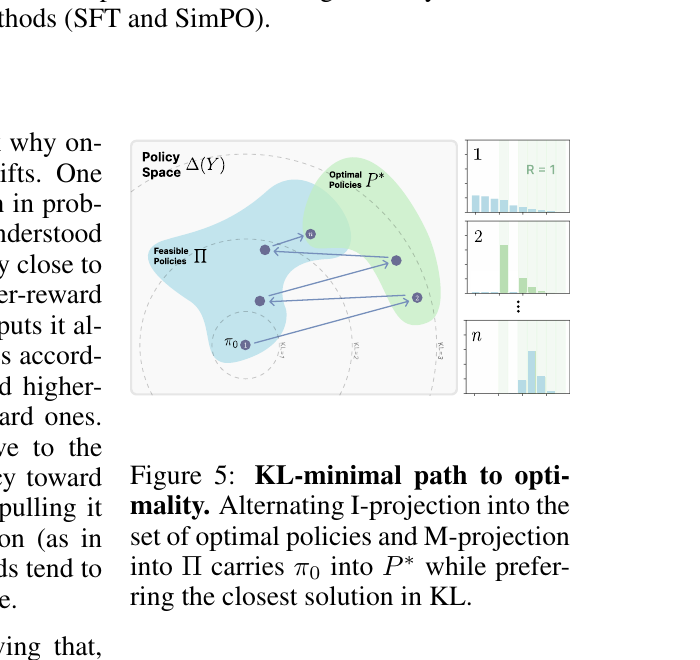
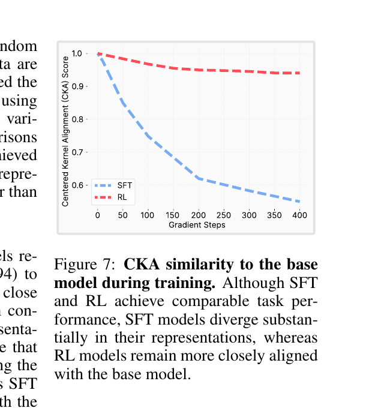

# RL's Razor: Why Online Reinforcement Learning Forgets Less

## 1. 出发点 (Motivation)

大模型部署后能不能"边用边学"?最大的拦路虎是 **灾难性遗忘** (catastrophic forgetting) — 在新任务上 fine-tune 一下,旧能力就掉了。现有工作针对这一问题的常见思路:

- **约束参数** (EWC, Synaptic Intelligence):限制权重移动幅度
- **保留特征** (Learning without Forgetting):蒸馏旧表征
- **约束输出分布** (KL reg. on past tasks):在旧任务输入上保持原 logits

这些都是"对症下药",没有回答 **为什么** 会遗忘。基础模型场景下,旧任务集合是*无限大*的 — 你根本没法把所有旧任务都列出来做正则化。

论文从一个实证现象切入:即使 RL 和 SFT 在新任务上做到**同样的准确率**,RL 的旧能力损失明显更少。这给了一个抓手:

> 什么变量,只看新任务,就能预测遗忘程度,并把 RL 和 SFT 统一在同一条曲线上?

答案是 *forward KL divergence between fine-tuned and base policy on the new task* — 而且只有它能做到。论文管这条原则叫 **RL's Razor**:*在所有能解新任务的策略中,RL 偏好离原模型 KL 最近的那个。*

<figure>
      
      <figcaption>Fig. 1 — 左图:策略空间里能 90% 解新任务的"等高线带",RL 沿低 KL 等高线滑过去,SFT 可能滑到很远的解。右图:这种 KL 偏置在 Pareto frontier 上体现为相同新任务表现下旧任务保留得多。</figcaption>
    </figure>

## 2. 方法 (Method)

### 核心思想 (类比)

把模型想成一个钢琴师,他原本会弹古典、爵士、流行三种风格,现在要他学弹*新*的一首小步舞曲。两种教法:

- **SFT (跟谱抄):** 拿一份标准谱子让他照弹,他可能为了精确复刻"老师的手型",连原本的指法肌肉记忆都重写了 — 古典爵士都生疏了。
- **RL (自由发挥 + 打分):** 让他自己弹,弹对的小步舞曲句给糖,弹错给鞭子。他每次都从*自己原本会的指法*里采样,只是把好句子的概率慢慢调高 — 古典爵士的肌肉记忆基本没动。

关键差异:**采样从谁的分布出?** SFT 从外部 teacher 分布 $\pi_\beta$,RL 从模型自身分布 $\pi$ 出。后者天然把更新约束在"模型已经认识"的输出上,避免被拽到一个陌生的远点。

### 2.1 设定与公式

对一个离散输出的策略 $\pi(y \mid x)$ (例如 LLM 的 next-token 分布),两种目标:

**SFT** (cross-entropy against 外部监督分布 $\pi_\beta$):

**RL** (policy gradient with advantage $A$):

仔细看这两式的差别只有两处:

1. **采样分布:** SFT 的 $y$ 来自外部固定标注 $\pi_\beta$;RL 的 $y$ 来自模型自身 $\pi$ (on-policy)。
2. **负样本:** RL 的 $A(x,y)$ 对不好的 $y$ 给负系数,SFT 没这机制。

论文要论证的主张:**差异 (1) 是关键,差异 (2) 不是。**

遗忘的量化指标 — 在与新任务*无关*的旧 benchmark 上的平均准确率;预测变量 — **forward KL on the new task input distribution**:

- $\pi_0$ 是 base policy (pre-training/post-training 后,fine-tune 前)。
- $\pi$ 是 fine-tuned policy。
- $\tau$ 是 *新*任务的输入分布 — 注意不是旧任务。这点是反直觉的核心:遗忘程度居然只看新任务上的分布漂移就能预测,不需要触及任何旧数据。

### 2.2 经验律:forward KL 预测遗忘

四个真实任务上扫一大堆超参,画 Pareto frontier:

<figure>
      
      <figcaption>Fig. 2 — Math (Open-Reasoner-Zero) / Science Q&amp;A (SciKnowEval) / Tool Use (ToolAlpaca) / Robotics (OpenVLA + SimplerEnv pick-and-place)。横轴新任务准确率,纵轴旧 benchmark 平均分。RL (红虚线) 几乎水平,SFT (蓝虚线) 在高新任务区域陡降。</figcaption>
    </figure>

LLM 上算 RL 太贵,论文设计了一个能跑透的玩具 — **ParityMNIST**:MNIST 图像,但 label 只要"奇偶正确"就算对 (例:数字 3 可以预测 1/3/5/7/9 中任一个)。同一张图存在多个合法 label,完美映射 LLM 生成任务的"多解性"。3 层 MLP 在 ParityMNIST + FashionMNIST 联合预训练,只在 ParityMNIST 上 fine-tune,在 FashionMNIST 上测遗忘。

<figure>
      
      <figcaption>Fig. 3 — (左) 5 种 fine-tune 方法在 acc-forgetting 平面上的轨迹各不相同。(中) 一旦把横轴换成 forward KL,所有点 <em>压到同一条曲线上</em>,二次多项式拟合 $R^2 = 0.961$。(右) 同一新任务准确率下,RL 的 KL 显著比 SFT 小。</figcaption>
    </figure>

更狠的是,作者把所有候选预测变量都试了一遍:

<figure>
      
      <figcaption>Tab. 1 — 二次拟合 $R^2$。forward KL 是 0.96,reverse KL 0.93,TV 0.80,权重 / 激活变化 / 稀疏度 / rank 全都不行。<strong>没有任何变量能像 forward KL 这样跨方法统一拟合遗忘曲线。</strong></figcaption>
    </figure>

LLM 上把同样分析做一遍,$R^2 = 0.71$ — 比玩具任务弱不少,但残差零均值,仍是论文最强的预测器。

### 2.3 关键 ablation:on-policy 才是 RL 优势的根源

SFT 与 RL 的差异有两条 (采样源 + 负样本)。论文设计了一个 2×2 矩阵彻底解耦:

<figure>
      
      <figcaption>Fig. 4 — 左:四种算法按 (on-policy / offline) × (是否用负样本) 分类。中/右:KL 和遗忘行为按"是否 on-policy"清晰分组 — 1-0 REINFORCE 像 GRPO,SimPO 像 SFT。</figcaption>
    </figure>

- **GRPO** — on-policy,带负样本。$A(x,y)$ 是归一化后的 reward。
- **1-0 REINFORCE** — on-policy,*不*带负样本。$A(x,y) = 1$ 给对的,$A = 0$ 给错的 — 等价于"从模型自己采样,只在正确样本上做 SFT"。
- **SFT** — offline,不带负样本。
- **SimPO** — offline,带负样本。$\mathcal{L}_{\text{SimPO}} = -\mathbb{E}_{y_w \sim \pi_\beta^+, y_l \sim \pi_\beta^-}\!\left[\log \sigma\!\left(\log \pi(y_w \mid x) - \log \pi(y_l \mid x) - 1\right)\right]$

结果:1-0 REINFORCE 和 GRPO 行为几乎相同,SimPO 行为像 SFT。**分界线沿 on-policy/offline,而不是 有/无负样本。**这反驳了同期 Lai et al. (2025) 把 RL 优势归到"学习负样本"的解释。

### 2.4 理论:policy gradient = 交替投影到 KL-min 解

论文的核心理论是把 policy gradient 视作信息几何里的 **EM 算法**。设最优策略集合为 $P^* = \{q : \mathbb{E}_q[R] = 1\}$,可表达策略类为 $\Pi$。每一步策略更新等价于两个投影:

**I-projection (信息投影):** 拒绝采样得到的"奖励再加权"分布 $q_t$ 是 $\pi_t$ 在 $P^*$ 上的 minimum-KL 投影。

**M-projection (矩投影):** Policy gradient 把 $q_t$ 投回可表达策略类。

<figure>
      
      <figcaption>Fig. 5 — 交替 I/M 投影把 $\pi_0$ 沿 KL 等高线"贴着走"进入 $P^* \cap \Pi$,最终停在 $\pi^\dagger = \arg\min_{\pi \in P^* \cap \Pi} \mathrm{KL}(\pi \,\|\, \pi_0)$。</figcaption>
    </figure>

**主定理 (Theorem 5.2 + Prop A.4):** 在 $\Pi$ 为 e-flat、$P^*$ 非空可达等条件下,policy gradient 收敛到

这就是"RL's Razor"的形式化:*能解题的策略里,policy gradient 选 KL 最近的那个。*

**为什么 SFT 没有这个性质?** 因为 SFT 的更新方向直接是外部 $\pi_\beta$,$\pi_\beta$ 可能离 $\pi_0$ 任意远;policy gradient 的更新方向是 $\pi$ 自己 reweighted 后的 $q$,$q$ 必定支撑在 $\pi$ 已经赋非零概率的集合上,自带"近邻约束"。

### 2.5 Oracle SFT — 反证 KL 因果

如果 forward KL 真的是因,而不只是相关,那应该可以"绕过 RL"直接拿到 KL-min 的解。论文构造了一个 oracle SFT 分布:

在 ParityMNIST 上有闭式解 (论文 Appendix B.3):把 $\pi_0$ 的概率质量按"奇偶正确性"重新归一即可。

结果:在 oracle 分布上做 SFT,遗忘比 RL *还少*。这等于把 RL 的"实验冠军"光环摘了 — RL 之所以好,不是因为它是 RL,而是因为它隐式地逼近这个 KL-min 解。如果你能直接算 oracle (大多数 LLM 任务不行),SFT 就赢了。

### 2.6 与代码对照 (didactic reference)

<p class="code-source"><em>没有官方代码发布。</em>下面三段是<strong>教学性参考实现</strong>,用 PyTorch 重写论文里最关键的三个公式,方便对照原文 §3-§5 阅读。<u>不</u>是作者代码。</p>

**(a) Forward KL on new task** — 论文核心预测变量 (§4 经验律),正是 Tab. 1 中 $R^2 = 0.96$ 那一行的计算方式。Monte Carlo 估计:

```python
@torch.no_grad()
def forward_kl_on_new_task(pi_base, pi_ft, new_task_loader):
    """E_{x~tau} KL(pi_base(.|x) || pi_ft(.|x))
    对应论文 Sec. 4 公式: 用新任务输入采样,base 与 fine-tuned 的 token-level KL。"""
    total, n = 0.0, 0
    for x in new_task_loader:                     # x: 新任务的 prompt batch
        logp_b = pi_base.log_prob(x)              # [B, V]  base 的对数概率
        logp_f = pi_ft.log_prob(x)                # [B, V]  fine-tuned 的对数概率
        p_b = logp_b.exp()
        kl = (p_b * (logp_b - logp_f)).sum(-1)    # forward KL per sample
        total += kl.sum().item()
        n += kl.numel()
    return total / n
```

注意是 forward,不是 reverse — Tab. 1 显示 reverse KL 的 $R^2$ 也有 0.93,但 forward 严格更强。直觉:forward 关心"base 认为很可能的输出在 fine-tuned 模型里有没有被压制",这正对应"旧能力丢没丢"。

**(b) 1-0 REINFORCE** — 论文 §5.1 Fig. 4 的关键 baseline。它*不*用负样本,但行为像 GRPO,证明 on-policy 才是 KL-min 的根源。

```python
def one_zero_reinforce_step(policy, prompts, reward_fn, optimizer):
    """on-policy, 不带负样本 — 对应论文 Sec. 5.1
    A(x,y) = 1 if reward==1 else 0  ==> 等价于"从模型采样,只对正确响应做 SFT"
    """
    optimizer.zero_grad()
    # 1. 从当前策略采样 (on-policy 的关键)
    responses = policy.sample(prompts)            # y ~ pi
    rewards = reward_fn(prompts, responses)       # R in {0, 1}
    # 2. log-prob of own samples
    logp = policy.log_prob(responses, prompts)    # [B, T]
    # 3. 只在正确响应上做 likelihood 上升 (A=1 给对,A=0 给错)
    loss = -(rewards.unsqueeze(-1) * logp).sum(-1).mean()
    loss.backward()
    optimizer.step()
    return loss.item()
```

对比一下:把 `policy.sample(prompts)` 换成"读外部 dataset 的 ground-truth",这就是 SFT;把 `rewards` 换成 normalized advantage,这就是 GRPO。论文 Fig. 4 用这个对比把"采样源"和"负样本"两个变量解耦,结论:on-policy 的 sample 才是 KL 小的根源。

**(c) Oracle KL-min distribution** — 论文 §4 "Optimal SFT distribution" + Appendix B.3 的闭式解。Forward-KL 最小化,有解析形式:

```python
def oracle_kl_min_distribution(pi_base_logits, valid_mask):
    """q* = arg min_q KL(pi_base || q)  s.t.  q^T R = 1, q simplex
    对应论文 Appendix B.3。R 是 0/1 indicator,1 表示该 label 满足任务约束 (例:parity 正确)。
    """
    p_base = pi_base_logits.softmax(-1)           # [B, V]   base 概率
    # 把 base 在合法 label 上的概率重新归一 — 即 base 条件分布 p_base(. | R=1)
    q_unnorm = p_base * valid_mask                # 非法 label 概率清零
    Z = q_unnorm.sum(-1, keepdim=True)            # 归一化常数
    q_star = q_unnorm / Z.clamp_min(1e-12)        # 满足 q^T R = 1
    return q_star
```

训练时把 SFT 的 cross-entropy target 从一个 arbitrary 正确 label 换成上面这个 $q^*$ 分布。论文 Fig. 3 的"SFT on optimal dist."就是这条曲线,遗忘比 RL 还少。

### 2.7 变长序列下的 forward KL 怎么算?

2.6 (a) 的伪代码把每个输入当成 single-token 来写,实际 LLM 是变长自回归生成 — base 和 fine-tuned 在同一 prompt 下采样出的序列长度通常不同。怎么定义 KL?

**非问题:不需要"两边都采样"。** Forward KL 的定义里期望只在 $\pi_0$ 下取:

你只从 $\pi_0$ 采一条 $y$ (长度 $T$),$\pi$ 在*同一条* $y$ 上 teacher-force 评估一次。两边各算一次 sequence log-prob,长度天然一致。"新旧策略采样长度不一样"的困扰来自误以为要双边采样。

**两种估计器:**

1. **Sequence-level Monte Carlo** — 单 forward,最便宜:
        $$\widehat{\mathrm{KL}}_{\text{seq}} = \log \pi_0(y \mid x) - \log \pi(y \mid x), \quad y \sim \pi_0$$
2. **Token-level full KL** — 每位置在整个词表上做闭式求和,方差远低于 (1):
        $$\mathrm{KL}_t = \sum_{v \in \mathcal{V}} \pi_0(v \mid x, y_{\lt t})\,\log \frac{\pi_0(v \mid x, y_{\lt t})}{\pi(v \mid x, y_{\lt t})}$$
        论文实验里 token-level 计算几乎是默认 — 两个模型都本地可达,没有理由放弃全词表的信息。

**真正要选的是 sum 还是 mean。**序列总 KL 有两种聚合:

- **Per-token average** $\frac{1}{T}\sum_t \mathrm{KL}_t$ — 长短序列可比,无 length bias,<u>推荐</u>。
- **Per-sequence sum** $\sum_t \mathrm{KL}_t$ — 长序列天然 KL 更大,跟"哪种方法输出更长"的混淆变量纠缠。

论文用 **Dr. GRPO** (Liu et al. 2025) 替代原版 GRPO,正是为了消除 length bias;测 KL 时与训练 loss 形式对齐,几乎一定走 per-token average。

**低方差估计:Schulman 的 k3 estimator** (PPO 实现里通用,TRL / verl 默认)

非负、无偏、方差远低于直接的 $\log(\pi_0/\pi)$。论文 §4 写 "approximate KL estimation noise" 大概率指这个估计器的残差。

把上述细节串起来,变长版本的 forward KL 估计器:

```python
@torch.no_grad()
def forward_kl_on_new_task_llm(pi_base, pi_ft, prompts, num_samples=8):
    """E_{x~tau} KL(pi_base || pi_ft), token-level full KL, per-token 平均。
    对应论文 Sec. 4 经验律, LLM 实操版 (处理变长 + 词表完整 KL)。
    """
    total_kl, total_tokens = 0.0, 0
    for x in prompts:                                       # x: 新任务 prompt
        for _ in range(num_samples):
            y = pi_base.generate(x, do_sample=True)         # 仅从 base 采样, 长度 T 可变
            logp_b = pi_base(x, y).logits.log_softmax(-1)   # [T, V]
            logp_f = pi_ft(x, y).logits.log_softmax(-1)     # [T, V]
            p_b = logp_b.exp()
            kl_t = (p_b * (logp_b - logp_f)).sum(-1)        # [T] token-level full KL
            total_kl += kl_t.sum().item()                   # 这里先 sum
            total_tokens += kl_t.numel()                    # 后用 total_tokens 归一
    return total_kl / total_tokens                          # ==> per-token 平均
```

三条要点:

- 采样只走 $\pi_0$ — 没有"两边长度不一致"的问题。
- 聚合走 per-token 平均 — 跟 Dr. GRPO 的训练目标对齐,免 length bias。
- 方差大时换 Schulman k3 — 把 $\log(\pi_0/\pi)$ 替成 $\pi/\pi_0 - 1 - \log(\pi/\pi_0)$。

## 3. 结论 (Key Findings)

论文的三大发现:

1. **RL 比 SFT 少遗忘,跨四个真实任务一致成立** — Math (Qwen2.5-3B + Open-Reasoner-Zero math)、Science Q&A (SciKnowEval Chem L-3)、Tool Use (ToolAlpaca)、Robotics (OpenVLA 7B + SimplerEnv pick-and-place)。Fig. 2 显示 RL 的 Pareto frontier 基本"水平",SFT 在高新任务区域陡降。
2. **Forward KL on new task 是统一的预测变量** — ParityMNIST 上 $R^2 = 0.96$ (Tab. 1),LLM 上 $R^2 = 0.71$ (Fig. 11)。其它候选变量 (weight L1 / Fisher L2 / spectral norm 0.34-0.58,activation L1/L2 0.52-0.55,sparsity / rank 不构成预测器) 都无法跨方法对齐。
3. **On-policy 采样是 RL 优势的根源,负样本不是** — Fig. 4 的 2×2 ablation 中,1-0 REINFORCE (on-policy, 无负样本) ≈ GRPO,SimPO (offline, 有负样本) ≈ SFT。理论上 (Theorem 5.2),policy gradient 在二元 reward 下等价于 EM-with-I-projection,收敛到 $\arg\min_{\pi \in P^* \cap \Pi} \mathrm{KL}(\pi \,\|\, \pi_0)$。

**RL 不是终点。**论文构造的 oracle SFT 分布在 ParityMNIST 上遗忘比 RL *更少* — 即:RL 的优势完全来自其"隐式 KL 正则",一旦你能直接算 KL-min 解,SFT 反而是更好的选择。

<figure>
      
      <figcaption>Fig. 7 (Appendix C.1) — 在与训练任务<em>无关</em>的 Wikipedia 文本上算 CKA。RL 训练后 CKA = 0.94 (几乎不动),SFT 训练后 CKA = 0.56 (大幅漂移)。表征层面证实 SFT 把模型推到了远处。</figcaption>
    </figure>

实操含义:**未来的后训练方法应该明确地以 forward-KL-on-new-task 为目标**,而不只是把 KL reg 当作"防止 reward hacking 的稳定 trick"。

## 4. 实现细节 (Implementation Notes)

**关于代码:**本文没有公开 GitHub 仓库 (按论文 PDF + 项目主页 + Papers with Code + GitHub 关键词搜索 + 作者 X/Twitter 6 个渠道核验,只有项目主页 `jyopari.github.io/posts/rl_razor`,无代码链接)。下面的实现细节全部来自论文正文 + Appendix B,引用为 `[§sec]`。

- **Base model & RL 框架:** Qwen2.5-3B-Instruct (LLM) / OpenVLA-7B (Robotics)。RL 全部用 **GRPO** (Shao et al. 2024),loss 用 **Dr. GRPO** 变种 (Liu et al. 2025 — 修正了原 GRPO 的 length bias)。[§B.1 Table 2]
- **关键设定:KL reg = 0** — 论文的 GRPO 训练<u>没有</u>显式 KL 正则项。这条非常 load-bearing:它说明 RL 的低 KL 是 *自发* 的,不是被超参强制出来的。[§3.1, §B.1 Table 2]
- **Group size 64, prompts/generation 8, num_iter μ ∈ {1, 2}, Loss = Dr. GRPO.** Reward 是二值成功 indicator,无 reward shaping。Optimizer adamw,bf16,no weight decay,grad clip 1。[§B.1 Table 2]
- **SFT 数据来源 (重要):** Math 的训练集只有最终答案,没有推理链 — 作者用 DeepSeek R1 采样 16 次/题,选与正确答案匹配的一条 (96% 覆盖)。Science Q&A 用 GPT-4o 同样流程 (100% 覆盖)。<u>所以 SFT 的"label"也来自一个强模型的分布,并不是 ground-truth one-hot</u>。[§B.1]
- **Pareto frontier 协议:** (1) 大量超参扫;(2) 保留距离每条 frontier 2 个准确率点以内的模型;(3) 在筛后点上拟合指数曲线。这是 RL/SFT 公平比较的核心 — 单一超参对比可以做出任何结论。[§B.1]
- **评估 pipeline:** 旧能力测试用 [EleutherAI lm-evaluation-harness](https://github.com/EleutherAI/lm-evaluation-harness);Math/Science 看最终答案匹配,忽略中间 reasoning;Tool Use 用正则提取 API 调用。[§3.1, §B.1]
- **bfloat16 假稀疏陷阱 — 论文最有信息量的一条工程发现:** Mukherjee et al. (2025) 曾报告"RL 更新稀疏,SFT 更新稠密",作者复现后发现这是 *bfloat16 mantissa 不够* 造成的伪影 — RL 的小更新被舍入到 0,看起来像稀疏。**换 float32 后稀疏性消失,且性能一致**。这条直接否定了"RL 调小子网络"这一流派的解释。[§6 + Tab. 1 (Sparsity = N/A)]
- **ParityMNIST 玩具实验:** 3 层 MLP (785 → 512 → 256 → 10),输入是 28×28 图 + 1-bit 任务标记 (+1 ParityMNIST / −1 FashionMNIST)。预训练联合两个任务各 500 张图。15 个学习率 × 2 个 scheduler × 1-2 epoch,加上中间 checkpoint,每种方法约 500 runs — 这才是 $R^2 = 0.96$ 得以稳健拟合的样本量。[§B.3]
- **Robotics 设置:** 训练数据由 RT-1 (Brohan et al. 2022) 收集成功轨迹,10×10 grid of object positions;RL 用 REINFORCE + reward normalization baseline,每个 grid 点 5 条 trajectory/迭代。100 个测试位置。[§B.2]
- **代码 vs 论文的 gap:** 没有官方代码可对比 — 这是论文的最大可重现性短板。所有上述细节都依赖 Appendix B 文字描述。

## 5. 批判性总结 (Critical Assessment)

### 5.1 优点

- **问题陈述清晰且重要。**"为什么 RL 遗忘少"是 RLHF/post-training 整个领域反复观察到但没人系统解释的现象。论文直接钉死在一个可测量的预测变量上 — forward KL on new task。
- **排除候选变量做得非常严谨。** Tab. 1 把 weight L1 / Fisher L2 / spectral norm / activation L1/L2 / sparsity / rank 全测一遍,每个变量都用 $R^2$ 量化对比,没有避重就轻。
- **玩具 → LLM → 机器人三层验证。** ParityMNIST 是个聪明的玩具:它保留了"多解"这个生成任务的关键性质,但允许跑透 500 runs。
- **理论部分优雅且非平凡。** 把 policy gradient 与 EM/信息几何里的 I-/M-projection 联系起来 (Csiszár 1984; Amari & Nagaoka 2000),给出 $\pi^\dagger$ 的闭式刻画,是个真正的"为什么"。
- **Oracle SFT 反证设计漂亮。** 它把 RL 的光环摘掉了:RL 不是因为它是 RL 而好,而是因为它逼近一个具体的 KL-min 解。这种"我说我对,我也给你一个比我更好的"的写法很难得。
- **bfloat16 这个细节救了一个文献流派。** 直接驳掉了"RL 调小子网络"的伪观察,把后续工作引回正轨。

### 5.2 不足 / 疑点

- **没有提出新算法。**"经验律 + 理论解释" — 整篇是诊断,不是药方。作者自己在 §7 也承认。"应该明确以 KL-min 为目标"是个方向,但具体怎么做没说 — KL reg 在 LLM 上早就是常规操作了,为什么效果还不如 on-policy 自然偏置?这里有个隐含但未回答的问题。
- **LLM 上 $R^2 = 0.71$ 与 toy 上 0.96 差距明显。**作者把残差归因于"KL 估计噪声 + 准确率估计噪声",但 0.71 在统计学上"残留 ~30% 方差未解释"。在大模型上,"forward KL 是唯一可靠预测器"这一 claim 比作者写得弱不少。要把"经验律"升级为"定律",需要在更多 LLM 任务、更长训练上重复。
- **完全没研究 online but off-policy 算法。**PPO + replay buffer、V-trace、IMPALA、async actor-learner 这些是工业界主流。论文的 on-policy/offline 二分法把它们都丢出去了。如果 KL 偏置的根源是"采样源",那 off-policy on-line 应该在两者之间 — 但论文没测。这是个明显的 caveat,作者也明说了。
- **因果 vs 相关。**KL 与遗忘高度对齐,不代表 KL 是*因*。两者可能都被同一个 latent 变量 (representation interference?) 决定。Oracle SFT 实验是因果论证最强的一击,但它只在 ParityMNIST 上闭式可解,在 LLM 上无法做。在 LLM 上"KL 因果"目前还是 by analogy。
- **缺少机制层解释。**"大 KL 为什么会破坏旧能力" — 这个问题论文没回答,作者也写明了 ("we still lack a mechanistic account")。CKA 实验 (Fig. 7) 提供了表征漂移的现象,但没有连到具体的"哪些 neuron 被覆盖"层级。
- **规模上限是 14B (Fig. 8) ,只在 Science Q&A 一个任务。**"前沿模型遗忘行为相同"是个延展,不是结论。70B+ / MoE / 长 context 行为可能完全不同。
- **Oracle SFT 的存在反过来挑战了 RL 的实操地位。**论文证明了:有 oracle 时,SFT 赢。LLM 在大多数任务上能不能算 oracle?Math/Code 答案可枚举,oracle 应该可以构造 (这正是后续工作的方向)。如果 LLM 上的 oracle SFT 也能赢 RL,那 "RLHF 是后训练的必由之路"这个流行叙事就需要修正。论文没有跟进做这个最有冲击力的实验,有点保守。
- **Lai et al. (2025) 同期工作的反驳是核心证据,但只是用一个 task 的 ablation 完成的。**Fig. 4 在 Science Q&A 单任务上展示 SimPO ≈ SFT、1-0 REINFORCE ≈ GRPO,跨任务这个分组是否稳定,论文没在其它三个 LLM 任务上重复。

### 5.3 适用 vs 不适用

- ✅ **适用:**RLHF/RLAIF 这种"无 oracle"的连续后训练场景 — KL-min 偏置是免费红利。
- ✅ **适用:**作为评估 fine-tuning 算法的*诊断工具* — 画一张 forward-KL-on-new-task vs 旧 benchmark 的曲线,远比单纯比新任务准确率更有信息量。
- ✅ **适用:**设计新的后训练算法时,把"显式 forward KL on new task constraint"加入目标 (而不是只在旧任务 KL reg)。
- ❌ **不适用 / 已有更好方案:**当 oracle distribution 可计算 (Math / Code / 形式化任务),直接用 oracle SFT 比 RL 更优 (论文自己证明)。
- ❌ **不适用:**严格离线 + preference-only 场景 (DPO / SimPO) — 论文把它们归类为 offline,且表明它们的 KL 行为像 SFT。
- ⚠️ **谨慎:**非平稳新任务 / 持续多任务场景。论文只测了 single-task adaptation,multi-stage continual 时 forward KL on which task 的定义就模糊了。

### 5.4 进一步阅读

- [Lai et al. 2025 — Reinforcement Fine-Tuning Naturally Mitigates Forgetting in Continual Post-Training](https://arxiv.org/abs/2507.05386):同期工作,把 RL 优势归到"学习负样本"。本论文 Fig. 4 反驳了这一解释。
- [Chu et al. 2025 — SFT Memorizes, RL Generalizes](https://arxiv.org/abs/2501.17161):从泛化角度对比 RL/SFT,本文是其在 forgetting 维度的姐妹篇。
- [Mukherjee et al. 2025 — RL Finetunes Small Subnetworks](https://arxiv.org/abs/2505.11711):被本文 §6 + Tab. 1 的 sparsity 实验直接驳掉 (bfloat16 假象)。后续工作需要在 float32 下重做。
- [Shao et al. 2024 — DeepSeekMath / GRPO](https://arxiv.org/abs/2402.03300):GRPO 原始论文,本文 RL 训练的算法来源。
- [Liu et al. 2025 — Dr. GRPO](https://arxiv.org/abs/2503.20783):本文实际使用的 GRPO 变种,修正了 length bias。
- Csiszár 1984 / Amari & Nagaoka 2000:信息几何里的 I-/M-projection 与 EM 算法,本文理论的数学背景。
- Stiennon et al. 2020; Ouyang et al. 2022:RLHF 中 KL reg 作为"防止 reward hacking"的传统用法 — 本文升级了这一启发式的地位。

<footer>
    <hr/>
    <p class="meta">Read on 2026-05-12 · Generated with the <code>reading-papers</code> skill</p>
  </footer>
