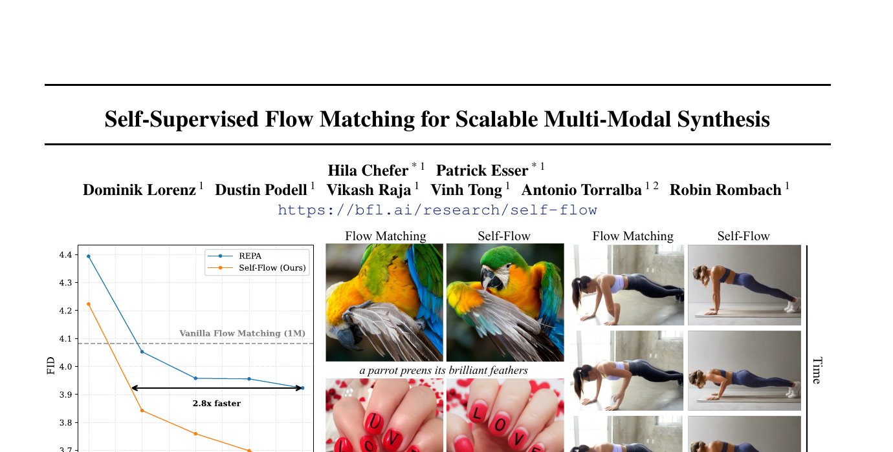
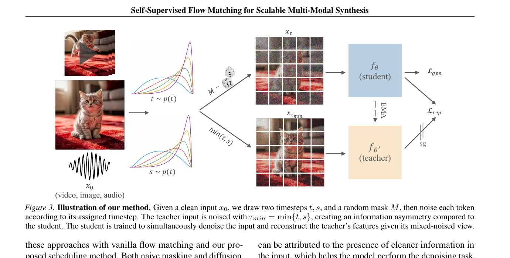
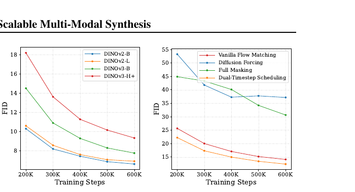
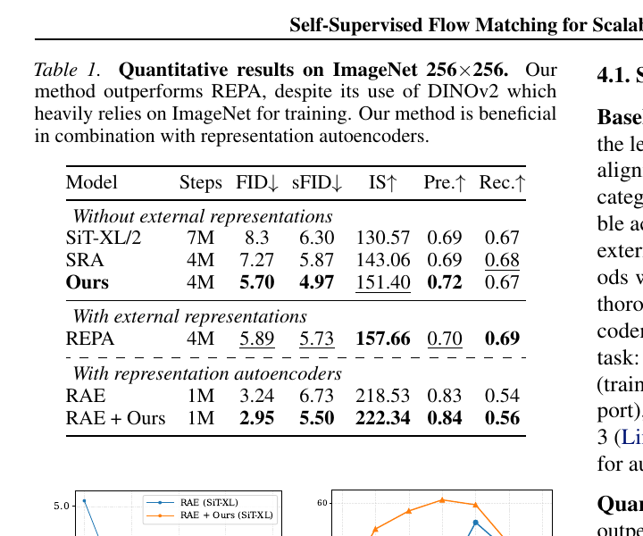
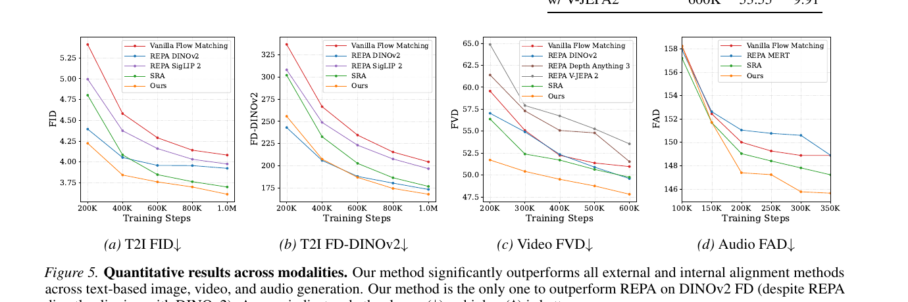
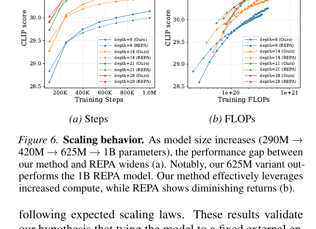
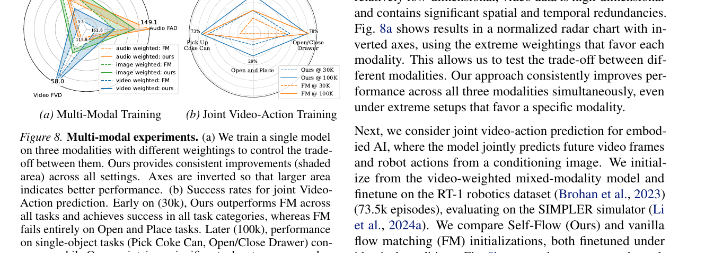
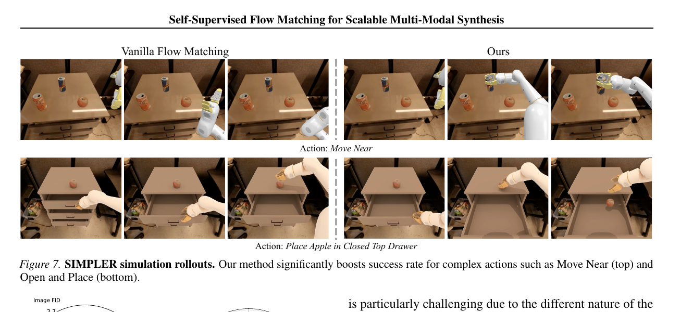

# Self-Supervised Flow Matching for Scalable Multi-Modal Synthesis

## 1. 出发点 (Motivation)

2024 年的 **REPA** (Yu et al.) 给业内一个意外发现:flow / diffusion 模型如果把内部 feature 跟*外部冻结*的 image encoder (例如 86M 的 DINOv2-B) 对齐,生成质量能大幅提升。这意味着 flow 模型*自己不会学*强语义表征 — 必须借。整个 2025 年一票工作 (REPA, REPA-E, SRA 等) 都在这条路上。

但这条路有**三个根本毛病**:

1. **反向 scaling.** 换更强的 encoder 反而*更差*。DINOv2-B → DINOv2-L → DINOv3-B → DINOv3-H+ 上,FID 单调上升 (越大越差)。论文 §3.2 Fig 2a 实测出来的。
2. **模型 scaling 也失效.** REPA 把生成模型从 290M scale 到 1B,收益严重递减 — Self-Flow 的 625M 直接超过 REPA 的 1B。
3. **跨模态崩溃.** 视频对齐到 V-JEPA2 / Depth Anything 3,音频对齐到 MERT,*都比 vanilla flow matching 还差*。外部 encoder 的训练目标(识别 / 表征聚类)跟生成目标 (synthesis) 没对齐,迁移到非图像模态时*主动有害*。

诊断:把"表征学习"外包给一个跟生成目标不一致的、固定的外部模型,是个 bottleneck。**应该把表征学习内嵌到生成目标里,让它自己学。**

但 flow matching 训练目标 (denoise 一个均匀噪声的图) 本身没什么"必须学语义"的压力 — 局部相关性就能解大部分 denoising。Self-Flow 的核心 trick 是*制造信息不对称*:给同一张图的不同 token 加不同噪声,某些 token 很干净、某些很脏,模型为了把脏的还原回去*必须用*干净 token 的语义。这就强制 model 学全局表征。

<figure>
      
      <figcaption>Fig. 1 — 左:T2I 上 Self-Flow 收敛比 REPA 快约 2.8×,且 REPA 在 1.2M step 后开始 plateau,Self-Flow 仍在下降。右:在 vanilla flow matching 失败的 prompt 上("a parrot preens its brilliant feathers"、"LOVE" 写在指甲上、"woman doing push-ups"),Self-Flow 同时改善结构连贯性、文字渲染、时间一致性。</figcaption>
    </figure>

## 2. 方法 (Method)

### 核心思想 (类比)

把训练 flow 模型想象成考**填空题**。Flow matching 的填空题是:

- "这张图整体加了 30% 噪声 — 还原它。"
- 对每个 patch 都一样的噪声等级 → 学生只看附近邻居 (局部相关) 就能猜对,不用想全图。

Self-Flow 改成**不对称填空题**:

- "这张图右半边加了 80% 噪声 (基本看不见),左半边只加了 20%。还原全图。"
- 学生要还原右半边,*必须*看左半边的语义(这是只猫 → 右半边八成也是这只猫的延续)。强制学到 "这是只猫" 这种全局表征。

但只这样训练有*train-inference gap*:推理时每步噪声等级是均匀的,如果训练时全是不对称的,模型推理就崩。Self-Flow 的具体方案:*采样两个时步 $t, s$,用<u>较干净的</u>那个 $\min(t, s)$ 给 mask 内的 token,另一个 $t$ 给其他 token*。这样每个 token 的*边缘*噪声分布仍跟 vanilla flow matching 一致,只是被 mask 的子集系统性地更干净 — 推理时不会有意外。

有了不对称输入,Self-Flow 做**self-distillation**:同一个模型扮 student (噪声混合输入) 和 teacher (EMA 副本, 用 *min(t,s)* 的更干净版本输入),让 student 的中间层 feature 跟 teacher 的对齐 — 跟 REPA 形式上一样,但 teacher 变成了模型自己更干净的副本而非外部 DINO。

<figure>
      
      <figcaption>Fig. 3 — 总体框架。给定干净输入 $x_0$(图像/视频/音频),采样两个时步 $t, s$ 和随机 mask $M$,按 mask 给每个 token 分配 $t$ 或 $s$ → 构造 $x_\tau$ (student 输入)。Teacher 输入用 $\tau_{\min} = \min(t, s)$,所有 token 都用<em>较干净</em>的时步,获得了 student 没有的信息。Student 同时做两件事:(1) 在 $x_\tau$ 上做 flow matching 的 denoising (生成损失 $\mathcal L_{\text{gen}}$),(2) 让自己的某个中间层 feature 跟 teacher 在 $x_{\tau_{\min}}$ 上的 feature 对齐(表征损失 $\mathcal L_{\text{rep}}$)。</figcaption>
    </figure>

### 2.1 Flow Matching + REPA 基础

**Rectified flow (Liu et al. 2022).** $x_0$ 是干净数据 (N 个 token,每个维度 C),$x_1 \sim \mathcal N(0, I)$ 是噪声。线性插值轨迹:

速度场是常向量 $v_t = dx_t/dt = x_1 - x_0$。生成损失(Eq 2):

**REPA (Yu et al. 2024).** 用一个冻结的外部 encoder $r_\phi$ (DINOv2 等),把 flow 模型第 $l$ 层 feature 跟 encoder 第 $k$ 层 feature 对齐(Eq 3):

$h_\theta$ 是 student 的 MLP projection head,$\mathrm{sim}$ 是 cosine similarity。**关键问题:**$r_\phi$ 是 DINO,训练目标不是生成。把生成模型的 feature 拉向 DINO 的 feature manifold 会创造一个 bottleneck — 强模型反而被锁死在 DINO 的 representation 里。

### 2.2 REPA 反向 scaling — 论文最有力的实证

<figure>
      
      <figcaption>Fig. 2 — (a) <strong>REPA 反向 scaling:</strong>DINOv2-B (蓝) FID 最好,DINOv2-L (黄) 接近,DINOv3-B (绿) 显著更差,DINOv3-H+ (红) 最差。<em>encoder 越强,生成质量越差</em>。(b) Scheduler 对比:Vanilla Flow Matching 是基线;Diffusion Forcing (每个 token 独立噪声) 和 Full Masking (随机置 t=1) 都<em>严重</em>恶化生成 — 因为推理时模型遇到均匀噪声,跟训练完全不一样;Dual-Timestep Scheduling (黄) <em>没</em>用任何 self-supervised loss,就已经小幅超过 vanilla — 说明信息不对称本身就是有益的。</figcaption>
    </figure>

Fig 2a 是这篇 paper 的 founding observation。这条规律之前 Singh et al. 2025 也报告过,但 Self-Flow 是第一个把它扩到 DINOv3 系列、且作为 motivation 系统化论证的工作。

### 2.3 Dual-Timestep Scheduling (§3.3) — 核心 trick

怎么"给不同 token 加不同噪声"又不引入 train-inference gap?三种 naive 方案的失败:

- **Naive Masking:**随机把一些 token 设为 $t = 1$ (完全噪声)。崩 — 推理时不会出现"一半 token 完全噪声"这种情形。
- **Diffusion Forcing:**每个 token 独立采样一个 $t$。也崩 — 推理时还是均匀。

**Self-Flow 的方案 (Eq 4-5):**

1. 采样*两个*时步 $t, s \sim p(t)$。
2. 采样一个 mask $M = \{i \in \{1, \ldots, N\} \mid u_i \lt R_M\}$,其中 $u_i \sim U(0, 1)$,masking ratio $R_M \leq 0.5$。
3. 构造 per-token 时步 $\tau \in \mathbb R^N$:
        $$\tau^i = \begin{cases} s, & i \in M \\ t, & \text{otherwise} \end{cases}$$
4. 每个 token 按自己的 $\tau^i$ 加噪:
        $$x_\tau = \mathrm{diag}(\mathbf 1 - \tau)\,x_0 + \mathrm{diag}(\tau)\,x_1$$

**关键性质:** 因为 mask 是*随机*且 $s$ 和 $t$ 都从同一分布 $p(t)$ 采样,任何一个 token 的*边缘*噪声分布 仍然是 $p(t)$ — 跟 vanilla flow matching 完全一样。所以推理时模型遇到的输入分布跟训练时*每个 token 看到的分布*没差异。

但是 batch 内的*联合*分布变了:同一张图的 token 之间有了正相关 (mask 内的都用 $s$,mask 外的都用 $t$)。Student 要 denoise 噪声较大的那一组,必须用噪声较小的那一组当线索 — 强制学全局表征。

Fig 2b 的黄线表明:就算*不加* self-supervised loss (仅改 scheduler),Dual-Timestep Scheduling 单独就能改善生成。这是一个非平凡的副效应。

### 2.4 EMA Teacher + Self-Flow Loss (§3.4)

有了不对称输入,Self-Flow 把 REPA 的外部 encoder 换成*同一模型的 EMA 副本*。设 $f_\theta$ 是 student,$f_{\theta'}$ 是 EMA teacher (动量更新)。Teacher 输入用 $\tau_{\min} = \min(\tau) \in \{t, s\}$ — 即所有 token 都用更干净的那个时步,得到 $x_{\tau_{\min}}$。

**表征对齐目标 (Eq 6):**

跟 REPA 的形式一样,只是把 $r_\phi$ 换成了 $f_{\theta'}$。*层选择规则跟 REPA 一致*:$l < k$ (student 的早期层对齐 teacher 的中后期层,因为 diffusion 模型的语义 feature 集中在中后期)。

**总目标 (Eq 7):**

$\gamma$ 是平衡系数。Teacher 通过 EMA 慢慢追 student:

$\alpha \approx 0.999$ 量级。**关键洞察**:这条 self-distillation 之所以能 work,是因为 (a) teacher 看的输入*本质上更容易* (噪声整体更小),(b) student 看的输入*缺信息*,(c) 强迫 student 在缺信息的情况下匹配 teacher 的 feature,就是在强迫 student 学 "如何从少量线索推全图" 的语义能力。

跟 REPA 比 — REPA 的 teacher (DINO) 看的图*没有噪声*且模型完全不同,这条 chain 走不通;Self-Flow 的 teacher 跟 student 是*同一模型同一架构*,差距只在"看到的输入有多干净",所以表征 chain 走得顺。这正是为什么 Self-Flow 可以 scale (Fig 6) 而 REPA 不行。

### 2.5 与代码对照

repo (BFL 官方) **只发布 inference 代码 + ImageNet 256 checkpoint**,训练代码*未公开*。下面引的是模型架构里的 per-token 时步实现 — 这是 Dual-Timestep Scheduling 在前向时唯一需要的修改。

**(a) per-token 时步 embedding** — Eq 4 的 $\tau \in \mathbb R^N$ 在 transformer 里怎么用?

<p class="code-source">repo/src/model.py:L455-L491 — SelfFlowDiT._forward (per-token timestep conditioning)</p>

```python
def _forward(self, x, t, y, return_features=False, return_raw_features=False):
    """Forward with per-token timestep conditioning."""
    assert not (return_raw_features and return_features)

    x = self.x_embedder(x) + self.pos_embed
    batch_size, seq_len, hidden_dim = x.shape

    # Handle timestep embedding - per-token or broadcast
    if t.ndim == 1:
        # Standard mode: same timestep for all tokens (compat. with vanilla flow matching)
        t_emb = self.t_embedder(t).unsqueeze(1).expand(-1, seq_len, -1)
    elif t.ndim == 2:
        # Self-Flow mode: each token has its own timestep (Dual-Timestep Scheduling)
        t_flat = t.reshape(-1)
        t_emb_flat = self.t_embedder(t_flat)
        t_emb = t_emb_flat.reshape(batch_size, seq_len, -1)
    else:
        raise ValueError(f"Timesteps must be 1D or 2D, got shape {t.shape}")

    # Class embedding (broadcast to per-token)
    y_emb = self.y_embedder(y, self.training).unsqueeze(1).expand(-1, seq_len, -1)

    # Combine embeddings
    c = t_emb + y_emb

    # Apply per-token blocks
    for i, block in enumerate(self.blocks):
        x = block(x, c)
        if (i + 1) == return_features:
            zs = self.projector(x)   # MLP projection head h_θ for L_rep
        elif (i + 1) == return_raw_features:
            zs = x

    # Apply per-token final layer
    x = self.final_layer(x, c)

    if return_features or return_raw_features:
        return x, zs
    else:
        return x
```

三个对照点:

- **L463-L470:** 时步 tensor 可以是 1D (兼容 vanilla flow matching,每个 token 同样 $t$) 或 2D (Self-Flow,$t \in \mathbb R^{B \times N}$,每个 token 有自己的时步)。**Dual-Timestep 在前向只需要这一个改动** — 把广播改成 per-token reshape。
- **L479-L484:** `return_features` 参数告诉模型在第几层吐 feature 给 $\mathcal L_{\text{rep}}$。MLP projector 在那一层接出去 — 就是论文 Eq 6 的 $h_\theta^{(l)}$。
- **L476:** condition $c$ = 时步嵌入 + 类别嵌入 → 每层 adaLN 模拟。整套 modulation 现在也是 per-token (PerTokenDiTBlock),而不是 batch 级的标量 modulation。

**(b) per-token adaLN 块** — 标准 DiT block 的 adaLN 是 per-sequence (一个 batch 一个 $c$),Self-Flow 改成 per-token (每个 token 都有自己的 $(\gamma, \beta)$)。

<p class="code-source">repo/src/model.py:L171-L189 — PerTokenDiTBlock</p>

```python
class PerTokenDiTBlock(DiTBlock):
    """DiT block that handles per-token conditioning (N, T, D) instead of (N, D)."""

    def forward(self, x, c):
        """
        Args:
            x: (N, T, D) tokens
            c: (N, T, D) per-token conditioning      # ← key change
        """
        batch_size, seq_len, hidden_dim = c.shape
        c_flat = c.reshape(-1, hidden_dim)
        modulation_flat = self.adaLN_modulation(c_flat)
        modulation = modulation_flat.reshape(batch_size, seq_len, -1)

        shift_msa, scale_msa, gate_msa, shift_mlp, scale_mlp, gate_mlp = (
            modulation.chunk(6, dim=-1)
        )
        # Both shift/scale/gate are now per-token tensors (N, T, D)
        x = x + gate_msa * self.attn(modulate_per_token(self.norm1(x), shift_msa, scale_msa))
        x = x + gate_mlp * self.mlp(modulate_per_token(self.norm2(x), shift_mlp, scale_mlp))
        return x
```

对比标准 DiTBlock (model.py:L139-L168): 那里 shift/scale/gate 是 `(N, D)`,被 `unsqueeze(1)` 广播到所有 token。Self-Flow 这版直接保留 `(N, T, D)` 维度,每个 token 用自己的 (γ, β)。**这是适配 per-token 时步的必要架构改动 — 但它本质上无损兼容 vanilla flow matching(只要 $\tau$ 在所有 token 上相同就行)**。

**(c) 训练循环 (didactic)** — 论文 Algorithm 1 等价,repo 未发布训练代码。

<p class="code-source"><em>Didactic — not Self-Flow official code; reconstructed from paper §3</em></p>

```python
def self_flow_train_step(student, teacher_ema, x0, y, gamma=0.5, mask_ratio=0.25,
                          repa_layer_student=8, repa_layer_teacher=21):
    B, N, C = x0.shape

    # 1) Sample two timesteps t, s from the flow matching schedule
    t = sample_timestep(B)        # (B,)
    s = sample_timestep(B)        # (B,)

    # 2) Sample mask M (per-token), masking_ratio ≤ 0.5
    u = torch.rand(B, N, device=x0.device)
    M = u < mask_ratio            # (B, N) bool

    # 3) Construct per-token tau (Eq 4): tau[i] = s if i ∈ M else t
    tau = torch.where(M, s.unsqueeze(-1), t.unsqueeze(-1))   # (B, N)

    # 4) Noise input per-token (Eq 5)
    x1 = torch.randn_like(x0)
    x_tau = (1 - tau).unsqueeze(-1) * x0 + tau.unsqueeze(-1) * x1

    # Teacher input: same min(t,s) for ALL tokens — uniformly cleaner
    tau_min = torch.minimum(t, s)                            # (B,)
    x_tau_min = (1 - tau_min).view(B, 1, 1) * x0 + tau_min.view(B, 1, 1) * x1
    tau_min_per_token = tau_min.unsqueeze(-1).expand(-1, N)

    # 5) Generation loss (Eq 2) — student predicts velocity field
    v_pred, h_student = student(x_tau, tau, y, return_features=repa_layer_student)
    L_gen = F.mse_loss(v_pred, x1 - x0)

    # 6) Representation loss (Eq 6) — student feature aligns to EMA teacher
    with torch.no_grad():
        _, h_teacher = teacher_ema(x_tau_min, tau_min_per_token, y,
                                   return_raw_features=repa_layer_teacher)
    L_rep = -F.cosine_similarity(h_student, h_teacher.detach(), dim=-1).mean()

    # 7) Total loss
    loss = L_gen + gamma * L_rep
    loss.backward()
    optimizer.step()

    # 8) Update teacher via EMA (~0.999)
    update_ema(teacher_ema, student, decay=0.999)
    return loss
```

关键 invariant:**teacher 永远看的是 student 同一张图但*整体更干净*的版本**。teacher 的 feature 自然更"语义化",student 用更少信息匹配这些 feature 就被迫学全局表征。

## 3. 结论 (Key Findings)

**ImageNet 256×256 (类条件 SiT-XL):**

<figure>
      
      <figcaption>Tab. 1 — Self-Flow 在<em>不用外部表征</em>的设置下,4M step 拿 FID 5.70 / sFID 4.97 — 超过 REPA (DINOv2,4M step,FID 5.89)。这是 DINOv2 在 ImageNet 上训练的天然主场,REPA 还有 IS 优势 (157.66 vs 151.40),但 FID/Recall 上 Self-Flow 都更好。配合 RAE (Representation Autoencoder) 后 FID 进一步降到 2.95 (vs RAE baseline 3.24)。</figcaption>
    </figure>

**文本到图像、视频、音频 — 全模态 Pareto frontier:**

<figure>
      
      <figcaption>Fig. 5 — 4 个模态全部 SOTA。<em>T2I FID:</em> Self-Flow 3.61 vs REPA 3.92 vs SRA 3.70 vs Vanilla FM 4.08。<em>T2I FD-DINOv2:</em> Self-Flow 167.98 — <strong>超过 REPA 的 173.35,尽管 REPA 直接拿 DINOv2 当 teacher 训</strong>。<em>Video FVD:</em> Self-Flow 47.81 vs REPA-DINOv2 49.59 vs REPA-V-JEPA2 53.55 (V-JEPA2 比 vanilla 还差)。<em>Audio FAD:</em> Self-Flow 145.6 — REPA-MERT 几乎没收益。</figcaption>
    </figure>

**scale 行为 — REPA 失效,Self-Flow 不失效:**

<figure>
      
      <figcaption>Fig. 6 — 模型从 290M (depth=8) → 420M (14) → 625M (21) → 1B (28),REPA 跟 Self-Flow 的差距随 scale<em>变宽</em>。<strong>Self-Flow 的 625M 直接超过 REPA 的 1B</strong>(实线红 vs 虚线红)。FLOPs 维度也一样:REPA 在 ~$10^{20.5}$ FLOPs 后 plateau,Self-Flow 仍在涨。</figcaption>
    </figure>

**多模态训练 — 一个模型同时学三种模态:**

<figure>
      
      <figcaption>Fig. 8 — (a) 一个模型同时训 T2I + T2V + T2A,通过 modality 损失权重在三模态间权衡。Self-Flow (阴影外区域) 在<em>所有</em>权重配置下都比 vanilla FM (内圈) 全面胜出。三模态 simultaneously 改善。(b) 视频-动作联合任务 (RT-1 机器人 + SIMPLER 仿真),Self-Flow 在复杂多对象任务 (Move Near, Open and Place) 上显著领先。</figcaption>
    </figure>

<figure>
      
      <figcaption>Fig. 7 — SIMPLER 机器人仿真:Vanilla FM 在 "Move Near" 和 "Place Apple in Closed Top Drawer" 这种需要多步骤、多对象推理的任务上失败 (左),Self-Flow 成功完成 (右)。这是 self-supervised 学到的"全局表征"在 embodied AI 上的具体收益。</figcaption>
    </figure>

**关键数字汇总:**

- **ImageNet (SiT-XL, 4M step):** Self-Flow FID 5.70 vs REPA 5.89 / SRA 7.27 / SiT-XL 8.3 (7M step)。
- **T2I (FLUX.2 transformer, 1M step):** Self-Flow FID 3.61 vs REPA 3.92 / SigLIP2 3.97 / SRA 3.70 / Vanilla 4.08。
- **T2I FD-DINOv2:** Self-Flow 167.98 < REPA 173.35 (REPA*直接对齐 DINOv2*仍输)。
- **Video (FLUX.2, 600K step):** Self-Flow FVD 47.81 vs REPA-DINOv2 49.59 / V-JEPA2 53.55 / Depth Anything 3 51.52 / Vanilla 50.95。*外部 video encoder 反而更差。*
- **Audio:** Self-Flow 在所有 3 个 CLAP 变种上 SOTA;REPA-MERT 跟 vanilla 几乎打平。
- **Scaling:** Self-Flow 625M ≈ REPA 1B;Self-Flow 在 FLOPs 维度持续受益,REPA 报酬递减。
- **Self-Flow + RAE (Representation Autoencoder):** ImageNet FID 2.95 (vs RAE 3.24)。证明 Self-Flow 跟更高级的 latent space 兼容。
- **Linear probing (Fig 4b):** Self-Flow 早/中层 representation 质量显著优于 Vanilla FM — 表征确实变强了,不只是生成结果好。

## 4. 实现细节 (Implementation Notes)

- **代码:**repo [black-forest-labs/Self-Flow](https://github.com/black-forest-labs/Self-Flow) *只发布推理代码*(`sample.py` + `src/model.py`) + [checkpoint](https://huggingface.co/Hila/Self-Flow)。**训练代码、训练数据、训练超参完整列表都未公开**。本博客的训练循环段是基于论文 §3 重建的教学代码。
- **ImageNet 实验:**SiT-XL/2 (28 层,~675M);REPA setup (Yu et al. 2024)。
- **多模态实验:**FLUX.2 transformer (BFL 自家 backbone),~625M (默认),也测了 290M/420M/1B。
- **Autoencoders 分模态选不同:**T2I 用 Stable Diffusion AE → 20M text-image pairs;T2V 用 Wan2.2 AE → 6M videos;T2A 用 Songbloom AE → FMA 数据集。
- **采样配置:**$\tau_{\min} = \min(t, s)$ 喂 teacher;mask ratio $R_M \leq 0.5$(具体值未披露);$l < k$(student 早期层对齐 teacher 中后期层) — 跟 REPA 一致。
- **EMA decay:**未披露(估计 0.999 或 0.9999 量级)。
- **SimpleHead:**projection head 是 2 层 MLP + SiLU(`repo/src/model.py:L232-L243`) — 跟 REPA 一致的*2-layer non-linear projector*,不是简单线性。
- **Per-token modulation:**所有 DiT block 改用 `PerTokenDiTBlock` (`model.py:L171-L189`) — 这是适配 per-token 时步的必要架构改动。<u>无损兼容 vanilla flow matching</u>(在 $\tau$ 所有 token 相同时退化)。
- **Class embedding 仍是 sequence-level:**L473 把 $y_{\text{emb}}$ broadcast 到所有 token,只有时步 embedding 是 per-token。
- **Loss balance $\gamma$:**未披露具体值,但论文显示对 $\gamma$ 不敏感。
- **repo-vs-paper gap:**训练流程、$\gamma$、EMA 系数、mask ratio 这些*都没在 repo 出现*。要复现需要自己拼。

## 5. 批判性总结 (Critical Assessment)

### 5.1 优点

- **反向 scaling 这条 motivation 实证扎实。** Fig 2a 把 DINOv2-B/L 和 DINOv3-B/H+ 都测了 — 在 4 个 encoder 上得到单调反向关系,这是*系统化*的负面发现,不是 cherry-pick。Singh et al. 2025 之前发现过同类现象,Self-Flow 把它扩展到 DINOv3 系列并作为整篇 paper 的诊断起点。
- **Dual-Timestep Scheduling 在 Fig 2b 单独消融出来。** 不带任何 self-supervised loss,光是这个 scheduler 改动就*已经*小幅胜过 vanilla flow matching — 证明信息不对称本身是 generation 的良性 inductive bias,不只是辅助 representation learning 的工具。这条结果非常 robust。
- **EMA teacher + 同源 self-distillation 是干净的设计。** 跟 D-OPSD (Jiang et al. 2026) 同期工作思路高度收敛 — 都是"同一模型的不同上下文/不同噪声水平的 EMA 副本当 teacher",避免外部模型的 bottleneck。两个工作一个在 step-distilled diffusion model 上,一个在 standard flow matching 上,殊途同归。
- **跨模态实验是真的跨模态 — T2I、T2V、T2A、机器人动作。** 同期 REPA 类工作几乎都只在 ImageNet 上玩,Self-Flow 第一个用 4 个模态的统一实验*实证*外部对齐的失效模式 (V-JEPA2 / Depth Anything 3 / MERT 在自己最擅长的模态上对齐到 flow 模型反而*更差*)。这是个非常有杀伤力的实证。
- **Scaling 实验很有说服力 — 625M ≈ REPA 1B。** 不是边际改进。这种"小模型超大模型"的 claim 在 flow / diffusion 领域罕见,且 Fig 6 显示 FLOPs 维度上 Self-Flow 没显示出递减回报。
- **RAE + Self-Flow 兼容性。**把方法套到 RAE (semantic latent autoencoder) 上 FID 从 3.24 降到 2.95 — 说明 Self-Flow 不是"针对 SD 隐空间硬调"的 trick,跨 latent 空间通用。
- **SIMPLER 机器人实验是个非常实用的"语义代币"。**"Move Near + Place Apple in Drawer" 这种需要语义理解 + 时序规划的任务,Vanilla FM 失败 Self-Flow 成功 — 把表征学习的下游收益*具体地*落到 embodied AI。这条说服力比单纯刷 FID 强。

### 5.2 不足 / 疑点

- **训练代码未公开 — 致命短板。**方法的关键超参 (mask_ratio、$\gamma$、EMA decay、time scheduler 的 $p(t)$、projection head 维度) 都没在 repo 或 paper 主文里给完整列表。要"完全复现"得自己 sweep。仅放 inference 代码 + checkpoint 对学界帮助有限。
- **EMA teacher 是不是真的 "self"?** 论文 framing 是 "self-supervised",但其实 EMA teacher 是 student 几千 step 前的副本。如果 EMA decay 大 (~0.9999),teacher 实际跟 student 差几千 step,几乎像两个独立模型。这跟 BYOL / DINO 的 "self" 是同一个语义,但*"self-supervised"* 这个名字会让读者以为完全不需要副本 — 实际还是要在显存里多放一份 EMA。
- **Train-inference gap 的"避免"被高估了.** 虽然每个 token 的 marginal noise 分布跟 vanilla 一致,但*joint*(同一张图内 token 之间的相关性)是不同的:训练时 token 噪声有"两簇"结构(一簇 $s$ 一簇 $t$);推理时所有 token 同一 noise level。论文用 Fig 2b 显示 generation 没崩 — 但*没有量化*这个 joint distribution gap 多大、对边缘任务(例如长序列视频 / 高分辨率)是否有累积偏差。
- **跟 SRA (Jiang et al. 2025) 这条最直接对照,差距并不大。**ImageNet 上 SRA 7.27 vs Self-Flow 5.70 看着差异 1.57 FID 是显著的,但 SRA 走的也是 "self-supervised, 用模型自身 feature" 路线,只是不带 EMA teacher 和 dual-timestep。*到底是 EMA teacher 重要、还是 dual-timestep 重要、还是两者都重要* — 论文没单独消融出两者的边际贡献。Fig 2b 单独评估了 dual-timestep 的*generation* 收益(无 self-supervised loss),但没有"有 dual-timestep 无 EMA teacher" vs "有 EMA teacher 无 dual-timestep" 的对比。
- **$R_M \leq 0.5$ 这条约束没解释。**"mask ratio 不超过 50%" 看起来是一个 hack —— 如果 mask 太多,信息不对称就崩成纯 masking 了。但 50% 是怎么选的、SCAN 起来怎么样,论文没给。
- **"FD-DINOv2 上 Self-Flow 超过 REPA"这个 framing 略巧妙.**Fig 5b 看 Self-Flow FD-DINOv2 167.98 vs REPA 173.35,作者强调这是"我们没对齐 DINO 都比对齐了 DINO 的 REPA 在 DINO metric 上更好"。但*FD-DINOv2 本身是 DINO 学的 feature distance*,跟人类感知的差异不直接对应。Self-Flow 之所以赢可能是它的*整体生成质量*更好(纹理/结构都更好),被 DINO 顺便也认出来,而不是"语义对齐"上真的胜过 DINO 蒸馏。
- **Compute 对比不完全公平.**EMA teacher 在训练时需要前向一遍 → 训练 FLOPs 至少多 1×(忽略不算 grad)。论文 Fig 6b 给的 FLOPs 没说*是否*包括 teacher 前向。如果包括,REPA 训练时也要 DINO 前向(更小,~86M),所以两者大致可比;如果不包括,Self-Flow 的实际训练成本被低估。
- **视频实验上 V-JEPA2 / Depth Anything 3 反而比 vanilla flow matching 还差的现象,论文用一句 "objective misalignment" 带过.** 但这是个非常强的负面发现 — V-JEPA2 是 Meta 专门为视频训的 self-supervised encoder,Depth Anything 3 是专门给视频 / 视图建模的,它们*都*在 video task 上让 flow 模型变差。*这是不是说外部对齐这条路在视频上根本走不通*,而不只是"换 encoder 问题"?paper 不愿意把这个 claim 推到底。
- **Linear probing 跟 generation 改善的因果关系没建立.**Fig 4b 显示 Self-Flow 中间层 representation 在 linear probe 上比 vanilla FM 强;Fig 5 显示生成更好。这两条并行存在,但论文没证明"representation 变强*导致*了生成变好"(可能两者都被同一个因素 — Dual-Timestep 提供的 inductive bias — 同时改善,而不是因果链)。
- **"Foundation 模型从头训出 Self-Flow representation"这个 claim 在实践里 cost prohibitive.**FLUX.2-class 模型一次完整训练是百万级别 GPU-hour。如果*已经训好*一个 vanilla flow matching 模型,Self-Flow 论文没说能不能 finetune 上去。看起来 Dual-Timestep 主要是 pretraining-time 的 inductive bias,要享受它的好处可能就得从头训。
- **vs 同期 D-OPSD 没 cross-reference.**D-OPSD (Jiang et al. 2026-05) 在 step-distilled diffusion 上做同样思路 — 让模型自己当 student/teacher,通过*不同 context*(文本 vs 文本+图像)制造不对称。Self-Flow (2026-03) 早 2 个月发表,通过*不同 noise level* 制造不对称。这是个非常自然的并行工作,但 Self-Flow 没有讨论;D-OPSD 也没引用 Self-Flow(可能投稿时还没出来)。这俩应该一起被读。

### 5.3 适用 vs 不适用

- ✅ **适用:**flow matching / 扩散模型的*从头预训练*,尤其是图像、视频、音频任意单模态或多模态。
- ✅ **适用:**当下游目标是*组合 / 结构 / 文本渲染*这种需要全局语义的任务 (Fig 1 hero 上 "LOVE" 写在指甲 / push-up 姿势)。
- ✅ **适用:**跨模态统一架构 — Self-Flow 跟模态无关,跟外部 encoder 解耦,适合 BFL FLUX.2 这种统一 backbone。
- ✅ **适用:**已经在用 REPA 但发现 scaling 不出来的团队 — 直接替换 $\mathcal L_{\text{rep}}$ 的 teacher 从外部 → EMA self。
- ❌ **不适用:**已经训好一个 vanilla flow matching 模型,只想"轻量改造" — Self-Flow 是 pretraining-time 的 inductive bias,把 mid-training 切到 dual-timestep 是否有效未知。
- ❌ **不适用:**下游任务对外部 representation 强对齐*本身*有特殊需求 (例如 retrieval pipeline 里跟 DINO embed 显式 join) — Self-Flow 的 feature 不直接住在 DINO 空间。
- ⚠️ **谨慎:**训练代码未发布。要复现需要自己实现 Dual-Timestep loader + EMA teacher + loss balancing,paper 没给完整超参。
- ⚠️ **谨慎:**EMA teacher 显存翻倍 — 跟 vanilla flow matching 相比训练显存可能涨 1.5-2×。

### 5.4 进一步阅读

- [REPA (Yu et al. 2024)](https://arxiv.org/abs/2410.06940) — Self-Flow 的最直接对手,首次发现"对齐 DINOv2 显著加速 diffusion 训练"。
- [SRA (Jiang et al. 2025) — Self-Representation Alignment](https://arxiv.org/abs/2505.19196) — self-supervised 路线的同期对照,不用 EMA teacher 也不用 dual-timestep,只用 cross-layer self alignment。
- [D-OPSD (Jiang et al. 2026-05)](https://arxiv.org/abs/2605.05204) — 同思路另一种实现:同一模型不同 context 当 student/teacher。Self-Flow 是 noise level,D-OPSD 是 condition。一起读能看到清晰的 paradigm。
- [BYOL / DINO / MAE 系列](https://arxiv.org/abs/2306.00984) — Self-Flow 在 "self-supervised representation learning" 维度的祖宗。
- [Rectified Flow (Liu et al. 2022)](https://arxiv.org/abs/2209.03003) — 算法基底,Self-Flow 在它上面加 dual-timestep。
- [Singh et al. 2025](https://arxiv.org/abs/2504.03937) — 先报告 "encoder 越强 REPA 越差" 现象,Self-Flow 的 motivation 之一。
- [RAE (Zheng et al. 2025) — Representation Autoencoder](https://arxiv.org/abs/2311.07911) — Self-Flow 验证兼容性的另一个 latent 空间。

<footer>
    <hr/>
    <p class="meta">Read on 2026-05-13 · Generated with the <code>reading-papers</code> skill</p>
  </footer>
