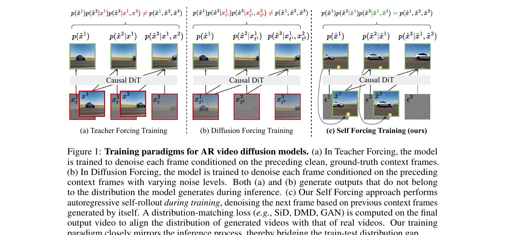
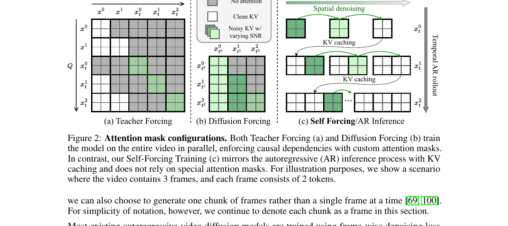
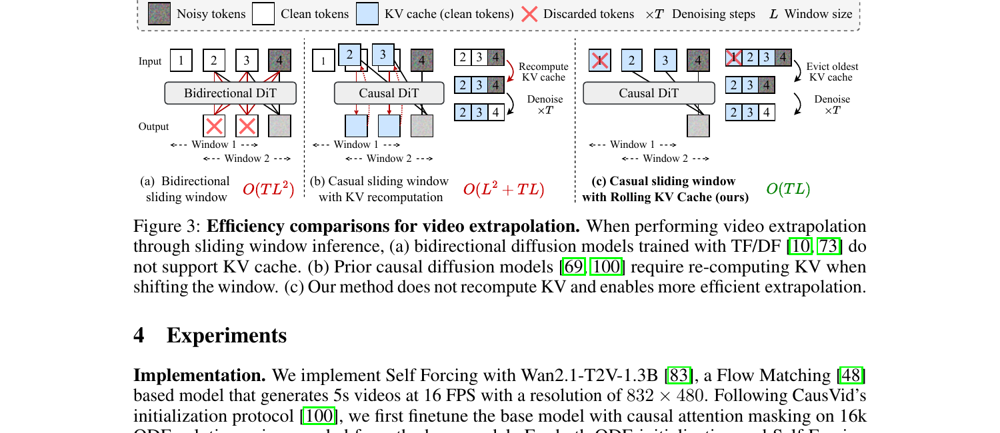
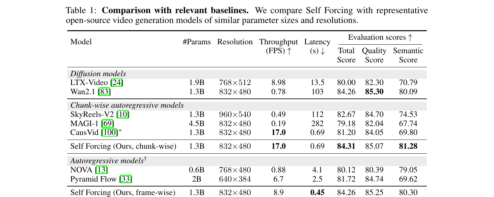
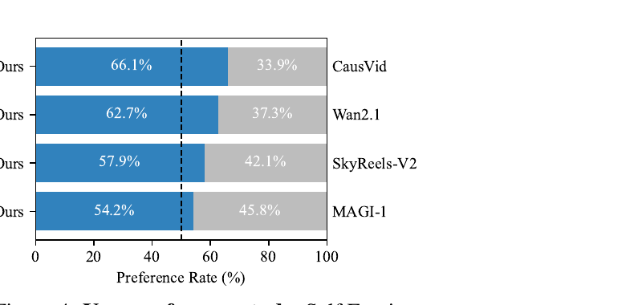
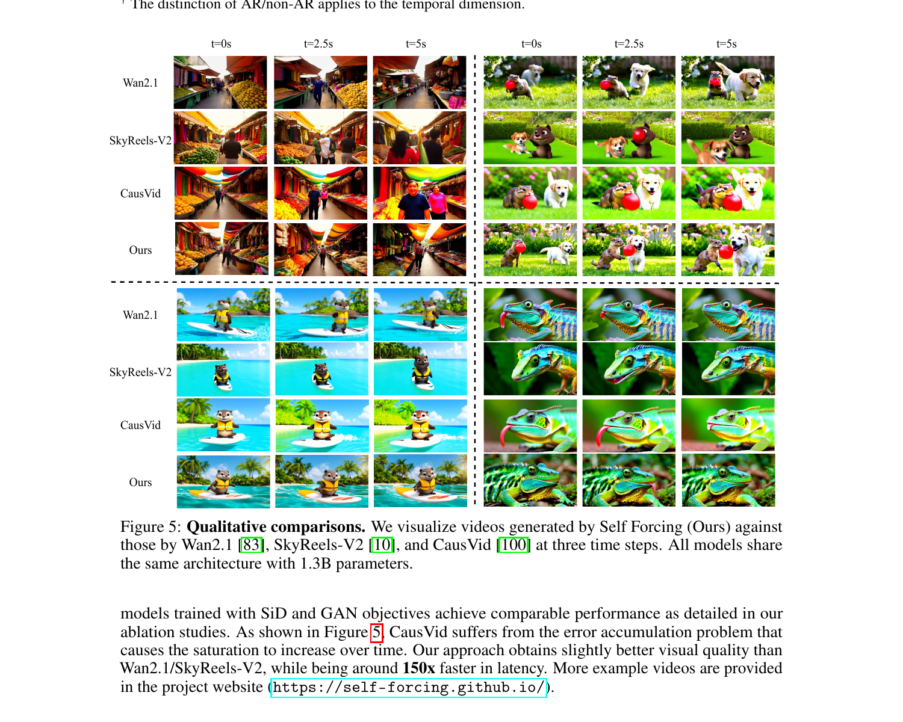

# Self Forcing:
用自展开训练弥合 AR 视频扩散的 train-test 鸿沟

## 1. 出发点 (Motivation)

视频扩散模型现在能生成质量惊人的短视频, 但有一个共同的"原罪": **它们要等所有帧一起 denoise 完, 才能给用户看第一帧**。这跟实时流式、交互式应用 (live streaming、游戏、机器人) 的本质需求 — "下一帧就要立刻显示" — 是矛盾的。Sora、HunyuanVideo、Wan2.1 这些 SOTA 都是 bidirectional DiT, 一次生成所有帧, 用户要等几分钟。

解决方法很自然: 改成**自回归 (AR) 视频扩散**, 一帧 (或一个 chunk) 一帧生成, 配合 KV cache, 第一帧 latency 就能压到亚秒。这条路最近两年有两个主流训练范式 (Figure 1):

- **Teacher Forcing (TF)**: 训练时每一帧基于*干净的 ground-truth 历史*做 denoising。经典 next-token prediction 的扩散版。
- **Diffusion Forcing (DF)**: 训练时每一帧基于*带不同噪声等级的历史*做 denoising。代表作 Diffusion Forcing (Chen 2024)、CausVid (Yin 2024)。

但这两个范式都有同一个老毛病 — **exposure bias**: 训练时模型看的是干净 (TF) 或低噪 (DF) 的历史, 推理时却要 condition on 自己生成的、带瑕疵的历史。这个 train-test 分布失配, 会让生成视频的瑕疵随时间累积, 表现为过饱和、过锐化、人物身份漂移 (CausVid 的典型问题)。Paper 把这点直接挂出来作为靶子:

> "CausVid suffers from a critical flaw that its training outputs (generated via DF) do not come from the distribution the model produces at inference time, therefore the DMD loss is matching the wrong distribution."

Self Forcing (SF) 的核心赌注是: *把训练流程改成跟推理流程一模一样 — 学生自己 rollout, 在自己生成的过去上 condition*。这跟 RNN 时代的 Scheduled Sampling / Professor Forcing (Lamb 2016) 同源, 但搬到了 video diffusion 这个新 setting, 还得解决一个新难题: 这种自回滚训练看起来跟 transformer 的并行训练范式直接冲突 — *怎么算梯度? 怎么训得快?*

<figure>
      
      <figcaption>Fig. 1 — 三种训练范式: (a) Teacher Forcing 用 clean ground-truth 历史, (b) Diffusion Forcing 用带噪 ground-truth 历史, (c) Self Forcing 直接用<strong>模型自己生成的历史</strong>, 配 holistic distribution-matching loss (DMD/SiD/GAN) 匹配整段视频分布。前两个的训练分布跟推理分布不匹配, SF 直接对齐。</figcaption>
    </figure>

所以这篇 paper 的三个贡献清单 (我的话):

1. 提出 **Self Forcing** 训练范式 — 训练时做 AR self-rollout, 用 holistic video-level loss 匹配整段视频分布, 跟推理流程对齐。
2. 用 **few-step diffusion + stochastic gradient truncation** 把"看似不可并行"的训练做成实际比 TF/DF 还快 — 1.5 小时收敛 (64×H100)。
3. 设计 **rolling KV cache**, 让无限长视频外推不需要重算 cache; 配训练时 mask 首 chunk 的小 trick 解决 distribution mismatch 引起的 flicker。

## 2. 方法 (Method) — 高中生友好 + 数学严谨

### 核心思想 (类比)

想象你在教一个学生写连载小说。原来的两种教法:

- **Teacher Forcing**: 每天给学生看"昨天我已经写好的标准答案", 让他根据这个写今天的章节。问题: 真到自己写连载时, 他得根据"自己昨天写的有瑕疵的稿"接着写, 跟训练时的输入分布不一样, 故事就开始崩。
- **Diffusion Forcing**: 每天给学生看"昨天的标准答案被涂改了一点的版本", 让他还原+续写。比 TF 接近真实情况一点, 但还是用的"教师的稿", 不是"学生自己的稿"。

Self Forcing 的做法: **让学生自己从头写起一整篇连载**, 写完一整篇之后, 拿"整篇故事"跟"真实小说的分布"做对比, 整篇打个分。学生写的每一章都是基于他自己上一章, 跟将来真正连载时的情况完全一样。

表面看这很贵 — 学生写一整篇才能更新一次参数, 还得反向传播穿过整篇文章。SF 的工程聪明在三个地方:

1. **少步扩散 (few-step)**: 每一章只让学生写 4 步, 不是 50 步, 大幅缩短反向传播链。
2. **随机梯度截断**: 写一整篇时, 每一章随机选一个 denoising step *s*, **只让这个 step 开梯度**, 其它都 detach。这样每一章的反向传播只有 1 步, 但因为 *s* 是随机的, 长期看每个 step 都收到了梯度信号。
3. **KV cache 不传梯度**: 一章写完后写入 cache, 但梯度不从 cache 里流回前一章 — 用 `torch.no_grad()` 重新 forward 一遍生成 cache。

这三个细节把"看起来不能并行的训练"压回了 transformer 的舒适区, 实测 wall-clock 跟 TF/DF 相当甚至更快 (Fig. 6)。

### 2.1 问题形式化 (Preliminaries)

记视频 $x^{1:N} = (x^1, x^2, \ldots, x^N)$ 是 $N$ 个 latent frames。AR 视频扩散模型用 chain rule 分解联合分布:

每个条件 $p(x^i \mid x^{\lt i})$ 用一个扩散过程建模 — 从纯高斯噪声开始, 在前面 frames 的 condition 下逐步 denoise 出 $x^i$。前向加噪: $x^i_{t_i} = \alpha_{t_i} x^i + \sigma_{t_i} \epsilon^i$, $\epsilon^i \sim \mathcal{N}(0, I)$, $t_i \in [0, 1000]$。

反向 (生成): 训一个网络 $G_\theta(x^i_{t_i}, t_i, c)$ 来预测 noise (或 clean $x^i$), 其中 condition $c$ 是历史 frames。 Frame-wise loss:

—— 翻译: 把第 $i$ 帧加噪到 $t_i$, 让模型预测噪声, MSE 监督。这就是 Teacher Forcing (条件用 clean $x^{\lt i}$) 和 Diffusion Forcing (条件用 noisy $x^{\lt i}_{t_j}$) 共用的训练目标。

架构上 SF 用基于 transformer 的 DiT (Wan2.1-T2V-1.3B), 在 causal 3D VAE 压缩的 latent 空间里跑, 用 **causal attention** 实现 chain rule 分解 (Figure 2 c)。

<figure>
      
      <figcaption>Fig. 2 — 注意力掩码对比: (a) TF 和 (b) DF 都用 block-sparse 掩码在<strong>一整段视频上并行训练</strong>, 强制因果依赖。(c) SF 跟 AR 推理流程一样, 一个 chunk 一个 chunk 串行 denoise, 配 KV caching, <em>不需要特殊 mask</em>, 可以直接用 FlashAttention-3 跑全注意力。</figcaption>
    </figure>

### 2.2 自展开训练 (Self-Rollout via KV Cache)

SF 的核心一句话: 训练时按推理流程, **把模型自己当成数据生成器**, 然后整段打分。具体说, 从 $p_\theta(x^{1:N})$ 采样一个 batch 的视频, 每一帧 $x^i$ 是在已经生成的 $x^{\lt i}$ 的 condition 下做 iterative denoising 得到的:

跟 inference 流程的唯一区别: *训练时 KV cache 也用上*。这是论文创新点, 之前的 AR 模型只有 inference 时才用 KV cache, 训练时都是并行用 block-sparse mask。

给定 few-step 时间表 $\{t_0 = 0, t_1, \ldots, t_T = 1000\}$, 每个 frame $x^i$ 的生成过程:

其中 $f_{\theta, t_j}(x^i_{t_j}) = \Psi\big(G_\theta(x^i_{t_j}, t_j, x^{\lt i}), \epsilon_{t_{j-1}}, t_{j-1}\big)$ —— 翻译: 在 $t_j$ 步预测 clean $x^i$, 再用前向过程加噪回到 $t_{j-1}$ 步, 进入下一个 denoising step。

整个训练循环 (Algorithm 1) 在代码里就一个函数:

<p class="code-source">repo/pipeline/self_forcing_training.py:L60-L130 — Self Forcing 训练主循环 (Algorithm 1)</p>

```python
def inference_with_trajectory(self, noise, initial_latent=None, ...):
    batch_size, num_frames, num_channels, height, width = noise.shape
    # 分 block (每块 num_frame_per_block=3 个 latent frames)
    num_blocks = num_frames // self.num_frame_per_block
    output = torch.zeros([batch_size, num_output_frames, num_channels, height, width], ...)

    # Step 1: Initialize KV cache to all zeros
    self._initialize_kv_cache(batch_size=batch_size, ...)
    self._initialize_crossattn_cache(batch_size=batch_size, ...)

    # Step 3: Temporal denoising loop  ——  按 chunk 时间维度自回滚
    all_num_frames = [self.num_frame_per_block] * num_blocks
    num_denoising_steps = len(self.denoising_step_list)
    # 关键: 为每个 chunk 随机采一个 exit step s ∈ [0, T-1], 跨 rank 同步
    exit_flags = self.generate_and_sync_list(len(all_num_frames), num_denoising_steps, device=noise.device)

    for block_index, current_num_frames in enumerate(all_num_frames):
        noisy_input = noise[:, current_start_frame:current_start_frame + current_num_frames]
        # Step 3.1: 内层是 spatial denoising loop, 4 步
        for index, current_timestep in enumerate(self.denoising_step_list):
            exit_flag = (index == exit_flags[block_index])  # 只在 s 步开梯度
            ...
```

外层是**时间维度的 chunk 自回滚** (line 140), 内层是**空间 denoising 4 步** (line 145)。每个 chunk 随机采一个 exit step $s$ — 这就是 Algorithm 1 第 4 行 `s ∼ Uniform(1, ..., T)` 的实现:

<p class="code-source">repo/pipeline/self_forcing_training.py:L41-L58 — 跨 rank 同步采样 s (DDP 一致性)</p>

```python
def generate_and_sync_list(self, num_blocks, num_denoising_steps, device):
    rank = dist.get_rank() if dist.is_initialized() else 0
    if rank == 0:
        indices = torch.randint(low=0, high=num_denoising_steps,
                                size=(num_blocks,), device=device)
        if self.last_step_only:
            indices = torch.ones_like(indices) * (num_denoising_steps - 1)
    else:
        indices = torch.empty(num_blocks, dtype=torch.long, device=device)
    dist.broadcast(indices, src=0)  # Broadcast 到所有 ranks
    return indices.tolist()
```

注意: 每个 *chunk* 都有自己独立的 $s$ — 这跟 paper Algorithm 1 ("sample s once per sample sequence") 描述的 "**整段视频共享一个 $s$**" 不完全一致 (代码默认 `same_step_across_blocks=False`)。这是 *paper 跟代码的第一处不一致*, 后面 §4 再说。

### 2.3 随机梯度截断 (Stochastic Gradient Truncation)

朴素 backprop 穿过整段自回滚, 显存爆炸: 21 个 latent frames × 4 步 denoising × DiT transformer = 显存不够。SF 的解法是 **每个 chunk 只在随机选中的 $s$ 步开梯度, 其它步全部 `torch.no_grad()`**。然后整段 rollout 完, 在最后那个 chunk 的 $s$ 步输出上算 DMD/SiD/GAN loss, 反向传播只穿过这一步。这就是 Algorithm 1 第 8-14 行 (gradient enabled) vs 第 15-20 行 (gradient disabled) 的区别。

来看代码怎么实现的:

<p class="code-source">repo/pipeline/self_forcing_training.py:L144-L197 — 内层 spatial denoising loop, 只在 exit_flag 步开梯度</p>

```python
for index, current_timestep in enumerate(self.denoising_step_list):
    exit_flag = (index == exit_flags[block_index])
    timestep = torch.ones([batch_size, current_num_frames], ...) * current_timestep

    if not exit_flag:
        with torch.no_grad():    # 不是 s 步 → no grad
            _, denoised_pred = self.generator(
                noisy_image_or_video=noisy_input,
                conditional_dict=conditional_dict,
                timestep=timestep,
                kv_cache=self.kv_cache1,
                crossattn_cache=self.crossattn_cache,
                current_start=current_start_frame * self.frame_seq_length
            )
            next_timestep = self.denoising_step_list[index + 1]
            noisy_input = self.scheduler.add_noise(    # 加噪到下一个 step
                denoised_pred.flatten(0, 1),
                torch.randn_like(denoised_pred.flatten(0, 1)),
                next_timestep * torch.ones([batch_size * current_num_frames], ...)
            ).unflatten(0, denoised_pred.shape[:2])
    else:
        # exit_flag step: 这里开梯度 (除非这个 chunk 在 "尾部 21 frames" 之外)
        if current_start_frame < start_gradient_frame_index:
            with torch.no_grad():
                _, denoised_pred = self.generator(...)
        else:
            _, denoised_pred = self.generator(...)   # 真正开梯度
        break    # 一旦到 exit_flag, 整个内层循环就 break
```

三个关键细节:

1. **所有非-$s$ 步包在 `torch.no_grad()` 里** — 反向传播只穿过 $s$ 这一步, 显存只跟单步成本相关。
2. **到了 $s$ 步就 break** — 不再继续 denoise 后面的步骤。$s$ 步输出的 $\hat{x}_0$ 直接当作这个 chunk 的最终输出, 用来送进 loss。这跟 inference 时跑完全部 $T$ 步不一样, 是一个"训练时的近似"。
3. **梯度只在尾部 21 frames 上算** (`start_gradient_frame_index = num_output_frames - 21`) — 即使中间 chunk 也命中了它的 $s$ 步, 也不开梯度, 只有最后 7 个 chunks 的 $s$ 步会开。这是个非常 aggressive 的截断, paper 没明确提到。

chunk 之间还有个微妙的**梯度阻断**: 一个 chunk 生成完, 用它的 clean 输出去更新 KV cache (Algorithm 1 第 13 行的 `kv^i ← G^{KV}_θ(x̂^i_0; 0, KV)`), *这个写 cache 的 forward 用 `torch.no_grad()`*, 所以下一个 chunk 看到的 KV 是 "纯 tensor, 没 grad fn"。这切断了梯度沿时间维度的传播:

<p class="code-source">repo/pipeline/self_forcing_training.py:L199-L216 — chunk 生成完后, 用 timestep=0 重新 forward 一遍来写 cache (无梯度)</p>

```python
# Step 3.2: record the model's output
output[:, current_start_frame:current_start_frame + current_num_frames] = denoised_pred

# Step 3.3: rerun with timestep zero to update the cache
context_timestep = torch.ones_like(timestep) * self.context_noise
# add context noise (training-time augmentation, default 0)
denoised_pred = self.scheduler.add_noise(
    denoised_pred.flatten(0, 1),
    torch.randn_like(denoised_pred.flatten(0, 1)),
    context_timestep * torch.ones([batch_size * current_num_frames], ...)
).unflatten(0, denoised_pred.shape[:2])
with torch.no_grad():    # 关键: 写 cache 的 forward 无梯度
    self.generator(
        noisy_image_or_video=denoised_pred,
        conditional_dict=conditional_dict,
        timestep=context_timestep,
        kv_cache=self.kv_cache1,
        crossattn_cache=self.crossattn_cache,
        current_start=current_start_frame * self.frame_seq_length
    )
```

这一段对应 paper 里这句:

> "We additionally detach the gradients of the previous frames from the current frame during training by restricting gradient flow into KV cache embeddings."

读者要 get 的关键: SF 在*同一个 chunk 内*反向传播 (空间维度), 但*不*跨 chunk 反向传播 (时间维度)。每个 chunk 看到的历史 KV 都是 tensor, 不带 grad — 学生学的是"在给定的历史下, 怎么生成下一帧", 而不是"怎么调整历史让最终结果更好"。

### 2.4 整体分布匹配损失 (Holistic Distribution Matching)

SF 把**整段视频**当作一个样本, 用 holistic divergence 匹配 $p_\theta(x^{1:N})$ 和 $p_{\text{data}}(x^{1:N})$。Paper 用了三个 loss:

- **DMD**: minimize $\mathbb{E}_t[D_{\text{KL}}(p_{\theta,t} \| p_{\text{data},t})]$ — 用 score difference 做梯度。
- **SiD**: minimize Fisher divergence $\mathbb{E}_{t, p_{\theta,t}}[\|\nabla \log p_{\theta,t} - \nabla \log p_{\text{data},t}\|^2]$。
- **GAN**: Jensen-Shannon divergence via 判别器, 用 R3GAN (relativistic + R1+R2) 配方。

三种 loss 跟 frame-wise loss 的根本区别 — 数学上写成对比:

—— 翻译: TF/DF 是"每一帧的条件分布都匹配, 但历史是从数据采的"; SF 是"整段视频的联合分布匹配, 历史是从模型自己采的"。前者用 frame-wise denoising loss 实现, 后者用整段视频上的 GAN/DMD/SiD 实现。这是 paper 反复强调的最 fundamental 的差别。

来看 DMD 怎么实现。DMD 的 reverse KL 梯度形式 (paper Eq. 2, 也是 DMD2 paper Eq. 7):

—— 翻译: 用 real-score (预训练教师 $f_\phi$ 近似) 减 fake-score (在线学的 critic $f_\psi$ 近似) 作为方向, 把生成样本 $\hat{x}$ 沿着这个方向推。代码里就一个减法:

<p class="code-source">repo/model/dmd.py:L54-L126 — _compute_kl_grad: DMD gradient (Eq. 2 of paper)</p>

```python
def _compute_kl_grad(self, noisy_image_or_video, estimated_clean_image_or_video,
                     timestep, conditional_dict, unconditional_dict, normalization=True):
    # Step 1: Compute the fake score (在线 critic)
    _, pred_fake_image_cond = self.fake_score(
        noisy_image_or_video=noisy_image_or_video,
        conditional_dict=conditional_dict,
        timestep=timestep
    )
    pred_fake_image = pred_fake_image_cond   # (fake_guidance_scale 默认 0)

    # Step 2: Compute the real score (预训练 14B 教师 + CFG)
    _, pred_real_image_cond = self.real_score(noisy_image_or_video=noisy_image_or_video,
                                              conditional_dict=conditional_dict, timestep=timestep)
    _, pred_real_image_uncond = self.real_score(noisy_image_or_video=noisy_image_or_video,
                                                conditional_dict=unconditional_dict, timestep=timestep)
    pred_real_image = pred_real_image_cond + (pred_real_image_cond - pred_real_image_uncond) * self.real_guidance_scale  # CFG=3

    # Step 3: DMD gradient = fake_score - real_score
    grad = (pred_fake_image - pred_real_image)

    # Step 4: 梯度归一化 (DMD paper Eq. 8): 除以 |x - real_pred| 的均值
    if normalization:
        p_real = (estimated_clean_image_or_video - pred_real_image)
        normalizer = torch.abs(p_real).mean(dim=[1, 2, 3, 4], keepdim=True)
        grad = grad / normalizer
    grad = torch.nan_to_num(grad)
    return grad, {...}
```

然后用一个 MSE-form trick 把 gradient 包成 PyTorch 能 backprop 的 loss (paper Eq. 3):

—— 翻译: 让 PyTorch 看到一个 MSE loss, 但其中一项被 stop-gradient 冻住, 这样自动微分算出来的 $\partial \mathcal{L}/\partial \hat{x}$ 正好就是 DMD gradient。代码里 *(original_latent - grad)* 是冻住的"目标":

<p class="code-source">repo/model/dmd.py:L186-L193 — 把 DMD grad 包装成 MSE loss (Eq. 3)</p>

```python
# grad 是上面 _compute_kl_grad 算出来的 (fake_score - real_score) / normalizer
if gradient_mask is not None:
    dmd_loss = 0.5 * F.mse_loss(
        original_latent.double()[gradient_mask],
        (original_latent.double() - grad.double()).detach()[gradient_mask],
        reduction="mean")
else:
    dmd_loss = 0.5 * F.mse_loss(
        original_latent.double(),
        (original_latent.double() - grad.double()).detach(),
        reduction="mean")
return dmd_loss, dmd_log_dict
```

对自动微分链式法则验证一下: $\partial \mathcal{L}/\partial \hat{x} = (\hat{x} - \text{detached target}) = (\hat{x} - (\hat{x} - \text{grad})) = \text{grad}$ ✓。MSE 的导数刚好是 DMD gradient, 而 stop-gradient 保证这个 grad 本身不被对 critic/teacher 反传。这是个非常优雅的 trick, 在 DMD/DMD2 系列工作里反复用。

GAN 的 loss 也很标准 — relativistic R3GAN (paper Eq. 6-7) 加 R1+R2 用 finite difference 估梯度 (paper Eq. 5):

<p class="code-source">repo/model/gan.py:L250-L271 — relativistic GAN D loss + R1 正则 (finite difference)</p>

```python
if not self.relativistic_discriminator:
    gan_D_loss = F.softplus(-noisy_real_logit.float()).mean() + F.softplus(noisy_fake_logit.float()).mean()
else:
    relative_real_logit = noisy_real_logit - noisy_fake_logit
    gan_D_loss = F.softplus(-relative_real_logit.float()).mean()
gan_D_loss = gan_D_loss * self.gan_d_weight    # 默认 1e-2

# R1: 给真样本加 σ=0.05 噪声, 让判别器输出近似不变 (finite-difference 估梯度)
if self.r1_weight > 0.:
    noisy_real_latent_perturbed = noisy_real_latent.clone() + self.r1_sigma * torch.randn_like(...)
    noisy_real_logit_perturbed = self._run_cls_pred_branch(
        noisy_image_or_video=noisy_real_latent_perturbed,
        conditional_dict=conditional_dict, timestep=critic_timestep)
    r1_grad = (noisy_real_logit_perturbed - noisy_real_logit) / self.r1_sigma
    r1_loss = self.r1_weight * torch.mean((r1_grad) ** 2)
```

实测三个 loss 都 work, 但 **DMD 是 data-free 的** (只需要 prompt, 不需要真视频), 而 GAN 需要 70k 真实视频做训练集 — 这是个工程上很重要的差别 (§4 详谈)。

### 2.5 Rolling KV Cache (长视频外推)

训练时 SF 只看 21 latent frames (5 秒视频, 跟 Wan2.1 默认一致)。但用户想看 10 秒、30 秒的视频怎么办? 经典做法是滑动窗口推理, 但有两个问题 (Figure 3):

- **Bidirectional DiT (TF/DF) 不支持 KV cache**, 每滑一个窗口都得全量重算注意力, 复杂度 $\mathcal{O}(TL^2)$ ($T$ 是 denoising 步数, $L$ 是窗口大小)。
- **Causal DiT 之前的做法** (Algorithm 2 of CausVid 等) 是滑动窗口 + 重新计算重叠 chunks 的 KV cache, 复杂度 $\mathcal{O}(L^2 + TL)$。为了控制成本, CausVid 用大 stride 少重叠, 但这样窗口起点的历史 context 锐减, 时间一致性变差。

<figure>
      
      <figcaption>Fig. 3 — 长视频外推效率对比: (a) 双向 DiT 不支持 KV cache, $\mathcal{O}(TL^2)$。(b) 因果 DiT + KV recompute (CausVid 等), $\mathcal{O}(L^2 + TL)$。(c) <strong>SF 的 rolling KV cache</strong>: cache 满了就 evict 最老的 token, 永不重算, $\mathcal{O}(TL)$ 。这跟 LLM 里的 StreamingLLM (Xiao 2024) 思路同源。</figcaption>
    </figure>

SF 的方案是**固定大小的 rolling KV cache**: cache 存最近 $L$ 个 frames 的 KV, 满了就 FIFO 弹出最老的, 再插新的。生成无限长视频, 时间复杂度 $\mathcal{O}(TL)$。Algorithm 2 写得很清楚:

```text
Algorithm 2  Autoregressive Diffusion Inference with Rolling KV Cache
Require:  KV cache size L,  denoise steps {t_1, ..., t_T},  num frames M
1: Initialize Xθ ← [], KV ← []
2: for i = 1, ..., M:
3:   Initialize x^i_{t_T} ~ N(0, I)
4:   for j = T, ..., 1:
5:     x̂^i_0 ← G_θ(x^i_{t_j}; t_j, KV)
6:     if j == 1:
7:       Xθ.append(x̂^i_0)
8:       kv^i ← G^{KV}_θ(x̂^i_0; 0, KV)
9:       if |KV| == L:  KV.pop(0)    ▷ Cache eviction
10:      KV.append(kv^i)
11:    else:
12:      sample ε ~ N(0, I); x^i_{t_{j-1}} ← Ψ(x̂^i_0, ε, t_{j-1})
```

真正的 eviction 逻辑藏在 attention layer 里 (不在 inference pipeline 里):

<p class="code-source">repo/wan/modules/causal_model.py:L203-L235 — CausalWanSelfAttention.forward: rolling KV cache + sink token eviction</p>

```python
kv_cache_size = kv_cache["k"].shape[1]
num_new_tokens = roped_query.shape[1]
# 当 cache 满 且 新 token 是真要被加进来的时候触发 rolling
if self.local_attn_size != -1 and (current_end > kv_cache["global_end_index"].item()) and (
        num_new_tokens + kv_cache["local_end_index"].item() > kv_cache_size):
    # Step 1: 算出要 evict 多少 token (超出 cache 容量的部分)
    num_evicted_tokens = num_new_tokens + kv_cache["local_end_index"].item() - kv_cache_size
    # Step 2: 把"sink 之后的内容"整体左移 num_evicted_tokens (保留 sink_size 个开头 token 不动)
    num_rolled_tokens = kv_cache["local_end_index"].item() - num_evicted_tokens - sink_tokens
    kv_cache["k"][:, sink_tokens:sink_tokens + num_rolled_tokens] = \
        kv_cache["k"][:, sink_tokens + num_evicted_tokens:sink_tokens + num_evicted_tokens + num_rolled_tokens].clone()
    kv_cache["v"][:, sink_tokens:sink_tokens + num_rolled_tokens] = \
        kv_cache["v"][:, sink_tokens + num_evicted_tokens:sink_tokens + num_evicted_tokens + num_rolled_tokens].clone()
    # Step 3: 把新 token 插到 cache 末尾
    local_end_index = kv_cache["local_end_index"].item() + current_end - \
        kv_cache["global_end_index"].item() - num_evicted_tokens
    local_start_index = local_end_index - num_new_tokens
    kv_cache["k"][:, local_start_index:local_end_index] = roped_key
    kv_cache["v"][:, local_start_index:local_end_index] = v
else:
    # cache 没满: 直接 append
    local_end_index = kv_cache["local_end_index"].item() + current_end - kv_cache["global_end_index"].item()
    local_start_index = local_end_index - num_new_tokens
    kv_cache["k"][:, local_start_index:local_end_index] = roped_key
    kv_cache["v"][:, local_start_index:local_end_index] = v
```

代码里有个 `sink_tokens` 概念 — 类似 StreamingLLM 的 attention sink: cache 满了之后, 不是真正 FIFO, 而是**保留开头 sink_size 个 token 不动, 从 sink 之后的位置开始滚**。这是 paper 没明说但代码里有的细节。

但这不解决一个 subtle 的训练-推理失配 — paper §3.4 末尾说:

> "Naive implementation of this mechanism leads to severe flickering artifacts due to distribution mismatch. Specifically, the first latent frame has different statistical properties than other frames: it only encodes the first image without performing temporal compression. The model, having always seen the first frame as the image latent during training, fails to generalize when the image latent is no longer visible in the rolling KV cache scenario."

解法是**训练时就模拟 rolling 场景**: 让模型在 denoise 最后一个 chunk 时, attention mask 限制它*看不到第一个 chunk*。这样模型不会形成对"首帧 latent 总是可见"的依赖, rolling 时 evict 掉首帧 KV 也不会崩。这是个看似不起眼但工程上很关键的小 trick — paper Fig. 7 (Appendix B) 给出了 with/without 的 qualitative 对比, 没这一招的话长视频外推会严重 flicker。

## 3. 结论 (Key Findings)

核心实验在 Table 1 — 同等 1.3B 参数规模、832×480 分辨率下, 跟 6 个 baseline 比 VBench 总分和实时性 (throughput + latency):

<figure>
      
      <figcaption>Tab. 1 — 主结果。SF chunk-wise 17 FPS / 0.69s latency / VBench 84.31, <strong>反超它自己的初始化 baseline Wan2.1-14B (84.26, 但 0.78 FPS / 103s latency)</strong>; 比 CausVid (同参数量, 同 base) 在 quality 和 semantic score 上都明显提升。SF frame-wise 0.45s latency 是所有 baseline 中最低的。</figcaption>
    </figure>

具体数字:

- **vs Wan2.1 教师**: VBench 84.31 vs 84.26 (略胜), **但 latency 0.69s vs 103s = 150× 快**。
- **vs CausVid (同 1.3B, 同 base, 跑速一样)**: VBench 84.31 vs 81.20, quality 85.07 vs 84.05, semantic 81.28 vs 69.80 — semantic 差距 11+ 分非常显著, paper §4 解释为 CausVid 用 DF 训练导致 exposure bias 累积。
- **vs SkyReels-V2 (chunk-wise AR 同类)**: VBench 84.31 vs 82.67, throughput **17 FPS vs 0.49 FPS = 35× 快**。
- **vs MAGI-1 (4.5B AR)**: 1.3B SF 反超大 3 倍的 MAGI-1 (84.31 vs 79.18), latency 0.69 vs 282 秒。

<figure>
      
      <figcaption>Fig. 4 — 用户偏好研究。1003 个 MovieGenBench prompts, 每对视频一个用户选偏好。SF 对所有 baseline 都明显胜出: 66.1% 偏好 vs CausVid, 62.7% vs Wan2.1 (即胜过 14B 教师), 57.9% vs SkyReels-V2, 54.2% vs MAGI-1。</figcaption>
    </figure>

定性对比 (Fig. 5) 给出了 paper 想强调的核心场景: **过曝 / 过饱和的 error accumulation**。CausVid 在 t=5s 时颜色过度饱和 (经典 DF 训练的 exposure bias 累积), Wan2.1 和 SkyReels-V2 视觉质量稍好但都比 SF 慢两个数量级。

<figure>
      
      <figcaption>Fig. 5 — 定性对比 (t=0s, 2.5s, 5s 三个时间点)。最关键的现象在 CausVid 行 — 跟着时间推进, 颜色越变越饱和, 这是 exposure bias 在因果 rollout 里累积的典型表现。SF 没有这个问题。</figcaption>
    </figure>

Ablation (Table 2, paper §4) 也验证了主 claim:

- **SF 在 DMD / SiD / GAN 三种 loss 下都比 TF/DF baseline 强** (chunk-wise: SF-DMD 84.31, TF-DMD 82.32, DF-DMD 82.76; frame-wise: SF-DMD 84.26, DF-DMD 80.56)。
- **frame-wise → chunk-wise 时 baseline 退化更明显**, SF 保持稳定 — frame-wise 多了 21 步 AR rollout (vs chunk-wise 的 7 步), exposure bias 累积更严重, baseline 因此退化, SF 因为训练阶段就在自己 rollout 上学过, 不退化。这是个直接支持 paper "SF 解决了 exposure bias" 这个 claim 的最强证据。
- **训练效率**: Fig. 6 显示 SF per-iteration time 跟 TF/DF 相当, 而 wall-clock 收敛更快, 1.5 小时收敛 (64×H100, DMD)。Paper 给的解释: SF 用 FlashAttention-3 跑全注意力, TF/DF 必须用 FlexAttention 跑 block-sparse mask, 后者实测慢。
- **Rolling KV cache**: 朴素 KV recompute 跑 10s 视频只有 4.6 FPS; SF rolling KV cache 16.1 FPS, 而且配合训练时 mask 首 chunk 不出 flicker artifact。

## 4. 实现细节 (Implementation Notes)

代码里有几个 paper 没明说或说得很简略, 但实战上关键的细节:

- **初始化: 必须先做 ODE distillation, 不能从 base model 直接训。** Self Forcing 的论文里只一句话提了 "Following CausVid's initialization protocol, we first finetune the base model with causal attention masking on 16k ODE solution pairs sampled from the base model."。代码里 `configs/self_forcing_dmd.yaml:L1` 直接写 `generator_ckpt: checkpoints/ode_init.pt` — 必须先跑 `trainer/ode.py` 拿到这个 ckpt 才能跑 SF。这是**必要前提**, 不是可选。
- **梯度只在尾部 21 frames 上算** (paper 没提): `repo/pipeline/self_forcing_training.py:L137` 写死 `start_gradient_frame_index = num_output_frames - 21`。即使中间 chunks 命中了 exit step, 也不开梯度。这意味着对长视频外推训练时, 只有最后 5 秒的 chunks 拿到 supervision。一个 paper 没解释的硬编码 magic number。
- **`same_step_across_blocks` 默认 `False`** (代码 `repo/pipeline/self_forcing_training.py:L37`): 每个 chunk 独立采 $s$。但 paper Algorithm 1 第 4 行明明写 `s ∼ Uniform(1, ..., T)` 然后整段视频共享 — *跟代码默认行为不一致*。Paper 跟代码的隐式差异。
- **4-step uniform schedule [1000, 750, 500, 250]**: 代码 `configs/self_forcing_dmd.yaml:L7-L12`。`warp_denoising_step: true` 会把这些值映射到 scheduler 的对应 timestep, 用的是 flow matching 的 shifted schedule。
- **Flow matching timestep shift k=5**: `timestep_shift: 5.0`, 对应 $t'(k, t) = (kt/1000) / (1 + (k-1)t/1000) \cdot 1000$ — 把 timestep 推向高噪声端。这是 Wan2.1 base 的标准配置, SF 没改。
- **DMD critic update ratio = 5**: `dfake_gen_update_ratio: 5` — fake critic 每跑 5 次更新一次 generator。这跟 GAN 训练里 D vs G 的更新平衡同源。
- **EMA generator (decay 0.99) 从 step 200 开始**: `ema_weight: 0.99, ema_start_step: 200`。最终 inference 用 EMA 权重, 不是 raw generator 权重 — 这是 DMD 系列工作的标准做法, 通常能提 1-2 个 VBench 点。
- **FSDP hybrid_full sharding**: `sharding_strategy: hybrid_full` — 跨节点 full sharding, 节点内 ZeRO-3, 适合 64 GPU × 80GB 这种规模。Generator + real_score(14B) + fake_score(1.3B) 都用 FSDP 切, 不然 14B teacher 装不下。
- **Real score CFG = 3, fake score CFG = 0**: `configs/self_forcing_dmd.yaml:L18`。教师用强 CFG 给学生 "更尖锐的目标分布", critic 不用 CFG 因为它本来就在学生当前分布上学。*注意 SiD 和 GAN 完全不用 14B 教师* — Real score 用 1.3B 的预训练 base (paper Table 3 第一行)。SiD/GAN 是 data-driven 或 self-distill 类的训练, DMD 是 teacher-distillation 类。
- **GAN 用 batch size 768 (DMD/SiD 只用 64)**: paper §A 末尾承认 "We also adopt a large batch size of 768 for training stability"。GAN 不稳, 用大 batch 平均。
- **R1 / R2 σ = 0.05, λ = 30**: 有限差分估梯度的扰动幅度, 加正则权重很大 (30) — R3GAN 论文的标准配方。
- **data-free vs data-driven**: DMD / SiD *不需要*真实视频, 只需要 prompts。GAN 需要 70k 真视频 (用 14B base 生成的合成数据)。这是工程上很关键的差别 — DMD 可以把任意 video 扩散模型转成 AR, 不需要原始训练数据。
- **训练时 mask 首 chunk**: paper §3.4 末尾提了, 但代码里没看到独立 flag。实际通过 `local_attn_size = 21` (`wan/modules/model.py:L580` 和 `causal_model.py:L72`) 间接实现 — 最后一个 chunk 看不到第一个 chunk 之外的 token。
- **代码 vs 论文不一致的地方** (整理):
        <ul>
          <li>Algorithm 1 第 4 行写 $s$ 在整段视频共享, 代码默认 <code>same_step_across_blocks=False</code> 每 chunk 独立采 $s$。</li>
          <li>Algorithm 1 第 13 行的 cache write forward 用 timestep=0, 代码里加了 <code>context_noise</code> 可调 (默认 0)。</li>
          <li>21-frame gradient window 是硬编码 magic number, paper 完全没提。</li>
        </ul>

把训练 loop 里梯度截断那段最关键的代码再放一遍 (上面给过, 这里强调 paper Algorithm 1 第 8-14 行的实现):

<p class="code-source">repo/pipeline/self_forcing_training.py:L155-L194 — 只在 exit_flag 步开梯度的核心逻辑</p>

```python
if not exit_flag:
    with torch.no_grad():
        _, denoised_pred = self.generator(...)
        # 加噪到下一个 denoising step, 准备进入下一轮
        noisy_input = self.scheduler.add_noise(...)
else:
    # 关键: 命中 exit_flag 步, 且 chunk 在尾部 gradient window 内, 才真的开梯度
    if current_start_frame < start_gradient_frame_index:
        with torch.no_grad():
            _, denoised_pred = self.generator(...)
    else:
        _, denoised_pred = self.generator(...)   # 开梯度的唯一调用
    break    # 进入下一个 chunk
```

## 5. 批判性总结 (Critical Assessment)

### 优点

- **问题诊断准确, 解法干净**。 "AR 模型有 exposure bias" 是 RNN 时代就知道的老问题, 但 video diffusion 这条赛道之前都在用 TF/DF 这套 frame-wise loss, 没人正面打这个 bug。SF 不是新概念 (Scheduled Sampling 2015 / Professor Forcing 2016 都是同源), 但在 video diffusion 这个新 setting 里第一个证明了"训练 = 推理"是可行的, 而且效果直接反超教师。
- **工程上把"看似不能并行"做成"实测一样快"**。 stochastic gradient truncation (随机一个 step 开梯度) + few-step distillation + KV cache 梯度断流 — 这三个工程 trick 组合起来, paper Fig. 6 显示 wall-clock 跟 TF/DF 相当, 1.5 小时就收敛。这是把一个理论上很贵的训练流程做实用化的关键。
- **data-free 设置 (DMD/SiD) 实用价值高**: 不需要真实视频, 只需要 prompts, 就能把任意预训练 video diffusion 转成因果 AR — 大大降低了部署门槛。
- **Real-time 定义讲究**: §4 明确反对"只看 throughput 不看 latency"的常见做法, 强调 first-frame latency 才是流式应用的关键。SF frame-wise 0.45s latency 是所有 baseline 中最低的, 是个清晰的实用 win。
- **三种 holistic loss (DMD/SiD/GAN) 都验证**, 而且 paper 诚实地报了 SiD 在 semantic score 上比 DMD 弱一点 — 没 cherry-pick 最好的数字遮掩 trade-off。

### 不足 / 疑点

- **"梯度只在尾部 21 frames 上算"的硬编码完全没解释**。 代码里 `start_gradient_frame_index = num_output_frames - 21` 写死, 意味着即使训练时让模型 rollout 更长 (paper 默认就是 21, 但*如果你想训更长的视频*), 实际拿到 supervision 的只是最后 5 秒。这对长视频外推质量有直接影响 — Limitation 部分 paper 自己承认 "quality degradation remains observable when generating videos substantially longer than those seen during training", 但没把这个截断 window 跟现象联系起来。
- **同步 vs 不同步 $s$ 的差异没 ablation**。 Algorithm 1 写整段视频共享 $s$, 代码默认每 chunk 独立 — 但 paper 没解释为什么选独立, 也没量化两者的差异。这是个潜在的 paper-vs-code 不一致。
- **Long-video 外推退化没量化**。 paper 只在 Appendix Fig. 7 用*一张定性图*展示了 rolling KV cache 的工作效果, 没给"训练时 21 frames vs 推理时 100 frames"在 VBench 上的真实退化曲线。 SkyReels-V2/MAGI-1 这种主打长视频的 baseline 在长 horizon 上的对比也缺失。
- **DMD 严重依赖 14B 教师的质量**。 1.3B SF 反超 14B Wan2.1 这个 headline 数字, 严格说要打个折扣: SF 的 real score 用的就是 14B Wan2.1, 学生本质上是从 14B 教师的 score function 学的, 不是"自己悟出来的"。这种"learner 借了 teacher 的 inference-time CFG"的胜出, 跟"learner 真比 teacher 强"是两件事 — paper 没明确区分。
- **Causal attention base model 仍是个 hidden cost**。 必须先做 16k ODE pairs 的 causal attention finetune 才能跑 SF — 这本身就是个挺贵的预处理步骤, paper 用一句话带过, 但实际复现门槛挺高。
- **稳定性细节大量 implicit**: 比如 R1 σ=0.05、context_noise 默认 0、EMA 从 step 200 开始 — 这些数字对训练稳定性都有影响, paper 一笔带过。GAN 训练不稳所以用 768 batch 这个细节也是放在 appendix。
- **跟 RL post-training 的边界没讲清**。 paper §5 类比"language modeling 的 parallel pretraining + sequential RL post-training", 但 SF 的 sequential loss 是 DMD/SiD/GAN distribution matching, *不是* reward-based RL — 这两者本质不同 (distribution matching 是 supervised, RL 是 reward signal)。 paper 这层类比太松散。

### 适用 vs 不适用

- ✅ **实时流式短视频生成 (≤ 训练长度)**: 17 FPS / 0.69s latency, 1.3B 单 H100, 这是 paper 的 sweet spot, 应该比所有竞品都好。
- ✅ **把现有双向 video diffusion 转因果 AR (DMD 设置 data-free)**: 不需要原始训练数据, 只需要 prompts, 1.5 小时 64×H100 — 工程价值高。
- ✅ **蒸馏成本敏感的场景**: 比 long-horizon RL fine-tuning 便宜, 比从头训因果模型快得多。
- ❌ **超长视频 (远超训练长度)**: paper 明说仍有退化, rolling cache 不解决根本问题。SkyReels-V2 / MAGI-1 这种主打 infinite length 的工作仍有空间。
- ❌ **纯 RL post-training**: SF 是 distribution matching, 不是 reward-driven, 不能直接用 video reward model 调。
- ❌ **没有强 base 的场景**: DMD 需要 14B 教师做 real score, 如果你只有小模型, 不适用。
- ❌ **架构限定**: paper 实现绑定 Wan2.1 / CausVid 这套 DiT + 3D VAE, 移植到其它架构需要重写不少 attention 层。

### 进一步阅读

- **CausVid** (Yin et al. 2024, [arxiv:2412.07772](https://arxiv.org/abs/2412.07772)) — SF 的直接对照, 用 DF + DMD 蒸馏。Paper 反复把它当主要 baseline。
- **Diffusion Forcing** (Chen et al. NeurIPS 2024) — DF 的提出工作。
- **Professor Forcing** (Lamb et al. NeurIPS 2016) — SF 在 RNN 时代的祖先, 同样用 GAN-style loss 弥合 train-test gap。
- **DMD / DMD2** (Yin et al. NeurIPS 2024) — distribution matching distillation, SF 直接套用了 DMD 的 reverse KL gradient 形式。
- **StreamingLLM** (Xiao et al. ICLR 2024) — rolling KV cache + attention sink 的 LLM 原版, SF 在视频域复现。
- **MotionStream** (本 paper 作者后续) — SF 的 follow-up, 进一步把交互式 motion control 加进来, 29 FPS。Self-Forcing 项目页有链接。
- **Starchild-1** ([本博客的另一篇精读](../starchild-1-2026/index.html)) — Odyssey 用 SF 思想做音视频联合因果蒸馏的工作, 揭示了多模态 cache 设计 (非对称 sink token、cross-modal cache) 上的新设计点。

<footer>
    <hr/>
    <p class="meta">Read on 2026-05-22 · Generated with the reading-papers skill</p>
  </footer>
