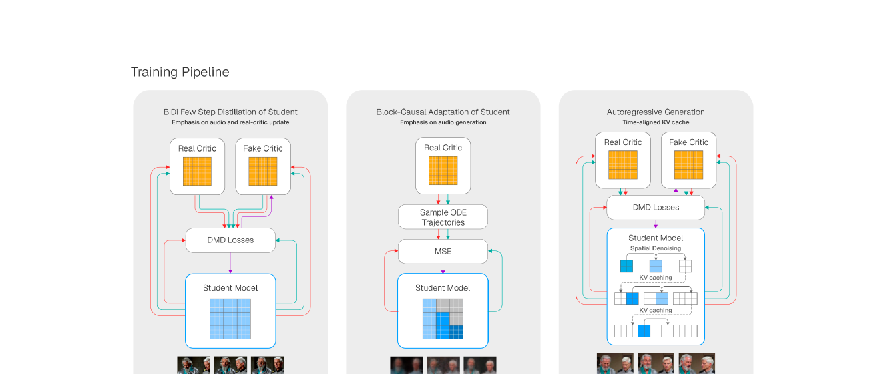
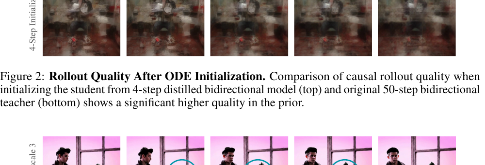
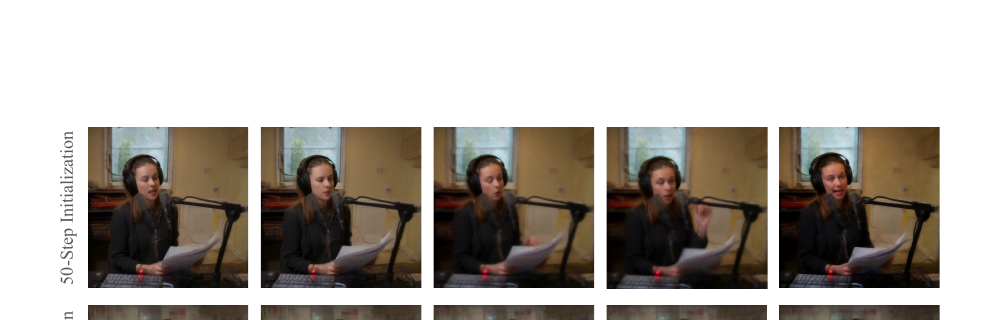
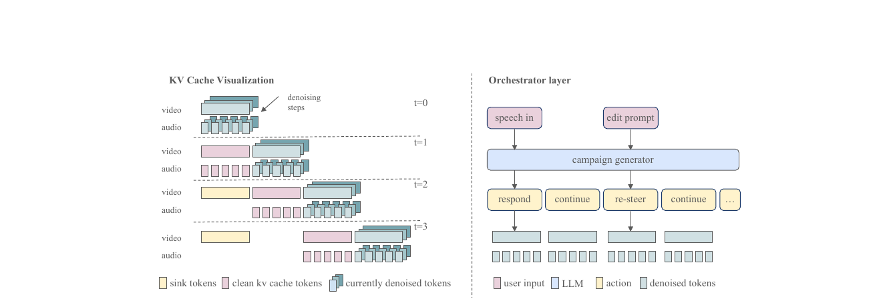
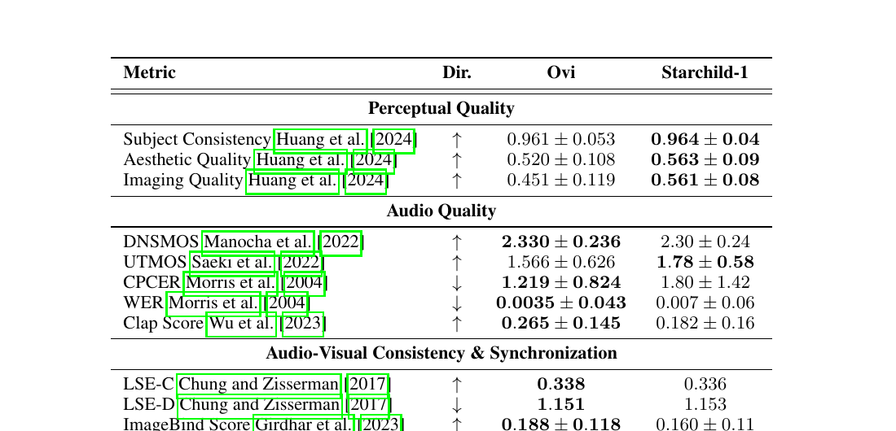
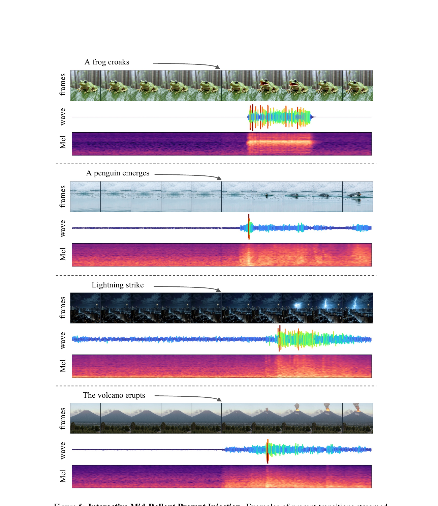
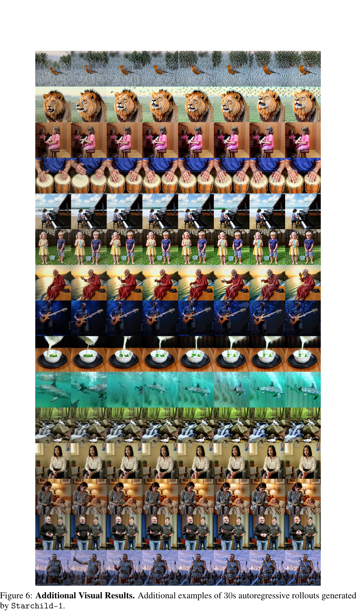

# Starchild-1:
把双向音视频扩散教成 24fps 流式世界模型

## 1. 出发点 (Motivation)

过去一年, 视频生成有三条平行的发展线: **双向 → 因果**、**视频 → 音视频联合**、**离线 → 交互**。每条线都有代表作:

- **双向 → 因果:** Diffusion Forcing (Chen 2024) / CausVid (Yin 2025) / Self-Forcing (Huang 2025), 把双向扩散教师蒸馏成支持 KV-cache 流式生成的因果学生。
- **视频 → 音视频联合:** Veo 3 / Ovi / Harmony / LTX-2 / ALIVE / MOVA, 把视频扩散扩展到同步音频。架构上分单塔 (Apollo, JavisDiT++) 和双塔 (Ovi, LTX-2) 两派。
- **离线 → 交互:** Genie-3 (DeepMind 2025) / Hunyuan-Gamecrafter-2 / LingBot, 引入 action 条件实现闭环 rollout。

但这三条线 *从未在一个模型里同时打通*。已有的音视频联合模型都是双向、离线、固定时长的 (Veo 3、Ovi 都生成 5-10 秒固定 clip); 已有的交互世界模型都是纯视觉的 (Genie-3 没声音, GameCrafter 没音频对齐)。Starchild-1 的赌注是: *把三条线同时打通的工程难度, 不在架构, 而在训练管线本身。*

具体说, 把双向音视频扩散变成因果交互模型, 会撞到三个新问题, 每一个都不是 video-only 工作能直接抄过来的:

1. **多模态优化失衡。** 视频是高维空间+时间信号, 音频是低维密集时序信号; 标准 DMD 蒸馏会让训练偏向视觉, 音频质量退化。
2. **跨模态错误传播。** 自回归 rollout 里, 任何一边 (视频抖动或音频漂移) 都会通过 cross-attention 喂回另一边, 形成正反馈, 把音画同步打散。这在 video-only 因果模型里不存在。
3. **条件粒度不匹配。** 视频天然有 "下一帧可预测性" 的强空间锚点 (场景大致不变); 音频如果取音素 (phoneme) 粒度, 下一个音素几乎独立于前一个, 让因果预测变得 ill-conditioned。

Starchild-1 的贡献清单(用我的话):

1. 一套 **音频感知的因果蒸馏管线**: DMD 阶段拉高 audio params 学习率 + fake-critic 学习率, 平衡双模态优化。
2. 一个 **非对称音视频 KV-cache 设计**: video 保留 sink tokens, audio 不保留; cross-attention 的 KV 也跨模态缓存。
3. 一个 **"提示词转换不重置 cache" 的发现**: 与之前因果视频工作的常规操作相反, 这里强行 reset 反而会通过 cross-attention 让音视频协同 drift。
4. 一个 **外部编排层 (Campaign generator)**: 用一个 LLM 把用户输入翻译成 chunk-aligned 的 action 序列, 解决 "用户随便打字 → 模型每 2.5s 要消化一段语音/场景描述" 的工程衔接。
5. 对 "在交互场景里, 哪些指标其实没意义" 的批判性反思: VBench / LSE / ImageBind 都是为离线 clip 设计的, 跑不出 30s 交互式 rollout 的真实能力。

注意: 这是一篇 **技术报告而非学术论文**。没有完整 ablation, 唯一的定量表只跟自家 base model Ovi 比, 全部交互能力都是 qualitative example。读的时候要把它当工程经验贴而非 method paper — 实操细节非常密, 但"为什么 work"基本停留在 "we hypothesize" / "we observe" 层面。

<figure>
      
      <figcaption>Fig. 1 — Starchild-1 训练管线 (paper Fig. 1)。左: 把 50 步双向教师 (Ovi) 蒸馏成少步双向学生, 强调音频和 real-critic 的更新。中: 通过 ODE 轨迹监督把双向学生转成块因果学生 (sample → MSE)。右: 在 KV-cache 自回滚下做最后阶段适配, 加入时间对齐的多模态缓存。注意中间阶段没有 fake critic (只有 ODE trajectory + MSE), 右阶段又把 fake critic 加回来 — 这是为什么 paper 多次强调 "real critic 的优势" 才是真正的训练信号。</figcaption>
    </figure>

## 2. 方法 (Method)

### 核心思想 (类比)

想象一个交响乐团:

- **双向音视频教师 (Ovi)** 像录音棚里的乐团: 整段曲子写好谱子, 一遍录完, 后期还可以剪辑。给你 5 秒高品质音画同步素材。
- **因果交互学生 (Starchild-1)** 像现场即兴演奏: 指挥 (用户) 随时甩出新提示 "现在切下雨"、"现在让她说一句话", 乐团必须 *下一拍* 就跟上, 而且要跟前面演的对得上。

把录音棚乐团教成现场即兴乐团, 最难的不是给乐手换乐器 (架构改造), 而是改训练方式: 整段 → 一段段, 全局 → 局部, 离线 → 流式。Starchild-1 三个阶段在做的事:

1. **少步蒸馏:** 让原来要排练 50 遍的乐团, 4 遍就能录好一段 (DMD)。但发现弦乐组 (audio) 老是被铜管组 (video) 盖过, 所以拉高了弦乐的练习强度。
2. **因果适配:** 把"整段录完再听"改成"一段一段录, 每段只能听前面录的"。用原乐团 (双向教师) 同步排练的录音当参考 (ODE 轨迹), 让现场乐团模仿。
3. **KV-cache 自回滚:** 真上场了, 让乐团自己演自己评 (self-rollout) — 记住前面演过的 (KV-cache), 但 video 部分多留几个"基准音"(sink token) 防止跑调, audio 部分不留 (留了反而僵硬)。

关键洞察: **音画错误是会互相传染的。** 现场即兴时, 弦乐走音 → 通过指挥的耳朵 (cross-attention) 影响铜管 → 铜管乱了又传回弦乐 → 整个崩盘。所以"防止任一边崩"比"把任一边做到极致"更重要 — 这也是为什么 paper 说"视觉感知质量更高的 ODE 轨迹反而蒸馏不出更稳的 rollout"。

### 2.1 问题形式化

把"下一状态预测"从纯视觉扩展到联合音视频。在时刻 $t$, 状态是

其中 $v_t$ 是视觉 latent frames 的一个 chunk, $\omega_t$ 是音频 latent frames 的一个 chunk。注意两个 chunk 的"长度"是不同的: 因为采样率不同, 视频 chunk 用 15 latent frames, 音频 chunk 用 75 latent frames, 但它们覆盖 *同样的物理时间* (≈2.5s @ 24fps)。

action $a_t$ 是统一的 text 表示, 覆盖视觉控制信号 / 语音内容 / 环境音 / 音乐描述 (用类似 `<S>...</S>`、`<AUDCAP>...</ENDAUDCAP>` 这种 tag 切分)。world model 是:

—— 翻译: 给定上一个 action, 初始视觉状态 $v_0$ (整个 rollout 的"起点帧"), 以及过去 $L$ 个 chunk 的历史 $O_{t-1} = \{o_i\}_{i=t-L}^{t-1}$, 预测下一个 chunk 的 (视觉 latent, 音频 latent)。$L$ 是上下文窗口长度。

实际实现里, "history $O_{t-1}$" 不是把过去 chunk 重新喂一遍, 而是以 **KV-cache** 的形式存在: 视频自注意力 KV-cache + 视频跨注意力 KV-cache + 音频自注意力 KV-cache + 音频跨注意力 KV-cache, 一共四组 cache。这是为什么 paper 反复强调 "cache 设计" 是核心 — 因为它就是 world state 的实际载体。

### 2.2 基础: Ovi 双塔架构

Starchild-1 的 base model 是 Ovi (Low et al. 2025), 一个 **对称双塔扩散 transformer**: 音频塔和视频塔各一个 WanModel 实例 (Wan2.2 video DiT 改的), 每一层之间通过 *双向 cross-attention* 连接。Cross-attention 还专门为 fusion 注入了独立的 K/V projection。

<p class="code-source">repo/ovi/modules/fusion.py:L9-L53 — FusionModel 构造: 两个 WanModel 实例 + 每个 block 注入 fusion 用的 K/V projection</p>

```python
class FusionModel(nn.Module):
    def __init__(self, video_config=None, audio_config=None):
        super().__init__()
        if video_config is not None:
            self.video_model = WanModel(**video_config)
        if audio_config is not None:
            self.audio_model = WanModel(**audio_config)

        if has_video and has_audio:
            assert len(self.video_model.blocks) == len(self.audio_model.blocks)
            self.num_blocks = len(self.video_model.blocks)
            self.inject_cross_attention_kv_projections()

    def inject_cross_attention_kv_projections(self):
        for vid_block in self.video_model.blocks:
            vid_block.cross_attn.k_fusion = nn.Linear(vid_block.dim, vid_block.dim)
            vid_block.cross_attn.v_fusion = nn.Linear(vid_block.dim, vid_block.dim)
            vid_block.cross_attn.pre_attn_norm_fusion = WanLayerNorm(vid_block.dim, ...)
            vid_block.cross_attn.norm_k_fusion = WanRMSNorm(vid_block.dim, ...) ...
        for audio_block in self.audio_model.blocks:
            audio_block.cross_attn.k_fusion = nn.Linear(audio_block.dim, audio_block.dim)
            audio_block.cross_attn.v_fusion = nn.Linear(audio_block.dim, audio_block.dim)
            ...
```

每个 fusion block 的 forward (Ovi `fusion.py:L161-L240`) 是: 各自做 self-attention → 然后 *双向* 跨模态 cross-attention (音频 query → 视频 K/V, 视频 query → 音频 K/V), 再各自走 FFN。Starchild-1 没动这套架构, 但它的 **第三阶段** (KV-cache rollout) 必须把这四组 cache (视频 self / 视频 cross / 音频 self / 音频 cross) 全都缓存下来才行 — 而双向 cross-attention 在因果模型里要改成 "我只能 attend 到对方已经生成的 chunk", 这就是 §4.3 "cross-attention 也要因果化" 的工程内涵。

另一个关键设计是 **modality-specific RoPE**: 视频用 3D RoPE (frame / height / width), 音频用 1D RoPE (只有时间维度), 而且各有自己的 `temporal_rope_scaling_factor` 来对齐采样率差异:

<p class="code-source">repo/ovi/modules/model.py:L669-L687 — WanModel.set_rope_params: 音频走 1D RoPE, 视频走 3D RoPE</p>

```python
def set_rope_params(self):
    dim = self.dim
    num_heads = self.num_heads
    d = dim // num_heads

    if self.is_audio_type:
        # audio: 1D temporal RoPE only
        self.freqs = rope_params(1024, d - 4 * (d // 6),
                                 freqs_scaling=self.temporal_rope_scaling_factor)
    else:
        # video: 3D RoPE = temporal + height + width
        self.freqs = torch.cat([
            rope_params(1024, d - 4 * (d // 6)),  # temporal
            rope_params(1024, 2 * (d // 6)),      # height
            rope_params(1024, 2 * (d // 6))       # width
        ], dim=1)
```

这就是 paper §4.1 说的 "modality-specific RoPE scaling accounts for the differing temporal resolutions" 的具体含义: 音频 RoPE 的频率乘了一个 `temporal_rope_scaling_factor`, 这个因子在因果适配阶段需要重新校准, 让 75 个音频 latent frames 对应到 15 个视频 latent frames 的同一段物理时间。

### 2.3 阶段一: 少步双向蒸馏 (DMD)

第一阶段沿用 CausVid 的 **分布匹配蒸馏 (DMD)** 思路 — 用一个 "fake critic" 估学生分布的 score, 一个 "real critic" 估教师分布的 score, 学生网络梯度方向是 "把 fake 推向 real":

—— 翻译: 让 4-step 学生生成的样本分布去匹配 50-step 教师分布。fake critic 在线学学生当前生成的分布, real critic 是冻结的教师 (Ovi 50-step)。

Starchild-1 对这套标准流程做了两个修改:

**(a) 拉高 audio params 学习率。** 默认情况下整网用同一个 LR; 但视觉是 (帧×高×宽×channels) ≈ 几十万 token 一个 chunk, 音频是 (75×16) ≈ 1200 token 一个 chunk。梯度量级悬殊, 默认 LR 下 audio 部分几乎不更新。Paper 没给具体倍数 — 一个 ad hoc 修改, 但承认是经验试出来的。

**(b) 拉高 fake critic 学习率。** 这个修改背后的 hypothesize 是: 联合音视频蒸馏让学生分布在两个模态上同时漂移, fake critic 必须更快追上学生当前的分布, 才能给出有效梯度。Critic 是 score-matching 网络, 学慢了相当于给学生一个过时的对照, 训练就发散。

<figure>
      
      <figcaption>Fig. 3 (paper) — 教师生成 ODE 轨迹时, audio classifier-free guidance scale 从默认的 3 拉到 7, 唇形和讲话节奏的对齐显著加强。这是个 "强化条件信号" 的操作: 教师生成的样本里, 文本→音频的因果关系变得更明显, 蒸馏出来的学生才学得到这个关系。</figcaption>
    </figure>

注意这里 audio CFG 不是 inference 阶段调高, 而是 **生成蒸馏用的 ODE 轨迹时**调高 (相当于教师"用最强的条件信号给学生抄答案")。Ovi 默认配置里 audio CFG = 3, video CFG = 4:

<p class="code-source">repo/ovi/configs/inference/inference_fusion.yaml:L9-L10 — Ovi 默认 CFG (Starchild-1 蒸馏时把 audio 改到 7)</p>

```yaml
sample_steps: 50
audio_guidance_scale: 3.0
video_guidance_scale: 4.0
slg_layer: 11   # skip-layer guidance: which transformer block to skip in the negative branch
```

<p class="code-source">repo/ovi/ovi_fusion_engine.py:L314-L317 — CFG 公式: audio 和 video 分别用不同 guidance scale</p>

```python
# Apply classifier-free guidance
pred_video_guided = pred_vid_neg[0] + video_guidance_scale * (pred_vid_pos[0] - pred_vid_neg[0])
pred_audio_guided = pred_audio_neg[0] + audio_guidance_scale * (pred_audio_pos[0] - pred_audio_neg[0])
```

这段是 Ovi 的双 CFG 公式 — 经典 CFG 的双模态扩展。Starchild-1 的修改是把 `audio_guidance_scale` 在生成蒸馏 ODE 轨迹时设为 7, 同时把 fake critic 用的 `slg_layer` (skip-layer guidance) 也专门优化过 (§4.4 末尾)。

### 2.4 阶段二: 块因果掩码适配

第二阶段把双向学生改成 **块因果** (block-causal) 学生。每个 chunk 内部仍然全注意力 (chunk 内未来 token 可以看到 chunk 内过去), 但 chunk 之间是因果的 (chunk t 只能 attend 到 chunk 0..t-1)。这是因果视频生成的标准模式 (CausVid / Self-Forcing 都这样)。

训练目标: 从教师 (50-step Ovi 双向) 采 ODE 轨迹 (用 UniPC 求解器), 让学生在选定 denoising steps 复现教师的 clean latent 预测。Loss 是 MSE。

但这里有几个 audio-specific 的关键决策:

**(1) 学生从"少步双向"初始化, 而不是从"50-step 双向"。** 这是 §4.3 反复强调的最重要发现 (Figure 2)。直接从 50-step 教师初始化, rollout 会 collapse; 从 4-step 学生初始化, 训练稳定。Paper 的解释: 把 "离线 → 流式" 的总优化问题分成两步 (蒸 + 因果化), 减少了 mismatch 跨模态传染的可能。

<figure>
      
      <figcaption>Fig. 2 (paper) — 因果学生从 4-step 双向初始化 (上) vs 从 50-step 双向直接初始化 (下) 的 rollout 质量对比。下面那行明显退化、糊掉。这是个非平凡的工程经验 — 在 video-only 工作里 (CausVid 等) 直接从 50-step 教师初始化通常没问题, 但在联合音视频设定下, 阶段一的 "少步压缩" 是稳定性的前提。</figcaption>
    </figure>

**(2) Audio CFG 在 ODE 轨迹生成时拉到 7。** 见上一节 Figure 3 — 这让教师轨迹里"文本→音频"的因果关系更显著, 学生才学得到。

**(3) "好看的轨迹 ≠ 好用的轨迹"。** Paper §4.3 末尾说: 视觉感知质量更高的 ODE 轨迹不一定蒸馏出更稳的 rollout。作者的假设是, "视觉更锐利"对应"局部更优化但时间上不稳定的 latent dynamics", 后者反而更难自回归地蒸馏。在多模态设定下还多了一层: rollout 稳定性更依赖于"跨模态时间对齐的一致性", 而不是单模态的短程感知质量。

**(4) 优化器细节: MSE loss + AdamW + 关掉 weight decay。** Paper 明确说这三个组合很关键 — "minor optimization choices significantly affect the stability of causal adaptation"。这是个非常诚实的承认: 蒸馏管线对超参极为敏感。

**(5) 音频状态粒度: 单词级而非音素级。** 这是 §4.4 末尾的一个深刻发现。如果在音素或子音素级别切 chunk 边界, "下一个音素 given 上一个音素" 的预测几乎是 ill-posed (英语音素转移近乎 i.i.d.), 学生没法 condition on prior aural state 学到任何东西。提到单词或短句粒度后, 前后文有了语义连续性, causal predictiveness 就 well-conditioned 了。

### 2.5 阶段三: KV-cache 自回滚适配

第三阶段沿用 Self-Forcing (Huang 2025) 思想: 让模型在 **自己生成的 KV-cache** 上做训练, 而不是教师轨迹。这是为了对齐 train/inference 分布 (training time 见到的 KV 都来自教师, inference 时见到的 KV 来自自己, 这就是经典 exposure bias)。

<figure>
      
      <figcaption>Fig. 4 (paper) — 左: 自注意力 KV-cache 的时间演化 (cross-attention 同样的模式)。t=0 时只有当前正在 denoise 的 token; t=1 开始 cache 之前 chunk 的 clean 部分; t=2 开始, video 保留了 sink tokens (黄), audio 不保留。右: orchestrator 把用户输入 (speech in / edit prompt) 喂给 campaign generator (一个外部 LLM), 输出一串带语义标签的 action (respond, continue, re-steer, ...), 在 chunk 边界处异步注入到 cross-attention。</figcaption>
    </figure>

核心设计有四:

**(a) Self + Cross-attention 都缓存。** 不光自注意力 KV 缓存, cross-attention 跨模态 K/V 也缓存 — paper 说这显著改善多模态时间一致性。直觉: cross-attention 里, video query 关注的不是当前 chunk 的 audio, 而是过去几个 chunk 的 audio, 把这部分 K/V 缓存住可以省算力, 也能让模型更直接地"看到"自己之前生成的对方模态。

**(b) 非对称 sink token: video 有, audio 没有。** "Sink token" 是从 Attention Sinks (Xiao et al. 2024) 来的概念 — KV-cache 满了之后, 不是完全 FIFO 抛弃最早的 token, 而是 *保留最前面几个* 当 "锚点", 防止注意力分布塌陷。Paper 观察到: 在 video cache 里加 sink token 显著稳定长程 rollout; 在 audio cache 里加 sink token *几乎没用*。一个合理解释: video 的全局场景在长 horizon 上需要锚点 (人物身份、背景、视角不能漂); audio 的全局信号 (说话人音色之外) 大部分是局部 transient, 远古 sink token 反而是噪声。所以最终的非对称设计是 **视频 cache 多保留一个 chunk 的 latent frames 当 sink**。

**(c) Prompt 切换时不重置 cache。** 这跟很多先前因果生成工作的常规做法相反 (e.g. CausVid 在 prompt 换的时候会 reset 一部分 cache)。Paper 的解释: aggressive reset 会引入视觉 latent 的分布偏移, 通过 cross-attention 传染到 audio, 再回传到 video, 整个 rollout 崩。保留 video sink token, 同时让新 prompt 通过 cross-attention 持续注入新条件, 模型自己会"软切换"。这是个很 counterintuitive 但 paper 说 work 的发现 — 没有 ablation 量化, 但是个 unique design point。

**(d) Real-critic biasing。** 这个阶段又重新加入 fake critic + real critic 的 DMD 损失。Paper §4.4 末尾承认: SF-style causal adaptation 的大部分增益, 来自 "real critic 比 fake critic 在生成质量上的 advantage"。所以他们把所有调参都集中在拉大这个 advantage: **real critic 用 audio guidance scale = 7**, slg_layer 选定的 Ovi 层也专门优化过 (代码里 default `slg_layer = 9-11`, Starchild-1 没给具体数字)。

### 2.6 编排层 (Interactive Orchestrator)

最后是 paper 工程上最务实的一部分 — 把模型挂到 "真人随便打字" 的交互界面上需要的胶水:

- **Campaign-based action scheduling:** 不是把用户当前的 prompt 直接喂给模型, 而是用一个 *外部 LLM* 把它扩展成 chunk 对齐的 action 序列 (a campaign): "下一个 chunk: 角色 A 回应一句话; 再下一个 chunk: 切到角色 B; 再下一个: ambient 音效继续"。这等价于把"长时程规划"外包给 LLM, 让 world model 只负责"渲染 2.5s 的下一段"。
- **Chunk-local syllable budget:** 因为每个 audio chunk 只有 ~2.5s, 能塞多少音节有限。Campaign generator 必须算清 syllable budget, 不然语音生成会被截断或挤压。具体做法 paper 没说, 大概率是用一个 syllable-counting heuristic + LLM constraint。
- **Prompt delta conditioning:** 连续 chunk 喂同一个 prompt, 语音质量会退化 (paper hypothesis: cross-attention K/V 反复看到一样的 conditioning, 与 cache 的 internal state 相互作用产生 artifact)。所以 orchestrator 把 prompt 变成 *增量*: "继续 (no change)" / "新动作 X" / "切场景 Y", 而不是反复重发完整 prompt。
- **Soft transition vs cross-attn recache:** 根据 prompt 类型, 决定要不要触发 cross-attention 的部分重置。具体规则 paper 也没给。

这一层基本是工程系统设计, 没有 novel 算法 — 但它解决了 "用户随便打字" 和 "模型每 2.5s 需要一段结构化 action" 之间的 impedance mismatch, 是把 demo 跑起来必须的胶水。

## 3. 结论 (Key Findings)

定量结果非常诚实 (Table 1): 因果学生 vs 双向教师 Ovi, 视觉感知质量 *略升*, 音频语义对齐 *明显降*, 同步性 *基本不变*。具体数字:

<figure>
      
      <figcaption>Tab. 1 (paper) — Ovi (双向 50-step 教师) vs Starchild-1 (因果学生)。视觉指标全面小升 (Imaging Quality 0.451 → 0.561 是最大的一档); 音频 CLAP 0.265 → 0.182 (-31%), ImageBind 0.188 → 0.160 (-15%), Audio Alignment 0.609 → 0.474 (-22%) 都是显著回退; LSE-C/D (lip sync) 几乎不变, AV Event Sync (新提的 content-agnostic 同步指标) 0.122 → 0.147 (+20%) 小升。</figcaption>
    </figure>

作者对 audio 语义对齐回退的解释: "long-horizon autoregressive rollout 累积的分布偏移, 主要伤的是 high-level semantic alignment, 而不是 low-level 同步"。换句话说: 模型说的话/出的声还是按时跟画面同步 (lip sync 不掉), 但 "说的话/出的声 是不是 prompt 要的那回事" 退化了。这跟 LLM autoregressive 长生成里 "语法对、内容跑题" 是一回事 — 一个长期遗留问题。

新的定性能力 — 这才是 paper 真正想 demo 的:

- **Mid-rollout prompt injection** (Fig. 5): 在 2.5s 之后切提示词 "A frog croaks" / "A penguin emerges" / "Lightning strike" / "The volcano erupts", 视觉和音频同步切换, Mel spectrogram 显示 audio 不是简单"叠加一个 spike", 而是 *结构性变化*。
- **30s autoregressive rollout** (Fig. 6/7): 长 horizon 下场景保持连贯, 没崩。
- **Real-time on modern hardware:** 24fps streaming. Paper 没给具体硬件, 但既然是 demo 给用户实时玩的, 大概率单卡 H100 量级。

<figure>
      
      <figcaption>Fig. 5 (paper) — Mid-rollout prompt injection。每个例子 2.5s 后注入新 prompt, 显示视频 frames、waveform、Mel spectrogram。最显著的特征: prompt 切换时 Mel 的能量分布是 <em>结构性 shift</em> (e.g. "Lightning strike" 出现高频 transient burst), 而不是简单的振幅 spike。这说明模型不是简单地"叠加噪声", 而是真的 generate 了新声音事件 — 至少在这些精挑细选的 example 上。</figcaption>
    </figure>

<figure>
      
      <figcaption>Fig. 6 (paper) — 30s 长程 autoregressive rollout 例子。lion、kid、kids on a beach、archers、redhead 等等。可以看到主体身份在 30s 内基本保持 (lion 一直是同一只 lion), 但仔细看会发现细节漂移 (服装、背景几何会变)。这就是 paper "Limitations" 提到的 "scene identity drift over long horizons"。</figcaption>
    </figure>

定性结论 paper 反复 hedge (用了 "we observe", "we hypothesize", "preliminary evidence" 等), 因为 **没有任何客观 benchmark** 衡量交互式音视频生成 — paper 末尾把这写成了"未来工作"。一句直白的总结: *Starchild-1 在传统离线指标上比双向教师稍差, 但解锁了双向教师做不了的实时交互能力。* 离线 vs 在线是个 trade-off, paper 用"我们关心的是后者"为前者的回退辩护。

## 4. 实现细节 (Implementation Notes)

**Starchild-1 本身未开源**, 代码细节绝大部分依赖 paper 自陈, 有 hand-waving 的地方读者无法独立验证。本节把 paper 里所有 "load-bearing" 的工程细节集中列出, 并标出哪些是 hard number、哪些是 narrative:

- **Chunk sizes (硬数字):** video chunk = 15 latent frames, audio chunk = 75 latent frames, 都对应 ≈2.5s @ 24fps。这是双塔 KV-cache 时间对齐的基础单位。
- **KV-cache windows (硬数字):** video cache = 45 latent frames (= 3 chunks), audio cache = 150 latent frames (= 2 chunks)。注意非对称: video 多缓 1 个 chunk 当作 sink。
- **Audio CFG (硬数字):** 训练时用 audio guidance scale = 7 (相对于 Ovi 默认的 3) — 不是 inference 阶段的 CFG, 是教师生成 ODE 轨迹时的 CFG, 用来强化文本→音频的条件信号让学生学到。
- **Optimization (硬数字):** 第二阶段用 MSE loss + AdamW + 关掉 weight decay。Paper 称这三个 hyperparam choice 都是 "stability-critical" 的, 改任何一个都会让训练 collapse。
- **Real critic SLG layer (软):** 在 frozen Ovi critic 里选哪一层做 skip-layer guidance, paper 没给数字。Ovi 默认 `slg_layer = 11` (32 层中的第 11 层), Starchild 应该不一样但没说。
- **Audio chunk 边界粒度 (重要发现):** chunk 边界对齐到 **单词或短句** 而非音素。这个看起来小, 但是 audio causal predictability 的前提 — 音素级 chunk 会让"下一个 chunk given 上一个 chunk" 几乎独立, 学不到东西。这是一个 paper 提到但代码里看不到的隐性"数据预处理"决策。
- **Data scale (硬数字):** 2.5M 训练 prompts, 分 7 类声景: (1) SFX only, (2) Monologue, (3) Dialogue, (4) Speech+SFX, (5) Narrator monologue, (6) Narrator dialogue, (7) Narrator+SFX。每个 prompt 是文字描述, 真正的训练数据是 frozen Ovi 教师 在这些 prompt 上生成的 ODE 轨迹 + 它们的 self-rollout。
- **Prompt filtering (软):** 用 VLM 当 judge 过滤教师生成质量太差的样本; 实际细节没给。这是个 silent data curation pipeline — 如果再训一个的话, 这部分质量决定了结果上限。
- **Training scale (软):** "Following Self-Forcing / LongLive 的 lr / batch size 设置" — 等于把这部分外包给被 cite 的 paper。FSDP 分布式训练。具体 epoch 数、GPU 数、wall-clock time 都没给。
- **Inference hardware (软):** 24 fps "on modern hardware"。猜测是 H100。具体显存占用、tokens/s 都没给。
- **Orchestrator LLM (软):** 哪个模型在做 campaign generation? 多大? 多快? 怎么训的? 全部没说。这是个非常严重的实操缺口 — 如果 orchestrator 用了一个大 LLM, "实时" 的瓶颈大概率在它而不是 world model。

**Paper vs 代码 (Ovi) 的可对照部分:**

- Paper §4.1 "modality-specific RoPE scaling" ↔ Ovi `model.py:L669-L687`: 视频 3D, 音频 1D, 用 `temporal_rope_scaling_factor` 调音视频时间频率。可对照, 一致。
- Paper §4 "symmetric audio and video streams coupled through dedicated cross-attention" ↔ Ovi `fusion.py:L9-L53`, `L161-L240`: 两个独立 WanModel + 注入 K/V projection + 双向 cross-attention。可对照, 一致。
- Paper §4.3 "increasing audio CFG scale" ↔ Ovi `ovi_fusion_engine.py:L316-L317`: 双 CFG 公式。可对照, Starchild 把 3 改 7。

**Paper vs 代码的不可对照部分 (Starchild 自身的修改):**

- 三阶段蒸馏管线的具体训练循环 — Ovi 没开源 training code, Starchild 自身也没开源。这是 paper 的核心 contribution, 但读者只能信论文。
- KV-cache 的具体实现 (block-causal mask, sink token policy, cross-modal cache invalidation) — 完全没代码。
- Campaign generator / orchestrator 的实际 prompt 模板、syllable budgeting heuristic、recache trigger rules — 完全没代码。
- 新提的指标 (Audio Alignment, AV Event Sync, AV Coherence) 的实际计算代码 — 没有 release。Paper 给了公式但没给实现, 想复现得自己写 pHash + RMS envelope + xcorr 那一套。

**潜在的工程坑 (paper 没说但可以预见):**

- 非对称 KV-cache (video 有 sink, audio 没有) 在分布式训练里实现要小心 — sequence parallel 切分时 sink token 的位置同步是个 footgun。
- 双 CFG (audio + video) 让每个 forward 都要算 4 次 (pos vid / neg vid / pos audio / neg audio), 这在 inference 阶段是不可承受的, 推测 Starchild-1 在 inference 时关掉 CFG 或用 distillation-time CFG 蒸入权重。这是 LCM / DMD 系列的标准操作, 但 paper 没明说。
- 外部 LLM (campaign generator) 跑在哪? 如果跑在同一张卡上, 24 fps 的 world model 会被 LLM 的 token throughput 打回原形。如果跑在 CPU 上, 通信 latency 也是问题。这部分系统架构整篇 paper 都在回避。

## 5. 批判性总结 (Critical Assessment)

### 优点

- **非常诚实的工程报告。** 不像很多技术报告把所有数字都美化, Starchild-1 直接承认 audio 语义对齐回退 22%, 直接承认评测全部 qualitative, 直接说"我们 hypothesize..."而不是"我们 prove..."。这种 transparency 在技术报告里少见。
- **找出了几个 video-only 因果工作不会撞到的真实问题。** Audio chunk 粒度 = 单词级、cross-modal KV-cache 都缓存、prompt 切换不 reset cache、sink token 非对称 — 这四个发现单独看都不 sexy, 但合起来是把 video-only causal recipe 移植到 audio-visual 必须解的问题。
- **三阶段管线本身是可重用的 paradigm。** 后续做 "把双向 X 蒸馏成因果交互 X" (X = 视频+触觉、视频+depth、视频+多语言语音 等) 的工作可以照搬这套 (1) DMD 少步 → (2) ODE 块因果 → (3) Self-rollout 三段式。Paper 实际上是写给 "下一个想做这种工作的团队" 的 cookbook。
- **明确指出 offline metric 不够用。** §6.2 详细解释了 VBench / LSE / ImageBind 在 interactive 设定下的局限, 并提出新指标 (Audio Alignment / AV Event Sync / AV Coherence)。虽然这些新指标的设计还粗糙, 但方向是对的 — interactive AV gen 确实需要新 benchmark。
- **对负面 trade-off 的归因合理。** Audio 语义对齐回退归因到 "long-horizon autoregressive rollout 的分布偏移", 这跟 LLM 长生成的 hallucination 是同源问题, 解释自洽。

### 不足 / 疑点

- **定量评测极其薄弱。** 全文唯一一张数字表 (Table 1) 只对 Ovi, 没有对任何外部 baseline (Veo 3, Genie-3, LongLive, Self-Forcing++, 等)。声称的"首个交互式因果 AV 世界模型"无法被独立验证 — concurrent OmniForcing 的对比也只是文字 dismiss "we found their techniques overly constraining"。
- **所有交互能力都是 qualitative example。** "30s rollout 保持连贯" / "mid-prompt injection 同步切换" / "narrator-style companionship" 都只有挑选过的 cherry-picked example, 没有失败率统计、没有用户测试、没有长度 vs 质量曲线。Paper 自己承认 "deliberately qualitative", 但这削弱了所有 demo 强度的 claim。
- **"hypothesize" 太多, "ablate" 太少。** "We hypothesize that aggressive cache resets introduce autoregressive distribution shifts..." — paper 里这样的话至少 8 处, 但没有任何 ablation 数值支撑。读者无法判断这是 "经过 100 次实验得出的 robust 发现" 还是 "尝试了 2 次的临场猜测"。考虑到没开源, 也没法自己验。
- **未开源, 复现门槛极高。** Starchild-1 是 research preview, 无 code、无 weights、无 demo URL (只有项目页静态视频和这份 PDF)。要复现需要: (a) Ovi 教师 (开源 ✓), (b) 三阶段训练 pipeline (无), (c) 2.5M 多模态 prompt + 7 类 soundscape (无), (d) orchestrator LLM (无), (e) 新评测指标实现 (无)。"我们提出方法 X" 的工程价值因此打折。
- **WER 数字的不确定性很大。** Table 1 里 Ovi 的 WER 是 `0.0035 ± 0.043` — 标准差比均值大一个数量级, 说明分布极不稳定, 至少在 evaluation set 上 WER 这个指标基本不可信。Paper 没讨论这一点。
- **对 audio 状态粒度选择 (单词 vs 音素) 没做 ablation。** 这是 §4.4 的一个 "key insight", 但 paper 没给"用音素粒度的失败案例"对照实验。如果这是个 load-bearing claim, 应该有数字。
- **外部 LLM (campaign generator) 是黑盒。** 整个"交互" pipeline 实际上是 LLM (做规划) + diffusion world model (做渲染)。Paper 把功劳全归给后者, 但用户实际感受到的"流畅交互"很大一部分来自 LLM 的 prompt 重写能力。这是个 attribution gap。
- **对延迟的讨论缺失。** "24 fps real-time" 是个 throughput 数字, 但交互系统更关心 *first-frame latency* 和 *prompt-to-effect latency*。用户说 "切到火山" 后, 多久能在画面上看到岩浆? Paper 完全没讨论。
- **Contribution 列表里有 typo。** "We present, a long-horizon real-time interactive causal joint audio-video generation model" — 显然漏了模型名 (应该是 "We present Starchild-1,...")。这种小问题暗示 paper 没经过仔细 polish, 与"技术报告"的定位一致, 但学术严谨度因此可疑。
- **跟 Genie-3 / Veo 3 的差异化弱。** Genie-3 是 action-conditioned, video-only, real-time; Veo 3 是 prompt-conditioned, audio-video, offline, fixed-length。Starchild-1 是 prompt-conditioned, audio-video, real-time, autoregressive — 卖点是这个"中间值组合"。但具体场景下用户为什么选 Starchild 而非 Genie-3 + 单独的 TTS, paper 没正面回答。

### 适用 vs 不适用

- ✅ **适用:** 已有一个双向音视频扩散教师, 想把它压成实时流式系统; 关心音画 *同步* 而非音画 *语义对齐* (lip sync 没掉, CLAP 掉了); short interactive demo 场景 (虚拟陪伴、互动游戏 prototype、对话伴生体验); 团队有强工程实力, 能自己重建训练 pipeline。
- ❌ **不适用:** 离线高质量音视频生成 (Veo 3 / Ovi 系列直接用, 不要 introduce 因果约束); 严格要求 audio 语义对齐 / 文本→音频内容精确性 的应用 (CLAP 0.18 太低); 学术比较场景 (没 baseline / 没 benchmark, 无法做 fair 对照); 想 build on Starchild-1 的研究人员 (无 code/weights, 只能照着 paper 复现, 工程量是 paper 本身的 10x+)。
- ❓ **待验证:** 长程 (>1 min) rollout 稳定性 (paper 只 demo 到 30s); 极端 prompt 切换密度 (>1 切换/秒); 多说话人 dialogue 场景下的 speaker identity 保持; 非英语语音; 嘈杂环境音 + 清晰对话的分离能力。

### 进一步阅读

- **Ovi (Low et al. 2025)** — Starchild 的双向教师, 开源, 是理解本文架构基础的必读: [character-ai/Ovi](https://github.com/character-ai/Ovi)。
- **CausVid (Yin et al. 2025)** — 因果蒸馏 + DMD 的开山之作。Starchild 的第一阶段直接抄。
- **Self-Forcing (Huang et al. 2025)** — KV-cache self-rollout adaptation。Starchild 的第三阶段直接抄。
- **Self-Forcing++ (Cui et al. 2025) / Rolling Forcing (Liu 2025) / PackForcing (Mao 2026)** — 解决长程稳定性的 follow-up, 对 Starchild 的"长 horizon 偏移"问题直接相关。
- **LongLive (Yang et al. 2026)** — 多尺度 spatiotemporal 历史压缩, 让因果生成支持更长 horizon。Starchild 部分 hyperparameters 直接借用。
- **Genie-3 (DeepMind 2025)** — 视频 + action conditioning 的最强交互世界模型, 是 Starchild 在 visual-only 方向上的天花板对照。
- **OmniForcing (Su et al. 2026)** — Concurrent work, 同样做多模态因果生成, Starchild 在 related work 里 dismiss 了它的 global anchoring 做法。值得对照读。
- **Attention Sinks (Xiao et al. 2024)** — Sink token 概念的来源, Starchild 的非对称 sink design 直接 build on 这个。
- **Diffusion Forcing (Chen et al. 2024)** — 因果扩散的概念基础, 把 next-token prediction 和 full-sequence diffusion 统一。

<footer>
    <hr/>
    <p class="meta">Read on 2026-05-19 · Generated with the reading-papers skill</p>
  </footer>
