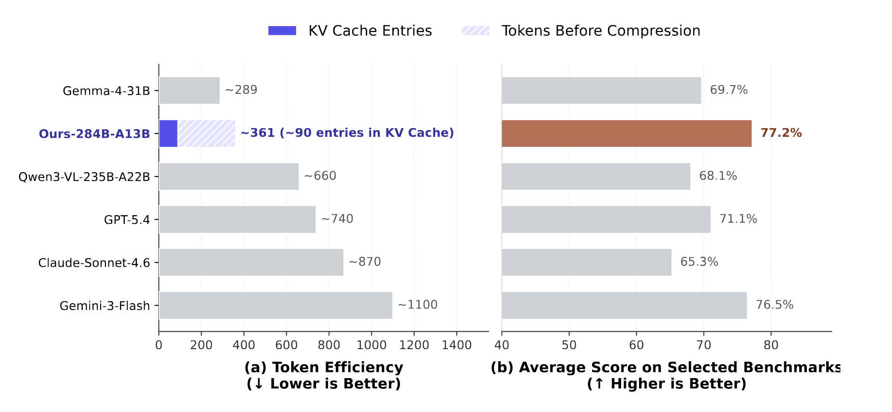
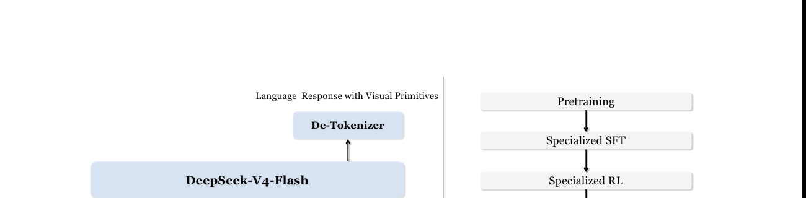
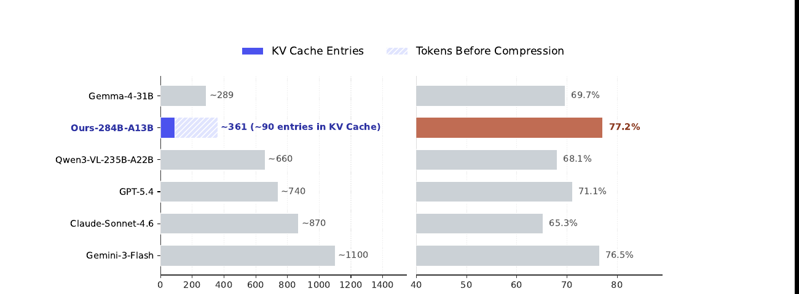
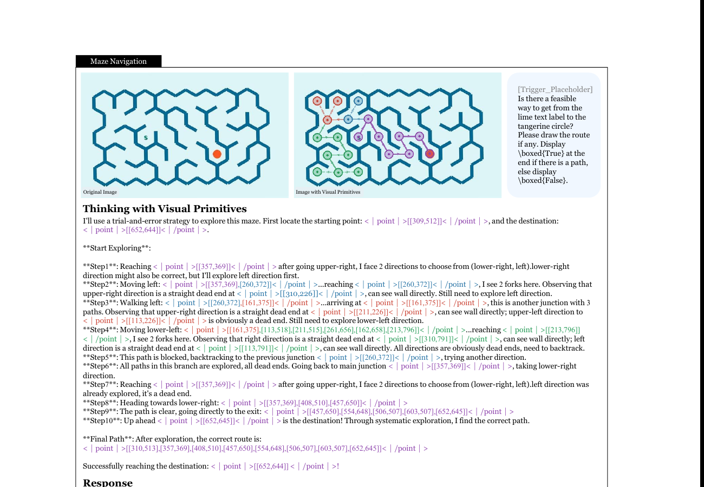

# Thinking with Visual Primitives: 推理时一边思考一边 "用手指点"

<figure>
  
  <figcaption>
    Fig. 0 — Repo 主页 teaser。左边咖啡杯任务展示 grounded task reasoning,右边迷宫展示 topological reasoning。两个任务都把 box / point 作为推理链中间产物,而不是最终输出。
  </figcaption>
</figure>

## 1. 出发点 (Motivation)

MLLM 的 Chain-of-Thought (CoT) 在 LLM 那一侧已经成熟,但**纯语言空间**的推理对视觉问题有个根本缺陷。

近几年研究让 MLLM "看更清"——高分辨率 cropping、Thinking with Images——这是在补 **Perception Gap**。但 paper 指出: 即使感知完美,模型在密集计数 / 拓扑推理 / 多步空间推断时仍然 "逻辑塌方"。

诊断 = **Reference Gap**: 自然语言天生不擅指代连续视觉空间中的精确位置。"the third dog from the left" 这种表述在密集场景下不可靠,语言"思想"会跟它指代的视觉实体 desync,导致 cascading hallucinations。

类比: 人类做这类任务时**用手指**辅助 — 数密集物体时一个个指着数,走迷宫时手指跟着路径划。这种 **deictic pointer** 是低成本的认知工具,把抽象思路锚到具体物理坐标。

**Thinking with Visual Primitives 的主张**: 让 MLLM 也能这么做。具体: 把 **points 和 bounding boxes** 提升为"**最小思维单元 (minimal units of thought)**",穿插进 CoT 推理链。模型一边推理一边 "点":

```
The user wants me to count men. Looking at the group, I see:
<|ref|>the men<|/ref|><|box|>[[13,228,116,714], [106,226,202,707], ...]<|/box|>
This covers ... 25 in total.
```

与早前 "grounding 作为后验验证" 的工作不同 (如 RepFormer / VR-FORM 把 bbox 用作 perception 增强的辅助):
- **它们**: bbox 是 final output 旁边的附属 evidence
- **本文**: bbox / point 是 thinking 过程的**主干** — 模型在思考时不断 emit visual primitives,而不是事后补一个

这条路解决拓扑推理(迷宫,路径跟踪)和密集计数 — 这些场景里语言根本无法精确指代。

## 2. 方法 (Method)

### 2.1 架构 + 视觉 token 极致压缩

<figure>
  
  <figcaption>
    Fig. 2 — (a) 架构标准 LLaVA-style: 图像经 DeepSeek-ViT → 跟语言 instruction concat → DeepSeek-V4-Flash LLM → response (含 visual primitives) → de-tokenizer。(b) 训练 4 阶段: Pretraining → Specialized SFT → Specialized RL → Unified RFT → On-Policy Distillation。
  </figcaption>
</figure>

**核心是 DeepSeek-V4-Flash** (该团队同期发布的另一个工作 [[deepseek-v4-2026]]):
- 总参 284B,激活 13B,MoE 架构
- 关键能力 = **Compressed Sparse Attention (CSA)**: 把每 $m$ 个 visual token 的 KV cache 压缩成 1 entry

**Visual Encoder = DeepSeek-ViT**: 内部自研,支持任意分辨率。流程:
1. 14×14 patch tokenizer → patch tokens
2. ViT 输出后 **3×3 spatial pooling** (9 个相邻 patch token 沿 channel 维拼成 1 个)
3. LLM 内部 **CSA 把每 4 个 visual token 的 KV 压成 1 entry**

**端到端举例 — 756×756 输入图**:
- pixel 数: 571,536
- ViT patch token (14×14 grid): **2,916**
- 3×3 pooling 后送给 LLM: **324** (实际限制 81-384 区间,所以这里是 324)
- CSA 压缩 4×: 最终 KV cache **81 entries**
- **总压缩比 = 571,536 / 81 ≈ 7,056×**

这种激进压缩是这个范式能 work 的关键 — 否则把 bbox/point 穿插进 CoT 会让 sequence 爆炸,反而更慢。

<figure>
  
  <figcaption>
    Fig. 1 — 800×800 输入下,各模型实际 KV cache entries 数:
    Gemma-4-31B ≈ 289, <strong>本文 ≈ 361 (实际 ~90 entries 在 KV cache)</strong>,
    Qwen3-VL-235B-A22B ≈ 660, GPT-5.4 ≈ 740, Claude-Sonnet-4.6 ≈ 870, Gemini-3-Flash ≈ 1100。
    右边: 7 个 benchmark (counting + spatial reasoning) 平均分,本文 77.2% 跟前沿模型持平甚至略超。
  </figcaption>
</figure>

### 2.2 Visual Primitives 的定义

两种原子: **bounding box** + **point**

- **Bounding box** `<|box|>[[x1, y1, x2, y2], ...]<|/box|>`: 坐标归一化到 0-999 整数。配 `<|ref|>` `<|/ref|>` 包对象名
- **Point** `<|point|>[[x1, y1], ...]<|/point|>`: 不带对象名,用于抽象引用 (轨迹 / 拓扑 / 中心点)

为什么选 bbox 为主而非 point ?
1. **Determinism**: bbox 紧贴物体边界,annotation 相对确定; point 在物体内部哪都行,无 strict GT
2. **Generalizability**: bbox = 2 个 point,训出 bbox 模型可零成本退化到 point;反过来不行
3. **Information**: bbox 携带几何信息 (宽高比例),point 只有位置

### 2.3 Pretraining 数据构建 (技术报告最有 hands-on 价值的一节)

**40M 高质量 box-grounding** 数据,自建。流程:

```
HF + 多网站爬虫
   ↓
97,984 box-grounding 数据源
   ↓ Step I: Semantic Review (MLLM-judge)
   ↓   • 丢掉 "0/1" 这种无语义机器码 label
   ↓   • 丢掉 "MyRoommate" 这种私有 entity
   ↓   • 丢掉 "OK"/"NG" 这种主观抽象 label
   ↓ → 43,141 source 留下
   ↓ Step II: Visual-Geometric Review
   ↓   • Severe miss recall >50% → 丢
   ↓   • 严重截断 bbox → 丢
   ↓   • >90% area mega box → 丢
   ↓ → 31,701 source
   ↓ Per-category 采样 (N=1000) + 全局 dedup
   ↓
40M 高质量样本
```

两阶段 LLM-judge 过滤是这篇 paper 工程上最 hands-on 的贡献 — 公开 OD 数据噪音大,自建一套 standard pipeline 把"语义对齐度 + 几何质量"两个维度都管起来。

**统一格式**:
- Box query: `Locate TARGET in this image and report its bounding box coordinates.`
- Box response: `<|ref|>TARGET<|/ref|><|box|>[[x1,y1,x2,y2],...]<|/box|>`
- Point query: `Help me find TARGET. Give me the center point for each instance.`
- Point response: `<|point|>[[x1,y1],...]<|/point|>` (不带 ref)

Pretraining 全程消耗 trillions of multimodal tokens (与 base LLM 同尺度)。

### 2.4 4 个 Cold-Start 任务

Post-training 之前需要 cold-start 数据 bootstrap **visual primitives 推理风格**。4 个任务:

| 任务 | 样本数 | 难点 | 关键数据来源 |
|---|---:|---|---|
| **Counting (coarse + fine)** | 10k | 密集物体计数易丢漏 | 多个 dense detection 数据集 + GQA |
| **Spatial Reasoning + VQA** | 9k | 多 hop 关系推断 | GQA 自然场景 + CLEVR 合成场景 |
| **Maze Navigation** | 460k | 拓扑可达性,需 DFS + 回溯 | 程序合成 3 种拓扑迷宫 |
| **Path Tracing** | 125k | 交叉曲线 disambiguation | Bézier 曲线合成 |

**每个 cold-start 样本的 thinking content 都包含可验证的 visual primitive 序列**, 不是普通自由文本。Counting 例子 (Fig 3):

```
1. Deconstructing the query: count men.
2. Sweeping the photo:
   <|ref|>the men<|/ref|><|box|>[[13,228,116,714], [106,226,202,707], ...]<|/box|>
3. Tallying: 4+9+8+2+2 = 25
Response: 25 men.
```

迷宫例子 (Fig 5) — 用 point 标 DFS 探索轨迹:

<figure>
  
  <figcaption>
    Fig. 5 — 迷宫 cold-start 数据示例。模型从起点 (lime label) 探索到终点 (tangerine circle),沿途 emit `<|point|>` 标记每一步位置。遇到 dead end 时显式 backtrack,这跟人脑做 DFS 一样。最终输出 `[\boxed{True}]` + 可验证路径。
  </figcaption>
</figure>

### 2.5 Post-Training: 4 阶段 + 3 类 Reward Model

**Stage 1: Specialized SFT** —— 70% general MM + 30% specialized data。**分开训** box (FTwG) 和 point (FTwP) 两个 specialized model — 数据少时混训会 mode conflict。

**Stage 2: Specialized RL (GRPO)** —— 各自 RL fine-tune,**3 类 reward model**:
- **Format RM** (rule-based 0-1): bbox 语法 / 去重
- **Quality RM** (LLM-judge 0/0.5/1): 内容是否冗余 / 思考是否前后矛盾 / 是否 reward hack
- **Accuracy RM** (task-specific):
  - **Counting**: 平滑指数衰减 $R = \alpha \exp(-\beta |\hat y - y| / (|y| + 1))$ ($\alpha=0.7, \beta=3$)
  - **Spatial / VQA**: LLM-GRM 同时判 thinking 内容 + 最终回答, 取平均
  - **Maze**: 5 项加权组合 — 因果探索进度 / 完整性 / 墙违规惩罚 / 最终路径有效性 / solvability 正确性
  - **Path tracing**: 轨迹准确性 + 终点 hit + ...

**关键 trick**: cold-start 中的 visual primitives **已 ground-truth-verified**,所以 RL 阶段**不对 primitives 本身做监督** — 只看最终答案和质量。这让 RL 数据要求大幅放宽 (图+问题+答案就够,不需要 box 标注),数据规模可大幅扩张。

**Stage 3: Unified RFT** —— 把 FTwG 和 FTwP **合并成一个统一模型**。

**Stage 4: On-Policy Distillation** —— 进一步 distill 统一模型 (推测,paper 没展开)。

## 3. 结论 (Key Findings)

⚠️ **没有 detailed benchmark 表** — README 和 PDF 都是定性 + Fig 1 单张柱状图。具体数字只能看 Fig 1。

**Fig 1 右边**:
- **Ours (~361 token / 90 KV cache entries) 平均 77.2%** — 7 个 (counting + spatial reasoning) benchmark 平均
- Gemma-4-31B (289 entries) 69.7%
- Qwen3-VL-235B-A22B (660 entries) 68.1%
- GPT-5.4 (740 entries) 71.1%
- Claude-Sonnet-4.6 (870 entries) 65.3%
- Gemini-3-Flash (1100 entries) 76.5%

**核心信息**:
1. 选定 benchmark subset 上 (paper 自报子集,不是 overall capability) 跟 frontier models **持平或反超**
2. **Token efficiency 是 GPT-5.4 的 ~1/8**, Claude-Sonnet-4.6 的 ~1/10
3. README 明确说 "scores cover only a subset of evaluation dimensions that are directly relevant to the research focus" — **不是 overall capability claim**

## 4. 实现细节 (Implementation Notes)

⚠️ **代码 + 权重 + 数据 0 release** (截至 2026/06/04)。Repo 只有 PDF + README + Makefile,没有 src/。News 说"模型权重将集成进 foundation model 未来释出",benchmark 子集 + cold-start 数据子集 "近期" release。

- **Visual token range 81-384**: 限制 ViT 输出最低 81、最高 384。低于的 resize 上去,高于的 resize 下来。**保持纵横比**。这套约束让 KV cache 可控。
- **CSA 每 4 个 visual token 压成 1 entry**: 这是 base LLM (DeepSeek-V4-Flash) 提供的能力,不是这篇 paper 设计。Paper 把这个能力**用对了** — 不再用大量 visual token 撑出 perception 质量,而是用 primitives 主动 ground。
- **未提及 token budget 上限**: 推理时 visual primitive 输出 (thinking 阶段 emit 多个 box) 占多少 token?paper 没给统计。这跟 efficiency claim 直接相关,缺失。
- **3 类 RM 缺梯度细节**: Quality RM 是 LLM-judge,LLM 用哪个?GPT-4 还是自家?Reward 怎么聚合 (sum / mean / hierarchical)?Paper 没说。
- **Cold-start 数据规模 460k maze 是 4 个任务里最大**: 因为 maze 推理需要长 DFS chain,需要 dense supervision。Path tracing 125k 次之。Counting 和 spatial 反而只有 10k 和 9k — 这俩任务的 visual primitives 用法相对简单 (一次 grounding 就够),不需要多步规划。
- **数据"两阶段 LLM-judge 过滤" 是 reproducible 的**: paper §2.3 写得很细,可以拿同样思路套用到任何 OD 数据上。这是这篇 paper 工程上**最可复用**的部分。
- **paper 用 `<|ref|>` `<|/ref|>` `<|box|>` `<|/box|>` `<|point|>` `<|/point|>`** 几个 special token: 跟 [[locate-anything-2026]] (`<box>` `</box>` `<ref>` `</ref>`) 几乎一模一样的约定,但 LocateAnything 是 box 当 output,Thinking-VP 是 box 当 thinking。两者不冲突,实际可以同一模型同时支持。

## 5. 批判性总结 (Critical Assessment)

### 5.1 优点

- **Reference Gap framing 是真的有洞见**: "MLLM 拓扑推理 / 密集计数失败的根因不是 perception 而是 reference" 这点跟同期"提高分辨率"主流方向完全反向。一旦你看见这个 framing, 很多失败案例都能用它解释。
- **把 visual primitive 提升为 first-class thought**: 跟此前"bbox 是 verification" 截然不同,更像人类用手指辅助思考。这个范式 shift 是这篇 paper 的核心贡献。
- **极致 KV cache 压缩 (7056×)**: 解决了"加更多 visual content 进 thinking 反而更慢"的 paradox。这个 trick + base LLM 的 CSA 能力对接得很巧妙。
- **数据过滤 pipeline 工程价值高**: §2.3 的两阶段 LLM-judge (semantic + geometric) 是这篇 paper 最 actionable 的部分。任何想做 grounding/detection 数据集的人都能直接抄。
- **4 个 cold-start 任务覆盖代表性场景**: counting + spatial + maze + path tracing 覆盖了 "需要 visual primitives 才解得了" 的几乎所有典型问题。
- **GRPO RL 阶段不监督 thinking 中的 primitives**: 这个设计很聪明 — 让 RL 数据规模化的关键。
- **token efficiency claim 有硬数字 (Fig 1)**: 跟 frontier models 横比,数字可信度高 (虽然 benchmark subset 选取本身有 bias 风险)。

### 5.2 不足 / 疑点

- **代码 + 权重 + 数据 0 release** (截至 2026/06/04): 跟 [[locate-anything-2026]] 一样的问题。Repo 实际只有 PDF + README。News 说"近期" release 数据子集 + benchmark 子集,但没具体时间。**研究价值现在主要是 framing + ideas, 工业可用还远**。
- **Benchmark **subset** 这个 caveat 不能忽略**: README 和 paper 都明说 "scores cover only a subset of evaluation dimensions". 也就是说: 在 visual primitives 不能帮助的任务上,本模型很可能远低于 GPT-5.4 / Claude / Gemini 这种通用模型。**只是某个垂直能力的反超,不是整体反超**。
- **DeepSeek-V4-Flash 的 CSA 是 prerequisite**: 没有 CSA, 这套范式 (大量穿插 visual primitives) 立刻 token 爆炸。这意味着该范式**强依赖** base model 的特殊 attention 能力。其他 LLM (Qwen, LLaMA, GPT 系) 不一定有同等能力,可移植性受限。
- **Specialized vs Unified 训练阶段细节缺失**: Stage 3 Unified RFT 怎么 merge FTwG 和 FTwP?是简单 weight average 还是 KL-distill?Paper 一句话带过。
- **缺 ablation**: 不带 visual primitives 的 baseline (同 backbone + 同 RL 但 thinking 是纯文本) 性能是多少?Paper 没给。**Visual primitives 帶来的 lift 到底多大**, 没有量化证据。
- **Maze 460k cold-start 是真的需要这么多吗**: 460k 比 counting (10k) 多 46×。这说明拓扑推理对大量 supervision 很饥饿,可能意味着模型并没"理解" topology,只是大量 memorize。
- **没跟 [[locate-anything-2026]] 直接比**: Thinking-VP 输出 box 和 LocateAnything 输出 box 是不同 framing (thinking vs final output),但底层格式接近 (`<|box|>` token)。两者实际可以同模型支持,但没有 head-to-head 对比。
- **token 数 vs KV cache 数概念**: README Fig 1 把这两个混着用 (左轴 "Token Efficiency" 然而柱子用 KV cache entries 数)。这点容易误导读者。
- **paper 4 阶段后训练流程很重**: SFT → RL → Unified → On-policy distill。每阶段细节都有,但**总训练成本 + 各阶段 contribution 比例**没给 ablation。
- **Author list 17 人,DeepSeek 12 人 PKU/THU 5 人**: 这是 DeepSeek 的内部项目,跟 V4-Flash 强绑定。**不是社区可参与的开放研究**,更像产品预热。

### 5.3 适用 vs 不适用

- ✅ **适用**: 想理解"MLLM 推理范式转变"的研究者。Reference Gap framing + visual primitives as thought 是有教育意义的 conceptual move,即使代码没 release。
- ✅ **适用**: 做计数 / 拓扑 / 密集空间推理任务的 product/research,即使没法用本模型,**可以借用思路** — 让自己的 MLLM 在 thinking 阶段穿插 bbox 输出。
- ✅ **适用**: 做 grounding/detection 数据集清洗的工程团队 — §2.3 的 LLM-judge pipeline 是个完整 recipe。
- ❌ **不适用**: 想立刻拿来用的人 — 代码权重 0 release。
- ❌ **不适用**: 非 DeepSeek-V4 系列的 base model 移植 — CSA 是 prereq,Qwen/LLaMA 没有同等能力。
- ⚠️ **谨慎**: 看 benchmark 时记住是 selected subset,不是 overall capability。

### 5.4 进一步阅读

- **同期 structured-output VLM**:
  - [[locate-anything-2026]] (LocateAnything) — bbox 作为 final output 一次 forward 出,跟 Thinking-VP 互补 (一个是 output 路径,一个是 thinking 路径)
  - [[rep-forcing-2026]] (Representation Forcing) — UMM 里用 representation token 解耦 understanding/generation
  - [[mrt-2026]] (Canva MRT) — layout via RoPE positional encoding
- **Thinking with images 系列** (paper §1 提到的"Perception Gap"代表): GPT-4o "vision tool calling", Anthropic "computer use", Google "Gemini multimodal CoT"
- **Base model**: [[deepseek-v4-2026]] (DeepSeek-V4) — 提供 CSA 能力的 base LLM。Thinking-VP 是 V4-Flash 系列的应用之一
- **Grounding 作为 verification 的早期工作** (paper §1 引用作为对比): RepFormer, VR-FORM 等 — Thinking-VP 跟这些的本质区别是 primitives 是 thought 不是 evidence
- **GRPO**: DeepSeek-R1 系列的 RL 算法,跟 Thinking-VP 用同一套
