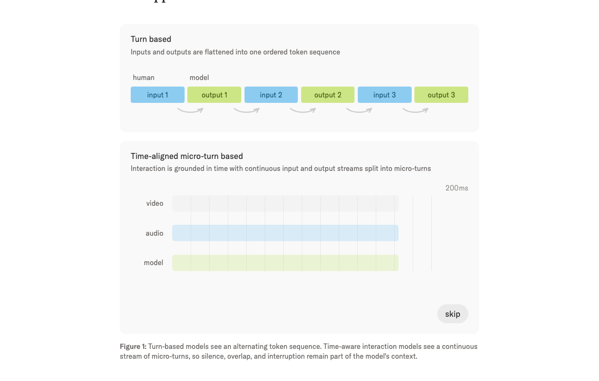
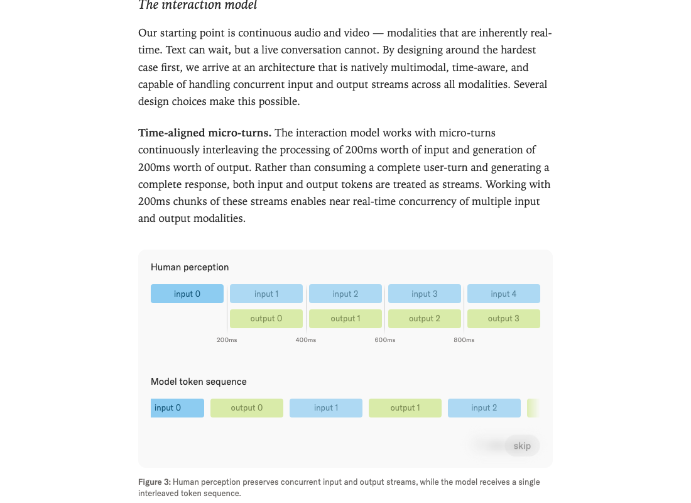
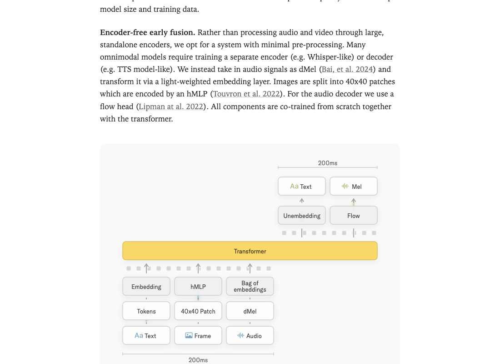
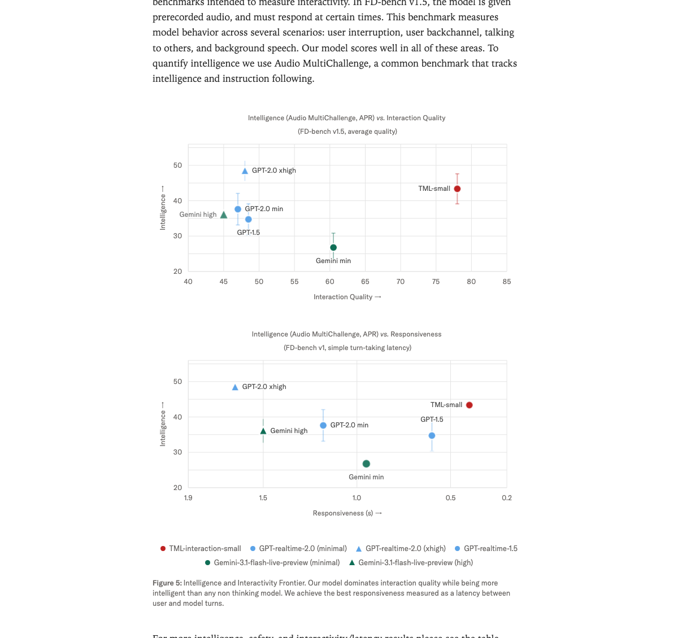
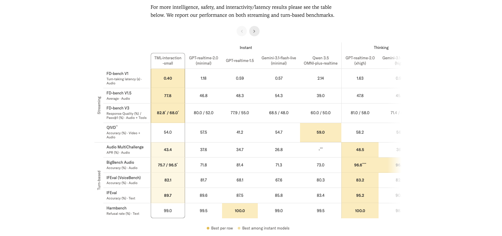

# Interaction Models: A Scalable Approach to Human-AI Collaboration

## 1. 出发点 (Motivation)

2026 年的 frontier 模型几乎全在 push **"autonomy"** — 模型自己跑长 task,人在外面看。代价是人被推出了 loop:

> "When used in this fashion, some users perceived [our model] as too slow and did not realize as much value. Autonomous, long-running agent harnesses better elicited the model's coding capabilities." — 某 frontier model card,博文引用

但现实里:大多数有价值的工作,用户没法一开始就把需求 spec 死;协作过程中要不断给反馈/澄清。当前的 turn-based 模型架构把人推出去不是因为人不需要,而是因为 interface 没给人留位置。

Thinking Machines 的诊断 — **带宽瓶颈**:

- 用户说话/打字时,模型零感知,只能等待。
- 模型生成时,perception 冻结,直到生成完才能接收新输入或被打断。
- 这等于把人机协作压缩到一个极窄的 1-token-at-a-time 串行 channel。"用 email 解决重要分歧"vs"当面解决"的差距。

现有"伪实时"方案的本质 — **harness**:把 turn-based 模型外面套一层 VAD (voice activity detection) + TTS + dialog management,组件之间是手写规则。但 Sutton 的 Bitter Lesson 提醒:这种 hand-crafted system 终将被通用能力的提升碾过。**要让 interactivity 跟 intelligence 一起 scale,interactivity 必须做进模型本身。**

这就是 *interaction model* 的定位 — 不是"模型 + 外面的实时性 harness",而是"原生支持实时 multi-stream 的模型架构"。

## 2. 方法 (Method)

### 核心思想 (类比)

把目前的 LLM 想成**对讲机 (walkie-talkie)**:你按下按钮说一段,松开后等对方说,严格交替。要打断对方?那是另外一个组件的事。

Thinking Machines 要做的是**电话 (phone)**:双方同时持续地听+说,沉默、重叠、插话都是自然的对话原语,不靠外挂检测器。

实现的核心:把时间切成 200ms 一份的 **micro-turn**,每份里都有用户的 200ms (音频/视频/文字) 和模型的 200ms (音频/文字),两个流并行处理。模型不再"等用户说完",而是*每 200ms* 都决定一次"我现在该说话、保持沉默、还是 backchannel"。

<figure>
      
      <figcaption>Fig. 1 — 上:传统 turn-based 模型把 input/output 拍扁成一个 token 序列;下:time-aligned micro-turn 模型把 video/audio/model 三条流都按 200ms 切片,沉默/重叠/插话都内嵌在模型 context 里。</figcaption>
    </figure>

### 2.1 Micro-turn 200ms 流

模型每 200ms 完成一次"处理 200ms 输入 + 生成 200ms 输出"的循环。输入 token 和输出 token 都被视为*流*,而不是回合的边界。

<figure>
      
      <figcaption>Fig. 2 — Human perception 是并行的两个流 (input 和 output 同时进行),模型内部把它们 interleave 成一个 200ms-粒度的 token 序列 (input_0, output_0, input_1, output_1, ...)。这就是"双流并行"在 transformer 输入端的具体实现。</figcaption>
    </figure>

**这一设计的关键收益:**

- **没有人为的 turn 边界** — 这意味着不再需要 VAD 这种"比模型本身还笨"的组件来切回合。
- **新交互模式自由解锁**:
        <ul>
          <li>主动打断 ("interrupt me when I say something wrong")</li>
          <li>边听边说 ("translate from Spanish to English live")</li>
          <li>边看边说 ("live-commentate this sports game")</li>
          <li>对视觉线索反应 ("tell me when I've written a bug")</li>
        </ul>
- 这些过去要靠 special harness 写死的"模式",现在都是同一个模型的 special case,且会随 scale 一起改善。

### 2.2 双模型分工:实时 interaction + async background

"实时"和"深度推理"在 latency 上天生矛盾 (一个要 200ms 出结果,一个可能想 30 秒)。TM 的设计是**双模型**:

- **Interaction model** — 始终在线,200ms 节奏,负责实时对话/感知/响应。本身已经是个 intelligent model (Audio MultiChallenge APR 43.4),不是简单的 dispatcher。
- **Background model** — async,接受 interaction model 委派的复杂任务 (deep reasoning / tool use / 长链 agent workflow),结果*流式*返回。

关键设计:

- Interaction model 委派时*不是发一个 standalone query*,而是发**整个对话 context**给 background model — 后者拿到的就是 interaction model 看到的世界。
- Background 的结果流式返回,interaction model 在*合适的时机*把结果织进对话 — 不是"突兀切回 background",而是看用户当下在做什么再决定何时插入。
- 两套模型**共享 context**。

这套分工类似前作 Qwen-omni、KAME、MoshiRAG 的"thinking+talking 分离"思路,但 TM 把分工做到了更彻底:interaction model 自己也是 intelligent 的,可以独立 hold 整个对话。Background model 只在*真的需要*深度推理时才介入。

### 2.3 Encoder-free 早融合

多模态模型常见做法:audio 走一个 Whisper-like encoder,video 走一个 SigLIP/ViT encoder,然后 token-level 拼起来送进 transformer。TM 反其道:**所有 encoder 都尽可能轻**。

- **Audio:** 直接用 [dMel (Bai et al. 2024)](https://arxiv.org/abs/2407.15835) — 离散 mel-spectrogram 表示,过一个 lightweight embedding layer 进 transformer。<u>不需要训 Whisper 或 TTS</u>。
- **Video / Image:** 切成 40×40 patch,过 hMLP ([Touvron et al. 2022](https://arxiv.org/abs/2203.13915)) — 一个非常浅的 MLP。
- **Audio decoder:** 用 flow head (Lipman et al. 2022 — flow matching),从 transformer 输出预测 mel,再走声码器。
- **所有组件 from scratch 跟 transformer 一起 co-train**,不依赖任何 pretrained encoder/decoder。

<figure>
      
      <figcaption>Fig. 3 — 单个 200ms micro-turn 的模型架构。输入端 (下):Tokens → Embedding,40×40 Patch → hMLP,dMel → "Bag of embeddings"。Transformer 处理。输出端 (上):Unembedding → Text,Flow → Mel (音频)。<strong>整个 stack 从底到顶共同训练</strong>,不是预训练 encoder + 微调 LLM 的组合。</figcaption>
    </figure>

**为什么这条路重要:**预训练 encoder (Whisper, SigLIP) 是为*识别*任务训的,与*生成式交互*的目标不完全对齐。从头共训能让 representation 自动适配 generation 任务。代价是数据量 / 计算成本提升 — 但 TM 显然认为对 frontier model 这点代价值得。

### 2.4 推理优化:streaming sessions + 内核优化

200ms 的硬 latency 约束让*现成的 LLM serving* (vLLM, TensorRT-LLM, SGLang stock) 都不够用 — 它们都是为"大 prefill + 长 decode"优化的,小 prefill 频繁触发的场景下 per-turn overhead 高得离谱。

TM 的解决方案:**Streaming sessions**。客户端每 200ms 发一个独立 request,服务端把这些 chunk *append 到一个 GPU 内存里持久存在的 sequence*。避免每次 metadata 重算 + 内存重分配。<u>这个 feature 已经 upstream 到 SGLang</u> — 是博文里仅有的一个可触达的"代码 artifact"。

另一个内核细节:对 MoE 推理用 **gather + gemv** 而不是常规的 grouped GEMM — 在他们的*双向 serving shape* 下更快 (跟 PyTorch / Cursor 的并发优化思路一致)。

### 2.5 Trainer-sampler bitwise 对齐 + Split-KV 一致性

RL/RLHF 训练里,*trainer 和 sampler 用同一份 weights 但跑出不同 logits* 是个常见 bug 源 (浮点累加顺序、不同 kernel 实现、不同并行策略带来差异)。TM 强调他们做到了 **bitwise 一致**,代价只有 <5% 端到端开销。两个关键 trick:

1. **NVLS 通信内核:**在 Blackwell GPU 上用 NVLink Switch (NVLS) 实现 deterministic、low-latency 的 all-reduce 和 reduce-scatter。一个有意思的副作用:这些自定义内核*本身就比 stock 快*,所以"batch-invariant 版本"在某段时间反而是更快的版本 (博文 footnote 调侃"funnily enough")。
2. **Split-KV attention 一致性** (跟 Colfax 合作):attention 的 Split-KV 是 prefill 和 decode 之间累加顺序不一致的主要源。TM 选择**一致地按 4096 token 左对齐切**,让 decode 和 prefill 走同样的累加 schedule,从而 bitwise 等价。

这两条都是 LLM serving 的"工程内功",但博文给了具体方案不是 hand-waving。*这是博文里最技术化、跟 production system 直接相关的两段。*

### 2.6 与代码对照 (none)

博文**没有公开训练代码、模型权重、推理 stack 完整实现**。唯一可触达的代码 artifact 是**上游到 SGLang 的 streaming sessions feature**。其他所有架构决策都是博文文字描述。

下面这段是*教学性的伪代码*,把博文文字描述的 micro-turn 循环用 Python 写出来 — 不是 TM 代码:

<p class="code-source"><em>Didactic reference — based on blog description, not TM official code</em></p>

```python
# Server-side micro-turn loop (didactic)
class InteractionSession:
    def __init__(self, model, frame_ms=200):
        self.model = model                       # transformer with co-trained encoders/decoders
        self.frame_ms = frame_ms                 # 200ms
        self.kv = []                             # persistent KV cache in GPU memory
        self.bg_results = asyncio.Queue()        # async background-model channel

    async def on_micro_turn(self, audio_chunk, video_frame, text_chunk):
        # 1) Encode inputs in-place — no big external encoders
        audio_tok = self.model.dmel_embed(audio_chunk)
        video_tok = self.model.hmlp_patches(video_frame, patch=40)
        text_tok  = self.model.tok_embed(text_chunk) if text_chunk else None

        # 2) "Bag of embeddings" — concatenate into this micro-turn's input slot
        input_slice = bag_of([audio_tok, video_tok, text_tok])
        self.kv.append_inputs(input_slice)

        # 3) Drain async background results into the same context window
        while not self.bg_results.empty():
            self.kv.append_bg(self.bg_results.get_nowait())

        # 4) Decode this micro-turn's output (200ms of text + audio)
        out_text, out_mel = self.model.decode_one_microturn(self.kv)

        # 5) Decide: speak? silent? backchannel? delegate to background?
        if needs_deep_thought(out_text):
            asyncio.create_task(self.background_model.run(self.kv.snapshot()))

        return out_text, self.model.flow_head(out_mel)

# Client just streams 200ms chunks; server holds the persistent kv.
```

真正实现 (TM internal) 用 SGLang streaming sessions + 上面提到的自定义 NVLS / Split-KV 内核 + batch-invariant trainer/sampler 对齐。

## 3. 结论 (Key Findings)

TM 发布了 **TML-Interaction-Small** — 276B 参数 MoE, 12B active,实时 interaction model。

<figure>
      
      <figcaption>Fig. 4 — 双轴帕累托。<em>左:</em>横轴 FD-bench v1.5 Interaction Quality (越右越好),纵轴 Audio MultiChallenge intelligence (越高越好) — TML-small 在两个轴上同时领先。<em>右:</em>横轴 responsiveness (越左越好,turn-taking latency),纵轴 intelligence — TML-small 同样占 Pareto frontier。</figcaption>
    </figure>

**核心数字 (vs GPT-realtime-2.0 minimal / GPT-realtime-2.0 xhigh / Gemini-3.1-flash-live):**

- **FD-bench v1 turn-taking latency:** TML 0.40s < GPT-2.0-min 1.18s < GPT-1.5 0.59s ≈ Gemini-min 0.57s
- **FD-bench v1.5 interaction quality:** TML **77.8** vs GPT-2.0-min 46.8, GPT-1.5 48.3, Gemini-min 54.3, GPT-2.0-xhigh 47.8 — *大幅领先 +23 pt*
- **FD-bench V3 (audio+tools) response quality / pass@1:** TML 82.8 / 68.0 vs GPT-2.0-min 80.0 / 52.0 — pass@1 上 +16 pt
- **Audio MultiChallenge APR:** TML 43.4 vs GPT-2.0-min 37.6, GPT-2.0-xhigh 48.5 (thinking 模式才超过)
- **IFEval text:** TML 89.7 vs GPT-2.0-min 89.6 (打平), GPT-2.0-xhigh 95.2

<figure>
      
      <figcaption>Tab. 1 — TM 划分 Instant / Thinking 两栏。在 Instant 列内 (即不开 background-agent 思考),TML 几乎每个指标都拿"best per row" — 黄色高亮。Thinking 栏的 GPT-2.0-xhigh 在<em>纯 intelligence</em>上仍然更强 (Audio MultiChallenge 48.5),但其 turn-taking latency 1.63s 比 TML 的 0.40s 慢 4 倍。<strong>这正是 paper 的 thesis:intelligence-vs-latency frontier 上 TML 是新的 Pareto 点。</strong></figcaption>
    </figure>

**新维度 benchmark (TM 自己造的,目前还没人能正经做):**

- **TimeSpeak (时间感知):** 64.7 vs GPT-2.0-min 4.3 ("提醒我每 4 秒呼吸一次")
- **CueSpeak (verbal cue 触发):** 81.7 vs GPT-2.0-min 2.9 ("我每次切语言时给我对应翻译")
- **RepCount-A (视觉计数,off-by-one):** 35.4 vs GPT-2.0-min 1.3
- **ProactiveVideoQA (PAUC@ω=0.5):** 33.5 vs no-response baseline 25.0,GPT-2.0-min 25.0 (= 沉默)
- **Charades (mIoU):** 32.4 vs GPT-2.0-min 0

这些任务上 GPT-realtime / Gemini 几乎是*零分*或回退到沉默/猜答案 — 因为现有商业 real-time API 都是 audio-only turn-detection 的 harness,无法主动响应视觉变化。TM 是第一个把 speech-out visual proactivity 端到端做出来的。

## 4. 实现细节 (Implementation Notes)

博文是 product/research preview, 不是论文。下面是*能从文中提炼出的*工程参数 + 设计取舍:

- **模型规模:** TML-Interaction-Small = 276B MoE total / 12B active。更大模型"目前仍太慢 serve 不动",计划今年晚些时候释出。
- **Frame size:** 200ms,作为 micro-turn 粒度。这个数字平衡了*感知延迟* (人类可察觉响应 < 300ms 是 immediate) 和*计算开销* (每 200ms 一次 prefill 已经接近 GPU bound)。
- **Audio:** dMel (Bai et al. 2024) 离散 mel-spectrogram。Decoder 用 flow head (Lipman et al. 2022) → mel → 声码器。
- **Video / Image:** 40×40 patch + hMLP (Touvron et al. 2022),*不是* ViT。
- **所有 encoder/decoder 跟 transformer 共训** — 不使用 Whisper / SigLIP 等预训练组件。
- **Streaming sessions** 已上游到 [SGLang](https://github.com/sgl-project/sglang) — 这是博文里唯一可获取的"代码"。
- **MoE 推理:** gather + gemv 而非 grouped GEMM (与 PyTorch / Cursor 思路一致)。
- **Bitwise trainer/sampler 对齐:** batch-invariant kernels,<5% e2e overhead;NVLS 通信内核 + Split-KV consistent accumulation (与 Colfax 合作)。
- **Background model coordination:** 委派时发整个对话 context 而非 standalone query;结果流式返回并由 interaction model 选时机插入。两个模型共享 context。
- **Safety:** 用 TTS 模型生成 refusal/over-refusal 训练数据让拒绝话术口语自然;multi-turn 用自动 red-teaming harness 生成 robustness 数据;refusal boundary 跟 text-based refusal 保持行为一致。
- **评估边界 ⚠:** FD-bench V3 (audio+tools) 和 BigBench Audio 的 96.5 分都是*开启 background agent 后*的结果 (论文 * 脚注)。**"82.8 / 68.0"vs"80.0 / 52.0"这种对比里,TML 用了 background agent 而 GPT-realtime-2-minimal 没开 thinking** — 这条很容易被读者漏掉。
- **没有训练代码 / 权重发布。** "Limited research preview"承诺今年开放,但目前都是看 demo。

## 5. 批判性总结 (Critical Assessment)

### 5.1 优点

- **问题切得对。** "把实时性做进模型而不是套 harness"这条思路是 Bitter Lesson 的正面应用 — 当前 commercial real-time API 全是 VAD + dialog manager + TTS 拼起来的,确实是 special-purpose components,迟早会被通用 model scale 碾过。这篇博文是第一份系统化的"端到端 interaction model"宣言。
- **Time-aligned micro-turn 是干净的抽象。** 200ms 时间片把 audio/video/text 三个流强制对齐到同一个 tokenization 节奏,模型一次看到"过去 200ms 全部模态 + 自己刚说出来的 200ms",架构上极优雅。这把"打断"、"backchannel"、"同时说话"这些*过去得靠 special FSM 处理的*行为都变成了普通的 next-token 预测。
- **Encoder-free 早融合是 frontier 共识方向。** 跟 D-OPSD (Z-Image-Turbo 用 VLM 当 encoder + co-train diffusion) 是同一个流派 — 不再依赖 Whisper/SigLIP 这类预训练 encoder,让 representation 跟*下游 generation 任务*对齐。这是 2026 年明显的范式收敛。
- **Streaming sessions 是*真实代码*贡献。** 上游到 SGLang 意味着不只是 TM 自己用 — 整个 LLM serving 生态可以受益于"持久 GPU 内存 sequence"这个 abstraction。
- **Bitwise trainer/sampler 对齐 + Split-KV 一致性是真功夫。** 不是 hand-waving "我们的 RL 很稳定",而是给了具体方案 (NVLS deterministic kernels, 4096-token left-aligned split)。这种"production RL infra"细节通常是各家最不愿透露的,博文给出了原理。
- **新 benchmark (TimeSpeak / CueSpeak / RepCount-A / ProactiveVideoQA / Charades) 把"现有评测做不到的能力"*量化*了。** 不是"我们的模型更好但说不清在哪好" — 而是"GPT-realtime 在 RepCount-A 上得 1.3, 我们 35.4, 这种'看着用户做动作并实时计数'的能力你们家根本没有"。

### 5.2 不足 / 疑点

- **没有训练代码 / 权重 / 推理 stack 发布。** 这是 product preview 不是 research artifact。可重现性 = 0。同期 D-OPSD 的 LoRA 代码、LeapAlign 的训练循环都发布了 — TM 这次不行。
- **FD-bench V3 的"82.8 / 68.0"用了 background agent,baseline 没用。** 这是博文里最容易误导的对比 — *脚注小字写"benchmarks that require reasoning or tool calls we report our results with background agent enabled",但主表把这个数字直接放在 "TML-interaction-small" 列下,跟"Instant"分组并列。<u>读者第一眼看到的 +30 pt pass@1 优势,实际上是"我开 thinking、你不开"的不对称对比。</u> 严格 apples-to-apples 应该是 TML-instant-only vs GPT-realtime-2.0-minimal。
- **Audio MultiChallenge thinking 模式还是输 GPT-2.0-xhigh (43.4 vs 48.5).** 博文用"我们是 instant 类别最强"的框架避开了这个事实。*纯 intelligence* 上 thinking-mode frontier model 仍然更强,TM 的卖点是"intelligence + responsiveness 的组合 Pareto"。
- **"Interaction Quality"是单 benchmark (FD-bench v1.5) 的单评估。** 整个论证"我们 interaction quality 77.8 vs 别人 45-55"建立在一个 benchmark 上。FD-bench v1.5 是 TM 提到"少数现有 interactivity benchmark 之一",但*是谁建的、bias 在哪、TM 是否参与设计*博文没说。如果 FD-bench 跟 TM 的 training mix 高度对齐而别人没见过,这条优势就缩水。
- **"Encoder-free + co-train from scratch"的训练成本没披露。** 不复用 Whisper / SigLIP 等成熟 encoder 意味着 audio/video 的 representation 全部要从训练 data 中重新学。276B MoE 想必 pretraining 数据规模 + 计算 budget 都非常可观,但这块讨论缺失。
- **200ms 这个数字本身没消融。** 为什么不是 100ms (更敏感)? 不是 500ms (省算力)? 200ms 是*计算约束*选出来的还是*人体感知*选出来的?有没有 ablation 显示 100ms 性能更好但成本不可接受?博文没给。
- **视频部分只 40×40 patch + hMLP 似乎太轻。** hMLP 是 image classification 用过的 lightweight encoder,在 dense visual reasoning (RepCount-A 计数 / Charades 动作定位) 上 representation 容量够吗?TML 35.4 / 32.4 的成绩看着远超基线但绝对值仍然偏低 (RepCount-A 35.4 = 67% 误差;mIoU 32.4 在标准 Charades 比赛里属于初级水平)。可能 hMLP 是当前 bottleneck。
- **双模型分工的"何时委派"机制不透明。** Interaction model 怎么判断"这个问题需要 background"?是不是又是个 special-purpose head?如果它本身是个 instant 的 12B active model,判断深度推理需求的能力会有上限。如果是用 RL 训出来的,training data / reward 是什么?博文都没说。
- **Long-session context management 是公开短板。** 博文 Limitations 自己承认"continuous audio/video accumulate context quickly... very long sessions still require careful context management — an active area of work"。也就是说:demo 短 conversation 很惊艳,但 1 小时以上的会议场景能不能撑住未知。
- **Limited research preview 而非 open release.** 同期 Z-Image-Turbo (D-OPSD 用的) 和 FLUX (LeapAlign 用的) 都已开源 weight + code。TM 至今未开放,可能跟其商业模型相关 — 是 closed model 的早期 demo。
- **Safety RLHF + automated red-teaming 在 multi-turn 实时场景的有效性证明不足。** Harmbench 99.0 跟 turn-based baseline 几乎一致,但 streaming 场景的*新*攻击面 (e.g., 间歇式 jailbreak、跨 micro-turn 的 prompt injection、visual jailbreak) 没单独评估。

### 5.3 适用 vs 不适用

- ✅ **适用方向:**实时音频/视频协作 — 同传翻译、live coaching、运动 / 健身实时纠错、live commentary、cooking assistant 这类"一边做一边看一边说"的场景。
- ✅ **适用方向:**需要打断 / backchannel / 主动插话的对话机器人 — 客服、tutoring、辅助沟通。
- ✅ **方法论上适用:**任何想做 streaming generation 的多模态系统都可以借鉴 micro-turn + encoder-free 的设计。
- ❌ **不适用:**纯 batch / async / autonomous-agent 场景 (长 task 跑后台,不需要 200ms 响应) — interaction model 不是优势区,反而 thinking-mode frontier model 更强。
- ❌ **不适用:**对绝对 intelligence 的极致需求场景 — TML-Small 12B active 在纯 reasoning 上仍然不如 thinking-mode 大模型。
- ❌ **不适用:**需要 self-host / 开源/可定制的部署 — 目前没权重 / 没代码。
- ⚠️ **谨慎:**跟*非 thinking* baseline 比 reasoning 指标时,确认两边是否都开/都关 background agent — 博文表里这条容易混。

### 5.4 进一步阅读

- [dMel (Bai et al. 2024)](https://arxiv.org/abs/2407.15835):TM 的 audio tokenization 基础。
- [hMLP (Touvron et al. 2022)](https://arxiv.org/abs/2203.13915):TM 的 video patch encoder 来源。
- [Flow Matching (Lipman et al. 2022)](https://arxiv.org/abs/2210.02747):TM 音频 decoder 用的 flow head 数学。
- [SGLang](https://github.com/sgl-project/sglang):streaming sessions feature 已 upstream 在这里。
- [Moshi (Kyutai)](https://arxiv.org/abs/2410.00037):full-duplex 音频对话模型,小规模 baseline。TM 多次引用作为对比,但 Moshi 是 audio-only 小模型,不包含 video 或 background-agent 协调。
- [D-OPSD (Jiang et al. 2026)](https://arxiv.org/abs/2605.05204):同期 paper,encoder-free + co-train 的另一案例 (扩散域)。
- [Sutton, The Bitter Lesson (2019)](https://www.alignmentforum.org/posts/G2Lne2GZjjQYsy7Wt/the-bitter-lesson):TM 的方法论基础 — "scaled general methods beat hand-crafted ones"。
- METR — Measuring AI Ability to Complete Long Tasks (Kwa et al. 2025):TM 引用作为"autonomy 主流叙事"的代表。

<footer>
    <hr/>
    <p class="meta">Read on 2026-05-12 · Generated with the <code>reading-papers</code> skill (blog-post adapted variant)</p>
  </footer>
