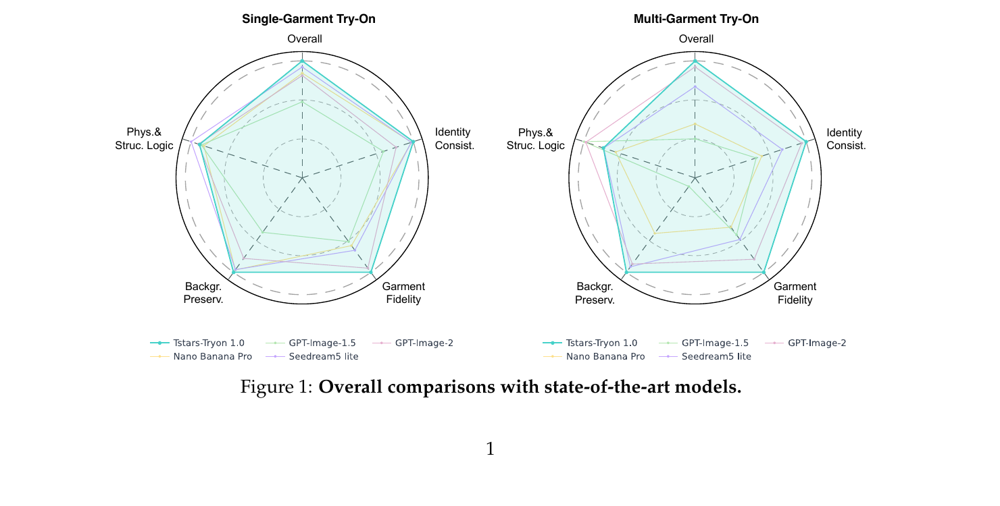
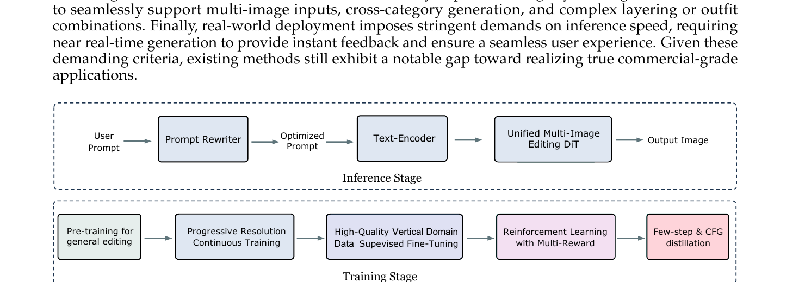
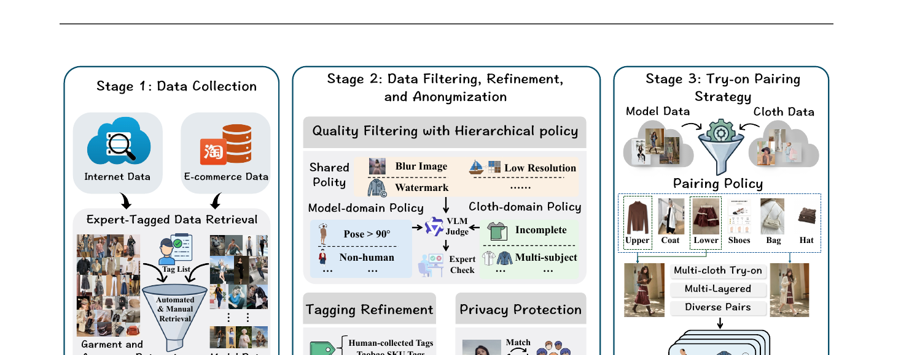
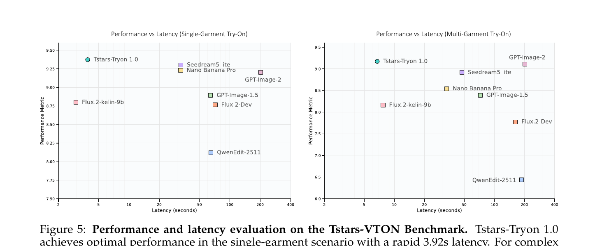
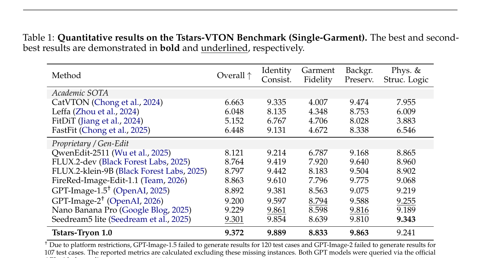
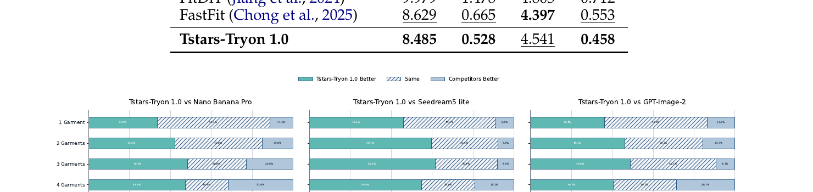

# Tstars-Tryon 1.0: Robust and Realistic Virtual Try-On for Diverse Fashion Items

## 1. 出发点 (Motivation)

"AI 试衣"是过去 5 年生成式 AI 最有商业前景的应用之一,但研究 demo 和实际可用之间一直隔着一道墙。论文把这道墙拆成 4 块,每一块都是把"研究级"按死在 commercial-ready 门外的钉子:

1. **鲁棒性不够.** 学术 VTON 数据集如 VITON-HD / DressCode 几乎全是棚拍单人正面照,而真实电商场景里用户上传的照片包括*极端姿势(蹲、躺、舞蹈)、过曝/暗光、宠物、3D avatar、油画、雕塑、动漫角色*(论文 Fig 3 列了 9 种"野生输入")。学术模型在这些场景上几乎全崩。
2. **真实感不够.** 用户对"真"的容忍度极低 — 服装上的 logo / 色差 / 织物纹理稍微塑料感一点就立刻被识破。学术 SOTA(CatVTON / FitDiT)在 Tstars-VTON Bench 上 Garment Fidelity 维度只有 4.0–4.7 / 10(论文 Tab 1),而商业级要求 >8.5。
3. **多件不灵活.** 学术任务几乎都是"单件试穿",但真实 OOTD(Outfit of the Day)需要同时穿上衣 + 下装 + 外套 + 鞋 + 包 + 帽。多件之间还有*分层逻辑*(外套敞开露出内搭、围巾覆盖在毛衣外面)、*语义遵循*("保持鞋子不变")。大部分模型在 ≥3 件叠穿时出现 item omission 或 identity degradation(论文 §3.1 把这点定义为 "performance collapse")。
4. **推理太慢.** Flux.2-dev / QwenEdit-2511 这类通用 image edit 大模型(扩散 + 多步 + CFG)在 H200 上跑一张图就要 100~200s。电商 C 端不能让用户等 30s 以上 — 这等于 -50% 的留存。

**已有路径的不足:**

- *传统 inpainting 路线*(CatVTON / FitDiT / Leffa):把人体上"要换衣服"的区域 mask 掉,然后做条件 inpainting。优点是 identity 容易保住(背景和脸完全没动);缺点是**无法处理多件叠穿、复杂遮挡、姿势变化** — mask 越大,模型自由度越大,反而越容易崩;mask 越小,根本无法塞进新外套。Tab 1 里 CatVTON 单件 Overall 6.66 / 10。
- *通用 image-edit 大模型*(GPT-Image-2 / Nano Banana Pro / Seedream5 lite):效果好但贵且慢,且对"严格保留 identity + 背景"控制力差(GSB 评测中"换造型时把脸也换了"是高频失败)。

**本文 TL;DR:** 不做 inpainting,把 try-on 重新公式化为**通用多图像编辑**;基于 MMDiT 主干 5B 参数;五阶段训练 — 预训 → 渐进分辨率 → 高质 SFT → DiffusionNFT 多奖励 RL → CFG + Step 蒸馏 — 同时拿到工业级*效果*(Overall 9.372 / 10,跨 5 个维度全部第一或第二)和工业级*速度*(3.92s 单件 / 6.74s 6 件)。

<figure>
      
      <figcaption>Fig. 1 — 在 Tstars-VTON Bench 上 5 个维度(Identity / Garment / Background / Phys. &amp; Struc. Logic / Overall)和 4 个商业模型对比。Tstars-Tryon 1.0(青线)单件/多件两个场景都基本贴着外边界,GPT-Image-2 / Nano Banana Pro 在 Garment Fidelity 上掉得最明显。</figcaption>
    </figure>

## 2. 方法 (Method)

### 核心思想 (类比)

把传统 VTON 当成 inpainting 就像"把照片上人脸的下半张抠掉,让模型按描述把'微笑'画回去" — 这是*填空*;一旦填空区域横跨多件衣服、复杂遮挡或全身大动作,模型就 hold 不住。

Tstars-Tryon 1.0 改成"把多张图(主体 + 衣 + 鞋 + 包) + 一句话"作为 in-context 序列丢进同一个 MMDiT,让模型像做"一句话改写一张图"那样处理多图编辑 — 这是*编辑*。两者数学上都是条件扩散,但*条件的形态*不同:

- **Inpaint:** 条件 = mask + masked image + (单张)cloth reference,模型只能动 mask 内部。
- **Multi-image edit:** 条件 = 主图 + 多张 reference(≤6) + 文本 prompt,模型自己学会"哪儿该动、哪儿该保留"。

这是 2024 年 SD3 的 MMDiT 和 2025 年一众 image-edit 大模型(Nano Banana / GPT-Image-1.5 / FLUX.2 / QwenEdit)走的同一条路 — 论文把它专门 vertical-fine-tune 到 try-on。

<figure>
      
      <figcaption>Fig. 4 — 整个系统的训练和推理两条流水线。推理:Prompt Rewriter(增强语义)→ Text-Encoder → Unified Multi-Image Editing DiT → 出图。训练:Pre-training(general editing)→ Progressive Resolution → 高质量垂域 SFT → Multi-Reward RL → Few-step + CFG 蒸馏。</figcaption>
    </figure>

### 2.1 任务范式: 从 inpaint 到 edit

记主体图为 $x_p$,$k$ 张 reference 服装/配饰图为 $\{x_r^{(1)},\dots,x_r^{(k)}\}$($k \in [1,6]$),文本指令为 $c$。**传统 inpainting 范式**需要一个额外 mask $m$:

<p class="math-translation">—— 翻译: 把人身上的衣服抠掉后,丢进生成器,让它根据(单张)cloth 参考和文本把衣服画回去。</p>

这里 mask 必须提前算(用 SCHP 或 DensePose 做人体解析),而且只支持 $k=1$。CatVTON 就是这条路 — 见后面的代码引用。

论文采用的**多图编辑范式**把 mask 完全去掉,直接把所有图当成 in-context tokens:

<p class="math-translation">—— 翻译: 主体图 + 1~6 张 reference + 文本一起丢进 DiT,网络自己 attention 决定"哪儿是衣服该贴上去、哪儿是脸要保留"。</p>

注意: 论文**没有**给出 $G_\theta$ 的具体公式 / 结构图 — 只在介绍里说"unified MMDiT architecture (Esser et al., 2024)"一句带过。这是 §5 要批判的一个点。

### 2.2 MMDiT 统一架构(论文未细说)

论文唯一对架构的描述是: "Tstars-Tryon 1.0 utilizes a unified MMDiT (Esser et al., 2024) architecture capable of simultaneously processing and coordinating multiple reference images, ensuring the natural fusion of full-body outfits." 加上 "primary DiT model is streamlined to 5B parameters"。

MMDiT(Stable Diffusion 3, Esser et al., 2024)的核心是**多模态联合注意力**: text token 和 image token 在同一个 transformer block 里互相 attend(各有 separate QKV 投影,但 attention 在 concat 后的序列上计算)。对 try-on 任务的扩展应该是**把多张参考图的 token 拼到序列里**,让 self-attention 自动跨图融合 — 这是 in-context image editing 标准做法,但论文细节(token 怎么排、有没有 RoPE-2D、position encoding 怎么标记"这张是主图、那张是衣服")*全部省略*。

作为参照,我们看 CatVTON(论文 baseline)是怎么处理 "多图条件" 的 — 它做的是*old-school inpainting*,把 cloth condition 通过 VAE encode 后**沿 spatial 维 concat** 到 noisy latent,再用 self-attention 把两半融合:

<p class="code-source">repo/model/pipeline.py:L125-L171 — CatVTON 的核心 forward:VAE encode 主体和衣服 → spatial concat → unet 单 forward → CFG。注意 <code>concat_dim=-2</code> 是 y 轴拼接 — 衣服图被叠在主体图下方,共享一个 self-attention。</p>

```python
concat_dim = -2  # FIXME: y axis concat
# Prepare inputs to Tensor
image, condition_image, mask = self.check_inputs(image, condition_image, mask, width, height)
image = prepare_image(image).to(self.device, dtype=self.weight_dtype)
condition_image = prepare_image(condition_image).to(self.device, dtype=self.weight_dtype)
mask = prepare_mask_image(mask).to(self.device, dtype=self.weight_dtype)
# Mask image
masked_image = image * (mask < 0.5)
# VAE encoding
masked_latent = compute_vae_encodings(masked_image, self.vae)
condition_latent = compute_vae_encodings(condition_image, self.vae)
mask_latent = torch.nn.functional.interpolate(mask, size=masked_latent.shape[-2:], mode="nearest")
# Concatenate latents
masked_latent_concat = torch.cat([masked_latent, condition_latent], dim=concat_dim)
mask_latent_concat = torch.cat([mask_latent, torch.zeros_like(mask_latent)], dim=concat_dim)
# Prepare noise
latents = randn_tensor(masked_latent_concat.shape, generator=generator, ...)
self.noise_scheduler.set_timesteps(num_inference_steps, device=self.device)
timesteps = self.noise_scheduler.timesteps
# CFG
if do_classifier_free_guidance := (guidance_scale > 1.0):
    masked_latent_concat = torch.cat([
        torch.cat([masked_latent, torch.zeros_like(condition_latent)], dim=concat_dim),
        masked_latent_concat,
    ])
    mask_latent_concat = torch.cat([mask_latent_concat] * 2)

for i, t in enumerate(timesteps):
    non_inpainting_latent_model_input = torch.cat([latents] * 2) if do_classifier_free_guidance else latents
    inpainting_latent_model_input = torch.cat(
        [non_inpainting_latent_model_input, mask_latent_concat, masked_latent_concat], dim=1)
    noise_pred = self.unet(inpainting_latent_model_input, t, encoder_hidden_states=None)[0]
```

对比可以看出 CatVTON 走的是"*把所有信息硬拼成一张大图*"路线,这天然只能处理 **1 张**参考图(更多就会导致拼接图无限拉长,无法支持 6 张)。Tstars-Tryon 改成 MMDiT 后,reference 是*独立 token 序列*,理论上 $k$ 任意 — 但具体怎么 tokenize,论文没说。

### 2.3 五阶段训练流水线

论文 §1(Introduction)把训练拆成 5 个 stage,但每个 stage 的*损失函数都没写*。下面是我根据上下文推断的对应学术 / 工程范式:

1. **Pre-training for general editing.** 在 task-balanced 和 content-balanced 通用编辑数据集上预训,渐进难度上升。目标:让 DiT 拿到 broad world knowledge + 通用编辑能力(类似 InstructPix2Pix / Emu Edit 那种)。损失推断为标准 flow matching:
        $$\mathcal{L}_{\text{FM}} = \mathbb{E}_{x_0, x_1, t}\left[\| v_\theta(x_t, t, c) - (x_1 - x_0) \|^2\right]$$
        其中 $x_t = (1-t)x_0 + t x_1$,$x_0$ = ground truth target,$x_1$ = noise。
2. **Progressive Resolution Continuous Training.** 把分辨率逐步提升 — 这是 SD3 系列、Flux 系列的标准做法,小分辨率练 layout,大分辨率练细节。论文说他们的 infra 支持"variable resolutions + arbitrary number of reference images" via Data Packing(Dehghani et al., 2023)。
3. **High-Quality Vertical Domain SFT.** 在精挑细选的 try-on 垂直域数据上 SFT。这一步对应论文 Fig 6 的"Data Curation Pipeline" — 三阶段(Collection → Filter & Anonymize → Try-on Pairing)。
4. **Reinforcement Learning with Multi-Reward.** SFT checkpoint 上跑 DiffusionNFT(Zheng et al., 2025),用 group-level 采样 + 多维度 reward + 组内 relative advantage 估计。下文 §2.4 展开。
5. **Few-step & CFG distillation.** Yin et al., 2024 风格的 Step Distillation + CFG distillation,把推理压到 ~6-8 步 + 无需 dual-forward CFG,实现 3.92s / 6.74s 推理。

<figure>
      
      <figcaption>Fig. 6 — Stage 3 数据流水线: (1) 互联网/电商收集 + 专家 tag 检索 → (2) 共享 + 模特域 + 衣服域三层质量过滤,VLM-judge + 专家审核,人脸匿名换脸 → (3) 多衣物配对策略,基于 SKU + 共存约束生成多层叠穿组合。</figcaption>
    </figure>

### 2.4 多奖励 RL —— DiffusionNFT(Zheng et al., 2025)

论文 §1 显式声明 RL 阶段用的是 **DiffusionNFT**(Diffusion Negative-aware Fine-Tuning,Zheng et al., NeurIPS 2025)— 一个 GRPO 风格的 diffusion RL 框架:不需要 critic,用 group 内 reward 的相对值估 advantage,然后*同时*把正样本拉近、负样本推远。论文的话: "the policy is further optimized with DiffusionNFT to favor positive trajectories over negative ones."

原始 DiffusionNFT 在 SD3 上的 policy loss 大致如下(公开实现):

<p class="math-translation">—— 翻译: 把每个 sample 的 reward $r$ 减去同组平均、除以同组标准差得到 advantage $A$;归一化到 $[0,1]$ 得到"它是好样本的概率" $\tilde r$。然后构造一个"想往那里走的方向" $\hat v^+$(混合当前 policy 和 old)和"反方向" $\hat v^-$。最终 loss 是: <em>好样本</em>朝 $\hat v^+$ 推 + <em>坏样本</em>用反方向推($\hat v^-$ 等价于"远离 old → 当前"延伸出去的位置)+ KL 锚到 ref。</p>

论文里把这个机制用在**多维度 reward**: garment consistency, outfit quality, generation stability — 但没给出 reward 的具体加权和实现。我们用 DiffusionNFT 公开实现的 `multi_score` 函数 看"多奖励组合"实务长什么样:

<p class="code-source">repo-diffusionnft/flow_grpo/rewards.py:L256-L305 — multi_score: 把多个 reward(OCR / ImageReward / PickScore / Aesthetic / HPSv2 / CLIPScore 等)按字典 <code>{name: weight}</code> 加权求和,这就是 paper 里"multi-dimensional reward pipeline"在公开框架里的对应实现。</p>

```python
def multi_score(device, score_dict):
    score_functions = {
        "ocr": ocr_score,
        "imagereward": imagereward_score,
        "pickscore": pickscore_score,
        "aesthetic": aesthetic_score,
        "jpeg_compressibility": jpeg_compressibility,
        "unifiedreward": unifiedreward_score_sglang,
        "geneval": geneval_score,
        "clipscore": clip_score,
        "hpsv2": hpsv2_score,
    }
    score_fns = {}
    for score_name, weight in score_dict.items():
        score_fns[score_name] = (score_functions[score_name](device)
            if "device" in score_functions[score_name].__code__.co_varnames
            else score_functions[score_name]())

    def _fn(images, prompts, metadata, only_strict=True):
        total_scores = []
        score_details = {}
        for score_name, weight in score_dict.items():
            scores, rewards = score_fns[score_name](images, prompts, metadata)
            score_details[score_name] = scores
            weighted_scores = [weight * score for score in scores]
            if not total_scores:
                total_scores = weighted_scores
            else:
                total_scores = [total + weighted for total, weighted in zip(total_scores, weighted_scores)]
        score_details["avg"] = total_scores
        return score_details, {}
    return _fn
```

对 try-on 任务,论文可能把 reward 替换成*专用的*: garment-fidelity reward(CLIP/DINO + cloth ref 距离)、identity reward(ArcFace cosine)、background-preserv reward(masked PSNR)等。这些都*没在论文里给出*。

下面是 DiffusionNFT 公开实现里"正样本拉近 + 负样本推远"的核心 5 行(简化自 `train_nft_sd3.py` L934-L960):

<p class="code-source">repo-diffusionnft/scripts/train_nft_sd3.py:L934-L960 — DiffusionNFT 的 NFT loss 实现:用 normalized advantage $r$ 在 positive 和 negative 两个目标间做凸组合,实现"好样本朝那里走、坏样本反过来"的统一表达。</p>

```python
# reward → normalized advantage in [0,1]
normalized_advantages_clip = (advantages_clip / config.train.adv_clip_max) / 2.0 + 0.5
r = torch.clamp(normalized_advantages_clip, 0, 1)

# positive direction: mix current policy with old
positive_prediction = config.beta * forward_prediction \
                    + (1 - config.beta) * old_prediction.detach()
# implicit negative direction: extrapolate past old
implicit_negative_prediction = (1.0 + config.beta) * old_prediction.detach() \
                             - config.beta * forward_prediction

# x_0 predicted under both directions (flow matching parametrization)
x0_prediction          = xt - t_expanded * positive_prediction
negative_x0_prediction = xt - t_expanded * implicit_negative_prediction

# adaptive weights (clip 0 to avoid /0)
weight_factor          = torch.abs(x0_prediction         .double() - x0.double()).mean(...).clip(min=1e-5)
negative_weight_factor = torch.abs(negative_x0_prediction.double() - x0.double()).mean(...).clip(min=1e-5)

positive_loss = ((x0_prediction          - x0)**2 / weight_factor         ).mean(...)
negative_loss = ((negative_x0_prediction - x0)**2 / negative_weight_factor).mean(...)

# combine: good → pull to +, bad → push from -
ori_policy_loss = r * positive_loss / config.beta \
                + (1.0 - r) * negative_loss / config.beta
```

这个 loss 形式是 DiffusionNFT 的标志性贡献,Tstars-Tryon 直接套用 — 关键改动应该在 reward 设计和数据(论文没披露)。

### 2.5 CFG 蒸馏 + Step 蒸馏

5B 的 MMDiT 在 H200 上跑 50 步 + CFG(每步 2× forward)单图就是 ~10 秒级,6 张参考的多件场景更慢。论文用两个标准技巧把它压到接近 1 步水平:

1. **CFG distillation:** 训一个学生网络,直接输出 $\epsilon_\theta(x_t,c) + s\cdot(\epsilon_\theta(x_t,c) - \epsilon_\theta(x_t,\emptyset))$ 的结果 — 单次 forward 等价于教师的双 forward。论文说 RL stage 的 DiffusionNFT 让 CFG-free inference 同等效果("yields strong CFG-free inference performance")。
2. **Step distillation (Yin et al., 2024 = DMD2):** 教师 50 步,学生 4-8 步逼近教师的 score 分布。论文最终单衣 **3.92s**,多衣 6 件 **6.74s**(H200)。

对比基线: QwenEdit-2511 / Flux.2-dev 单图 ~100s,Flux.2-klein-9B ~50s。Tstars 比开源 SOTA 快 ~25×,这是工程层面最重要的差异化 — 也是为什么能上淘宝 C 端。

<figure>
      
      <figcaption>Fig. 5 — Performance vs Latency 散点图。横轴对数刻度的延迟(秒),纵轴 Overall。Tstars-Tryon 1.0(青色圆圈)位于左上 — 最高性能 + 最低延迟。开源 SOTA(QwenEdit / Flux.2-Dev)在右下,商业 API(GPT-Image / Nano Banana / Seedream)在右中。注: API 时长包含网络,仅作参考。</figcaption>
    </figure>

### 2.6 Tstars-VTON Benchmark

论文除了发模型还发了一个 benchmark — 这部分(§2)是写得最细的部分,事实上比 method 还细。要点:

- **1780 paired samples**,5 个 garment + 3 个 accessory 类目(总 8 类),465 个细分子类,每条样本 1-6 件叠穿。
- **Hierarchical filtering**: 共享策略(blur, watermark, 低分辨)→ 模特域策略(pose >90°、非人体、多主体)→ 衣服域策略(VLM-judge 不完整 / 多主体)→ 专家终审。
- **Privacy**: 所有真人照通过 ArcFace + skin/age/gender 匹配换脸到 licensed face library,确保不能反推真人。
- **Evaluation**: VLM-driven 评分,1-10 Likert,4 个维度(Identity Consistency / Garment Fidelity / Background Preservation / Phys. & Struc. Logic) + Overall。
- **Unpaired 评估**:模特库 / 衣服库 decouple,所有组合都能配对,极大扩展 combinatorial diversity。

这是论文最实在的开源贡献 — 模型不开,但 benchmark 数据集发到 HuggingFace 和 ModelScope。值得后续 try-on 研究采用,因为 VITON-HD 和 DressCode 真的已经过拟合到无法区分模型了。

## 3. 结论 (Key Findings)

### 3.1 量化指标

论文在三个 benchmark 上做评估: 自家 Tstars-VTON Bench(主),VITON-HD(学术,纯零样本),DressCode(学术,纯零样本)。

**Tstars-VTON 单件(Tab 1):**

- 学术 SOTA: CatVTON **6.66** / FastFit **6.45** / FitDiT **5.15** — Garment Fidelity 维度只有 4.0–4.7,在复杂场景里失败明显。
- 商业大模型: Seedream5 lite **9.30** / Nano Banana Pro **9.23** / GPT-Image-2 **9.20**。
- Tstars-Tryon 1.0: **9.372** Overall — 5 个维度 4 个第一(Identity 9.889, Garment 8.833, Background 9.863),只 Phys.&Struc.Logic 9.241 比 Seedream5 的 9.343 略低。

<figure>
      
      <figcaption>Tab. 1 — Tstars-VTON Bench 单件试穿量化指标。学术 SOTA(CatVTON / Leffa / FitDiT / FastFit)Garment Fidelity 只有 4 分上下,商业大模型集体跳到 7-8 分,Tstars-Tryon 拿到 8.833,跨 5 维度的 Overall 第一。</figcaption>
    </figure>

**Tstars-VTON 多件(Tab 2):** 商业模型在多件场景里有*明显跌幅*(论文称 "performance collapse"):

- FireRed-Image-Edit-1.1 从单件 8.863 暴跌到多件 **4.822**(-45%) — 直接散架。
- QwenEdit-2511 从 8.121 跌到 **6.441**(-21%)。
- Tstars-Tryon 1.0 从 9.372 仅跌到 **9.171**(-2.1%),稳定性是其他模型 10x 以上。

### 3.2 人评 GSB(Good/Same/Bad)

对三个最强商业模型做盲评对比(随机匿名,人工裁判):

- vs Nano Banana Pro: Win **41.1%** / Tie 41.6% / Lose 17.3%
- vs GPT-Image-2: Win **41.9%** / Tie 42.6% / Lose 15.5%
- vs Seedream5 lite: Win **54.4%** / Tie 36.6% / Lose 9.0%

更重要的**稳定性 trend**: 衣服件数越多,Tstars-Tryon 1.0 的 Win rate 越高:

- vs Nano Banana Pro: 1 garment Win 33.6% → 5 garments Win **54.8%**(几乎翻倍)
- vs Seedream5 lite: 1 garment Win 46.1% → 5 garments Win **70.2%**
- vs GPT-Image-2: 1 garment Win 36.4% → 5 garments Win **50.0%**

解释:商业大模型在简单单件时多数能产生 acceptable 结果(高 Tie 率);但任务难度上升时,Tstars 的训练流水线优势凸显出来。

<figure>
      
      <figcaption>Fig. 10 — 三组 1-vs-1 人评。横向条形按 garment 数量分组。可以看出 Tstars 蓝绿块(Win)随件数增加而扩大,而灰色 Tie 块和粉色 Lose 块收缩 — 符合"复杂度提升时 Tstars 越来越赢"的直观结论。</figcaption>
    </figure>

### 3.3 学术基准零样本(Tab 3)

在 VITON-HD 和 DressCode 上,即便**训练数据完全没包含这两个数据集**,Tstars-Tryon 1.0 依然在 unpaired setting 拿到 SOTA:

- **VITON-HD**: FID 8.485(vs FastFit 8.629 / FitDiT 9.979)、KID 0.528(vs FastFit 0.665 / FitDiT 1.478)
- **DressCode**: FID 4.541 / KID 0.458(KID 第一,FID 略输 FastFit 的 4.397 — 注意 FastFit 是在 DressCode 上训过的)

结论: 强 generalization,通过 vertical-fine-tune 的通用编辑模型在 VTON 学术基准上也能直接 SOTA。

## 4. 实现细节 (Implementation Notes)

**需要先说: 本论文 NO 官方代码开源**。我用 CatVTON(学术 SOTA baseline)和 NVlabs/DiffusionNFT(论文显式声明的 RL 框架)做交叉对照。下面所有细节里 "[paper §X]" 标记来自论文,"[from-deps]" 标记来自上述两个依赖 repo,其他是合理推断。

- **模型规模:** 5B 参数 [paper §1 last bullet]。比对照: SD3-Medium 2B / SD3.5-Large 8B / Flux.2-klein 9B / FLUX.2-dev ~12B。"streamlined to 5B" 暗示模型从更大的初始 checkpoint 蒸下来。
- **推理硬件 + 时长:** H200 GPU, 单件 3.92s,5 张 reference 多件 6.74s [paper Fig 5 caption]。如果用 8 个 NFE 推算,等价于每步 ~0.5s — 这跟 DMD2 蒸过的 SD3 在 H100 上差不多。
- **Data Packing:** 论文 §1 "leveraging Data Parallelism, Tensor Parallelism, and adapting Data Packing strategies (Dehghani et al., 2023) for Diffusion Transformers, we have eliminated the computational waste typically associated with traditional bucketing strategies." — 关键工程贡献,但*没有任何代码细节*。Dehghani 等的 NaViT 是参考。
- **Prompt Rewriter:** 单独训了一个改写模型放在推理流水线前 [paper Fig 4]。结构 / 参数量 / 训练数据均未披露 — 推测是中小型 LLM(7B / 14B Qwen 之类)+ try-on 指令对 SFT。
- **RL Algorithm:** DiffusionNFT [paper §1, citing Zheng et al., 2025]。从 SFT checkpoint 出发,group-level trajectory sampling,组内 relative advantage,正负 trajectory 都用 [from-deps: `scripts/train_nft_sd3.py:L934-L960`]。
- **Reward 维度:** garment consistency / outfit quality / generation stability [paper §1] — 3 项,但具体每项的实现(模型?metric?human?)*论文没说*。多奖励组合实务参考 [from-deps: `flow_grpo/rewards.py:L256`]。
- **蒸馏 Recipe:** CFG distillation + Step distillation (Yin et al., 2024 = DMD2)[paper §1]。DMD2 的标准配方是: 学生匹配教师的 score 分布,KL 散度形式,可以 4-8 步收敛。
- **Privacy 换脸 stack:** ArcFace 匹配相似度 → 把真人脸换成 licensed face library 里最像的合成脸 → 二次人工核验 [paper §2.3]。代码未公开。
- **Inference 流水线 vs 训练:** 推理时*只跑*蒸馏完的 4-8 步 + CFG-free single forward [Fig 4 Inference Stage];训练时是完整 50 步 + dual-CFG。Production-side 推理跟训练几乎是两个模型(蒸馏前后)。

**论文与代码 / 公开 baseline 的明显 gap:**

1. **架构层面零细节.** "MMDiT" 一句话带过,具体 block 数 / token 排布 / multi-ref position encoding / cross-attention layout — *全部缺失*。这是技术报告的典型问题 — 把算法当商业机密,只放结果。
2. **Reward 函数缺失.** 三个 reward 维度名字给了,但实现完全没说。garment consistency 用 CLIP 还是 DINO 还是专门的 cloth classifier?identity 用 ArcFace 还是 InsightFace?都没披露。无法复现。
3. **训练数据规模缺失.** 论文反复说 "large-scale, high-quality" 但没给数字。SFT 数据是 100 万对?1000 万?GRPO/NFT 阶段每 epoch 多少 sample?都不给。
4. **计算预算缺失.** 没有 GPU-hours,没有训练时长,没有 carbon footprint。对比同期开源工作(SD3 paper 给出了所有这些)— 这一点上 paper 完全 closed。
5. **Ablation 缺失.** 没有任何 ablation table 证明"5 阶段训练里哪一阶段最关键、去掉某阶段会差多少"。RL 的增益、蒸馏的增益、prompt rewriter 的增益,全都没拆开。

结论: 本文是**commercial product report**,不是 reproducible research paper。第三方在没有官方代码 + 没有训练细节 + 没有 ablation 的情况下,无法复现。"Tstars-VTON Bench 开源"是唯一可以复用的部分。

## 5. 批判性总结 (Critical Assessment)

### 5.1 优点

- **问题诊断准确.** Inpainting → multi-image edit 的范式转换抓住了商业 VTON 落地的真正瓶颈(多件叠穿、复杂遮挡、in-the-wild 输入)。学术界还在卷 VITON-HD 单件指标的时候,这篇直接说"该 benchmark 已经过拟合到没区分度"。
- **速度真的快.** H200 单件 3.92s vs 开源 SOTA ~50-200s,差 25-50 倍。如果数字属实,这是 C 端能否上线的*决定性*差异。
- **多件场景的稳定性.** 5 件外套 Win rate vs Seedream 5 lite **70.2%**,从 1 件到 5 件 Win rate 单调上升 — 这个 trend 比绝对数字更说明问题:Tstars 在 task complexity 升级时*更稳*,这是工程化训练流水线的真正价值。
- **Benchmark 开源.** Tstars-VTON Bench(1780 paired samples + 多维 VLM 评分协议)是这篇论文最实在的贡献。VITON-HD/DressCode 已经过时,新 benchmark 有方法论上的 hierarchical filtering + privacy-preserving + unpaired evaluation 三个改进,可能成为 next-gen VTON 评测标准。
- **规模化部署证据.** 已经在淘宝 App 上线,日峰值千万级请求 — 不是 demo,不是 research prototype,真正经过 C 端流量验证。

### 5.2 不足 / 疑点

- **整篇是"产品宣传 + benchmark 论文",不是 method 论文.** 全文 24 页,但*没有 §*叫"Method"。所有方法描述压缩在 §1 Introduction 的 6 个 bullet 里,每个 bullet 一句话。读完仍然不清楚 5B MMDiT 怎么把多张 reference 编码进去、reward 怎么算、蒸馏 schedule 长什么样 — 这些是论文里最重要的部分。
- **VLM-driven 评分循环嫌疑.** 自家提出的评分标准(VLM-driven, 4 维度 Likert)很可能在训练阶段就被用作 reward signal — 那么"在自家 benchmark 上拿第一"就是在*跟自己的 reward 比*,几乎注定赢。论文没有用*外部独立 VLM scorer* 复测,人评的 Tie 率高达 40+% 也间接说明区分度不大。
- **Latency 数字不可比.** 论文 Fig 5 中开源模型(QwenEdit / Flux.2)的 latency 是在 H200 上自家跑出来的,商业 API(GPT-Image-2)的 "latency" 包含网络延迟。"GPT-Image-2 慢 200s"很大一部分是 API 排队 — 跟模型本身效率不直接可比。论文 caption 自己承认 "for reference only"。
- **0 ablation.** 5 个训练 stage 哪一个最关键?去掉 RL 阶段 / 蒸馏阶段会差多少?Prompt Rewriter 不要,会差多少?Multi-reward 里哪个 reward 权重影响最大?— 一个 ablation table 都没有。商业 paper 经常这样,但从研究角度这是*致命缺失*。
- **无代码、无权重.** 数据集发了 HF/ModelScope,但模型权重、训练代码、推理代码*全部不开放*。学术界无法验证、无法 build-upon。这跟 SD3 / Flux 在 paper 发布同时放代码的传统形成对比。
- **Baseline 选择有 cherry-pick 嫌疑.** 学术 baseline 全是 2024 的(CatVTON / Leffa / FitDiT),没有 2025 的更新 try-on 工作(如 BootComp、IDM-VTON)。商业 baseline 选了 GPT-Image-2 / Nano Banana Pro / Seedream5 lite,但没比 Midjourney v8 / Recraft / Ideogram 这些也擅长 commercial editing 的。
- **Privacy 换脸的视觉伪影.** "Reference-guided face swapping + 多步迭代" 这套换脸如果出现伪影,模型在训练时就会学到"皮肤接缝可以容忍" — 然后在真实用户照片上也产生伪影。论文没讨论这个 risk。
- **"无 mask 多图编辑"的鲁棒性 vs 控制力.** 没有 mask 意味着模型完全自由决定改哪儿。Demo 看着好,但 corner case(用户上传一张照片只想换上衣,模型把背景也微调了)的失败率论文没给。学术 inpainting 那条线虽然 cap 低,但*下限*稳定 — 这是用户体验上的真正区别。

### 5.3 适用 vs 不适用

- ✅ **商业电商落地**: 任何需要近实时 VTON + 多件叠穿 + 用户体验优先的 C 端场景,Tstars-Tryon 1.0 (或同类系统) 是当前最优选。
- ✅ **VTON benchmark 研究**: Tstars-VTON Bench(1780 paired,8 类,VLM 评分协议)可以替代 VITON-HD/DressCode,值得在新 paper 里采用。
- ❌ **学术 try-on research**: 没有可复现的方法 / 代码 / ablation,无法作为 academic baseline 引用 — 只能引为"商业系统对比"。要复现,只能基于 MMDiT + DiffusionNFT 公开实现 + 自家数据从头开始。
- ❌ **研究 reward 设计 / RL 细节**: paper 完全没披露 reward 实现,这条线得读 DiffusionNFT 原论文 / repo,而不是这篇。
- ❌ **小数据低算力场景**: 5B 模型 + 多阶段训练 + 蒸馏,资源门槛非常高,不是个人 / 小团队可以复现的。

### 5.4 进一步阅读

- **MMDiT 的源头:** Esser et al., "Scaling Rectified Flow Transformers for High-Resolution Image Synthesis" (SD3, arxiv 2403.03206) — 看 MMDiT 怎么处理 text+image 联合 attention。
- **RL 框架:** Zheng et al., "DiffusionNFT: Online Diffusion Reinforcement with Forward Process" (2025) — 论文显式声明的 RL backbone,公开 [code](https://github.com/NVlabs/DiffusionNFT)。
- **Step Distillation:** Yin et al., "Improved Distribution Matching Distillation for Fast Image Synthesis" (DMD2, NeurIPS 2024) — Tstars 蒸馏阶段的标准配方。
- **Data Packing:** Dehghani et al., "Patch n' Pack: NaViT, a Vision Transformer for any Aspect Ratio and Resolution" (NeurIPS 2023) — Tstars 训练 infra 对应的可变分辨率打包技术。
- **学术 try-on 对照:** CatVTON (Chong et al., ECCV 2024) [code](https://github.com/Zheng-Chong/CatVTON);FitDiT (Jiang et al., 2024);FastFit (Chong et al., 2025)。
- **多图 in-context editing:** InstructPix2Pix / Emu Edit / OmniGen / Step1X-Edit — Tstars-Tryon 走的是这条路的 vertical-fine-tune 版本。
- **商业对照:** GPT-Image-2 model card / Nano Banana Pro blog post / Seedream 5 lite tech blog / FLUX.2 release notes — 都是 Tstars 在 paper 里直接比较的对象。

<footer>
    <hr/>
    <p class="meta">Read on 2026-05-14 · Generated with the reading-papers skill · 本文仅基于公开 PDF + CatVTON / DiffusionNFT 公开 repo 做交叉对照,模型本身无官方实现。</p>
  </footer>
