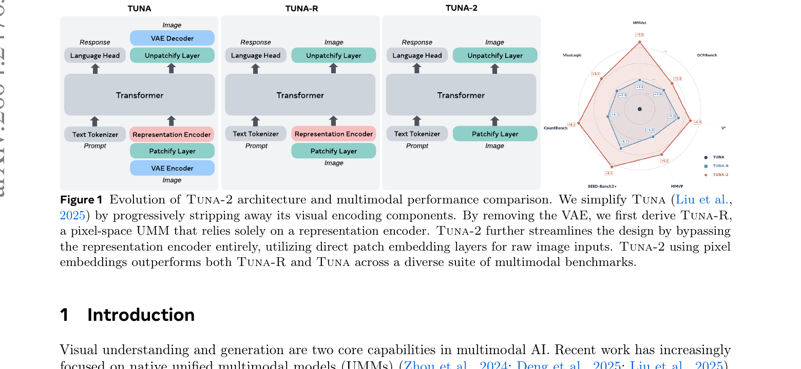
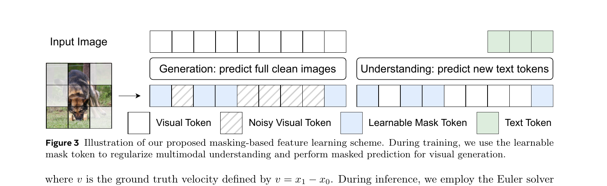
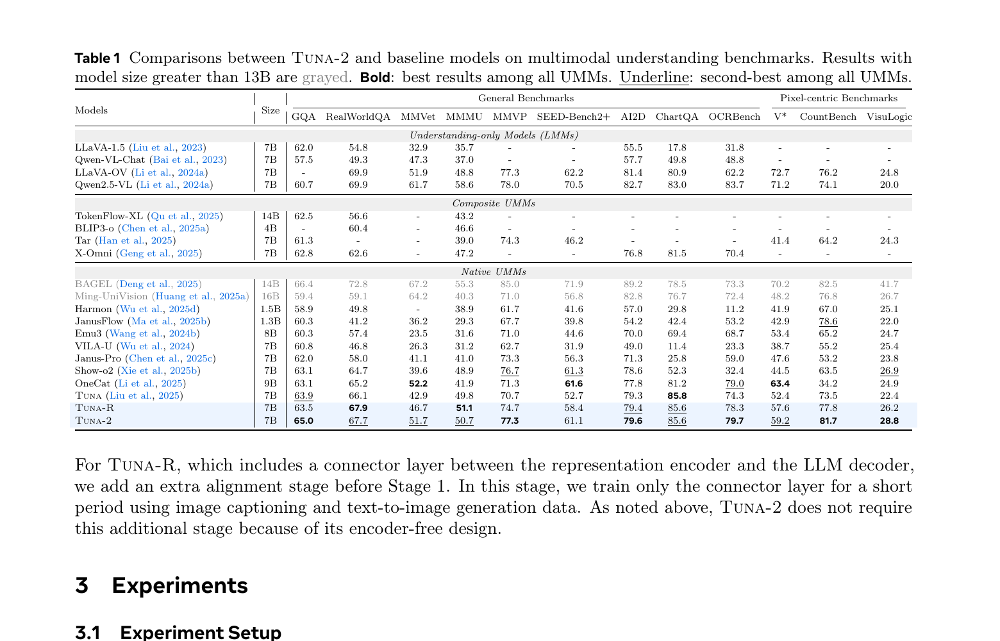
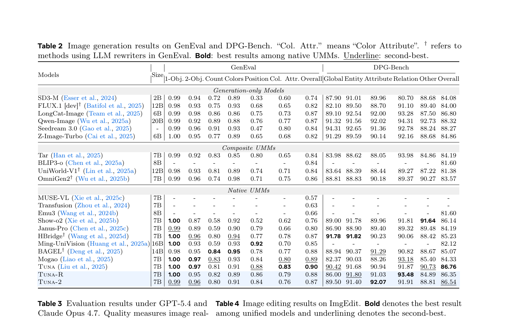
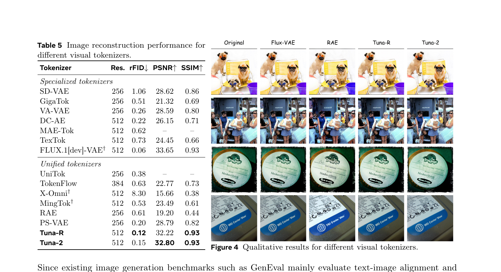
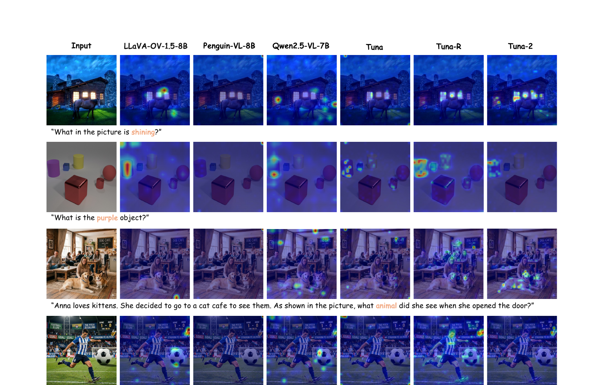
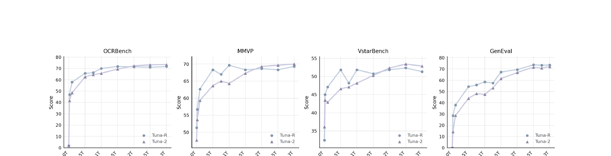
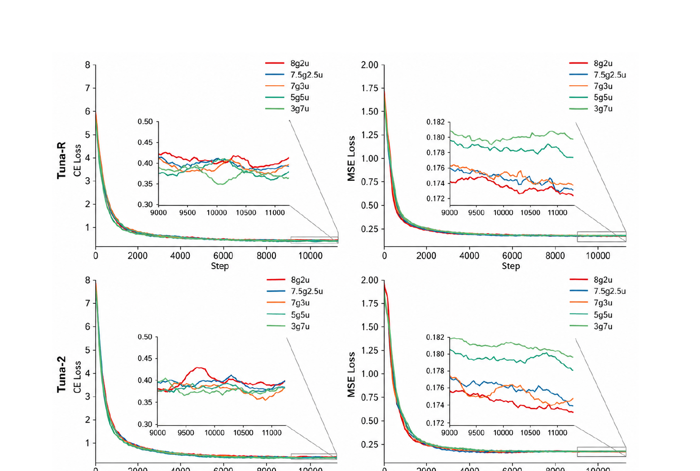

# Tuna-2: Pixel Embeddings Beat Vision Encoders for Multimodal Understanding and Generation

## 1. 出发点 (Motivation)

这篇论文是 SenseNova-U1 在 GenEval 表里反复对比的 Tuna 系列的**正式续作**。背景跟 SenseNova-U1 几乎一样的诉求 — 干掉 VAE 和 vision encoder 做端到端 — 但 Meta+港大+滑铁卢这队用更"实验科学"的路数: 给出三个连续简化的变体, 做**受控对比**。

具体要解决的痛点:

1. **表示空间错位**: 传统 UMM 用 CLIP/SigLIP 做理解, 用 VQ-VAE 做生成, 两套编码器目标完全不同, 训出来的特征互不兼容。
2. **VAE 信息瓶颈**: 8× / 16× 压缩本质上是有损的, 把图先过 VAE 再过 vision encoder 等于两次降维, 对**细粒度感知** (小物体、稠密细节) 是致命的。
3. **预训练编码器的归纳偏置**: 固定输入分辨率、抽象掉低层视觉细节、对 OCR / counting 等任务不友好。

核心问题: **能不能彻底丢掉预训练 vision encoder, 让模型直接从原始像素端到端学习, 并且*反过来*得到更强的视觉表征?**

论文的答案是"可以, 而且 understanding 上更好" — 这跟传统直觉是相反的 (大家以为 SigLIP/DINO 的语义 prior 是宝贵的)。证据是一个三阶段对照实验:

<table>
      <tbody><tr><th>变体</th><th>VAE</th><th>Repr Encoder</th><th>用什么编图</th></tr>
      <tr><td>Tuna (基线)</td><td>✓</td><td>✓ (SigLIP 2)</td><td>VAE latent 后再过 SigLIP</td></tr>
      <tr><td>Tuna-R (中间)</td><td>✗</td><td>✓ (SigLIP 2)</td><td>原始像素 → SigLIP</td></tr>
      <tr><td>Tuna-2 (终态)</td><td>✗</td><td>✗</td><td>原始像素 → Conv2d patchify</td></tr>
    </tbody></table>

## 2. 方法 (Method) — 高中生友好 + 数学严谨

### 核心思想 (类比)

把"看懂图"和"画图"这两件事放进同一个 transformer 里, 有三种做法:

- **双眼镜派 (Tuna)**: 戴一副"看图眼镜" (SigLIP) 看图, 戴一副"画图眼镜" (VAE) 画图。问题: 两副眼镜的世界观不同, 中间还要翻译。
- **单眼镜派 (Tuna-R)**: 只戴"看图眼镜" (SigLIP), 看的时候直接用、画的时候也强行用同一副 — 比上面好, 但 SigLIP 是为"分类"训练的, 不擅长画细节。
- **裸眼派 (Tuna-2)**: 不戴眼镜, 直接拿肉眼看像素。看似最弱, 但训练数据一多, **肉眼反而看得最准**, 尤其是数细节 (counting、OCR、小物体识别)。

"裸眼"具体是: **一个 Conv2d + RMSNorm** 就完了。没有预训练 VE, 没有 VAE, patch 之后直接当 token 喂给 LLM。

<figure>
      
      <figcaption>Fig. 1 — 三个变体的简化过程。左到右逐步剥离编码组件: Tuna 有 VAE + Repr Encoder, Tuna-R 砍掉 VAE, Tuna-2 把 Repr Encoder 也砍掉只剩 Patchify Layer。右侧雷达图显示 Tuna-2 在多数 benchmark 上反而最优。</figcaption>
    </figure>

### 2.1 三阶段架构演化

#### 从 Tuna 砍到 Tuna-2

共同 backbone: **Qwen2.5-7B-Instruct**。Diffusion head 是一个 10 层的 ModulatedAttentionBlock 串接 (类 DiT)。三个版本的差异只在视觉编码:

- **Tuna**: VAE encoder → SigLIP 2 → connector → LLM
- **Tuna-R**: SigLIP 2 (直接吃原图) → connector → LLM。Connector 需要单独 alignment stage (3K steps, lr=5e-4)。
- **Tuna-2**: `nn.Conv2d(3, 1152, kernel=16, stride=16) + RMSNorm` → LLM。**不需要 connector alignment stage**, 训练 pipeline 进一步简化。

<p class="code-source">repo/tuna/models/vision/patch_embed.py:L14-L64 — 整个 SimplePatchEmbedding 就这么短</p>

```python
class SimplePatchEmbedding(nn.Module):
    """Simple Conv2D-based patchifier with RMSNorm.
    Used by the "no encoder" Tuna variant (variant C). Takes raw RGB pixel
    values, splits them into non-overlapping patches via a strided Conv2d,
    and applies RMSNorm on the channel dimension."""
    def __init__(self, patch_size: int = 16, hidden_size: int = 1152, in_channels: int = 3):
        super().__init__()
        # Conv2d patchify: (B, C, H, W) -> (B, hidden_size, H/p, W/p)
        self.patch_embedding = nn.Conv2d(
            in_channels=in_channels, out_channels=hidden_size,
            kernel_size=patch_size, stride=patch_size, bias=True,
        )
        self.norm = nn.RMSNorm(hidden_size)

    def forward(self, pixel_values: torch.Tensor) -> torch.Tensor:
        embeddings = self.patch_embedding(pixel_values)          # (B, h, H/p, W/p)
        b, c, h, w = embeddings.shape
        embeddings = embeddings.reshape(b, c, h * w).transpose(1, 2)  # (B, N, h)
        return self.norm(embeddings)
```

对比 SenseNova-U1 那个两层卷积 + 2D RoPE 的"近无损接口"**更朴素** — Tuna-2 就一层 Conv2d (kernel=stride=16) + RMSNorm, 没有 2D 位置编码 (位置信息靠 LLM 的 1D RoPE 加 modality-aware 改造)。

### 2.2 像素空间 Flow Matching (x-prediction + v-loss)

生成端没有 VAE, 直接在像素空间做扩散去噪。沿用 **JiT** (Li & He, 2025) 的两个 trick: **x-prediction** 和 **v-loss reweighting**。

#### 定义

Rectified flow 线性插值定义"含噪像素" (Eq. 1):

- $x_1$: 真实干净图 (注意论文用 $x_1$ 表示"目的地"; 部分扩散文献用 $x_0$, 容易混淆)
- $x_0$: 起点纯噪声
- $t$ 是"信号纯度"刻度: $t=0$ 全噪, $t=1$ 干净图

模型 $\pi_\theta$ **直接预测干净图** $x_\theta$ (Eq. 2):

其中 $c$ 是条件 (T2I 时是文本, 编辑时是文本+源图)。

预测的 $x_\theta$ 转换为速度 (Eq. 3):

训练时用 MSE 让 $v_\theta$ 逼近真速度 $v = x_1 - x_0$ (Eq. 4):

#### 为什么是 "x-prediction + v-loss" 这个组合?

直接看 Eq. 3 可以推出: 在 v-loss 上做 MSE, 等价于在 x-prediction 上做**带 $1/(1-t)^2$ 权重的 MSE**。代入:

这个权重的好处是: 当 $t \to 1$ (接近干净图), 权重 $\to \infty$, 强迫模型在**低噪声端**预测得更准 — 而这正是肉眼最敏感的细节区域。代码里这个权重显式写出来:

<p class="code-source">repo/tuna/models/jit_utils.py:L74-L90 — JiT-style x0 prediction loss with v-loss reweighting</p>

```python
def jit_x0_prediction_loss(x0_pred, x0_target, t=None, mask=None):
    """MSE on x0 with optional 1/(1-t)^2 weighting and a token mask."""
    loss = F.mse_loss(x0_pred, x0_target, reduction="none")
    if t is not None and t.shape[0] == loss.shape[0]:
        t_expand = t.view(-1, *([1] * (loss.ndim - 1)))
        weights = 1.0 / (1.0 - t_expand).clamp(min=5e-2) ** 2  # ← v-loss 重加权
        loss = loss * weights
    if mask is not None:
        loss = loss[mask.bool()].mean()
    else:
        loss = loss.mean()
    return loss
```

`clamp(min=5e-2)` 这里关键 — 防止 $t \to 1$ 时权重爆炸, 把 $(1-t)$ 下限钉在 0.05, 等效最大权重 $1/0.05^2 = 400$。这是论文没提的**数值稳定 trick**。

#### 采样

推理时 Euler 求解 ODE: $x_{t'} = x_t + (t' - t) v_\theta$。代码里默认 50 步, 也支持 Heun。

### 2.3 Masking-based Visual Representation Learning (论文最关键的 trick)

这是 Tuna-2 区别于 NEO / SenseNova-U1 等同类工作的地方。**问题**: 像素空间维度太高, 模型容易学到"作弊捷径" (例如复制粘贴局部纹理而不理解语义)。

**方案**: 训练时随机 mask 一部分 patch, 用**可学习的 mask token** 替代:

<figure>
      
      <figcaption>Fig. 3 — 同一套 masking 应用到两种任务: <strong>生成时</strong> 模型在 noisy 输入上还要预测被 mask 区域的干净像素 (更难的去噪问题, 强迫 mask token 吸收上下文信息); <strong>理解时</strong> 模型在部分 mask 的图上回答问题 (regularization, 防止依赖 superficial 视觉 shortcut)。</figcaption>
    </figure>

**统一的 masking 操作, 两种角色:**

1. **生成任务**: 让 mask token 必须凭借可见 patch 推断被遮的内容 → 类似 **MaskGIT** / **DeTok** 的"补全"训练。
2. **理解任务**: 让模型在**不完整视觉输入**下也能答对问题 → 类似 **MAE** / **SigLIP 2** 的"掩码语义学习"。

#### 关键工程细节

- Mask ratio 默认 **75%** (跟 MAE 一样), 但每个样本独立从 $[\text{min}, 0.75]$ 均匀采样
- Mask token 初始化为 `scale * randn`, 其中 `scale = hidden_size^{-0.5}`
- **Masking 不是从头开 — 只在 pretraining 最后 40% 启用**。前 60% 让模型先建立基础多模态能力, 再加 mask 当 regularizer。
- 消融显示 (Tab. 6): Tuna-2 比 Tuna-R 更受益于 masking (Tuna-R 用 SigLIP 2, 而 SigLIP 2 本身预训练就有类似 masked 目标, 边际收益小)。

<p class="code-source">repo/tuna/models/tuna_2_pixel.py:L397-L415 — masking 应用 (训练时, 在 patch embedding 之后)</p>

```python
# Apply masked image (DeTok-style) after patch embedding
if self.enable_mask_token and self.training:
    import random
    import numpy as np

    B, N, D = image_embeds.shape

    # Generate random mask for each sample in batch
    for batch_idx in range(B):
        mask_ratio = random.uniform(
            self.config.masked_image_ratio_min,    # 默认 0.0
            self.masked_image_ratio                 # 默认 0.75
        )
        num_masked = int(N * mask_ratio)

        if num_masked > 0:
            mask_indices = np.random.choice(N, num_masked, replace=False)
            image_embeds[batch_idx, mask_indices] = self.mask_token
```

**注意**: 实现是 per-sample Python for 循环 + `np.random.choice` — 不是向量化的。在大 batch + 高分辨率下应该是个 **训练性能瓶颈**, 但论文没提。

### 2.4 两阶段训练 Pipeline

整套训练只有两阶段, 跟 SenseNova-U1 的六阶段比简单很多:

- **Stage 1 — Full-model pretraining (300K steps)**: 端到端联合训练理解 (image captioning) + 生成 (text-to-image) + 纯文本 (Nemotron)。数据配比 70% caption : 30% T2I, 加 20% text-only。LR = 1e-4, AdamW, 64 节点。
- **Stage 2 — Supervised finetuning (50K steps)**: 加入 image editing (OmniEdit 2M), instruction following (FineVision 13M), high-quality T2I 数据。LR = 2e-5。

共 **550M image-text pairs** 用于 Stage 1。Sequence length 固定 16K tokens/GPU。

Tuna-R 多一个 **connector alignment stage** (Stage 0): 只训 SigLIP-LLM 中间的 projection, 3K steps, lr=5e-4。Tuna-2 因为没 connector 跳过这一步 — 这是 architecture 简化带来的**真实节省**。

### 2.5 与代码对照 (Cross-Read)

主模型 `Tuna2Pixel` 的核心 forward 流程: 文本 token + 图像 patch (可选 mask) → 拼成 sequence → Qwen2.5 LLM → 分两路: text logits 走 NTP loss, image hidden states 走 diffusion head 预测 x0:

<p class="code-source">repo/tuna/models/tuna_2_pixel.py:L316-L322 — JiT-style x0 prediction head</p>

```python
# Predict x0 (clean image) directly - JiT style
x0_pred = self.diffusion_head_b(last_hidden_states, time_embeds, modality_positions)
loss_disp = torch.tensor(0.0, device=device)
if image_latents is None:
    loss_ntp = next_token_prediction(logits, text_labels, self.config.llm_vocab_size)
    loss_flow = torch.tensor(0.0, device=device)
    return logits, loss_ntp, loss_flow, loss_disp
```

Loss 组合: NTP (cross-entropy) + JiT (mse on x0 with v-loss reweight):

<p class="code-source">repo/tuna/models/tuna_2_pixel.py:L325-L340 — 损失计算入口</p>

```python
from tuna.models.misc import jit_x0_prediction_loss
loss_ntp = next_token_prediction(logits, text_labels, self.config.llm_vocab_size)
# JiT-style loss: directly predict clean images (x0)
if t.shape[0] == x0_pred.shape[0]:
    t_for_loss = t
elif t.shape[0] == x0_pred.shape[0] * 2:
    t_for_loss = t[1::2]           # CFG: cond/uncond 交错, 取一半的 t
else:
    t_for_loss = None
loss_flow = jit_x0_prediction_loss(
    x0_pred, new_image_labels[: x0_pred.shape[0]], t_for_loss, image_masks
)
return logits, loss_ntp, loss_flow, loss_disp
```

注意中间那段处理 **CFG 训练时的 t 交错**: 当 batch 维度被翻倍 (cond + uncond), 只取一半的 t 用于 loss reweighting — 这是论文也没提的实现细节。

## 3. 结论 (Key Findings)

### 3.1 多模态理解 — Tuna-2 反超 Tuna-R

<figure>
      
      <figcaption>Tab. 1 — 在 9 个 VQA benchmark 上, Tuna-2 (7B) 全面超越同尺寸 native UMM (BAGEL/Janus-Pro/Show-o2 等), 同时<strong>在大多数任务上反超 Tuna-R</strong> (该模型有 SigLIP 2 编码器)。最右三列 V* / CountBench / VisuLogic 是 "pixel-centric" 细粒度任务, Tuna-2 的优势更明显。</figcaption>
    </figure>

**关键数字 (Tuna-2 7B):**

- GQA **65.0** (vs Tuna 63.9, Tuna-R 63.5)
- MMVet **51.7** (vs Tuna 42.9, Tuna-R 46.7) — 提升 +9 pt
- MMVP **77.3** (vs Tuna 70.7, Tuna-R 74.7)
- OCRBench **79.7** (vs Tuna 74.3, Tuna-R 78.3)
- **V*** (find tiny objects in high-res images): Tuna-2 **59.2** vs Tuna 52.4, Tuna-R 57.6
- **CountBench**: Tuna-2 **81.7** vs Tuna 73.5, Tuna-R 77.8

解释: 去掉 SigLIP 这种 "为分类训练" 的语义编码器, 模型反而能保留更多**低层像素细节**, 在数细节 / 找小物体的任务上反超。

### 3.2 图像生成 — Tuna-R 微胜, 但差距随数据规模缩小

<figure>
      
      <figcaption>Tab. 2 — GenEval 上 Tuna 0.90, Tuna-R 0.88, Tuna-2 0.87。Tuna-R 在生成上稍强 (semantic prior 帮忙), 但 Tuna-2 也只差 0.01-0.02。DPG-Bench 上三者基本一致 (86.76 / 86.35 / 86.54)。</figcaption>
    </figure>

更有意思的是 **LLM-as-judge 评测** (Tab. 3, GPT-5.4 / Claude Opus 4.7): Tuna-2 在 **diversity** 上显著最优 (48.4% / 41.9% 偏好率), quality 跟 Tuna-R 相当。生成 diversity 高可能是因为没有 SigLIP 这种"语义收敛器"压制了 mode collapse。

### 3.3 图像重建 — PSNR 32.80 / SSIM 0.93, 同分辨率超过 FLUX VAE

<figure>
      
      <figcaption>Tab. 5 — 在 ImageNet val 上, 经过 lightweight 重建 finetune 后, <strong>Tuna-2 PSNR 32.80 / SSIM 0.93</strong> @ 512²。同分辨率下接近 FLUX.1[dev] VAE 的 33.65 / 0.93, 远超其他 "unified tokenizer" (RAE 19.20 / 0.44, X-Omni 15.66 / 0.38)。说明像素空间表示能保留高质量重建信息, 不必非要走 VAE 通路。</figcaption>
    </figure>

### 3.4 Attention map 可视化分析 — Tuna-2 不被语言先验带跑偏

<figure>
      
      <figcaption>Fig. 7 — 论文设计了几个"反直觉" prompt 测 Tuna-2 是否容易被语言先验骗。最有意思的是<strong>足球场案例</strong>: prompt 写"球员在踢东西", 图里有醒目的足球作为视觉干扰, 但<strong>实际被踢的是玻璃杯</strong>。LLaVA-OV / Penguin-VL / Qwen2.5-VL / Tuna 全部 attention 错聚焦到足球, 只有 Tuna-2 精确定位到杯子。证明 encoder-free 设计减少了对预训练语义先验的依赖。</figcaption>
    </figure>

### 3.5 Scaling 行为 — Tuna-R 早期领先, Tuna-2 晚期反超

<figure>
      
      <figcaption>Fig. 6 — 在 OCRBench / MMVP / V* / GenEval 上随 training tokens 增长的曲线。Tuna-R 早期 (~10B tokens) 占优 — SigLIP 的语义 prior 提供初始 boost; <strong>但 Tuna-2 在 ~30B tokens 之后反超</strong>。论文的判断: <em>large-scale unified pretraining 更适合 monolithic 架构, encoder-based 的 inductive bias 反而成为天花板</em>。</figcaption>
    </figure>

生成端 (GenEval) 上 Tuna-R 一直略胜, 但 gap 随 token 数**缓慢收敛**, SFT 之后几乎并列。

## 4. 实现细节 (Implementation Notes)

### 4.1 核心架构超参

- **LLM backbone**: Qwen2.5-7B-Instruct, attn_implementation="sdpa"
- **Patch size**: 16 (默认 Conv2d kernel=stride=16; SimplePatchEmbedding 中)
- **Hidden size (vision side)**: 1152 (SimplePatchEmbedding 默认) — 比 LLM hidden 3584 小
- **Diffusion head**: 10 层 `ModulatedAttentionBlock` + 1 层 `FinalLayer` (类 DiT, AdaLN 风格)
- **Mask token init**: `scale * randn(1, 1, hidden_size)`, scale = hidden_size^{-0.5}
- **位置编码**: 共用 LLM 的 1D RoPE + 一个 image_position_ids buffer; **不像 SenseNova-U1 那样有显式的 2D 位置编码**

### 4.2 v-loss 重加权 + 数值稳定

代码里 `jit_x0_prediction_loss` 把 v-loss 等价转写成 x-loss × $1/(1-t)^2$ 权重 (见 §2.2)。`(1-t).clamp(min=5e-2)` 把权重最大值钉在 400, 防止 $t \to 1$ 时梯度爆炸 — 论文 §2 没提这个 clamp, 但它对训练稳定性**非常关键**。

### 4.3 Masking 应用细节

- **触发条件**: `self.enable_mask_token and self.training` — 只在训练且开启该 flag 时生效, 推理时不 mask
- **逐样本独立采样**: per-sample for 循环, `random.uniform(min_ratio, 0.75)`
- **masked_image_ratio_min 默认 0.0** — 也就是 mask 比例从 0% 到 75% 均匀采样, 不是固定 75%
- 替换是 in-place: `image_embeds[batch_idx, mask_indices] = self.mask_token`
- **论文-代码 gap**: §2.2 描述说"masking 应用到 generation 和 understanding examples", 但代码这段是无差别对所有 image 输入应用 mask, **没有区分两类任务**。任务区分体现在 loss 计算: 生成任务有 flow loss, 理解任务只有 NTP loss。

### 4.4 训练 settings (按论文 §3.1)

<table>
      <tbody><tr><th>项目</th><th>Stage 1 Pretraining</th><th>Stage 2 SFT</th></tr>
      <tr><td>Steps</td><td>300K</td><td>50K</td></tr>
      <tr><td>LR</td><td>1e-4</td><td>2e-5</td></tr>
      <tr><td>Optimizer</td><td>AdamW</td><td>AdamW</td></tr>
      <tr><td>节点数</td><td>64</td><td>—</td></tr>
      <tr><td>Seq length</td><td>16K tokens/GPU</td><td>16K tokens/GPU</td></tr>
      <tr><td>数据</td><td>550M I-T pairs (70% cap + 30% T2I) + 20% text-only (Nemotron)</td><td>FineVision 13M + OmniEdit 2M + HQ T2I</td></tr>
      <tr><td>Masking</td><td>仅最后 40% 启用, p=50% 概率</td><td>—</td></tr>
    </tbody></table>

### 4.5 论文 vs 代码的几处不一致

- **v-loss reweighting clamp**: 论文 Eq. 3-4 是纯数学公式 $v = (x_\theta - x_t)/(1-t)$, 没提 $1-t$ 的下限。代码 `jit_utils.py:L84` 用 `clamp(min=5e-2)` — 这是 max-weight=400 的隐含截断, 不是数学定义。
- **masked_image_ratio_min**: 论文 §2.2 说 "according to a masking ratio", 暗示是单一 ratio。代码默认 `min=0.0, max=0.75`, 每个样本从这个区间均匀采样 — **实际 mask 比例的均值是 37.5%, 不是 75%**。
- **Masking 应用时机**: 论文 §3.4 说"masking 应用在 pretraining 最后 40% 步数", 代码里这个开关是 `enable_mask_token` 配置项, 由训练脚本控制何时启用, 不是模型自身知道当前 step 然后切换 — 需要外部 scheduler 配合。
- **CFG drop 概率**: 论文里完全没提 CFG 训练时如何 drop conditioning。代码 `tuna_2_pixel.py:L325-L340` 暗示 batch 维度有 cond/uncond 交错 (`t[1::2]`), 但具体 drop 概率没在公开代码里找到 — 训练时由外部数据 pipeline 决定。
- **Patch size**: 论文 Fig.1 写 "Patchify Layer" 没具体说 patch_size。`patch_embed.py` 默认 16; 但 `Tuna2Pixel.__init__` 默认 `patch_size=2, image_latent_dim=16` — 这是 VAE-latent 输入路径的默认值, **真实 pure-pixel 配置需要 patch_size=16, in_channels=3**, 通过外部 config 覆盖。论文没明确说哪种是 main config。

### 4.6 训练 loss 曲线观察 (Fig. 5)

<figure>
      
      <figcaption>Fig. 5 + Tab. 6 — 测了 8g2u / 7g3u / 5g5u / 3g7u 等数据配比。<strong>7:3 是最优 trade-off</strong> (生成 loss 收敛快, 理解 loss 也没受影响)。Tab. 6 验证 masking 对两个变体都有提升, Tuna-2 收益更大 (+1.5-3 pt 在 MMVP/CountBench)。</figcaption>
    </figure>

## 5. 批判性总结 (Critical Assessment)

### 5.1 优点

- **论文结构罕见地"实验科学"**: 不是直接提一个新架构, 而是通过 Tuna → Tuna-R → Tuna-2 的连续简化, 给出受控对比。Reader 能看清楚"砍掉 VAE 带来什么变化 (Tuna→Tuna-R) " vs "再砍掉 SigLIP 带来什么变化 (Tuna-R→Tuna-2)"。这比 SenseNova-U1 那种 "一锅端" 的论文叙事更有说服力。
- **反直觉的结论被 Scaling Curve 实证**: 不是仅靠最终 benchmark 数字声称 "encoder-free 更好", 而是给了 Fig. 6 的训练曲线 — Tuna-R 早期领先, 后期被 Tuna-2 反超。这清楚说明: SigLIP 的语义先验是**训练加速器, 不是天花板提升器**。
- **训练 pipeline 极简 + 完整开源**: 只有 2 个阶段 (vs SenseNova-U1 的 6 阶段), 训练代码完整放出 (vs SenseNova-U1 的 inference-only). 实验复现门槛低得多。
- **Pixel-centric benchmark 的设计**: V* / CountBench / VisuLogic 这三个 "细粒度" 任务是论文论点的关键证据 — encoder-free 设计在这些任务上获益最大, 跟 motivation 完全闭环。
- **Masking 复用 MAE/DeTok 的设计很巧**: 同一个 75% mask 操作同时充当生成的 inpainting 任务和理解的 regularization, 一份 trick 双倍收益。Tab. 6 证明对 Tuna-2 增益更大 (因为 SigLIP-based Tuna-R 已经吃过类似训练目标)。

### 5.2 不足 / 疑点

- **Tuna-2 在生成上一直略输**. GenEval 0.87 vs Tuna-R 0.88 / Tuna 0.90 — 差距虽然小但**稳定存在**。论文 framing 成"sufficient pretraining 后趋同", 但实际差距没消失。生成弱意味着 unify 的代价在哪一端被消化是不平衡的。
- **SFT 之后的趋同是 SFT 自身的功劳, 不一定证明架构**. Fig. 6 显示 Tuna-2 在 SFT 之后才完全追上 Tuna-R, 但 SFT 数据量很大 (FineVision 13M + OmniEdit 2M), **SFT 本身就能拉平很多差异**。"native architecture 更受益于 scale"的结论需要更长的 pretraining curve 才更可信。
- **Masking ratio 区间没充分消融**. 代码默认 [0, 0.75] 均匀采样 (均值 37.5%), 论文 §2.2 又说 75%。这个 区间宽度对效果的影响没做 ablation, 而 MAE 系列论文已经知道 mask 比例非常 sensitive。
- **Attention map 可视化的"反直觉"案例 cherry-picked 风险**. Fig. 7 的足球/玻璃杯案例只展示了 Tuna-2 答对的情况 — 这种 prompt 设计本身就偏向"裸眼看像素"派的优势。没看到 Tuna-2 答错而 Tuna-R 答对的反向例子, 这种**失败案例的对称展示**缺失。
- **跟 SenseNova-U1 / NEO-unify 的对比缺位**. 这俩是同期 native-encoder-free 路线的直接竞品 (从 Tuna-2 引用列表里能看到这两篇都已发表), 但 Tab. 1/Tab. 2 都没列。论文只跟 Tuna 系列内部和较老的 BAGEL/Janus-Pro 比, 漏掉了最直接的竞品。
- **Per-sample Python for 循环做 masking**. `tuna_2_pixel.py:L407-L415` 用 Python 层循环 + numpy 选 indices, 不是向量化的 torch ops。在大 batch (64 节点) + 高分辨率下, 这是**训练吞吐瓶颈**, 但论文没讨论 throughput。
- **Patch size = 16 是否最优? 没消融**. 不像 SenseNova-U1 那种 32× 激进压缩, Tuna-2 是 16× — 但论文没尝试更大 patch (32×) 或更小 (8×) 看 trade-off。考虑到 V* / CountBench 这种细粒度任务获益于细 patch, 这个超参的扫描本应该是重要消融。
- **"Pixel embeddings beat vision encoders" 的标题略 oversell**. 准确说法是"在 SigLIP-2 + Qwen2.5-7B 的特定组合下, 经过 300K steps 训练后, Tuna-2 在*多数 understanding 任务*上略胜 Tuna-R"。Beat 听上去更强。

### 5.3 适用 vs 不适用

- ✅ **适用**: 需要 fine-grained visual reasoning (OCR / counting / 小目标) 的 unified model 场景; 想要简单可复现训练 pipeline 的研究项目; 希望摆脱 VE/VAE 双重依赖的 native UMM 探索。
- ❌ **不适用**: 对生成 quality (尤其是 attribute binding) 要求极高的场景 (Tuna-R / 闭源大模型仍占优); 受限训练算力 (Tuna-2 需要 64 节点 ×300K steps, 不是小作坊能复现的); 短期就要部署的产品 (训练曲线证明它"晚到", 没有足够 token 时反不如 encoder-based)。

### 5.4 进一步阅读

- **JiT** [Li & He, 2025] — x-prediction + v-loss 的来源, Tuna-2 的训练 loss 直接 import
- **Tuna** [Liu et al., 2025] — 同作者的前作, 完整的 VAE + SigLIP 双 encoder 设计
- **NEO** / **Mono-InternVL** [Diao et al., 2025; Luo et al., 2025] — 同期"encoder-free for understanding"探索
- **SenseNova-U1** / **NEO-unify** — 同期 native UMM 竞品 (本博客已读, 见 [这里](../sensenova-u1/index.html))
- **MAE** [He et al., 2022] / **DeTok** [Yang et al., 2025] / **MaskGIT** [Chang et al., 2022] — Tuna-2 masking 策略的思想源头
- **REPA** [Yu et al., 2024] — 解释了为什么 SigLIP 的 semantic prior 对生成质量重要 (Tuna-2 的 limitation 也由此可解释)

---

<footer>
    <p>Read on 2026-05-12 · Generated with the <code>reading-papers</code> skill · 论文 PDF: 20 页 · 代码: 1884 文件 (~250K LoC 主要来自 lmms-eval 评测框架, 核心 Tuna 模块 ~10K LoC)</p>
  </footer>
