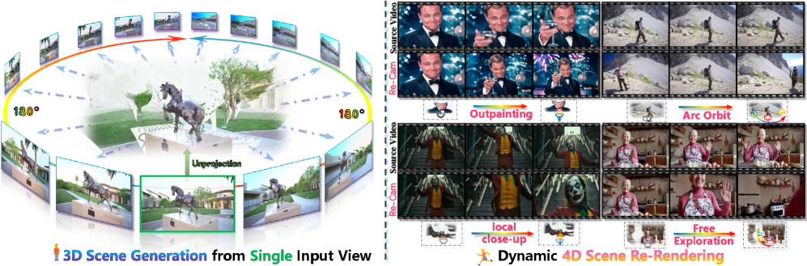
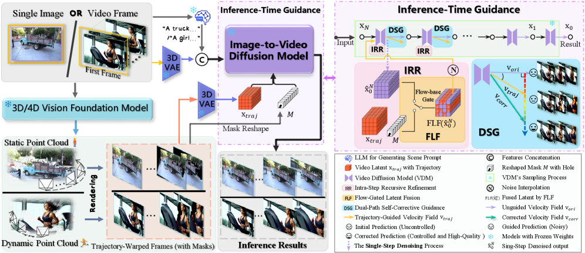
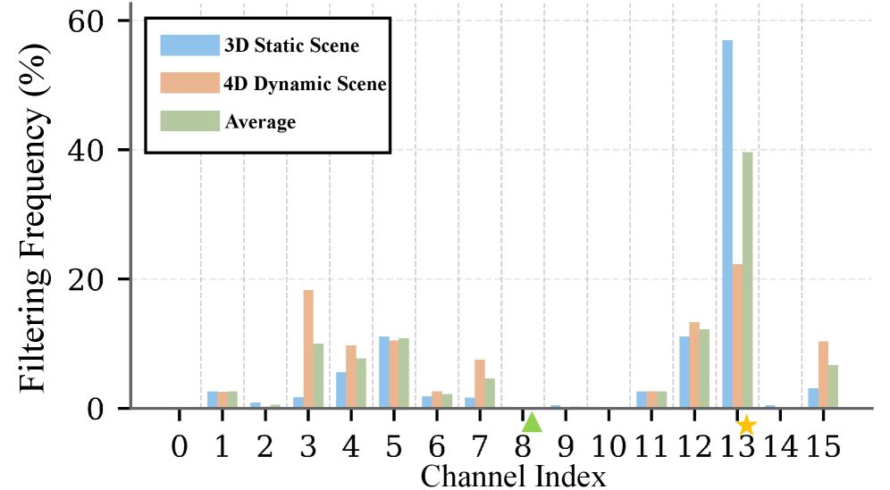
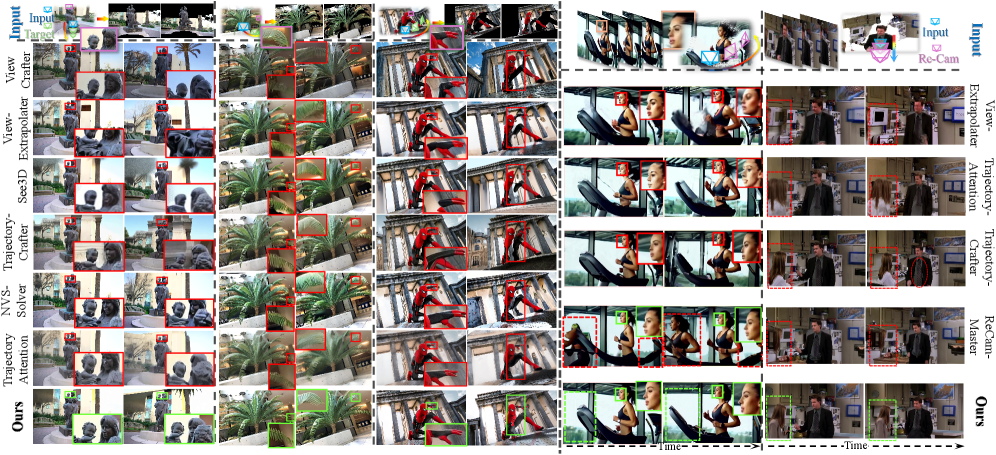
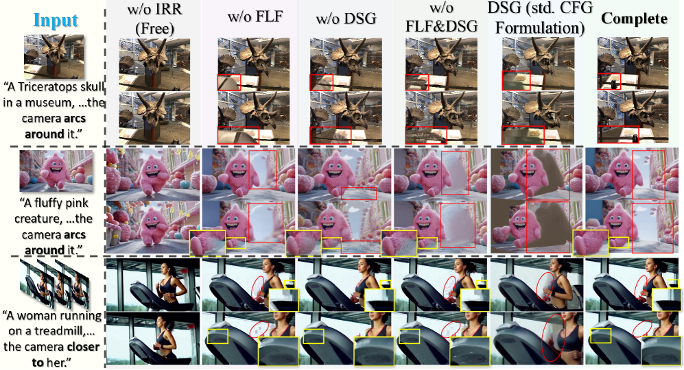
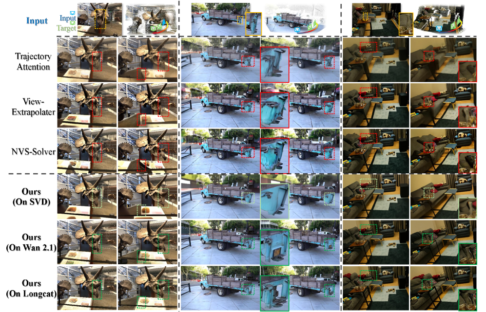

# WorldForge: 不训练,把 6-DoF 相机轨迹"注射"进 Wan2.1 视频扩散模型

<figure>
    
    <figcaption>Fig. 1 — 左:单图输入,沿用户轨迹生成 3D 场景视频;右:已有动态视频沿新轨迹"re-filming"。<strong>所有结果均 zero-shot — 主干 Wan2.1 I2V-14B 不做任何微调。</strong></figcaption>
  </figure>

## 1. 出发点 (Motivation)

视频扩散模型 (VDM) 像 Wan2.1、SVD、CogVideoX,在百万小时视频上预训出了非常丰富的时空先验。但**"把它当 3D / 4D 引擎用"几乎不可能**:

- **训不动相机控制 (training-based):** CameraCtrl / MotionCtrl / ReCamMaster / 3DTrajMaster / VD3D 都是"在 motion-conditioned 数据上 finetune 主干"。问题是 — (a) 算力贵到 GPU 月,(b) 在 fine-tuning 数据分布外的相机轨迹上崩溃,(c) 微调会"伤"主干预训学到的物理/光照先验。论文原话:*"computationally costly, generalizes poorly, and risks degrading pretrained priors."*
- **训练免费的 "warp-and-repaint" (training-free):** NVS-Solver / ViewExtrapolator / TrajectoryAttention / Free4D 走的是另一条路 — 用单目深度把源帧 warp 到目标视角,再让 VDM 把*遮挡空洞 + warp 噪点*当 inpainting 修补。问题是预训模型**没见过这种 warp 出来的 OOD 输入**,常常出现"幻觉运动" (静态场景被模型脑补成动态) 和"几何碎裂"。

**WorldForge 押的注:**VDM 已经知道"视频应该长什么样",我们只需要在推理时"告诉它相机该怎么走" — 不重新训,不改权重,只在 50 步去噪的**前 ~20 步**插入三个 guidance 模块,把"目标轨迹"软性注入 latent 轨道里就够。

**TL;DR (30 字):** 训练免费、推理时分三层引导 (IRR + FLF + DSG),把 6-DoF 相机轨迹注入预训 VDM,既不掉画质又拿 SOTA 控制精度。

## 2. 方法 (Method)

### 核心思想 (类比)

把扩散模型的 50 步采样想成"画家从一片噪点反推一段视频":

- 原本画家可以画任何视角 — 我们想强行规定"必须从这个角度看"。
- **IRR (递归精炼) ≈ 在每一次画到一半时,把"参考照片里看得见的部分"硬贴回去 → 再加点噪声让画家继续画。**是一个 per-step 的预测-校正循环,但只发生在*干净 $\hat{x}_0$ 空间*,不在带噪的 $x_t$ 空间 — 这一点 critical,因为是 FLF 能选 channel 的前提。
- **FLF (光流门控融合) ≈ VAE 的 16 个潜变量 channel 不是平等的 — 有的管"形状",有的管"运动方向"。**我们光流测每个 channel,只覆盖"运动方向跟目标轨迹一致"的 channel,留下其它 channel 让模型自由发挥纹理。
- **DSG (双路自校正) ≈ 跑两次预测:一次"自由发挥" (画质好但不走我们要的轨迹),一次"被 IRR/FLF 强制约束" (走对轨迹但有 warp 伪影)。**然后把两者做*APG/CFG-Zero 风格的正交投影*,只保留"约束方向上的修正",滤掉"约束本身带进来的噪点"。

结果是 — 模型仍然在自己熟悉的 video manifold 上采样,只是"被推往"用户指定的相机路径。

### 2.1 整体管线

<figure>
      
      <figcaption>Fig. 2 — WorldForge framework。左侧:单张图或视频帧 → VGGT 重建点云 + 估计 camera/depth → 沿用户给的目标轨迹 warp 成"trajectory-warped frames" $I'_{tar}$ + 可见性 mask $M$。右侧:Wan2.1 I2V 的 50 步 UniPC 采样,前 ~20 步每步插入 <strong>IRR → FLF → DSG</strong> 三个模块,后 ~30 步退回 vanilla 去噪。整个过程<em>不训练任何参数</em>。</figcaption>
    </figure>

底座是任意一个 latent video diffusion model (paper 用 Wan2.1 I2V-14B / SVD / LongCat-Video)。Wan2.1 的一步去噪:

$\hat{\mathbf{x}}_0$ 是当前步对"最终干净 latent"的预测。**WorldForge 三个模块全部作用在 $\hat{\mathbf{x}}_0$ 上,而非 $\mathbf{x}_t$。**这是和 RePaint / NVS-Solver 最本质的差异 — 后者在*带噪 latent 空间*融合,VAE 解码会把 warp 的硬边变成 ringing artifact;前者在*干净 latent 空间*融合,光流和 mask 行为可预测。

Warp 是一个标准的可微 splatting:

- $\mathbf{I}_{src}, \mathbf{D}_{src}$ — 源 RGB + 深度 (来自 VGGT / UniDepth / Mega-SaM / DepthCrafter)。
- $\mathbf{P}_{src}, \mathbf{P}_{tar}$ — 源 / 目标相机姿态 (用户给)。
- $\mathbf{I}'_{tar}$ — 沿目标轨迹 warp 出来的目标帧,带遮挡空洞。
- $\mathbf{M}_{tar}$ — 可见性 mask (空洞处 = 0)。

Warp 完的帧用 VAE encode 进 latent 空间,叫 $\mathbf{x}_{\text{traj}}$。从这里开始三个模块上场。

### 2.2 IRR — Intra-Step Recursive Refinement (步内递归精炼)

**Plain English:** 每一步去噪后,把 $\hat{\mathbf{x}}_0$ 中"mask 可见区域"换成 trajectory latent,再用 scheduler 的 add_noise 把结果*退回*到当前 sigma 噪声水平,让 transformer 再去噪一次 (paper 称为"resample")。每个 outer step 跑 2~3 次这种"贴回-去噪"循环。本质是 per-step 预测器-校正器。

- $\hat{\mathbf{x}}_0^{(t)}$ — 当前步预测的"干净 latent"。
- $\mathbf{x}_{\text{traj}}$ — VAE-encoded warp 帧 (固定不变)。
- $\mathbf{M}$ — 二值可见性 mask (硬贴边会有 ringing,代码里用*距离变换 + sine decay* 软化,见 §4)。
- $\mathbf{F}$ — mask blend。
- $w(\sigma)$ — re-noise 强度,跟随当前 sigma 调度。
- $\boldsymbol{\epsilon}\sim\mathcal{N}(\mathbf{0}, \mathbf{I})$ — Gaussian 噪声。

**与 RePaint 的差异:**RePaint 在 $\mathbf{x}_{t-1}$ (带噪) 空间融合,WorldForge 在 $\hat{\mathbf{x}}_0$ (干净) 空间。*这一选择决定了 FLF 能否工作* — 因为只有在 clean latent 空间,VAE channel 的"运动语义"才是稳定的。

### 2.3 FLF — Flow-Gated Latent Fusion (光流门控潜变量融合)

**Plain English:** Wan2.1 的 VAE latent 有 16 个 channel,作者发现它们的"运动语义角色"*稳定*:某些 channel 主要编码运动方向,另一些主要编码外观纹理。如果 IRR 在*所有 16 个 channel* 上都贴 warp 帧,会把"外观 channel"也覆写掉,纹理就坏了。FLF 的做法:

1. 对 $\hat{\mathbf{x}}_0$ 和 $\mathbf{x}_{\text{traj}}$ 的**每个 channel**分别跑 RAFT/Farnebäck 光流。
2. 用三种 metric 算 channel 的"运动一致性分数" $S^{(t,c)}$:Masked End-Point Error (M-EPE)、Masked Angular Error (M-AE)、Outlier % (Fl-all)。
3. 分数低于自适应阈值 $\delta^{(t)} = \mu_S - \lambda\sigma_S$ 的 channel**不被覆写** (让模型自由发挥纹理);其它 channel 才接受 IRR 的 warp 注入。

- $c$ — channel 下标 ($c=0\ldots 15$)。
- $\gamma_k = [0.4, 0.4, 0.2]$ — EPE / AE / Fl-all 的权重 (paper 值;代码里 §4 写的是 $[0.45, 0.10, 0.45]$,小差异)。
- $\lambda^{(t)} = 0.65$ — 阈值标准差倍数,paper 说"loose-to-tight" schedule。

Eq. 7 替换掉 Eq. 5 里的 $\mathbf{F}$,所以 FLF 是 IRR 的*插件*。

<figure>
      
      <figcaption>Fig. 4 — 16 个 VAE channel 在 40+ 静态场景和 30+ 动态场景上"被 FLF 过滤掉" (= 不接受 warp 注入) 的频率。<strong>Channel 13 几乎 100% 被过滤</strong> (编码运动无关的细节,如纹理),<strong>channel 8 几乎从不被过滤</strong> (主管运动方向,该被 warp 控制)。这种角色分配在静态/动态场景上分布一致 → 证明 VAE latent 的 channel 语义稳定。</figcaption>
    </figure>

### 2.4 DSG — Dual-Path Self-Corrective Guidance (双路自校正引导)

**Plain English:** 即使 IRR + FLF 加上,warp 帧本身带 depth error / occlusion hole,模型很难完全"信任"它们。DSG 在每个 step 跑两次前向:

- **Unguided path:** 用原始 $\mathbf{x}_t$ 跑 → 得到速度场 $\mathbf{v}_t^{\text{ori}}$ (画质好,轨迹自由)。
- **Guided path:** 用 IRR/FLF 修过的 $\mathbf{x}_t'$ 跑 → 得到 $\mathbf{v}_t^{\text{traj}}$ (轨迹对,有 warp 噪点)。

关键观察:作者实测两条速度场之间的余弦相似度 $\alpha_t$ 通常落在**0.3–0.6** (角度 50°–70°),远大于普通 CFG 的"prompt 改一改"的角度差。直接套 CFG (加权差分) 会因为*方向差太大*而崩 — 需要把"差异中跟 guided 方向平行的部分"投影掉,只用正交分量。

- $\alpha_t = \cos\theta = \mathbf{v}_t^{\text{traj}}\cdot \mathbf{v}_t^{\text{ori}}/(\|\mathbf{v}_t^{\text{traj}}\|\|\mathbf{v}_t^{\text{ori}}\|)$ — 余弦相似度。
- $\beta_t = \sqrt{1-\alpha_t^2} = \sin\theta$ — *自适应权重:两条路越正交,修正越大*。这是 APG/CFG-Zero 公式,被 WorldForge 借用到"自身两条 path"的场景。
- $\rho = 4.0$ — guidance scale (paper 推荐;代码里 omega 默认 1.8,run_test_case.sh 设 4)。
- $(\mathbf{v}_t^{\text{traj}} - \alpha_t \mathbf{v}_t^{\text{ori}})$ — guided 速度场扣掉与 unguided 平行的分量 → 剩下的就是"轨迹修正方向"。

这是**关键 design choice**:消融里用普通 CFG 形式替换 DSG,FID 从 96 涨到 121 (比完全去掉 DSG 还烂),说明"方向差大时必须做正交投影"。

### 2.5 完整算法

Wan2.1 I2V-14B,50 步 UniPC scheduler:

```text
输入: 单张图 / 视频帧 I_src + 用户相机轨迹 P_tar[1..N]
预处理:
  (1) VGGT 估计 camera P_src + depth D_src
  (2) warp_single_img(I_src, D_src, P_src, P_tar) → I'_tar, M  (PNG 落盘)
  (3) VAE encode I'_tar → x_traj (latent 空间,在每个 step 内重算)

主循环 for t in [T..1]:
  if t 在前 guide_steps (=20) 步:
    for r in [0 .. resample_steps-1]:   # IRR 内循环, 2~3 次
      noise_pred = transformer(x_t, condition, t)
      noise_pred += guidance_scale * (noise_pred - noise_uncond)  # CFG
      存入 derivative_history
      pred_x0 = scheduler.step(noise_pred, t, x_t,
                               video_ref=I'_tar, mask=M,
                               use_pca_channel_selection=True)
        # ↑ scheduler 内部: VAE.decode(pred_x0) → mask-blend I'_tar
        #                   → VAE.encode → FLF channel select 还原
      if r < resample_steps-1:
        x_t = scheduler.add_noise(pred_x0, ε, t)   # re-noise → 下一轮 IRR
    # IRR 内循环结束
    if len(derivative_history) ≥ 2:
      DSG: 取 history[0]=noise_pred_worse, history[-1]=noise_pred_good
           按 Eq. 8 算 noise_pred_better
           scheduler.step(noise_pred_better, ...) → x_{t-1}
  else:
    # 后 30 步: 标准 UniPC 去噪, 无 IRR/FLF/DSG
    x_{t-1} = scheduler.step(transformer(x_t, ..., t), t, x_t)

输出: VAE.decode(x_0) → 49 帧 720p 视频 @ 16fps
```

三个模块的角色:

- **IRR** = 外循环 (per-step 的 predictor-corrector,2-3 轮)。
- **FLF** = 内部门控 (在 scheduler step 里决定哪些 channel 接受 warp 注入)。
- **DSG** = 收尾合成 (从 IRR 内循环的"早期"和"晚期"两个 noise prediction 做正交合成,产出真正用来 step 的速度场)。

## 3. 结论 (Key Findings)

<figure>
      
      <figcaption>Fig. 3 — 定性对比。左半部分:单图 → 3D 新视角合成,WorldForge 没有 "floating heads / flattened faces" 的典型 OOD 伪影;右半部分:动态视频 → 沿新轨迹重新拍摄,WorldForge 物体形状 / 表情都稳定保留。</figcaption>
    </figure>

**Table 1 — 3D 静态场景 (70+ views from 40+ scenes):**

<div style="overflow-x:auto">
    <table>
      <thead><tr><th>Method</th><th>FID↓</th><th>CLIP_sim↑</th><th>ATE↓</th><th>RPE-T↓</th><th>RPE-R↓</th><th>训练免费</th></tr></thead>
      <tbody>
        <tr><td>See3D</td><td>123.26</td><td>0.941</td><td>0.091</td><td>0.089</td><td>0.250</td><td>✗</td></tr>
        <tr><td>ViewCrafter</td><td>117.50</td><td>0.930</td><td>0.236</td><td>0.315</td><td>0.728</td><td>✗</td></tr>
        <tr><td>ViewExtrapolator</td><td>125.50</td><td>0.930</td><td>0.183</td><td>0.260</td><td>0.882</td><td>✓</td></tr>
        <tr><td>TrajectoryAttention</td><td>122.37</td><td>0.920</td><td>0.159</td><td>0.238</td><td>0.532</td><td>✗</td></tr>
        <tr><td>TrajectoryCrafter</td><td>111.49</td><td>0.910</td><td>0.090</td><td>0.152</td><td>0.267</td><td>✗</td></tr>
        <tr><td>NVS-Solver</td><td>118.64</td><td>0.937</td><td>0.224</td><td>0.268</td><td>1.056</td><td>✓</td></tr>
        <tr><td><strong>WorldForge</strong></td><td><strong>96.08</strong></td><td><strong>0.948</strong></td><td><strong>0.077</strong></td><td><strong>0.086</strong></td><td><strong>0.221</strong></td><td>✓</td></tr>
      </tbody>
    </table>
    </div>

WorldForge 在*每个*指标上都领先,而且是唯一一个 zero-shot 方法把所有训练式 baseline 都打过的。

**Table 2 — 4D 动态场景 (50+ videos from 30+ sources, DAVIS + 电影片段 + VDM 自生成):**

<div style="overflow-x:auto">
    <table>
      <thead><tr><th>Method</th><th>FVD↓</th><th>CLIP-V_sim↑</th><th>ATE↓</th><th>RPE-T↓</th><th>RPE-R↓</th><th>训练免费</th></tr></thead>
      <tbody>
        <tr><td>ViewExtrapolator</td><td>108.48</td><td>0.913</td><td>1.040</td><td>1.208</td><td>4.750</td><td>✓</td></tr>
        <tr><td>TrajectoryAttention</td><td>106.94</td><td>0.911</td><td>0.605</td><td>1.238</td><td>3.560</td><td>✗</td></tr>
        <tr><td>TrajectoryCrafter</td><td>97.31</td><td>0.923</td><td><strong>0.431</strong></td><td>1.078</td><td>8.950</td><td>✗</td></tr>
        <tr><td><strong>WorldForge</strong></td><td><strong>93.17</strong></td><td><strong>0.938</strong></td><td>0.527</td><td><strong>0.826</strong></td><td><strong>2.690</strong></td><td>✓</td></tr>
      </tbody>
    </table>
    </div>

4D 动态比 3D 静态难得多 — WorldForge 拿到 FVD / 感知 / 旋转 / 平移 误差 4/5 个最佳,ATE 上输给 TrajectoryCrafter 但旋转误差只有它的 1/3。

<figure>
      
      <figcaption>Fig. 5 — 组件消融 (定性)。从左到右:输入 prompt → 去掉 IRR (退化成自由生成,跟 prompt 走但没轨迹控制) → 去掉 FLF (画质崩) → 去掉 DSG (轨迹有偏) → 去掉 FLF&amp;DSG → DSG 换成标准 CFG 公式 (反而比无 DSG 还差) → 完整方法。红框/黄框是问题区域。</figcaption>
    </figure>

**Table 3 — 数值消融 (FID/CLIP for 3D, FVD/CLIP-V for 4D):**

<div style="overflow-x:auto">
    <table>
      <thead><tr><th>Variant</th><th>Static FID↓</th><th>Static CLIP↑</th><th>Dyn FVD↓</th><th>Dyn CLIP-V↑</th></tr></thead>
      <tbody>
        <tr><td>w/o DSG</td><td>109.43</td><td>0.943</td><td>95.69</td><td>0.937</td></tr>
        <tr><td>w/o FLF</td><td>112.69</td><td>0.945</td><td>99.79</td><td>0.932</td></tr>
        <tr><td>w/o DSG &amp; FLF</td><td>113.12</td><td>0.943</td><td>103.17</td><td>0.931</td></tr>
        <tr><td>DSG using vanilla CFG</td><td>120.91</td><td>0.936</td><td>109.10</td><td>0.919</td></tr>
        <tr><td><strong>Complete</strong></td><td><strong>96.08</strong></td><td><strong>0.948</strong></td><td><strong>93.17</strong></td><td><strong>0.938</strong></td></tr>
      </tbody>
    </table>
    </div>

**最有意思的一行:**"DSG using vanilla CFG" 比"w/o DSG"还要差 (FID 121 vs 109)。*方向差太大时,简单加权 = 在错误方向加重错误。*这是 DSG 必须用正交投影的关键证据。

<figure>
      
      <figcaption>Fig. 6 — 把 WorldForge 三模块原样搬到 SVD / Wan2.1 / LongCat-Video 三种主干上,全部 work。说明 framework 对主干的 latent shape / 训练 schedule 都不敏感 — 关键约束只是"latent 是 VAE encoded 且 channel 有运动语义"。</figcaption>
    </figure>

## 4. 实现细节 (Implementation Notes — paper 没说的 code-only 细节)

代码:`github.com/Westlake-AGI-Lab/WorldForge`(commit `ee573a0`)。主路径:`wan_for_worldforge/infer_worldforge.py` → `utils/pipeline_wan_i2v_clean.py` → `utils/scheduling_unipc_multistep_clean.py`。Code cross-read 揪出的 10+ 个细节:

### 4.1 IRR 主循环 (per-step resample)

<p class="code-source">repo/wan_for_worldforge/utils/pipeline_wan_i2v_clean.py:L562-L662 — IRR 外循环 + scheduler.step + add_noise re-noise</p>

```python
with self.progress_bar(total=num_inference_steps) as progress_bar:
    for i, t in enumerate(timesteps):
        self.scheduler.derivative_history = []
        for r in range(resample_steps):
            if r > 0:
                self.scheduler.set_resample_mode(True)
                resample_timestep = self.scheduler.get_resample_timestep(i)
                timestep_for_transformer = resample_timestep.expand(latents.shape[0])
            else:
                self.scheduler.set_resample_mode(False)
                timestep_for_transformer = t.expand(latents.shape[0])
            # CFG forward
            latent_model_input = torch.cat([latents, condition], dim=1)
            noise_pred = self.transformer(...)[0]
            if self.do_classifier_free_guidance:
                noise_uncond = self.transformer(...)[0]
                noise_pred = noise_pred + guidance_scale * (noise_pred - noise_uncond)
                if r < 1:
                    self.scheduler.derivative_history.append(noise_pred)  # for DSG
            # FLF fusion happens inside scheduler.step (see 4.2)
            scheduler_output = self.scheduler.step(noise_pred, t, latents,
                mask=mask, guided=guided and i < guide_steps,
                video_latents=video_ref, vae=self.vae, resampling=r > 0, ...)
            pred_original_sample = scheduler_output.pred_x0
            if r < resample_steps - 1:
                # IRR re-noise: 把 pred_x0 退回当前 sigma 的噪声水平
                noise = torch.randn(pred_original_sample.shape, device=device)
                latents = self.scheduler.add_noise(pred_original_sample, noise,
                    self.scheduler.get_resample_timestep(i), r, use_resample_sigma=True)
```

注意 `derivative_history` 只在 `r < 1` 时 append(代码里写的是 `r < 1` 不是 `r == 0`,等价但更脆弱)。**如果 `resample_steps = 1`,DSG 静默 no-op。**

### 4.2 FLF 在 scheduler 内部的实现

<p class="code-source">repo/wan_for_worldforge/utils/scheduling_unipc_multistep_clean.py:L1373-L1417 — VAE decode → mask blend → VAE encode → channel select 还原</p>

```python
video_latents = 2.0 * video_latents - 1.0          # 0..1 → -1..1
if mask.shape[1] != decoded_video.shape[1]:
    mask = mask.repeat(1, decoded_video.shape[1], 1, 1, 1)
fused_video = video_latents * mask + decoded_video * (1 - mask)  # pixel-space blend
encoded_video = vae.encode(fused_video).latent_dist.mode()
encoded_video = (encoded_video - latents_mean) * latents_std
if kwargs.get('use_pca_channel_selection') and not kwargs.get('resampling', False):
    if self._pca_selector is None:
        self._pca_selector = VideoMotionPCASelector()
    channels_to_replace = self._pca_selector.select_motion_related_channels(
        pred_original_sample=pred_original_sample,
        video_latents=encoded_video_aligned,
        keep_channels=12, current_step=current_step, total_steps=total_steps,
        use_optical_flow=use_optical_flow, static=static,
    )
    # 不接受 warp 的 channel: 把 pred_x0 的值贴回来
    for channel_idx in channels_to_replace:
        encoded_video[:, channel_idx, :, :, :] = pred_original_sample[:, channel_idx, :, :, :]
return encoded_video
```

这段是 FLF 的实际执行。两个 critical points:

- **"PCA" 是个 misnomer.** 类名叫 `VideoMotionPCASelector`,flag 叫 `use_pca_channel_selection`,但实现里没有任何 PCA — 就是 OpenCV Farnebäck 光流 + EPE/AE/Fl-all 加权评分 (`scheduling_unipc_multistep_clean.py:L338-L437`)。Paper 写 "PCA channel selection",代码做 "optical-flow channel selection"。
- **融合发生在 pixel 空间,不是 latent 空间。**每一步 IRR 都要:VAE decode → mask blend → VAE encode 一遍。这是*主要的计算开销* (paper Table S3 也确认了这点)。

### 4.3 DSG 投影公式

<p class="code-source">repo/wan_for_worldforge/utils/pipeline_wan_i2v_clean.py:L664-L708 — 从 derivative_history 取首末两个 noise_pred,正交投影</p>

```python
if len(self.scheduler.derivative_history) > 1:
    noise_pred_good  = self.scheduler.derivative_history[-1]  # IRR 收敛后的"好"预测
    noise_pred_worse = self.scheduler.derivative_history[0]   # IRR 起步时的"差"预测
    dot_product = torch.sum(noise_pred_good * noise_pred_worse, dim=[1,2,3,4], keepdim=True)
    norm_good  = torch.sqrt(torch.sum(noise_pred_good**2,  dim=[1,2,3,4], keepdim=True))
    norm_worse = torch.sqrt(torch.sum(noise_pred_worse**2, dim=[1,2,3,4], keepdim=True))
    cos_theta = dot_product / (norm_good * norm_worse + 1e-8)
    sin_theta = torch.sin(torch.acos(torch.clamp(cos_theta, -1.0, 1.0)))
    magnitude_ratio = norm_good / (norm_worse + 1e-8)
    if i >= guide_steps:
        omega = omega_resample
    # Eq. 8 的代码版: noise_pred_better = good + ω·sin(θ)·(good - (|good|/|worse|·cos(θ))·worse)
    noise_pred_better = noise_pred_good + omega * sin_theta * (
        noise_pred_good - (magnitude_ratio * cos_theta) * noise_pred_worse)
    # 倒回一步, 用 noise_pred_better 重新跑 multistep UniPC
    self.scheduler._step_index -= 1
    noise_pred_convert = self.scheduler.convert_model_output(noise_pred_better, sample=latents)
    self.scheduler.model_outputs[-1] = noise_pred_convert
    latents = self.scheduler.multistep_uni_p_bh_update(
        model_output=noise_pred_better, sample=latents, order=self.scheduler.this_order)
```

关键:`noise_pred_worse` 和 `noise_pred_good` **不是 conditional / unconditional** (那是 CFG),而是**同一个 IRR 内循环的"早期"和"晚期"两次 CFG 后预测**。Paper 写 "unguided vs guided",代码里其实是"IRR 第一轮 vs 最后一轮"。是更 elegant 的设计 — 不需要额外跑一遍模型。

### 4.4 5+ 条 paper 没强调的实现细节

- **FLF 头 5 步禁用,6-10 步只换 ≤1 channel,>10 步才到 ≤6 channel:** `scheduling_unipc_multistep_clean.py:L364-L416`。Paper 提到 "loose-to-tight schedule" 但没给具体阶段。代码硬编码 3 阶段。`keep_channels=12` 这个参数被 step-aware cap 完全覆盖,实际只换 0/1/2..6 个。
- **Mask 边缘软化:** `infer_worldforge.py:L105-L150` 用 OpenCV 距离变换在 mask 内部 15 px 做 sine/linear/cos/exp decay,paper 完全没提。否则硬边的 mask 在 VAE encode 后会产生 ringing。
- **两套硬编码负 prompt:** `infer_worldforge.py:L276-L277`,按 `--static` 选 "静态场景" 或 "动态场景" 版本。其中一个把 "signboard" 拼错成 "sighboard"。是 paper 隐藏的"recipe"的一部分。
- **argparse default 跟 run_test_case.sh 不一致:** `omega=1.8 (CLI) vs 4 (脚本)`,`resample_steps=3 (CLI) vs 2 (脚本)`,`guidance_scale=5.0 (CLI) vs 4 (脚本)`。脚本的值才是产 paper 结果用的;CLI default 看起来是早期开发遗留。
- **CFG-Zero 风格的 unconditional rescale 只在 LongCat 实现里有:** `pipeline_longcat_video.py:L876-L885` 用 `st_star` 优化 uncond branch。Wan 实现走 vanilla CFG → DSG;LongCat 走 CFG-Zero CFG → DSG。Paper 把这俩当一回事。
- **VRAM 门槛 ≥69 GB** (Wan2.1 720p 49 帧) — A100/H100 级别才能跑。SVD 24 GB 25 帧。Paper §限制 + 代码 README 都确认。
- **VGGT 的 warping kernel `vggt/modules/utils_warp.py` 在 main 分支里不存在**,被 `vggt/run_warp.py:L16` import 但找不到。要么是 submodule init 步骤,要么是 install 时下载 — README 没说清。

## 5. 批判性总结 (Critical Assessment)

### 5.1 优点

- **三模块都有明确的 ablation 数字证据。**Fig. 5 + Table 3 一一打消"全 framework 联动才 work"的怀疑 — 每个模块单独剥离都有 FID 上升,而且 "DSG 换成 vanilla CFG 比无 DSG 还差" 是最有说服力的设计 justification 之一。
- **"VAE channel 有运动语义"这一观察很 actionable。**Fig. 4 是一个 contribution 级别的 finding — 不只对 WorldForge,对任何想在 latent 空间做精细控制的方法都有启发。
- **跨主干普适性 (Fig. 6):** SVD / Wan2.1 / LongCat 都直接 work。说明三模块的设计假设非常 weak (只要是 VAE-latent VDM 就行),迁移到 CogVideoX / HunyuanVideo / Sora 后继都基本没成本。
- **"在 $\hat{x}_0$ 空间融合而非 $x_t$ 空间"是有理论后果的选择,**且作者花笔墨解释 (是 FLF 能 work 的前提)。比起 RePaint / NVS-Solver 不只是改了细节。

### 5.2 不足 / 疑点

- **Eval 集偏小且非公开标准:**3D 70 views from 40 scenes,4D 50 videos。没有 LPIPS,没有 user study,baseline 测试集合是论文自己选的。FID/CLIP/ATE/RPE 都是有偏好的 metric — cherry-picking 风险不能排除。
- **ReCamMaster 等最强训练式 baseline 只做定性对比** (因为 ReCamMaster 是 T2V 不吃 warped 输入)。Table 1/2 缺这一组数据。
- **"IRR is recursive"是个用词上的夸张** — 没有 inner loop 跑到收敛,就是 per-step 跑 2-3 次 fuse+denoise。叫"per-step refinement"更准确。
- **$\alpha_t \in [0.3, 0.6]$ 这一关键数值断言只有一句"in extensive tests we observed"**,没附直方图。如果在某些 scene 上 $\alpha_t$ 接近 1,DSG 会退化成 $\rho\cdot 0\cdot \text{anything}$ — 静默失效。
- **计算开销.**49 帧 720p 在 A100 上要几分钟 (Table S3),其中 IRR (每步 2-3 次 transformer + VAE encode/decode) 占主要成本。比"用一个 controlnet 跑一次"贵 ~3x。Paper §结论也承认 "cannot meet real-time requirements"。
- **Channel statistics 的 robustness:** Fig. 4 显示 Wan2.1 的 channel 8/13 有稳定语义,但其它 VDM (如 CogVideoX 用 8 channel,或 Sora 用更宽 latent) 是否仍有这种角色稳定性 — 没测。FLF 可能要重新 calibrate threshold。
- **"超过 a dozen downstream applications"是 abstract 里的话** (video stabilization / virtual try-on / object addition),但正文只把它们丢到 supplementary anecdote (Fig. S3),没量化对比。
- **当深度估计崩了 framework 就崩** (Fig. S9),paper 承认"输出至多不比没有 FLF 引导的 warp-and-repaint 差" — 是个 sanity 下限,不是 robustness 优势。

### 5.3 适用 vs 不适用

- ✅ **适用:** 离线高质量视频后期 (re-filming, 镜头 stabilization, 静态图转 3D scene)。中等长度 (49~93 帧) 的相机轨迹生成,有 A100/H100 可用。
- ✅ **适用:** 想给已有 video diffusion 主干加相机控制但 finetune 预算 = 0 的团队 — 一周内能集成。
- ❌ **不适用:** 实时 / 低延迟场景 (单个 49 帧片段几分钟)。
- ❌ **不适用:** 超长视频 (>128 帧, 主干 capacity 限制),要拼接通过 single-pass concat。
- ❌ **不适用:** 深度估计困难场景 (无纹理、镜面反射、透明物体) — depth 错 → warp 错 → guidance 错。
- ❌ **不适用:** 需要"违背 prior 的运动" (如要求模型让一辆汽车凭空消失) — framework 本质是"软引导 prior",违背太强会被 IRR 拉回。

### 5.4 进一步阅读

- [RePaint (Lugmayr et al., 2022)](https://arxiv.org/abs/2406.08801) — IRR 概念的直接祖先 (在 $x_t$ 空间融合,WorldForge 移到 $\hat{x}_0$ 空间)。
- [CFG-Zero / APG](https://github.com/WeichenFan/CFG-Zero-star) — DSG 公式的来源 (正交投影 + sin θ adaptive scaling)。
- [NVS-Solver](https://arxiv.org/abs/2411.17440)、TrajectoryAttention、ViewExtrapolator — 同期 training-free baseline,Tables 1/2 的对照组。
- [VGGT](https://arxiv.org/abs/2503.11651) — 默认的 camera+depth backbone,WorldForge 直接拿来当 perception module。
- [Wan2.1](https://arxiv.org/abs/2503.20314) — 主干 VDM。

<footer>
    <hr/>
    <p class="meta">Read on 2026-05-13 · Generated with the <code>reading-papers</code> skill · 论文 + 代码用 3 个并行 subagent 分工分析后合稿</p>
  </footer>
