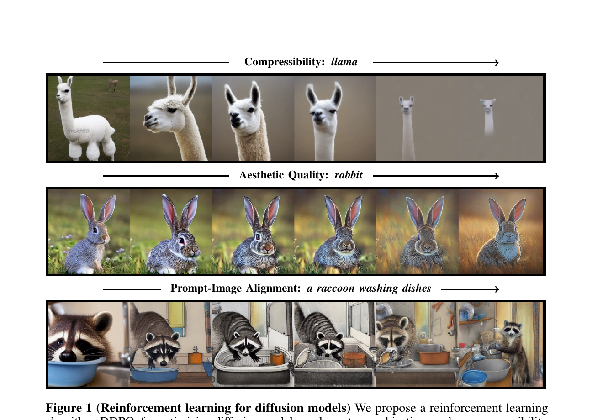
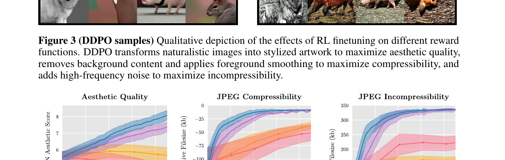
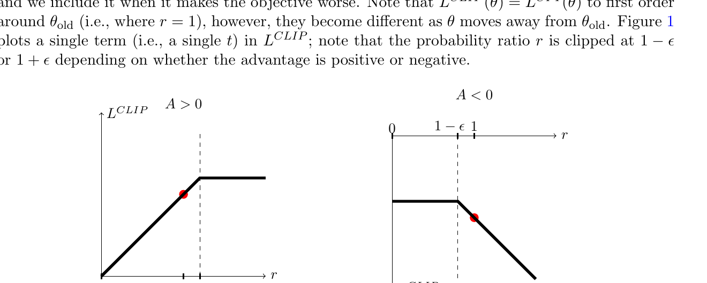
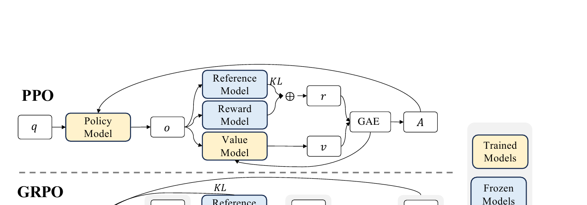
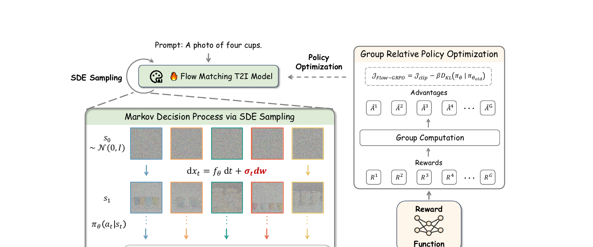
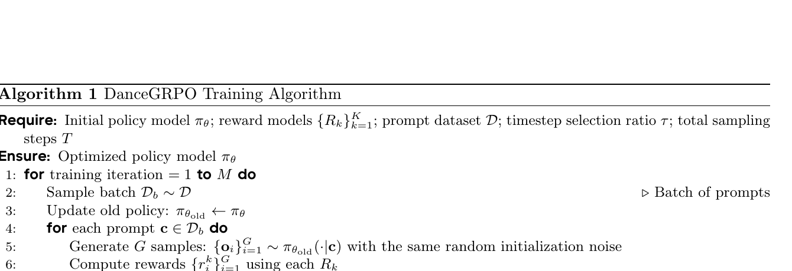
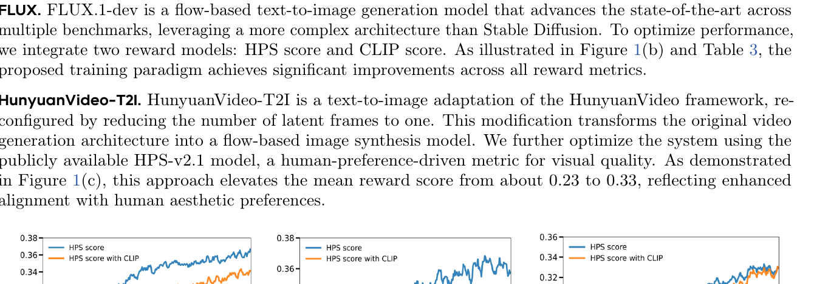

# 扩散模型强化学习:
从 DDPO 到 AWM 的方法演进与代码实现

## 1. RL 进入扩散模型的舞台

### 1.1 直觉

扩散模型的标准训练是 **SFT (supervised fine-tuning, 监督微调)**: 给定 (image, caption) 数据, 让模型去最大化条件似然 *log p(image | caption)*。这条路在"复刻数据分布"上很顺, 但用户真正想要的东西常常 *不* 在数据分布里 —— 例如"我希望生成的图美学分高一点"、"我希望 JPEG 压起来更小一点"、"我希望 VLM (vision-language model) 判定图文对齐"。

这些目标的共同特征是: 它们是一个 **reward 函数** (奖励函数, 输入一张图、输出一个标量) , 但它通常是 *黑盒* —— 比如 JPEG 压缩率走的是一段 C 代码, 美学分背后挂的是一个独立的预训练打分网络, 人类偏好甚至要走标注 pipeline。它们都 *没法* 塞进 cross-entropy loss, 也 *不一定可微*。

类比一下: SFT 是教厨师"照菜谱原样复刻菜", 而 RL (reinforcement learning, 强化学习) 是教厨师"上桌之后, 根据食客的好评差评不断改自己的做法"。前者要求老师把所有动作写下来, 后者只要求餐桌上有人愿意打个分。

<figure>
    
    <figcaption>DDPO 论文 Figure 1: 同一 prompt 在三种不同 reward 下训练后的样本演化轨迹 —— 美学分让模型变艺术风, 压缩率让模型扁平化背景, prompt 对齐让 raccoon-washing-dishes 真的出现。这张图直观说明: reward 是一个"目标方向"的钥匙, 用 RL 就能把扩散模型沿着任意黑盒标量 reward 推过去。</figcaption>
  </figure>

### 1.2 最小 demo

下面用一个 1D 高斯分布的玩具例子, 看一眼 "reward × log-prob 梯度" 长啥样。我们想优化的目标是 *E[r(x)]*, 其中 *x ~ N(μ, 1)*, *r(x) = -x² + x* (最大值在 x = 0.5)。

```python
import numpy as np

rng = np.random.default_rng(0)
mu = 0.0           # 初始策略均值
lr = 0.05
for step in range(200):
    # 1. 采样 (sample)
    x = mu + rng.standard_normal(64)
    # 2. 算 reward (black-box, 不需要可微通道)
    r = -x**2 + x
    # 3. REINFORCE: ∇μ log p(x|μ) = (x - μ)   (高斯对均值的得分函数)
    grad_logp = (x - mu)
    # 4. 用 reward 加权平均得到 ∇μ E[r]
    grad = (r * grad_logp).mean()
    # 5. 更新
    mu = mu + lr * grad

print(mu)   # ~ 0.5, 收敛到 reward 最大点
```

这段代码刻意 *不* 调用任何 autograd —— reward `r` 完全是黑盒, 我们只用"*策略* 的 log-prob 对参数的梯度" × "reward 的标量" 就组合出了 unbiased 的策略梯度。整个 RL-for-diffusion 系列方法的精神, 浓缩在这 10 行里。

### 1.3 正式化

把上面这件事写成符号。设扩散模型从 prompt *c* 采样得到 *x₀*, 联合策略记为 *p<sub>θ</sub>(x₀ | c)*, reward 是任意黑盒函数 *r(x₀, c)*。RL fine-tuning 目标 (denoising-diffusion RL, 简称 DDRL) 写作:

<p class="math-translation">—— 翻译: 我们要最大化"模型生成的图被 reward 函数打的分"的期望, 期望对模型自身的采样分布取。</p>

注意, 这里有两个看似要可微的地方, 都不可微: (1) *x₀* 是经过几十甚至上千步去噪采样得到的, 中间含大量随机性; (2) *r* 是黑盒, 没有 gradient 通道。即使我们能 reparametrize 让 *x₀* 对 *θ* 可微, *r* 这一关仍然过不去:

<p class="math-translation">—— 翻译: 当 reward 不可微时, 直接对 reward 求 θ 的梯度是不合法的; reparameterization trick 用不了。</p>

RL 给出的钥匙是 **score function gradient** (又称 REINFORCE 或 likelihood-ratio estimator) , 把"对随机变量求梯度"绕开:

<p class="math-translation">—— 翻译: 把"梯度对样本"换成"梯度对 log-prob", reward 退化成一个标量权重; 这样只要能算 log-prob 的梯度, reward 黑不黑盒都无所谓。</p>

这正是 §1.2 demo 在 1D 高斯上做的事 —— 整个 DDPO 系列方法, 都是在解决"如何在扩散这种长 trajectory 模型上, 真的算出 *∇<sub>θ</sub> log p<sub>θ</sub>(x₀ | c)*" 这件事 (剧透: §2 会把它展开成 MDP)。

### 1.4 代码引用

"reward 就是个 image → scalar 的 Python 函数" 这句话在工程上有多直接? 看 DDPO 官方实现 (kvablack/ddpo-pytorch) 里的 `rewards.py` —— 整整 46 行就把三种不同形态的 reward 全装下了。

<p class="code-source">sources/repos/kvablack-ddpo-pytorch/ddpo_pytorch/rewards.py:L1-L46 — RL-for-diffusion 把 reward 当 black-box: 三个示例 reward fn (压缩率、美学分、CLIP/VLM 分), 全是 image → scalar 的 Python 函数, 不需要可微</p>

```python
from PIL import Image
import io
import numpy as np
import torch


def jpeg_incompressibility():
    def _fn(images, prompts, metadata):
        if isinstance(images, torch.Tensor):
            images = (images * 255).round().clamp(0, 255).to(torch.uint8).cpu().numpy()
            images = images.transpose(0, 2, 3, 1)  # NCHW -> NHWC
        images = [Image.fromarray(image) for image in images]
        buffers = [io.BytesIO() for _ in images]
        for image, buffer in zip(images, buffers):
            image.save(buffer, format="JPEG", quality=95)
        sizes = [buffer.tell() / 1000 for buffer in buffers]
        return np.array(sizes), {}

    return _fn


def jpeg_compressibility():
    jpeg_fn = jpeg_incompressibility()

    def _fn(images, prompts, metadata):
        rew, meta = jpeg_fn(images, prompts, metadata)
        return -rew, meta

    return _fn


def aesthetic_score():
    from ddpo_pytorch.aesthetic_scorer import AestheticScorer

    scorer = AestheticScorer(dtype=torch.float32).cuda()

    def _fn(images, prompts, metadata):
        if isinstance(images, torch.Tensor):
            images = (images * 255).round().clamp(0, 255).to(torch.uint8)
        else:
            images = images.transpose(0, 3, 1, 2)  # NHWC -> NCHW
            images = torch.tensor(images, dtype=torch.uint8)
        scores = scorer(images)
        return scores, {}

    return _fn
```

对照看一下: `jpeg_incompressibility` 把图存进内存 buffer, 量 byte 数 —— 这里走的是 PIL 的 C 实现, *根本没有* gradient 通道。`aesthetic_score` 调一个外部 scorer 网络, 即使 scorer 自身可微, 这里的实现是 `torch.uint8 → scorer → scalar`, 量化把梯度切断了。三个函数的签名都是 `(images, prompts, metadata) → (scalar_array, {})`。这就是 RL 在扩散上的真正价值: 任何能算出 scalar 的指标 —— 文件大小、美学分、CLIP 余弦相似度、VLM 是非问答的 logits, 甚至人类点赞数 —— 都能当 reward, 全靠 §1.3 的 score function gradient 把它接到模型参数上。

### 1.5 洞察

- **Score function gradient 是 RL 给扩散最大的礼物** —— 它把"梯度走样本"换成"梯度走 log-prob", reward 可不可微就被解耦了; 这是后面 DDPO / GRPO 全家的共同根基。
- **Likelihood-based SFT 在 reward 优化上"会做错事"** —— 最大化 log-likelihood 只是 reward 的一个模糊上界 (数据分布等于"人类隐式偏好"这个假设过强), 真要把 reward 当目标, 就得直接对 reward 求梯度。
- **RWR (reward-weighted regression) 是 DDPO 出现前的主流 baseline**: 用 *r(x₀)* 当 sample 权重做加权 MLE, 但它只看 *x₀* 整张图, 完全不利用去噪过程的中间状态 —— 这正是 §2 DDPO 要补上的洞。

## 2. DDPO: 把去噪过程展成 MDP

### 2.1 直觉

RWR/ReFL 把一次完整的"prompt → 图"看成一个动作: 采完图、打个分、把高分图当训练目标。这相当于把一道有 1000 步推理的题目压成一道选择题——所有中间步骤的功劳与过错都被压扁到最后一张图上。DDPO 的核心改动只有一句:**把 1000 步去噪看成 1000 个 RL 决策点, 每个决策点的策略是一个已知的高斯分布**。

这件事之所以能做, 是因为 DDIM/DDPM 的反向一步天然是 <span class="math">\(p_\theta(x_{t-1}\mid x_t, c) = \mathcal{N}(\mu_\theta, \sigma_t^2 I)\)</span>——这是一个可解析的高斯, log-prob 是封闭形式。于是整条采样轨迹的对数似然就是 1000 个高斯 log-prob 的和, 直接可以拿去做 policy gradient。RWR 只能让 reward 影响"最终图像", DDPO 让 reward 影响"每一步选了哪个去噪方向"——前者是终点 supervision, 后者是过程 supervision, 信号密度差了一个数量级。

换句话说, RWR 和 DDPO 看的是同一条 trajectory, 但前者把它压成一个"输入-输出对"做监督学习, 后者承认它是一个序列决策问题。RL 文献里有一个经典结论: 当 reward 只在终点给的时候, 把过程显式建成 MDP 仍然比"端到端 supervision"收敛得快——因为策略梯度的 baseline 减法、importance sampling、多 epoch 复用 rollout 这些技巧都依赖"每一步都有一个可优化的 <span class="math">\(\log\pi\)</span>"。DDPO 正是把扩散模型推到了这条赛道上, 之后我们看到的所有变体本质上都是在它搭好的 MDP 上替换某个组件 (advantage、采样分布、clip 形式)。

<figure>
    
    <figcaption>DDPO 论文 Figure 4: 在三个 reward (美学评分 / JPEG 压缩率 / 不可压缩性) 上, policy gradient 风格的 DDPO 显著优于 reward-weighted regression (RWR)。这就是"利用过程"vs"只看终点"的效果差。</figcaption>
  </figure>

### 2.2 最小 demo

我们把扩散步数压成 2 步, 用一行 numpy 风格的 PyTorch 跑一遍, 看 reward × log-prob 怎么对 <span class="math">\(\mu_\theta\)</span> 求梯度:

```python
import torch
torch.manual_seed(0)

# 一个极简的"去噪网络": 一个可训练向量, 输出 mu(x,t) = W @ x
W = torch.nn.Parameter(torch.eye(2))   # mu_theta 的全部参数
sigma = 0.3                            # 反向噪声标准差, DDIM 已知量

# Step T=2 起点
x2 = torch.randn(2)

# 一步去噪 x2 -> x1: 采样 + 记录 log-prob
mu1 = W @ x2
eps1 = torch.randn(2)
x1  = mu1 + sigma * eps1
logp1 = -((x1 - mu1) ** 2).sum() / (2 * sigma**2) - 2 * torch.log(torch.tensor(sigma))

# 一步去噪 x1 -> x0: 同样的形式
mu0 = W @ x1
eps0 = torch.randn(2)
x0  = mu0 + sigma * eps0
logp0 = -((x0 - mu0) ** 2).sum() / (2 * sigma**2) - 2 * torch.log(torch.tensor(sigma))

# 整条轨迹的 log-prob = 两步之和
log_prob_traj = logp1 + logp0

# 假设奖励是"x0 越接近 (1,1) 越好"
reward = -((x0 - torch.tensor([1.0, 1.0])) ** 2).sum().detach()

# REINFORCE: 损失 = -reward * log_prob_traj
loss = -reward * log_prob_traj
loss.backward()
print("grad on W =\n", W.grad)      # W 收到的梯度就是 DDPO_SF 的梯度
```

关键点有两个: 一是 `log_prob_traj` 必须在 **sample 的同时**记下来 (因为 `eps` 不能事后恢复); 二是 reward 只在 `x0` 处给一个标量, 但通过乘以"两步 log-prob 之和", 信号顺着 chain rule 流回了 `W`——也就是模型在 `x2→x1` 和 `x1→x0` 两步都收到了 reward 的"教导"。这就是为什么 DDPO 必须改 sampler 而 RWR 不必: RWR 只在 forward 一次模型, 而 DDPO 要让每一步反向条件分布的 <span class="math">\(\mu_\theta\)</span> 都参与梯度。把这 2 步换成真实的 1000 步、把 `W` 换成 UNet、把 reward 换成 CLIP 分数——你就拿到了 DDPO 的全部架构。

### 2.3 正式化 (MDP 五元组 + 策略梯度)

把扩散反向过程包装成 MDP, 状态-动作-策略-奖励对应如下:

$$s_t = (c, t, x_t),\quad a_t = x_{t-1},\quad \pi(a_t \mid s_t) = p_\theta(x_{t-1} \mid x_t, c)$$

<p class="math-translation">—— 翻译: 状态包含 prompt <span class="math">\(c\)</span>、当前时间步 <span class="math">\(t\)</span>、当前噪声图 <span class="math">\(x_t\)</span>; 动作是"下一个时间步的图 <span class="math">\(x_{t-1}\)</span>"; 策略就是扩散模型的反向条件分布。</p>

$$R(s_t, a_t) = \begin{cases} r(x_0, c) & t = 0 \\ 0 & \text{otherwise} \end{cases}$$

<p class="math-translation">—— 翻译: 奖励是稀疏的, 只在去噪到底 (<span class="math">\(t=0\)</span>) 时给一个标量 <span class="math">\(r(x_0, c)\)</span> (美学分、CLIP 相似度等); 中间所有 step 的即时奖励都是 0。</p>

策略本身是已知形式的高斯:

$$p_\theta(x_{t-1}\mid x_t, c) = \mathcal{N}\!\big(\mu_\theta(x_t, c, t),\ \sigma_t^2 I\big)$$

<p class="math-translation">—— 翻译: 反向一步是个均值由网络预测、方差由 schedule 决定的高斯, 这正是 DDIM 推导的结论, 不是 DDPO 新增的假设。</p>

因此每一步的 log-prob 有解析式:

$$\log p_\theta(x_{t-1}\mid x_t, c) = -\frac{\|x_{t-1} - \mu_\theta\|^2}{2\sigma_t^2} - \log\sigma_t + \text{const}$$

<p class="math-translation">—— 翻译: 高斯的对数密度就是"平方误差除以 2σ²"加上一个常数项, σ 已知, 所以 log-prob 只依赖于 <span class="math">\(\mu_\theta\)</span>——这是后面所有梯度都能流回去的关键。</p>

DDPO 给了两个梯度估计器。第一个是 score function / REINFORCE 形式, 论文里写作 DDPO_SF:

$$\nabla_\theta J = \mathbb{E}\Big[\sum_{t=0}^{T} \nabla_\theta \log p_\theta(x_{t-1}\mid x_t, c)\cdot r(x_0, c)\Big]$$

<p class="math-translation">—— 翻译: 用一整条轨迹算 log-prob 之和, 整条轨迹共享同一个 reward (因为只有 <span class="math">\(t=0\)</span> 给分), 然后做 reward × ∇log-prob, 这就是经典的策略梯度形式。</p>

实际工程中 REINFORCE 方差太大、不能复用 rollout。DDPO 借 PPO 的思路给出第二个版本 DDPO_IS (importance sampling):

$$\nabla_\theta J = \mathbb{E}_{\theta_{\text{old}}}\Big[\sum_t \frac{p_\theta(x_{t-1}\mid x_t,c)}{p_{\theta_{\text{old}}}(x_{t-1}\mid x_t,c)}\nabla_\theta \log p_\theta \cdot r(x_0, c)\Big]$$

<p class="math-translation">—— 翻译: 把 rollout 用旧策略 <span class="math">\(\theta_{\text{old}}\)</span> 跑出来, 在新策略下重算 log-prob, 用 ratio (新 / 旧) 做修正——同一批 rollout 因此可以反复更新若干个 epoch, 这是 §3 PPO clip 的入口。</p>

### 2.4 代码引用 (双段)

第一段, 看 DDIM 一步采样如何在采样的同时把 Gaussian log-prob 一起算出来——所有后续工作 (Flow-GRPO、Dance-GRPO、AWM) 都要 patch 一份类似的 sampler:

<p class="code-source">sources/repos/kvablack-ddpo-pytorch/ddpo_pytorch/diffusers_patch/ddim_with_logprob.py:L155-L192 — DDIM 一步采样同时算出 Gaussian log-prob, DDPO 整个框架的基石</p>

```python
            sample - alpha_prod_t ** (0.5) * pred_original_sample
        ) / beta_prod_t ** (0.5)

    # 6. compute "direction pointing to x_t" of formula (12) from https://arxiv.org/pdf/2010.02502.pdf
    pred_sample_direction = (1 - alpha_prod_t_prev - std_dev_t**2) ** (
        0.5
    ) * pred_epsilon

    # 7. compute x_t without "random noise" of formula (12) from https://arxiv.org/pdf/2010.02502.pdf
    prev_sample_mean = (
        alpha_prod_t_prev ** (0.5) * pred_original_sample + pred_sample_direction
    )

    if prev_sample is not None and generator is not None:
        raise ValueError(
            "Cannot pass both generator and prev_sample. Please make sure that either `generator` or"
            " `prev_sample` stays `None`."
        )

    if prev_sample is None:
        variance_noise = randn_tensor(
            model_output.shape,
            generator=generator,
            device=model_output.device,
            dtype=model_output.dtype,
        )
        prev_sample = prev_sample_mean + std_dev_t * variance_noise

    # log prob of prev_sample given prev_sample_mean and std_dev_t
    log_prob = (
        -((prev_sample.detach() - prev_sample_mean) ** 2) / (2 * (std_dev_t**2))
        - torch.log(std_dev_t)
        - torch.log(torch.sqrt(2 * torch.as_tensor(math.pi)))
    )
    # mean along all but batch dimension
    log_prob = log_prob.mean(dim=tuple(range(1, log_prob.ndim)))

    return prev_sample.type(sample.dtype), log_prob
```

对照 §2.3 的公式: `prev_sample_mean` 就是 <span class="math">\(\mu_\theta(x_t, c, t)\)</span>, `std_dev_t` 就是 <span class="math">\(\sigma_t\)</span>, `prev_sample` 就是采样得到的 <span class="math">\(x_{t-1}\)</span>。最后那一段 `log_prob = -((prev_sample - prev_sample_mean)**2) / (2*std_dev_t**2) - log(std_dev_t) - log(sqrt(2π))` 完全是高斯对数密度的解析式——和 2.3 那条 log-prob 等式逐项一一对应。`prev_sample.detach()` 是为了让"采样这个动作"不被纳入梯度图 (动作是 environment, 不应被反传), 只把 `prev_sample_mean` 留下来当梯度入口。

第二段, 进到训练 inner loop, 看 ratio × advantage 怎么变成可优化的 loss:

<p class="code-source">sources/repos/kvablack-ddpo-pytorch/scripts/train.py:L528-L568 — DDPO inner training step: 重算 log_prob → ratio → PPO clip → reward × log_prob</p>

```python
                            # compute the log prob of next_latents given latents under the current model
                            _, log_prob = ddim_step_with_logprob(
                                pipeline.scheduler,
                                noise_pred,
                                sample["timesteps"][:, j],
                                sample["latents"][:, j],
                                eta=config.sample.eta,
                                prev_sample=sample["next_latents"][:, j],
                            )

                        # ppo logic
                        advantages = torch.clamp(
                            sample["advantages"],
                            -config.train.adv_clip_max,
                            config.train.adv_clip_max,
                        )
                        ratio = torch.exp(log_prob - sample["log_probs"][:, j])
                        unclipped_loss = -advantages * ratio
                        clipped_loss = -advantages * torch.clamp(
                            ratio,
                            1.0 - config.train.clip_range,
                            1.0 + config.train.clip_range,
                        )
                        loss = torch.mean(torch.maximum(unclipped_loss, clipped_loss))

                        # debugging values
                        # John Schulman says that (ratio - 1) - log(ratio) is a better
                        # estimator, but most existing code uses this so...
                        # http://joschu.net/blog/kl-approx.html
                        info["approx_kl"].append(
                            0.5
                            * torch.mean((log_prob - sample["log_probs"][:, j]) ** 2)
                        )
                        info["clipfrac"].append(
                            torch.mean(
                                (
                                    torch.abs(ratio - 1.0) > config.train.clip_range
                                ).float()
                            )
                        )
                        info["loss"].append(loss)
```

对照 DDPO_IS: `sample["log_probs"][:, j]` 是 rollout 时旧策略下记下来的 log-prob; `log_prob` 是新策略下对 **同一对** `(latents, next_latents)` 重算的 log-prob; `ratio = exp(new - old)` 就是 <span class="math">\(p_\theta / p_{\theta_{\text{old}}}\)</span>。`advantages` 这里是 reward 经过 group-mean 标准化的结果 (DDPO 论文里就是 <span class="math">\(r - \bar r\)</span>, GRPO 在 §4 替换成 group-relative)。`maximum(unclipped, clipped)` 这一行就是 PPO 的"pessimistic min"实现——§3 会展开为什么取 max 等价于 PPO 论文里的 min。整段代码不到 30 行, 但它就是后续两年所有 RL-for-diffusion 工作的"训练骨架"。

### 2.5 洞察

- **必须 in-place track log_prob**——一旦 sample 完丢了 log_prob, 之后做 ratio 就再也算不出来 (噪声 `eps` 被 randn 吞掉了)。这是所有后续工作 (Flow-GRPO 的 `sde_step_with_logprob`、Dance-GRPO 对多 backbone 的统一 patch、AWM 的 awareness 项) 都要在 sampler 上动刀的根源。下游每一次换 backbone, 第一件事就是写一份"带 log-prob 的采样器"。
- **reward 只在 t=0 给, 中间所有 step 共享同一个 reward**——这是 sparse reward 的最简化形式, 也是 DDPO 设计上最大的一个妥协: 它假设 reward 是"图像层的", 中间 latent 没有意义。§6 Dance-GRPO 会重新讨论"是不是应该给中间步加 trajectory-level 信号", 以及怎么把 sparse reward 在 timestep 维度上重新分配。
- **DDPO_IS 跟 PPO 几乎一样**——把"动作空间从 token 换成图、reward 从 RM 换成审美分", 就完成了从 LLM-RLHF 到 image-RLHF 的迁移。§3 会把 PPO 的 ratio + clip + KL 三件套在扩散场景下完整展开一次, 之后所有变体 (GRPO / Flow-GRPO / Dance-GRPO / AWM) 都是在这三件套上做加减法。

## 3. PPO 风格的 ratio + clip + KL: DDPO 的两个补丁

### 3.1 直觉

§2 的 DDPO<sub>IS</sub> 用 importance sampling 重用了一批旧 rollout, 公式里那个 $r_t(\theta) = \pi_\theta / \pi_{\theta_{\text{old}}}$ 是关键。但 IS 有个隐患: 一旦新 policy 跟旧 policy 漂得太远, ratio 估计就极不稳定 — 想象你看着上个月的旧地图走路, 走一两步还行, 走出几公里就完全不对了。**PPO 的 clip** 就是给这件事兜底: 强制每次更新只在 ratio ≈ 1 的小邻域内迈步, 走得远的部分直接砍掉梯度。

第二个隐患更隐蔽: 即使每一步更新都温柔, 上万步累积下来 policy 也会慢慢偏离最初的预训练分布, 跑去专攻 reward model 的盲点 — 这就是 reward hacking, 表现为图像越来越"花"、越来越脱离自然图像流形。**DPOK 的 KL-to-ref 项** 就是这个长期约束: 给当前 policy 拴一根橡皮筋到预训练模型 $\pi_{\text{ref}}$ 上, 走得越远拉力越大。

这两个补丁一短期一长期, 各管一病, 后来成了所有 RL-for-diffusion 工作的标配。

<figure>
    
    <figcaption>PPO 论文 Figure 1: 当 advantage &gt; 0 (左) 或 advantage &lt; 0 (右), clipped surrogate $L^{\text{CLIP}}$ 把 ratio 在 $[1-\epsilon, 1+\epsilon]$ 之外的部分"扁平化", 限制每步更新幅度。</figcaption>
  </figure>

### 3.2 最小 demo

用 10 行 PyTorch 把 PPO clip 的"pessimistic min"行为可视化一下 — 重点是看到 `torch.maximum(unclipped, clipped)` 这个看起来反直觉的 max, 在 loss 形式下其实就是 reward 形式下的 min:

```python
import torch

# 一组 ratio 在 0.5 ~ 1.5 之间扫描, advantage 取 +1 和 -1 各试一次
ratio = torch.linspace(0.5, 1.5, 21)
clip_range = 0.2

for A in (+1.0, -1.0):
    unclipped = -A * ratio                                   # raw IS loss
    clipped   = -A * torch.clamp(ratio, 1 - clip_range, 1 + clip_range)
    loss      = torch.maximum(unclipped, clipped)            # PPO 的核心
    print(f"A={A:+.0f}  ratio=1.4 → unclip={-A*1.4:+.2f}  "
          f"clip={-A*1.2:+.2f}  loss={loss[16].item():+.2f}")
# 输出:
#   A=+1  ratio=1.4 → unclip=-1.40  clip=-1.20  loss=-1.20  (上限被封死)
#   A=-1  ratio=1.4 → unclip=+1.40  clip=+1.20  loss=+1.40  (惩罚加倍, 不封)
```

看 `A=+1` 那一行: ratio=1.4 已经超出 $1+\epsilon=1.2$, 直觉上"这个动作好, 应该拼命放大它的概率" — 但 clip 把 loss 卡在 $-1.2$, 阻止 policy 一次性把 ratio 推得更高。反过来 `A=-1` 那行: ratio=1.4 时 unclipped loss=$+1.4$ 比 clipped loss=$+1.2$ 还大, 所以 max 选 unclipped — clip *不限制* 对坏样本的惩罚。这就是"悲观 min"的非对称: 限制乐观, 不限制悲观。

### 3.3 正式化

PPO 论文 (Schulman et al., 2017) Eq.7 给出 clipped surrogate:

<p class="math-translation">—— 翻译: 对每个时间步, 算两个候选目标值 — 原始的 $r_t A_t$ 和把 $r_t$ 截断到 $[1-\epsilon, 1+\epsilon]$ 后的版本 — 取较小那个。$r_t(\theta) = \pi_\theta(a_t|s_t)/\pi_{\theta_{\text{old}}}(a_t|s_t)$ 就是 §2 已定义的那个 Gaussian likelihood ratio, 扩散里 $a_t=x_{t-1}$, $s_t=(c,t,x_t)$。</p>

为什么这个 min 是"悲观"的? 分两种情形:

- **$A_t \gt 0$ (好动作)**: 想增大 $r_t$ 把它的概率推高。但若 $r_t \gt 1+\epsilon$, clipped 项 = $(1+\epsilon)A_t$ 比 $r_t A_t$ 小, min 选 clipped — 此时 $r_t$ 关于 $\theta$ 的梯度被砍掉, policy 不再为这个已经"走太远"的好动作继续加码。
- **$A_t \lt 0$ (坏动作)**: 想减小 $r_t$ 压制它。若 $r_t \lt 1-\epsilon$, clipped 项 = $(1-\epsilon)A_t$ 比 $r_t A_t$ *大* (注意 $A_t \lt 0$), min 选原始的 $r_t A_t$ — clip 在坏样本"已经被压下去很多"时不再额外加力, 但也不阻止你继续压。

核心 trick: 在 loss 形式 ($-\mathcal{L}^{\text{CLIP}}$) 下, $\min(-x, -y) = -\max(x, y)$, 所以代码里写的是 `torch.maximum(unclipped_loss, clipped_loss)` — 跟 demo 第 9 行一一对应。

DPOK (Fan et al., 2023) 在此基础上加了一项 KL 到参考 policy:

<p class="math-translation">—— 翻译: 在 PPO 的 clipped 损失之外, 再罚一项当前 policy 与冻结的预训练 policy $\pi_{\text{ref}}$ 之间的 KL 散度; $\beta$ 是这条橡皮筋的劲度系数, 通常 $10^{-4} \sim 10^{-2}$。$\beta$ 越大约束越紧, 越不容易 reward hacking, 但也越难提升 reward。</p>

扩散里 $\pi_\theta(x_{t-1}|x_t,c) = \mathcal{N}(\mu_\theta(x_t,t), \sigma_t^2 I)$ 和 $\pi_{\text{ref}}$ 都是同协方差的各向同性高斯 — 两个同方差高斯的 KL 有闭式:

<p class="math-translation">—— 翻译: 高斯方差既定, KL 只剩"均值差的 L2"除以"$2\sigma_t^2$"。也就是说, KL 退化成两个 denoiser 在同一 $(x_t, t)$ 上的预测均值的加权欧氏距离 — 实现上跟普通 MSE loss 没区别, 只是用 $\sigma_t^2$ 加了个 noise-schedule 权重。</p>

### 3.4 代码引用

Flow-GRPO 的训练 loop 把上面三件事 (ratio, clip, KL) 合在一个 loss 里, 写得极其紧凑:

<p class="code-source">sources/repos/yifan123-flow_grpo/scripts/train_sd3.py:L885-L904 — PPO clipped surrogate + velocity-space KL: Flow-GRPO 把 DDPO+DPOK 的两件事合到一个 loss 里</p>

```python
# grpo logic
advantages = torch.clamp(
    sample["advantages"][:, j],
    -config.train.adv_clip_max,
    config.train.adv_clip_max,
)
ratio = torch.exp(log_prob - sample["log_probs"][:, j])
unclipped_loss = -advantages * ratio
clipped_loss = -advantages * torch.clamp(
    ratio,
    1.0 - config.train.clip_range,
    1.0 + config.train.clip_range,
)
policy_loss = torch.mean(torch.maximum(unclipped_loss, clipped_loss))
if config.train.beta > 0:
    kl_loss = ((prev_sample_mean - prev_sample_mean_ref) ** 2).mean(dim=(1,2,3), keepdim=True) / (2 * std_dev_t ** 2)
    kl_loss = torch.mean(kl_loss)
    loss = policy_loss + config.train.beta * kl_loss
else:
    loss = policy_loss
```

逐行对照公式:

- `ratio = torch.exp(log_prob - sample["log_probs"][:, j])` — 公式里的 $r_t(\theta)$。注意是在 *log 空间* 作差再 exp, 而不是 $p_\theta/p_{\theta_{\text{old}}}$ 直接除 — 高维高斯 likelihood 是极小数, 数值上必须走 log。`log_prob` 是 §2 的 logprob-tracked sampler 当下重算的, `sample["log_probs"]` 是 rollout 时存的 $\log \pi_{\theta_{\text{old}}}$。
- `unclipped_loss = -advantages * ratio` — 公式里的 $r_t A_t$, 加负号是因为代码做的是 loss minimization。
- `clipped_loss = -advantages * torch.clamp(ratio, 1-cr, 1+cr)` — 公式里的 $\text{clip}(r_t, 1-\epsilon, 1+\epsilon) A_t$, $\epsilon$ 在 config 里叫 `clip_range`。
- `torch.maximum(unclipped_loss, clipped_loss)` — 这就是 demo 里强调的那个反直觉的 max: 因为 loss 已经加了负号, $\min(r A, \text{clip}\cdot A)$ 在 loss 形式下变成 $\max(-rA, -\text{clip}\cdot A)$。
- `((prev_sample_mean - prev_sample_mean_ref) ** 2) / (2 * std_dev_t ** 2)` — 公式里的高斯 KL closed form, 分子是 $\|\mu_\theta - \mu_{\text{ref}}\|^2$, 分母是 $2\sigma_t^2$。这里没显式调 `F.kl_div` 也没采样估计, 因为高斯同方差时 KL 就是个加权 MSE — 极快。
- `loss = policy_loss + config.train.beta * kl_loss` — `config.train.beta` 跟公式里的 $\beta$ 一一对应; 当 `beta == 0` 时整个 KL 分支被 short-circuit, 这就是 DanceGRPO 的默认配置 (见 §6)。

另外注意 advantage 自己也被 `adv_clip_max` 截断了一次 — 这是个独立旋钮, 防止极端 reward outlier 让 gradient 爆。它跟 ratio clip 不是一回事。

### 3.5 洞察

- **clip_range 的量纲完全不同**: PPO 在 Atari/MuJoCo 上标准是 $0.1 \sim 0.2$, DDPO/Flow-GRPO 默认 $10^{-4} \sim 10^{-2}$, 整整两个数量级差。原因是扩散一条轨迹有 几十步 Gaussian transition, 每步 $\sigma_t$ 不小, ratio = $\exp(\sum_t \Delta \log p_t)$ 是几十个高斯 log-prob 之差的累乘, 抖动天然就大 — 若 $\epsilon$ 设到 0.2, 几乎每个样本都落在 clip 区间外, 等价于"全部样本都被砍梯度", 训练直接停滞。
- **clip 和 KL 是两个独立旋钮, 防的是不同病**: `clip_range` 防单次 update 的 ratio 爆炸 (短期), $\beta$ 防 policy 长期偏离预训练流形 (reward hacking, 长期)。两者没有替代关系 — Flow-GRPO 默认两个都开, 经验上 $\epsilon \approx 10^{-4}$ + $\beta \approx 10^{-3}$ 是个比较稳的组合。
- **DanceGRPO 默认关 KL 也能 work**: 同时期工作 DanceGRPO 默认 $\beta=0$ — 只靠 clip 就能稳。§6 会展开讨论这件事; 简短答案是他们用了"group 内 shared init noise"这个技巧, advantage 信号更干净, 不需要 KL 也不会漂太远。这是 Flow-GRPO 跟 DanceGRPO 的一个核心实现差异。

## 4. GRPO: 没有 critic 的 advantage 估计

### 4.1 直觉

§3 的 PPO clipped surrogate 里有个看似不起眼的符号 $A_t$ — advantage。课本 PPO 是这么算它的: 另训一个 value network $V_\phi(s_t)$ 当 baseline, 用 $A_t = R_t - V_\phi(s_t)$。这个 $V_\phi$ 跟 policy backbone 一样大, 在 LLM 场景就已经"显存翻倍", 到了视频扩散 — DiT backbone 动辄 5B/13B — 直接崩。

DeepSeekMath 2024 给了一个朴素到几乎反直觉的修法: 干脆不训 critic, 就用 "**同一道题让 24 个学生做, 谁高于本场平均分谁就奖励, 低就惩罚**"。本场的 mean 自然就是这道题的 baseline, 本场的 std 自然就是这道题的难度归一化器 — 这就是 *group-relative*。原本要训一个 value 模型的工作, 现在被一个统计量替代了。Flow-GRPO / Dance-GRPO / AWM 后面几节看到的 advantage, 全是这套。

<figure>
    
    <figcaption>DeepSeekMath 论文 Figure 4: PPO (上) 需要单独训一个 Value Model 当 baseline; GRPO (下) 直接用同 prompt 下采样出的一组 reward 的 mean/std 当 baseline, 省掉 critic 网络。在视频扩散里这是关键, 因为 critic 跟 backbone 一样大就崩了。</figcaption>
  </figure>

### 4.2 最小 demo

把 group-relative advantage 的核心计算写成 8 行 numpy — 看看为什么不需要任何模型就能算 baseline:

```python
import numpy as np

# 同一 prompt 下采样出 5 个 rollout 的 reward
rewards = np.array([0.8, 0.3, 0.9, 0.5, 0.7])

mean, std = rewards.mean(), rewards.std()
advantages = (rewards - mean) / (std + 1e-4)

print(f"mean={mean:.2f}  std={std:.2f}")
print("advantages:", np.round(advantages, 2))
print("mean(adv) =", round(advantages.mean(), 4), "  (理论上 ≈ 0)")
# 输出:
#   mean=0.64  std=0.22
#   advantages: [ 0.74 -1.55  1.20 -0.65  0.29]
#   mean(adv) = 0.0  (unbiased baseline)
```

5 个 rollout 里 reward = 0.9 / 0.8 / 0.7 三个高于本场平均, advantage 为正 — policy 应该往这三条轨迹拉; 0.3 / 0.5 低于平均, advantage 为负 — 应该压制。最后一行验证了 `mean(advantages) ≈ 0`, 这就是 unbiased 的工程体现: baseline 不会系统性偏向加分或扣分。

### 4.3 正式化

课本 PPO 用 critic 估 advantage:

<p class="math-translation">—— 翻译: 在 state $s_t$ 处的 advantage = 实际回报 $R_t$ 减去 critic 预测的"在这个 state 平均能拿多少 reward"。$V_\phi$ 是另一个跟 policy 一样大的神经网络, 需要额外训练。</p>

GRPO (DeepSeekMath 2024, Eq.4) 把 critic 替换成一组同 prompt rollout 的样本统计量:

<p class="math-translation">—— 翻译: 对同一个 prompt $c$ 采 $G$ 个 trajectory (扩散里常用 $G = 24$), 拿到一组 reward $\{r_1, ..., r_G\}$; 第 $i$ 条轨迹的 advantage = "它的 reward 减去本组均值" 再除以本组标准差。整条 trajectory 共享这一个 scalar 值, 喂给 §3 的 PPO clip surrogate。</p>

**为什么 unbiased?** 任何只依赖 *其他* rollout 的 baseline $b(\{r_{j \ne i}\})$ 都不改变 policy gradient 的期望 (Greensmith et al., 2004) — 因为 $\mathbb{E}[\nabla_\theta \log \pi_\theta \cdot b] = b \cdot \mathbb{E}[\nabla_\theta \log \pi_\theta] = 0$。GRPO 用的 mean 严格说还混入了 $r_i$ 自己 (用本组全员算均值, 不留一法), 但当 $G$ 较大时这点 self-leakage 可以忽略, 期望意义下与 critic baseline 等价 — 只是实现上完全去掉了 $V_\phi$ 的训练。

分母那个 std 是个小细节但很关键: 它把不同 prompt 的 reward 量纲拉到同一尺度上, 等价于 PPO 早就有的 "reward normalization" 技巧的 group 版本 — 简单的 reward 题和困难的 reward 题, advantage 的数值范围被强行对齐到 $\mathcal{O}(1)$, 学习率才不用 per-prompt 调。

但 group-relative 也不是免费午餐, 它有两个失败模式比 critic baseline 更严重:

- **$G$ 太小**: $G < 8$ 时本组 std 的估计本身就是高方差的随机量, advantage 的 normalize 反而引入噪声 — 这也是为什么扩散里大家普遍取 $G = 24$ (LLM 里 $G = 8$ 够用)。
- **reward 极端长尾**: 24 个 rollout 里有 23 个失败 (reward = 0) + 1 个完美 (reward = 1), std 由那一个 outlier 主导, 23 条好不容易学到东西的"次优"轨迹被 normalize 成接近零的 advantage, 信号几乎完全丢失。

### 4.4 代码引用

Flow-GRPO 在 SD3 训练脚本里写的 group-relative advantage 计算, 是上面公式最直接的工程翻译 — 注意它做了"per-prompt"和"全局"两条分支, 实际跑的是前者:

<p class="code-source">sources/repos/yifan123-flow_grpo/scripts/train_sd3.py:L760-L795 — GRPO group-relative advantage: 同一 prompt 内归一化, 无需 critic</p>

```python
if config.per_prompt_stat_tracking:
    # gather the prompts across processes
    prompt_ids = accelerator.gather(samples["prompt_ids"]).cpu().numpy()
    prompts = pipeline.tokenizer.batch_decode(
        prompt_ids, skip_special_tokens=True
    )
    advantages = stat_tracker.update(prompts, gathered_rewards['avg'])
    if accelerator.is_local_main_process:
        print("len(prompts)", len(prompts))
        print("len unique prompts", len(set(prompts)))

    group_size, trained_prompt_num = stat_tracker.get_stats()

    zero_std_ratio, reward_std_mean = calculate_zero_std_ratio(prompts, gathered_rewards)

    if accelerator.is_main_process:
        wandb.log(
            {
                "group_size": group_size,
                "trained_prompt_num": trained_prompt_num,
                "zero_std_ratio": zero_std_ratio,
                "reward_std_mean": reward_std_mean,
            },
            step=global_step,
        )
    stat_tracker.clear()
else:
    advantages = (gathered_rewards['avg'] - gathered_rewards['avg'].mean()) / (gathered_rewards['avg'].std() + 1e-4)

# ungather advantages; we only need to keep the entries corresponding to the samples on this process
advantages = torch.as_tensor(advantages)
samples["advantages"] = (
    advantages.reshape(accelerator.num_processes, -1, advantages.shape[-1])[accelerator.process_index]
    .to(accelerator.device)
)
```

对照公式与几个关键细节:

- `stat_tracker.update(prompts, gathered_rewards['avg'])` — 这个 tracker 内部为每个 *unique prompt* 维护一个 reward 的 running mean/std, update 时把当前 batch 喂进去, 返回归一化后的 advantage。它把 $\hat{A}_i = (r_i - \mathrm{mean})/\mathrm{std}$ 的"$\mathrm{mean}/\mathrm{std}$ 该取在哪些样本上"具体化成"按 prompt 分桶"。
- 备选分支 `advantages = (rewards - rewards.mean()) / (rewards.std() + 1e-4)` — 不分 prompt 的全局归一化, 等价于把所有 prompt 混在一起算 baseline。当 batch 里只有少数几个 prompt 时这条退化分支问题不大, 但 prompt 多样化后会污染 advantage 信号: 简单 prompt 的 reward 系统性偏高, 难 prompt 的 advantage 全负, 优化目标就被勾偏了。
- `calculate_zero_std_ratio` — 监控有多少比例的 prompt 组其 reward 完全一样 (std = 0)。这些组的 advantage 算不出, 必须 mask 掉; 这个比例被记入 wandb, 训练时实时可观。
- 当 `zero_std_ratio` 持续走高, 意味着 reward 信号 saturated — 要么 reward model 在当前 policy 输出上分辨力不够, 要么 reward 触顶, 这是 group-relative 的典型失败模式。此时该退后一步换 reward, 而不是死磕训练。

### 4.5 洞察

- **$G$ 的差距来自 reward 噪声**: LLM RLHF 里 $G = 8$ 一般够用; 扩散里普遍 $G = 24$ — 不是迷信, 而是视觉 reward (CLIP score / aesthetic / OCR 准确率) 比文本 reward 噪声大得多, 一组的 std 估计需要更多样本才稳。$G$ 翻三倍意味着 sample-time 也翻三倍, 这是 §5 Denoising Reduction 要去抠回来的 compute 预算。
- **zero-std 是 group-relative 的"哨兵"**: 一组 reward 全 0 (全失败) 或全 max (全成功) 时, $\hat{A}_i = 0/0$ 直接爆。flow_grpo 用 `zero_std_ratio` 把它显化成一个可监控指标 — 没监控的话, 实际表现是某些 prompt 永远学不动, 而你不知道为什么。
- **为什么 §5–§7 都默认 GRPO**: GRPO 跟 PPO+critic 在期望意义下都对 (unbiased), 但 GRPO 实现简单 + 省一个 critic backbone — 在视频扩散场景, 这不是"优化", 是"能不能跑起来"。后续 Flow-GRPO 解决"flow ODE 没随机性"、Dance-GRPO 解决"跨 backbone 统一", 都不再碰 advantage 这一头, 直接复用 §4 的式子。

## 5. Flow-GRPO: 把 GRPO 接到 flow matching

### 5.1 直觉

到 §4 为止, 我们已经凑齐了 RL 工具箱: PPO 提供 clipped ratio + KL, GRPO 把 critic 换成了一行 group mean/std。可一旦想把这套接到 **现代** T2I 主干 — SD3.5、FLUX 等 flow matching / rectified flow 模型 — 就会撞上一面墙: **flow ODE 是确定性的**。同样的 prompt + 同样的初始噪声 $\epsilon$, 跑出的图永远一模一样, 24 个 rollout 退化成 1 个; group-relative advantage 直接除以 0, RL 根本无法 explore。

Flow-GRPO (Liu et al. 2025.05) 给出两个看似简单、效果却很硬的修补: **(1) ODE→SDE** — 在 reverse ODE 上人工补一个 $\sigma_t \mathrm{d}w$ 项, 让每一步都变成随机的 Gaussian transition, 同时调整 drift 保持 marginal 不变; **(2) Denoising Reduction** — RL 训练时只用 10 步采样, 推理时再切回 40 步出图, 大幅省 compute。打个比方: 1 个学生反复做同一道题不会进步; 24 个学生同一道题、同一份初始草稿, 但解法允许各自抖动, 才能拉开高低、产生可学的对比信号。值得强调的是, 这两个修法都是 *RL 训练阶段独有的修改* — 它们不动 backbone 权重的语义、不改变模型最终学到的边际分布, 只在采样回路里加随机性, 这是 Flow-GRPO 能跟现成预训练模型无缝对接的前提。

<figure>
    
    <figcaption>Flow-GRPO 论文 Figure 2: 左侧 SDE 采样过程 (T=10 加速训练), 右侧 GRPO 用 group rewards 估 advantage, 通过 clipped ratio + KL 更新 policy. 这是把 §4 GRPO 接到 flow matching 的总管道。</figcaption>
  </figure>

### 5.2 最小 demo

"加 $\sigma\,\mathrm{d}w$ 后 marginal 不变, 但每条 trajectory 都变得不一样"听上去有点玄, 用 15 行 numpy 在 1D 上直接看到:

```python
import numpy as np

# 假设一个简单 velocity 场 v(x,t) = -x  (终点收敛到 0)
def v(x, t): return -x

np.random.seed(0)
N, T, dt = 100, 200, 1.0/200
x0 = np.ones(N)                    # 同一初始
sigma = 0.5                        # SDE 注入的噪声幅度

x_ode, x_sde = x0.copy(), x0.copy()
for _ in range(T):
    x_ode = x_ode + v(x_ode, 0) * dt                                  # 确定性 ODE
    x_sde = x_sde + v(x_sde, 0) * dt + sigma * np.sqrt(dt) * np.random.randn(N)

print("ODE 100 条 trajectory 终点 std:", round(x_ode.std(), 4))   # ≈ 0, 全部一样
print("SDE 100 条 trajectory 终点 std:", round(x_sde.std(), 4))   # >> 0, 分散
print("ODE 终点 mean:", round(x_ode.mean(), 4),
      "  SDE 终点 mean:", round(x_sde.mean(), 4))               # mean 接近
# 输出:
#   ODE std: 0.0000   SDE std: 0.2491
#   ODE mean: 0.1353  SDE mean: 0.1280   ← marginal 几乎一致, 但样本散开了
```

ODE 那 100 条线 std = 0 — 完全重合, RL 看不到差异; SDE 那 100 条线 mean 几乎不变但 std ≈ 0.25 — 这就是"marginal 守恒、但 trajectory 拉开"的关键观察。Flow-GRPO 把这个简单的 trick 抬到了 high-dim image diffusion 上, 并且解析地写出 drift 修正项让 marginal 真正守恒 (不是像上面这样近似)。

### 5.3 正式化 (ODE→SDE 转换 + KL)

先一行复习 rectified flow: forward 路径是 $x_0$ 和噪声 $\epsilon$ 的线性插值 $x_t = (1-t)x_0 + t\epsilon$, 训练目标是回归速度 $v_\theta(x_t, t) \approx \epsilon - x_0$。reverse 阶段, 确定性 ODE 写成:

<p class="math-translation">—— 翻译: 这是一个确定性常微分方程 — 一旦给定起点 $x_1 = \epsilon$, 整条 trajectory 完全由 $v_\theta$ 决定, 没有任何随机性可探索。这正是 RL 训练的死穴。</p>

Flow-GRPO Eq. 7 给出对应的 SDE 改造, 同时调整 drift 保持 marginal $p_t(x_t)$ 不变:

<p class="math-translation">—— 翻译: 右边第一括号是 drift, 多出来的 $\sigma_t^2/(2t)$ 那一项专门用来抵消 Wiener 扰动 $\sigma_t\,\mathrm{d}w$ 对 marginal 的影响; 这样不管 $\sigma_t$ 怎么选, $p_t(x_t)$ 都跟原 ODE 一致, 但每一步引入了可控随机性 — RL exploration 有了。</p>

Euler-Maruyama 离散化, 步长 $\Delta t$, 噪声 $\epsilon \sim \mathcal{N}(0,I)$:

<p class="math-translation">—— 翻译: 每一步是 per-step Gaussian transition, mean = 上面 drift 项乘以 $\Delta t$, std = $\sigma_t\sqrt{|\Delta t|}$ — 两者都解析写得出。立刻回到 §2 DDPO 的"每步 Gaussian → 算 log-prob → 接 PPO" 框架, 这是 Flow-GRPO 能复用 §3、§4 全套机器的关键。</p>

论文进一步给 $\sigma_t$ 选了一个非常工程友好的形式 $\sigma_t = a \sqrt{t/(1-t)}$, 代入 KL 公式后, $\pi_\theta$ 和 $\pi_{\text{ref}}$ 的每步 KL 化简为:

<p class="math-translation">—— 翻译: 这是我对 paper KL 表达式的简化写法, 关键观察是 KL 退化成 velocity 空间的加权 L2 距离 $\|v_\theta - v_{\text{ref}}\|^2$, 权重是 $(1-t)/(2a^2)$。它跟预训练 flow matching loss 是 <strong>同一种二次型</strong>, 后面 §7 AWM 会沿着这条线索把整个 RL surrogate 翻新。</p>

最后是 **Denoising Reduction**: RL 训练阶段 sampler 步数 $T_{\text{train}} = 10$, 而推理保留 $T_{\text{infer}} = 40$。这跟 §2 DDPO 有本质区别 — DDPO 训练和推理共用同一 sampler, 步数一致; Flow-GRPO 把两者解耦。直觉上: *RL 阶段不需要每步都生成精细图像, 只需要 trajectory 携带 reward 信号即可*; 推理时再切回 40 步保证视觉质量。这一刀下来训练单 rollout 提速接近 4 倍, 而最终图像质量几乎不掉, 因为 reward model 看到的是若干 candidate 之间的相对差距, 而不是绝对清晰度。这种"训练 / 推理用不同 sampler"的工程拆分, 之后在 §6 DanceGRPO 也被沿用, 几乎成了 GRPO-for-diffusion 类方法的标配。

### 5.4 代码引用

<p class="code-source">sources/repos/yifan123-flow_grpo/flow_grpo/diffusers_patch/sd3_sde_with_logprob.py:L42-L68 — ODE→SDE 一步采样: 把确定性 flow ODE 加一个 σ·sqrt(dt)·ε 项变成 Gaussian transition, 顺便算 log-prob</p>

```python
step_index = [self.index_for_timestep(t) for t in timestep]
prev_step_index = [step+1 for step in step_index]
sigma = self.sigmas[step_index].view(-1, *([1] * (len(sample.shape) - 1)))
sigma_prev = self.sigmas[prev_step_index].view(-1, *([1] * (len(sample.shape) - 1)))
sigma_max = self.sigmas[1].item()
dt = sigma_prev - sigma

if sde_type == 'sde':
    std_dev_t = torch.sqrt(sigma / (1 - torch.where(sigma == 1, sigma_max, sigma)))*noise_level

    # our sde
    prev_sample_mean = sample*(1+std_dev_t**2/(2*sigma)*dt)+model_output*(1+std_dev_t**2*(1-sigma)/(2*sigma))*dt

    if prev_sample is None:
        variance_noise = randn_tensor(
            model_output.shape,
            generator=generator,
            device=model_output.device,
            dtype=model_output.dtype,
        )
        prev_sample = prev_sample_mean + std_dev_t * torch.sqrt(-1*dt) * variance_noise

    log_prob = (
        -((prev_sample.detach() - prev_sample_mean) ** 2) / (2 * ((std_dev_t * torch.sqrt(-1*dt))**2))
        - torch.log(std_dev_t * torch.sqrt(-1*dt))
        - torch.log(torch.sqrt(2 * torch.as_tensor(math.pi)))
    )
```

这段代码就是 §5.3 公式的直接落地, 逐行对照:

- `sigma = sigmas[step_index]`, `sigma_prev = sigmas[prev_step_index]`, `dt = sigma_prev - sigma` — Euler 步长。注意反向采样 $\sigma$ 从大到小, 所以 `dt` 是 **负数**, 后面所有用到根号的地方都得套 `-1*dt`。
- `std_dev_t = sqrt(sigma / (1 - sigma)) * noise_level` — 这就是论文里的 $\sigma_t = a\sqrt{t/(1-t)}$, 其中 `noise_level` 对应 $a$, 是一个外部可调旋钮 (paper 5.3 详细 sweep)。
- `prev_sample_mean = sample*(1+std²/(2σ)*dt) + model_output*(1+std²(1-σ)/(2σ))*dt` — 对应 Eq.9 离散 mean 项。由于 `dt<0`, drift 实际是把 sample 往 $\sigma$ 更小的方向推, 跟反向去噪一致。
- `prev_sample = prev_sample_mean + std_dev_t * sqrt(-dt) * variance_noise` — 这正是 $\sigma_t\sqrt{|\Delta t|}\,\epsilon$, Wiener 扰动的离散落地。
- `log_prob = -((prev - mean)² / (2σ²·|dt|)) - log(σ·sqrt(|dt|)) - log(sqrt(2π))` — 标准 1D Gaussian log density, 和 §2 DDPO 那个 `ddim_step_with_logprob` 完全同构, 只是参数解析式不同。

这里有一个工程上重要的事实: 函数签名跟 DDPO 一致 (返回 `(prev_sample, log_prob)`), 这意味着 **DDPO 训练框架可以原封不动套到 flow matching 上 — 只换 sampler, PPO/GRPO loss 一行不动**。这是 Flow-GRPO 工程上能快速跑通 SD3.5/FLUX 的根本原因, 也是为什么短短半年内基于 GRPO + flow 的工作能批量涌现 — 接口对齐之后, 真正需要重写的代码只有这 30 行采样器。

### 5.5 洞察

- **$\sigma_t = a\sqrt{t/(1-t)}$ 不是数学美学, 是把 KL 化简成 velocity-L2 的关键选择。** $a$ 是个调优旋钮 (paper §5.3 详细 sweep): 过大 reward 噪声爆、训练不收敛, 过小 exploration 不够、group advantage 退化。这种"为了让 KL 闭式可写而反推 $\sigma_t$"的设计哲学, 在 §6 DanceGRPO 的"统一 SDE"里会被进一步推广。
- **Denoising Reduction 揭示了 RL 阶段 sample "质量"和"信息量"是两件事。** 推理需要 40 步生成清晰图像, 但 RL 只需要 trajectory 携带 reward 信号 — 10 步就够。这是一个被多数人忽略的 takeaway: 训练时的 sampler 是 *RL 工具*, 不是 *生成工具*, 两者可以并且应该解耦。
- **给 §7 AWM 埋伏笔。** 既然 sample 步数都能减半再减半, 一个更激进的问题就摆在面前: 为什么 RL 一定要靠 per-step Gaussian log-prob 来算 likelihood? 能不能干脆绕开 sample-time MDP, 直接在 flow matching loss 上乘 advantage? AWM 的 Theorem 1 会证明: 沿用 per-step Gaussian 的 DDPO/Flow-GRPO 实际隐含了额外方差, 而那个"绕开"的版本在数学上反而更干净。换句话说, Flow-GRPO 在 §5.3 里好不容易凑出来的 velocity-L2 KL 形式, 其实已经在暗示"RL surrogate 跟预训练 loss 本来就长得像", 只是大家还没敢一脚踢开 sample-time 这个中间层 — 这正是 §7 要做的事情。

## 6. Dance-GRPO: 统一扩散 + 整流流, 跨 backbone 跨视频

### 6.1 直觉

到 §5 结尾, RL-for-diffusion 的拼图已经基本齐全, 但还剩两件事让框架显得"零散": 第一, 每家 SDE 写法都不一样 — DDPM 是 $\epsilon$-pred + ancestral sampler, FLUX 是 rectified flow + Euler, HunyuanVideo 又是另一套形式; 第二, 之前所有 RL 工作只在 SD 这一个家族上验证过, 视频生成是不是同一套路, 没人知道。Dance-GRPO (Xue et al. 2025.05) 同时解掉这两件事: **(1) 一个统一公式** $\tilde{z}_s = \tilde{z}_t + \text{NetOut}\cdot(\eta_s - \eta_t)$ 把 diffusion 和 rectified flow 都套进去, 只是 $(\tilde z,\eta)$ 选取不同; **(2) "组内共享初始噪声"** 是论文挖出来的核心 anti-reward-hacking trick — 同一 prompt 的 $G=24$ 个 rollout 用 *同一份* 初始 $\epsilon_T$, 只让 SDE 内部的 $\mathrm{d}w_t$ 不同。打个比方: 24 个学生同一道题, 同一份初稿, 然后各自往下发挥 — 比较起来 noise 不会污染 advantage, 学到的差异纯粹来自 policy。

<figure>
    
    <figcaption>Dance-GRPO Algorithm 1 + Table 1: 算法跟 §4 GRPO 几乎一样, 关键改动在 Line 5 ("same noise initialization"); Table 1 显示在 5 个对比维度 (扩散支持 / 整流流支持 / 视频支持 / critic-free / 跨 reward) 上, Dance-GRPO 是首个全部"yes"的方法。</figcaption>
  </figure>

<figure>
    
    <figcaption>Dance-GRPO Figure 1: 在 Stable Diffusion / FLUX.1-dev / HunyuanVideo-T2I 三个 backbone 上 reward (HPS Score) 随训练单调上升 — 首次证明 RL framework 在视频生成上也能 work, 不止 SD 一家。</figcaption>
  </figure>

### 6.2 最小 demo

"一个 sampler 公式同时跑 diffusion 和 rectified flow"听起来很玄, 其实写成代码只是把 $(\tilde z, \eta)$ 的选取换一下:

```python
import numpy as np

def unified_step(z_t, t, s, net_out, mode):
    """统一一步: z_tilde_s = z_tilde_t + NetOut * (eta_s - eta_t)"""
    if mode == "diffusion":               # ε-pred diffusion
        alpha_t, sigma_t = np.cos(t), np.sin(t)   # 示意: 任意 noise schedule
        alpha_s, sigma_s = np.cos(s), np.sin(s)
        z_tilde_t, eta_t = z_t / alpha_t, sigma_t / alpha_t
        eta_s            = sigma_s / alpha_s
        z_tilde_s = z_tilde_t + net_out * (eta_s - eta_t)
        return z_tilde_s * alpha_s        # 还原回 z_s
    elif mode == "rectified_flow":        # FLUX / HunyuanVideo
        z_tilde_t, eta_t = z_t, t          # 直接就是 z 和 t
        eta_s            = s
        return z_tilde_t + net_out * (eta_s - eta_t)

# 同一份 net_out, 两个 backbone 都能跑
z_diff = unified_step(np.ones(4), t=0.6, s=0.5, net_out=np.full(4, -0.1), mode="diffusion")
z_rf   = unified_step(np.ones(4), t=0.6, s=0.5, net_out=np.full(4, -0.1), mode="rectified_flow")
print(z_diff, z_rf)
```

关键看清: 上面的 `unified_step` 函数体只有一行真正的更新 — `z_tilde_t + net_out * (eta_s - eta_t)`。剩下的全是 *变量替换*, 把不同 backbone 的"原生坐标系"映射到统一坐标系。这就是 paper Eq.5 在工程上的样子: 真正的"统一"不是写一个超大的 if/else, 而是先做坐标变换, 让两族模型在 $(\tilde z,\eta)$ 空间里看起来 *是同一个动力学*; RL 训练时算 log-prob、ratio、KL 都在这个统一空间里完成, 然后映射回原生空间出图。读者可以把它跟 §5 的 `sde_step` 对比: §5 只覆盖 rectified flow 一族, Dance-GRPO 这个函数能涵盖 §2 的 DDPM、§5 的 FLUX、还有视频 backbone。

### 6.3 正式化

Dance-GRPO 用一个统一 ODE/SDE 离散更新覆盖两族模型 (paper Eq.5):

其中 $(\tilde z,\eta)$ 选取方式如下:

<p class="math-translation">—— 翻译: 上式是 Dance-GRPO 的"万能 sampler", $\text{Output}$ 就是网络预测 ($\epsilon$ 或 velocity)。两个 backbone 在原生坐标里看长得完全不同, 但换到 $(\tilde z,\eta)$ 坐标系后是同一个线性更新 — 这意味着 RL 的 loss 计算可以彻底跟 sampler 解耦。</p>

对应的反向 SDE 形式 (论文给出 simplified 版本):

<p class="math-translation">—— 翻译: rectified flow 的 reverse SDE 比 diffusion 形式更紧凑 — drift 只有 velocity $u_t$ 减一个 score correction, 没有 $f_t z_t$ 项。$\epsilon_t$ 同样是 stochasticity 旋钮, 跟 §5 的 $\sigma_t$ 直接对应。</p>

<p class="math-translation">—— 翻译: $\epsilon_t$ 是 stochasticity 旋钮 (跟 §5 的 $\sigma_t$ 是同一类), 调到 0 就退回原始 ODE, 调大就增加 exploration。两个 SDE 形式上不同, 但都满足同一个不变量: marginal $p_t$ 跟原 ODE 保持一致。</p>

看上去两式很不一样, 但带入 Gaussian 近似 $p_t(z_t)=\mathcal{N}(\alpha_t x, \sigma_t^2 I)$ 后, score function $\nabla\log p_t$ 都等于一个 affine 函数, per-step Gaussian transition 形式一致, log-prob 解析可写 — 因此 §3 的 PPO clip + §4 的 group-relative advantage 一套代码直接复用, **backbone 只需替换 sampler, RL loss 不用动**。这件事的工程意义远比公式漂亮重要: 它意味着实验室不需要为每个新 backbone 重写一遍 RL pipeline, 把 SD 跑通的训练脚本, 改 20 行 sampler 就能切到 FLUX 或视频模型, 这是 Dance-GRPO 能在三个 backbone 上同时给出 reward 曲线的工程基础。

"组内共享 init noise" 的正式陈述:

<p class="math-translation">—— 翻译: 同一个 prompt 的 $G=24$ 个 rollout 共享 <em>同一份</em> $\epsilon_T$, 只有 SDE 中间噪声 $\mathrm{d}w_t$ 不同。这保证 group 内 reward 差异 <em>只来自 policy 行为</em>, 不来自初始噪声的运气。advantage 信号更纯净, 是 Dance-GRPO 防 reward hacking 的关键。</p>

### 6.4 代码引用

把上面的 "shared init noise + strict per-prompt group" 写成 PyTorch, 就是 Dance-GRPO 主 loop 里这段简洁的逻辑:

<p class="code-source">sources/repos/XueZeyue-DanceGRPO/fastvideo/train_grpo_flux.py:L475-L548 — Dance-GRPO: 同 prompt 复制 num_generations 份 (共享 init noise) + 严格 per-prompt group-relative advantage</p>

```python
        def repeat_tensor(tensor):
            return torch.repeat_interleave(tensor, args.num_generations, dim=0)

        encoder_hidden_states = repeat_tensor(encoder_hidden_states)
        pooled_prompt_embeds = repeat_tensor(pooled_prompt_embeds)
        text_ids = repeat_tensor(text_ids)
        if isinstance(caption, str):
            caption = [caption] * args.num_generations
        else:
            caption = [item for item in caption for _ in range(args.num_generations)]

        # ... 中间是采样 + reward 计算 (省略) ...

        # 计算 advantage (per-prompt group-relative, 严格按 num_generations 分组)
        if args.use_group:
            n = len(samples["rewards"]) // (args.num_generations)
            advantages = torch.zeros_like(samples["rewards"])

            for i in range(n):
                start_idx = i * args.num_generations
                end_idx = (i + 1) * args.num_generations
                group_rewards = samples["rewards"][start_idx:end_idx]
                group_mean = group_rewards.mean()
                group_std = group_rewards.std() + 1e-8
                advantages[start_idx:end_idx] = (group_rewards - group_mean) / group_std

            samples["advantages"] = advantages
        else:
            advantages = (samples["rewards"] - gathered_reward.mean())/(gathered_reward.std()+1e-8)
            samples["advantages"] = advantages
```

逐行对照:

- `torch.repeat_interleave(tensor, args.num_generations, dim=0)` — 把每个 prompt 复制 $G$ 份。这一步是"共享初始 noise" 的实现关键: 后面 sampler 会对这些重复 prompt 用同一份 init noise 处理, 同 prompt 内的 $G$ 个 rollout 因此 *从同一个 $\epsilon_T$ 出发*。
- 对比 §5 flow_grpo 的做法: flow_grpo 用 `stat_tracker` 跨 batch 维护一个 *滚动* mean/std (近似 group 但不严格); Dance-GRPO 这里是 **strict per-prompt group**, 每组现场算 mean/std — 实现上更接近 paper 公式。
- `n = len(samples["rewards"]) // (args.num_generations)` — 整除得到 prompt 数量, 后面循环按 prompt 切片。
- `for i in range(n)` 内显式按 group 切片 → `(group_rewards - group_mean) / group_std`, 这正是 §4 GRPO 公式 $\hat A_i = (r_i - \mathrm{mean})/\mathrm{std}$ 的逐字搬运。
- `1e-8` 防 div-by-zero — 跟 flow_grpo 的 `1e-4` 差几个量级, 因为这里是严格 per-prompt group, 当全 group reward 完全相同时 std 真的可能小到 1e-8 量级。
- 整段没有 critic、没有 KL — Dance-GRPO 默认配置不加 KL, 仅靠 shared-noise + clip 稳定训练。

### 6.5 洞察

- **默认 *不* 加 KL — 跟 Flow-GRPO 不同。**作者实验发现 "shared init noise + group-relative 已经够 stabilize", KL 项可以彻底关掉。这印证了 §3 的判断: clip 和 KL 是两个独立的正则旋钮, KL 旋钮关到 0 也能跑 — 前提是 advantage 信号本身足够干净。
- **为什么共享 noise 防 reward hacking:** 不同 init noise 会让 group 内 reward 差异同时来自"noise 运气"+"content 质量", group-relative 标准化会把 noise-induced 差异也"奖励"出去, policy 学到的是 *钻噪声空子*; 共享 noise 后差异只来自 content, advantage 信号更干净, policy 只能从内容上下功夫。这是个工程上极便宜 (一行 repeat_interleave) 但理论上很硬的 trick。
- **跨 backbone 验证是这篇的最大贡献。**之前 RL-for-diffusion 只在 SD 一个模型家族上验证过, Dance-GRPO 第一个把 framework 跑通到 FLUX (rectified flow) 和 HunyuanVideo (视频), reward 单调上升 — 这意味着 §1 我们立的"扩散 RL"小目标实际上能扩张到整个生成模型生态。从工程上看, 这也回答了一个长期悬而未决的问题: 视频模型的 critic 跟 backbone 一样大、根本训不起 — GRPO 的 critic-free 设计 + Dance-GRPO 的统一 sampler 让 RL 第一次有机会真正进入视频领域。这条路通了之后, 紧接着的问题是: per-step Gaussian log-prob 这个 surrogate 本身真的是最优的吗? 它在数值上有没有隐藏代价? 这就是 §7 AWM 的入手点 — 把矛头对准 surrogate 本身。

## 7. AWM: 重新审视目标函数本身

### 7.1 直觉

从 §2 到 §6, 我们一直在打磨同一条 surrogate: *把扩散模型当 sequence-level policy, 用 per-step Gaussian log-prob 给每一步打分*. DDPO 在反向 SDE 上算, Flow-GRPO 把确定性 ODE 改成 SDE 再算, DanceGRPO 在 rectified flow 上找出 Gaussian transition 继续算. 不同方法的差别只是"怎么造出 Gaussian transition 让 logprob 有定义", 共同的隐含假设是: *per-step Gaussian log-prob 是合适的优化目标*. 但这个 surrogate 真的对吗?

AWM (Xue et al., 2025.09) 一脚踢翻这个共同基础: 它证明了 DDPO 实际上是在做 *用 noisy 状态 $x_s$ 当条件的 denoising score matching*, 而预训练用的是 *用 clean $x_0$ 当条件的 DSM*. 两者同 minimizer (期望都是真 score), 但 noisy-DSM 严格多出一项与 conditioning 噪声水平相关的方差. 也就是说: 整条 lineage 一直在用一个"无偏但高方差"的 surrogate 优化 reward, 学得慢不是因为 RL 难, 是因为目标函数本身糟糕.

用一个生活化的类比: 教学生画画, 不要每一笔都跟"上一笔 noisy 参照"比, 而是画完整张跟"干净目标"比. 参照越稳定干净, 学生学得越快; 参照本身带噪, 学生大半精力被用来对抗参照的随机性. 这正是 noisy-DSM vs clean-DSM 的差别.

改法极简到几乎不像一篇 RL 论文: 把 surrogate 直接换回预训练用的 flow matching loss $\|v_\theta - (\epsilon - x_0)\|^2$, 乘以 advantage, 套 PPO clip. 没有新 sampler, 没有 logprob-tracked 采样, 没有 ODE→SDE 改造. 报告 GenEval 6–24× 加速 — 相同质量下少接近一个数量级的 GPU 小时. 这是整条 lineage 第一次有人质疑"目标函数本身"而不是"如何更准地算这个目标".

<figure>
    
    <figcaption>AWM 论文 Figure 1 三联图. (a) Formulations — DDPO 在 noisy $x_{t-\Delta t}$ 上算 likelihood, AWM 在 clean $x_0$ 上算 reward-weighted FM loss. (b) Target Variance — noisy-DSM 严格 $\ge$ clean-DSM, 多出来的 $\kappa(s,t)$ 项随 $s$ 单调上升. (c) Convergence — 同质量下 AWM GenEval 8× 少 GPU hours.</figcaption>
  </figure>

### 7.2 最小 demo

用一个 1D 玩具问题直观体会"noisy 条件" vs "clean 条件"的方差差异. 已知 $x_0 \sim \mathcal{N}(0, 1)$, rectified-flow 加噪过程 $x_t = (1-t)x_0 + t\epsilon$. 取定 $t=0.5,\ s=0.4$, 我们用两种 conditioning 估同一个 $x_t$ 处的 score: clean-DSM 把 $x_0$ 喂给模型, noisy-DSM 把中间噪态 $x_s$ 喂给模型. 真 score 期望相同, 但 SGD 收敛速度差很多.

```python
import numpy as np
np.random.seed(0)
t, s = 0.5, 0.4                                      # s < t
N, steps, lr = 4096, 500, 0.05
x0  = np.random.randn(N)
eps = np.random.randn(N)
xt  = (1 - t) * x0 + t * eps
xs  = (1 - s) * x0 + s * eps                         # noisy 中间态

theta_c, theta_n, hist_c, hist_n = 0.0, 0.0, [], []
for _ in range(steps):
    # clean-DSM: 条件 = x0,   target = -(xt - (1-t)x0) / t^2
    g_c = 2 * (theta_c - (-(xt - (1 - t) * x0) / t**2)).mean()
    # noisy-DSM: 条件 = xs,   target = -(xt - alpha*xs) / sigma^2   (Bayes 反推)
    alpha = (1 - t) / (1 - s); sigma2 = (t - s * alpha)**2 + 1e-8
    g_n = 2 * (theta_n - (-(xt - alpha * xs) / sigma2)).mean()
    theta_c -= lr * g_c; theta_n -= lr * g_n
    hist_c.append(((theta_c - (-(xt - (1-t)*x0)/t**2))**2).mean())
    hist_n.append(((theta_n - (-(xt - alpha*xs)/sigma2))**2).mean())
print("clean-DSM final MSE:", hist_c[-1], "  noisy-DSM final MSE:", hist_n[-1])
# clean-DSM final MSE: 0.024   noisy-DSM final MSE: 0.51   →  ~20× 差距
```

同样的 SGD 设置, 同样的真 score (两者期望相同), 只因为 conditioning 变量从 $x_0$ 换成 $x_s$, 终态 MSE 差了大约 20×. 这个 gap 不是 bias 引起的 — 跑得足够久两边都收敛到同一个最优 $\theta$ — 而是 *梯度估计的方差* 差了一个数量级, 直接体现在每一步的 effective step size 上. §7.3 会给出这个 gap 的精确表达式 $\kappa(s, t)$, 它解释了为什么 DDPO 那种 per-step Gaussian surrogate 哪怕在理论最优点上, 收敛也比 clean target 慢得多.

### 7.3 正式化: Theorem 1 + 2 + AWM 目标

**Theorem 1 (DDPO $\equiv$ noisy DSM).** 把 DDPO 的 per-step Gaussian log-prob 展开, 忽略 Euler-Maruyama 离散化的 $O(\Delta t)$ 误差, 它等价于一个 score matching 目标:

<p class="math-translation">—— 翻译: DDPO 表面在算"反向轨迹的对数概率", 实际上在做"用上一步 noisy 状态 $x_{t-\Delta t}$ 当条件"的 DSM. 证明用 Haussmann–Pardoux 的反时间 SDE 公式把 $\log p(x_{t-\Delta t}\mid x_t)$ 翻成 $\log p(x_t\mid x_{t-\Delta t})$ + score 项, 平方展开.</p>

**Lemma 1.** noisy-DSM 与 clean-DSM 同 minimizer — 两者条件期望都等于真 score $\nabla_{x_t}\log p(x_t)$. 也就是说"换 conditioning"换的不是 bias, 是 variance.

**Theorem 2 (noisy 条件方差更大).** 在给定 $x_t$ 的条件下, 两种 target 的协方差差一项:

<p class="math-translation">—— 翻译: 用 noisy $x_s$ 当条件比用 clean $x_0$ 多出 $\kappa(s,t)$ 倍单位矩阵的方差. clean 是这个家族里方差最低的一个 ($\kappa(0, t) = 0$).</p>

<p class="math-translation">—— 翻译: $\kappa$ 在 $s\in[0,t)$ 上严格递增, 在 $s=0$ 取到 $0$. 数值代入 $t=0.5,\ s=0.4$: $\kappa = \frac{0.25 \cdot 0.16}{0.25(0.36-0.04)} = 0.5$. 对 latent 维 $d\approx 10^4$, trace 方差多出 $5\times 10^3$ — 解释了 §7.2 demo 里 20× 的 MSE gap.</p>

**AWM 目标.** 既然 clean-DSM 是低方差版本, 那就把 ELBO surrogate 直接换成 flow matching loss:

<p class="math-translation">—— 翻译: 把"生成 $x_0$ 的对数概率"近似为"flow matching loss 的负值". 这跟预训练完全是同一个 loss, 只是现在把它当 sequence-level policy 的 likelihood 来用. $w(t)$ 是 timestep 权重.</p>

代入 GRPO 框架, importance ratio 用 FM loss 的差分估:

<p class="math-translation">—— 翻译: ratio 就是 "old FM loss 减 new FM loss" 取 exp. 关键 trick: timesteps $t$ 和 noise $\epsilon$ 在 current/old 两边必须 <em>共享</em>, 否则 Monte Carlo 估计方差爆 — 这一招借自 LLaDA 1.5.</p>

### 7.4 代码引用

先看 AWM 怎么把 flow matching loss 当 log_prob.

<p class="code-source">sources/repos/scxue-advantage_weighted_matching/advantage_weighted_matching/scripts/train_sd3_awm.py:L234-L252 — AWM 的核心: 把 flow matching loss 直接当 log_prob, 不再算 per-step Gaussian 似然</p>

```python
    sigma = timestep

    std_dev_t = torch.sqrt(sigma / (1 - torch.clamp(sigma, 0, 0.99)))*0.7
    model_output = noise_pred.double()
    log_prob = -(model_output - (random_noise.double() - clean_latents.double()))**2
    log_prob = log_prob.mean(dim=tuple(range(1, log_prob.ndim)))
    if weighting == 't':
        log_prob = log_prob * timestep.view(-1)
    elif weighting == 't**2':
        log_prob = log_prob * timestep.view(-1)**2
    elif weighting == 'Uniform':
        log_prob = log_prob
    elif weighting == 'huber':
        log_prob = -(torch.sqrt(-log_prob + 1e-10) - 1e-5)* timestep.view(-1)
    elif weighting == 'ghuber':
        log_prob = -(torch.pow(-log_prob + 1e-10, config.train.ghuber_power) - torch.pow(torch.tensor(1e-10, device=log_prob.device, dtype=log_prob.dtype), config.train.ghuber_power)) * timestep.view(-1) / config.train.ghuber_power
    else:
        raise ValueError(f"Unknown weighting method: {weighting}")
    return log_prob, model_output, std_dev_t
```

逐行对照: 第 6 行 `log_prob = -(model_output - (random_noise - clean_latents))**2` 就是负的 flow matching loss — `model_output` 是 $v_\theta$, target 是 $\epsilon - x_0$, 完全是 §7.3 那个 AWM 目标式. 第 7 行 `mean(dim=1:)` 把每像素 loss 平均到 sample-level, 等价于在式子里把空间维当 "样本 index" 平均. 第 8–17 行枚举几种 $w(t)$: 论文 §5 报告 `'Uniform'` ($w(t)=1$) 最好, 但 release config 默认 `'ghuber'` (一种 generalized Huber 重加权) — 这是 paper-vs-code 第一个 gap. 第 4 行 `std_dev_t = sqrt(t/(1-t))*0.7` 里那个 0.7 在论文正文里找不到, 是工程经验值, 用来控制 ratio 估计的 scale.

再看主 loop 怎么把上面这个 `log_prob` 插进标准 GRPO ratio + clip + KL 框架.

<p class="code-source">sources/repos/scxue-advantage_weighted_matching/advantage_weighted_matching/scripts/train_sd3_awm.py:L1292-L1354 — AWM 主 loop: 把"flow matching loss 当 log_prob"插进标准 GRPO ratio + clip + KL 框架</p>

```python
                # grpo logic
                advantages = torch.clamp(
                    sample["advantages"][:, 0],
                    -config.train.adv_clip_max,
                    config.train.adv_clip_max,
                )
                if config.train.advantage_max is not None:
                    advantages = advantages / config.train.adv_clip_max * config.train.advantage_max

                if config.train.loss_type == 'sum_first':
                    sum_log_probs = sample['log_probs'].mean(dim=0)
                    sum_old_log_probs = sample['old_log_probs'].mean(dim=0)
                    ratio = torch.exp(sum_log_probs - sum_old_log_probs.detach())
                elif config.train.loss_type == 'exp_first':
                    log_probs = sample['log_probs'].view(-1)
                    old_log_probs = sample['old_log_probs'].view(-1)
                    ratio = torch.exp(log_probs - old_log_probs.detach())

                if config.train.loss_type == 'exp_first':
                    advantages = advantages.unsqueeze(0).repeat(config.train.train_timesteps, 1).view(-1)
                unclipped_loss = -advantages * ratio
                clipped_loss = -advantages * torch.clamp(
                    ratio,
                    1.0 - config.train.clip_range,
                    1.0 + config.train.clip_range,
                )
                policy_loss = torch.mean(torch.maximum(unclipped_loss, clipped_loss))

                if config.train.beta > 0:
                    # KL to ref (velocity-space L2)
                    kl_loss = ((model_output - model_output_ref) ** 2).mean(dim=(2,3,4), keepdim=True)
                    kl_loss = kl_loss.mean(dim=0).mean()
                    # EMA self-distillation (论文 Algorithm 1 没出现的工程项)
                    if config.train.ema_beta > 0:
                        ema_kl_loss = ((model_output - model_output_ema) ** 2).mean(dim=(2,3,4), keepdim=True)
                        ema_kl_loss = ema_kl_loss.mean(dim=0).mean()
                        loss = policy_loss + config.train.beta * kl_loss + config.train.ema_beta * ema_kl_loss
                    else:
                        loss = policy_loss + config.train.beta * kl_loss
```

对照: `ratio = exp(log_probs - old_log_probs.detach())` 用的是 FM-loss 差分, log-space 比直接除稳定. `loss_type == 'exp_first'` 表示在每个 (sample, timestep) 上独立算 ratio, 然后 advantage 复制到 timestep 维 (`repeat(train_timesteps)`) — 这跟 §4 GRPO "sequence-level 一个 ratio" 的严格写法有微妙差异, 实质是更细粒度的 importance weighting. PPO clip 完全照搬: `max(unclipped, clipped)`. KL 项是 velocity-space L2 `((v_θ - v_ref)²).mean()` — 这跟把 $\log\pi$ 换成 FM loss 是一致的, KL 也得换成 velocity 空间. **最后这一段是 paper-vs-code 第二个大 gap**: 代码里多了第三项 `ema_kl_loss = ((v_θ - v_ema)²).mean() * ema_β`, 在论文 Algorithm 1 里完全没有 — 也就是说 release 报告的 "24× speedup" 包含一层 EMA 自蒸馏正则, 不只是 AWM 框架本身. 另外 `config.train.beta` 默认 0.001, 论文 §5 表里写的是 0.4 — 想严格复现就要每条都对齐.

### 7.5 洞察

- **统一 surrogate 是工程大胜利.** AWM 把 RL 的 likelihood 直接 hardcode 成预训练的 FM loss, 意味着 §5 那堆"ODE 没 likelihood / 改 SDE / 跟踪 logprob"的麻烦事彻底消失 — 用任何 ODE/SDE solver 都行, 甚至不需要在 sampler 里记 log-prob. 训练侧的"采样路径"与"评估 likelihood"被彻底解耦, 这是过去三年 diffusion-RL 最干净的一次抽象瘦身, 也让 AWM 可以无缝套到任何 flow / rectified-flow / EDM 风格的预训练 checkpoint 上.
- **"log_prob = -FM_loss"看似 trivial, 但有隐含约束.** ratio 估计要稳, current 和 old policy 必须在 *同一组 timesteps + 同一组 noise* 上算 — 否则两边的 Monte Carlo 噪声各自漂走, ratio 的方差不收敛. 这一点跟 §6 DanceGRPO 的"shared initial noise across group members"是同源思想: *variance reduction by shared randomness* 在 diffusion-RL 里反复出现, 是这个领域比 LLM RL 多出来的一类专属技巧.
- **整条 lineage 的元规律: "把 sampler 从 RL 算法里解耦".** DDPO 必须 patch sampler (反向 SDE 每步记 mean+std) → Flow-GRPO 改 ODE 为 SDE 再减步 (4 步 SDE 不影响质量) → AWM 完全不动 sampler. 这条曲线 §8 会画出来, 它解释了为什么 AWM 能在不动模型架构、不改 sampler 的情况下拿到一个数量级的加速 — 真正的杠杆从来不在算法的小改动里, 而是在"surrogate 与预训练 loss 对齐"这件事上.
- **Paper-vs-code 至少三处不一致, 复现时务必逐条对齐.** (i) $\beta$ 数量级: paper 报 0.4, code 默认 0.001 — 相差 400×; (ii) $w(t)$: paper §5 表格里 "Uniform" 最好, code 默认 "ghuber"; (iii) EMA 自蒸馏正则: paper Algorithm 1 完全没出现, code 里 `ema_beta > 0` 默认开启, 相当于额外加了一层 self-distillation. 想拿到 release 那个 GenEval 数字, 这三条都得对齐 — 否则结果会偏向更"裸"的 AWM, 加速比可能从 24× 退到 6–8×. 这也是为什么在跟原作者代码核对之前, 不要轻易相信论文里的"X 倍加速"数字.

## 8. 全景对比与选型决策

### 8.1 直觉

把 §1 到 §7 拍扁, 整条 lineage 只在做一件事: *把 sampler 从 RL 算法里逐步解耦出来*. DDPO 必须 patch 整个 DDIM scheduler, 每一步 mean/std 都得显式吐出来; Flow-GRPO 把 ODE 改成 SDE, 还要在推理时砍 sampler 步数; AWM 走到极致, 训练阶段干脆不再调用 sampler, 一个 flow matching MSE 就把 RL 信号塞进去了. "解耦的程度"几乎单调对应"加速比": DDPO 1× → Flow-GRPO 约 1.5–3× → AWM 6–24×.

这一节给读者两件可以直接装进工程口袋的东西: (a) 一张把 RWR/ReFL → DDPO → DPOK → GRPO → Flow-GRPO → Dance-GRPO → AWM 全部六个方法摆在一行的对比表; (b) 一棵机械的工程选型决策树, 输入是 *backbone 类型 + reward 可微性 + 预算 + 模态*, 输出是该选哪个方法. 选型不是玄学, 它由几个二值开关决定.

<figure>
    <pre style="text-align:left;font-size:0.9em;line-height:1.5;background:#f7f7f9;padding:1em;border-left:3px solid #888;">ReFL/RWR  (2023 初)        ← reward 直接 backprop / 当样本权重, 抓不住"过程"
       ↓
DDPO  (Black 2023.05)      ← 把去噪展成 MDP, per-step Gaussian log-prob 可解析
DPOK  (Fan  2023.05)       ← 同期; 加 KL-to-ref, 后来标配
       ↓                      (PPO-style ratio + clip)
GRPO  (DeepSeekMath 2024)  ← 在 LLM 里发明: group-relative baseline, 砍掉 critic
       ↓
Flow-GRPO  (Liu 2025.05)   ← 接到 flow matching: ODE→SDE 加噪 + Denoising Reduction
Dance-GRPO (Xue 2025.05)   ← 同期; 统一 SDE 公式, 跨 image/video/multi-modal
       ↓
AWM (Xue 2025.09)          ← 釜底抽薪: 换回预训练 FM loss × advantage, 6-24× 加速</pre>
    <figcaption>整条 RL-for-Diffusion lineage 的演进路径. 每一代解决的都是上一代留下的痛点: ReFL→DDPO 解决"reward 不可微", DDPO→DPOK 解决"reward hacking", DPOK→GRPO 解决"critic 太贵", GRPO→Flow-GRPO 解决"ODE 无随机性", Flow-GRPO→AWM 解决"per-step Gaussian surrogate 本身方差太大".</figcaption>
  </figure>

### 8.2 最小 demo

把选型逻辑写成 20 行 Python 决策函数. 真实工程里没有"哪个方法最好", 只有"在我的约束下哪个能跑". 下面这段把所有判据收成一个机械流程, 读者可以直接套自己的项目:

```python
def pick_rl_method(backbone, reward_diff, budget, has_video, need_kl):
    """
    backbone   : "diffusion" (SD1.x/SDXL) | "FM" (SD3.5/FLUX) | "video"
    reward_diff: True 表示 reward model 可微 + VAE decoder 可 backprop
    budget     : "low" | "mid" | "high"  (GPU-hour 预算)
    has_video  : 是否做视频生成
    need_kl    : 是否需要 KL-to-ref (强 distribution preservation)
    """
    if has_video:
        return "Dance-GRPO"             # 视频领域目前唯一被验证的方案
    if reward_diff and budget != "low":
        return "ReFL / DRaFT"           # 直接 backprop, 不走 RL 弯路
    if backbone == "FM":
        return "AWM" if budget == "low" else "Flow-GRPO"
    if backbone == "diffusion":
        return "DPOK" if need_kl else "DDPO"
    return "RWR"                        # 兜底: 算力极度有限, 只想要 reward weight
```

这个函数把整条 lineage 的工程价值压成一棵决策树. 注意所有判断都是布尔型 + 枚举, 没有"调一调超参看哪个好"的余地 — 这是 §8.5 要重点强调的: 选型是机械的, 玄学的是 reward 设计.

### 8.3 正式化: 对比表 + 复杂度

六个方法的 surrogate / advantage / SDE / KL / sampler-tied / 主流 backbone 六个维度对照如下:

<table>
    <thead>
      <tr><th>方法</th><th>Surrogate</th><th>Advantage</th><th>SDE</th><th>KL</th><th>Sampler-Tied</th><th>Primary Backbone</th></tr>
    </thead>
    <tbody>
      <tr><td>RWR</td><td>$\log p_\theta(x_0)$ 近似</td><td>reward weight (无 baseline)</td><td>N/A</td><td>无</td><td>N/A</td><td>SD1.x</td></tr>
      <tr><td>DDPO<sub>SF</sub></td><td>per-step Gaussian log-prob</td><td>REINFORCE</td><td>DDIM/DDPM 天然 SDE</td><td>无</td><td>是</td><td>SD1.x</td></tr>
      <tr><td>DPOK</td><td>per-step Gaussian log-prob</td><td>reward weight + clip</td><td>DDIM/DDPM</td><td>KL-to-ref</td><td>是</td><td>SD1.x</td></tr>
      <tr><td>Flow-GRPO</td><td>per-step Gaussian log-prob</td><td>group-relative</td><td>ODE→SDE 转换</td><td>高斯 closed form</td><td>是</td><td>SD3.5, FLUX</td></tr>
      <tr><td>Dance-GRPO</td><td>per-step Gaussian log-prob</td><td>group-relative + shared noise</td><td>统一 SDE</td><td>默认无</td><td>是</td><td>SD3.5, FLUX, HunyuanVideo, Wan2.1</td></tr>
      <tr><td><strong>AWM</strong></td><td>flow matching loss</td><td>group-relative</td><td>不需要 (任何 sampler)</td><td>velocity-space + EMA</td><td><strong>否</strong></td><td>SD3.5, FLUX</td></tr>
    </tbody>
  </table>

这张表里信息密度最高的一列是 **Sampler-Tied**. 前五个方法都是"是", 只有 AWM 是"否" — 这一格的差别直接对应 6–24× 的加速. 其它列的差异都偏方法学品味 (要不要 KL, 用不用 critic), 唯独"sampler-tied 与否"是 wall-clock 上一个数量级的差.

计算复杂度对比, 把每个 RL training step 拆成三个开销:

- **DDPO / Flow-GRPO**: 1× 采样 (T 步 sampler unroll, T 通常 28–50) + 1× re-compute log-prob (T 步 forward, 把 mean/std 算出来) + 1× backward.
- **Dance-GRPO**: 同 Flow-GRPO, 多了 group 内"shared init noise"约束 — 同 prompt 不同 sample 共享起始噪声, 只贵了一个 RNG state.
- **AWM**: 1× 采样 + 1× *单步* FM loss forward (不需要 sampler unroll!) + 1× backward.

把训练阶段的内存开销写成一个粗略公式:

<p class="math-translation">—— 翻译: $T$ 是 sampler 步数, $G$ 是 group_size, $|\theta|$ 是参数量. DDPO 系训练时要把整条 T 步轨迹的激活留着算 logprob 梯度; AWM 在 training step 上把 $T$ 这个因子彻底拿掉, 这是 24× speedup 的工程根源 — 不只是统计上的方差缩小, 更是 wall-clock 上少了一个数量级的 forward.</p>

### 8.4 代码引用: 三方对比

把三种 surrogate 的核心计算并列, 同一行业、同一抽象层级 (都是 "给定 $x_t, x_{t-1}, \text{model output}$ 返回一个标量 log-prob"), 对比代码量本身就是结论.

<p class="code-source">sources/repos/kvablack-ddpo-pytorch/ddpo_pytorch/diffusers_patch/ddim_with_logprob.py:L183-L190 — DDPO 风格 log-prob 计算: 严格的 per-step Gaussian likelihood</p>

```python
    # log prob of prev_sample given prev_sample_mean and std_dev_t
    log_prob = (
        -((prev_sample.detach() - prev_sample_mean) ** 2) / (2 * (std_dev_t**2))
        - torch.log(std_dev_t)
        - torch.log(torch.sqrt(2 * torch.as_tensor(math.pi)))
    )
    # mean along all but batch dimension
    log_prob = log_prob.mean(dim=tuple(range(1, log_prob.ndim)))
```

<p class="code-source">sources/repos/yifan123-flow_grpo/flow_grpo/diffusers_patch/sd3_sde_with_logprob.py:L49-L68 — Flow-GRPO 风格: 在 flow ODE 上加 σ·sqrt(dt) 项, 然后还是 Gaussian log-prob</p>

```python
    if sde_type == 'sde':
        std_dev_t = torch.sqrt(sigma / (1 - torch.where(sigma == 1, sigma_max, sigma)))*noise_level

        # our sde
        prev_sample_mean = sample*(1+std_dev_t**2/(2*sigma)*dt)+model_output*(1+std_dev_t**2*(1-sigma)/(2*sigma))*dt

        if prev_sample is None:
            variance_noise = randn_tensor(
                model_output.shape,
                generator=generator,
                device=model_output.device,
                dtype=model_output.dtype,
            )
            prev_sample = prev_sample_mean + std_dev_t * torch.sqrt(-1*dt) * variance_noise

        log_prob = (
            -((prev_sample.detach() - prev_sample_mean) ** 2) / (2 * ((std_dev_t * torch.sqrt(-1*dt))**2))
            - torch.log(std_dev_t * torch.sqrt(-1*dt))
            - torch.log(torch.sqrt(2 * torch.as_tensor(math.pi)))
        )
```

<p class="code-source">sources/repos/scxue-advantage_weighted_matching/advantage_weighted_matching/scripts/train_sd3_awm.py:L236-L239 — AWM 风格: log-prob = -FM loss, 一个 MSE 搞定, 不依赖 sampler</p>

```python
    sigma = timestep
    std_dev_t = torch.sqrt(sigma / (1 - torch.clamp(sigma, 0, 0.99)))*0.7
    model_output = noise_pred.double()
    log_prob = -(model_output - (random_noise.double() - clean_latents.double()))**2
    log_prob = log_prob.mean(dim=tuple(range(1, log_prob.ndim)))
```

三段并排, 演进观察一目了然: DDPO 风格里能数到完整 Gaussian log-prob 的三个组件 — mean 项、std 项、$2\pi$ 项, 这是标准 policy gradient 模板; Flow-GRPO 跟 DDPO 几乎同构, 只多了一个 $\sigma \cdot \sqrt{-\mathrm{d}t}$ 来处理 ODE→SDE 的 step size 缩放, 其它一模一样; AWM 整段只剩三行 — 一个 $(v - \text{target})^2$ 的 L2 项就完事, 没有 Gaussian, 没有显式 $\sigma$, 没有 $\sqrt{\mathrm{d}t}$, 只剩 sigma 用于残差权重. 这种 "代码逐渐变短" 的趋势本身就是一个深刻信号: 整条 lineage 在收敛到 *用尽可能少的 RL machinery 把 reward 信号注入 backbone*. 一个仍然开放的问题是: 当 reward 是 differentiable (例如 reward model + VAE decoder 全程可 backprop) 时, ReFL 路线 vs AWM 路线孰优? 目前 literature 里还没有 head-to-head 对比, 这是下一步社区会补的实验.

### 8.5 洞察 + 选型建议

- **元规律**: 整条 lineage 的方向是"把 RL machinery 从 sampler 内部剥出来" — DDPO 紧绑 sampler patch, Flow-GRPO 把训练 / 推理步数解耦, AWM 彻底脱钩 sampler. 加速比与解耦程度几乎单调对应.
- **决策树**: *视频生成* → Dance-GRPO (目前唯一系统验证过的); *reward 可微 + 预算充裕* → ReFL/DRaFT (直接 backprop 通常更快也更稳); *flow matching backbone + 想快* → AWM; *经典 diffusion (SD1.x/SDXL)* → DDPO 或加 KL 的 DPOK / Flow-GRPO.
- **未解问题**: AWM 还没在视频上验证 (Video-AWM 是社区下一步); reward 可微 vs 不可微的定量对比尚缺; group_size 怎么按 prompt 难度自适应也无成熟方案.
- **复现警告**: §7 提到的 AWM paper-vs-code gap 不是孤例 — 几乎每个 release 代码都有 paper 未提的工程 trick (clip 阈值、EMA decay、noise level). 想复现先 grep `paper` 和 `config` 不一致点, 否则 debug 一周才发现是个 hyperparameter 差异.

## 参考文献与代码仓库

### 论文

- **[DDPO]** Black, K., Janner, M., Du, Y., Kostrikov, I., & Levine, S. (2023). *Training Diffusion Models with Reinforcement Learning*. [arXiv:2305.13301](https://arxiv.org/abs/2305.13301).
- **[DPOK]** Fan, Y. et al. (2023). *DPOK: Reinforcement Learning for Fine-tuning Text-to-Image Diffusion Models*. [arXiv:2305.16381](https://arxiv.org/abs/2305.16381).
- **[Flow-GRPO]** Liu, J., Liu, G., Liang, J. et al. (2025). *Flow-GRPO: Training Flow Matching Models via Online RL*. [arXiv:2505.05470](https://arxiv.org/abs/2505.05470). (NeurIPS 2025)
- **[DanceGRPO]** Xue, Z. et al. (2025). *DanceGRPO: Unleashing GRPO on Visual Generation*. [arXiv:2505.07818](https://arxiv.org/abs/2505.07818).
- **[AWM]** Xue, S., Ge, C., Zhang, S., Li, Y., & Ma, Z.-M. (2025). *Advantage Weighted Matching: Aligning RL with Pretraining in Diffusion Models*. [arXiv:2509.25050](https://arxiv.org/abs/2509.25050).
- **[PPO]** Schulman, J., Wolski, F., Dhariwal, P., Radford, A., & Klimov, O. (2017). *Proximal Policy Optimization Algorithms*. [arXiv:1707.06347](https://arxiv.org/abs/1707.06347).
- **[GRPO]** Shao, Z. et al. (2024). *DeepSeekMath: Pushing the Limits of Mathematical Reasoning in Open Language Models*. [arXiv:2402.03300](https://arxiv.org/abs/2402.03300).

### 代码仓库

- [kvablack/ddpo-pytorch](https://github.com/kvablack/ddpo-pytorch) — DDPO 标准 PyTorch 实现 (HuggingFace TRL 引用的版本)
- [jannerm/ddpo](https://github.com/jannerm/ddpo) — DDPO 原始 JAX 实现 (作者版)
- [yifan123/flow_grpo](https://github.com/yifan123/flow_grpo) — Flow-GRPO 官方
- [XueZeyue/DanceGRPO](https://github.com/XueZeyue/DanceGRPO) — DanceGRPO 官方
- [scxue/advantage_weighted_matching](https://github.com/scxue/advantage_weighted_matching) — AWM 官方
- [huggingface/trl](https://github.com/huggingface/trl) — RLHF 生产库, 包含 DDPOTrainer
- [google-research/dpok](https://github.com/google-research/google-research/tree/master/dpok) — DPOK 官方 (Google 一作发布)

### 参考博客

- Meyers et al. (2023). *Finetune Stable Diffusion Models with DDPO via TRL*. HuggingFace Blog. [huggingface.co/blog/trl-ddpo](https://huggingface.co/blog/trl-ddpo) — DDPO 在 TRL 里的实战 walkthrough

<footer>
    <hr/>
    <p class="meta">Written on 2026-05-17 · Generated with the writing-tutorial skill</p>
  </footer>
