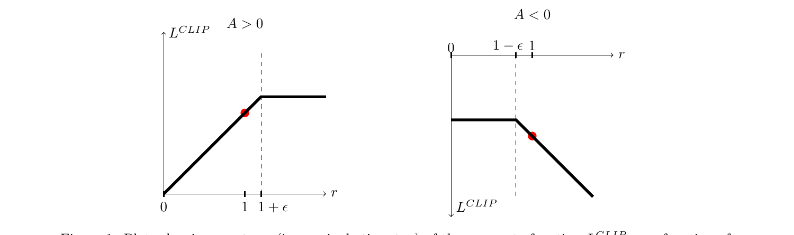
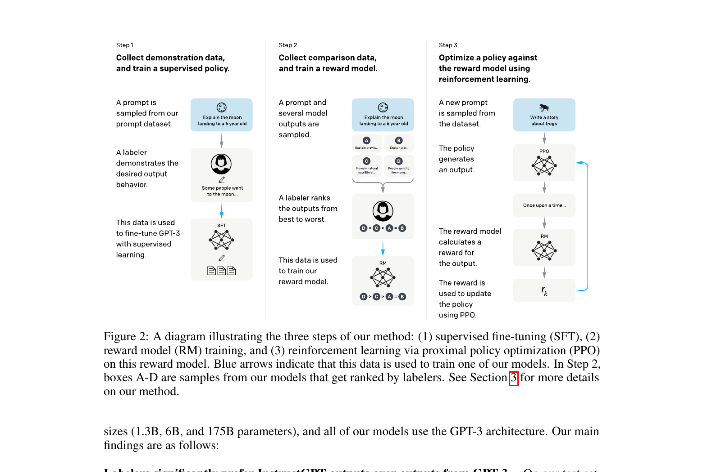
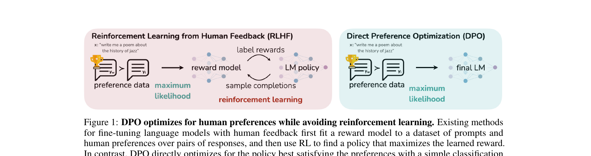
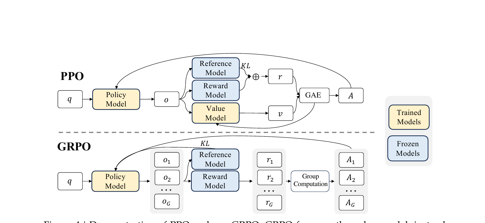
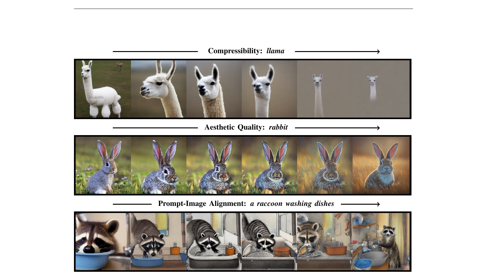

<header class="paper-header">
    <p class="badge tutorial-badge">教程 · Tutorial</p>
    <h1>RLHF 的演变：PPO → DPO → GRPO + Diffusion 的 RL</h1>
    <p class="subtitle">从 log π 是什么到 50 行能跑的 DPO trainer —— 一篇把公式、代码、跨域差异讲到底的深度教程</p>
    
  </header>

这篇教程的全部主线只有一句话: **所有 RL 方法都在最大化 `reward − β·KL`**. PPO / RLHF / DPO / GRPO / DAPO / Dr.GRPO / GSPO / DDPO / Diffusion-DPO 的差异, 全部可以归结到三个旋钮: *怎么估 reward* (RM / 规则 / 偏好对 / 美学分)、*怎么估 KL* (token-level approx / 闭式 sigmoid / k1 / k3)、*怎么估 advantage* (GAE / group baseline / 无). 把任何新论文按这三件事对号入座, 你都能 1 分钟读懂它在变量空间的哪个角落里改了一刀.

本文 8 大节按螺旋方式组织: 每节都先给"直觉" (高三能听懂), 再给"最小 demo" (15-50 行能跑), 再给"完整推导" (一步不省), 再"引真实 repo 代码" (file:Lstart-Lend 可追溯), 最后给"洞察" (这个设计为什么不是另一种). DPO 与 GRPO 两节代码深度对等, 各有 3-4 段 verbatim 引用 + 公式↔代码逐行对照表.

## 1. 公式里那些符号到底是什么 —— policy、log π、KL 的工程意义

### 1.1 直觉

你打开任何一篇 RLHF 论文,扑面而来的都是 $\pi_\theta$、$\log \pi$、$\mathrm{KL}$ 这些抽象记号。它们让人误以为强化学习是在某种平行宇宙里跑的——而你硬盘上那个 7B 参数的 transformer 是另外一回事。完全不是。

**(a) Policy 就是你的网络本身。**"policy $\pi_\theta$" 翻译成工程语言就是:你那个加载到 GPU 里的 transformer 或者 U-Net,参数集合 $\theta$ 就是它的 state_dict。训练前训练后是同一个文件、同一份代码,只是 .pt 里的数值变了。不要把 policy 想成一个新对象。

**(b) LLM 的 policy 长什么样。**给定 prompt $x$,它对词表里每个 token $v$ 输出一个概率 $\pi_\theta(v \mid x, y_{\lt t})$。这就是 softmax 之后的那一行——50257 维的向量,和为 1。采样一次就是 generate 一个 token。

**(c) Diffusion 的 policy 长什么样。**U-Net 在第 $t$ 步收到带噪图 $x_t$ 和时间步 $t$,输出"该往哪个方向去噪"。把每一步去噪也看成"从一个分布里采样下一个 $x_{t-1}$",整个反向链就是一个多步 policy。后面 §7 会把它和 LLM 的 per-token policy 对齐。

**(d) log 不是炫技,是两条工程理由的合谋。**其一,LLM 一个回答 200 token,把 200 个 1e-3 的概率乘起来是 1e-600,fp16 下直接是 0;取 log 后变成加法,数值稳得像石头。其二,梯度推导里有一个救命恒等式 $\nabla_\theta p = p \cdot \nabla_\theta \log p$,它让"对采样出来的样本求梯度"这件不可能的事变得可能——后面 §2 会反复用。

**(e) KL 是"别走太远"的统一记号。**所有 RLHF 算法本质上都在做同一件事:让新 policy 比旧 policy 更好,但不要变得面目全非。"不要变得面目全非"这句话,数学家写出来就是 $\mathrm{KL}(\pi_\theta \,\|\, \pi_{\text{ref}})$。PPO、DPO、GRPO 只是 KL 出现的位置和估计方式不同。

<figure>
    <pre style="font-family: 'SF Mono', monospace; font-size: 0.85em; line-height: 1.3; background: #1e2530; color: #e8e8e8; padding: 1em; border-radius: 6px;">  vocab:      "猫"      "狗"      "鸟"      "鱼"
   prob:    █████████ ████     ██       █
            0.55      0.25     0.15     0.05
log-prob:   ▏         ▏▏       ▏▏▏      ▏▏▏▏▏
           -0.60     -1.39    -1.90    -3.00
                                          ↑
                            概率小的 token, log-prob 量级大,
                            梯度被推得更狠 —— 这就是 log 的"自动平衡"。
    </pre>
    <figcaption>图 1.1 一个 4-token 词表的 softmax 输出。上半是概率(求和=1),下半是 log-prob(均为负)。log 把"差几个数量级的概率"压成"差几个常数的对数",训练才稳。</figcaption>
  </figure>

### 1.2 最小 demo

下面这段 numpy 代码教你看清三件事:softmax 长什么样、log_softmax 为什么比"先 softmax 再取 log"稳、KL 一行就能写出来。

```python
import numpy as np

# 一个 4-token 词表的 logits (没归一化的网络输出)
logits_p = np.array([2.0, 1.0, -1.0, -3.0])
logits_q = np.array([1.8, 1.2, -0.8, -3.5])  # 一个稍有不同的 policy

def log_softmax(x):
    # 数值稳定写法: 减去 max, 再用 logsumexp 公式
    m = x.max()
    return x - m - np.log(np.exp(x - m).sum())

def softmax(x):
    return np.exp(log_softmax(x))

log_p, log_q = log_softmax(logits_p), log_softmax(logits_q)
p, q = softmax(logits_p), softmax(logits_q)

# 一条 200-token 序列, 每步概率 0.05: 直接连乘 vs log 求和
seq_prob = 0.05 ** 200          # -> 0.0 (underflow)
seq_logp = 200 * np.log(0.05)   # -> -599.1, 稳如老狗

# KL(p || q) = sum_x p(x) * (log p(x) - log q(x))
kl = (p * (log_p - log_q)).sum()
print(f"p={p.round(3)}  log p={log_p.round(3)}  KL(p||q)={kl:.4f}")
print(f"  prod(0.05^200)={seq_prob}  sum(log 0.05*200)={seq_logp:.1f}")
```

跑一遍你会看到:`seq_prob` 直接打印成 `0.0`(下溢成 0,梯度全废),而 `seq_logp ≈ -599.1` 仍然是一个普通浮点数。`KL(p||q)` 是一个正数(KL 永远非负),它告诉你两个分布"差多远"——这就是后面 PPO 里 $\beta \cdot \mathrm{KL}$ 那一项的本质。所有这一套,生产代码里也就是把 numpy 换成 torch、把 print 换成 backward。

### 1.3 正式化

现在把上面的直觉写严。一个 policy 是参数化的条件分布

<p class="math-translation">—— 翻译: 给定当前状态 $s$,网络参数 $\theta$ 决定了下一个动作 $a$ 落在每个可能取值上的概率;$\theta$ 就是 transformer 的权重。</p>

对 LLM 来说,$s$ 是当前已生成的前缀 $(x, y_{\lt t})$,$a$ 是下一个 token $y_t$。由链式法则,一个长度为 $T$ 的回答 $y$ 的对数概率天然可分解:

<p class="math-translation">—— 翻译: 一句话的 log 概率等于每个 token 的 log 概率相加。这就是 §1.2 demo 中"乘积下溢、求和稳定"的数学版,也是后面 per-token loss 的基础。</p>

引入一个参考策略 $\pi_{\text{ref}}$(通常是 SFT 之后、RL 之前的 frozen 副本)。两个 policy 的距离用 KL 散度度量:

<p class="math-translation">—— 翻译: KL 是"在 $\pi_\theta$ 自己采样出的回答上,新旧 log-prob 之差的期望"。在实现里这是一个单样本估计——抽一个 $y$,算两次 log-prob,作差。</p>

RL 的目标函数($R(x,y)$ 是奖励,例如人类偏好打分或一个规则验证器):

<p class="math-translation">—— 翻译: 我们想最大化的是"在自己采的样本上拿到的平均奖励"。注意 $y$ 是从 $\pi_\theta$ 自己采的,所以 $\theta$ 同时出现在分布里和被求期望的函数里——这正是 policy gradient 要解决的核心难点。</p>

大部分 RLHF 算法都在最大化 $J(\theta) - \beta \cdot \mathrm{KL}(\pi_\theta \,\|\, \pi_{\text{ref}})$:第一项推着 policy 去拿高分,第二项把它拽回 $\pi_{\text{ref}}$ 附近,$\beta$ 是松紧带的硬度。

### 1.4 代码引用

<p class="code-source">sources/repos/huggingface-trl/trl/trainer/utils.py:L436-L480 — selective_log_softmax: 从 LM logits 算 per-token log π</p>

```python
def selective_log_softmax(logits, index) -> torch.Tensor:
    """
    A memory-efficient implementation of the common `log_softmax -> gather` operation.

    This function is equivalent to the following naive implementation:
    ```python
    # for index with shape (...):
    logps = torch.gather(logits.log_softmax(-1), dim=-1, index=index.unsqueeze(-1)).squeeze(-1)
    # for index with shape (..., K):
    logps = torch.gather(logits.log_softmax(-1), dim=-1, index=index)
    ```
    """
    squeeze = index.ndim == logits.ndim - 1
    if squeeze:
        index = index.unsqueeze(-1)

    if logits.dtype in [torch.float32, torch.float64]:
        selected_logits = torch.gather(logits, dim=-1, index=index)
        # loop to reduce peak mem consumption
        logsumexp_values = torch.stack([torch.logsumexp(lg, dim=-1) for lg in logits])
        per_token_logps = selected_logits - logsumexp_values.unsqueeze(-1)  # log_softmax(x_i) = x_i - logsumexp(x)
    else:
        # logsumexp approach is unstable with bfloat16, fall back to slightly less efficient approach
        per_token_logps = []
        for row_logits, row_labels in zip(logits, index, strict=True):  # loop to reduce peak mem consumption
            row_logps = F.log_softmax(row_logits, dim=-1)
            row_per_token_logps = row_logps.gather(dim=-1, index=row_labels)
            per_token_logps.append(row_per_token_logps)
        per_token_logps = torch.stack(per_token_logps)

    if squeeze:
        per_token_logps = per_token_logps.squeeze(-1)

    return per_token_logps
```

这是 TRL 库里几乎每个 trainer(PPO/DPO/GRPO)第一步都会调的函数,它把网络的 raw logits 变成"采到的那个 token 的 log π"。对照 §1.3 的公式:输入 `logits` 的形状是 `[batch, seq_len, vocab]`,正是 $\pi_\theta(\cdot \mid x, y_{\lt t})$ 的未归一化版本;`index` 是真正采出来的 token id,即 $y_t$。`selected_logits = torch.gather(logits, dim=-1, index=index)` 取出 $y_t$ 对应那一维的 logit;`logsumexp_values = torch.stack([torch.logsumexp(lg, dim=-1) for lg in logits])` 算出 partition function 的 log,即 $\log\sum_v \exp(\mathrm{logit}_v)$;最后一行 `selected_logits - logsumexp_values.unsqueeze(-1)` 实现的就是恒等式 $\log \pi_\theta(y_t \mid x, y_{\lt t}) = \mathrm{logit}_{y_t} - \log\sum_v \exp(\mathrm{logit}_v)$。bfloat16 分支用 `F.log_softmax` 走标准路径,原因是低精度下 logsumexp 会跑偏——这正是 §1.1(d) 提到的工程现实。

### 1.5 洞察

- **log 不是数学家的洁癖,是 fp16 下 1e-30 概率必死的工程必需。**从此往后所有 loss 都是 log-prob 的线性组合——记住这一点,后面任何公式你都能在 5 行 PyTorch 里复现。
- **KL 不需要算两个分布的真距离。**在 PPO/DPO/GRPO 里,它都是用单样本 log-prob 之差 $\log\pi_\theta(y) - \log\pi_{\text{ref}}(y)$ 做的无偏(或低偏)估计;真要算 $\sum_v \pi(v)\log(\pi(v)/\pi_{\text{ref}}(v))$,词表 5 万维根本算不动。
- **Policy 不是抽象,它就是你硬盘上那个 .pt 文件。**RLHF 全部魔法,本质上是用一份奖励信号去微调那份 .pt——所以每次看到 $\pi_\theta$,在脑子里把它读成"我的模型"。

## 2. Policy Gradient: 不可微 reward 怎么求导 —— REINFORCE 起手

### 2.1 直觉

RL 在生成模型里之所以"不可替代",起点就一句话:**我们想最大化的目标不可导**。BLEU、人类偏好打分、CLIP 相似度、单元测试是否通过、编译器 pass/fail —— 这些 reward 要么是离散的、要么经过黑箱评测器,根本没有 $\partial R / \partial \theta$ 可以反传。所以即便把 LLM 的输出 logits 接上一个 reward,也无法像监督学习那样"loss.backward()"完事。

突破口是一个看似无害的恒等式 —— *log-derivative trick*:$\nabla_\theta p_\theta(x) = p_\theta(x)\,\nabla_\theta \log p_\theta(x)$。把它代进期望里,梯度被"挪到 log π 上面",而 R 只作为一个采样到的**常数权重**留在外面。结论非常便宜:只要你能 sample 一条 trajectory $\tau$、能算它的 $\log \pi_\theta(\tau)$,你就能更新 $\theta$ —— reward 是不是可导,根本不进梯度公式。

一个通俗类比:你想最大化"刮彩票的中奖额"。中奖与否是离散事件、没有梯度,但你*可以*调整"买哪张票"的策略 $\pi_\theta$。REINFORCE 告诉你:把每次中奖额拿来,按当时"为什么买这张票"的 log 概率梯度加权,平均一下就是策略改进方向。中奖那张,下次更可能买;没中那张,下次更不可能买。

<figure class="derivation-chain">
    <div class="chain-step"><strong>① 目标</strong>   想最大化期望 reward,$R$ 是黑箱(BLEU、打分、规则裁判),不可导。</div>
    $$J(\theta) \;=\; \mathbb{E}_{\tau \sim \pi_\theta}\!\big[R(\tau)\big]$$

    <div class="chain-arrow">↓   朴素地写 $\partial R / \partial \theta$ 走不下去 —— R 没梯度</div>

    <div class="chain-step"><strong>② 关键恒等式 (log-derivative trick)</strong>   任何含 θ 的概率密度都满足:</div>
    $$\nabla_\theta\, p_\theta(\tau) \;=\; p_\theta(\tau)\,\nabla_\theta \log p_\theta(\tau)$$

    <div class="chain-arrow">↓   代回 $\nabla_\theta J = \int \nabla_\theta p_\theta(\tau)\,R(\tau)\,d\tau$</div>

    <div class="chain-step"><strong>③ REINFORCE 估计</strong>   积分写回期望,$R$ 退成"采样权重",梯度全在 $\log \pi_\theta$ 上:</div>
    $$\nabla_\theta J(\theta) \;=\; \mathbb{E}_{\tau \sim \pi_\theta}\!\Big[\,\underbrace{R(\tau)}_{\text{数值, 允许黑箱}} \;\cdot\; \underbrace{\nabla_\theta \log \pi_\theta(\tau)}_{\text{这里才有梯度}}\,\Big]$$

    <div class="chain-step"><strong>结论:</strong> 只要能 sample 一条 trajectory $\tau$、能算 $\log \pi_\theta(\tau)$,就能更新 θ —— $R$ 可不可导根本不进梯度公式。</div>

    <figcaption>图 2.1 log-derivative trick 三步走:把 ∇ 从不可导的 $R$ "挪"到可导的 $\log \pi$ 上,REINFORCE 就此成立。</figcaption>
  </figure>

<style>
    .derivation-chain { background: #faf7f0; border: 1px solid var(--rule, #e8e2d4); border-left: 4px solid #5d8db6; padding: 1rem 1.4rem; border-radius: 6px; margin: 1.6rem 0; }
    @media (prefers-color-scheme: dark) { .derivation-chain { background: #211e18; } }
    .derivation-chain .chain-step { margin: 0.55rem 0 0.3rem; line-height: 1.65; }
    .derivation-chain .chain-arrow { margin: 0.45rem 0 0.45rem 0.6rem; color: var(--text-secondary, #5f5a52); font-style: italic; font-size: 0.92rem; }
    .derivation-chain figcaption { margin-top: 0.8rem; padding-top: 0.6rem; border-top: 1px dashed var(--rule, #e8e2d4); font-size: 0.88rem; color: var(--text-secondary, #5f5a52); }
  </style>

### 2.2 最小 demo

30 行 numpy 跑一个 3-arm bandit:真实 reward 是 $[0.1, 0.5, 0.9]$,policy 是 softmax(θ)。注意 reward 在代码里就是个查表得到的标量,完全不可导,但 θ 仍然能收敛到只拉第 3 根 arm。

```python
import numpy as np
np.random.seed(0)

true_rewards = np.array([0.1, 0.5, 0.9])   # 不可导:就是一张查找表
theta = np.zeros(3)                         # policy logits
lr = 0.1
history = []

for step in range(300):
    # 1) sample action a ~ softmax(theta)
    probs = np.exp(theta) / np.exp(theta).sum()
    a = np.random.choice(3, p=probs)

    # 2) get reward (黑箱:不需要可导)
    r = true_rewards[a]

    # 3) ∇_θ log π(a|θ) = e_a - probs    (softmax 的标准结果)
    grad_logp = -probs.copy()
    grad_logp[a] += 1.0

    # 4) REINFORCE: θ ← θ + lr · r · ∇log π(a)
    theta += lr * r * grad_logp
    history.append(r)

print("final policy:", np.round(probs, 3))   # ≈ [0.00, 0.01, 0.99]
print("avg reward last 50:", np.mean(history[-50:]))
```

关键不在循环长度,而在于第 2 步:`r = true_rewards[a]` 是离散查表,Python 永远不会对它求导;真正进入梯度的是**第 3 步** $\nabla_\theta \log \pi$ —— softmax 对 logits 的导数,完全可导。reward 只是个权重:r 越大,把这个 action 的概率往上推得越用力。这正是把"不可导优化"翻译成"可导优化"的全部内容。

### 2.3 正式化

从 §1 的目标函数出发(τ 表示一整条轨迹 $s_0, a_0, s_1, a_1, \dots, s_T$):

<p class="math-translation">—— 翻译: 我们要让"按当前策略 π_θ 跑出来的轨迹,平均得分"尽可能高。</p>

对 θ 求梯度。$R(\tau)$ 与 θ 无关,只有 $p_\theta(\tau)$ 含 θ。套 log-derivative trick:

<p class="math-translation">—— 翻译: 用恒等式 ∇p = p · ∇log p 把"求导对象"从 p 换成 log p,这样积分又能写回期望形式。</p>

因为 $p_\theta(\tau) = p(s_0)\prod_t \pi_\theta(a_t \mid s_t)\, p(s_{t+1}\mid s_t, a_t)$,只有 $\pi_\theta$ 项依赖 θ,环境转移项 $\log p(s_{t+1}\mid s_t, a_t)$ 的梯度为零。于是得到 REINFORCE 估计:

<p class="math-translation">—— 翻译: 只要能采样轨迹、能算每步动作的 log 概率梯度,再用 R 加权求和,就是策略梯度的无偏估计。</p>

**Baseline 降方差。** 注意到任何与动作无关的函数 $b(s)$ 满足 $\mathbb{E}_{a\sim\pi}[b(s)\,\nabla\log\pi(a\mid s)] = b(s)\,\nabla\sum_a \pi(a\mid s) = b(s)\,\nabla 1 = 0$,因此把 $R$ 换成 $R - b(s)$ 不改变期望,却能显著压方差。取 $b(s) = V^\pi(s)$,定义优势:

<p class="math-translation">—— 翻译: 优势 = 这个动作的回报 − 这个状态的平均回报,"比平均好多少"才是有信息量的学习信号。</p>

实际中 $A$ 不可解析,需要从样本估计。Schulman 等人 (2016) 的 GAE 用 TD 残差 $\delta_t = r_t + \gamma V(s_{t+1}) - V(s_t)$ 的几何加权和:

<p class="math-translation">—— 翻译: λ 越接近 0 越像单步 TD(低方差高偏差),越接近 1 越像 Monte Carlo(低偏差高方差),λ 就是一个手动旋钮。</p>

### 2.4 代码引用

看一下 TRL 里 PPO 训练器是怎么把 GAE 写成几行 PyTorch 的。这段代码会在 §3 PPO 里被反复引用,这里只关注 advantage 计算本身:

<p class="code-source">sources/repos/huggingface-trl/trl/experimental/ppo/ppo_trainer.py:L794-L807 — GAE advantage: 反向时序累加 delta + gamma*lam*lastgaelam</p>

```python
# 6. compute advantages and returns
lastgaelam = 0
advantages_reversed = []
gen_length = responses.shape[1]
for t in reversed(range(gen_length)):
    nextvalues = values[:, t + 1] if t < gen_length - 1 else 0.0
    delta = rewards[:, t] + args.gamma * nextvalues - values[:, t]
    lastgaelam = delta + args.gamma * args.lam * lastgaelam
    advantages_reversed.append(lastgaelam)
advantages = torch.stack(advantages_reversed[::-1], axis=1)
returns = advantages + values
advantages = masked_whiten(advantages, ~padding_mask)
advantages = torch.masked_fill(advantages, padding_mask, 0)
```

三处对照:

- `delta = rewards[:, t] + args.gamma * nextvalues - values[:, t]` 就是公式里的 $\delta_t = r_t + \gamma V_{t+1} - V_t$;`nextvalues` 在最后一步是 0,因为序列末尾没有下一时刻 value。
- `lastgaelam = delta + args.gamma * args.lam * lastgaelam` 是 GAE 递推 $\hat{A}_t = \delta_t + \gamma\lambda \hat{A}_{t+1}$ 的逐字翻译。反向遍历 `for t in reversed(range(gen_length))` 是因为 $\hat{A}_t$ 依赖 $\hat{A}_{t+1}$ —— 必须先有未来,才能算现在。
- `masked_whiten(advantages, ~padding_mask)` 把整个 batch 的 advantage 做 mean=0, var=1 的标准化(并屏蔽 padding 位)。这一步纯粹是**降方差的工程 trick**,理论上不改变期望梯度方向,但显著稳住 LLM 上的 PPO 训练 —— 后面 §3 会看到为什么 LLM 设定下方差是头号敌人。

### 2.5 洞察

- **REINFORCE 是入场券,但单跑会爆。** bandit 上几行就收敛;LLM 上,reward 是 sequence-level 的一个标量(整条几百 token 的回答只回收一个分),分母还有指数级的轨迹空间。结果是 $\nabla \log \pi$ 的方差极大、梯度乱跳。§3 PPO 的两件武器 —— ratio clip 和 value head —— 都是直接攻这个根。
- **Advantage 不是"数学美感",是"相对信号"。** 用 raw reward 训练,优化器收到的是"这条轨迹得了 0.7";用 advantage 训练,优化器收到的是"这条轨迹比平均水平好 +0.2"。后者去掉了所有 prompt 难度差异带来的 baseline 漂移,信噪比高一个数量级。RLHF/DPO 之争背后,本质就是"要不要显式 value 来算 advantage"这个问题。
- **$(\gamma, \lambda)$ 是偏差/方差旋钮。** $\lambda \to 0$ 退化为单步 TD,bias 高、variance 低;$\lambda \to 1$ 变成 Monte Carlo,bias 低、variance 高。LLM RLHF 实战里 $\lambda = 0.95$、$\gamma = 1.0$ 是几乎所有开源实现的默认值 —— 不是巧合,是被无数次 run 砸出来的 sweet spot。

## 3. PPO: 走得快, 但别翻车 —— clip 是怎样想出来的

### 3.1 直觉

§2 的 REINFORCE 给出了"reward 不可导也能更新"的钥匙, 但留了一个尾巴: 一旦学习率稍微大一点, 或者某条 trajectory 的 advantage 异常大, $\nabla \log \pi_\theta$ 就把策略推得过远 —— 新策略采样出来的轨迹分布跟旧策略相去甚远, 已经收集好的那批样本立刻"过期", 训练曲线常常先升后崩。问题的本质是: 普通 policy gradient **没有任何机制约束"一步能走多远"**, 而 on-policy 算法的样本效率又逼着我们想在同一批 rollout 上做多次梯度更新, 矛盾立刻浮现。

2015 年的 TRPO 给出了第一版严肃答案: 在每次更新时, 显式约束新旧策略的 KL 距离 $\mathrm{KL}(\pi_{\text{old}} \| \pi_\theta) \le \delta$, 把更新限制在一个"信赖域"里。理论很漂亮 (单调改进保证), 但实现要做共轭梯度 + line search, 还得算 Fisher 矩阵向量积, 对 dropout、参数共享、RNN 都不友好, 拿到一个新框架往往要重写半套优化器, 在 PyTorch 这种动态图生态里水土不服。

2017 年 Schulman 团队抛出了一个几乎让人想笑的极简方案 —— **PPO**: 既然要约束"走多远", 那就直接看新旧策略对同一个动作的概率比 $r = \pi_\theta / \pi_{\text{old}}$, 把它**硬剪**到 $[1-\epsilon, 1+\epsilon]$ 区间。再加一个 min 操作, 让"过度乐观的更新"被压回去, 但"惩罚性的负 advantage"该传多大就传多大。整个 PPO 的总目标其实就三项: clipped surrogate (策略提升) − value loss (critic 拟合 $\hat A$) + entropy bonus (鼓励探索), 一行代码 30 个字符就能写完核心。它不带任何额外超参的二阶约束, 没有 line search、没有 Hessian, 只多了一个 $\epsilon$ 标量, 却拿到了和 TRPO 几乎一致的稳定性 —— 这正是工程师梦寐以求的"砍掉数学优雅、换来工程鲁棒"。

<figure>
    
    <figcaption>图 3.1: PPO clipped surrogate $L^{CLIP}$ 关于 ratio $r$ 的形状。当 $\hat A \gt 0$ (左图) 时, $r$ 超过 $1+\epsilon$ 之后 surrogate 被压平 —— 即使比例继续涨, 也拿不到额外 reward, 抑制激进更新; 当 $\hat A \lt 0$ (右图) 时, $r$ 跌破 $1-\epsilon$ 之后才被夹住 —— 负样本仍能驱动梯度。这条"非对称剪裁"就是 PPO 名字里 "Proximal" 的由来。</figcaption>
  </figure>

### 3.2 最小 demo

把上面三步翻成 30 行 PyTorch, 跑在一个 2-arm bandit 上, 我们就能亲眼看见 ratio、clipfrac、loss 这三个 PPO 训练日志里最常出现的指标:

```python
import torch, torch.nn.functional as F

torch.manual_seed(0)
logits = torch.zeros(2, requires_grad=True)   # 2 个动作的 policy logits
optim  = torch.optim.SGD([logits], lr=0.5)
eps    = 0.2

# === 1) 用 "old policy" 采一批 trajectory ===
with torch.no_grad():
    old_logp_all = F.log_softmax(logits, dim=-1)
    actions = torch.distributions.Categorical(logits=logits).sample((64,))
    old_logp = old_logp_all[actions]                  # 采样时记录的 log π_old
rewards = torch.tensor([0.0, 1.0])[actions]           # 只有动作 1 有 reward
adv = (rewards - rewards.mean()) / (rewards.std() + 1e-8)   # 简易 baseline

# === 2) 在同一批样本上做 K 步 PPO 更新 ===
for k in range(4):
    new_logp = F.log_softmax(logits, dim=-1)[actions]
    ratio    = torch.exp(new_logp - old_logp)         # r_t(θ)
    surr1    = ratio * adv
    surr2    = torch.clamp(ratio, 1 - eps, 1 + eps) * adv
    pg_loss  = -torch.min(surr1, surr2).mean()        # 注意符号: minimize loss = maximize surrogate
    clipfrac = (surr2 < surr1).float().mean().item() if (adv > 0).any() else \
               (surr2 > surr1).float().mean().item()
    optim.zero_grad(); pg_loss.backward(); optim.step()
    print(f"step {k}  ratio[{ratio.min():.3f},{ratio.max():.3f}]  "
          f"clipfrac={clipfrac:.2f}  loss={pg_loss.item():+.4f}")
```

跑起来你会看到: 第 0 步 ratio 恰为 1.0 (新旧策略相同), clipfrac=0; 之后几步 ratio 逐渐偏离 1, 当超出 $[0.8, 1.2]$ 的样本越多, clipfrac 越大, loss 也开始"卡住"不再下降 —— 这正是 PPO 主动放弃"贪婪的更新"的瞬间。注意我们用的是 `min(surr1, surr2)` 而不是直接 `clip(ratio) * adv`: 前者在 $\hat A \gt 0$ 时压住乐观、在 $\hat A \lt 0$ 时仍允许大梯度修正; 后者会同时砍掉"该走的负方向", 反而让坏样本无法被纠正。这就是 PPO 论文里反复强调的"悲观下界"——只在对自己有利的方向上保守, 在惩罚自己的方向上保留全部学习信号, 这种非对称设计是 PPO 区别于一切朴素 clip 方案的关键。

### 3.3 正式化

把直觉翻译成公式, 整个 PPO 只需要四个对象: ratio、CPI surrogate、CLIP surrogate、total loss。先定义新旧策略对同一动作的概率比:

$$r_t(\theta) = \frac{\pi_\theta(a_t \mid s_t)}{\pi_{\theta_{\text{old}}}(a_t \mid s_t)}$$

<p class="math-translation">—— 翻译: $r_t$ 等于 1 表示"新策略对这个动作的偏好和旧策略一样"; 大于 1 表示"更偏好"; 小于 1 表示"更不偏好"。</p>

TRPO 沿用的 surrogate (Schulman 称为 Conservative Policy Iteration 目标) 就是把 advantage 用这个 ratio 加权:

$$L^{CPI}(\theta) = \mathbb{E}_t\!\left[ r_t(\theta) \,\hat A_t \right]$$

<p class="math-translation">—— 翻译: 想让总 advantage 越大越好, 就让那些 $\hat A_t \gt 0$ 的动作的 $r_t$ 涨上去、$\hat A_t \lt 0$ 的动作的 $r_t$ 压下来。</p>

问题是 $L^{CPI}$ 没有任何"上限" —— $r_t$ 可以飙到 10、100, 把单条样本的影响放大到崩盘。PPO 的核心改动只有一行: 用 min 和 clip 把 surrogate 夹成两段折线:

$$L^{CLIP}(\theta) = \mathbb{E}_t\!\left[ \min\!\Big( r_t(\theta)\,\hat A_t,\; \mathrm{clip}(r_t(\theta), 1-\epsilon, 1+\epsilon)\,\hat A_t \Big) \right]$$

<p class="math-translation">—— 翻译: 对每个时刻, 在"原始 surrogate"和"剪裁后 surrogate"中取较小的一个, 形成一个永远不会"过度乐观"的下界。</p>

这里 min 的不对称性是关键: 当 $\hat A_t \gt 0$ 时, ratio 越大 surrogate 越大, 一旦 $r_t \gt 1+\epsilon$ 第二项就把它压回 $1+\epsilon$, min 取出这个被压住的值; 当 $\hat A_t \lt 0$ 时, ratio 越小 surrogate 越大 (因为乘了负数), 一旦 $r_t \lt 1-\epsilon$ 第二项把它夹回 $1-\epsilon$, min 同样取出被夹的值。两侧效果合起来: **新策略只在"对自己有利"的方向上被剪裁, 在"惩罚自己"的方向上仍能大步纠错**。

把策略损失和 critic、entropy 拼起来就是 PPO 的完整目标:

$$L(\theta) = L^{CLIP}(\theta) - c_1\, L^{VF}(\theta) + c_2\, S\!\left[\pi_\theta\right](s_t)$$

<p class="math-translation">—— 翻译: 第一项推动策略改进, 第二项让 critic 拟合 $\hat A_t$ 所依赖的 value, 第三项是 entropy bonus, 阻止策略过早 collapse 成 one-hot。</p>

这里的 $\hat A_t$ 通常就用 §2.3 已经推过的 GAE 公式 $\hat A_t = \sum_{l\ge 0}(\gamma\lambda)^l \delta_{t+l}$ 计算, 因此 PPO 训练循环 = "rollout → GAE → K 个 epoch 的 minibatch SGD on $L$"。

### 3.4 代码引用

HuggingFace TRL 的 PPOTrainer 把上面公式几乎一一对应地写成了 10 行代码, 这是工业界最常被 fork 的 LLM-PPO 实现:

<p class="code-source">sources/repos/huggingface-trl/trl/experimental/ppo/ppo_trainer.py:L849-L866 — PPO clipped surrogate: ratio + 双侧 surrogate + max</p>

```python
                            logprobs_diff = new_logprobs - mb_logprobs
                            ratio = torch.exp(logprobs_diff)
                            pg_losses = -mb_advantage * ratio
                            pg_losses2 = -mb_advantage * torch.clamp(ratio, 1.0 - args.cliprange, 1.0 + args.cliprange)
                            pg_loss_max = torch.max(pg_losses, pg_losses2)
                            pg_loss = masked_mean(pg_loss_max, ~padding_mask[micro_batch_inds])
                            loss = pg_loss + args.vf_coef * vf_loss
                            accelerator.backward(loss)
                            optimizer.step()
                            optimizer.zero_grad()
                            with torch.no_grad():
                                pg_clipfrac = masked_mean(
                                    (pg_losses2 > pg_losses).float(), ~padding_mask[micro_batch_inds]
                                )
                                prob_dist = torch.nn.functional.softmax(logits, dim=-1)
                                entropy = torch.logsumexp(logits, dim=-1) - torch.sum(prob_dist * logits, dim=-1)
                                approxkl = 0.5 * (logprobs_diff**2).mean()
```

逐行对照公式: 第 1 行 `logprobs_diff = new_logprobs - mb_logprobs` 就是 $\log r_t(\theta) = \log\pi_\theta - \log\pi_{\theta_{\text{old}}}$, 在 log 空间做差比直接除概率数值稳定得多。第 2 行 `ratio = torch.exp(...)` 还原 $r_t$。第 3、4 行写出两个 surrogate, 但都带了负号 —— 这是因为 PyTorch 是**最小化** loss, 而我们想**最大化** $L^{CLIP}$, 所以代码里 `pg_losses = -mb_advantage * ratio` 对应 $-r_t \hat A_t$。第 5 行的 `torch.max(pg_losses, pg_losses2)` 看起来和公式 $\min(\cdot,\cdot)$ 反向, 但因为两个 surrogate 都取了负, max-of-negatives 恰好等于 -min-of-positives, 数学上完全等价。第 13 行的 `pg_clipfrac` 统计"被 clip 那一支更小"的比例 —— 这也是 PPO 训练日志里最关键的健康指标, 大致维持在 0.1–0.3 之间。最后 `approxkl = 0.5 * (logprobs_diff**2).mean()` 是新旧策略 KL 的二阶近似, 用来在 early stopping 时判断"这一轮是不是走太远"。

而 $\hat A_t$ 的计算就是 §2.3 推过的 GAE 反向递推, 同一个文件再往上翻几十行:

<p class="code-source">sources/repos/huggingface-trl/trl/experimental/ppo/ppo_trainer.py:L794-L807 — GAE backward loop</p>

```python
                # 6. compute advantages and returns
                lastgaelam = 0
                advantages_reversed = []
                gen_length = responses.shape[1]
                for t in reversed(range(gen_length)):
                    nextvalues = values[:, t + 1] if t < gen_length - 1 else 0.0
                    delta = rewards[:, t] + args.gamma * nextvalues - values[:, t]
                    lastgaelam = delta + args.gamma * args.lam * lastgaelam
                    advantages_reversed.append(lastgaelam)
                advantages = torch.stack(advantages_reversed[::-1], axis=1)
                returns = advantages + values
                advantages = masked_whiten(advantages, ~padding_mask)
                advantages = torch.masked_fill(advantages, padding_mask, 0)
```

对照公式: `delta = rewards[:, t] + gamma * nextvalues - values[:, t]` 是 TD residual $\delta_t = r_t + \gamma V(s_{t+1}) - V(s_t)$; `lastgaelam = delta + gamma * lam * lastgaelam` 就是 GAE 的递推式 $\hat A_t = \delta_t + \gamma\lambda\, \hat A_{t+1}$, 从右往左累加正好一遍 $O(T)$ 出全部 advantage。`returns = advantages + values` 给 critic 提供回归目标 (这就是上一段 `vf_loss` 的标签)。最后 `masked_whiten` 把 advantage 标准化到零均值单位方差, 这一步在 LLM 长序列上几乎是"必开"的 trick, 否则 ratio 会被极端 $\hat A$ 推到 clip 边界外。两段代码合在一起, 就是教科书 PPO 在 LLM 上的全部精华。

### 3.5 洞察

- **clip vs KL penalty**: PPO 论文同时提出过"自适应 KL 惩罚"和"clip"两个版本, 实证上 clip $\epsilon=0.2$ 几乎对所有 Atari/MuJoCo 任务都开箱即用, 而 KL coefficient $\beta$ 需要随训练动态调节, 一旦 reward 量级变化就容易调炸 —— 这也是为什么 §4 RLHF 把 KL 单独放进 reward 而*不*放进 surrogate 系数, 把"步长约束"和"分布距离约束"两件事彻底解耦。
- **PPO 流行的真正原因不是性能, 是兼容性**: 跟 TRPO 比起来, PPO 不需要二阶信息, 对参数共享、dropout、LayerNorm、RNN/Transformer 都"插上就能跑", 这才是它在工业界全面取代 TRPO 的原因。把 LLM 接进 RL 流水线时, 这一点尤其重要 —— RLHF 阶段我们要在一个上百亿参数的 transformer 上做多次 SGD epoch, 任何 "需要重新算 Fisher" 的算法都直接出局。
- **value head 与 policy head 共享 backbone**: 在 LLM 上, critic 几乎都是把 transformer body 复用, 只在最后一层接一个标量输出 head —— 比"两份独立 7B 模型"省一半显存。但代价是 policy loss 和 value loss 必须配 $c_1$ 调好相对幅度 (通常 $c_1 \in [0.1, 1.0]$), 否则 critic 梯度会把 backbone 拖偏, 表现就是 reward 微涨、SFT 能力却快速退化。
- **entropy bonus 在 LLM 上常被关掉**: 经典 PPO 的 $c_2 \approx 0.01$ 是因为离散控制空间太小、容易 collapse, 而 LLM 词表 $\gt 5\!\times\!10^4$, sampling 温度 + nucleus 已经提供了足够探索, 所以 TRL 的默认 $c_2 = 0$。一旦 entropy bonus 拿掉、KL 又是控住"和 SFT 模型距离"的关键, 就需要专门把 KL 拼回 reward 里 —— 这正是 §4 RLHF 三段式 reward 设计登场的位置: SFT 给初始策略、RM 给标量 reward、KL 项把 PPO 的步长约束"翻译"成对 SFT 分布的依恋, 三者合一才能让大模型在不忘本的前提下学会满足人类偏好。

## 4. RLHF: 把 PPO 接到 LLM 上

### 4.1 直觉

到这里我们手里已经有了 PPO 这把锤子, 但还没找到要钉的钉子. RLHF (Reinforcement Learning from Human Feedback) 给出的答案是: **钉子是"对齐人类偏好"**. 不过一上来就有个工程难题 —— 人类的偏好该怎么变成可优化的 reward?

最朴素的想法: 让标注员直接给模型回答打 0–10 分. 这条路几乎所有团队都试过, 也几乎所有团队都放弃了. 原因有二: 一是**人评不准**, 不同人对"7 分"的理解差距巨大, 同一个人在上午和下午也会漂; 二是**分布漂移**, 模型今天的输出和上周的输出风格不同, 历史标签直接失效. 于是 InstructGPT 走了另一条路 —— **不让人打分, 让人选 A 还是 B**. 二选一这件事, 人做起来稳定得多.

<figure>
    
    <figcaption>InstructGPT 的三段式 pipeline: SFT → RM → PPO. 三个阶段对应三个 loss, 任何一步崩掉整条链路都报废.</figcaption>
  </figure>

整条 pipeline 是三段:

- **SFT (Supervised Fine-Tuning)** —— 在指令-回答配对上微调 base model, 得到一个能听懂人话的 policy π_SFT.
- **RM (Reward Model)** —— 收集"同一个 prompt 两条回答 + 人选哪条更好"的偏好数据, 训一个小网络 r_φ 拟合"人会更喜欢哪条".
- **PPO** —— 把 r_φ 当 reward 信号, 用 §3 那套 PPO 更新 π_θ, 让它最大化 RM 给的分数.

但故事还没完. 如果就这样把 RM 直接接到 PPO 上, 模型会迅速发现: 哦, 输出某种特定的话术能让 r_φ 给出爆表分数. 复读机、长度爆炸、固定开场白、滥用感叹号 —— 这些就是经典的 **reward hacking**. 本质上 RM 只是一个有限数据训出来的代理函数, 它在训练分布内还行, 一旦 policy 把它推到没见过的角落, RM 就成了一个有漏洞的目标函数, 被 PPO 这台优化机器逐一钻空子. 解决方案是在 PPO 阶段额外加一项 β·KL(π_θ ‖ π_ref), 其中 π_ref 就是 SFT 阶段冻结下来的副本. **β·KL 不是优化术语, 是 alignment 的安全装置** —— 它把 π_θ 牵在 π_ref 附近, 不让它为了 RM 高分把语言模型本身的能力打烂.

### 4.2 最小 demo

下面 30 行展示 RLHF 里两个最核心的算式: BT reward model 的 loss, 以及 PPO 阶段总 reward 怎么由 RM 分数减去 KL 罚项得到.

```python
import torch, torch.nn.functional as F

# (a) Bradley-Terry RM 训练: chosen 比 rejected 好, 让 r_chosen > r_rejected
# 假设 reward_model 把 (prompt + response) 映射到一个 scalar
r_chosen   = reward_model(prompt, response_chosen)    # shape: [batch]
r_rejected = reward_model(prompt, response_rejected)  # shape: [batch]

rm_loss = -F.logsigmoid(r_chosen - r_rejected).mean()
rm_loss.backward()
rm_optimizer.step()

# (b) RLHF 阶段: 给 policy 采样出来的 y, 算总 reward 送给 PPO
y = policy.sample(prompt)                              # 一次 rollout
logp_theta = policy.log_prob(y, prompt)                # 当前 policy, [T]
logp_ref   = ref_policy.log_prob(y, prompt)            # SFT 冻结副本, [T]

# token-level KL 估计 (单样本): log π_θ - log π_ref
kl_per_token = logp_theta - logp_ref                   # shape: [T]

# RM 只在序列结束时给一个 scalar 分数
r_scalar = reward_model(prompt, y).detach()            # shape: []

# 总 reward: 每步减 β·KL, 最后一步加 RM 分数
rewards = -beta * kl_per_token                         # shape: [T]
rewards[-1] += r_scalar
# 然后 rewards 喂给 PPO 的 advantage 估计 + L^CLIP 更新
```

注意两个工程细节. 一是 (b) 里 KL 不是真的算两个分布的 KL —— 它是用单样本 log-prob 之差作的**无偏估计** (§1 已铺垫). 二是 RM 给的是**整段序列一个分数**, 不是每个 token 一个, 所以它只能加在最后一个 token 上; 而 KL 罚项是 token-level 的, 每步都减. 这个"前面只罚 KL、最后一步才发 RM 红包"的形状, 是几乎所有 RLHF 实现的标准做法.

### 4.3 正式化

**Bradley-Terry 偏好模型.** 给定 prompt $x$ 和两条回答 $y_w$ (winner)、$y_l$ (loser), BT 假设人选 $y_w$ 的概率由两者 reward 之差经 sigmoid 决定:

$$P(y_w \succ y_l \mid x) = \sigma\big(r(x, y_w) - r(x, y_l)\big)$$

<p class="math-translation">—— 翻译: 哪条 reward 高就更可能被选; reward 差 0 时各 50%, 差距越大被选概率越接近 1.</p>

**RM 训练 loss.** 给定偏好数据集 $\mathcal{D}=\{(x, y_w, y_l)\}$, 做最大似然就是最小化:

$$\mathcal{L}_{RM}(\phi) = -\mathbb{E}_{(x, y_w, y_l) \sim \mathcal{D}}\big[\log \sigma\big(r_\phi(x, y_w) - r_\phi(x, y_l)\big)\big]$$

<p class="math-translation">—— 翻译: 推高 chosen 的分数、压低 rejected 的分数, 直到两者 sigmoid 差能解释所有人类偏好.</p>

**RLHF objective.** PPO 阶段要解的是一个 KL 约束下的最大化问题:

$$\max_{\pi_\theta}\; \mathbb{E}_{x \sim \mathcal{D},\, y \sim \pi_\theta(\cdot \mid x)}\Big[r_\phi(x, y) - \beta \log \frac{\pi_\theta(y \mid x)}{\pi_{ref}(y \mid x)}\Big]$$

<p class="math-translation">—— 翻译: 在不偏离 SFT 副本 π_ref 太远 (β·KL 惩罚) 的前提下, 让 RM 给的 reward 越高越好.</p>

**token-level 实现.** 上面这个目标看起来是"序列级"的, 但 PPO 需要的是**每步一个 reward** 才能算 advantage. 工程上的转法很关键: 把 $\log\frac{\pi_\theta(y \mid x)}{\pi_{ref}(y \mid x)} = \sum_t (\log \pi_\theta - \log \pi_{ref})_t$ 这条 autoregressive 分解打开, 让第 $t$ 步的 reward 是:

$$\tilde r_t = -\beta\,\big(\log \pi_\theta(y_t \mid x, y_{\lt t}) - \log \pi_{ref}(y_t \mid x, y_{\lt t})\big) + r_\phi(x, y)\cdot \mathbb{1}[t = T]$$

<p class="math-translation">—— 翻译: 每个 token 上都减一份 β·KL 罚分, 只有最后一个 token (t=T) 再加上 RM 给整段的 scalar 分数.</p>

很多人第一次读 RLHF 代码会卡在这一步: 怎么明明目标里只有一个 r_φ(x, y), 实现里却变成了每个 token 都有 reward? 答案就在这条等式 —— β·KL 的求和被劈成每步一份 token-level 罚项, 而 RM 那一笔只在最后一步出现. 这也解释了为什么实现里 KL 的"距离"从来不是真的算两个分布的 KL, 而是用一条采样轨迹上的 log-prob 之差代替: 既要拿到每个 token 一个 scalar 去喂 advantage 估计, 又不能为了一个标量真的去枚举词表算分布 KL.

### 4.4 代码引用

先看 TRL 里 RM 训练的 loss, 一行直接对上 BT:

<p class="code-source">sources/repos/huggingface-trl/trl/trainer/reward_trainer.py:L645-L665 — Bradley-Terry reward model loss: -logsigmoid(r_w - r_l)</p>

```python
    def compute_loss(self, model, inputs, return_outputs=False, num_items_in_batch=None):
        mode = "train" if self.model.training else "eval"

        # If not set, defaults from model config and may warn since cache isn't compatible with gradient checkpointing
        inputs["use_cache"] = False
        outputs = model(**inputs)

        # Split the rewards into chosen and rejected
        rewards_chosen, rewards_rejected = torch.chunk(outputs.logits.squeeze(-1), chunks=2)

        # Calculate loss, optionally modulate with margin
        if "margin" in inputs:
            loss = -nn.functional.logsigmoid(rewards_chosen - rewards_rejected - inputs["margin"]).mean()
        else:
            loss = -nn.functional.logsigmoid(rewards_chosen - rewards_rejected).mean()

        if self.args.center_rewards_coefficient is not None:
            loss += self.args.center_rewards_coefficient * torch.mean((rewards_chosen + rewards_rejected) ** 2)
```

核心就是 `loss = -logsigmoid(rewards_chosen - rewards_rejected).mean()` 这一行, 直接落到 §4.3 的 $\mathcal{L}_{RM}$. 一个工程小细节: `torch.chunk(outputs.logits.squeeze(-1), chunks=2)` 是因为 trainer 把 chosen + rejected 拼成一个 batch 一起 forward (节省 KV cache、对齐 padding), 出来再沿 batch 维切两半. 最后那个 `center_rewards_coefficient` 是把 (r_chosen + r_rejected) 的均值压向 0, 防止 RM 整体偏移 —— BT loss 本身只看差值, 不约束绝对值, 长期训练会让 reward 数值漂走.

再看 PPO 阶段把 KL 拼到 reward 上的那一段:

<p class="code-source">sources/repos/huggingface-trl/trl/experimental/ppo/ppo_trainer.py:L780-L792 — RLHF 把 KL 当 token-level reward 减项: r' = -β·KL + r(x,y) at last token</p>

```python
                # 4. compute rewards
                # Formula used by http://joschu.net/blog/kl-approx.html for the k1 and k3 estimators
                logr = ref_logprobs - logprobs
                kl = -logr if args.kl_estimator == "k1" else (logr.exp() - 1) - logr  # Else statement is k3
                non_score_reward = -args.kl_coef * kl
                rewards = non_score_reward.clone()
                actual_start = torch.arange(rewards.size(0), device=rewards.device)
                actual_end = torch.where(sequence_lengths_p1 < rewards.size(1), sequence_lengths_p1, sequence_lengths)
                rewards[actual_start, actual_end] += scores

                # 5. whiten rewards
                if args.whiten_rewards:
                    rewards = masked_whiten(rewards, mask=~padding_mask_p1, shift_mean=False)
                    rewards = torch.masked_fill(rewards, padding_mask_p1, 0)
```

这一段就是 §4.3 那条 token-level reward 公式的字面翻译. `logr = ref_logprobs - logprobs` 是 $\log(\pi_{ref}/\pi_\theta)$; k1 估计直接取 `kl = -logr` 即 $\log(\pi_\theta/\pi_{ref})$ 的单样本估计, k3 用 Schulman 那个更低方差的 $(e^{\log r} - 1) - \log r$ 估计. `non_score_reward = -args.kl_coef * kl` 就是每步的 $-\beta \cdot \mathrm{KL}_t$. 紧接着关键的一行 `rewards[actual_start, actual_end] += scores` —— `scores` 是 RM 给整段序列的 scalar, 只加在**每条序列的最后一个有效 token 位** (用 sequence_lengths 索引出来), 完美对上"只在 t=T 时叠加 r_φ"的公式. `whiten_rewards` 是为了把 reward 标准化到方差 1, 让 PPO 的 advantage 估计不被 KL 数量级带歪.

### 4.5 洞察

- **RLHF 的"3 步"不是流水线, 是 3 个 loss.** SFT loss、RM 的 BT loss、PPO 的 L^CLIP, 三者完全独立但环环相扣. 任何一步崩掉整条链路都报废: SFT 数据不够多样, π_ref 本身就偏, KL 把 π_θ 锁在偏的地方; RM 拟合人类偏好太弱, PPO 越优化 reward 越远离真实人类喜好; PPO 不稳, 前两步再好也白做.
- **β·KL 不是优化术语, 是 alignment 的安全装置.** 它的作用不是让收敛更快、也不是为了数学性质漂亮 —— 它纯粹是为了防止 reward hacking. 没有它, 模型会迅速学会输出某种"RM 喜欢但其实没意义"的话术 (复读、固定模板、长度爆炸). β 太小模型跑飞, β 太大就退化成 SFT.
- **RM 在分布外样本上不可信.** RM 是用 SFT 模型采样出来的 (x, y_w, y_l) 训的, 一旦 PPO 让 π_θ 偏离 SFT 太远, RM 就开始对"它从没见过的 y"瞎打分, 给出的 reward 数值跟人类真实偏好已经脱钩 —— 这又反过来要求 β·KL 必须够大, 把 π_θ 锁在 RM 的"舒适区"里. 这条死锁 (KL 大 → 模型学不动; KL 小 → RM 瞎打分) 是 RLHF 最难调的地方, 工程上往往要做 RM 重训、KL adaptive、reward normalization 一堆 hack 才能稳住. 这也是后面 §5 DPO 把 RM 干掉、§6 GRPO 换 advantage 形态的真正动机: 既然 RM + KL 这套组合本身有内禀矛盾, 不如换一个不需要 explicit RM 的目标函数.

## 5. DPO: 干脆把 RL 阶段消掉

### 5.1 直觉

在 §4 我们把 RLHF 完整跑了一遍: SFT 出一个 base, 用偏好对训一个 reward model, 再用 PPO 把 policy 朝着 RM 的方向 nudge —— 同时还得拽着 reference policy 不要飘. 这条链路的工程代价是惊人的: 显存里同时坐着 actor / critic / reward model / reference model 四个 transformer, online 采样要不停 rollout, PPO 的 ratio + clip + advantage 还要你调好十几个超参. 7B 模型动辄要 8 张 A100, 13B 以上更是被劝退. 一个直接的问题: 这些麻烦, 真的全都必要吗?

DPO 给出的回答是一句惊人的 observation —— **"RLHF 的最优策略 π* 和 reward r 之间是有解析关系的, 那能不能把 r 反解出来, 直接代回 BT loss?"** 一旦真的代回去, 神奇的事情发生了: partition function 在 chosen / rejected 的 reward 差里完全抵消, 剩下的目标只关于 π_θ 和 π_ref, 形式恰好是一个 sigmoid BCE 二分类损失. RM 不见了, online sampling 不见了, PPO 的 ratio/clip 也不见了.

工程后果: 一份 (chosen, rejected) 偏好数据集 + 一个 BCE loss + 一次 forward (再加 frozen reference 的一次 forward), 就把整个 RLHF 流程压成了一个 supervised fine-tuning. 单卡也能搞 7B, 数据准备好当晚就能开训. 这是 DPO 在 2023 年下半年迅速席卷开源社区的根本原因 —— 不是它效果一定比 PPO 好, 而是**门槛被降到了几乎为零**.

<figure>
    
    <figcaption>图 5.1: PPO 链路 (左) 需要 RM + actor + critic + reference 四个模型协同, online rollout; DPO 链路 (右) 只剩 policy + frozen reference, offline 数据一次过.</figcaption>
  </figure>

### 5.2 最小 demo

在写真实代码之前, 先用 4 个 scalar 把 DPO loss 的全部数学跑通一遍 —— 你会发现它真的就是这么简单:

```python
import torch
import torch.nn.functional as F

# 假设我们已经算好了 4 个 sequence-level log-prob (chosen / rejected, policy / reference)
logp_w     = torch.tensor(-12.0, requires_grad=True)  # log π_θ(y_w | x), chosen
logp_l     = torch.tensor(-15.0, requires_grad=True)  # log π_θ(y_l | x), rejected
logp_ref_w = torch.tensor(-13.0)                      # log π_ref(y_w | x), frozen
logp_ref_l = torch.tensor(-14.0)                      # log π_ref(y_l | x), frozen
beta = 0.1

chosen_logratio   = logp_w - logp_ref_w               # log(π_θ_w / π_ref_w) = +1.0
rejected_logratio = logp_l - logp_ref_l               # log(π_θ_l / π_ref_l) = -1.0
delta             = chosen_logratio - rejected_logratio  # = 2.0
loss = -F.logsigmoid(beta * delta)                    # ≈ -log σ(0.2) ≈ 0.598

loss.backward()
print(f"loss = {loss.item():.4f}")
print(f"d loss / d logp_w = {logp_w.grad.item():+.4f}")  # 负 -> 推高 chosen
print(f"d loss / d logp_l = {logp_l.grad.item():+.4f}")  # 正 -> 压低 rejected
```

梯度方向是 DPO 唯一在做的事: 把 chosen 推上去, 把 rejected 压下去, 推压幅度由 β 和 sigmoid 饱和共同决定. 没有 RM, 没有 rollout, 没有 advantage —— 你看见的就是全部.

### 5.3 正式化 (核心: 完整推导)

下面是 DPO 论文最关键的代数操作, 一步不省.

**Step 1 — 起点**. 沿用 §4 RLHF 的目标, KL 约束下最大化期望 reward:

<p class="math-translation">—— 翻译: 这就是 §4 RLHF 的目标 —— 一边追 reward, 一边被 β·KL 项拽回 reference.</p>

**Step 2 — 解最优 π***. 把 KL 展开成 $\mathbb{E}[\log \pi - \log \pi_{ref}]$, 对 π 做 Lagrangian (受 $\sum_y \pi = 1$ 约束) 求导, 经典的结论是最优策略形如 Boltzmann 分布:

<p class="math-translation">—— 翻译: 最优策略就是 reference 经 reward 加权后再 normalize, Z(x) 是只关于 prompt x 的 partition function.</p>

**Step 3 — 反解 r**. 对上式两边取对数, 把 r 单独移到一侧:

<p class="math-translation">—— 翻译: 关键 insight —— 如果直接拿 π* 当未知数, 那 r 不过是 π* 与 π_ref 的对数比的 β 倍, 加一个只依赖 x 的 partition.</p>

**Step 4 — 代回 BT loss, log Z 抵消**. RLHF 的 reward model 来自 Bradley–Terry: $P(y_w \succ y_l \mid x) = \sigma(r(x, y_w) - r(x, y_l))$. 注意 BT 只用到 reward 的**差**, 而 log Z(x) 同时出现在 $r(x, y_w)$ 和 $r(x, y_l)$ 中, 相减时直接消掉:

<p class="math-translation">—— 翻译: log Z(x) 在 chosen 减 rejected 时互相抵消. 这就是 DPO 能把 RM 整个消掉的根本机制.</p>

**Step 5 — DPO loss**. 把 π* 换成可训练的 π_θ, 套上 BT 的 $-\log\sigma$ 负对数似然, 就得到了 DPO 的最终目标:

<p class="math-translation">—— 翻译: 一个 sigmoid BCE —— 优化它 = 在隐式 reward $\hat r = \beta\log(\pi_\theta/\pi_{ref})$ 下做 BT 偏好拟合.</p>

**Step 6 — 变量名 ↔ 公式 ↔ 代码 三栏对照表**. 接下来读 trl 实现时, 全部对应在这张表里:

<table class="symbol-table">
    <thead><tr><th>公式</th><th>代码变量</th><th>含义</th></tr></thead>
    <tbody>
      <tr><td>$\beta$</td><td><code>self.beta</code></td><td>KL 约束强度, 实战常用 0.1</td></tr>
      <tr><td>$\log \pi_\theta(y_w\mid x)$</td><td><code>chosen_logps</code></td><td>policy 在 chosen 上的 log-prob (token 求和)</td></tr>
      <tr><td>$\log \pi_{ref}(y_w\mid x)$</td><td><code>ref_chosen_logps</code></td><td>frozen reference 在 chosen 上的 log-prob</td></tr>
      <tr><td>$\log\frac{\pi_\theta(y_w\mid x)}{\pi_{ref}(y_w\mid x)}$</td><td><code>chosen_logratios</code></td><td>chosen 对参考策略的"偏移量"</td></tr>
      <tr><td>chosen − rejected 偏移差</td><td><code>delta_score</code></td><td>BT 内括号里的整体, 即 $\hat r_w - \hat r_l$ 除以 β</td></tr>
      <tr><td>$-\log\sigma(\beta\cdot\Delta)$</td><td><code>-F.logsigmoid(beta * delta_score)</code></td><td>DPO sigmoid loss</td></tr>
    </tbody>
  </table>

### 5.4 代码引用

下面用 huggingface/trl 的 `DPOTrainer` 实现把 §5.3 的每一步对回去. 我们按 DPO forward 的执行顺序读: 先算 per-token log-prob, 再算 logratios, 最后套 sigmoid loss.

**代码 1 — per-token log π 的计算**. DPO 的第一步是对 chosen 和 rejected 各跑一次 forward, 把 logits 转成 per-token log π. trl 提供了一个 memory-efficient 的 `selective_log_softmax`, 等价于 "log_softmax 完再 gather" 但峰值显存更低:

<p class="code-source">sources/repos/huggingface-trl/trl/trainer/utils.py:L436-L480 — selective_log_softmax implementation</p>

```python
def selective_log_softmax(logits, index) -> torch.Tensor:
    """
    A memory-efficient implementation of the common `log_softmax -> gather` operation.

    This function is equivalent to the following naive implementation:
    ```python
    # for index with shape (...):
    logps = torch.gather(logits.log_softmax(-1), dim=-1, index=index.unsqueeze(-1)).squeeze(-1)
    # for index with shape (..., K):
    logps = torch.gather(logits.log_softmax(-1), dim=-1, index=index)
    ```
    ...
    """
    squeeze = index.ndim == logits.ndim - 1
    if squeeze:
        index = index.unsqueeze(-1)

    if logits.dtype in [torch.float32, torch.float64]:
        selected_logits = torch.gather(logits, dim=-1, index=index)
        # loop to reduce peak mem consumption
        logsumexp_values = torch.stack([torch.logsumexp(lg, dim=-1) for lg in logits])
        per_token_logps = selected_logits - logsumexp_values.unsqueeze(-1)  # log_softmax(x_i) = x_i - logsumexp(x)
    else:
        # logsumexp approach is unstable with bfloat16, fall back to slightly less efficient approach
        per_token_logps = []
        for row_logits, row_labels in zip(logits, index, strict=True):
            row_logps = F.log_softmax(row_logits, dim=-1)
            row_per_token_logps = row_logps.gather(dim=-1, index=row_labels)
            per_token_logps.append(row_per_token_logps)
        per_token_logps = torch.stack(per_token_logps)

    if squeeze:
        per_token_logps = per_token_logps.squeeze(-1)

    return per_token_logps
```

这一段对应 §5.3 公式里每一处 $\log \pi(y\mid x)$ 的最底层实现: 输入 logits 形状 (B, T, V) 和 label index (B, T), 输出 (B, T) 的 per-token log-prob. DPOTrainer 上层在 chosen 和 rejected 各调一次, 再把 token 维 mask 求和, 就得到 sequence-level 的 `chosen_logps` / `rejected_logps`; 对 frozen reference 同样跑一遍, 得到 `ref_chosen_logps` / `ref_rejected_logps` —— 这四个量就是公式里的全部输入.

**代码 2 — chosen / rejected logratios**. 拿到 4 个 sequence log-prob 后, DPO 的中段就两行减法:

<p class="code-source">sources/repos/huggingface-trl/trl/trainer/dpo_trainer.py:L1220-L1254 — chosen/rejected logratio computation</p>

```python
        # Get the log ratios for the chosen and rejected responses
        chosen_logratios = chosen_logps - ref_chosen_logps
        rejected_logratios = rejected_logps - ref_rejected_logps

        if self.f_divergence_type == "reverse_kl":  # standard DPO
            chosen_scores = chosen_logratios
            rejected_scores = rejected_logratios
        elif self.f_divergence_type == "forward_kl":
            chosen_scores = -torch.exp(-chosen_logratios)
            rejected_scores = -torch.exp(-rejected_logratios)
        elif self.f_divergence_type == "js_divergence":
            chosen_scores = F.logsigmoid(chosen_logratios)
            rejected_scores = F.logsigmoid(rejected_logratios)
        # ... (alpha_divergence branch omitted)

        delta_score = chosen_scores - rejected_scores
```

把它逐行对回 §5.3:

- `chosen_logratios = chosen_logps - ref_chosen_logps` 就是 $\log\frac{\pi_\theta(y_w\mid x)}{\pi_{ref}(y_w\mid x)}$. 它本身就是 §5.3 Step 3 反解出来的 (除以 β 后的) "隐式 reward" $\hat r_w / \beta$.
- 同理 `rejected_logratios` 是 $\hat r_l / \beta$.
- standard DPO 选 `reverse_kl` 分支, 直接把 logratios 当 score; 后面 trl 又给出了 forward-KL / JS / α-divergence 几个变体, 这些都是 f-DPO 系列 paper 的扩展, 数学上是把 §5.3 Step 5 里的 $\log(\pi/\pi_{ref})$ 换成 f' 的某个变形 —— 不是本节重点, 知道存在即可.
- `delta_score = chosen_scores - rejected_scores` 就是公式中 sigmoid 内层那一坨括号 (不含 β). 数学上 $(\log\pi_w - \log\pi_{ref,w}) - (\log\pi_l - \log\pi_{ref,l})$ 与 $(\log\pi_w - \log\pi_l) - (\log\pi_{ref,w} - \log\pi_{ref,l})$ 完全等价, 加法交换律而已. 代码选前一种写法, 是因为 `chosen_logratios` / `rejected_logratios` 本身在 metrics 里要单独 log (后面会看到 `chosen_rewards` 就是 β 乘它), 复用变量比再算一次 cleaner.

**代码 3 — DPO sigmoid loss 与 implicit rewards**. 最后一步, 把 delta_score 套 sigmoid, 顺手记录两个 implicit reward 用于训练监控:

<p class="code-source">sources/repos/huggingface-trl/trl/trainer/dpo_trainer.py:L1256-L1266 and L1452-L1454 — DPO sigmoid loss and reward computation</p>

```python
        loss = 0.0
        for loss_type, loss_weight in zip(self.loss_types, self.loss_weights, strict=True):
            if loss_type == "sigmoid":
                per_sequence_loss = -F.logsigmoid(self.beta * delta_score)

            elif loss_type == "hinge":
                per_sequence_loss = torch.relu(1 - self.beta * delta_score)

            elif loss_type == "ipo":
                # IPO: length-normalized squared loss
                chosen_mask, rejected_mask = completion_mask.chunk(2, dim=0)
                chosen_avg_score = chosen_scores / chosen_mask.sum(dim=1).clamp(min=1.0)
                rejected_avg_score = rejected_scores / rejected_mask.sum(dim=1).clamp(min=1.0)
                ipo_delta = chosen_avg_score - rejected_avg_score
                per_sequence_loss = (ipo_delta - 1 / (2 * self.beta)) ** 2

        # Rewards for chosen and rejected completions
        chosen_rewards = self.beta * chosen_logratios.detach()
        rejected_rewards = self.beta * rejected_logratios.detach()
```

逐行对照:

- `per_sequence_loss = -F.logsigmoid(self.beta * delta_score)` 几乎就是把 §5.3 Step 5 抄一遍 —— sigmoid 内层 $\beta \cdot \Delta$, 外层 $-\log\sigma$. 一个 token 都没多.
- `hinge` / `ipo` 分支不是 DPO 本体: hinge 把 BT 似然换成 max-margin, IPO 把 sigmoid 换成 squared-loss 并做 length normalization, 这两个之后 §5.5 会简单提及, 此处先跳过.
- `chosen_rewards = self.beta * chosen_logratios.detach()` 就是 §5.3 Step 3 反解出来的**隐式 reward** $\hat r(x, y_w) = \beta\log\frac{\pi_\theta(y_w\mid x)}{\pi_{ref}(y_w\mid x)}$ (Z(x) 在差里消掉了, 这里单看一边可视作 metric 用). `.detach()` 表示它不参与 loss, 只是被记到 `rewards/chosen` 这个 metric 里, 让你监控训练过程中 chosen / rejected 的 implicit reward gap 有没有拉开.
- `self.beta` 是工程上唯一真正在调的超参. β 太小 (~0.01) 模型偏移 reference 过大, 容易出现 reward hacking 式的 mode collapse; β 太大 (~1.0) 几乎学不到偏好信号; trl 默认 0.1, 也是绝大多数开源工作的实战起点.

### 5.5 洞察

- **DPO 不是 PPO 的 drop-in 替代品.** 它彻底丢掉了 online sampling 的能力 —— 整个训练过程见到的 $y_w, y_l$ 全是 dataset 里 frozen 的样本, policy 自己生成的新 trajectory 一个都不会被用上. 数据分布与最终 policy 之间存在 off-policy gap, 这在 §6 GRPO 那里会被重新捡回来.
- **工业落地是 DPO 流行的真正原因.** 数据准备好就能跑, 单卡 7B 可行, 实现 200 行以内, 超参主要就一个 β. 这种 "supervised fine-tuning 形态的偏好对齐" 直接把对齐工作从 RL infra 团队的活降到了一个 fine-tuning intern 的活 —— 它的胜利更多是工程意义上的, 而非纯算法.
- **β 不是学习率也不是温度, 是 KL 约束强度.** 推导上, β 控制了 §5.3 Step 1 那条 KL 项的权重, 直接对应允许 π_θ 偏离 π_ref 的"预算". β=0.1 大致意味着 policy 在每个 token 上的 KL 漂移被限制在 ~10 nat 的量级 (粗略经验值); 实战观察是模型越大 β 可以越小, 7B 常用 0.1, 70B 有人用到 0.05.
- **已知弱点.** 一是 sigmoid 饱和: 当 chosen 和 rejected 都已经接近 reference 时 delta 接近 0, 梯度同样接近 0, 学不动. 二是 reference 概率太低时, chosen 的绝对 log π_θ 反而被推得很负 —— DPO 减小 $-\log\pi_\theta(y_w)$ 是通过提升 logratio, 不直接保证 $\pi_\theta(y_w)$ 本身高; 这就是为什么有人观察到 DPO 训完 chosen 的概率不升反降. IPO (用 squared loss 防饱和)、KTO (单边 binary 反馈)、Online DPO / Iterative DPO (重新引入 on-policy sampling) 都是在补这些洞.
- **DPO 之于 RLHF, 像 closed-form solution 之于 numerical optimization.** 当问题结构允许你解析地化简, 就别再上 PPO 那一套迭代式的近似. 后面 §6 我们会看到 GRPO 走的是另一条路 —— 它接受 "必须 online" 的代价, 但把 PPO 里最贵的 critic 砍掉, 用 group baseline 替代 advantage. DPO 和 GRPO 是 RLHF 之后两个完全不同方向的简化.

## 6. GRPO 与它的后辈: 把 critic 省掉之后

### 6.1 直觉

PPO 在 §3 里跑得挺漂亮, 但落到 7B/70B 量级的 LLM 上, 工程师立刻发现一个尴尬事实: **每个 actor 还得配一个同样大的 critic**. value head 不是一个小 MLP, 它通常就是把 actor 复制一份再换一个标量输出头, 训练时显存翻倍, 推理时还得多算一次 forward. 而且, RLHF 任务里 reward 只在序列末尾给一个标量 (答对/答错, 偏好胜负), 中间 token 的 value 学得本来就糙 —— 花一半显存去训一个糙的网络, 性价比不高.

GRPO (Group Relative Policy Optimization, DeepSeek 2024) 的思路朴素到近乎赖皮: 既然你要 *baseline*, 我对同一个 prompt 一口气采 $G$ 个回答 (典型 $G=64$), 直接用这 64 个 reward 的均值当 baseline, 标准差做归一化, advantage 就有了 —— 完全不需要 critic 网络. DeepSeek-R1 (2025) 用的就是这一套, 而且把它推到了"无 SFT, 直接 RL on math/code"的极致, 一夜捧火.

<figure>
    
    <figcaption>左: PPO 需要 actor + critic 两份 7B 模型. 右: GRPO 同 prompt 采 G 个回答, 组内归一化即得 advantage, critic 被省掉.</figcaption>
  </figure>

但 GRPO 不是终点. 它捧火之后, 2025 年下半年连续出了三个补丁: **DAPO** 修非对称 clip 与 dynamic sampling, **Dr.GRPO** 修长度偏差, **GSPO** 修 token-level ratio 在长序列上的累乘崩溃. 我们 §6.5 详谈, 这里先把 GRPO 本身讲透.

### 6.2 最小 demo

用 numpy 写一个 group advantage + 一步 GRPO update 的骨架. 跟 §3 的 PPO 比, 真正变化只在两处: advantage 怎么算, KL 加在哪.

```python
import numpy as np

def group_advantage(rewards, G, eps=1e-4):
    """rewards: shape (B*G,), B prompts each with G samples."""
    R = rewards.reshape(-1, G)               # (B, G)
    mean = R.mean(axis=1, keepdims=True)     # (B, 1)
    std  = R.std(axis=1, keepdims=True)      # (B, 1)
    adv  = (R - mean) / (std + eps)          # (B, G)
    return adv.reshape(-1)                   # (B*G,)

def grpo_step(logp, old_logp, ref_logp, adv, eps=0.2, beta=0.04):
    # ratio: 同 §3 PPO, token-level (这里简化为 sample-level)
    ratio   = np.exp(logp - old_logp)
    clipped = np.clip(ratio, 1 - eps, 1 + eps)
    pg_loss = -np.minimum(ratio * adv, clipped * adv).mean()
    # k3 KL: 直接进 loss, 不再像 RLHF 那样塞进 reward
    kl = (np.exp(ref_logp - logp) - (ref_logp - logp) - 1).mean()
    return pg_loss + beta * kl

# 假设 B=2 prompts, G=4 samples/prompt
rewards = np.array([1.0, 0.0, 1.0, 0.0,   0.0, 0.0, 1.0, 0.0])
adv = group_advantage(rewards, G=4)        # [+1, -1, +1, -1,  -0.58, -0.58, +1.73, -0.58]
```

对比 §3 的 PPO: 公式骨架 $-\min(r\hat{A},\,\mathrm{clip}(r)\hat{A})$ 一字未改, 只是 $\hat{A}$ 不再来自 GAE+critic, 而是来自组内 z-score; 而且 KL 从 §4 RLHF 的 "塞进 token reward" 移到了"loss 里单独一项". 仅此两处.

### 6.3 正式化

**Step 1: GRPO 总目标.** 对每个 prompt $q$, 从旧策略 $\pi_{\theta_{old}}$ 采样 $G$ 个完整回答 $\{o_i\}_{i=1}^G$, 对每个回答的每个 token 做 PPO 式裁剪, 然后所有回答平均:

<p class="math-translation">—— 翻译: 外面对 prompt + G 个采样求期望; 里面对每个 sample 的每个 token 算"裁剪后的优势贡献"再减一项 KL, 然后平均.</p>

**Step 2: token-level ratio**, 定义同 §3 PPO, 一字不差: $r_{i,t} = \pi_\theta(o_{i,t} \mid q, o_{i,\lt t}) / \pi_{\theta_{old}}(o_{i,t} \mid q, o_{i,\lt t})$.

**Step 3: group-relative advantage.** 对 outcome-supervision (整段一个 reward $R_i$) 的情形:

<p class="math-translation">—— 翻译: 同组内 reward 做 z-score, 大于均值的样本得正优势, 小于的得负, 一个 prompt 的 G 个 token 都共用本组的归一化常数.</p>

**Step 4: 与 PPO 的两处差异** (其它都一样):

<table class="cmp-table">
    <thead><tr><th>维度</th><th>PPO (§3, §4)</th><th>GRPO</th></tr></thead>
    <tbody>
      <tr><td>advantage 来源</td><td>GAE, 需要 critic 网络</td><td>组内 z-score, 无 critic</td></tr>
      <tr><td>KL 放哪</td><td>塞进 token reward: $r_t - \beta \log\frac{\pi_\theta}{\pi_{ref}}$</td><td>直接做 loss 一项: $-\beta\,\mathbb{D}_{KL}$</td></tr>
    </tbody>
  </table>

**Step 5: k3 KL 估计.** GRPO 用 Schulman blog 的 k3 估计 (而非 §4 RLHF 的 k1 估计 $-\log r$):

<p class="math-translation">—— 翻译: 形式是 $x - \log x - 1$, 永远非负, 且与朴素 $-\log r$ 同期望但方差小很多 —— 训练更稳.</p>

### 6.4 代码引用

**代码 1: group advantage** —— 把 reshape / mean / std / 除以 std 这套流程做成 GRPO 的核心几行.

<p class="code-source">sources/repos/huggingface-trl/trl/trainer/grpo_trainer.py:L2145-L2169 — Group advantage computation</p>

```python
rewards = (rewards_per_func * self.reward_weights.to(device).unsqueeze(0)).nansum(dim=1)
mean_grouped_rewards = rewards.view(-1, num_generations).mean(dim=1)
mean_grouped_rewards = mean_grouped_rewards.repeat_interleave(num_generations, dim=0)
if self.scale_rewards in ["group", "none"]:
    # If self.scale_rewards = "none", we'll only use std_rewards to check for zero std for logging
    if num_generations > 1:
        std_rewards = rewards.view(-1, num_generations).std(dim=1)
        std_rewards = std_rewards.repeat_interleave(num_generations, dim=0)
    else:  # doesn't occur during training, but could occur in eval when num_generations_eval=1
        std_rewards = torch.zeros_like(rewards)
elif self.scale_rewards == "batch":
    # Compute global std
    if rewards.numel() > 1:
        std_rewards = rewards.std().expand_as(rewards)
    else:  # doesn't occur during training, but could occur in eval when num_generations_eval=batch_size=1
        std_rewards = torch.zeros_like(rewards)
else:
    raise ValueError(
        f"Invalid value for scale_rewards: {self.scale_rewards}. Must be one of 'batch', 'group', or 'none'."
    )

advantages = rewards - mean_grouped_rewards
if self.scale_rewards != "none":
    advantages = advantages / (std_rewards + 1e-4)
is_std_zero = torch.isclose(std_rewards, torch.zeros_like(std_rewards))  # for logging
```

这一段把 $(B \cdot G,)$ 的 reward 张量 `view(-1, num_generations)` 折成 $(B, G)$, 沿 `dim=1` 取 mean/std 再 `repeat_interleave` 回 $(B \cdot G,)$, 与 reward 对齐相减; 然后除以 `std_rewards + 1e-4` —— `1e-4` 不是为了"数值稳定"那么虚, 而是要防止"整组 reward 全 0 或全 1"时分母真的为零 (DeepSeek 论文里反复提到的 zero-variance group). `scale_rewards` 的 `"group" / "batch" / "none"` 三档恰好对应 GRPO / "全 batch 归一" / Dr.GRPO 的去归一变体.

**代码 2: importance ratio + clip** —— 跟 §3 PPO 的 ratio 一摸一样, 但 ε 已经在 trl 里被拆成 `epsilon_low / epsilon_high` 为 DAPO 预留接口.

<p class="code-source">sources/repos/huggingface-trl/trl/trainer/grpo_trainer.py:L2497-L2535 — Importance ratio + clip loss</p>

```python
log_ratio = per_token_logps - old_per_token_logps
if self.importance_sampling_level == "token":
    log_importance_weights = log_ratio
elif self.importance_sampling_level == "sequence":
    log_importance_weights = (log_ratio * mask).sum(-1) / mask.sum(-1).clamp(min=1.0)
    log_importance_weights = log_importance_weights.unsqueeze(-1)
else:
    raise ValueError(
        f"Unknown importance sampling level: {self.importance_sampling_level}. Possible values are 'token' "
        "and 'sequence'."
    )

coef_1 = torch.exp(log_importance_weights)

# Compute the KL divergence between the model and the reference model
if self.beta != 0.0:
    ref_per_token_logps = inputs["ref_per_token_logps"]
    per_token_kl = (
        torch.exp(ref_per_token_logps - per_token_logps) - (ref_per_token_logps - per_token_logps) - 1
    )
    # Importance sampling correction for the KL divergence
    if self.args.use_bias_correction_kl:
        per_token_kl = per_token_kl * coef_1

# From here, log_importance_weights (and all subsequent tensors, coef_1, coef_2, etc.) shape depends on
# importance_sampling_level: "token" level: (B, T); "sequence" level: (B, 1)
if self.loss_type == "cispo":
    clamped_ratios = torch.clamp(coef_1, max=self.epsilon_high).detach()
    per_token_loss = -clamped_ratios * advantages * per_token_logps
elif self.loss_type in ["grpo", "bnpo", "dr_grpo", "dapo", "luspo"]:
    coef_2 = torch.clamp(coef_1, 1 - self.epsilon_low, 1 + self.epsilon_high)
    # Two-sided clipping
    if self.args.delta is not None:
        coef_1 = torch.clamp(coef_1, max=self.args.delta)

    per_token_loss1 = coef_1 * advantages
    per_token_loss2 = coef_2 * advantages
    per_token_loss = -torch.min(per_token_loss1, per_token_loss2)
```

第 1 行 `log_ratio = per_token_logps - old_per_token_logps` 就是公式里 $\log r_{i,t}$; `coef_1 = exp(log_importance_weights)` 即 $r_{i,t}$; `coef_2 = clamp(coef_1, 1 - ε_low, 1 + ε_high)` 即 $\mathrm{clip}(r_{i,t}, 1-\epsilon, 1+\epsilon)$. `min(per_token_loss1, per_token_loss2)` 加负号即 §3 的 $L^{CLIP}$. 注意 `epsilon_low` 与 `epsilon_high` 已经是*两个独立超参* —— 原版 GRPO 它俩相等, DAPO 故意拉开 (后面段 a 详谈). `loss_type` 枚举里 `grpo / dr_grpo / dapo / luspo` 共享同一段 clip 代码, 切换的只是其它环节.

**代码 3: k3 KL estimator** —— 一字对应 Schulman 公式.

<p class="code-source">sources/repos/huggingface-trl/trl/trainer/grpo_trainer.py:L2512-L2520 — k3 KL estimator (token-level KL in loss)</p>

```python
# Compute the KL divergence between the model and the reference model
if self.beta != 0.0:
    ref_per_token_logps = inputs["ref_per_token_logps"]
    per_token_kl = (
        torch.exp(ref_per_token_logps - per_token_logps) - (ref_per_token_logps - per_token_logps) - 1
    )
    # Importance sampling correction for the KL divergence
    if self.args.use_bias_correction_kl:
        per_token_kl = per_token_kl * coef_1
```

把 `r = exp(ref_logp - logp) = π_ref / π_θ` 代进去, 就是 $r - \log r - 1$, 与 Step 5 公式一字对应. 与 §4 RLHF 用的 k1 估计 $-\log r$ 对比: k1 是 KL 的一阶无偏估计但方差大、且有时为负; k3 仍是无偏 (期望相等, 因为 $\mathbb{E}[r-1]=0$), 但永远 ≥ 0 且方差小很多 —— GRPO 大批量并行场景下这点稳定性极其重要.

**代码 4: GSPO sequence-level ratio** —— 后续 §6.5 段 c 的核心改动, 这里先把它的代码摆出来.

<p class="code-source">sources/repos/huggingface-trl/trl/experimental/gspo_token/grpo_trainer.py:L67-L82 — GSPO sequence-level importance ratio</p>

```python
log_ratio = per_token_logps - old_per_token_logps
if self.importance_sampling_level == "token":
    log_importance_weights = log_ratio
elif self.importance_sampling_level == "sequence":
    log_importance_weights = (log_ratio * completion_mask).sum(-1) / completion_mask.sum(-1).clamp(min=1.0)
    log_importance_weights = log_importance_weights.unsqueeze(-1)
elif self.importance_sampling_level == "sequence_token":
    # GSPO-token: sg[si(θ)] * πθ(yi,t)/sg[πθ(yi,t)]
    seq_level_log_weight = (log_ratio * completion_mask).sum(-1) / completion_mask.sum(-1).clamp(min=1.0)
    seq_level_log_weight = seq_level_log_weight.detach().unsqueeze(-1)  # Stop gradient
    log_importance_weights = per_token_logps - per_token_logps.detach() + seq_level_log_weight
else:
    raise ValueError(
        f"Unknown importance sampling level: {self.importance_sampling_level}. Possible values are 'token' "
        "and 'sequence'."
    )
```

看 `elif "sequence"` 那支: `(log_ratio * completion_mask).sum(-1)` 把整条回答的 $\log r_{i,t}$ 加起来, 再除以 `completion_mask.sum(-1)` —— 这就是**长度归一化的几何平均**:

<p class="math-translation">—— 翻译: 整条序列的 ratio 不直接累乘, 而是 token-level log-ratio 求平均再 exp, 得到一个"平均每 token 偏离程度", 然后整条序列共用这一个标量.</p>

为什么要这个 `1/|y_i|`? GRPO 的 token-level ratio 在一条 200-token 的长回答上, 哪怕每个 token 只偏 1.01 倍, 整条累乘也是 $1.01^{200} \approx 7.3$, 远远超出 clip 范围; MoE 模型由于专家路由抖动, 单 token ratio 偶发 1.5 倍很常见, 不归一化必崩. GSPO 把它压平成一个标量 ratio, clip 才真正起作用. `sequence_token` 分支是 GSPO-token 变体: 序列级 ratio 提供尺度, token 级 logp 提供梯度方向, 二者用 stop-gradient 拼起来.

### 6.5 洞察 + GRPO 的三个后辈

**GRPO 自己的两条洞察.** (一) GRPO 隐含了一个很强的假设: *同一个 prompt 多次采样, 结果能拉开档次*. LLM 推理任务恰好满足 —— 64 个回答里自然有对有错, 对比信号充足; 但 robotics / 长任务规划 上这个假设直接破产, 一条完整 trajectory 可能要 30 秒, 你采不了 64 条, 而且最后 reward 高度相关. 所以 GRPO 是*LLM-tailored*, 别盲目搬到机器人. (二) DeepSeek-R1 把 GRPO 推到"无 SFT, 直接 RL"的极致, 前提是 reward 程序可验证 —— math 答案对错可判, code 跑测试可判. 一旦换成"人类偏好打分"这种主观 reward, 这套节奏不一定能复制, 仍然要 RM + KL 加持.

**段 a) DAPO** (ByteDance, 2025, arxiv:2503.14476). 它治两个具体毛病: (1) 对称 clip $[1-\epsilon, 1+\epsilon]$ 对"低概率正确 token"不公平 —— 一个原本 $\pi_{old}=0.01$ 的 token, 要涨到 $0.05$ ratio 就是 5, 早被 $1+\epsilon = 1.2$ 砍掉了; (2) 一个 batch 如果 G 个回答全对 (或全错), advantage 全部为 0, 这个 batch 浪费. DAPO 改两处: **Clip-Higher** 把 $\epsilon_{high} \gt \epsilon_{low}$ (典型 0.28 / 0.20), 给低概率正确 token 留涨空间; **Dynamic Sampling** 过滤掉 std=0 的 group. 在 trl 里就是 `GRPOConfig(epsilon=0.2, epsilon_high=0.28)`, 上面代码 2 的 `coef_2 = clamp(coef_1, 1 - epsilon_low, 1 + epsilon_high)` 直接 toggle; verl 仓库还有专门的 `dapo` reward manager 做动态过滤.

**段 b) Dr.GRPO** (Sea AI Lab / NUS, 2025, arxiv:2503.20783). 治的毛病是*长度偏差*: GRPO 在 advantage 上除以 $\mathrm{std}(R)$, 又在每条样本内部除以 $|o_i|$, 导致*答错时模型倾向把回答写长* —— 错误样本越长, 长度归一后的负 advantage 越小, 几乎没惩罚. Dr.GRPO 公式上回到无偏 advantage:

<p class="math-translation">—— 翻译: 只减均值, 不除 std, 也不除 |o_i|, 跟 PPO 的无偏 advantage 形状一致.</p>

在 trl 里就是 `GRPOConfig(scale_rewards="none", loss_type="dr_grpo")`, 上面代码 1 的 `if self.scale_rewards != "none": advantages = advantages / (std_rewards + 1e-4)` 就被跳过.

**段 c) GSPO** (Qwen Team, 2025, arxiv:2507.18071). 治的是*长序列 token-level ratio 累乘崩溃*, 这点上面代码 4 已经讲透: ratio 改 sequence-level 的几何平均 $s_i(\theta) = (\pi_\theta(y_i|x)/\pi_{old}(y_i|x))^{1/|y_i|}$, MoE 模型上稳定性提升尤其明显 —— Qwen3-MoE 上线 RL 阶段就用了它. trl 的开关在 `trl/experimental/gspo_token/grpo_trainer.py`, 设 `importance_sampling_level="sequence"` 或 `"sequence_token"` 即生效.

一句话收尾: GRPO 是骨架 —— 省 critic、组内归一、KL 进 loss、k3 估计. DAPO / Dr.GRPO / GSPO 是三块肌肉, 各补一个具体的崩点. 工程上一般的次序是: 先 GRPO 跑通 → 看 batch 是否经常 zero-variance (上 DAPO Dynamic Sampling) → 看回答是否越训越长 (上 Dr.GRPO) → 看长序列 / MoE 是否崩 (上 GSPO). 不必一次全开.

## 7. 跨域: Diffusion 的 RL —— DDPO 与 Diffusion-DPO

### 7.1 直觉

从 §3 到 §6 我们一直在 LLM 上打转, 现在换一个域: 文生图的 **Diffusion 模型** 也想吃 RLHF 的红利 —— 比如让生成的图更符合美学偏好, 或更好地对齐文本描述. 第一反应当然是"照搬 PPO/DPO 过来"; 但只要动笔写, 就立刻撞墙.

先看相似的地方: Diffusion 采样一次 = 从 $x_T$ 纯噪声出发, 走 50 步去噪到 $x_0$ 干净图; LLM 采样一次 = 生成 100 个 token. 两者都是 *multi-step decision process*, 看起来 PPO 那套"每步算 ratio, 累加 advantage"应当能直接 work. **DDPO** (Black et al. 2023) 就是这个思路: 把每一步去噪当作一个 RL action, 整段去噪轨迹用 PPO 风格 update.

<figure>
    
    <figcaption>DDPO 把 50 步去噪当作 50 个 MDP action, 在 trajectory 末端拿 reward (美学评分 / CLIP 对齐 / 可压缩性 等), PPO 风格反向传播.</figcaption>
  </figure>

真正的麻烦在 **log π 怎么算**. LLM 的 $\log \pi_\theta(y \mid x)$ 是天然可解析的: logits 过 softmax 得 token 概率, 整句话就是 token log-prob 的累乘 —— §1 已经讲过. 而 Diffusion 的 $\log p_\theta(x_0 \mid c)$ 是 *intractable* 的, 因为要算它得 marginalize 掉整条 latent 链 $x_1, x_2, \ldots, x_T$, 50 维高斯的积分根本写不出闭式. 离散 + 可解析 vs. 连续 + intractable —— 这一点差异看似只是技术细节, 实则决定了所有 LLM RL 方法搬到 Diffusion 都要变形: PPO 的 ratio 没法在 $x_0$ 这一终端样本上算, DPO 的隐式 reward $\beta(\log\pi_\theta - \log\pi_{ref})$ 直接写不出来.

于是出现两条分支: **(1) DDPO** 干脆不算 $\log p_\theta(x_0)$, 而是算每一步 $\log \pi_\theta(x_{t-1} \mid x_t, c)$ —— 这是单步高斯, 完全可解析, 然后把每步当 MDP transition, 整条 trajectory 用 PPO 公式; **(2) Diffusion-DPO** (Wallace et al. 2023) 不重新发明 RL, 而是用 *ELBO* 把 DPO 公式里的 $\log \pi$ 换成可计算的 surrogate (本质是 noise prediction MSE).

<figure>
    
    <figcaption>Diffusion-DPO 论文 Fig 1 — 在 SDXL 1.0 base 上做 Diffusion-DPO 微调后的生成样例。机制上, 它把 DPO 公式中 intractable 的 $\log p_\theta(x_0 \mid c)$ 用 ELBO 下界替换 (等价于 noise-prediction MSE 的负加权和), chosen / rejected 两边各套这个替身. §7.3 Step 4-5 给完整推导.</figcaption>
  </figure>

一句话 takeaway: **LLM 的 log π 离散+可解析, Diffusion 的 log π 连续+intractable.** 所有 LLM RL 方法搬到 Diffusion, 要么换"per-step 高斯 log-prob"做 RL (DDPO 路线), 要么换"ELBO surrogate"做对比学习 (Diffusion-DPO 路线). 本节剩下的内容就是把这两条路线各自的公式和代码摊开看一遍.

### 7.2 最小 demo

下面是一个 1D toy DDPM 的 trajectory rollout —— 5 步去噪, 每步采样并记录 Gaussian log-prob, 末端拿一个 toy reward, 再用 PPO 的 ratio·advantage 骨架算 loss. 维度全部退化到 1D 标量, 是为了让 DDPO 的 RL 结构裸露出来.

```python
import numpy as np

T = 5
def eps_theta(x, t):       # toy noise predictor: 假装它学过的东西
    return 0.3 * x - 0.05 * t

def denoise_step(x_t, t, sigma=0.2):
    mu = x_t - 0.1 * eps_theta(x_t, t)        # μ_θ(x_t, t)
    x_prev = mu + sigma * np.random.randn()   # sample x_{t-1}
    logp = -0.5 * ((x_prev - mu) / sigma) ** 2 - np.log(sigma) - 0.5 * np.log(2 * np.pi)
    return x_prev, logp                       # log π_θ(x_{t-1} | x_t, t)

# rollout: x_T → x_0
x, traj_logp = np.random.randn(), 0.0
for t in range(T, 0, -1):
    x, logp = denoise_step(x, t)
    traj_logp += logp                          # Σ_t log π_θ(x_{t-1}|x_t,t)

target = 1.5
reward = -abs(x - target)                      # toy: 距离 target 越近越好

# PPO-style 骨架 (用 old_logp 占位; 真实 DDPO 在多 epoch 复用 trajectory)
old_logp, adv, eps = traj_logp, reward, 0.2
ratio   = np.exp(traj_logp - old_logp)         # 第一次 update 时 = 1
clipped = np.clip(ratio, 1 - eps, 1 + eps)
loss    = -min(ratio * adv, clipped * adv)
```

对照 §3 PPO: `ratio`, `clip`, `min` 三件套一字未改, 只是 `logp` 不再是 token log-prob 累加, 而是 **去噪步的高斯 log-prob 累加**; reward 只在 $t{=}0$ 给一次, 中间步全是 0, 所以 advantage 也是整条 trajectory 共享一个标量, 不像 LLM 那样还要做 GAE. 这就是 DDPO 把"扩散采样轨迹"塞进 PPO 框架的全部要点 —— 看似新方法, 实则就是把"动作维度"从离散 token 换成连续高斯采样, 其它配件一概不动.

### 7.3 正式化

**Step 1: Diffusion 的 MDP 视角 (DDPO).** 把去噪过程显式包装成 MDP:

- state: $s_t = (c, t, x_t)$ —— 文本条件 + 当前 timestep + 当前 latent
- action: $a_t = x_{t-1}$ —— 下一步去噪结果
- transition: deterministic ($s_{t-1}$ 完全由 $a_t$ 决定: $x_{t-1} \leftarrow a_t$, $t-1 \leftarrow t-1$)
- policy: $\pi_\theta(a_t \mid s_t) = \mathcal{N}\!\big(x_{t-1};\, \mu_\theta(x_t, t, c),\, \sigma_t^2 I\big)$ —— 高斯, log-prob 可解析
- reward: $R(s_t, a_t) = 0$ for $t \gt 0$, $R(s_0, \cdot) = r(x_0, c)$ —— 只在末端拿到一个标量 reward

**Step 2: DDPO 期望目标.** 同 §4 RLHF 的形式, 只是 expectation 变成在去噪轨迹上:

<p class="math-translation">—— 翻译: 期望意义下最大化末端 reward, 同时用 KL 把 policy 拴在预训练 diffusion (作为 reference) 附近, 防止 reward hacking.</p>

**Step 3: DDPO 的 PPO-style update.** 关键变量是每一步的 importance sampling ratio:

<p class="math-translation">—— 翻译: 在 $T$ 步去噪上各算一次 PPO clip 项再求和; $\hat{A}$ 是整条轨迹共用的优势 (因为非零 reward 只在 $t{=}0$ 一次给出, 可用组内 z-score 或与 baseline 之差).</p>

**Step 4: Diffusion-DPO 的 ELBO 替代.** 回到 DPO (§5) 公式: 它的 loss 依赖 $\log \pi_\theta(y \mid x)$. 在 LLM 上直接可算, 在 Diffusion 上要换. Wallace et al. 的 trick 是用 ELBO 下界:

<p class="math-translation">—— 翻译: intractable 的对数似然换成可计算的"噪声预测 MSE 的负加权和". 训练 diffusion 用的就是右侧, 现在直接拿来当 $\log \pi$ 的替身.</p>

**Step 5: 代入 DPO loss.** 把 §5 的 $\beta(\log\pi_\theta - \log\pi_{ref})$ 在 chosen 与 rejected 两边各替换一次, 整理后得到 Diffusion-DPO 的核心 loss:

<p class="math-translation">—— 翻译: 四个 MSE 项 (chosen / rejected × model / ref), 隐式 reward = $-$MSE 差, 外面套 sigmoid-BCE; 模型在 chosen 上的 MSE 要比 ref 小、在 rejected 上的 MSE 要比 ref 大, 才算"赢".</p>

### 7.4 代码引用

**代码 1: DDPO.** 两段串起来, 第一段算每步的高斯 log-prob, 第二段把它喂进 PPO clip loss.

<p class="code-source">sources/repos/kvablack-ddpo-pytorch/ddpo_pytorch/diffusers_patch/ddim_with_logprob.py:L183-L192 — DDPO per-step log-prob computation</p>

```python
    # log prob of prev_sample given prev_sample_mean and std_dev_t
    log_prob = (
        -((prev_sample.detach() - prev_sample_mean) ** 2) / (2 * (std_dev_t**2))
        - torch.log(std_dev_t)
        - torch.log(torch.sqrt(2 * torch.as_tensor(math.pi)))
    )
    # mean along all but batch dimension
    log_prob = log_prob.mean(dim=tuple(range(1, log_prob.ndim)))

    return prev_sample.type(sample.dtype), log_prob
```

<p class="code-source">sources/repos/kvablack-ddpo-pytorch/scripts/train.py:L538-L568 — DDPO PPO-style clipped loss with importance sampling ratio</p>

```python
                        # ppo logic
                        advantages = torch.clamp(
                            sample["advantages"],
                            -config.train.adv_clip_max,
                            config.train.adv_clip_max,
                        )
                        ratio = torch.exp(log_prob - sample["log_probs"][:, j])
                        unclipped_loss = -advantages * ratio
                        clipped_loss = -advantages * torch.clamp(
                            ratio,
                            1.0 - config.train.clip_range,
                            1.0 + config.train.clip_range,
                        )
                        loss = torch.mean(torch.maximum(unclipped_loss, clipped_loss))

                        # debugging values
                        info["approx_kl"].append(
                            0.5
                            * torch.mean((log_prob - sample["log_probs"][:, j]) ** 2)
                        )
                        info["clipfrac"].append(
                            torch.mean(
                                (
                                    torch.abs(ratio - 1.0) > config.train.clip_range
                                ).float()
                            )
                        )
                        info["loss"].append(loss)
```

第一段就是 §7.3 Step 1 里 $\log \mathcal{N}(x_{t-1}; \mu_\theta, \sigma_t^2 I)$ 的逐项展开: 平方项 $-(x_{t-1}-\mu)^2 / (2\sigma^2)$ + 归一化 $-\log\sigma - \tfrac{1}{2}\log 2\pi$. 注意 `prev_sample.detach()` —— 这是 PPO importance sampling 的标准操作, 把 sample 当成"固定数据"而非可微分张量, 否则梯度会经由 sample 路径回流, 与 ratio 路径双重计入, 训练直接发散. 第二段则是 §7.3 Step 3 公式的 PyTorch 直译: `ratio = exp(log_prob - old)` 对应 $r_t(\theta)$; `torch.maximum(unclipped, clipped)` 之所以是 maximum 而非 minimum, 是因为外面取了负号 (loss = $-\min(\cdot)$ = $\max(-\cdot)$), 一回事. `j` 这一维就是去噪 timestep $t$, 表明 ratio 是 per-step 算的 —— 整段 trajectory 共 50 步, ratio 算 50 个, 与 LLM 在 token 维度算 ratio 完全对偶. `adv_clip_max` 是对 advantage 做的额外裁剪, 因为图像 reward (比如美学分数) 量纲不稳定, 不裁剪偶尔会出 outlier 把 loss 打飞.

**代码 2: Diffusion-DPO.** 公式长, 但代码出奇地短, 因为 4 个 MSE 项其实只算 2 次 forward (chosen+rejected 拼 batch, 然后 `chunk(2)`).

<p class="code-source">sources/repos/salesforce-DiffusionDPO/train.py:L1125-L1145 — Diffusion-DPO core loss: noise MSE difference + logsigmoid DPO loss</p>

```python
                    model_losses = (model_pred - target).pow(2).mean(dim=[1,2,3])
                    model_losses_w, model_losses_l = model_losses.chunk(2)
                    # below for logging purposes
                    raw_model_loss = 0.5 * (model_losses_w.mean() + model_losses_l.mean())

                    model_diff = model_losses_w - model_losses_l # These are both LBS (as is t)

                    with torch.no_grad(): # Get the reference policy (unet) prediction
                        ref_pred = ref_unet(
                                    *model_batch_args,
                                      added_cond_kwargs = added_cond_kwargs
                                     ).sample.detach()
                        ref_losses = (ref_pred - target).pow(2).mean(dim=[1,2,3])
                        ref_losses_w, ref_losses_l = ref_losses.chunk(2)
                        ref_diff = ref_losses_w - ref_losses_l
                        raw_ref_loss = ref_losses.mean()

                    scale_term = -0.5 * args.beta_dpo
                    inside_term = scale_term * (model_diff - ref_diff)
                    implicit_acc = (inside_term > 0).sum().float() / inside_term.size(0)
                    loss = -1 * F.logsigmoid(inside_term).mean()
```

一行行对照 §7.3 Step 5: `model_pred` 就是 $\epsilon_\theta(x_t, t)$, `target` 是真实采样的 $\epsilon$; `(model_pred - target).pow(2).mean(dim=[1,2,3])` 即 $\|\epsilon - \epsilon_\theta\|^2$ 在 $C{\times}H{\times}W$ 上的平均, 是 ELBO 替身的核心. `chunk(2)` 把 batch 切成 chosen / rejected 两半 —— 在数据加载时它们就被刻意拼在一起, 用同一个 timestep $t$ 和同一个噪声 $\epsilon$, 这是为了让公式里的 $w_t$ 在两边可消, 抵消方差; 这是 Diffusion-DPO 实现里最容易被忽视的细节, 也是它训练稳定的关键之一. 接着 `model_diff = model_losses_w - model_losses_l` 是策略侧的"chosen-rejected MSE 差", `ref_diff` 同理是 reference 侧的差, 两者相减得到双重 contrast —— 第一重比的是 chosen vs rejected, 第二重比的是 model vs ref, 与 §5 LLM DPO 中 $\log\frac{\pi_\theta(y_w)}{\pi_{ref}(y_w)} - \log\frac{\pi_\theta(y_l)}{\pi_{ref}(y_l)}$ 的双重对比完全同构. `scale_term = -0.5 * β` 里那个 $1/2$ 把噪声 prior 的方差吸进来 (公式里若把 $w_t$ 与 timestep 缩放整理干净就剩 $\beta/2$). 最后 `-logsigmoid(inside_term).mean()` 一字不差对应 §5 DPO 的 $-\log\sigma(\cdot)$. 整个公式那 4 个 MSE 项, 这里全在 `inside_term` 一行里隐式出现, 一行抵一个公式. 至于 `implicit_acc`, 它是 inside_term 大于 0 的比例 —— 即"模型已经能正确分辨 chosen/rejected"的样本占比, 相当于一个无需 reward model 的隐式准确率监控, 训练时可以拿它当 early-stopping 信号.

### 7.5 洞察

- **本质差异一行点透.** LLM 的 $\log \pi$ 离散+可解析, Diffusion 的 $\log \pi$ 连续+intractable. 这一句话就决定了所有 LLM RL 方法 (PPO/DPO/GRPO/...) 搬到 Diffusion 都得变形 —— 要么 per-step Gaussian (DDPO 路线), 要么 ELBO surrogate (Diffusion-DPO 路线), 没有第三条捷径. 反过来说, 任何新的 LLM RL 方法 (例如未来某个改进版 PPO), 只要它依赖 $\log\pi_\theta(y\mid x)$ 这一原语, 就能立即按这两条路线之一移植到扩散域, 不需要重新发明轮子.
- **DDPO 强于 RWR 的关键在 ratio.** Reward-weighted regression (RWR) 也能给扩散加 reward, 但它一旦更新就让旧 trajectory 失效, 必须每次重新 sample —— 而 sample 一张图要跑 50 步 UNet, 极其昂贵. DDPO 借 PPO 的 importance sampling ratio, 同一批 trajectory 能复用多个 epoch update, 这是把"训练 RLHF 风扩散模型"从天价计算降到可负担级别的关键. 这与 §3 PPO 相对 vanilla REINFORCE 的提升是同源动机: 都是用 ratio 把"昂贵的环境交互"变成"廉价的多轮梯度更新".
- **Diffusion-DPO 的 trick 不是"DPO 推广", 而是"ELBO 当替身".** 把 intractable log-likelihood 换成 ELBO, 这个手法在 VAE、energy-based model、normalizing flow 上都通用, 数理上根本不是扩散专属. Diffusion-DPO 只是把它接到 DPO 的 sigmoid-BCE 框架上, 没有重新发明 RL. 同样的替身原理也允许你把 Diffusion-IPO、Diffusion-KTO 等"DPO 变种"原样套过来 —— 只需把对应公式里的 $\log\pi_\theta$ 全替换成 $-\sum_t w_t \|\epsilon-\epsilon_\theta\|^2$, 训练流程不动.
- **GRPO/DAPO 已经在向 Diffusion 迁移, 但 GSPO 不一定.** GRPO 的"同 prompt 采 G 张图、组内归一化 reward"在扩散域完全成立, 2025 年已有若干 paper 在做 (省 critic 在 image 上甚至更划算, 因为 UNet 比 actor LM 更大, 一个 critic 头要重训一份相同规模 UNet 简直奢侈). DAPO 的 dynamic sampling (筛掉零方差组) 也能照搬, 对图像反而更重要, 因为美学 reward 在 prompt 之间方差悬殊. 但 GSPO 的 sequence-level ratio 在 diffusion 上没那么必要 —— LLM 序列长 1024 token 时 token-level ratio 累乘容易爆, 扩散 trajectory 只有 $T{=}50$ 步, 累乘问题轻得多, GSPO 的核心动机在这个域被削弱了; 强行套反而会丢掉 per-step ratio 提供的 fine-grained 信号.

## 8. 从头实现一遍 + 怎么选

### 8.1 直觉

把前 7 节当成"菜谱"的话, 本节是"采购清单". 一个新项目落地最常见的死法不是算法选错, 而是把工程量估错 —— 为了 3% 收益跳到 PPO, 结果 6 周还没跑通分布式 sampling. 一个朴素的实现优先级是按 **工程复杂度从低到高**:

**SFT 基线 (必做)** → **DPO (数据准备好就能跑, 1 天上手)** → **GRPO (online sampling, 工程量 ×5)** → **PPO RLHF (要 critic + RM + ref, 最重)** → **Diffusion-DPO / DDPO (只在做图像/视频 alignment 时才碰)**.

真正决定选型的是手上有什么数据. 一棵决策树足够:

<figure>
<pre class="ascii-tree" style="font-family:ui-monospace,Menlo,monospace;line-height:1.4;font-size:0.88em;background:#1e2530;color:#e8e8e8;padding:1em;border-radius:6px;overflow-x:auto;">                  你的项目目标是什么?
                          │
        ┌─────────────────┴──────────────────┐
       文本                                 图像/视频
        │                                    │
   有 reward 函数吗?                    有 reward 模型吗?
   (代码可验证 / 规则可判)             (美学打分 / CLIP 等)
   ┌────┴────┐                          ┌────┴────┐
  有        没有                        有        没有
   │         │                          │         │
 GRPO   有偏好对吗?                    DDPO   有偏好对吗?
        ┌───┴───┐                              ┌───┴───┐
       有      没有                           有      没有
        │       │                              │       │
       DPO  能找到 RM?                  Diffusion-DPO   先去标数据
            ┌───┴───┐
           有      没有
            │       │
       PPO RLHF  先去标数据
</pre>
    <figcaption>图 8.1 —— 选型决策树. 沿着自己手头的"数据资产"走到叶子, 就是该项目应该上的方法.</figcaption>
  </figure>

一句话 takeaway: **越往复杂的方法走 (DPO → GRPO → PPO), 工程量翻倍但收益递减. 选最弱够用的方案.** 如果 DPO 已经把 win-rate 拉到 80%, 就别去碰 PPO.

### 8.2 最小 demo

不依赖 trl, 用 transformers + 手写 DPO loss, 50 行内跑起来:

```python
import torch
import torch.nn.functional as F
from transformers import AutoModelForCausalLM, AutoTokenizer

model_name = "gpt2"  # 任何 causal LM 都可
tok = AutoTokenizer.from_pretrained(model_name)
tok.pad_token = tok.eos_token
policy = AutoModelForCausalLM.from_pretrained(model_name)
ref    = AutoModelForCausalLM.from_pretrained(model_name)  # frozen reference
for p in ref.parameters():
    p.requires_grad = False

# 4 对玩具 preference data: (prompt, y_w 偏好的, y_l 不偏好的)
pairs = [
    ("Is Python good? ",        "Yes, very useful.", "No, awful language."),
    ("Capital of France? ",     "Paris.",            "Berlin."),
    ("2 + 2 = ",                "4",                 "5"),
    ("The sky is ",             "blue.",             "green."),
]

def seq_logp(model, prompt, response):
    """计算 response 部分的 token log-prob 之和: log pi(y|x)"""
    ids        = tok(prompt + response, return_tensors="pt").input_ids
    prompt_len = tok(prompt, return_tensors="pt").input_ids.shape[1]
    logits = model(ids).logits[0, :-1]              # 预测下一 token
    labels = ids[0, 1:]
    logp   = torch.log_softmax(logits, dim=-1)
    tok_lp = logp.gather(-1, labels.unsqueeze(-1)).squeeze(-1)
    return tok_lp[prompt_len - 1:].sum()            # 只对 response 部分求和

optimizer = torch.optim.Adam(policy.parameters(), lr=1e-5)
beta = 0.1

for step in range(20):
    total = 0.0
    for prompt, yw, yl in pairs:
        lp_w   = seq_logp(policy, prompt, yw)
        lp_l   = seq_logp(policy, prompt, yl)
        with torch.no_grad():
            lp_w_r = seq_logp(ref, prompt, yw)
            lp_l_r = seq_logp(ref, prompt, yl)
        delta = (lp_w - lp_w_r) - (lp_l - lp_l_r)   # DPO 的 logit
        loss  = -F.logsigmoid(beta * delta)
        total = total + loss
    total = total / len(pairs)
    optimizer.zero_grad()
    total.backward()
    optimizer.step()
    print(f"step {step:2d}  loss={total.item():.4f}")
```

这就是 DPO 的**全部**. trl 里 2000 行做的事, 核心就是上面这 30 行. 工业级实现多出来的 99% 是: padding / batching / mixed precision / DeepSpeed sharding / gradient checkpointing / metrics logging / checkpoint resume / push to hub —— 全是工程, 不是"DPO 本身". 理解了这一点, 你看 trl 源码就不会再被吓到.

### 8.3 正式化 (实操参数表)

这一节没有公式, 把"开项目第一周要决定的事"写成三张表.

**表 A. 训练数据需求** (不达量级, 结果会非常不稳定):

<table class="data-table">
    <thead><tr><th>方法</th><th>数据类型</th><th>典型量级</th></tr></thead>
    <tbody>
      <tr><td>SFT</td><td>(prompt, response)</td><td>10k – 1M</td></tr>
      <tr><td>RM 训练</td><td>(prompt, y_w, y_l)</td><td>10k – 100k</td></tr>
      <tr><td>DPO</td><td>(prompt, y_w, y_l)</td><td>10k – 100k</td></tr>
      <tr><td>GRPO</td><td>prompt + 可验证 reward</td><td>1k – 10k prompts, G=8~64</td></tr>
      <tr><td>PPO RLHF</td><td>prompts + RM + ref</td><td>1k – 10k prompts</td></tr>
      <tr><td>DDPO</td><td>prompts + reward fn</td><td>100 – 1k prompts</td></tr>
      <tr><td>Diffusion-DPO</td><td>(prompt, img_w, img_l)</td><td>10k+ image pairs</td></tr>
    </tbody>
  </table>

**表 B. 显存预算** (以 SFT 单模型为 1.0× 基准):

<table class="data-table">
    <thead><tr><th>方法</th><th>显存</th><th>原因</th></tr></thead>
    <tbody>
      <tr><td>SFT</td><td>1.0×</td><td>只有 policy</td></tr>
      <tr><td>DPO</td><td>1.5×</td><td>+ frozen ref (或预先缓存 ref logps, 可降到 1.1×)</td></tr>
      <tr><td>GRPO</td><td>1.5×</td><td>+ frozen ref, 无 critic, 但要 G 倍 sampling 内存</td></tr>
      <tr><td>PPO RLHF</td><td>2.5× – 3×</td><td>+ critic + RM + ref, 四个模型共存</td></tr>
      <tr><td>DDPO</td><td>2.0×+</td><td>50 步 trajectory + image-space reward</td></tr>
    </tbody>
  </table>

**表 C. 评估指标** (开训前先把评测脚本写好, 不然训了等于没训):

<table class="data-table">
    <thead><tr><th>任务</th><th>常用指标</th></tr></thead>
    <tbody>
      <tr><td>数学 / 代码</td><td>GSM8K, MATH-500, HumanEval, pass@1</td></tr>
      <tr><td>通用对话</td><td>MT-Bench, AlpacaEval 2, LC win-rate</td></tr>
      <tr><td>偏好对齐</td><td>reward model score, pairwise win-rate vs ref</td></tr>
      <tr><td>图像生成</td><td>CLIP score, aesthetic score, FID, HPS v2</td></tr>
    </tbody>
  </table>

### 8.4 代码引用

<p class="code-source">sources/repos/huggingface-trl/trl/scripts/dpo.py:L64-L142 — End-to-end DPO training entry point</p>

```python
def main(script_args, training_args, model_args, dataset_args):
    import torch
    from accelerate import logging
    from datasets import load_dataset
    from transformers import AutoModelForCausalLM

    from trl import DPOTrainer, get_dataset, get_kbit_device_map, get_peft_config, get_quantization_config

    logger = logging.get_logger(__name__)

    ################
    # Model
    ###################
    dtype = model_args.dtype if model_args.dtype in ["auto", None] else getattr(torch, model_args.dtype)
    model_kwargs = dict(
        revision=model_args.model_revision,
        attn_implementation=model_args.attn_implementation,
        dtype=dtype,
    )
    quantization_config = get_quantization_config(model_args)
    if quantization_config is not None:
        model_kwargs["device_map"] = get_kbit_device_map()
        model_kwargs["quantization_config"] = quantization_config

    model = AutoModelForCausalLM.from_pretrained(
        model_args.model_name_or_path, trust_remote_code=model_args.trust_remote_code, **model_kwargs
    )
    peft_config = get_peft_config(model_args)
    if script_args.ignore_bias_buffers:
        model._ddp_params_and_buffers_to_ignore = [
            name for name, buffer in model.named_buffers() if buffer.dtype == torch.bool
        ]

    # Load the dataset
    if dataset_args.datasets and script_args.dataset_name:
        logger.warning(
            "Both `datasets` and `dataset_name` are provided. The `datasets` argument will be used to load the "
            "dataset and `dataset_name` will be ignored."
        )
        dataset = get_dataset(dataset_args)
    elif dataset_args.datasets and not script_args.dataset_name:
        dataset = get_dataset(dataset_args)
    elif not dataset_args.datasets and script_args.dataset_name:
        dataset = load_dataset(
            script_args.dataset_name, name=script_args.dataset_config, streaming=script_args.dataset_streaming
        )
    else:
        raise ValueError("Either `datasets` or `dataset_name` must be provided.")

    # Initialize the DPO trainer
    trainer = DPOTrainer(
        model,
        args=training_args,
        train_dataset=dataset[script_args.dataset_train_split],
        eval_dataset=dataset[script_args.dataset_test_split] if training_args.eval_strategy != "no" else None,
        peft_config=peft_config,
    )

    # Train the model
    trainer.train()

    # Log training complete
    trainer.accelerator.print("Training completed.")

    if training_args.eval_strategy != "no":
        metrics = trainer.evaluate()
        trainer.log_metrics("eval", metrics)
        trainer.save_metrics("eval", metrics)

    # Save and push to Hub
    trainer.save_model(training_args.output_dir)
    trainer.accelerator.print(f"Model saved to {training_args.output_dir}.")

    if training_args.push_to_hub:
        trainer.push_to_hub(dataset_name=script_args.dataset_name)
```

整段 80 行可以分成四块: (1) `AutoModelForCausalLM.from_pretrained` 加载 policy —— 注意 trl 没有显式构造 ref model, `DPOTrainer` 内部会从同一 checkpoint 复制 frozen ref, 并在数据上 **预先缓存 ref logps**, 训练时不再前向 ref, 显存可压到 1.1×; (2) `load_dataset` + `get_dataset` 拉 preference 数据集 (字段固定为 `prompt / chosen / rejected`); (3) `DPOTrainer(...)` 实例化 —— 关键 hyperparams 都在 `DPOConfig` 里: `beta` (KL 强度, 0.05–0.5)、`learning_rate` (5e-7 – 1e-6)、`max_length`、`loss_type`; (4) `trainer.train()` 一行启动训练, accelerate 自动接管 DDP / DeepSpeed / FSDP, 你写的代码不必懂分布式. 训练完 `trainer.save_model()` 写出标准 HF checkpoint, 下游 `from_pretrained()` 直接加载.

把这段和 §8.2 的 30 行教学版对照: 核心 DPO 公式 (`-logsigmoid(β·Δ)`) 藏在 `DPOTrainer.compute_loss` 里仅 10 行; 外面这 80 行全是 dataset / accelerate / peft / quantization / hub 这些"非 DPO 本身"的支撑设施. **这就是工业代码的真相: 算法 5%, 工程 95%**.

### 8.5 洞察

- **论文写的是 5%, 工业框架写的是 95%.** ratio / clip / sigmoid 这些公式占代码量不到 5%; 剩下 95% 在 distributed sampling、async generation、KV cache 管理、gradient checkpointing、checkpoint resume、metrics logging —— paper 不讲, 但这些才是项目落地的瓶颈.
- **DPO vs GRPO 的分水岭只有一个问题: 你能不能定义"程序可验证的 reward"?** 代码对错、数学答案正确、单元测试通过 → GRPO 碾压一切; 只有人类偏好、没有规则裁判 → DPO 最稳. 这是 2024–2025 整个领域的真正分界线, 而不是某个 loss 公式的差异.
- **别低估 SFT.** 一个好的 SFT base 让任何 RL 方法的天花板抬高 5–10 个百分点. 实战上, "SFT 数据质量"上的投入比"选 DPO 还是 GRPO"重要得多. RL 是放大器, 不是发动机.
- **Diffusion RL 的工程难度比 LLM 高一个数量级.** 50 步去噪 trajectory + image-space reward + 一次 forward 一张 1024×1024 —— 显存、吞吐、reward 信噪比全是坑. 除非你真的在做图像/视频对齐产品, 否则别碰 DDPO 或 Diffusion-DPO.
- **整篇 tutorial 一句收: 所有 RL 方法都在最大化 `reward − β·KL`.** 区别只在三件事上 —— *怎么估 reward* (人类偏好 / RM / 规则 / 美学打分)、*怎么估 KL* (显式 ref / 闭式 sigmoid / token-level approx)、*用什么 advantage* (GAE / group baseline / 无). 把任何新论文按这三件事对号入座, 1 分钟就能读懂它在变量空间的哪个角落里做了一点改动.

## References

### 论文 / Papers

1. Christiano, P. F., Leike, J., Brown, T., Martic, M., Legg, S., & Amodei, D. (2017). *Deep Reinforcement Learning from Human Preferences*. arXiv:[1706.03741](https://arxiv.org/abs/1706.03741).
2. Schulman, J., Wolski, F., Dhariwal, P., Radford, A., & Klimov, O. (2017). *Proximal Policy Optimization Algorithms*. arXiv:[1707.06347](https://arxiv.org/abs/1707.06347).
3. Ouyang, L., Wu, J., Jiang, X., et al. (2022). *Training Language Models to Follow Instructions with Human Feedback (InstructGPT)*. arXiv:[2203.02155](https://arxiv.org/abs/2203.02155).
4. Rafailov, R., Sharma, A., Mitchell, E., Ermon, S., Manning, C. D., & Finn, C. (2023). *Direct Preference Optimization: Your Language Model is Secretly a Reward Model (DPO)*. arXiv:[2305.18290](https://arxiv.org/abs/2305.18290).
5. Shao, Z., Wang, P., Zhu, Q., et al. (2024). *DeepSeekMath: Pushing the Limits of Mathematical Reasoning in Open Language Models (GRPO)*. arXiv:[2402.03300](https://arxiv.org/abs/2402.03300).
6. Black, K., Janner, M., Du, Y., Kostrikov, I., & Levine, S. (2023). *Training Diffusion Models with Reinforcement Learning (DDPO)*. arXiv:[2305.13301](https://arxiv.org/abs/2305.13301).
7. Wallace, B., Dang, M., Rafailov, R., et al. (2023). *Diffusion Model Alignment Using Direct Preference Optimization (Diffusion-DPO)*. arXiv:[2311.12908](https://arxiv.org/abs/2311.12908).
8. Yu, Q., et al. (2025). *DAPO: An Open-Source LLM Reinforcement Learning System at Scale*. arXiv:[2503.14476](https://arxiv.org/abs/2503.14476).
9. Liu, Z., et al. (2025). *Understanding R1-Zero-Like Training: A Critical Perspective (Dr.GRPO)*. arXiv:[2503.20783](https://arxiv.org/abs/2503.20783).
10. Zheng, C., et al. (2025). *Group Sequence Policy Optimization (GSPO)*. arXiv:[2507.18071](https://arxiv.org/abs/2507.18071).

### 代码仓库 / Repositories

1. [huggingface/trl](https://github.com/huggingface/trl) (18.4k★) — PRIMARY code spine: PPO / DPO / GRPO / RM / GSPO 一站式实现.
2. [volcengine/verl](https://github.com/volcengine/verl) (21.3k★) — HybridFlow 框架, DeepSeek-R1 同款; 多算法 (PPO / GRPO / DAPO / ReMax / VAPO) 对照实现.
3. [kvablack/ddpo-pytorch](https://github.com/kvablack/ddpo-pytorch) — DDPO 原作者参考实现; per-step Gaussian log-prob + PPO clip.
4. [SalesforceAIResearch/DiffusionDPO](https://github.com/SalesforceAIResearch/DiffusionDPO) — Diffusion-DPO 官方实现; SD 1.5 / SDXL 训练脚本.

### 参考博文 / Blogs

1. Lilian Weng — [Policy Gradient Algorithms](https://lilianweng.github.io/posts/2018-04-08-policy-gradient/) — REINFORCE / PPO / GAE 数学深度参考.
2. Hugging Face Team — [Illustrating Reinforcement Learning from Human Feedback (RLHF)](https://huggingface.co/blog/rlhf) — SFT/RM/PPO 三段式可视化解释.
3. Yuge Shi (Google DeepMind) — [A vision researcher's guide to some RL stuff: PPO & GRPO](https://yugeten.github.io/posts/2025/01/ppogrpo/) — PPO ↔ GRPO 对比的最清晰版本.
4. Lilian Weng — [What are Diffusion Models?](https://lilianweng.github.io/posts/2021-07-11-diffusion-models/) — §7 扩散背景与 ELBO 推导的速查.

<footer class="paper-footer">
    <p>这是 paper-reading 博客的第一篇 <em>tutorial</em>; 整理自 7 篇 anchor papers + 4 个 GitHub 仓库 (huggingface/trl 18.4k★, volcengine/verl 21.3k★, kvablack/ddpo-pytorch, salesforce/DiffusionDPO) 的代码引用. 任何代码块均含 <code>file:Lstart-Lend</code> 可追溯引用. 如发现公式或代码引用有出入, 欢迎指出.</p>
</footer>
